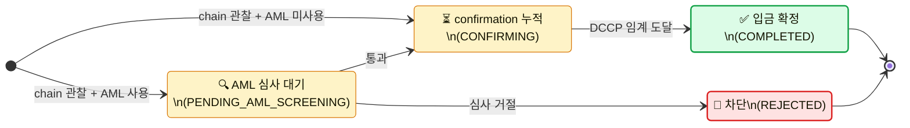
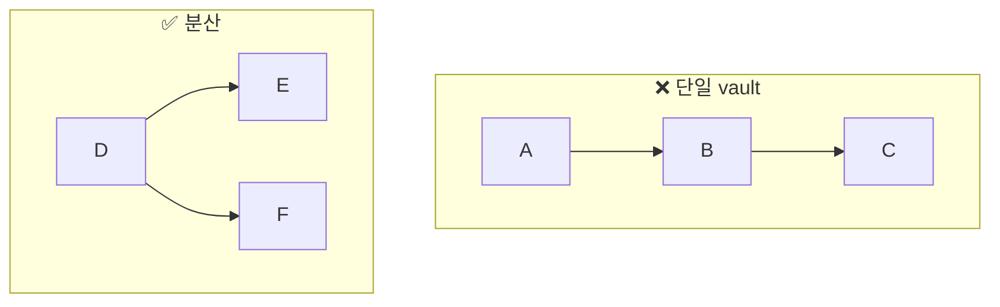
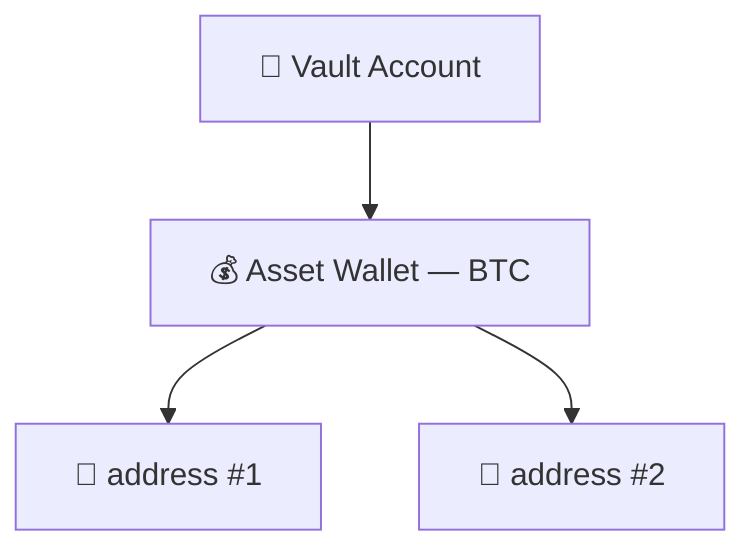

# Mermaid 도식 규약

## 색 팔레트 (classDef)

본 docs-site 의 표준 색. classDef 만 정의하면 동일한 시각 언어가 모든 도식에 일관:

```
classDef good fill:#dcfce7,stroke:#16a34a,stroke-width:2px;   /* 정상 완료 — 초록 */
classDef bad  fill:#fee2e2,stroke:#dc2626,stroke-width:2px;   /* 차단/실패/취소 — 빨강 */
classDef wait fill:#fef3c7,stroke:#d97706;                    /* 진행 중 — 노랑 */
classDef special fill:#e0e7ff,stroke:#6366f1;                 /* 특수 종착 — 파랑 */
classDef vault fill:#dbeafe,stroke:#2563eb,stroke-width:1.5px; /* 자산 보관 단위 — 파랑 */
classDef addr fill:#dcfce7,stroke:#16a34a;                    /* 주소 — 초록 */
classDef tag fill:#fce7f3,stroke:#db2777;                     /* tag/memo — 분홍 */
classDef stuck fill:#fef3c7,stroke:#d97706;                   /* 정체된 노드 — 주황 */
```

색이 표현하는 의미가 도식마다 흔들리지 않도록 (good 이 어디서는 초록, 어디서는 파랑이 되지 않도록) 위 표준을 따른다.

### 층(layer) 구분 변형 — 컴포넌트 맵 도식 한정

state machine 이 아니라 **컴포넌트/아키텍처 맵** 도식에서는 같은 hex 를 "층 소속" 의미로 전용한다 (`docs-site/wallet-service-components/` 가 이 관례를 사이트 전체에서 일관 사용):

```
classDef ext fill:#f5f5f7,stroke:#86868b;   /* 외부 시스템 (클라이언트·노드·외부 서명자 등) — 회색 */
classDef svc fill:#dcfce7,stroke:#16a34a;   /* 우리 것 (지갑 서비스 백엔드 등 벤더 무관 층) — 초록 */
classDef adp fill:#dbeafe,stroke:#2563eb;   /* 벤더가 채우는 층 (체인 엔진·어댑터) — 파랑 */
classDef port fill:#e0e7ff,stroke:#6366f1;  /* 인터페이스/포트 — 인디고 */
```

한 사이트 안에서는 상태 팔레트든 층 팔레트든 **하나의 의미 체계로 일관**해야 하고, 두 의미를 같은 도식에 섞지 않는다. 캡션에 색 분류 설명을 반드시 단다.

## Direction

- **단일 흐름 (state machine, lifecycle)**: `direction LR` — 왼쪽에서 오른쪽으로 읽음
- **비교 도식 (단일 vs 분산 같은 좌우 비교)**: outer `flowchart TB` + 각 subgraph 안 `direction LR` (패널이 위/아래로 쌓이고 각 패널 내부는 좌→우)
- 위에서 아래 (TB) 흐름은 가독성 떨어지므로 가능한 LR 권장

## 노드 라벨 형식

기본:

```
state "✅ 입금 확정\n(COMPLETED)\n자금 사용 가능" as Done
```

3 줄 구성:
1. 이모지 + 한글 의미 ("✅ 입금 확정")
2. 영문 status code ("(COMPLETED)") — 영문 ENUM/API 와 일치
3. (선택) 한 줄 부연 ("자금 사용 가능")

이모지 매핑 (가독성):
- ✅ 완료 · ❌ 실패 · 🚫 차단/거절 · ↩️ 취소 · ⏳ 대기 · 📡 송신 · 🔍 심사 · 🛡️ 승인 대기 · ✍️ 서명 · 📨 외부 확인 · 🖊️ 특수 종착 · 📝 시작/요청 · 🏦 vault · 💰 wallet · 📍 address · 🏷️ tag

`<br/>` 사용 가능 (flowchart 와 stateDiagram-v2 양쪽). state diagram 의 quoted state 라벨에서는 `\n` 도 안전.

## Caption

모든 diagram 아래 `<span class="diagram-caption">` 으로 캡션:

```html
<span class="diagram-caption">Figure N. [도식 제목]. [색 분류 설명: 노란 박스=진행 중, 초록=성공, 빨강=실패]. [핵심 전이 요약]. [주의 사항 / 특수 케이스].</span>
```

캡션이 갖춰야 할 4 요소:
1. Figure 번호 + 제목
2. 색 분류 어떻게 읽는지
3. 핵심 path 요약 (정상 흐름)
4. 함정 / 예외 / 시간 제약 등

## State diagram (lifecycle / flow)



## Flowchart (구조 / 비교)



비교 도식의 subgraph 제목에 ❌ / ✅ 사용해서 안티패턴 vs 권장 패턴 즉시 식별.

## 관계 도식 (vault → wallet → address 등)



이모지로 계층의 의미 즉시 전달.

## Entity 보존 (BeautifulSoup 후처리 시 주의)

`<pre class="mermaid">` 안의 `-->`, `&`, `<br/>` 가 BS4 의 HTML 표준화로 `--&gt;`, `&amp;`, `</br>` 으로 깨지면 mermaid 가 parsing 실패.

처리 패턴:
1. BS4 parse 전 `<pre class="mermaid">` 블록을 placeholder 로 치환
2. BS4 수정 작업 수행
3. 결과 HTML 에 placeholder 자리에 원본 mermaid 블록 복원

scripts/check-consistency.py 가 사후 검증 (잔존 `&gt;` / `&amp;` / `</br>` 0 개).

## Caption / heading 가독성

도식이 너무 길어 화면을 넘으면 fullscreen 버튼이 자동 부착되어 있음 (assets/app.js 의 `setupFullscreenButtons()`). 별도 작업 불필요.

## 도식 중복 방지

여러 페이지에서 같은 개념의 도식을 그리지 말 것. 한 곳에서 정식 정의하고 다른 페이지는 cross-ref:

```html
<p>시각화는 <a href="other-page.html#section">X. Y 페이지</a> 의 "Z" 절 참조.</p>
```

## Cross-cutting cluster — ERD + 시퀀스 다이어그램 권장

2 개 이상의 페이지가 도메인 cluster 를 이루고 다음 조건 중 하나를 만족하면, 단순 cross-ref 만으로는 부족하고 **통합 도식 (ERD + 시퀀스)** 을 적극 권장:

- 두 페이지 schema 의 FK 가 5 개 이상 cross-cut
- 동일 lifecycle event 가 양쪽 페이지의 schema 를 동시에 건드림 (예: API user 추가가 users + api_keys + csrs + admin_quorums 4 테이블에 동시 작동)
- reader 가 자기 시스템에 mapping 하려면 두 페이지를 머릿속에서 합성해야 함

### 패턴

1. **ERD (Entity-Relationship Diagram) 1 장** — cluster 의 모든 테이블 + 외부 참조 1 회로 묶음. mermaid `flowchart TB` + subgraph (페이지 별 그룹) + classDef 색 분리 (외부 참조 / 도메인 A / 도메인 B / append-only 이력)
2. **시퀀스 다이어그램 N 개** — cluster 의 대표 운영 흐름 (보통 2~3 개). mermaid `sequenceDiagram` + `autonumber` + `alt/else` 분기 + Note 박스로 분기 조건 설명
3. **배치**: ERD 는 cluster 의 "anchor" 페이지 (가장 central 한 entity 가 있는 페이지) 상단, 시퀀스는 자격증명/credential 같은 "운영" 페이지 끝 "Putting it together" 절
4. 양쪽 페이지 사이에 cross-ref 명시 — 한쪽이 다른 쪽을 가리킴

### 예시 (이미 적용)

- 6. Users + 7. Auth Credentials cluster — Users 페이지에 ERD 1 장, Auth 페이지에 sequence 3 개 (Console 로그인 / API REST 호출 / API user 추가)
- 5. Wallets · Addresses · Asset Wallet 페이지의 vault→wallet→address 관계도 (단일 페이지 내부 cluster)

### 시퀀스 다이어그램 규약

- `autonumber` — step 번호 자동 부여 (caption 에서 참조 가능)
- actor 와 participant 모두 이모지 + 한글 의미 + 영문 식별자 (예: `actor User as 👤 Console user`)
- 분기는 `alt ... else ... end` 블록 활용 — 분기 조건을 라벨에 명시
- 검증/계산 같은 self-loop 은 `Auth->>Auth: ...` 로 표현 가능 (4-level 보안 체크 같은 cascade 가독성 ↑)
- `Note over A,B: ...` 로 흐름의 핵심 invariant 강조

ASCII art tree 같은 텍스트 도식은 mermaid 가 더 정확/예쁨 → 가능하면 mermaid 로.
