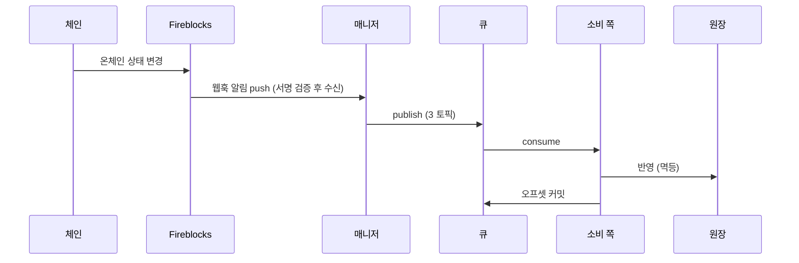

# Blockchain Manager API

`v0.1.1`

블록체인 매니저는 사내의 별도 서비스로, 온체인 거래(노드 연동)를 담당한다.
호출 쪽 백엔드(Service·Admin)는 이 HTTP API 로 계정·주소·잔액·거래를 다루고,
온체인 상태 변경은 메시지 큐 이벤트로 받는다.

아래 규약은 **모든 엔드포인트에 공통** 적용된다.

## 응답 형식

성공·목록·에러 모두 같은 구조로 돌려준다. `meta.requestId` 로 요청을 추적한다.

단일 리소스:

```json
{
  "data": {
    "accountType": "CUSTOMER",
    "ref": "000123",
    "accountId": "acct_01H8X"
  },
  "meta": {
    "requestId": "3f9a1c2e-7b4d-4e2a-9c1f-0a2b3c4d5e6f"
  }
}
```

페이지네이션 목록:

```json
{
  "data": [
    { "txId": "tx_9f2a", "status": "FINALIZED", "amount": "1.5" }
  ],
  "meta": {
    "requestId": "3f9a1c2e-7b4d-4e2a-9c1f-0a2b3c4d5e6f"
  },
  "pagination": {
    "nextCursor": "eyJsYXN0IjoxNzUxMzM2MDAwMDAwfQ",
    "hasMore": true
  }
}
```

에러:

```json
{
  "error": {
    "code": "ACCOUNT_NOT_FOUND",
    "message": "account not found"
  },
  "meta": {
    "requestId": "3f9a1c2e-7b4d-4e2a-9c1f-0a2b3c4d5e6f"
  }
}
```

## 데이터 포맷

- **시각** — ISO 8601, UTC, 밀리초. 예: `2026-07-13T04:05:06.789Z`
- **금액** — 문자열(decimal). 예: `"1.5"`. float 가 아니라 decimal 로 파싱한다.
- **필드명** — camelCase (`externalTxId` · `numOfConfirmations`)
- **요청 추적** — 모든 응답에 `meta.requestId`
- **온체인 해시** — 전파 후 채워짐(그 전엔 null), `txHash`

## 에러 코드

판단은 `error.code` 로 한다.

| 코드 | HTTP | 뜻 |
|---|---|---|
| `VALIDATION_FAILED` | 400 | 요청 형식·값이 규약에 안 맞음 |
| `ACCOUNT_NOT_FOUND` | 404 | 계정 없음 (주소 미발급과 구분) |
| `ASSET_NOT_SUPPORTED` | 400 | 우리가 지원하지 않는 (네트워크, 토큰) — 요청 형식은 맞다 |
| `NOT_FOUND` | 404 | 그 밖의 리소스 없음 |
| `CONFLICT` | 409 | 같은 멱등 키에 다른 내용이 왔다 (예: 이미 쓴 externalTxId 로 금액·목적지가 다른 제출) |
| `RELAY_REJECTED` | 502 | 대납 relay 가 전송을 못 대거나 거절 |
| `INTERNAL` | 500 | 서버 내부 오류 |

`INTERNAL`(500) 은 모든 엔드포인트에서 날 수 있어, 오퍼레이션별 응답 표기에서는 생략한다.

## 페이지네이션

목록은 **커서 방식**이다. `limit`(기본 200, 최대 500)으로 크기를 정하고, 응답 `pagination.nextCursor` 를 다음 요청 `cursor` 로 넘겨 이어받는다. 지금 이어받을 페이지가 있는지는 `hasMore` 로 판단한다 — false 면 현재 시점 마지막 페이지다.

`nextCursor` 는 **마지막 페이지에서도 항상 채워진다** — 이번 응답 마지막 항목의 다음 위치를 가리킨다. `order=asc` 조회에서는 이 커서를 보관했다가 나중에 같은 값으로 재요청하면 그 사이 새로 쌓인 내역만 이어받는다(증분 폴링). `order=desc`(기본, 최신순)는 커서가 과거 방향으로 진행하므로 페이지 순회용이다.

`cursor`/`nextCursor` 는 **불투명 토큰**이라 파싱·구성 대상이 아니며, 받은 값을 그대로 전달한다(다음 위치·필터·정렬 방향이 토큰에 담겨 있다). 커서 요청에서는 첫 요청의 조회 조건이 토큰으로 이어지므로, 함께 보낸 다른 파라미터는 무시된다.

## 인증

**없음 (2026-08-05 확정)** — 호출 쪽과 매니저는 내부망 경계를 신뢰한다. securitySchemes 를 정의하지 않는다.

## 멱등

- **계정 생성** — `createAccount` 는 (`accountType`, `ref`) 로 멱등하다. 같은 값으로 재요청하면 매니저가 같은 결과를 돌려준다(호출 쪽이 별도 멱등키를 넣지 않는다).
- **주소 발급** — `createDepositAddresses` 는 네트워크마다 `(accountId, network, token)` 로 멱등하다. 부분 실패해도 성공분은 남으므로 같은 요청을 그대로 재시도할 수 있다.
- **출금 제출** — 본문 `externalTxId` 가 멱등 키다. **같은 키로 같은 내용을 재제출하면 처음의 `txId` 를 그대로 돌려준다** — 응답을 못 받아 재시도하는 경우가 정상 경로다. 같은 키인데 **내용이 다르면** `409 CONFLICT` 다. 어느 쪽이든 벤더로 중복 전송되지 않는다.

## 이벤트 (메시지 큐)

온체인 상태 변경(입금 감지·출금 확정 등)은 이 HTTP API 가 아니라 **메시지 큐 이벤트**로 온다. 호출 쪽은 토픽별 컨슈머로 받는다.



| 토픽 | 담는 이벤트 | 파티션 키 |
|---|---|---|
| `deposit-events` | 고객 입금 (`DEPOSIT`) | 고객 accountId |
| `withdrawal-events` | 외부 출금 (`WITHDRAWAL`) | 출금 풀 vault 의 accountId |
| `internal-events` | 내부 이체 (`INTERNAL` — delta 정산만 · sweep 은 매니저 내부라 싣지 않는다) | 출발 계정 accountId |

귀속 불명 입금(매핑에 없는 주소)은 큐에 싣지 않는다 — 별도 알림 채널로 통지된다.

**ChainEvent** — 큐로 오는 이벤트 형태 (타입 [ChainEvent](#chainevent)):

```json
{
  "eventId": "0198c0de-7a2b-7c3d-8e4f-5a6b7c8d9e0f",
  "type": "WITHDRAWAL",
  "txId": "tx_9f2a",
  "txHash": "0x4e1d...ab",
  "externalTxId": "wd-260713-0042",
  "accountId": "acct_pool_02",
  "network": "ETHEREUM",
  "token": "USDC",
  "to": "0x9f...E2",
  "status": "FINALIZED",
  "numOfConfirmations": 12
}
```

- `eventId` — 이벤트 고유 id (UUID v7). **중복 제거 기준은 이 값 하나다**
- [`type`](#eventtype) — DEPOSIT · WITHDRAWAL · INTERNAL
- [`status`](#txstatus) — 공통 상태 다섯 (아래 "상태 (TxStatus) 기준"). 소비 쪽은 이것으로만 판단한다
- `txHash` — 전파 후 채워짐
- 벤더의 `subStatus`·`networkStatus` 는 이벤트에 싣지 않는다 — 매니저가 번역에 쓰는 내부 값이다

전달 보장:

- **at-least-once** — 같은 이벤트가 드물게 두 번 올 수 있다. **`eventId` 유일 기준으로 중복을 버린다** — 한 거래(txId)에서 감지·확정·실패 이벤트가 각각 오므로 `txId` 로 중복 제거하면 뒤 이벤트가 버려진다.
- **오프셋 커밋** — 원장 반영이 성공한 뒤에만.
- **순서** — 같은 계정은 파티션 키가 보장.
- **입금 시작 상태** — 입금은 `SUBMITTED` 없이 `CONFIRMED` 부터 온다 (`SUBMITTED` 는 우리가 제출하는 거래에서만 관찰).
- `REJECTED`(일시적) ≠ `FAILED`(영구). 확정(`FINALIZED`) 판정은 **매니저가** `numOfConfirmations` 를 체인별 임계와 비교해 내린다 — 컨슈머는 `status` 로만 판단한다.

## 상태 (TxStatus) 기준

거래·이벤트의 `status` 는 이 다섯이 기준이다. 벤더 원어는 매니저가 이 다섯으로 번역한다. 아래 표의 `subStatus`·`networkStatus` 열은 **매니저가 번역에 쓰는 벤더 내부 값** — 이벤트에는 `status`(TxStatus) 만 싣는다.

| 공통 상태 | 뜻 | 블록체인 상태 (Pending → Confirmed → Finalized) | 벤더(Fireblocks) 원어 | 대표 subStatus | networkStatus |
|---|---|---|---|---|---|
| `SUBMITTED` | 제출됨 — 서명·전파 준비 중, 아직 체인 미등장 (출금만 관찰) | 아직 없음 → 전파되면 Pending | PENDING_SIGNATURE · QUEUED · BROADCASTING | — | 서명 단계엔 없음 → BROADCASTING |
| `CONFIRMED` | 전파 후 체인 등장, 컨펌 누적 중 (미확정) | Confirmed — 블록에 포함, finality 전 | CONFIRMING | PENDING_BLOCKCHAIN_CONFIRMATIONS | CONFIRMING |
| `FINALIZED` | 확정 — 확정 정책(DCCP) 임계 컨펌 도달 | Finalized | COMPLETED | CONFIRMED | CONFIRMED |
| `REJECTED` | 거부·차단 — 정책·스크리닝에 막힘. 영구 실패가 아니라 사람 개입 여지 | 출금 차단은 체인에 없음 · 입금 동결은 Finalized | REJECTED · BLOCKED | AUTO_FREEZE · FROZEN_MANUALLY · REJECTED_AML_SCREENING | 출금(전파 전 차단)은 없음 · 입금 동결은 CONFIRMED |
| `FAILED` | 영구 실패 — 사유 동반 (수수료 부족·revert 등) | Pending 에서 증발 · revert 는 Confirmed 이후 | FAILED | DROPPED_BY_BLOCKCHAIN (reorg 증발) · 그 외 | FAILED (revert) · DROPPED (mempool 누락) |

판단은 다섯(`status`)으로 한다. `REJECTED`(일시적) ≠ `FAILED`(영구) 구분이 원장·화면 처리를 가른다.

이 다섯은 매니저와 호출 쪽 사이의 **계약 어휘**다 — 이 문서에 남아 있는 `CONFIRMING`·`COMPLETED` 표기는 전부 **벤더(Fireblocks) 원어**다.

- ★ **`CONFIRMED` 는 미확정이다** — 벤더 subStatus/networkStatus 의 `CONFIRMED`(임계 도달, COMPLETED 동반)와 철자가 같지만 가리키는 단계가 다르다. 확정은 `FINALIZED` 다.
- ★ **`FINALIZED` 는 체인 finality 가 아니다** — DCCP 정책 임계 도달일 뿐이고, `FINALIZED` → `FAILED`(reorg 증발, `DROPPED_BY_BLOCKCHAIN`) 전이가 존재한다. 상태에 서열을 매겨 "뒤로 가면 무시"로 구현하면 안 된다.

## API

### Accounts
계정과 입금 주소

#### `POST` https://{baseUrl}/blockchain/manage-api/accounts

**계정 생성**

vault 를 만들고 `ref ↔ accountId` 매핑을 반환한다. `ref` 는 호출 쪽 계정 ID 를 그대로 쓴다.

- (`accountType`, `ref`) 로 멱등하다 — 재요청하면 같은 `accountId` 를 돌려준다.
- 고객·시스템(운영) 계정을 같은 오퍼레이션으로 만든다. **두 유형의 ID 는 값이 겹칠 수 있어 `accountType` 이 필수**다.
- 매니저는 `ref` 를 불투명 문자열로 다루고 내용을 파싱해 분기하지 않는다.

```bash
curl -X POST "https://{baseUrl}/blockchain/manage-api/accounts" \
  -H "Content-Type: application/json" \
  -d '{
  "accountType": "CUSTOMER",
  "ref": "000123"
}'
```

_요청 본문_

```json
{
  "accountType": "CUSTOMER",
  "ref": "000123"
}
```

| 필드 | 타입 | 필수 | 설명 |
|---|---|---|---|
| `accountType` | AccountType | 필수 | `CUSTOMER` `SYSTEM` |
| `ref` | string | 필수 | 우리 참조 키 — 호출 쪽 계정 ID 그대로. 접두사가 붙지 않으므로 `accountType` 과 짝이어야 유일하다. 자리수·형식은 호출 쪽 규칙을 따른다. 초과 시 `400 VALIDATION_FAILED`. |


_응답_

`201` — 생성됨(또는 멱등 재요청)

```json
{
  "data": {
    "accountType": "CUSTOMER",
    "ref": "000123",
    "accountId": "acct_01H8X"
  },
  "meta": {
    "requestId": "3f9a1c2e-7b4d-4e2a-9c1f-0a2b3c4d5e6f"
  }
}
```

| 필드 | 타입 | 필수 | 설명 |
|---|---|---|---|
| `data` | Account | 필수 |  |
| `meta` | Meta | 필수 |  |


`400` — 요청 검증 실패

```json
{
  "error": {
    "code": "VALIDATION_FAILED",
    "message": "amount must be a decimal string"
  },
  "meta": {
    "requestId": "3f9a1c2e-7b4d-4e2a-9c1f-0a2b3c4d5e6f"
  }
}
```

| 필드 | 타입 | 필수 | 설명 |
|---|---|---|---|
| `error` | ErrorBody | 필수 |  |
| `meta` | Meta | 필수 |  |


#### `POST` https://{baseUrl}/blockchain/manage-api/accounts/{accountId}/addresses

**입금 주소 여러 자산 한 번에 발급**

한 토큰의 입금 주소를 여러 네트워크에 발급한다. `(accountId, network, token)` 로 **네트워크마다 멱등**하다.

- 계정이 없으면 `404`. 지원하지 않는 네트워크가 **하나라도 섞이면 아무것도 발급하지 않고 `400`** 이다 — 지원 여부는 발급 전에 판별된다.
- 발급을 시작한 뒤의 실패는 되돌리지 않는다(주소 발급은 취소할 수 없다). 항목의 `error` 에 담고 HTTP 는 `200` 이다.
- 응답은 **요청과 같은 순서**다. 같은 요청을 그대로 재시도하면 이미 발급된 것은 벤더 호출 없이 같은 주소가 오고 실패분만 다시 시도된다.
- 한 요청 **20네트워크**까지. 네트워크마다 벤더를 한 번 부른다.
- 네트워크 목록은 호출 쪽이 정한다 — 매니저는 토큰만 받아 네트워크를 채우지 않는다.

요청:

```json
{ "token": "USDC", "networks": ["ETHEREUM", "BASE"] }
```

**전체 성공** (`200`):

```json
{
  "data": [
    { "network": "ETHEREUM", "address": "0xAb3...C9", "memoTag": null, "error": null },
    { "network": "BASE",     "address": "0x9f4...E2", "memoTag": null, "error": null }
  ],
  "meta": { "requestId": "3f9a1c2e-7b4d-4e2a-9c1f-0a2b3c4d5e6f" }
}
```

**부분 실패** (`200`) — 성공분은 그대로 남는다. 같은 요청을 재시도하면 `BASE` 만 다시 시도된다:

```json
{
  "data": [
    { "network": "ETHEREUM", "address": "0xAb3...C9", "memoTag": null, "error": null },
    { "network": "BASE", "address": null, "memoTag": null,
      "error": { "code": "INTERNAL", "message": "vendor call failed" } }
  ],
  "meta": { "requestId": "3f9a1c2e-7b4d-4e2a-9c1f-0a2b3c4d5e6f" }
}
```

**재시도** — 위 부분 실패 뒤에 **처음과 같은 요청을 그대로** 보낸다:

```json
{ "token": "USDC", "networks": ["ETHEREUM", "BASE"] }
```

응답 (`200`) — 이미 발급된 `ETHEREUM` 은 **같은 주소**가 그대로 오고(매니저 DB 에서 찾아 돌려주므로 **벤더를 다시 부르지 않는다**), `BASE` 만 새로 시도된다:

```json
{
  "data": [
    { "network": "ETHEREUM", "address": "0xAb3...C9", "memoTag": null, "error": null },
    { "network": "BASE",     "address": "0x9f4...E2", "memoTag": null, "error": null }
  ],
  "meta": { "requestId": "7c2b8d1a-4e6f-4a3b-9d5e-1f2a3b4c5d6e" }
}
```

실패한 네트워크만 골라 `{ "token": "USDC", "networks": ["BASE"] }` 로 보내도 결과는 같다 — 응답에 `BASE` 항목 하나만 담길 뿐이다. 어느 쪽이든 이미 발급된 주소가 바뀌지 않는다.

**전체 실패** (`200`) — 발급은 시도했고 전부 실패했다. `400` 과 다르다:

```json
{
  "data": [
    { "network": "ETHEREUM", "address": null, "memoTag": null,
      "error": { "code": "INTERNAL", "message": "vendor call failed" } },
    { "network": "BASE", "address": null, "memoTag": null,
      "error": { "code": "INTERNAL", "message": "vendor call failed" } }
  ],
  "meta": { "requestId": "3f9a1c2e-7b4d-4e2a-9c1f-0a2b3c4d5e6f" }
}
```

**발급 전 거절** (`400`) — 미지원 네트워크가 섞였다. **아무것도 발급되지 않았다**:

```json
{
  "error": { "code": "ASSET_NOT_SUPPORTED", "message": "unsupported network for token: TRON/USDC" },
  "meta": { "requestId": "3f9a1c2e-7b4d-4e2a-9c1f-0a2b3c4d5e6f" }
}
```

```bash
curl -X POST "https://{baseUrl}/blockchain/manage-api/accounts/acct_01H8X/addresses" \
  -H "Content-Type: application/json" \
  -d '{
  "token": "USDC",
  "networks": [
    "ETHEREUM"
  ]
}'
```

_파라미터_

| 이름 | 위치 | 타입 | 필수 | 예시 | 설명 |
|---|---|---|---|---|---|
| `accountId` | path | string | 필수 | acct_01H8X | 매니저가 돌려준 vault 핸들 (DB ext_acnt_id = vaultAccountId) |


_요청 본문_

```json
{
  "token": "USDC",
  "networks": [
    "ETHEREUM"
  ]
}
```

| 필드 | 타입 | 필수 | 설명 |
|---|---|---|---|
| `token` | string | 필수 | 토큰 심볼 — 이 요청의 모든 네트워크에 공통 |
| `networks` | string[] | 필수 | 주소를 받을 네트워크 1~20개. 빈 배열·초과는 `400 VALIDATION_FAILED`. 같은 네트워크가 두 번 들어오면 발급은 한 번만 하고 두 항목에 같은 결과를 담는다. |


_응답_

`200` — 네트워크별 결과 (부분 성공 포함)

```json
{
  "data": [
    {
      "network": "ETHEREUM",
      "address": "0xAb3...C9",
      "memoTag": "string",
      "error": {
        "code": "ACCOUNT_NOT_FOUND",
        "message": "account not found"
      }
    }
  ],
  "meta": {
    "requestId": "3f9a1c2e-7b4d-4e2a-9c1f-0a2b3c4d5e6f"
  }
}
```

| 필드 | 타입 | 필수 | 설명 |
|---|---|---|---|
| `data` | AddressResult[] | 필수 | 요청과 같은 순서의 네트워크별 결과 |
| `meta` | Meta | 필수 |  |


`400` — 요청 검증 실패

```json
{
  "error": {
    "code": "VALIDATION_FAILED",
    "message": "amount must be a decimal string"
  },
  "meta": {
    "requestId": "3f9a1c2e-7b4d-4e2a-9c1f-0a2b3c4d5e6f"
  }
}
```

| 필드 | 타입 | 필수 | 설명 |
|---|---|---|---|
| `error` | ErrorBody | 필수 |  |
| `meta` | Meta | 필수 |  |


`404` — 계정 없음

```json
{
  "error": {
    "code": "ACCOUNT_NOT_FOUND",
    "message": "account not found"
  },
  "meta": {
    "requestId": "3f9a1c2e-7b4d-4e2a-9c1f-0a2b3c4d5e6f"
  }
}
```

| 필드 | 타입 | 필수 | 설명 |
|---|---|---|---|
| `error` | ErrorBody | 필수 |  |
| `meta` | Meta | 필수 |  |


#### `GET` https://{baseUrl}/blockchain/manage-api/accounts/{accountId}/addresses

**발급된 입금 주소 조회**

그 계정에 발급된 입금 주소를 돌려준다 — 매니저 DB 를 읽을 뿐 벤더 왕복이 없다.

`token` · `network` 로 걸러 받을 수 있고 둘 다 없으면 그 계정의 전체다. 같은 토큰을 여러 네트워크로 받는 고객 화면은 `token` 하나만 걸어 한 번에 받는다.

**미발급은 배열에 담기지 않는다** — 계정은 있는데 주소가 없으면 빈 배열이고, 계정 자체가 없으면 `404` 다. 발급(`POST`)과 경로가 같아 메서드만 다르다.

```bash
curl "https://{baseUrl}/blockchain/manage-api/accounts/acct_01H8X/addresses?token=USDC&network=BASE"
```

_파라미터_

| 이름 | 위치 | 타입 | 필수 | 예시 | 설명 |
|---|---|---|---|---|---|
| `accountId` | path | string | 필수 | acct_01H8X | 매니저가 돌려준 vault 핸들 (DB ext_acnt_id = vaultAccountId) |
| `token` | query | string | - | USDC | 토큰 심볼로 거른다 (선택) |
| `network` | query | string | - | BASE | 네트워크 코드로 거른다 (선택) |


_응답_

`200` — 발급된 주소 목록 (미발급이면 빈 배열)

```json
{
  "data": [
    {
      "network": "BASE",
      "token": "USDC",
      "address": "0xAb3...C9",
      "memoTag": "string"
    }
  ],
  "meta": {
    "requestId": "3f9a1c2e-7b4d-4e2a-9c1f-0a2b3c4d5e6f"
  }
}
```

| 필드 | 타입 | 필수 | 설명 |
|---|---|---|---|
| `data` | DepositAddress[] | 필수 | 발급된 주소 목록 — 미발급은 담기지 않는다 |
| `meta` | Meta | 필수 |  |


`404` — 계정 없음

```json
{
  "error": {
    "code": "ACCOUNT_NOT_FOUND",
    "message": "account not found"
  },
  "meta": {
    "requestId": "3f9a1c2e-7b4d-4e2a-9c1f-0a2b3c4d5e6f"
  }
}
```

| 필드 | 타입 | 필수 | 설명 |
|---|---|---|---|
| `error` | ErrorBody | 필수 |  |
| `meta` | Meta | 필수 |  |


### Balances
잔액 조회

#### `GET` https://{baseUrl}/blockchain/manage-api/accounts/{accountId}/balances

**vault 잔액 조회**

벤더가 보는 **vault 잔액** — 대사 재료이지 고객별 귀속 잔액이 아니다.

- `network` · `token` 으로 거른다. 둘 다 없으면 **그 계정에 주소가 발급된 자산 전부**다.
- **주소 없이 vault 에 들어온 자산은 나오지 않는다** — 매니저가 아는 자산 집합이 발급 기록뿐이다.
- 자산마다 벤더를 한 번 부른다.

```bash
curl "https://{baseUrl}/blockchain/manage-api/accounts/acct_01H8X/balances?network=BASE&token=USDC"
```

_파라미터_

| 이름 | 위치 | 타입 | 필수 | 예시 | 설명 |
|---|---|---|---|---|---|
| `accountId` | path | string | 필수 | acct_01H8X | 매니저가 돌려준 vault 핸들 (DB ext_acnt_id = vaultAccountId) |
| `network` | query | string | - | BASE | 네트워크 코드로 거른다 (선택) |
| `token` | query | string | - | USDC | 토큰 심볼로 거른다 (선택) |


_응답_

`200` — 자산별 잔액 (해당 자산이 없으면 빈 배열)

```json
{
  "data": [
    {
      "network": "BASE",
      "token": "USDC",
      "available": "10.5",
      "pending": "1.0",
      "locked": "0.3"
    }
  ],
  "meta": {
    "requestId": "3f9a1c2e-7b4d-4e2a-9c1f-0a2b3c4d5e6f"
  }
}
```

| 필드 | 타입 | 필수 | 설명 |
|---|---|---|---|
| `data` | AssetBalance[] | 필수 | 자산별 잔액 — 요청 필터에 걸린 것만 |
| `meta` | Meta | 필수 |  |


`404` — 계정 없음

```json
{
  "error": {
    "code": "ACCOUNT_NOT_FOUND",
    "message": "account not found"
  },
  "meta": {
    "requestId": "3f9a1c2e-7b4d-4e2a-9c1f-0a2b3c4d5e6f"
  }
}
```

| 필드 | 타입 | 필수 | 설명 |
|---|---|---|---|
| `error` | ErrorBody | 필수 |  |
| `meta` | Meta | 필수 |  |


### Transactions
수수료 견적·출금 제출·거래 조회

#### `POST` https://{baseUrl}/blockchain/manage-api/transactions

**출금 제출**

출금(또는 내부 이체)을 제출한다. 응답은 벤더 tx id(`txId`)이고 상태 진행은 큐 이벤트로 따라간다(Events).

- `externalTxId` 가 멱등 키다. **같은 키 + 같은 내용**을 다시 보내면 처음의 `txId` 를 돌려주므로 **재시도가 안전**하다.
- 같은 키인데 **내용이 다르면** `409` 다.
- 제출한 건은 `GET /transactions/external/{externalTxId}` 로 찾는다 — 출금은 출금 풀 vault 에서 나가 계정별 목록에는 없다.

```bash
curl -X POST "https://{baseUrl}/blockchain/manage-api/transactions" \
  -H "Content-Type: application/json" \
  -d '{
  "externalTxId": "wd-260713-0042",
  "from": {
    "type": "ACCOUNT",
    "accountId": "acct_pool_02"
  },
  "to": {
    "type": "ADDRESS",
    "address": "0x9f...E2"
  },
  "network": "ETHEREUM",
  "token": "USDC",
  "amount": "1.5",
  "note": null,
  "travelRule": null
}'
```

_요청 본문_

```json
{
  "externalTxId": "wd-260713-0042",
  "from": {
    "type": "ACCOUNT",
    "accountId": "acct_pool_02"
  },
  "to": {
    "type": "ADDRESS",
    "address": "0x9f...E2"
  },
  "network": "ETHEREUM",
  "token": "USDC",
  "amount": "1.5",
  "note": null,
  "travelRule": null
}
```

| 필드 | 타입 | 필수 | 설명 |
|---|---|---|---|
| `externalTxId` | string | 필수 | 우리 요청 키 — 승인 완료된 출금 지시 1건과 1:1. 재제출 중복 차단·완료 대응. 초과 시 `400 VALIDATION_FAILED`. |
| `from` | TransferPeer | 필수 | 보내는 쪽 — type=ACCOUNT 만 허용 |
| `to` | TransferPeer | 필수 | 목적지 |
| `network` | string | 필수 | 네트워크 코드 |
| `token` | string | 필수 | 토큰 심볼 |
| `amount` | string | 필수 | 금액(문자열 · 부동소수 금지) |
| `note` | string \\| null | - | 벤더 거래 기록 메모 |
| `travelRule` | TravelRule \\| null | - | 트래블룰 게이트가 만든 암호화 산출물 — 해외(Notabene) 출금만 싣고, 국내(VerifyVASP)·개인지갑은 null |


_응답_

`202` — 접수됨(제출)

```json
{
  "data": {
    "txId": "tx_9f2a"
  },
  "meta": {
    "requestId": "3f9a1c2e-7b4d-4e2a-9c1f-0a2b3c4d5e6f"
  }
}
```

| 필드 | 타입 | 필수 | 설명 |
|---|---|---|---|
| `data` | SubmitResult | 필수 |  |
| `meta` | Meta | 필수 |  |


`400` — 요청 검증 실패

```json
{
  "error": {
    "code": "VALIDATION_FAILED",
    "message": "amount must be a decimal string"
  },
  "meta": {
    "requestId": "3f9a1c2e-7b4d-4e2a-9c1f-0a2b3c4d5e6f"
  }
}
```

| 필드 | 타입 | 필수 | 설명 |
|---|---|---|---|
| `error` | ErrorBody | 필수 |  |
| `meta` | Meta | 필수 |  |


`409` — 상태·멱등 충돌

```json
{
  "error": {
    "code": "CONFLICT",
    "message": "externalTxId already used"
  },
  "meta": {
    "requestId": "3f9a1c2e-7b4d-4e2a-9c1f-0a2b3c4d5e6f"
  }
}
```

| 필드 | 타입 | 필수 | 설명 |
|---|---|---|---|
| `error` | ErrorBody | 필수 |  |
| `meta` | Meta | 필수 |  |


`502` — relay 가 전송을 대지 못함·거절 (대납 구성)

```json
{
  "error": {
    "code": "RELAY_REJECTED",
    "message": "relay refused to sponsor gas"
  },
  "meta": {
    "requestId": "3f9a1c2e-7b4d-4e2a-9c1f-0a2b3c4d5e6f"
  }
}
```

| 필드 | 타입 | 필수 | 설명 |
|---|---|---|---|
| `error` | ErrorBody | 필수 |  |
| `meta` | Meta | 필수 |  |


#### `GET` https://{baseUrl}/blockchain/manage-api/transactions/external/{externalTxId}

**우리 요청 키로 거래 조회**

`externalTxId` 로 제출한 건을 찾는다. 출금은 고객 계정이 아니라 **출금 풀 vault 에서 나가므로** 계정별 목록 조회로는 찾을 수 없다 — 호출 쪽이 자기 출금을 아는 유일한 키가 `externalTxId` 라 이 경로가 필요하다.

제출 응답을 못 받았을 때의 확인, 그리고 대사에서 우리 기록과 벤더 기록을 잇는 데 쓴다.

```bash
curl "https://{baseUrl}/blockchain/manage-api/transactions/external/wd-260713-0042"
```

_파라미터_

| 이름 | 위치 | 타입 | 필수 | 예시 | 설명 |
|---|---|---|---|---|---|
| `externalTxId` | path | string | 필수 | wd-260713-0042 | 제출할 때 실은 우리 요청 키 |


_응답_

`200` — 조회 결과

```json
{
  "data": {
    "txId": "tx_9f2a",
    "txHash": "0x4e1d...ab",
    "externalTxId": "wd-260713-0042",
    "network": "ETHEREUM",
    "token": "USDC",
    "amount": "1.5",
    "from": "0xA1...C9",
    "to": "0x9f...E2",
    "status": "FINALIZED",
    "numOfConfirmations": 12,
    "createdAt": "2026-07-13T04:05:06.789Z",
    "lastUpdated": "2026-07-13T04:06:10.120Z"
  },
  "meta": {
    "requestId": "3f9a1c2e-7b4d-4e2a-9c1f-0a2b3c4d5e6f"
  }
}
```

| 필드 | 타입 | 필수 | 설명 |
|---|---|---|---|
| `data` | Transfer | 필수 |  |
| `meta` | Meta | 필수 |  |


`404` — 리소스 없음

```json
{
  "error": {
    "code": "NOT_FOUND",
    "message": "transaction not found"
  },
  "meta": {
    "requestId": "3f9a1c2e-7b4d-4e2a-9c1f-0a2b3c4d5e6f"
  }
}
```

| 필드 | 타입 | 필수 | 설명 |
|---|---|---|---|
| `error` | ErrorBody | 필수 |  |
| `meta` | Meta | 필수 |  |


#### `GET` https://{baseUrl}/blockchain/manage-api/transactions/{txId}

**거래 단건 조회**

벤더 tx id(`txId`)로 거래 1건을 조회한다. `txId` 는 출금 제출 응답이나 큐 이벤트에서 얻는다.

```bash
curl "https://{baseUrl}/blockchain/manage-api/transactions/tx_9f2a"
```

_파라미터_

| 이름 | 위치 | 타입 | 필수 | 예시 | 설명 |
|---|---|---|---|---|---|
| `txId` | path | string | 필수 | tx_9f2a | 벤더 tx id |


_응답_

`200` — 거래

```json
{
  "data": {
    "txId": "tx_9f2a",
    "txHash": "0x4e1d...ab",
    "externalTxId": "wd-260713-0042",
    "network": "ETHEREUM",
    "token": "USDC",
    "amount": "1.5",
    "from": "0xA1...C9",
    "to": "0x9f...E2",
    "status": "FINALIZED",
    "numOfConfirmations": 12,
    "createdAt": "2026-07-13T04:05:06.789Z",
    "lastUpdated": "2026-07-13T04:06:10.120Z"
  },
  "meta": {
    "requestId": "3f9a1c2e-7b4d-4e2a-9c1f-0a2b3c4d5e6f"
  }
}
```

| 필드 | 타입 | 필수 | 설명 |
|---|---|---|---|
| `data` | Transfer | 필수 |  |
| `meta` | Meta | 필수 |  |


`404` — 리소스 없음

```json
{
  "error": {
    "code": "NOT_FOUND",
    "message": "transaction not found"
  },
  "meta": {
    "requestId": "3f9a1c2e-7b4d-4e2a-9c1f-0a2b3c4d5e6f"
  }
}
```

| 필드 | 타입 | 필수 | 설명 |
|---|---|---|---|
| `error` | ErrorBody | 필수 |  |
| `meta` | Meta | 필수 |  |


#### `GET` https://{baseUrl}/blockchain/manage-api/accounts/{accountId}/transactions

**거래 목록 조회**

거래 이력을 **거래 시각(createdAt) 기준**으로 조회한다 — 기본 최신순, `order=asc` 면 과거→최신. 기간(`after`/`before`)·상태로 좁히고 커서로 페이지네이션한다.
`order=asc` + `before` 생략 조합이면 마지막 `nextCursor` 를 보관했다가 재요청해 새로 쌓인 내역만 이어받는 증분 폴링이 된다.
상태 변경 실시간 감지는 이 목록이 아니라 이벤트 큐가 담당한다(매니저의 웹훅 감지와 별개).

```bash
curl "https://{baseUrl}/blockchain/manage-api/accounts/acct_01H8X/transactions?after=2026-07-01T00:00:00.000Z&before=2026-07-13T00:00:00.000Z&order=desc&status=FINALIZED&limit=200&cursor=eyJsYXN0IjoxNzUxMzM2MDAwMDAwfQ"
```

_파라미터_

| 이름 | 위치 | 타입 | 필수 | 예시 | 설명 |
|---|---|---|---|---|---|
| `accountId` | path | string | 필수 | acct_01H8X | 매니저가 돌려준 vault 핸들 (DB ext_acnt_id = vaultAccountId) |
| `after` | query | string (ISO 8601) | 필수 | 2026-07-01T00:00:00.000Z | 시작 시각 — 거래 시각(createdAt) 기준 (ISO 8601 UTC) |
| `before` | query | string (ISO 8601) | - | 2026-07-13T00:00:00.000Z | 종료 시각 — 거래 시각(createdAt) 기준 (ISO 8601 UTC). 생략하면 상한 없음 — 증분 폴링(`order=asc`) 조회는 생략한다. |
| `order` | query | string | - | desc | 정렬 방향 — 거래 시각(createdAt) 기준. 기본 desc(최신순). 마지막 커서를 보관해 새 내역을 이어받는 증분 폴링은 `asc` 조회에서만 성립한다. |
| `status` | query | TxStatus | - | FINALIZED | 상태 필터 (선택) |
| `limit` | query | integer | - | 200 | 페이지 크기 — 기본 200, 최대 500 (벤더 한도). 1 미만이거나 500 초과면 `400 VALIDATION_FAILED`. |
| `cursor` | query | string | - | eyJsYXN0IjoxNzUxMzM2MDAwMDAwfQ | 다음 위치 커서 — 이전 응답의 `pagination.nextCursor` 를 그대로 넣는다. 불투명 토큰이라 직접 만들거나 해석하지 않는다. 첫 요청엔 생략. cursor 가 있으면 조회 조건은 토큰이 우선이라 함께 보낸 `after`/`before`·`status`·`order`·`limit` 는 무시된다. |


_응답_

`200` — 거래 목록

```json
{
  "data": [
    {
      "txId": "tx_9f2a",
      "txHash": "0x4e1d...ab",
      "externalTxId": "wd-260713-0042",
      "network": "ETHEREUM",
      "token": "USDC",
      "amount": "1.5",
      "from": "0xA1...C9",
      "to": "0x9f...E2",
      "status": "FINALIZED",
      "numOfConfirmations": 12,
      "createdAt": "2026-07-13T04:05:06.789Z",
      "lastUpdated": "2026-07-13T04:06:10.120Z"
    }
  ],
  "meta": {
    "requestId": "3f9a1c2e-7b4d-4e2a-9c1f-0a2b3c4d5e6f"
  },
  "pagination": {
    "nextCursor": "eyJsYXN0IjoxNzUxMzM2MDAwMDAwfQ",
    "hasMore": true
  }
}
```

| 필드 | 타입 | 필수 | 설명 |
|---|---|---|---|
| `data` | Transfer[] | 필수 |  |
| `meta` | Meta | 필수 |  |
| `pagination` | Pagination | 필수 |  |


`400` — 요청 검증 실패

```json
{
  "error": {
    "code": "VALIDATION_FAILED",
    "message": "amount must be a decimal string"
  },
  "meta": {
    "requestId": "3f9a1c2e-7b4d-4e2a-9c1f-0a2b3c4d5e6f"
  }
}
```

| 필드 | 타입 | 필수 | 설명 |
|---|---|---|---|
| `error` | ErrorBody | 필수 |  |
| `meta` | Meta | 필수 |  |


`404` — 계정 없음

```json
{
  "error": {
    "code": "ACCOUNT_NOT_FOUND",
    "message": "account not found"
  },
  "meta": {
    "requestId": "3f9a1c2e-7b4d-4e2a-9c1f-0a2b3c4d5e6f"
  }
}
```

| 필드 | 타입 | 필수 | 설명 |
|---|---|---|---|
| `error` | ErrorBody | 필수 |  |
| `meta` | Meta | 필수 |  |


## 타입

### Meta

| 필드 | 타입 | 필수 | 설명 |
|---|---|---|---|
| `requestId` | string | 필수 | 요청 추적 id (모든 응답에 포함) |


### Pagination

| 필드 | 타입 | 필수 | 설명 |
|---|---|---|---|
| `nextCursor` | string | 필수 | 다음 위치 커서 (불투명 토큰) — 다음 요청 `cursor` 로 그대로 전달. 마지막 페이지에서도 항상 채워지며, `order=asc` 조회면 보관해 뒀다가 이후 새로 쌓인 내역을 이어받는 시작점(증분 폴링)으로 쓴다. |
| `hasMore` | boolean | 필수 | 지금 이어받을 다음 페이지가 있는지 — false 면 현재 시점 마지막 페이지 |


### ErrorBody

| 필드 | 타입 | 필수 | 설명 |
|---|---|---|---|
| `code` | string | 필수 | 에러 코드 (API Conventions 표 참조) |
| `message` | string | 필수 | 사람이 읽는 설명 — 분기 판단은 `code` 로 한다 |


### ErrorResponse

| 필드 | 타입 | 필수 | 설명 |
|---|---|---|---|
| `error` | ErrorBody | 필수 |  |
| `meta` | Meta | 필수 |  |


### Account

| 필드 | 타입 | 필수 | 설명 |
|---|---|---|---|
| `accountType` | AccountType | 필수 | `CUSTOMER` `SYSTEM` |
| `ref` | string | 필수 | 우리 참조 키 — 호출 쪽 계정 ID 그대로. 접두사는 붙지 않는다 |
| `accountId` | string | 필수 | 매니저가 돌려주는 vault 핸들 (DB ext_acnt_id = vaultAccountId) |


### Transfer

거래 1건. 요청의 `from`/`to`(TransferPeer)는 여기선 확정된 온체인 주소 문자열로 나온다.

| 필드 | 타입 | 필수 | 설명 |
|---|---|---|---|
| `txId` | string | 필수 | 벤더 tx id |
| `txHash` | string \\| null | - | 온체인 거래해시 — 전파 후 채워짐 |
| `externalTxId` | string \\| null | - | 우리 요청 키 |
| `network` | string | 필수 | 네트워크 코드 |
| `token` | string | 필수 | 토큰 심볼 |
| `amount` | string | 필수 | 금액(문자열) |
| `from` | string | 필수 | 발신 (확정 온체인 주소) |
| `to` | string | 필수 | 목적지 (확정 온체인 주소) |
| `status` | TxStatus | 필수 | `SUBMITTED` `CONFIRMED` `FINALIZED` `REJECTED` `FAILED` |
| `numOfConfirmations` | integer | 필수 | 누적 컨펌 수 |
| `createdAt` | string (ISO 8601) | 필수 | 거래 생성 시각 (목록 정렬·기간 필터 기준) |
| `lastUpdated` | string (ISO 8601) | 필수 | 마지막 상태 변경 시각 |


### ChainEvent

큐로 오는 온체인 상태 변경 이벤트 (HTTP 응답이 아니라 메시지 큐로 전달).

| 필드 | 타입 | 필수 | 설명 |
|---|---|---|---|
| `eventId` | string | 필수 | 이벤트 고유 id (UUID v7) — 컨슈머 중복 제거 기준 |
| `type` | EventType | 필수 | `DEPOSIT` `WITHDRAWAL` `INTERNAL` |
| `txId` | string | 필수 | 벤더 tx id |
| `txHash` | string \\| null | - | 온체인 거래해시 — 전파 후 채워짐 |
| `externalTxId` | string \\| null | - | 우리 요청 키 (출금·내부이체) |
| `accountId` | string | 필수 | 파티션 키 (vault 핸들) |
| `network` | string | 필수 | 네트워크 코드 |
| `token` | string | 필수 | 토큰 심볼 |
| `to` | string | 필수 | 목적지 주소 — 입금 판별 |
| `status` | TxStatus | 필수 | `SUBMITTED` `CONFIRMED` `FINALIZED` `REJECTED` `FAILED` |
| `numOfConfirmations` | integer | 필수 | 누적 컨펌 수 |


### TxStatus

공통 상태 다섯 — 매니저와 호출 쪽 사이의 계약 어휘 (벤더 원어와 구분).

| 값 | 설명 |
|---|---|
| `SUBMITTED` | 제출 — 체인 미등장 |
| `CONFIRMED` | 체인 등장·컨펌 누적 (미확정 — 확정은 FINALIZED) |
| `FINALIZED` | 확정 — DCCP 임계 도달 (체인 finality 아님 — reorg 시 FAILED 전이 존재) |
| `REJECTED` | 거부·차단 (일시적) |
| `FAILED` | 영구 실패 |


### AccountType

계정 유형 — `ref` 가 어느 ID 공간의 값인지 가린다. 접두사가 없어 두 유형의 ID 값이 겹칠 수 있다.

| 값 | 설명 |
|---|---|
| `CUSTOMER` | 고객 계정 |
| `SYSTEM` | 시스템(운영) 계정 |


### EventType

이벤트 분류. 매니저가 발신자가 우리 vault 인지로 가른다. 귀속 불명 입금은 큐 대신 별도 알림 채널로 통지된다.

| 값 | 설명 |
|---|---|
| `DEPOSIT` | 고객 입금 (매핑된 주소로 수신) |
| `WITHDRAWAL` | 외부 출금 |
| `INTERNAL` | 내부 이체 — delta 정산 (sweep 은 매니저 내부 처리라 이벤트에 실리지 않는다) |


### SubmitResult

| 필드 | 타입 | 필수 | 설명 |
|---|---|---|---|
| `txId` | string | 필수 | 벤더 tx id |


### CreateAccountRequest

| 필드 | 타입 | 필수 | 설명 |
|---|---|---|---|
| `accountType` | AccountType | 필수 | `CUSTOMER` `SYSTEM` |
| `ref` | string | 필수 | 우리 참조 키 — 호출 쪽 계정 ID 그대로. 접두사가 붙지 않으므로 `accountType` 과 짝이어야 유일하다. 자리수·형식은 호출 쪽 규칙을 따른다. 초과 시 `400 VALIDATION_FAILED`. |


### TransactionRequest

| 필드 | 타입 | 필수 | 설명 |
|---|---|---|---|
| `externalTxId` | string | 필수 | 우리 요청 키 — 승인 완료된 출금 지시 1건과 1:1. 재제출 중복 차단·완료 대응. 초과 시 `400 VALIDATION_FAILED`. |
| `from` | TransferPeer | 필수 | 보내는 쪽 — type=ACCOUNT 만 허용 |
| `to` | TransferPeer | 필수 | 목적지 |
| `network` | string | 필수 | 네트워크 코드 |
| `token` | string | 필수 | 토큰 심볼 |
| `amount` | string | 필수 | 금액(문자열 · 부동소수 금지) |
| `note` | string \\| null | - | 벤더 거래 기록 메모 |
| `travelRule` | TravelRule \\| null | - | 트래블룰 게이트가 만든 암호화 산출물 — 해외(Notabene) 출금만 싣고, 국내(VerifyVASP)·개인지갑은 null |


### TransferPeer

벤더 TransferPeerPath 대응. from·to 공통. type 에 따라 필요한 식별 필드가 정해진다.

| 필드 | 타입 | 필수 | 설명 |
|---|---|---|---|
| `type` | PeerType | 필수 | `ADDRESS` `ACCOUNT` `WHITELISTED` |
| `address` | string \\| null | - | 온체인 주소 (type=ADDRESS 일 때 필수) |
| `accountId` | string \\| null | - | 우리 계정 (type=ACCOUNT 일 때 필수) |
| `walletId` | string \\| null | - | 사전 등록 지갑 id (type=WHITELISTED 일 때 필수) |


### PeerType

| 값 | 설명 |
|---|---|
| `ADDRESS` | 온체인 주소 (외부 출금 → ONE_TIME_ADDRESS) |
| `ACCOUNT` | 우리 계정 (내부 이동 → VAULT_ACCOUNT) |
| `WHITELISTED` | 사전 등록 지갑 (→ EXTERNAL_WALLET) |


### TravelRule

트래블룰 게이트가 만든 **암호화 산출물**이다. 이 API(매니저)는 운반만 하고
내용을 파싱하지 않으므로, 여기서는 내부 구조를 펼치지 않고 불투명한 객체로 둔다.

- 실제 구조의 기준은 **IVMS101 표준 + 트래블룰 솔루션 스펙**(게이트 쪽 문서)이다.
- 시나리오별로 실림 여부가 다르다 — 해외(Notabene)=메시지 있음, 국내(VerifyVASP)·개인지갑=없음(`null`).
- 컴플라이언스가 내보내는 `travelRuleMessage`(암호화 문자열)를 호출 쪽이 이 필드로 실어 보낸다 — 정확한 형태는 구현 때 확정.

### AccountResponse

| 필드 | 타입 | 필수 | 설명 |
|---|---|---|---|
| `data` | Account | 필수 |  |
| `meta` | Meta | 필수 |  |


### CreateAddressesRequest

| 필드 | 타입 | 필수 | 설명 |
|---|---|---|---|
| `token` | string | 필수 | 토큰 심볼 — 이 요청의 모든 네트워크에 공통 |
| `networks` | string[] | 필수 | 주소를 받을 네트워크 1~20개. 빈 배열·초과는 `400 VALIDATION_FAILED`. 같은 네트워크가 두 번 들어오면 발급은 한 번만 하고 두 항목에 같은 결과를 담는다. |


### AssetBalance

자산 하나의 vault 잔액. 세 칸으로 접어 돌려준다.

| 필드 | 타입 | 필수 | 설명 |
|---|---|---|---|
| `network` | string | 필수 |  |
| `token` | string | 필수 |  |
| `available` | string | 필수 | 가용 — 지금 출금에 쓸 수 있는 잔액 |
| `pending` | string | 필수 | 대기 — 들어왔지만 확정 전 |
| `locked` | string | 필수 | 잠김 — 나가는 중이거나 정책상 묶인 분 (벤더 lockedAmount + frozen) |


### AssetBalanceListResponse

| 필드 | 타입 | 필수 | 설명 |
|---|---|---|---|
| `data` | AssetBalance[] | 필수 | 자산별 잔액 — 요청 필터에 걸린 것만 |
| `meta` | Meta | 필수 |  |


### DepositAddress

발급된 입금 주소 하나.

| 필드 | 타입 | 필수 | 설명 |
|---|---|---|---|
| `network` | string | 필수 |  |
| `token` | string | 필수 |  |
| `address` | string | 필수 | 온체인 입금 주소 |
| `memoTag` | string \\| null | - | 체인이 요구하는 태그·메모 — EVM 은 null |


### DepositAddressListResponse

| 필드 | 타입 | 필수 | 설명 |
|---|---|---|---|
| `data` | DepositAddress[] | 필수 | 발급된 주소 목록 — 미발급은 담기지 않는다 |
| `meta` | Meta | 필수 |  |


### AddressResult

네트워크 하나의 결과 — 성공이면 `address`, 실패면 `error` 가 채워진다 (둘 중 하나만).

| 필드 | 타입 | 필수 | 설명 |
|---|---|---|---|
| `network` | string | 필수 |  |
| `address` | string \\| null | - | 발급된 주소 — 실패 시 null |
| `memoTag` | string \\| null | - | 체인이 요구하는 태그·메모 — EVM 은 null |
| `error` | ErrorBody \\| null | - | 실패 사유 — 성공 시 null. 코드 체계는 공통 에러 코드 표와 같다 |


### AddressesResponse

| 필드 | 타입 | 필수 | 설명 |
|---|---|---|---|
| `data` | AddressResult[] | 필수 | 요청과 같은 순서의 네트워크별 결과 |
| `meta` | Meta | 필수 |  |


### TransferResponse

| 필드 | 타입 | 필수 | 설명 |
|---|---|---|---|
| `data` | Transfer | 필수 |  |
| `meta` | Meta | 필수 |  |


### TransfersResponse

| 필드 | 타입 | 필수 | 설명 |
|---|---|---|---|
| `data` | Transfer[] | 필수 |  |
| `meta` | Meta | 필수 |  |
| `pagination` | Pagination | 필수 |  |


### SubmitResponse

| 필드 | 타입 | 필수 | 설명 |
|---|---|---|---|
| `data` | SubmitResult | 필수 |  |
| `meta` | Meta | 필수 |  |

