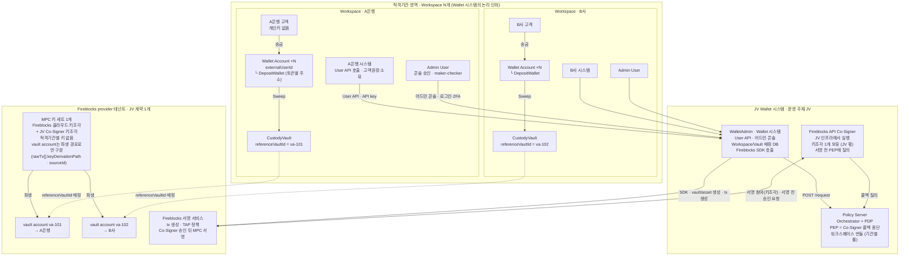
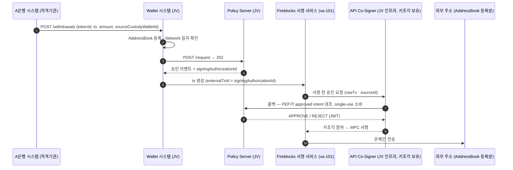

기준: 비공개 저장소 `STF-KKK/stc-design`의 `docs/wallet-system/` 문서군, Wallet 문서가 `dag-stf/wallet-isms-p`로 이관되기 직전 커밋 `65071e6`(`5986d80`의 부모). 적격기관은 Wallet 시스템을 이용하는 은행 등 고객사를 뜻한다. 질문 목록은 [Wallet 수탁 구조 질문](02-wallet-integration.md)에 있다.
"MPC 키 세트는 Fireblocks 테넌트당 하나, vault account는 파생 경로로 구분"이라는 부분만 Wallet 문서가 아니라 Fireblocks 일반 모델에서 가져온 설명이다.

## 1. 세 층의 구조

적격기관 Workspace는 Wallet 시스템 안의 논리 단위이고, Fireblocks 테넌트는 JV 하나의 계약 단위다. 둘은 CustodyVault와 vault account 사이의 id 매핑(`referenceVaultId`) 한 곳에서만 연결된다. 적격기관 쪽에는 키 자료가 없다.

## 2. 출금 한 건이 서명되는 경로

정책 관문은 2번(사전 평가)과 5번(콜백 대조) 두 곳이고, 둘 다 JV Policy Server 안에 있다. Fireblocks는 5번에서 APPROVE를 받지 못하면 서명하지 않는다. 적격기관 Admin User의 maker-checker 승인은 2번 사전 평가 안에서 정족수 obligation으로 수집된다.

## 3. 누가 무엇을 갖는가

| 항목 | 소유·운영 | 근거가 되는 문서 내용 |
| --- | --- | --- |
| 고객 계정, KYC, 고객 잔액 원장 | 적격기관 | Wallet 시스템은 externalUserId만 받는다. KYC·AML 결과는 적격기관이 "파트너"로서 JWS로 제출 |
| Workspace, Tenant, Admin User | 적격기관 (JV가 생성·초대) | JV 어드민이 Workspace를 만들고 워크스페이스 어드민을 초대하는 온보딩 시퀀스 |
| CustodyVault, AddressBook, 출금 승인 | 적격기관 Admin User | 생성 액션은 PENDING_APPROVAL → Policy 승인 → ACTIVE. AddressBook은 소유 증명으로 등록 |
| WalletAdmin, Wallet DB, Fireblocks SDK 호출 | JV | CreateVaultAccount, registerNewAsset, activateAssetForVaultAccount 호출 주체가 WalletAdmin |
| Policy Server, PEP, 콜백 서명키, AdminDB | JV | 콜백 경로 "Co-Signer → PEP → Orchestrator". AdminDB(Role, AdminUser, 2FA)도 Policy Server 소유 |
| Fireblocks 계약, 테넌트, API Co-Signer | JV | "우리 provider 테넌트에 실제 설정된 값", "provider가 우리 공개키를 설치 시점에 등록" |
| MPC 키 세트 | Fireblocks 클라우드 + JV Co-Signer | 문서는 "Fireblocks vault(MPC 일반 주소)"로만 다룬다. 테넌트당 키 세트 하나라는 점은 Fireblocks 일반 모델 |

## 4. 열린 항목

기관별 키 분리는 현재 문서 모델에 없다. 은행 규제가 자기 명의 수탁이나 키 분리를 요구하면 Workspace별 Fireblocks 테넌트 분리, 또는 적격기관이 운영하는 Co-Signer가 필요하고, 둘 다 새 결정 항목이다. 형식적 분리를 피하려면 운영 권한과 장애 도메인까지 나뉘는지가 기준이 된다.
