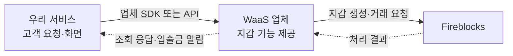

**외부 WaaS 업체의 SDK를 이용해 우리 서비스에 지갑 기능을 붙이는 경우**에 물어볼 질문이다. 대상 업체·제품명과 답변은 아직 확인되지 않았다.

**전제** — 지갑 생성·입출금·집금(sweep)·가스 대납 기능은 제공한다고 보고, 구현과 운영에 영향을 주는 조건만 확인한다. 지원 여부만 묻는 질문은 두지 않고, 어떻게 동작하는지와 누가 책임지는지를 묻는다. Fireblocks 자체 동작(키조각 구성, 웹훅 재시도, TAP·recovery kit이 workspace 단위라는 점 등)은 우리가 이미 알고 있으므로 묻지 않고, 업체 계층이 그 동작을 바꾸거나 가리는 부분만 묻는다. 각 문항의 “확인할 세부”는 업체 답변을 받을 때 함께 점검한다.

**묻는 순서** — 업체 설명을 먼저 받고, 우리 방식과의 비교는 그 뒤에 한다. Fireblocks 직접 연동에서 확인한 동작이 있고 설계에 영향을 주는 질문에는 그 동작을 질문 끝에 적어 두었다. 업체가 같은 수준으로 답하게 하는 용도이며, 먼저 보여 주고 “같은가요”라고 묻지 않는다.

질문은 세 절로 나눈다. **공통 질문**은 환경 구성과 무관하게 모두 묻는다. 2번의 답이 우리 전용이면 **환경이 우리 전용일 때 질문**을, 다른 고객사와 함께 쓰면 **다른 고객사와 함께 사용할 때 질문**을 이어서 묻는다.

## 질문의 기준이 되는 그림

업체가 Fireblocks를 이용해 지갑 기능을 제공한다고 가정한 그림이다. 다른 커스터디 기술을 쓰면 2번에서 확인하고, Fireblocks 명칭이 들어간 질문은 그 기술의 대응 개념으로 바꿔 묻는다. 아래에서 “우리 고객”은 우리 서비스의 이용자이고, “다른 고객사”는 같은 WaaS 업체를 이용하는 별도 회사다.

## 공통 질문

### 1. 도입하면 우리가 만들 범위가 어디까지 줄어드는가?

**Q.** 입금 감지, 알림 수신과 중복 제거, 우리 원장 반영, 대사, 집금, 핫·콜드 이동 중 업체가 완성된 기능으로 제공하는 것과 우리가 직접 만들어야 하는 것을 나눠 주세요. 고객 한 명이 지갑을 만들고 입금한 뒤 출금하는 예시 흐름으로 설명해 주세요.

우리는 감지·인박스·발행·대사·sweep을 설계하고 PoC까지 마쳤다. 업체가 그 범위를 대신하지 못하면 다른 질문의 답이 좋아도 도입 이득이 없다. 기능 이름이 아니라 예시 흐름으로 받아, 우리 설계와 겹치는 부분과 남는 부분을 가른다. ([BCM 흐름](../설계/02-bcm-flow.md), [sweep 설계](../설계/06-sweep.md))

**A.** 미확인.

### 2. 어떤 커스터디 기술을 쓰고, 우리 전용 환경인가?

**Q.** 지갑 키는 어떤 기술로 보관하나요(Fireblocks, 자체 MPC, HSM 등)? Fireblocks라면 우리 전용 workspace인가요, 다른 고객사와 같은 workspace인가요? 계약 명의와 운영 관리자는 누구인가요?

여기서 workspace는 Fireblocks의 운영 공간이다. [Wallet 수탁 구조 질문](02-wallet-integration.md)에서 고객사를 구분하는 Wallet 시스템의 Workspace와는 별개다. 이 답에 따라 10번 이후의 두 절 중 하나를 이어서 묻는다. Fireblocks가 아니면 recovery kit·TAP·workspace가 들어간 질문을 그 기술의 대응 개념으로 바꾼다.

**A.** 미확인.

### 3. 고객 지갑을 만들면 실제로 무엇이 생성되는가?

**Q.** 고객 한 명마다 Fireblocks vault account를 따로 만드나요, 아니면 업체 옴니버스 vault의 주소만 나눠 주나요? Fireblocks의 vault ID와 주소를 우리에게 그대로 노출하나요? 생성 API를 같은 요청으로 다시 호출하면 새 지갑이 생기나요, 같은 지갑이 돌아오나요? Fireblocks 직접 연동에서는 생성 응답을 잃어도 24시간 안에는 같은 Idempotency-Key로, 그 뒤에는 vault 이름 조회로 회수합니다.

vault account가 고객별이면 Fireblocks 조회와 복구가 고객 단위로 되고, 옴니버스면 업체 내부 장부에 의존하게 된다. 우리가 저장해야 할 ID가 Fireblocks 것인지 업체 것인지도 여기서 갈린다. 같은 고객에게 토큰이나 네트워크를 추가할 때 주소가 유지되는지는 생성 예시로 받는다. 생성 회수 동작은 공식 문서로 확인한 내용이다. ([Fireblocks QnA](../Fireblocks%20QnA/01-qna.md))

**A.** 미확인.

### 4. 누가 키를 보관하고, 우리 승인 없이 돈이 나갈 수 있는 경로는 무엇인가?

**Q.** 서명 장치(API Co-Signer, 모바일 Signer)를 업체가 운영하나요, 우리 것을 업체 workspace에 합류시킬 수 있나요? Owner와 Admin Quorum은 누가 맡나요? 관리자 화면, 자동 집금, 정책 변경을 포함해 우리 승인 없이 출금이 실행될 수 있는 경로를 모두 알려 주세요. Fireblocks 직접 연동에서는 우리 인프라의 API Co-Signer가 서명 장치이고, 서명 직전에 우리 Callback Handler가 승인·거부를 판단합니다.

Fireblocks에서는 어느 쪽도 단독으로 서명할 수 없다는 것이 이미 확인된 사실이므로, 물을 것은 서명 장치와 Owner·Admin Quorum을 누가 갖는가다. 그것을 업체가 다 가지면 우리 승인은 업체 서비스 안의 절차일 뿐 서명 경계가 아니다. “그런 경로는 없다”는 답 대신 경로 목록과 각 경로의 승인·기록 방식을 받는다. ([Co-signer HA 구성](../설계/12-cosigner-ha.md))

**확인할 세부**

- **Co-Signer 배치** — 공동서명에 참여하는 API Co-Signer를 우리 인프라에 둘 수 있는가? 설치·운영·설정 변경은 누가 맡는가?
- **서명 직전 검증** — 목적지·금액·한도를 우리 DB의 승인 기록과 대조하는 검증을 넣을 수 있는가? 검증이 거부하거나 응답하지 못하면 실제 서명도 막히는가? ([BCM의 서명 경계](../설계/01-infra.md))
- **감사 기록 노출** — Fireblocks 감사 로그 중 우리 거래·정책 변경 부분을 우리에게 열어 주는가, 업체가 가공한 기록만 주는가?

**A.** 미확인.

### 5. 업체가 주는 잔액은 무엇을 뜻하는가?

**Q.** SDK가 돌려주는 잔액은 온체인 지갑 잔액인가요, 업체 내부 원장 값인가요? 확정 전 입금과 진행 중인 출금은 그 값에 어떻게 반영되나요? 고객별 잔액을 나눠 주는 기능이 있다면 그 값은 어떤 기록에서 나오나요?

이용자별 원장과 출금 가능액 관리는 우리 몫이다. 업체 값을 우리 원장의 기준으로 쓸지 대조용으로만 쓸지 정하려면 그 값의 뜻과 반영 시점을 알아야 한다.

**A.** 미확인.

### 6. 콜드월렛 보관과 출금은 누가 처리하는가?

**Q.** 콜드월렛의 키는 누가 어떤 방식으로 보관하고, 보관한 돈을 꺼낼 때 누가 승인·서명하며 얼마나 걸리나요? Fireblocks 직접 연동 설계에서는 외부 오프라인 서명 콜드 주소를 TAP allowlist에 고정하고, 핫·콜드 비율에 따른 이동량을 우리가 계산해 지시합니다. 여기서는 콜드 목적지 고정과 이동 계산을 누가 하나요?

콜드월렛의 키 보관 주체와 SDK로 요청할 수 있는 범위를 확인한다. 보관 잔액과 이동 중인 거래를 조회할 수 있는지도 함께 답을 받는다.

**확인할 세부**

- **보관 방식** — Fireblocks cold workspace를 쓰는가, 별도 방식을 쓰는가? 콜드 키조각 구성과 보관 주체는 핫월렛과 어떻게 다른가?
- **조회** — 핫·콜드 잔액과 거래를 같은 조회 수단으로 받을 수 있는가? 콜드가 외부 지갑이어도 가능한가?
- **비율 정책** — 핫·콜드 보관 비율의 상한·하한·목표값을 업체에 설정할 수 있는가, 아니면 우리가 계산한 이동량만 실행하는가? 핫→콜드와 콜드→핫 각각의 SDK 요청·승인·서명 절차는? ([sweep 설계의 밴드S](../설계/06-sweep.md))

**A.** 미확인.

### 7. 응답이나 알림이 끊기면 처리 결과를 어떻게 확인하는가?

**Q.** 입출금 알림은 Fireblocks 웹훅을 그대로 전달하나요, 업체가 자체 이벤트로 다시 만들어 보내나요? 자체 이벤트라면 고유 ID·순서·재시도·재전송은 업체가 어떻게 보장하나요? 출금 요청 뒤 응답이 없을 때 실제 처리 결과를 다시 확인하고 우리 기록과 맞추는 조회는 무엇으로 하나요?

Fireblocks 웹훅의 고유 ID·재시도·재전송 API·생성 시각 기준 조회는 PoC와 담당자 확답으로 이미 확인했다. 업체가 그대로 전달하면 그 동작이 유지되고, 자체 이벤트로 바꾸면 보장은 전부 업체 몫이 된다. 응답이 없어도 출금은 이미 시작됐을 수 있으므로 같은 요청을 다시 보내도 두 번 출금되지 않는지, 알림이 실제 업체에서 온 것인지 확인하는 방법도 받는다. ([웹훅 수신 PoC 결과](../설계/97-webhook-poc-result.md), [Fireblocks QnA](../Fireblocks%20QnA/01-qna.md))

**확인할 세부**

- **중복·순서·재시도** — 자체 이벤트라면 고유 ID와 거래 ID를 받는가? 한 거래의 전달 순서를 보장하는가? 재시도 횟수·간격·보존 기간과 재전송 요청 방법은?
- **판단에 쓰는 필드** — `subStatus`·`numOfConfirmations`·`blockInfo`를 그대로 받는가? 업체가 가공한다면 무효화·동결·확정 상태를 구분할 대응 명세는? ([BCM 흐름](../설계/02-bcm-flow.md))
- **내역 대조** — Fireblocks 거래 목록 조회에 해당하는 API를 우리에게 주는가? 준다면 기간·정렬·페이지 방식은 Fireblocks와 같은가, 오래전에 생성돼 최근 상태가 바뀐 거래도 찾을 수 있는가? ([감지·유실 복구 설계](../설계/99-detection-detail.md))
- **장애 확인** — 업체 중계 구간의 적체·유실을 확인할 지표와 알림 인증 방법은? Fireblocks 직연동에서 확인한 전달 동작이 업체 중계에도 유지되는가?

**A.** 미확인.

### 8. 업체 서비스를 못 쓰게 되면 자산을 옮길 수 있는가?

**Q.** 계약이 끝나거나 업체가 서비스를 중단하면 자산과 고객별 거래 기록을 어떻게 가져오나요? 업체 협조 없이도 복구할 방법이 있나요? Fireblocks 직접 연동에서는 recovery kit과 그것을 여는 RSA 개인키·passphrase를 우리가 오프라인으로 보관해, Fireblocks 없이도 개인키를 재구성할 수 있습니다. 여기서는 그 자료를 누가 갖나요?

키 복구에 필요한 자료를 누가 보관하는지와 우리가 사용할 수 있는 절차를 확인한다. 자산을 옮기는 데 필요한 고객·주소 연결 정보와 거래 내역도 받을 수 있어야 한다. 복구 가능 여부는 절차와 시험 결과로 확인한다. ([Fireblocks 키 관리](../기능검토/09-fireblocks-key-management.md))

**확인할 세부**

- **복구 자료 보관** — Fireblocks recovery kit, 복호화용 RSA 개인키, passphrase를 각각 누가 보관하는가? 업체 없이 복구할 때 우리가 확보할 수 있는 자료와 필요한 추가 조건은? 이 자료를 모두 가진 쪽만 Fireblocks 없이 개인키를 복원할 수 있다.
- **이관·복구 시험** — 고객·주소 연결 정보와 거래 이력을 어떤 형식으로 내보내는가? 업체 비협조 상황의 복구 절차를 문서로 받고 시험할 수 있는가?

recovery kit에 다른 고객사 키가 섞이는지는 환경 구성에 따라 다르므로 12번과 16번에서 따로 묻는다.

**A.** 미확인.

### 9. 업체는 우리 환경에 어디까지 접근하는가?

**Q.** 업체 직원이 우리 지갑·정책·설정에 접근하는 범위는 무엇이고, 그 접근과 변경 기록을 우리가 조회할 수 있나요?

전용이든 공유든 계약 명의와 운영 권한은 업체에 있다. 관리자 화면·API user·정책 변경 권한을 업체가 어떻게 나누어 갖는지와 변경 이력 조회 수단을 확인한다.

**A.** 미확인.

## 환경이 우리 전용일 때 질문

2번의 답이 “우리 전용 workspace”일 때 이어서 묻는다. 전용이어도 workspace의 소유자와 계약 명의는 업체다.

### 10. 우리가 계획한 물량을 처리할 수 있는가?

**Q.** 우리가 계획한 입금 감지·집금·조회 물량을 SDK가 처리할 수 있나요? 그 뒤의 Fireblocks 분당 한도는 얼마이고, 업체 자체 한도가 따로 있나요? Fireblocks 직접 연동에서는 거래 목록 조회 1,000회/분, 단건 조회 1,500회/분을 계약 시 부여받을 수 있다고 확인했고, 응답 헤더의 남은 횟수로 조절합니다.

집금·대사 물량 설계의 입력값이다. 우리 물량 수치는 sweep·감지 설계에서 가져와 질문과 함께 전달한다. 한도는 workspace 단위로 모든 API user가 공유한다는 Fireblocks 담당자 확답이 있어, 업체가 같은 workspace에서 운영 도구를 돌리면 그만큼 우리 몫이 줄어든다. ([담당자 확답](../Fireblocks%20QnA/01-qna.md))

**A.** 미확인.

### 11. 알림 수신과 정책 설정을 우리 요구대로 구성하는가?

**Q.** 업체가 Fireblocks 알림을 받는 endpoint는 우리 전용인가요? 거래 승인 정책(TAP)과 입금 확정 기준을 우리 요구대로 설정하고, 설정된 값을 우리가 조회할 수 있나요?

알림 endpoint가 전용이면 Fireblocks의 오류율 판단도 우리 트래픽만으로 이뤄진다. 입금 확정 기준은 입금 확정 판단의 기준값이라 우리가 값을 알아야 한다.

**A.** 미확인.

### 12. recovery kit 사본을 우리가 보관할 수 있는가?

**Q.** 우리 workspace의 recovery kit과 복호화용 RSA 개인키·passphrase를 우리가 보관할 수 있나요?

전용 workspace면 kit에 다른 고객사 키가 섞이지 않아 사본 제공이 원리적으로 가능하다. 8번의 복구 절차 시험과 함께 확인한다.

**A.** 미확인.

## 다른 고객사와 함께 사용할 때 질문

2번의 답이 “다른 고객사와 같은 workspace”일 때 이어서 묻는다.

### 13. 다른 고객사 트래픽에 우리 요청이 밀리지 않으려면 어떤 장치가 있는가?

**Q.** 요청 한도는 workspace 단위로 공유되는데, 다른 고객사 요청이 몰릴 때 우리 몫을 어떤 방식으로 보장하나요? 고객사별 할당량이 있다면 초과했을 때 어떻게 동작하나요?

한도가 workspace 단위로 공유된다는 것은 Fireblocks 담당자 확답이다. 입금이 몰릴 때 집금·조회가 다른 고객사 트래픽에 밀리면 우리가 손쓸 방법이 없다. ([담당자 확답](../Fireblocks%20QnA/01-qna.md))

**A.** 미확인.

### 14. 다른 고객사 오류로 우리 알림이 끊기는 것을 어떻게 막는가?

**Q.** 업체가 Fireblocks 알림을 받는 endpoint를 고객사 간 공유하나요? 다른 고객사 쪽 오류율 때문에 Fireblocks가 알림을 중단하는 상황을 어떻게 막고, 끊겼을 때 어떻게 알아채서 우리에게 알리나요? Fireblocks 직접 연동에서는 오류 응답이 쌓이면 벤더가 웹훅을 꺼 버리기 때문에 수신부가 항상 즉시 응답하도록 설계했습니다.

공유 endpoint는 우리가 통제할 수 없다. 끊긴 뒤 재전송 범위가 어디까지인지 함께 확인한다. ([감지 상세 설계](../설계/99-detection-detail.md))

**A.** 미확인.

### 15. 정책과 데이터는 어떻게 분리되는가?

**Q.** TAP은 workspace 하나에 한 벌이므로 우리 화이트리스트·한도가 다른 고객사 룰과 같은 정책 안에 들어갑니다. 고객사별 룰을 어떤 기준(vault, 서명 장치 등)으로 격리하고, 다른 고객사 룰 변경이 우리 거래에 닿지 않게 어떻게 막나요? 우리 자산(vault)과 거래·주소·고객 데이터가 분리되는 근거는 무엇인가요?

TAP 변경에 Owner와 Admin Quorum 승인이 필요하다는 것은 확인된 사실이고, 공유 workspace에서는 그 둘이 업체다. 우리 룰 변경 요청이 업체 안에서 어떤 절차로 처리되는지, 우리 자산이 업체 고유자산이나 다른 고객사 자산과 같은 vault에 섞이지 않는지를 확인한다.

**A.** 미확인.

### 16. recovery kit에 다른 고객사 키도 들어가는가?

**Q.** recovery kit은 workspace 전체 키 백업이라 다른 고객사 자료가 함께 들어가고, 그러면 우리에게 사본을 주기 어렵습니다. 업체가 협조하지 못하는 상황에서 우리 자산만 복구할 별도 방법이 있나요? 없다면 계약으로 어떻게 보장하나요?

kit이 workspace 단위라는 것은 확인된 사실이므로 포함 여부는 묻지 않는다. 업체 비협조 상황에서 우리 자산에 닿을 경로가 있는지를 8번의 복구 절차 시험과 함께 확인한다.

**A.** 미확인.

### 17. 우리만 전용으로 분리할 수 있는가?

**Q.** 처음부터 우리 전용 workspace를 쓰거나 공유 환경에서 전용으로 옮기는 선택지가 있나요? 옮기면 지갑 주소가 바뀌어 고객 재안내와 자산 이동이 필요할 텐데, 그 절차·소요 기간·비용은 어떻게 되나요?

Fireblocks는 MPC 키가 workspace 단위라 workspace를 옮기면 새 workspace 생성과 자산 이전이 필요하고 주소가 바뀐다. Fireblocks 공식 자료로 확인한 내용이다. 전용으로 옮길 수 있다면 10번 이후의 전용 환경 질문을 그 시점에 다시 묻는다.

**A.** 미확인.

## 답변 기록

답변을 받으면 해당 `A.`에 답변 날짜·담당자·근거 문서나 시연 결과를 함께 적는다. 지원 여부만으로 의미가 불분명하면 실제 요청·응답 예시를 받는다.

[Wallet 수탁 구조 질문](02-wallet-integration.md)은 은행·JV·Fireblocks 구조에 대한 별도 문서다. 이 문서는 외부 WaaS 업체가 제공하는 서비스와 계약 범위를 확인하는 데 사용한다.
