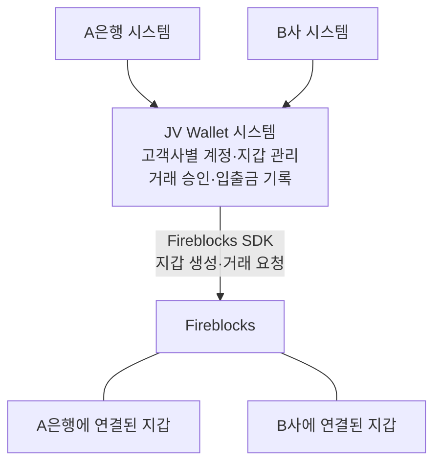

[Wallet 수탁 구조도](00-wallet-custody-structure.md)의 **은행 → JV Wallet → Fireblocks** 구조를 기준으로 질문을 정리했다. JV는 Wallet 시스템을 운영하는 회사다. 여기서 SDK는 JV가 Fireblocks를 호출하는 데 쓰는 도구다. 답은 Wallet 시스템을 설계·운영하는 JV 쪽에서 받고, 은행과 협의가 필요한 항목은 그 결과를 함께 적는다.

## 질문의 기준이 되는 그림

지갑 연결 관계를 간단히 그린 그림이다. Fireblocks 계약 수, 은행별 키 분리, 고객 잔액의 관리 주체는 아래에서 확인한다. 서명에는 Policy Server와 Co-Signer가 관여하며, 그 권한은 5번에서 다룬다.

## 1. 은행 하나가 추가되면 무엇을 새로 만드는가?

**Q.** A은행에 이어 B사가 Wallet을 쓰게 되면, Fireblocks도 B사 전용으로 따로 구성하나요? 아니면 JV가 쓰던 Fireblocks 안에 B사 지갑만 추가하나요?

Wallet 시스템 안의 Workspace는 은행별 논리 단위다. Fireblocks도 운영 공간을 workspace라고 부르지만, 두 단위가 반드시 1:1로 대응하는 것은 아니다. 수탁 구조도의 “JV 계약 1개”가 확정된 구성인지 묻는다.

**A.** 미확인.

## 2. 고객의 입금 지갑은 어떻게 만드는가?

**Q.** A은행 고객 한 명의 입금 지갑을 처음 만들 때, Fireblocks에도 그 고객 전용 vault를 하나 만드나요? 은행 고객 계정과 Fireblocks 지갑은 어떻게 연결해 두나요?

설계에는 고객 계정 아래 입금 지갑을 만들고, 최초 생성이면 지갑 묶음인 DepositVault도 만든다고 나와 있다. 다만 이것이 Fireblocks vault와 어떻게 대응하는지, 고객별 생성 예시가 필요하다. 설계 자체도 provider vault 참조를 집금 지갑 묶음인 CustodyVault에만 두고, 매핑이 1:1인지는 결정 필요 항목으로 남겨 두었다.

**A.** 미확인.

## 3. 같은 고객이 다른 토큰을 쓰면 주소도 새로 생기는가?

**Q.** 이미 입금 지갑이 있는 고객에게 토큰을 하나 더 추가하면, 기존 주소를 쓰나요, 새 주소를 만드나요?

Wallet은 토큰별로 DepositWallet을 관리한다. 같은 네트워크에서 토큰만 추가하는 경우와 다른 네트워크를 추가하는 경우의 주소 예시를 각각 받으면 이해하기 쉽다.

**A.** 미확인.

## 4. 은행별로 지갑만 나뉘는가, 키도 나뉘는가?

**Q.** A은행 지갑과 B사 지갑은 키도 별도로 관리되나요? JV의 같은 Co-Signer가 두 고객사의 거래에 모두 서명하나요?

수탁 구조도에는 은행별 vault와 JV의 Co-Signer가 그려져 있다. 지갑이 나뉘어 있다는 것만으로 키와 서명 권한까지 분리됐다고 판단할 수는 없다. 그림의 “MPC 키 세트 1개”는 실제 구성으로 확인해야 한다.

**A.** 미확인.

## 5. 은행이 승인하지 않아도 JV가 돈을 보낼 수 있는가?

**Q.** 은행이 정한 승인 절차를 JV가 건너뛰고 출금할 수 있나요? JV가 정책이나 서명 설정을 바꿀 때도 은행의 승인이 필요한가요?

그림에서는 정책을 판단하는 Policy Server와 서명에 참여하는 Co-Signer를 JV가 운영한다. Policy 설계는 사전 승인을 건너뛰고 Fireblocks를 직접 호출해도 콜백에서 승인 기록이 없으면 서명을 거부하도록 되어 있다. 다만 그 Policy Server를 JV가 운영하므로, 은행 관리자의 거래 승인 권한과 JV의 정책·서명 설정 변경 권한을 구분해서 확인해야 한다. 모든 거래에 은행 관리자의 수동 승인이 필요하다는 뜻은 아니며, 실제 승인 조건은 적용 정책으로 확인한다.

**A.** 미확인.

## 6. 고객별로 얼마를 출금할 수 있는지는 누가 확인하는가?

**Q.** 은행이 “이 고객에게 토큰 100개를 출금해 달라”고 요청하면, 고객 잔액은 은행만 확인하나요? JV Wallet도 고객별 기록을 가지고 다시 확인하나요?

여러 고객의 돈을 고객사 지갑으로 모으는 것을 집금(sweep)이라고 한다. 집금 지갑의 총잔액과 각 고객의 출금 가능액은 별도 정보다. 수탁 구조도는 고객원장을 은행 소유로 적었지만, 원본 Wallet 설계에는 고객별 출금 가능액 관리 방식이 미정으로 남아 있다.

**A.** 미확인.

## 7. 입금된 돈을 모으기 전에도 출금할 수 있는가?

**Q.** 고객의 입금이 확인됐지만 아직 집금 지갑으로 옮기지 않았다면, 집금 지갑에 있던 다른 자금으로 그 고객의 출금을 처리할 수 있나요?

설계상 입금은 고객별 입금 지갑으로 받고, 출금은 고객사 집금 지갑에서 보낸다. 각 고객의 입금이 집금까지 끝나야 출금 가능한지는 원본 설계의 결정 필요 항목이다.

**A.** 미확인.

## 8. 은행이 JV 서비스를 그만 쓰면 지갑은 어떻게 되는가?

**Q.** A은행이 서비스 이용을 종료하면 기존 지갑과 키를 넘겨받나요, 아니면 자산을 새 지갑으로 옮겨 받나요? JV가 협조하지 못하는 상황에서도 가능한가요?

은행별 자산을 구분하는 기록과 자산을 실제로 옮길 권한이 모두 필요하다. 1번의 Fireblocks 운영 환경과 4번의 키 구성에 따라 가능한 이관 방식이 달라질 수 있다.

**A.** 미확인.

## 참고한 문서

그림은 [Wallet 수탁 구조도](00-wallet-custody-structure.md)를 바탕으로 요약했다. 그 안의 해석을 아래 설계와 대조했으며, 아직 답이 없는 항목은 확정된 구조로 적지 않았다. STC 설계 자료는 질문의 배경으로만 사용하며, 이 문서가 BCM 설계의 전제나 결정을 변경하지 않는다.

- [Wallet 도메인 모델](https://github.com/STF-KKK/stc-design/blob/65071e6/docs/wallet-system/domain-model-design-draft.md): 고객사·계정·지갑 관계, 고객 잔액과 집금 선행 여부의 미결정 항목.
- [제휴사 API 초안](https://github.com/STF-KKK/stc-design/blob/65071e6/docs/wallet-system/user-api-spec-draft.md), [입금 지갑 API](https://github.com/STF-KKK/stc-design/blob/65071e6/docs/wallet-system/tsp/deposit/deposit-wallet.tsp): 최초 입금 지갑 생성과 토큰별 주소 반환.
- [온보딩](https://github.com/STF-KKK/stc-design/blob/65071e6/docs/wallet-system/onboarding.md): 관리자 요청에 따른 Fireblocks vault 생성과 토큰 활성화.
- [Policy Engine](https://github.com/STF-KKK/stc-design/blob/65071e6/docs/wallet-system/policy/design/policy-engine-design-draft.md): 사전 승인과 서명 직전 검증, 정책·권한 관리.

설계 대조는 확인 가능한 이관 기준 커밋 `65071e6`을 사용했다. 위 GitHub 링크를 열려면 비공개 저장소 `STF-KKK/stc-design`의 접근 권한이 필요하다. Wallet 문서가 다른 저장소로 이관된 이후의 변경은 확인하지 못했다.

[외부 WaaS 업체 운영 질문](01-qna.md)은 별도 업체가 Fireblocks를 대신 운영하는 경우의 참고 문서다. 이 그림에 그런 업체가 추가로 들어간다는 뜻은 아니다.
