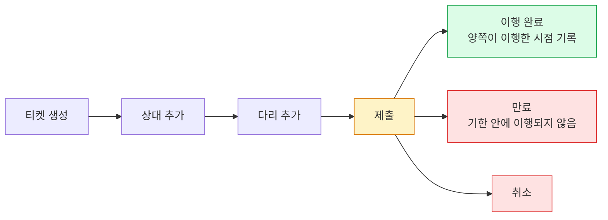

Fireblocks 회원 기관끼리 직접 연결해 자금을 주고받는 평면과, 그 위에서 정산을 티켓으로 다루는 기능을 정리한다.
현재 설계에는 쓰지 않는다. 나중에 기관 간 정산을 다루게 될 때 꺼내 볼 자료다.

## 무엇인가

**Fireblocks Network** 는 회원 기관끼리 워크스페이스를 직접 연결하는 별도 평면이다. 온체인 주소를 주고받아 화이트리스트에 등록하는 대신, 상대 기관과 연결을 맺고 그 연결을 거래 상대로 지목한다. 유동성 공급자·대출 데스크·거래 상대 **1,500개 이상**이 회원이다.

**Smart Transfer** 는 그 위에 올라간 정산 기능이다. 정산 한 건을 티켓으로 만들고, 주고받을 자금을 티켓 안의 다리로 나열해 양쪽이 이행한다.

Fireblocks 인프라에서는 공유 서비스 계층에 있다. 워크스페이스 전용 자원이 아니다.

## 연결을 맺는 방법

- 프로필을 **검색 노출**로 두면 다른 회원의 연결 검색에 뜬다. 검색 결과에서 상대가 연결을 요청한다.
- **비노출**이면 상대가 우리 Network ID(8자)를 알아야 요청할 수 있다.
- 비노출이어도 우리가 남을 검색해 요청하는 것은 된다.
- **양쪽 Admin Quorum 이 모두 승인**해야 연결이 생긴다. 우리 승인만으로는 성립하지 않는다.

연결 추가는 Owner · Admin · Non-Signing Admin 만 할 수 있고 Admin Quorum 승인 대상이다. 워크스페이스가 동결되면 새 연결 추가가 막힌다.

## Network 가 주는 것

### 주소를 주고받지 않는다

모든 Network 전송은 보안 하드웨어 격리 구역 안의 암호화 터널을 지난다. 입금 주소를 저장하거나 공유할 일이 없어진다. Fireblocks 는 이걸 Automated Address Authentication 이라고 부른다.

- 화이트리스트 등록, 테스트 전송, 주소 복사 붙여넣기가 사라진다.
- 주소를 손으로 옮기다 엉뚱한 곳으로 보내는 사고가 생기지 않는다.
- 중간자 공격과 주소 스푸핑이 성립하지 않는다. 악성코드가 감염 기기의 주소를 바꿔치기하거나 메신저로 주고받는 주소를 가로채는 경로가 없다.
- 우리 입금 주소가 바뀌어도 연결이 유지된다. 상대에게 알리거나 재연결할 필요 없이 자동으로 다시 매핑된다.

### 입금이 어디로 들어올지 정한다

들어오는 자금을 우리 어느 계정으로 받을지 두 층위로 정한다. 암호화폐와 법정화폐 모두 해당하고, 전부 API 로 설정할 수 있다.

- **프로필 단위** — 우리 프로필로 오는 모든 입금을 지정한 vault·거래소·법정화폐 계정으로 보낸다.
- **연결 단위** — 상대마다 따로 정한다.

방식은 셋이다.

| 방식 | 동작 |
|---|---|
| `CUSTOM` | 지정한 계정으로 보낸다. 그 계정을 제거하면 다른 계정을 정할 때까지 **입금이 실패한다** |
| `DEFAULT` | 연결이 붙어 있는 프로필의 라우팅을 따른다 |
| `NONE` | 목적지가 없다. 그 자산 유형으로 들어오는 **입금이 실패한다** |

★ 워크스페이스 기본값이 이렇다.

| 대상 | 기본값 |
|---|---|
| 프로필 · 암호화폐 | `CUSTOM` (기본 대상은 vault 계정 `0`) |
| 프로필 · 법정화폐 | `NONE` |
| 연결 · 암호화폐 | `DEFAULT` |
| 연결 · 법정화폐 | `DEFAULT` |

**법정화폐 프로필 기본값이 `NONE`** 이므로, 법정화폐를 받으려면 프로필 라우팅을 먼저 지정해야 한다. 그대로 두면 들어오는 자금이 실패한다.

라우팅에 쓸 수 있는 자산 묶음은 `/network_ids/routing_policy_asset_groups` 에서 조회한다.

### 입금마다 주소가 바뀐다 — 일부 체인만

UTXO 계열은 들어오는 전송마다 입금 주소가 자동 교체된다. 체인에 따라 회전 대상이 다르다.

| 체인 | 회전하는 것 |
|---|---|
| 비트코인 등 UTXO | 입금 주소 |
| Ripple | 주소 고정, XRP 태그 |
| EOS · Hedera · Stellar | 주소 고정, 메모 ID |
| **이더리움 등 계정 기반** | **없다 — 지원되지 않는다** |

목적은 한 주소로 거래 내역이 묶여 추적되는 것을 막는 것이다. 계정 기반 체인은 전송 자체는 되지만 전송마다 고유 식별자를 만들 수 없다.

우리 시작 범위가 ETHEREUM 과 BASE 이므로 이 기능은 해당하는 자산이 없다.

## Smart Transfer — 티켓으로 정산한다

Network 연결이 이미 있어야 티켓을 만들 수 있다.

**티켓**이 정산 한 건이고, **다리**가 주고받을 자금 하나다.

| 단위 | 담는 것 |
|---|---|
| 티켓 | 티켓 ID · 정산 방식 · 상태 · 만든 프로필 · 만료 시각 · 외부 참조 ID · 메모 |
| 다리 | 다리 ID · 자산 · 금액 · 보내는 프로필 → 받는 프로필 |

다리마다 보내는 쪽과 받는 쪽이 따로 있어서 **한 티켓에 양방향이 들어간다.** 서로 주고받는 정산을 한 묶음으로 합의한다.

**외부 참조 ID** 는 "고객이 시스템에 추가하는 임의의 ID" 로 정의돼 있다. 우리 정산 번호를 티켓에 심어 두고 그것으로 대사할 수 있다.

초록이 정산 완료, 빨강이 미완으로 끝난 경우, 노랑이 이행을 기다리는 상태다. 모든 단계가 웹훅으로 온다. 외부 참조 ID 추가와 메모 추가도 각각 웹훅이 있다.

완료 시각 필드는 "양쪽이 이행한 시점" 으로 정의돼 있다. 정산이 끝났는지를 우리가 조합해 판단할 필요가 없다.

만료는 시간 단위로도 시각으로도 지정할 수 있다. 이행되지 않은 티켓이 무한정 남지 않는다.

### 정산 방식이 둘이다 — 차이가 크다

| 방식 | 동작 | 상태 |
|---|---|---|
| `ASYNC` | 다리에 자금 출처를 지정하면 **그 다리가 즉시 전송된다** | 현재 제공 |
| `DVP` | 자금 출처를 지정하면 **컨트랙트가 자산을 옮기도록 승인하는 거래**를 만든다 | Early Access |

★ **`ASYNC` 는 원자적 교환이 아니다.** 다리가 각각 독립해서 즉시 실행되므로, 우리는 보냈고 상대는 보내지 않은 상태가 성립한다. 티켓은 그 상태를 기록하고 만료시킬 뿐 되돌리지 않는다. 신용 위험이 남는다.

`DVP` 는 스마트컨트랙트에 승인을 걸고 컨트랙트가 자산을 옮기는 방식이라 온체인이다. Early Access 라서 Fireblocks 가 워크스페이스에 활성화해 줘야 쓸 수 있고, 담당자에게 문의해야 한다.

### 중개자로 제3자 둘의 티켓을 열 수 있다

우리가 중개자가 되어 제3자 둘 사이의 정산 티켓을 만들 수 있다. **API 로만 되고 콘솔로는 안 된다.**

조건이 있다. **세 당사자가 모두 같은 Network 프로필로 서로 연결돼 있어야 한다.** 즉 제3자 둘도 Network 회원이어야 한다.

티켓 생성 권한은 Admin · Non-Signing Admin · Signer · Approver · Editor 다.

## 되는 것과 안 되는 것

**된다**

- 기관 간 정산. 여러 건을 티켓 하나로 합의하고 양방향을 함께 담는다.
- 우리가 중개자로 기관 고객 둘 사이의 정산을 주관한다.
- 우리 정산 번호를 티켓에 심어 그것으로 대사한다.
- 상대를 주소가 아니라 기관 단위로 식별한다. 거래 기록에 상대가 연결 유형으로 담긴다.
- 정산 상태를 웹훅으로 실시간 추적한다.

**안 된다**

- **개인 고객은 쓸 수 없다.** Network 회원이 아니므로 연결 대상이 되지 않는다. 고객 입출금은 이 경로를 타지 못한다.
- **최종 수취 고객을 라우팅으로 지목할 수 없다.** 라우팅 단위가 프로필과 연결이라, 상대 기관의 어느 계정으로 넣을지만 정해진다. 상대 기관의 어느 고객에게 귀속되는지는 라우팅이 알지 못한다. 외부 참조 ID 나 트래블룰 데이터 같은 별도 통로로 전달하고 상대와 합의해야 한다.
- **원자적 교환은 `ASYNC` 로 안 된다.** `DVP` 가 필요하고 Early Access 다.
- **계정 기반 체인은 주소 회전이 없다.** ETHEREUM · BASE 만 쓰는 동안은 이 이득이 없다.

## 도입 시 걸리는 것

- **법정화폐 프로필 라우팅 기본값이 `NONE`** 이다. 그대로 두면 들어오는 법정화폐가 실패한다.
- **P2P 로 들어오는 전송의 트래블룰 심사 상태 기본값이 "지원하지 않는 자산"** 이다. 고객이 관련된 거래라면 심사되지 않은 채 들어온다.
- **AML 과 트래블룰 양쪽에 "P2P 전송 우회" 설정이 따로 있다.** 끄면 P2P 도 검사한다. 기본값을 확인해야 한다.
- **티켓 생성 권한이 Editor 까지 열려 있고 Admin Quorum 승인 언급이 없다.** 티켓 이행이 곧 자금 이동이므로 정책 층에서 막을 수 있는지 확인이 필요하다.
- **연결 추가는 상대 승인이 필요하다.** 우리 일정만으로 진행되지 않는다.
- **거래 정책에서 P2P 연결을 출발지·목적지로 지정할 수 있다.** 전체 연결을 한 규칙으로 다루는 것도 된다.

## 벤더에 물어볼 것

1. **수수료** — Network 이용과 Smart Transfer 에 별도 요금이 있는가. 계약 등급에 포함되는가.
2. **전송이 온체인인가** — Network 전송이 블록체인에 기록되는가, Fireblocks 내부 장부 이동인가. 컨펌 수가 채워지는가. 정산이 실제로 간단해지는지가 여기에 걸린다.
3. **DVP 활성 조건** — 어떤 컨트랙트를 쓰는가. 지원 체인과 자산은. 한쪽이 이행하지 않으면 승인한 자산을 어떻게 회수하는가.
4. **티켓의 승인 관문** — 티켓 생성과 이행이 Admin Quorum 승인 대상인가. 거래 정책이 이행 전송에 적용되는가.
5. **연결 해제** — 한쪽이 단독으로 끊을 수 있는가. 끊은 뒤 그 연결로 온 입금은 실패하는가, 프로필 라우팅으로 흡수되는가.

## 출처

Fireblocks 공식 문서에서 확인한 내용만 담았다. 확인하지 못한 것은 위 "벤더에 물어볼 것" 으로 분리했다.

| 출처 | 확인한 내용 |
|---|---|
| `connect-to-the-fireblocks-network` | 회원 규모 · 연결 방법 · 양쪽 Quorum 승인 · 주소 인증 · 라우팅 두 층위 · 주소 회전 |
| `create-a-new-network-connection` | 라우팅 방식 셋 · 워크스페이스 기본 프리셋 · 자산 묶음 조회 경로 |
| `network-objects` | 연결·프로필 객체 필드 · 검색 노출 여부 |
| `network-connection-webhooks` | 연결 추가 웹훅 · 채널 구조 |
| `execute-smart-transfers` | 중개자 모델 · 같은 프로필 조건 · 연결 선행 조건 |
| `create-ticket` | `DVP` Early Access · 티켓 생성 권한 |
| `define-funding-source` | `ASYNC` 는 자금 출처 지정 시 즉시 전송 |
| `set-funding-source-and-approval` | `DVP` 는 컨트랙트 승인 거래를 만든다 |
| `smart-transfer-webhooks` | 티켓·다리 필드 · 생애주기 · 양쪽 이행 완료 시각 |
| `fireblocks-cloud-architecture` | Network 가 공유 서비스 계층에 있다 |
| `about-travel-rule-transaction-screening` | P2P 유입의 트래블룰 기본 상태 |
| `aml-advanced-configuration-settings` · `travel-rule-advanced-configuration-settings` | P2P 우회 설정 |
| `about-policies` · `build-a-custom-deposit-control-and-confirmation-policy` | 정책에서 P2P 연결 지정 |
| `admin-quorum` · `user-roles` · `security-checklist` | 연결 추가 권한 · 승인 대상 · 동결 시 차단 |
