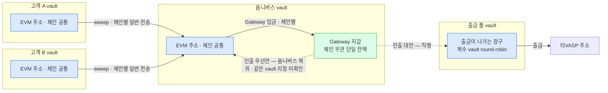

Gateway 지갑은 vault account 하나에 결속되고 잔액도 vault 단위다([기능](02-usdc-gateway.md)). 그래서 어느 vault 에 붙이느냐가 구조를 가른다.

**USDC Gateway 도입 자체는 미정이다.** 도입할 경우 어느 vault 에 붙일 수 있는지를 정리한다. **실제로 어디부터 붙일지는 [운영 설계](07-usdc-gateway-operating.md)에서 회사자산 vault 를 먼저 두는 안으로 좁혔다.**

**자산 경계마다 전용 vault 하나에만 활성화한다.** 고객자산 Gateway 는 옴니버스 vault 에, 회사자산 Gateway 는 회사자산 vault 에 붙인다.

## 전제 — 주소는 체인이 달라도 같다

같은 vault 의 EVM 주소는 체인이 달라도 같다. 벤더가 근거를 밝힌다 — **모든 EVM 네트워크가 같은 주소 유도 방식을 쓰므로 한 vault account 안에서 같은 주소가 나온다**([Typed Message 서명 문서](https://developers.fireblocks.com/reference/sign-typed-messages-for-ethereum-and-evm-networks)).

우리 워크스페이스에서도 확인했다 — vault 12 의 Base Sepolia 주소가 `0x496E…55D` 였고 이더리움 Sepolia 배치에서도 같은 주소로 토큰이 들어왔다(2026-08-10). vault 하나·테스트넷 둘에서 본 것이라 **일반화의 근거는 실측이 아니라 위 벤더 서술**이다.

그래서 주소 단위로 그리면 고객 하나에 EVM 주소 하나다. 체인이 갈리는 것은 주소가 아니라 **그 주소가 어느 체인에서 무슨 자산을 들고 있는지**다.

## 고객자산 배치 — 옴니버스에만 활성화

sweep 이 끝난 뒤 Gateway 입금이 붙는 2단 구조다. **점선은 아직 안 정했다** — **옴니버스로 복귀시키는 것이 우선안**(재고 허브 결정과 같은 방향)이고, Gateway 가 결속된 같은 vault 를 인출 목적지로 지정할 수 있는지가 미확인이라 확인 전까지 출금 풀 직행이 대안이다([우리 구조에 걸리는 것](04-usdc-gateway-fit.md)).

옴니버스와 출금 풀은 다른 vault 다. 출금은 출금 풀 vault 에서 나간다([흐름](../설계/02-bcm-flow.md) 출금 절). 밴드S 는 옴니버스와 출금 풀을 한 칸으로 세므로 둘 사이 이동에 안 움직이지만, **밴드C 는 출금 풀만 세므로 출금 풀로 들어오는 이동에 늘어난다**([우리 구조에 걸리는 것](04-usdc-gateway-fit.md)).

## 자산 경계마다 하나

위는 **고객자산 안에서의 축**이다. 회사자산 vault 는 별개 축이고, 여기에도 Gateway 를 붙일 수 있다.

**Gateway 지갑은 자산 경계마다 하나씩 둔다.** 고객자산은 옴니버스에, 회사자산은 회사자산 vault 에.

| | 고객자산 Gateway | 회사자산 Gateway |
|---|---|---|
| 붙는 vault | 옴니버스 | 회사자산 vault |
| 잔액의 성격 | 고객자산 | 회사자산 |
| 밴드S | 도입 시 판단 — [우리 구조에 걸리는 것](04-usdc-gateway-fit.md) | **산식 밖** — 밴드S 는 고객자산 기준이다 |
| 쓸모 | 재고 보충 — 옴니버스를 거쳐 출금 풀로 | [브릿지 — 문제](../../블록체인매니저/브릿지/01-problem.md) 브릿지교환의 상대편 재고를 체인 무관으로 유지 |

**Gateway 지갑 하나에서 목적지를 갈아 끼워 두 경계를 오갈 수는 없다.** 고객 옴니버스의 Gateway 잔액은 고객자산이라, 회사자산 vault 로 인출하면 경계를 넘는다. **경계를 넘는 이동은 업무 요청이 있어야 하고, 목적지만으로 계열을 정하지 않는다**([운영 설계](07-usdc-gateway-operating.md) 기록 규칙) — 오프램프 델타 정산이면 제출 원장 `INTERNAL`, 브릿지교환이면 교환 식별자로 두 다리를 묶는다. 업무 근거 없는 단방향 이동은 금지다. 어느 쪽이든 Gateway 인출 한 건만으로는 표현되지 않는다.

회사자산 쪽은 밴드S·밴드C 어느 쪽도 안 건드리므로 고객자산 쪽보다 결정이 적다.

## 따라오는 것

아래는 전부 **Gateway 지갑 하나당** 값이다. 고객자산·회사자산 둘 다 도입하면 각각 한 벌씩이다.

| | 고객자산 Gateway 하나만 | 둘 다 |
|---|---|---|
| 활성화 호출 | 1회 | 2회 |
| 승인 거래 | 옴니버스가 입금하는 체인 수 | 각 vault 가 입금하는 체인 수의 합 |
| 자동 입금 설정 | 옴니버스 1건 | vault 마다 1건 |

- **활성화는 운영 초기에 vault 당 한 번**이다. 고객 vault 생성·주소 발급 흐름과 무관하므로, 매니저의 입금 주소 발급 API 에 활성화를 끼워 넣을 이유가 없다.
- **승인 거래는 그 vault 가 실제로 입금하는 체인 수만큼**이다. 그 주소가 그 체인에서 처음 Gateway 입금을 낼 때 한 번씩.
- **자동 입금 임계는 Gateway 를 붙인 vault 마다** 설정한다.
- **Gateway 지갑은 자산 경계마다 하나**라 경계 안에서는 잔액이 한 곳에 모인다.

## 아직 정할 것

이 배치를 전제로 남는 미결은 [우리 구조에 걸리는 것](04-usdc-gateway-fit.md)에 모았다 — 밴드C 상한·하한 값, 복수 출금 풀 배분, 감지 구분, 운영 영역 분리.
