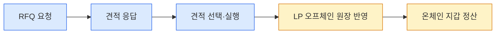
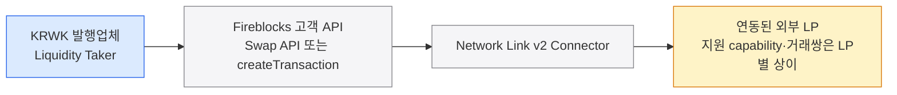
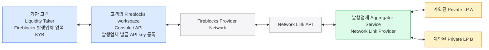
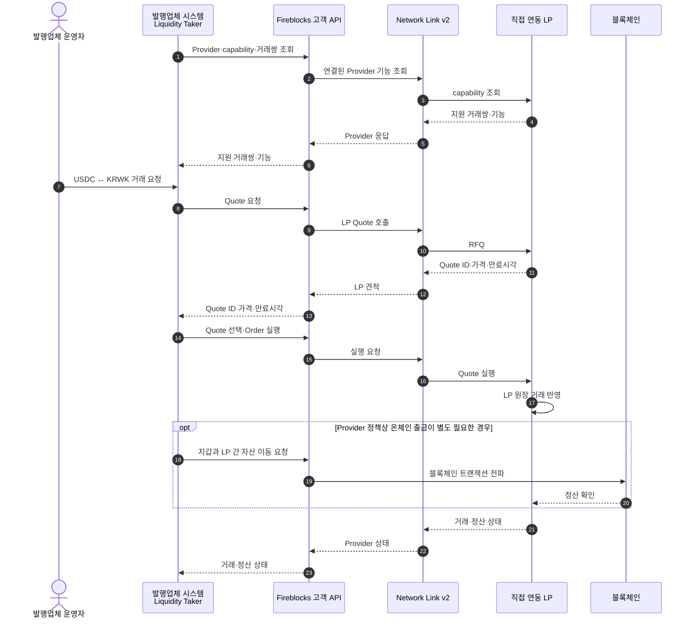
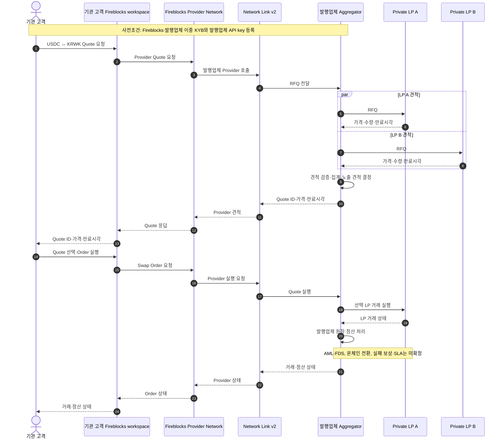

외부 Market Maker·Liquidity Provider와 직접 계약해 `USDC ↔ KRWK` 또는 `USDT ↔ KRWK` 유동성을 조달할 때 Fireblocks를 RFQ·정산 인터페이스로 사용할 수 있는지 정리한다.

> **적용 경계** — 이 문서는 외부 **KRWK 발행업체**가 기관 고객에게 FX를 제공하는 시나리오를 정리한 기능 참고자료다. 우리 블록체인 지갑 서비스의 역할이나 채택 설계가 아니다.

결론부터 말하면 **두 가지 조건부 모델이 가능하다.** 첫째는 선정한 LP가 Network Link v2 Provider로 직접 연동되는 모델이다. 둘째는 **KRWK 발행업체의 Aggregator Service 하나가 Provider로 연동되고, 계약된 private LP들을 그 뒤에서 발행업체가 직접 연결·집계하는 모델**이다. 후속 대화에서 Fireblocks 측은 두 번째 모델을 제안했다.

어느 모델에서도 Network Link v2가 임의의 외부 MM을 자동으로 찾아 RFQ를 집계해 주지는 않는다. LP 직접 모델은 LP의 Network Link·거래쌍 지원이 필요하고, 발행업체 Aggregator 모델은 발행업체가 private LP 연동·RFQ fan-out·견적 집계·정산을 구현해야 한다.

## 확인된 흐름

검토하는 업무 흐름은 다음과 같다.

파랑 세 단계는 Network Link v2 공개 명세의 `liquidity` capability와 대응한다. 노랑 두 단계는 제공자별 구현과 정산 정책에 달려 있으며, 대화만으로 한 번에 이어진다고 확정할 수 없다.

## Network Link v2의 정확한 위치 — 모델 1: LP 직접 연동

Network Link v2 공개 명칭은 **Provider Connectivity API**다. 제3자 제공자가 Fireblocks 플랫폼에 자기 서비스를 연결하기 위해 구현하는 인터페이스다. 발행업체 시스템이 임의의 MM endpoint를 이 규격으로 직접 호출하는 구조로 이해하면 안 된다.

Fireblocks 담당자는 다음 조건을 확인했다.

- 외부 LP가 **Network Link v2에 연동**돼 있어야 한다.
- 그 LP가 **USDC ↔ KRWK 거래쌍**을 지원해야 한다.
- Exchange·LP에 거래 개시 endpoint가 있어도 모든 제공자가 이를 채택한 것은 아니다.
- PSP는 온·오프램프, 브릿징, 스왑용 견적·환율을 제공할 수 있다.

즉 후보 LP 선정 시 회사명만 확인할 것이 아니라 **계정별 capability와 자산·거래쌍을 조회**해야 한다.

## 모델 2: KRWK 발행업체 Aggregator가 Provider로 연동

private LP들이 Fireblocks에 각각 직접 연동하지 않는 경우, Fireblocks 측은 KRWK 발행업체가 **Aggregator Service**를 운영하고 이 서비스 하나를 Network Link Provider로 등록하는 구성을 제안했다.

Fireblocks 측이 제안한 역할은 다음과 같다.

- KRWK 발행업체는 특정 LP의 견적·환율을 집계한다.
- 발행업체 Aggregator Service가 Network Link에 Provider로 연동한다.
- 기관 고객은 발행업체 서비스의 Liquidity Taker가 되고 Fireblocks Console/API에서 견적과 Swap Order를 요청한다.
- 발행업체가 승인한 기관 고객만 Aggregator에 접근한다.

이 모델에서 Fireblocks가 제공하는 것은 **기관 고객 workspace와 발행업체 Provider 서비스 사이의 연결·유통 채널**이다. private LP 대상 RFQ 전파, 견적 집계·선택, LP 계약·온보딩, LP 구간 정산은 발행업체 Aggregator의 책임으로 남는다.

## 시나리오별 시퀀스

### 시나리오 A — Network Link에 직접 연동된 LP 사용

기관 고객은 Fireblocks 고객용 Trading·Swap 인터페이스를 사용하고, LP는 Provider Connectivity를 구현하는 구조다. 두 API의 호출 방향을 혼동하지 않는다.

마지막 온체인 구간은 **조건부 표현**이다. Quote 실행이 곧바로 온체인 출금을 생성하는지, 별도 `createTransaction`이 필요한지, 어느 주체가 출금을 시작하는지는 대화에서 확정되지 않았다.

### 시나리오 B — KRWK 발행업체가 Private LP를 집계

발행업체 Aggregator 하나만 Network Link Provider로 노출하고, 그 뒤의 계약된 LP들에게 RFQ를 전파하는 담당자 제안 구조다.

다이어그램의 `LP A 선택`은 예시일 뿐 선정 알고리즘이 확인됐다는 뜻이 아니다. RFQ fan-out, 견적 비교·선정, 만료 제어, LP 장애 격리와 정산은 발행업체 Aggregator가 설계해야 하는 범위다.

### 기관 고객 접근 제한

Liquidity Taker는 KRWK 발행업체의 기관 고객이면서 Fireblocks 고객이어야 한다. Fireblocks와 발행업체가 각각 KYB하고, 발행업체는 승인한 고객에게 API key를 발급한다. 기관 고객은 이 키를 자기 Fireblocks workspace에 등록한다. 따라서 발행업체가 키를 발급하지 않은 임의의 기관 고객은 Aggregator Service에 직접 연결할 수 없다는 점까지 담당자 답변으로 확인됐다.

이를 `발행업체 workspace가 고객 workspace에 붙는다`고 표현하지 않는다. 확인된 구조는 **고객의 기존 Fireblocks workspace가 발행업체 발급 API key로 발행업체 Provider 서비스에 접근**하는 방식이다.

### 아직 확정되지 않은 범위

담당자가 위 모델을 제안하고 기관 고객 접근 제한을 설명했지만, 다음 최종 확인 요청에는 아직 답변이 없다.

- 발행업체 Aggregator의 Provider Connectivity 구현이 최종 권장 접근인지
- aggregator 뒤 private LP가 Fireblocks 고객이 아니어도 되는지
- private LP 공급을 해당 발행업체 전용으로 제한하는 계약·기술 범위
- Fireblocks가 RFQ fan-out·집계를 제공하는 대체 솔루션이 있는지
- 기관 고객 연동에 사용할 공식 고객용 문서

따라서 private LP를 aggregator 뒤에 두는 것은 **Fireblocks 제안 구조**로 기록하되, LP 구간의 요구사항과 최종 지원 범위는 PoC 전에 다시 확인한다.

## 공개 명세에서 확인되는 API 표면

[Fireblocks Provider Connectivity API v2](https://fireblocks.github.io/fireblocks-network-link/v2/docs.html)는 기능을 선택 capability로 정의한다.

| 단계 | API | 확인된 의미 |
|---|---|---|
| capability discovery | `GET /capabilities` | `liquidity`, `transfersBlockchain`, `ramps` 등 제공자가 구현한 기능 확인 |
| 거래쌍 확인 | `GET /capabilities/liquidity/quotes` | 가능한 자산 변환 목록 확인 |
| RFQ | `POST /accounts/{accountId}/liquidity/quotes` | 한쪽 수량을 지정해 견적 생성 |
| 견적 조회 | `GET /accounts/{accountId}/liquidity/quotes/{id}` | 환산 수량·수수료·상태·만료시각 조회 |
| 견적 실행 | `POST /accounts/{accountId}/liquidity/quotes/{id}/execute` | 유효하고 만료되지 않은 견적의 자산 변환 실행 |
| provider 출금 | `POST /accounts/{accountId}/transfers/withdrawals/blockchain` | provider account에서 public blockchain으로 출금 생성 |

명세는 `RFQ → Quote → Execute`를 지원한다. 그러나 특정 LP가 liquidity capability를 구현했는지, KRWK를 자산으로 등록했는지, `Execute`가 곧바로 온체인 정산까지 완료하는지는 별도 문제다.

생성·변경 요청에는 `idempotencyKey`가 있고 제공자는 같은 키의 재시도를 최소 72시간 인식하도록 명세돼 있다. 이는 중복 실행 방지 장치이지 정산 성공 보장은 아니다.

## 호출 방향 — 모델에 따라 달라진다

담당자는 Network Link v2 외에, 통합 제공자가 견적·환율을 반환하고 스왑과 정산 절차를 시작하는 **Swap API**가 있다고 설명했다. 또한 Fireblocks 고객이 Exchange·LP로 자산을 입출금할 때는 **`createTransaction`의 source·destination에 고객 지갑과 Exchange·LP를 지정**한다고 답했다.

따라서 호출 주체를 모델별로 나눈다.

- **LP 직접 모델에서 발행업체는 Taker** — 거래 시작점은 Fireblocks 고객용 Swap API일 수 있고, LP 입출금은 `createTransaction`일 수 있다. `liquidity/quotes`는 LP가 구현한다.
- **발행업체 Aggregator 모델에서 발행업체는 Provider** — Aggregator가 `liquidity/quotes` 등 Provider Connectivity 계약을 구현하고, 기관 고객은 Fireblocks Console/API를 통해 접근한다.
- provider-side `createBlockchainWithdrawal`은 발행업체 Aggregator 모델에서 구현 대상이 될 수 있지만, 이것이 `Execute quote` 직후 온체인 정산을 자동 완결한다는 뜻은 아니다.

모델을 선택하고 후보 LP가 정해지면 Fireblocks가 노출하는 고객 API, 발행업체가 구현할 provider endpoint, 정산 호출 순서를 각각 확정해야 한다.

## 아직 답을 받지 못한 핵심 — 온체인 정산 시점

견적 실행 뒤 온체인 출금 시점이 결정적인지, 블록체인 제출 전에 Fireblocks 또는 LP가 FDS·AML 등 내부 심사를 수행해 지연·실패가 생기는지 질문했지만 제공된 대화에는 직접 답변이 없다.

따라서 다음은 **미확정**이다.

- `Execute quote` 성공이 온체인 제출을 보장하는가.
- 견적 실행과 온체인 출금이 한 거래인가, 두 단계인가.
- Fireblocks TAP·AML·트래블룰 또는 별도 FDS가 어느 단계에 적용되는가.
- LP 내부 승인·심사 큐가 추가되는가.
- 각 단계의 최대 지연, timeout, 거절·실패 상태와 재시도 규칙은 무엇인가.
- 견적은 실행됐지만 정산이 실패한 경우 가격·자금 책임과 보상 절차는 무엇인가.

이 항목이 해소되기 전에는 `RFQ → Accept → 즉시 온체인 정산`을 SLA나 시스템 상태 전이의 전제로 사용하지 않는다.

## 외부 제공자 후보 제안

담당자는 KRWK를 특정 외부 제공자 후보에 상장하면 모든 Fireblocks 고객에게 기본 지원될 수 있다고 제안했다. 기능검토 문서에서는 후보 회사명을 제외한다. 이는 **담당자 제안**이며 도입 확정이나 공개 명세 확인사항이 아니다.

확인할 것은 다음과 같다.

- 정확한 업체·서비스명과 현재 Fireblocks 연동 상태
- KRWK 상장·계약·실사 요건
- USDC·USDT 거래쌍과 지원 블록체인
- 최소·최대 거래량, 가격 유효시간, 수수료
- 오프체인 원장 반영과 온체인 정산 방식·SLA
- `out of the box`가 의미하는 고객 UI 노출, API 지원, 정산 지원 범위

## 도입 판단

외부 사례 관점의 결론은 **KRWK 발행업체 Aggregator 모델을 PoC 후보로 둘 수 있다**는 것이다. Fireblocks가 private LP 집계 기능 자체를 제공하는 것이 아니므로, 자체 aggregator 구현을 피하려는 목적에는 맞지 않을 수 있다. 반대로 승인된 기관 고객에게 Fireblocks Console/API 경로로 제한된 KRWK 시장을 제공하려는 목적에는 후보가 된다. 이 판단은 우리 블록체인 지갑 설계에 적용하지 않는다.

다음 순서로 검증한다.

1. LP 직접 모델과 발행업체 Aggregator 모델 중 PoC 대상을 선택한다.
2. 발행업체 Aggregator가 공식 Network Link Provider 모델인지 Fireblocks의 최종 확인을 받는다.
3. 기관 고객의 이중 KYB, API key 등록·회전·폐기, 접근 해지 절차를 확정한다.
4. 담당자 예시의 `USD ↔ KRWK`가 실제 요구인 `USDC/USDT ↔ KRWK`를 뜻하는지 자산·체인·asset ID를 확인한다.
5. private LP가 Fireblocks 밖에 있어도 되는지, LP별 계약·KYB·정산·감사 요건을 확인한다.
6. Fireblocks가 제공하는 영역과 발행업체 Aggregator가 구현할 RFQ fan-out·집계·선정 영역을 확정한다.
7. RFQ 만료·실행·정산 상태, 심사 지연, 실패 보상 규칙을 확인한다.
8. testnet에서 특정 LP 하나로 `기관 고객 요청 → 견적 → 선택 → 오프체인 반영 → 온체인 정산` E2E를 검증한다.

## 출처

| ID | 출처 | 반영 범위 |
|---|---|---|
| FB-NL2-001 | [Fireblocks Provider Connectivity API v2](https://fireblocks.github.io/fireblocks-network-link/v2/docs.html) | capability discovery, liquidity quote·execute, blockchain withdrawal, idempotency |
| FB-SUP-001 | [Fireblocks 담당자 기술 질의응답](https://github.com/eunsujeo/eunpus/blob/main/blockchain-manager/sources/fireblocks-support/2026-08-12__network-link-v2-liquidity-conversation.md) | LP 선행 연동·거래쌍 조건, 제공자 유형, Swap API, createTransaction, 외부 제공자 후보 제안, 미답변 질문 |
| FB-SUP-002 | [Private LP 후속 질의응답](https://github.com/eunsujeo/eunpus/blob/main/blockchain-manager/sources/fireblocks-support/2026-08-12__network-link-v2-private-lp-continuation.md) | KRWK 발행업체 Aggregator 제안 구조, 기관 고객 이중 KYB·API key 접근 제한, 최종 미답변 질문 |

담당자 대화의 출처와 SHA-256은 `blockchain-manager/sources/fireblocks-support/manifest.yml`에 기록한다.

## Related

- [Payments Ramp·Trading API 외부 발행업체 사례](06-fireblocks-payments-ramp-reference.md)
- [Fireblocks Network·Smart Transfer](01-fireblocks-network.md)
