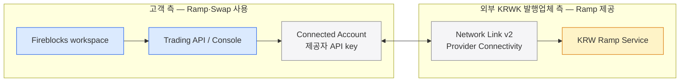
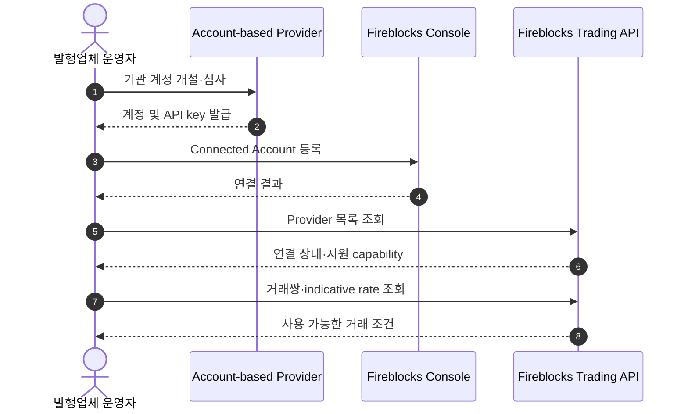
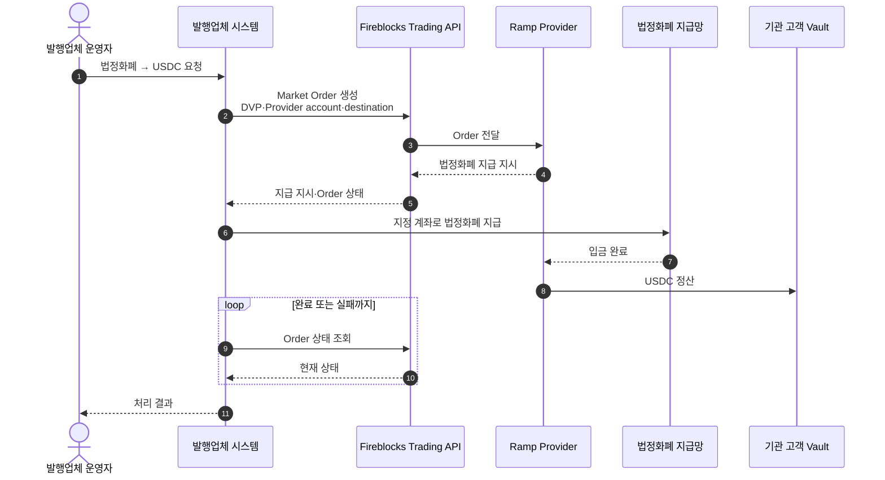
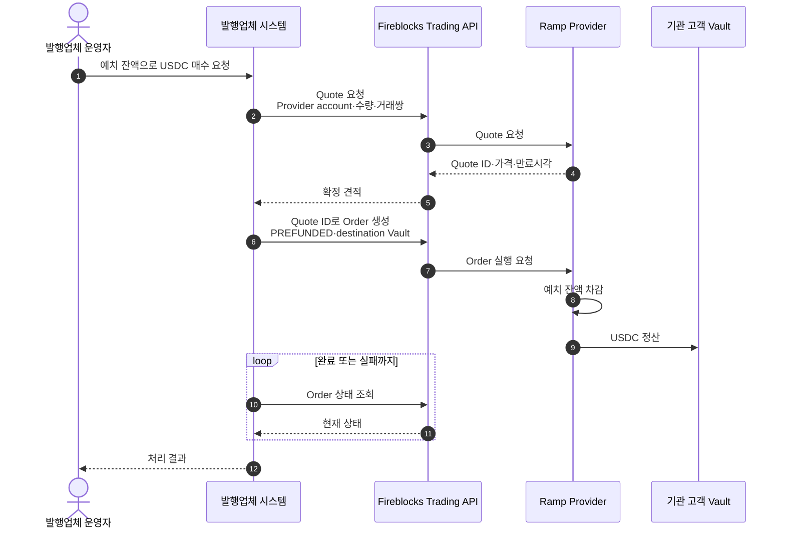
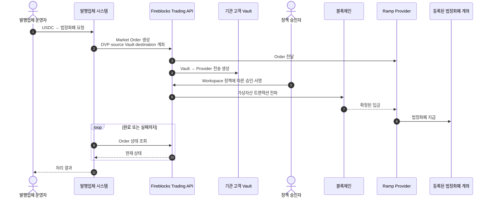
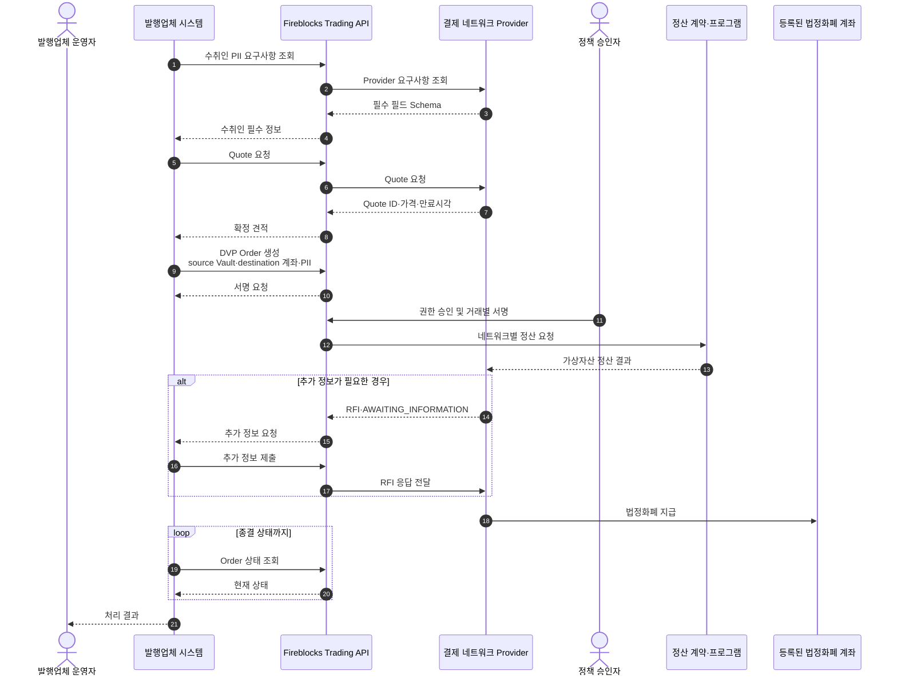

Fireblocks Network for Payments의 On/Off-ramp·Swap·Provider 연동을 정리한다.

> **적용 경계** — 이 문서는 외부 **KRWK 발행업체**와 Fireblocks 담당자의 질의응답을 정리한 기능 참고자료다. 우리 블록체인 지갑 서비스와는 별도 사업이며, 이 내용을 우리 서비스 역할이나 채택 설계로 연결하지 않는다.

## 결론

고객이 통합 Ramp Provider의 On/Off-ramp·Swap을 사용할 때의 진입점은 **Trading API**다. Account-based Provider라면 고객이 해당 제공자 계정을 만들고 API key를 Fireblocks **Connected Accounts**에 연결해야 한다. 반대로 KRWK 발행업체가 Ramp 서비스를 공급하려면 Network Link v2의 **Provider**로 연동하는 별도 모델이다.

위 발행업체 Provider 모델은 우리 지갑 서비스의 구성요소가 아니다.

## 시나리오별 시퀀스

아래 시퀀스는 **외부 KRWK 발행업체 사례를 이해하기 위한 기능 흐름**이다. 우리 블록체인 지갑의 시퀀스가 아니다. 또한 제공자별 capability와 계정 계약에 따라 가능한 흐름이 달라진다.

| 시나리오 | 근거 수준 | 핵심 조건 |
|---|---|---|
| Account-based Provider 연결 | 공식 문서·담당자 답변 | 제공자 계정, API key, Connected Account 필요 |
| On-ramp — DVP·Market | 공식 문서 | 외부 법정화폐 지급 완료 후 가상자산 정산 |
| On-ramp — Prefunded·Quote | 공식 문서 | 사전 예치 잔액, 유효한 Quote 필요 |
| Off-ramp — DVP·Market | 공식 문서 | 출발 Vault, 사전 등록된 법정화폐 수취계좌, 정책 승인 필요 |
| 별도 결제 네트워크형 Off-ramp | 공식 문서의 별도 흐름 | PII 요구사항, Quote, 네트워크별 권한 승인·서명, RFI 가능 |
| Gateway·Stable FX 계열 | 답변 없음 | 인터페이스 미확정이므로 시퀀스 작성 제외 |
| 발행업체와 Private LP 집계 | 담당자 제안 | [별도 기능검토](05-network-link-v2-liquidity.md#시나리오별-시퀀스)에서 구분 |

### 시나리오 A — Account-based Provider 연결·기능 조회

거래 요청 전에 기관 고객이 제공자와 직접 계정 관계를 만들고 그 인증정보를 연결해야 한다. 제공자가 Fireblocks에 등록됐다는 사실만으로 기관 고객이 곧바로 견적을 받을 수 있는 것은 아니다.

### 시나리오 B — On-ramp: DVP·Market

기관 고객이 Order를 생성하면 Provider의 법정화폐 지급 지시를 받아 외부 지급망에서 송금한다. Provider가 입금을 확인한 뒤 가상자산을 목적지로 정산한다.

`USDC 정산`의 구체적인 전송 주체·내부 심사·온체인 제출 SLA는 Provider 계약과 구현에 달려 있다. 이 다이어그램은 그 내부 단계를 확정하지 않는다.

### 시나리오 C — On-ramp: Prefunded·Quote

Provider 계정에 법정화폐가 이미 예치돼 있는 경우다. 먼저 확정 견적을 받고, 만료 전 해당 Quote를 참조해 Order를 생성한다.

Quote 만료, 잔액 부족 또는 Provider 거절 시 Order를 실행할 수 있으리라 가정하지 않는다. 재견적·재주문 규칙은 별도로 정해야 한다.

### 시나리오 D — Off-ramp: DVP·Market

기관 고객 Vault의 가상자산을 Provider로 보내고, Provider가 블록체인 수신을 확인한 뒤 사전 등록된 법정화폐 계좌로 지급하는 흐름이다.

정책 승인이 자동이라는 의미가 아니다. Workspace 정책에 수동 승인이 있으면 그 단계에서 대기하거나 거절될 수 있고, Provider의 입금 확인·법정화폐 지급에도 별도 처리시간이 생길 수 있다.

### 시나리오 E — 별도 결제 네트워크형 Off-ramp

공식 문서에 별도로 제시된 결제 네트워크형 Off-ramp는 일반 Account-based Ramp보다 추가 단계가 있다. 수취인 정보 요구사항을 먼저 조회하고, Quote와 Order 생성 뒤 지원 네트워크별 권한 승인·거래별 서명을 거친다. 심사 중 추가 정보 요청(RFI)이 발생할 수도 있다.

이 흐름은 **별도 결제 네트워크의 공식 기능 참고**일 뿐, 담당자 답변으로 확인된 Gateway·Stable FX 인터페이스는 아니다. 두 기능을 같은 것으로 간주하지 않는다.

## 1. On/Off-ramp는 `createTransaction + EXCHANGE`인가

질문은 기존 `createTransaction` API에서 source 또는 destination을 `EXCHANGE`로 설정하면 On/Off-ramp를 실행할 수 있는지였다. 담당자는 다음 Trading API를 안내했다.

- `GET /v1/trading/providers` — 사용 가능한 거래 제공자 조회
- `POST /v1/trading/orders` — 매수·매도 주문 생성

따라서 이번 답변 기준으로 Ramp 주문의 주 API는 **Trading API**다. `createTransaction + EXCHANGE`는 Ramp 주문의 확정 인터페이스로 답변되지 않았다. 정산 과정에서 별도 자산 이동으로 사용되는지는 추가 확인 대상이다.

공식 문서도 Trading API의 용도로 동일 네트워크 Swap, Account-based Provider를 통한 On/Off-ramp, 체인 간 Bridge·Swap을 설명한다. API 흐름은 `Provider 조회 → 선택적 Quote → Order 생성 → Order 상태 조회`다. ([Trading API Overview](https://developers.fireblocks.com/docs/trading-api-overview))

## 2. 제공자가 통합돼 있으면 자동으로 견적이 오는가

아니다. Account-based Provider를 사용하려면 다음 준비가 필요하다.

1. 해당 제공자에 고객 계정을 만든다.
2. 제공자 Console에서 API key를 발급한다.
3. Fireblocks Console의 Connected Accounts에서 계정을 연결한다.
4. Trading API로 Provider가 노출하는 기능을 확인한다.

공식 문서의 Provider 응답에는 `order`, `quote`, `rate` 지원 여부와 `connected` 상태가 따로 있다. 따라서 제공자가 Fireblocks에 통합돼 있다는 사실만으로 quote 기능과 특정 거래쌍이 자동 제공된다고 볼 수 없다. `GET /v1/trading/providers`도 Trading 기능이 현재 Beta이며 제공자별 manifest를 반환한다. ([Get Providers](https://developers.fireblocks.com/api-reference/trading-beta/get-providers))

Market Maker가 PSP·Trading Provider 범위에 포함되는지는 담당자 답변에 없다. 제공자 유형의 명칭보다 실제 `manifest`, 계정 연결 방식, 자산·거래쌍을 확인해야 한다.

## 3. Console Swap과 Trading API

담당자는 Swap을 Fireblocks Console과 Trading API 양쪽에서 사용할 수 있다고 설명했다. 공식 Trading API는 다음을 제공한다.

| 단계 | API |
|---|---|
| Provider 조회 | `GET /v1/trading/providers` |
| Quote 생성 | `POST /v1/trading/quotes` |
| Order 생성 | `POST /v1/trading/orders` |
| Order 조회 | `GET /v1/trading/orders/{orderId}` |

`POST /v1/trading/orders`는 Provider account, 실행 방식, 정산 방식과 source·destination account를 받는다. 공식 문서는 이 API를 Beta로 표시한다. ([Create Order](https://developers.fireblocks.com/api-reference/trading-beta/create-an-order))

Console이 이 API를 사용하는 UI라는 방향은 담당자 설명과 맞지만, Console과 API의 기능·권한·지원 Provider가 완전히 1:1인지는 확인되지 않았다.

## 4. Network Link v2는 누가 쓰나

이 대화에서 Network Link v2는 고객이 Ramp 주문을 넣는 API가 아니라 **KRWK 발행업체가 Ramp Provider로 Fireblocks에 서비스를 공급하는 인터페이스**로 제안됐다.

| 주체 | 역할 | 인터페이스 |
|---|---|---|
| Fireblocks 고객 | Ramp·Swap 이용자 | Trading API·Console·Connected Account |
| 외부 KRWK 발행업체 | KRW Ramp 공급자 | Network Link v2 Provider Connectivity |
| 우리 블록체인 지갑 서비스 | 이 외부 사례의 당사자가 아님 | 설계 반영 없음 |

발행업체가 Provider가 되면 KRW Ramp를 Fireblocks 고객에게 노출할 수 있다는 것이 담당자의 제안이다. 실제 온보딩·지원 범위·규제·정산 조건은 확인되지 않았다.

## 5. 별도 결제 네트워크·Gateway 계열

별도 결제 네트워크와 Gateway·Stable FX 계열은 Ramp·Account-based Provider와 다른 인터페이스인지 질문했다. 담당자는 결제 네트워크 관련 자료를 이메일로 보내겠다고 했지만 제공된 대화에는 후속 내용이 없다. Gateway·Stable FX 계열에 대한 답변도 없다.

따라서 이 영역은 다음을 확인하기 전까지 **미확정**이다.

- 고객 측 API와 Provider 측 API
- Trading Order와 결제 instruction의 관계
- FX Quote·Swap·정산의 상태 모델
- Connected Account 필요 여부
- 온체인·오프체인 정산 경계

## 우리 설계에 미치는 영향

**없다.** 이 사례의 주체는 외부 KRWK 발행업체이고, 우리는 별도의 블록체인 지갑을 구축한다. 이 문서는 Fireblocks 기능 지형을 이해하기 위한 참고자료이며 블록체인 매니저의 Ramp·Swap 흐름, API 또는 역할을 변경하지 않는다.

## 확인 필요

- Ramp Order와 실제 자금 이동에서 `createTransaction`이 사용되는 정확한 단계
- 제공자별 quote·rate·order·settlement capability와 지원 거래쌍
- Market Maker의 Trading Provider 등록 조건
- Console과 Trading API의 기능·권한 대응
- 별도 결제 네트워크·Gateway·Stable FX 계열의 인터페이스
- 발행업체 Ramp Provider 온보딩·규제·정산·SLA 요건
- 담당자가 이메일로 보내기로 한 자료와 이전 세션 발표 자료

## 출처

| ID | 출처 | 반영 범위 |
|---|---|---|
| FB-TRD-001 | [Trading API Overview](https://developers.fireblocks.com/docs/trading-api-overview) | Trading 용도, Provider 유형, Connected Account, Quote·Order 흐름 |
| FB-TRD-002 | [Get Providers](https://developers.fireblocks.com/api-reference/trading-beta/get-providers) | Provider 목록·manifest·연결 상태, Beta 상태 |
| FB-TRD-003 | [Create Order](https://developers.fireblocks.com/api-reference/trading-beta/create-an-order) | Order 생성, Provider·실행·정산·source/destination 입력 |
| FB-TRD-004 | [Account-based Provider Ramp 시나리오](https://developers.fireblocks.com/docs/on-ramp-off-ramp-and-bridgeswap-via-account-based-providers-cefi) | 계정 연결, DVP·Prefunded On-ramp, DVP Off-ramp 흐름 |
| FB-PAY-001 | [별도 결제 네트워크 Off-ramp 가이드](https://developers.fireblocks.com/docs/circle-payments-network-cpn-api-guide) | PII 요구사항, Quote·Order·서명·RFI·상태 조회 흐름 |
| FB-SUP-003 | [외부 발행업체 질의응답](../../../sources/fireblocks-support/2026-08-12__payments-ramp-trading-conversation.md) | Ramp API 답변, Connected Account, Console Swap, Provider 제안, 미답변 질문 |

담당자 대화의 출처와 SHA-256은 `blockchain-manager/sources/fireblocks-support/manifest.yml`에 기록한다.

## Related

- [외부 발행업체의 Private LP RFQ 검토](05-network-link-v2-liquidity.md)
- [Fireblocks Network·Smart Transfer](01-fireblocks-network.md)
