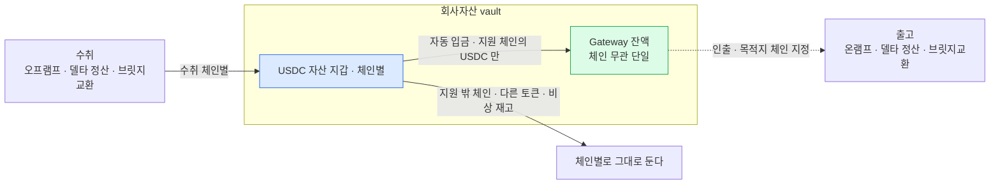

도입은 미정이다. 쓰기로 할 경우의 운영 설계안이고, 도입 판단의 재료다. 기능 자체는 [기능](02-usdc-gateway.md), 어느 vault 에 붙일 수 있는지는 [배치](03-usdc-gateway-placement.md).

## 전제 — 회사자산 vault 는 이미 체인별 재고 문제를 안고 있다

회사자산 vault 는 회사가 들고 있는 토큰 자산이고, 하는 일이 넷이다.

| 하는 일 | vault 기준 방향 | 체인을 정하는 쪽 |
|---|---|---|
| 온램프 대응 | **출고** — 미리 채워 둔 재고가 델타 배치로 옴니버스(고객 몫)로 나간다 | 고객이 받을 체인 |
| 오프램프 대응 | **수취** — 고객이 낸 토큰이 회사자산으로 넘어온다 | 고객이 낸 체인 |
| 델타원장 정산 | 양방향 | 맞출 대상 |
| 브릿지교환 | 양방향 — 남는 BC자산을 받고 부족한 BC자산을 내준다 | 출금 풀의 과부족 |

**넷 다 체인을 우리가 고르지 못한다.** 그래서 체인마다 USDC 를 깔아 두고 각각 관리해야 하고, 어느 체인이 마르면 그 일이 막힌다.

**Gateway 는 이 vault 의 재고를 체인 무관 잔액 하나로 만든다** — 단 범위가 있다.

| | 범위 |
|---|---|
| 자산 | **USDC 만.** 원화 SC 등 다른 토큰은 해당 없음 |
| 네트워크 | **Fireblocks Gateway 가 지원하는 체인만**([기능](02-usdc-gateway.md) 지원 체인 표) |

전체 재고 문제를 없애는 것이 아니라 **지원 네트워크의 USDC 재고 문제를 줄이는 것**이다. 지원 밖 체인과 다른 토큰은 지금처럼 체인별로 들고 있어야 한다. 밴드C 예시에 있는 SOL-USDC 도 Fireblocks 지원 목록에 없다.

브릿지교환은 이 위에 얹히는 네 번째 용도이고, 도입 근거는 나머지 셋에도 그대로 적용된다.

## 회사자산 vault 에만 붙인다

고객자산(옴니버스)에는 붙이지 않는다.

| | 고객자산 Gateway | **회사자산 Gateway** |
|---|---|---|
| 20% 규제 | 총자산합 필수 포함 · 핫 여부 판단 | **산식 밖** — 밴드S 는 고객자산 기준 |
| 수탁 설명 | 고객자산이 Circle 컨트랙트에 있는 것을 설명해야 한다 | 회사 자금이라 해당 없음 |
| 감지 | 고객 입금·Gateway 입금·승인을 갈라야 한다 | 회사 vault 라 고객 흐름과 안 섞인다 |
| 얻는 것 | 출금 풀을 한 단계 짧게 채운다 | 브릿지교환 상대편 재고가 체인 무관이 된다 |

얻는 것은 비슷한데 고객자산 쪽은 규제·수탁·감지가 전부 따라온다. 고객자산 Gateway 는 20% 분류가 정해진 뒤에 다시 본다 — 그때 걸리는 것은 [우리 구조에 걸리는 것](04-usdc-gateway-fit.md)에 있다.

## 운영 고리

- **수취** — 상대가 정한 체인으로 들어와 회사자산 vault 에 쌓인다. 그중 **Gateway 가 지원하는 체인의 USDC 만** 자동 입금이 흡수하고, 그 범위에서는 체인별로 남겨 둘 이유가 없어진다. **체인 무관이 되는 것은 Gateway 에 예치된 뒤부터다.**
- **출고** — 필요한 체인을 목적지로 지정해 인출한다. 소스 체인을 지정하지 못하는 제약이 여기서는 걸리지 않는다.
- **그대로 남는 것** — 지원 밖 체인, USDC 가 아닌 토큰, 그리고 Gateway 가 멈췄을 때 쓸 비상 재고는 지금처럼 체인별 자산 지갑에 둔다. 자동 예치를 쓰면 **비상 재고는 별도 vault 에 둔다**(아래 자동화 범위).

점선은 아직 안 정했다. 여기서 회사자산 vault 는 **Gateway 가 결속된 그 vault** 다.

| 인출 목적지 | 기술 | 남은 것 |
|---|---|---|
| 최종 목적지로 바로 — 옴니버스(브릿지교환 지급)·온램프 대응 목적지 등 | **확인됨** — 다른 vault account 와 일회성 주소를 예제가 보인다([기능](02-usdc-gateway.md)) | 운영 선택 |
| Gateway 가 결속된 **같은 vault** 로 되돌려 받기 | **미확인** — 예제에 없다 | 실측·문의 |

한 단계로 줄일지, vault 를 거쳐 통제점을 하나 둘지가 운영 기준이다. 뒤쪽을 고르려면 같은 vault 지정이 되는지부터 확인해야 한다.

## 밴드G

밴드가 하나 늘어난다.

| 밴드 | 대상 | 축 |
|---|---|---|
| 밴드S | 고객 vault + 옴니버스 + 출금 풀 | 핫 비율 |
| 밴드C | 출금 풀 | BC자산별 절대 수량 |
| **밴드G** | **회사 Gateway 잔액** | **총량 하나** — 체인 구분 없음 |

축이 하나라 구성을 맞출 것은 없다. **밴드G 는 밴드S 의 20% 산식 대상이 아니다** — 확인된 것은 거기까지다. 상한은 회사자산 운용·리스크 정책으로 정한다.

**하한 하나로는 안 되고 정할 것이 더 있다.**

| | 무엇 |
|---|---|
| 하한 | 이 밑이면 보충한다 |
| 목표 잔액 | 보충을 어디까지 채울지 |
| 보충 원천 | 어느 체인의 회사자산 USDC 로 채울지 |
| **진행 중 예치** | 확정 잔액과 **분리해서** 센다. 가용 잔액에 넣으면 못 쓰는 금액까지 재고로 약속하게 되고, 아예 무시하면 중복 예치가 난다 |
| 중복 예치 방지 | 자동 예치와 수동 보충이 같은 잔액을 두고 겹치지 않게 |

값을 둘로 나눠 쓴다.

| | 무엇에 쓰나 |
|---|---|
| **확정 잔액** | 실제로 인출해 쓸 수 있는 양. **온램프 대응·델타 정산 출고분·브릿지교환 지급**에 약속할 수 있는 값은 이것뿐이다 |
| **진행 중 예치** | 확정 대기 중인 예치. **중복 보충을 막는 데만** 쓴다. 보충 판정에서 빼 두고 가용 잔액으로는 세지 않는다 |
| **비상 재고** | Gateway 나 Circle 이 멈췄을 때 쓸 몫을 온체인에 남길지. **Gateway 결속 vault 에 남기면 그 vault 의 자동 예치와 같이 쓸 수 없다**(아래 자동화 범위) |
| 컨트랙트 노출 한도 | 회사자산 USDC 중 얼마까지 Circle 컨트랙트에 둘지 |

**하한 기준** — 한 라운드 수요를 감당하고, 채우는 데 걸리는 시간만큼 여유를 더한다.

밴드G 가 마른다고 업무가 곧바로 멈추지는 않는다. **Gateway 를 재고 원천으로 쓰는 흐름이 제한될 뿐이고, 온체인 비상 재고가 있으면 그 한도 안에서는 계속 돌아간다.** 비상 재고까지 소진되면 **출고 방향**이 멈춘다 — 온램프 대응·델타 정산 출고분·브릿지교환 지급이다. **수취 방향은 재고가 없어도 된다** — 오프램프처럼 들어오는 흐름은 오히려 재고를 늘린다. 밴드G 하한과 비상 재고를 같이 잡아야 하는 이유다.

채우는 시간은 **어느 체인에서 예치하느냐에 따라 크게 다르다**. Circle 기준으로 이더리움·Base 계열은 13~19분이지만 다른 지원 체인은 0.5~8초다([참고](99-circle-gateway.md)). 여기에 Fireblocks 를 거치는 시간이 더해지는데 그건 실측 전이다. **단일 값으로 잡지 말고 실제 보충에 쓰는 소스 체인의 최대 확정시간 + 벤더 처리시간으로 잡는다.**

### 판정 순서

밴드G 를 항상 뒤로 미룰 수는 없다. **밴드C 보충 원천으로 Gateway 를 고르면 그 시점에 밴드G 확정 잔액이 있어야 하기 때문**이다.

1. **밴드S** 를 판정한다 — 규제라 먼저다
2. **밴드C** 의 보충 필요량을 계산한다
3. 보충 원천을 고른다 — 브릿지교환·콜드교환·Gateway
4. **Gateway 를 골랐으면 밴드G 확정 잔액을 확인하고 그만큼 예약한 뒤** 보충을 실행한다. 모자라면 다른 원천으로 넘어간다
5. **밴드G 목표 잔액 복원은 후행**한다 — 다음 라운드 대비 작업이다

즉 **밴드G 확인은 밴드C 보충의 앞**, **밴드G 복원은 뒤**다.

## 자동화 범위

| | 자동 | 근거 |
|---|---|---|
| 회사자산 vault → Gateway (예치) | **조건부로 켠다** | 회사자산 안에서의 이동이라 경계를 넘지 않는다. 다만 아래 제약이 있다 |
| Gateway → 목적지 (인출) | **안 켠다** | 벤더에 자동 인출 기능이 없다. 경계를 넘는 건은 승인이 붙어야 한다 |

**자동 예치를 켜면 회사 vault 의 온체인 USDC 가 계속 비워진다.** `balanceThreshold` 는 **남겨 둘 준비금이 아니라 실행 조건**이다 — 잔액이 그 값 이상이면 가용 잔액을 쓸어 담는다. 넣기만 하고 빼는 경로와 실패 복구가 확정되지 않은 상태에서 켜면, 회사자산 USDC 전부가 Gateway 로 가 있을 수 있다.

그래서 **인출 경로와 실패 복구가 정해진 뒤에 켠다.** 그 전에는 수동 예치로 둔다.

### 같은 vault 에서 비상 재고와 자동 예치는 같이 못 쓴다

**`balanceThreshold` 로는 비상 재고를 남길 수 없다.** 그 값은 실행 조건이지 남겨 둘 몫이 아니라, 임계를 넘으면 가용 잔액을 다 가져간다. 자동 예치를 켠 vault 에 비상 재고를 두면 그대로 Gateway 로 넘어간다.

비상 재고를 유지하기로 하면 둘 중 하나다.

| 안 | 어떻게 |
|---|---|
| **vault 를 나눈다** | 자동 예치 대상 vault 와 비상 재고를 두는 vault 를 분리한다. 자동 예치는 vault account 단위 설정이라 대상 밖 vault 는 건드리지 않는다 |
| **자동 예치를 안 쓴다** | 비상 재고를 뺀 초과분만 수동으로 예치한다. 남길 양을 우리가 정하는 대신 예치를 매번 내야 한다 |

vault 를 나누면 Gateway 가 붙은 vault 가 어느 쪽인지, 비상 재고를 쓸 때 어떤 경로로 꺼내는지를 같이 정해야 한다.

자동 입금을 켜면 `USDC Gateway Depositor` 서비스 유저가 입금 거래를 제출한다. 이 유저는 서명을 못 하므로 정책 룰에 별도 서명자를 지정한다([기능](02-usdc-gateway.md) 정책 준비).

`balanceThreshold` 는 **가스비 낭비를 막는 값**이다. 소액이 들어올 때마다 예치 거래를 내지 않게 하는 최소 금액이지, Gateway 잔액을 얼마로 유지할지도 회사 vault 에 남길 몫도 아니다. 그건 밴드G 가 본다.

## 원장·감지

**고객 토픽에는 싣지 않는다.** `internal-events` 에 실리는 내부 이체는 **delta 정산뿐**이고([감지](../설계/02-bcm-flow.md)), delta 는 고객 원장과 대응되는 이동이다. Gateway 예치는 회사자산 안에서 자리만 옮기는 것이라 대응할 고객 원장이 없다.

**그런데 sweep 과 같은 취급으로는 안 된다.** 현재 감지는 **제출 원장이 기준**이다 — 우리 vault 에서 나간 거래인데 `bcm_sbmt_l` 에 행이 없으면 "우리가 내지 않은 전송" 으로 보고 별도 알림 채널로 통지한다([흐름](../설계/02-bcm-flow.md) 웹훅 계열 분류). sweep 은 우리가 제출하므로 그 행이 남지만, **Gateway 자동 예치와 첫 `APPROVE` 는 벤더 서비스 유저가 만들어 그 행이 없다.** 그대로 두면 정상 거래가 매번 이상 거래로 올라온다.

정해야 할 것이 넷이다.

| | 무엇 |
|---|---|
| **계열 구분** | Gateway 예치·인출·승인을 서로, 그리고 기존 계열과 가를 값. 후보는 `subType: VIRTUAL_ACCOUNT`·거래 종류 `APPROVE`·제출자 `USDC Gateway Depositor` |
| **제출 원장 회수** | 벤더가 만든 거래를 어떻게 원장에 들일지. 웹훅 수신 시 역으로 행을 만들지, 계열 자체를 예외로 둘지 |
| **추적 범위** | 고객 토픽에는 안 싣되 상태 추적과 대사에는 넣어야 한다. 밴드G 판정 입력이기도 하다 |
| **정상과 이상의 경계** | 자동 예치는 정상이고 **우리가 낸 적 없는 수동 Gateway 거래는 이상**이다. 둘 다 제출 원장에 행이 없어 지금 기준으로는 안 갈린다 |

기록 형태가 실측 전이라 규칙을 확정할 수 없다([기능](02-usdc-gateway.md) 아직 모르는 것). **감지 규칙이 서기 전에는 자동 예치를 켜지 않는다.**

**경계를 넘는 건은 목적지가 아니라 업무 요청으로 가른다.** 같은 Gateway → 옴니버스 인출이 브릿지교환 지급일 수도, 온램프 델타 지급일 수도 있다 — 목적지로 정하면 델타 지급을 브릿지교환으로 잘못 분류해 존재하지 않는 반대 다리를 기다리게 된다.

| 업무 요청 | 기록 |
|---|---|
| 델타 정산 | 제출 원장 `INTERNAL` — 아래 델타 분류 경로 그대로 |
| 브릿지교환의 한 다리 | **교환 식별자로 두 다리를 묶어** 기록 — 반대 다리와 짝 |
| 벤더 생성 Gateway 거래 (자동 예치·첫 `APPROVE`) | 별도 Gateway 계열 — 위 표 |

## 선행해서 정할 것

| | 왜 걸리나 |
|---|---|
| **회사자산 vault 의 용도 구분** | 용도별로 매핑한다는 것까지 정했고 코드값은 우리가 정한다. 2축안은 [정합 점검](../../블록체인매니저/설계/13-backend-db-alignment.md). Gateway 를 어느 용도 vault 에 붙일지가 여기서 갈린다 |
| 밴드G 하한 값 | **출고 수요**의 실제 규모와 보충 시간을 알아야 잡힌다 — 온램프 대응·델타 정산 출고분·브릿지교환 지급. 오프램프 수취량은 하한 수요가 아니라 보충 요인이다 |
| 인출을 Gateway 결속 vault 로 경유시킬지 | **같은 vault 를 목적지로 지정할 수 있는지가 미확인**이다. 다른 vault·일회성 주소는 확인됐다 |
| **감지 규칙** | 벤더가 만든 거래를 제출 원장 기준 감지가 어떻게 받아들일지. 자동 예치를 켜는 선행 조건이다 |
| 조회 응답의 실제 형태 | 밴드G 판정 입력. 문서마다 다르다([기능](02-usdc-gateway.md)) |

첫 줄이 선행이다. 회사자산 vault 가 용도별로 몇 개인지에 따라 Gateway 를 붙일 자리가 정해지고, 비상 재고를 별도 vault 에 둘지도 같이 풀린다.

**델타 배치의 계열 분류는 이미 해결돼 있다** — 백엔드가 델타 내부이체를 제출하면 **매니저가 벤더 제출 전에** `bcm_sbmt_l.tx_dvcd = INTERNAL` 을 기록하고, 웹훅 감지가 `externalTxId` 로 그 행을 찾는다([흐름](../설계/02-bcm-flow.md) 웹훅 계열 분류). **용도 매핑은 계정 식별과 TAP 정책에 쓰이지 계열 판정 근거가 아니다.** 남는 것은 제출 원장이 없는 **벤더 생성 Gateway 거래**(자동 예치·첫 `APPROVE`)뿐이고 그건 위 "원장·감지" 에 있다.
