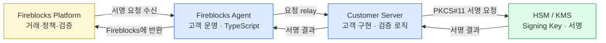
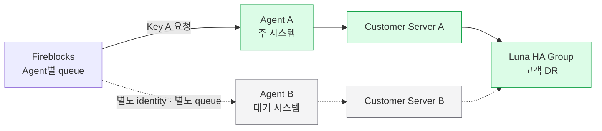

Fireblocks의 지갑·정책·거래 흐름은 쓰되 **서명키와 서명 실행은 우리 HSM 안에 두는 방식**이다. SaaS MPC의 배포 변형이 아니라 고객 관리 키를 연결하는 별도 workspace 모델이다.

**도입은 미정이다.** Thales Luna 연동은 기술적으로 가능하다는 답을 받았지만, Customer Server의 production 구현과 Agent failover는 고객 책임이다. 정확한 가격·지원 수준·운영 SLA까지 받아야 도입안을 닫을 수 있다.

담당자에게 보낸 질문과 원문 답변의 맥락은 [Fireblocks QnA](../Fireblocks%20QnA/01-qna.md)의 KeyLink 절에 있다.

## 결론

Key Link가 맞는 경우는 분명하다.

- Fireblocks 측에 개인키나 MPC key share를 두면 안 된다는 내부·규제 요건이 있다.
- 이미 운영 중인 Thales Luna 같은 HSM을 자산으로 활용해야 한다.
- 서명 직전에 사내 정책·거래 검증 로직을 한 번 더 적용해야 한다.

그 대신 고객이 가져오는 책임도 크다.

| 고객이 얻는 것 | 고객이 맡는 것 |
|---|---|
| Signing Key의 HSM 보관·서명 통제 | Customer Server의 production 구현·보안 패치 |
| Fireblocks의 vault·node·Policy·Network·compliance 기능 | Agent·Customer Server 감시와 주·대기 시스템 전환 |
| Customer Server 내부의 추가 검증·거절 로직 | HSM HA·backup·partition 복구 |
| HSM 모델 선택의 자유 | PKCS#11·Luna Client·NTLS·방화벽 운영 |

**현재 판단은 조건부 검토 계속**이다. 기능 적합성은 있지만 다음 넷이 도입 관문이다.

1. 고객이 개발·호스팅하는 Customer Server의 production 구현 범위
2. 주 Agent 장애 시 대기 Agent로 Signing Key 요청을 어떻게 넘길지
3. 7일 message queue와 Fireblocks transaction timeout의 관계
4. Key Link add-on·Customer Server 구축·Professional Services·Thales의 총비용

## Hosted MPC 대비 고객 준비사항

Hosted MPC에서도 고객이 Co-Signer 실행 환경, network, HA·DR, patch, monitoring을 준비한다. 이 공통 항목을 Key Link 준비사항으로 다시 나열할 필요는 없다. **Hosted MPC에서 Key Link로 바꿀 때 달라지는 준비**는 다음과 같다.

| 비교 항목 | Hosted MPC | Key Link에서 고객이 준비할 것 |
|---|---|---|
| 서명키 보관 | 고객 환경의 Co-Signer가 MPC share 3개 보관 | PKCS#11 HSM과 `secp256k1`·`ed25519` 지원 여부, Luna firmware·Client·NTLS 연결 |
| 실행 구성요소 | Hosted Co-Signer 배포 | Fireblocks Agent 배포와 Customer Server 개발·호스팅 |
| 키 생성·등록 | MPC key generation과 share backup | Validation Key·Signing Key 생성, Proof of Ownership, Agent 지정, vault별 key 할당 |
| 키 수량 | MPC master key에서 주소 파생 | vault마다 ECDSA key·EdDSA key를 별도로 준비하며 다른 vault에 재사용 불가 |
| 서명 전 검증 | Co-Signer Callback Handler | Customer Server에서 요청 검증·거절과 HSM 호출 구현. 기존 검증 기준을 옮길지 결정 |
| 키 HA·복구 | Co-Signer share의 backup·DR | Luna HA group·partition cloning·Luna Backup HSM 등 HSM 자체 방식으로 구성 |
| 구성요소 전환 | Hosted MPC의 HA 구성 | Signing Key가 특정 Agent user에 결속되므로 주 Agent 장애 시 대기 Agent 전환 절차를 별도 확정 |
| 추가 비용 | Hosted MPC 계약 범위 | Key Link add-on, Customer Server 구축·Professional Services, Luna·Thales 비용 |

따라서 고객이 새로 준비할 핵심은 네 가지다.

1. **HSM 호환성** — 현재 Luna가 필요한 알고리즘과 PKCS#11을 지원하는지 확인한다.
2. **Customer Server 구현** — production code의 개발·운영 범위와 담당 조직을 정한다.
3. **외부 키 운영** — vault 수에 맞춘 Signing Key 수량과 등록·backup 방식을 정한다.
4. **Agent 전환과 비용** — 대기 Agent 전환 절차와 Key Link 추가 비용을 Fireblocks에서 확정한다.

일반적인 server sizing, firewall 신청, monitoring, 운영 조직은 Hosted MPC와 공통이므로 이 절의 별도 준비사항에서는 제외한다.

## 제품 경계

| | SaaS MPC | Hosted MPC | **Key Link** |
|---|---|---|---|
| 키·share | Fireblocks Cloud와 signer에 MPC share 분산 | 고객 host의 Co-Signer를 포함해 MPC share 분산 | **고객 HSM의 외부 Signing Key** |
| 서명 | MPC protocol | MPC protocol | HSM의 ECDSA·EdDSA 서명 |
| 고객 실행 요소 | Mobile·API Co-Signer 선택 | Hosted Co-Signer | Agent + Customer Server + HSM |
| Fireblocks 역할 | 키 plane + 운영 plane | 키 plane + 운영 plane | 거래 요청·검증 + 운영 plane |
| 고객 DR 중심 | Fireblocks MPC backup 절차 포함 | Hosted share backup 포함 | **HSM-native HA·backup** |

Key Link에서도 Fireblocks의 Admin Quorum·Approval Group·Policy가 사라지지 않는다. Customer Server 검증은 그 위에 더해지는 고객 측 관문이다. 어느 한쪽이 다른 쪽을 대신한다고 보면 안 된다.

## 구성요소와 통신 경로

| 구성요소 | 책임 | 운영 주체 |
|---|---|---|
| Fireblocks Platform | Policy를 통과한 signing request 생성, Agent별 queue, 서명 결과 검증, transaction 진행 | Fireblocks |
| Fireblocks Agent | request를 받아 Customer Server로 전달하고 결과를 반환 | 고객 |
| Customer Server | 요청 검증·승인/거절, HSM 호출, custom logic | **고객이 production 구현** |
| HSM Component | 개인키 보관과 실제 서명 | 고객 |
| HSM Adaptor | offline/cold HSM과의 전달. online 구성에서는 Customer Server 내부 또는 별도 요소 가능 | 고객 |

Fireblocks는 [`fireblocks-agent`](https://github.com/fireblocks/fireblocks-agent) 저장소에 interface contract와 동작하는 예제 서버, Thales Luna build를 제공한다고 답했다. 다만 예제는 **reference code이지 production software가 아니다.**

`Fireblocks Key Link Overview` PDF는 Customer Server를 **고객이 개발하고 호스팅하는 구성요소**로 설명하며 KeyLink Flow는 언급하지 않는다. KeyLink Flow는 이후 담당자 Q&A와 별도 배치 제안서에서 packaged online server와 operator console을 갖춘 대안으로 제시됐을 뿐이다. 별도 구매 제품인지, Key Link 계약·Professional Services에 포함되는지, 지원 topology·cold mode·HA·배포 위치·가격은 확인되지 않았다. 따라서 현재 기본안은 고객 구현 Customer Server이며, KeyLink Flow는 계약 형태가 확인되기 전까지 대체안으로 확정하지 않는다.

### Key Management Dashboard와 KeyLink Flow

Key Management Dashboard는 별도 서버가 아니라 **Fireblocks Console의 `Settings > External Keys` 화면**이다. Validation Key·Signing Key 등록, PoO 상태 확인, Agent user 연결, vault key 할당을 제공하며 같은 작업을 REST API로도 수행할 수 있다.

이 화면이 있어도 Fireblocks Agent·Customer Server·HSM은 그대로 필요하다. Dashboard 문서의 장애 확인 절차도 Agent 실행 상태와 Customer Server·HSM의 정상 동작을 확인하도록 안내한다. 따라서 Dashboard는 Key Link workspace에 포함된 **키 관리 UI**이며 packaged server를 대신하지 않는다. KeyLink Flow의 operator console이 이 Dashboard를 뜻하는지, 별도 UI인지는 제공된 자료만으로 확인되지 않는다.

## 키 모델과 등록

### 키 둘의 역할

| 키 | 역할 | 이번 답변에서 확인한 요구사항 |
|---|---|---|
| Validation Key | 새 Signing Key를 등록할 권한을 증명 | 담당자 답변: RSA-2048 · 공개 예제와 정합 확인 필요 |
| Signing Key | wallet 주소를 만들고 실제 transaction에 서명 | ECDSA `secp256k1` 또는 EdDSA `ed25519` |

Validation Key를 추가할 때는 Console의 `Add validation keys` Approval Group 승인이 붙는다. 등록된 활성 상태의 Validation Key가 새 Signing Key의 public key certificate에 서명하고 Fireblocks가 이를 검증한다.

여기에는 **근거 간 정합 확인이 하나 남는다.** 2026-08-28 담당자는 Validation Key를 RSA-2048이라고 답했지만, 수집된 Getting Started 문서의 certificate 예제는 Ed25519 private key도 처리하는 형태다. 현재 API가 허용하는 Validation Key 알고리즘을 endpoint schema와 vendor 답변으로 다시 확정하기 전에는 RSA-2048만 가능하다고 조달 조건에 고정하지 않는다.

### Proof of Ownership

Signing Key 등록에는 둘 중 한 방법을 쓴다.

| 방식 | 흐름 | 성질 |
|---|---|---|
| Interactive | key를 먼저 등록 → Fireblocks가 Agent로 challenge 전송 → 해당 HSM key로 서명 → 검증 후 enable | Agent·Customer Server·HSM을 거쳐 PoO를 수행한다 |
| Non-interactive | 사전에 PoO message를 HSM으로 서명해 등록 요청에 첨부 → 검증되면 바로 enable | 대량·자동 등록에 유리하지만 message 조립과 freshness 통제가 필요하다 |

Interactive challenge는 `sha256({tenant_id}-{request_id}-{key_id})`로 계산한다. Non-interactive message에는 workspace 이름, 요청 API key, HSM key ID, 서명 시각이 들어간다. 구현할 때는 공식 endpoint schema의 정확한 byte·encoding 형식을 그대로 따라야 한다.

### Agent와 Policy 결속

1. Console에서 `Signer` 역할 API user를 만든다.
2. Admin Quorum 승인을 받는다.
3. pairing token으로 Agent와 API user를 연결한다.
4. Signing Key 등록 때 그 키의 요청을 받을 Agent user ID를 지정한다.
5. Policy rule의 designated signer도 해당 Agent API user로 둔다.

**Signing Key가 특정 Agent user에 결속된다는 점이 HA 설계를 제한한다.** 서버만 두 대 띄운다고 같은 키의 요청이 두 Agent에 자동 분산되지 않는다.

## Vault와 asset wallet 제약

- vault account 하나에는 **ECDSA key 하나와 EdDSA key 하나**를 할당할 수 있다.
- 한 vault에 할당한 key는 다른 vault에서 다시 쓸 수 없다.
- vault 생성 때 가용 key pool에서 자동 할당하거나 나중에 수동 할당할 수 있다.
- asset wallet의 chain이 요구하는 알고리즘 key가 그 vault에 없으면 생성할 수 없다.

따라서 vault 수량이 곧 필요한 key pair 수량에 영향을 준다. 고객별 vault를 대량으로 만드는 모델이라면 **vault 증가량 × 알고리즘별 key 생성·등록·HSM object 운영량**을 함께 산정해야 한다.

## Thales Luna 적용 조건

담당자 답변은 특정 Luna 모델을 인증·강제하지 않고 다음 **알고리즘·인터페이스 조건**을 제시했다.

| 범위 | 조건 |
|---|---|
| HSM interface | PKCS#11 |
| Bitcoin·EVM signing | ECDSA `secp256k1` |
| Solana 등 EdDSA signing | EdDSA `ed25519` |
| Validation Key | 담당자 답변은 RSA-2048. 공개 예제와의 정합은 재확인 |
| Customer Server host | Luna Client 설치, Luna appliance와 NTLS 연결, Luna client 등록 |

담당자가 Thales 통합 가이드를 인용한 내용은 다음과 같다.

- ECDSA `secp256k1`: Luna 7.x firmware에서 동작
- EdDSA `ed25519`: Luna firmware **7.8.9 이상** 필요
- Thales 시험 구성: Luna Network HSM firmware 7.8.4 + Luna Client 10.3.0

펌웨어 수치는 Fireblocks 공식 공개 사양을 직접 확인한 값이 아니라 **담당자가 Thales 문서를 인용한 2차 정보**다. 조달 명세에는 Thales의 현재 compatibility matrix와 지원 확인서를 다시 받아 넣는다. 특히 Solana를 포함하면 Ed25519 firmware 조건에 대한 지원 확인이 필요하다.

## Agent 배포와 HA·DR

### 권장 host

다음은 hard minimum이 아니라 Fireblocks 담당자의 deployment guidance다.

| 항목 | 기준 |
|---|---|
| OS | Ubuntu 22.04 LTS 이상 또는 Docker를 지원하는 Linux |
| Runtime | Docker. VM·container 지원 |
| Memory | 환경당 8 GB RAM |
| Storage | 암호화된 100 GB SSD |
| Network | Fireblocks endpoint로 안정적인 outbound 연결, firewall 목적지 제한 |

Agent는 stateless로 설명됐지만 **업무 요청은 Fireblocks 측 Agent별 queue에 있다.** 미전달 요청은 최대 7일 보존되고 delivery는 at-least-once다. 재접속 뒤 같은 요청이 다시 올 수 있으므로 Customer Server는 request 식별자를 기준으로 중복 서명·중복 상태 전이를 안전하게 처리해야 한다.

### 권장 topology

한 workspace에 여러 Agent를 pair할 수 있으나 Agent마다 identity·queue가 다르고 Signing Key도 특정 Agent user에 결속된다. 담당자의 현재 권장은 **현재 요청을 처리하는 주 시스템과 장애 시 넘겨받는 대기 시스템을 두는 구성(active/passive)**이며, 이를 자동으로 전환하는 기능은 없다.

HSM key 복구는 Fireblocks가 아니라 Luna-native 기능으로 설계한다. 담당자는 Luna HA group, partition cloning, Luna Backup HSM을 예로 들었다. Agent·Customer Server DR과 HSM key DR은 서로 다른 운영 책임이다.

## 정상 서명 흐름

1. 사용자가 transaction을 생성한다.
2. Fireblocks Policy와 approval 조건이 적용된다.
3. designated signer로 지정된 Agent user의 queue에 signing request가 간다.
4. Agent가 Customer Server로 전달한다.
5. Customer Server가 업무 규칙·transaction 내용을 검증하고 HSM에 서명을 요청하거나 거절한다.
6. HSM 서명이 Agent를 거쳐 Fireblocks로 돌아간다.
7. Fireblocks가 서명을 검증하고 transaction lifecycle을 계속 진행한다.

Key Link는 signing plane을 바꾸지만 Fireblocks의 transaction 상태·webhook·Policy를 없애지 않는다. 서명 요청이 오래 queue에 머물렀을 때 transaction timeout과 어떻게 정합되는지는 Fireblocks 확인이 필요하다.

## 가격 경계

이번 답변에서 확인된 것은 구조뿐이다.

- Key Link는 Fireblocks subscription의 **paid add-on**이다.
- Professional Services implementation package는 별도 견적이다.
- Luna hardware와 Thales license는 Thales에서 직접 구매하며 Fireblocks 계약에 포함되지 않는다.

세부 견적과 계약 조건은 아래 벤더 확인 항목에 남긴다.

## 벤더에 확인할 것

공개 문서로 이미 확정된 기능이나 구축 과정에서 확인할 동작은 제외했다. 제품 정책·지원 범위·계약 조건처럼 Fireblocks의 답이 필요한 항목만 남긴다.

| 구분 | Fireblocks에 확인할 내용 | 필요한 이유 |
|---|---|---|
| 제품 지원 | Key Link API의 GA 여부, 지원 수준, version compatibility·deprecation policy | production 지원 조건을 확정해야 한다 |
| 장애 처리 | Agent queue의 최대 7일 보존과 transaction signing timeout이 충돌할 때 최종 상태·재전달 처리는 무엇인가 | 장기 장애 뒤 만료된 거래가 다시 서명되는 일을 막아야 한다 |
| HA·DR | 활성화된 Signing Key의 주 Agent가 장애일 때 대기 Agent로 전환하는 공식 절차는 무엇인가 | 활성화된 key는 Agent user 변경이 제한된다 |
| KeyLink Flow | 별도 구매 제품인지, Key Link 계약·Professional Services에 포함되는지, online·warm·cold 중 지원 범위, hosting 주체, HSM 연결 방식, HA·DR 책임은 어디까지인가 | 직접 구축과 Fireblocks 제공 범위를 가른다 |
| Customer Server | reference code의 production hardening, 보안 패치, 호환성 변경 대응과 Professional Services 책임은 어디까지인가 | 고객과 Fireblocks의 유지보수 경계를 확정해야 한다 |
| Validation Key | 허용 알고리즘은 RSA-2048만인지, 마지막 활성 상태의 key가 분실·만료됐을 때 공식 복구 절차는 무엇인지 | 담당자 답변과 공개 예제의 정합 및 trust root 복구 경로가 필요하다 |
| Signing Key | vault 할당 후 해제·교체·폐기와 HSM migration의 공식 절차는 무엇인가 | key compromise와 장비 교체 절차에 필요하다 |
| 운영 지원 | Agent 연결·queue 지연·key 상태에 대해 제공하는 공식 metric·alert·지원 API는 무엇인가 | 24×7 운영과 장애 접수 기준을 정해야 한다 |
| 가격·계약 | 과금 단위, 개발·UAT·운영·DR 환경별 라이선스, KeyLink Flow 가격, Professional Services 산출물·기간, 24×7 지원 조건은 무엇인가 | 총비용과 계약 범위를 확정해야 한다 |

## 출처

| ID | 출처 | 반영 범위 |
|---|---|---|
| FB-KL-001 | [Fireblocks Key Link Overview — source PDF](../../../../sources/fireblocks/pdf/2026-05-19__support-fireblocks-io__fireblocks-key-link-overview.pdf) · [공식 페이지](https://support.fireblocks.io/hc/en-us/articles/14228517105052-Fireblocks-Key-Link-Overview) | Customer Server의 고객 개발·호스팅, 구성요소·고객 관리 HSM·hot/warm/cold |
| FB-KL-002 | [Getting started — source PDF](../../../../sources/fireblocks/pdf/2026-05-19__support-fireblocks-io__getting-started-with-fireblocks-key-link.pdf) · [공식 페이지](https://support.fireblocks.io/hc/en-us/articles/14228779100572-Getting-started-with-Fireblocks-Key-Link) | Agent pairing·Dashboard/API key 등록·Validation/Signing Key·PoO·Policy |
| FB-KL-003 | [Vault setup — source PDF](../../../../sources/fireblocks/pdf/2026-05-19__support-fireblocks-io__set-up-your-fireblocks-vault-with-key-link.pdf) · [공식 페이지](https://support.fireblocks.io/hc/en-us/articles/14231441357340-Set-up-your-Fireblocks-Vault-with-Key-Link) | Dashboard/API를 통한 vault별 ECDSA·EdDSA key 할당·asset wallet 제약 |
| FB-KL-004 | [Key Management Dashboard — source PDF](../../../../sources/fireblocks/pdf/Managing%20keys%20with%20the%20Key%20Management%20Dashboard%20%E2%80%93%20Fireblocks%20Help%20Center.pdf) · [공식 페이지](https://support.fireblocks.io/hc/en-us/articles/23115386650780-Managing-keys-with-the-Key-Management-Dashboard) | Fireblocks Console의 External Keys 화면·key 상태·vault 할당·API 대안 |
| FB-SUP-005 | Fireblocks 담당자 기술 질의응답, 2026-08-28 | Luna 요구사항·reference code·Agent host·HA/DR·가격 구조 |

담당자 대화의 출처와 SHA-256은 `blockchain-manager/sources/fireblocks-support/manifest.yml`에 기록한다.
