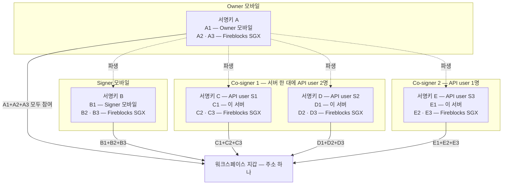
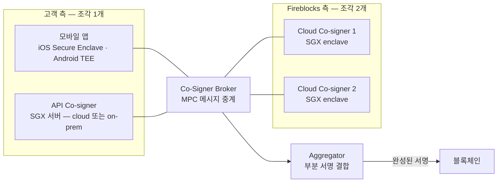

Fireblocks 가 지갑 개인키를 어떻게 만들고, 어디에 두고, 어떻게 서명하고, 잃었을 때 어떻게 되살리는지를 한 문서로 정리한다.
공식 문서와 담당자 확답에서 확인된 내용만 쓰고, 확인되지 않은 것은 끝의 "미확정" 절에만 둔다.

## 1. 한 장 요약

- **완전한 개인키는 어디에도 없다.** 키는 처음부터 3조각(key share)으로 나뉘어 만들어지고, 합쳐서 개인키를 만드는 단계가 없다. 서명도 조각을 모으지 않고 각자 부분 서명을 만들어 합친다.
- **조각 3개 중 1개는 고객, 2개는 Fireblocks.** 고객 조각은 모바일 앱의 secure enclave 또는 API Co-signer 의 SGX 서버에, Fireblocks 조각 2개는 Fireblocks 가 운영하는 SGX 서버에 있다. 서명에는 3개 전부 필요하다. Fireblocks 혼자도, 고객 혼자도 서명할 수 없다.
- **서명 장치마다 서명키가 따로 있고, 각 서명키가 3조각이다.** Owner 의 서명키가 먼저 만들어지고, 서명 권한 사용자가 추가될 때마다 **Owner 서명키에서 파생된 새롭고 고유한 3조각**이 그 장치에 발급된다. 공식 문구: "a new and unique set of three key shares is derived from the Owner's set of key shares." 같은 지갑에 추가되는 것이며, 담당자 확답(2026-08)으로는 같은 master seed 라 지갑 주소가 바뀌지 않는다.
- **vault·주소 생성은 키 생성이 아니다.** master seed 에서 BIP44 규칙으로 결정론적으로 파생한다. 이때 모바일·Co-signer 는 개입하지 않는다.
- **복구는 두 층이다.** 장치 하나를 잃으면 recovery passphrase 로 암호화된 cloud 백업으로 그 장치 조각을 되살린다. 전부 잃으면 Owner 가 만든 Workspace Keys Backup 으로 개인키 전체를 오프라인에서 재구성한다. 후자는 그 자체가 단일 침해 지점이라 평소에 쓰지 않는다.

비유로 보면 이렇다. 워크스페이스는 **금고 하나**(지갑 주소 하나)이고, 금고를 열 수 있는 **열쇠가 장치마다 한 개씩** 있다. 각 열쇠는 **3조각으로 쪼개져** 있어 1조각은 그 장치가, 2조각은 Fireblocks 가 갖고, 3조각이 함께 있어야 열쇠 하나가 된다. 어느 열쇠로 열어도 같은 금고가 열리고, 한 열쇠의 조각을 다른 열쇠와 나눠 쓰지 않는다.

읽는 법: 글자가 다르면 다른 서명키다. A1 과 B1 은 같은 조각의 변형이 아니라 서로 다른 서명키의 조각이다. 서명키 B·C·D·E 는 서명키 A 에서 파생돼 같은 지갑에 추가된다. Co-signer 1 처럼 서버 한 대에 API user 가 둘이면 서명키도 둘(C·D)이 그 서버에 저장되고, Co-signer 2 는 자기 서명키 E 만 갖는다. 추가 과정에는 Fireblocks co-signer 들과 Owner 모바일이 참여하고, 사용자마다 Owner 의 수동 승인 1회가 필요하다. "파생" 이 암호학적으로 무엇을 하는지는 공식 문서에 없다 — 미확정 절 참조.

## 2. 프로토콜 — MPC-CMP

Fireblocks 자체 프로토콜. Canetti·Makriyannis·Peled 의 *UC Non-Interactive, Proactive, Threshold ECDSA* (NIST 2020, ACM CCS 2020) 기반이다.

| 항목 | 내용 |
|---|---|
| 지원 서명 | ECDSA, EdDSA |
| 조각 결합 방식 | additive secret sharing. 비밀을 n 조각으로 나누고 그중 t 조각만 모으면 복원되는 방식을 Shamir secret sharing 이라 하는데, Fireblocks 는 t=n — 조각 3개를 전부 모아야 하는 형태다. 결합은 단순 덧셈. 조각이 하나라도 빠지면 나머지 조각으로는 비밀에 대해 어떤 정보도 얻을 수 없고, 이는 계산 능력을 아무리 들여도 깨지지 않는다는 뜻이다(정보 이론적 보안). 공식 문구: "Additive Secret Sharing (more commonly known as Shamir Secret Sharing with full threshold t=n)" |
| 개인키 존재 여부 | "the secret itself never exists — even during the key generation ceremony" |
| 라운드 | 서명은 조각 보유자들이 메시지를 주고받는 단계를 여러 번 거쳐 완성되는데, 그 한 단계가 라운드다. MPC-CMP 는 4 라운드이고 앞 3 라운드는 거래가 생기기 전에 미리 처리해 두므로 실제 거래 때는 마지막 1 라운드만 돈다. 이전 세대 프로토콜 GG18 의 8 라운드 대비 800% 빠르다고 명시 |
| 오프라인 서명 | 마지막 1 라운드의 메시지를 QR 로 주고받을 수 있어 네트워크에 연결되지 않은 기기로도 서명이 가능 (Cold Wallet) |
| 난수 | HRNG(Intel RDRAND), NIST SP 800-90A 준수. 하드웨어 격리 구성요소 안에서 생성 |
| 생성 실패 시 | "If the MPC key generation process fails, the key was not created." — 부분 생성 상태가 없다 |

원문: [MPC-CMP](https://support.fireblocks.io/hc/en-us/articles/6984668676124-MPC-CMP)

## 3. 조각의 위치 — SaaS MPC 기본형

**고객 조각 — 3가지 선택지 중 하나**

| 위치 | 인증 | 용도 |
|---|---|---|
| 모바일 앱 (iOS Keychain/Secure Enclave, Android TEE) | PIN + 생체인증 또는 Yubikey NFC | 사람이 승인·서명 |
| 고객 cloud 의 SGX 서버 (API Co-signer) | API user 페어링 + Callback Handler 선택 | 자동 서명 |
| 고객 on-prem 의 SGX 서버 (API Co-signer) | 같음 | 자동 서명. 우리 구성은 [Co-signer HA 구성](../설계/12-cosigner-ha.md) |

모바일 조각은 하드웨어 암호화 상태로만 있고 iCloud·Google 백업에 포함되지 않는다. 모바일 기기는 Fireblocks cloud 서버와 직접 통신하지 않고 cloud 의 mediator 를 거친다.

**Fireblocks 조각 2개**

- Intel SGX enclave 안에서 실행된다. 공식 문구: "Information cannot be retrieved by hackers, inside colluders, or even Fireblocks employees." 최소 3~5대, 분리된 네트워크.
- 이 2조각에는 **고객 키가 탈취됐을 때의 안전장치**가 걸려 있다 — 거래 금액 임계, 목적지 주소 무결성 검증. 공식 문구: "Safeguards in case keys owned by customers are compromised."
- 위치: 공식 문서는 Azure SGX 서버로 적고, 담당자 확답(2026-07)은 AWS·Azure·GCP 에 지리적으로 분산된 SGX 서버라고 답했다. 두 서술의 관계는 미확정 절 참조.

**Fireblocks cloud 의 역할 분리** — Azure 에 core 와 SGX enclave(조각·설정·정책·API 자격증명), AWS 에 gateway 와 frontend(비밀 없음), GCP Firebase 에 Console 과 모바일 캐시 DB.

원문: [MPC-CMP](https://support.fireblocks.io/hc/en-us/articles/6984668676124-MPC-CMP) · [Intel SGX secure environments](https://support.fireblocks.io/hc/en-us/articles/6984715167772-Intel-SGX-secure-environments) · [Fireblocks cloud architecture](https://support.fireblocks.io/hc/en-us/articles/6983991259036-Fireblocks-cloud-architecture) · [About the Fireblocks mobile app](https://support.fireblocks.io/hc/en-us/articles/8744575638044-About-the-Fireblocks-mobile-app) · [Security aspects — Signing with the mobile app](https://support.fireblocks.io/hc/en-us/articles/9205187986844-Security-aspects-Signing-with-the-Fireblocks-mobile-app)

## 4. 서명 흐름

1. 거래가 Policy 규칙에 매칭되고 승인 조건을 채운다.
2. Co-Signer Broker 가 MPC 메시지와 end certificate 를 참여 Co-signer 들에 뿌린다. 각 Co-signer 는 certificate chain(Co-signer 자체 키 → CSR → Core Services intermediate certificate → end certificate)으로 메시지를 검증한다.
3. 고객 조각 보유자가 자기 조각으로 부분 서명을 만든다. 모바일이면 PIN + 생체인증(또는 Yubikey), API Co-signer 면 Callback Handler 가 있을 때 그 판정을 따르고 없으면 자동 서명한다.
4. Fireblocks 조각 2개가 각자 부분 서명을 만든다. 이때 금액·목적지 안전장치가 적용된다.
5. Aggregator 가 부분 서명 3개를 완성된 서명 하나로 합쳐 블록체인에 보낸다.

서명키 하나 안에서는 3조각 전부 필요하고(3/3), 서명키가 여러 개일 때는 어느 한 서명키가 3/3 을 채우면 유효하다(1/N). 공식 문구: "None of the parties (neither Fireblocks nor the customer) can sign a transaction alone."

Cold Wallet 은 마지막 라운드만 QR 로 오프라인 기기와 주고받는다. 앞 3 라운드는 Signer 등록 때 미리 처리한다.

원문: [MPC-CMP](https://support.fireblocks.io/hc/en-us/articles/6984668676124-MPC-CMP) · [Security aspects — Signing with the mobile app](https://support.fireblocks.io/hc/en-us/articles/9205187986844-Security-aspects-Signing-with-the-Fireblocks-mobile-app)

## 5. 키가 만들어지는 시점

담당자 확답(2026-08). 키 생성(DKG)은 세 시점뿐이다.

| 시점 | 무엇이 생기나 | 선행 조건 |
|---|---|---|
| Owner 최초 온보딩 — 모바일 앱 QR 페어링, PIN·생체인증, recovery passphrase 확정 | 워크스페이스 master key (3조각). passphrase 기반 키 백업도 같은 세션에 등록 | - |
| 서명 권한 장치 합류 — Signer·Admin 모바일, API Co-signer | 그 장치 전용 서명키 (3조각) — Owner 서명키에서 파생. 담당자 확답: 같은 master seed 라 master key·지갑 주소 불변 | Owner 명시 승인 |
| 새 서명 알고리즘 키셋 추가 (예: EdDSA) | 해당 알고리즘용 별도 DKG 1회 | - |

vault account·vault wallet·입금 주소 생성은 키 생성이 아니다. master key 에서 `m/44/coinType/vaultAccountId/change/index` 로 결정론적 파생이고, 새 엔트로피·새 조각·MPC 세션이 없다. Co-signer 나 모바일 서명 기기가 개입하지 않는다.

## 6. 장치별 서명키와 사용자

- **서명키(key share set)는 서명 장치 단위.** 공식 문구: "Admins and Signers have their own unique key share set. No two signing devices share the same key share set."
- **Owner 서명키가 첫 번째.** Owner 가 Fireblocks co-signer 들과 함께 지갑을 먼저 설정하고, 그 뒤 시스템이 Fireblocks co-signer 들과 Owner 모바일을 움직여 다른 서명 사용자를 그 지갑에 추가한다. 사용자마다 Owner 의 수동 승인 1회. 각 사용자에게 Owner 서명키에서 파생된 새롭고 고유한 3조각이 발급된다. 파생의 암호학적 세부는 공식 문서에 없다.
- **조각 발급 권한은 Owner 단독.** 서명 가능 사용자가 추가되면 Owner 가 그 장치의 조각 발급을 승인해야 하고, 승인 전에는 `Pending Owner MPC Key Approval` 상태로 서명이 실패한다.
- **조각이 없는 role.** Non-Signing Admin, Security Admin 은 조각을 갖지 않는다. Approver·Editor·Viewer·Security Auditor 는 서명 권한 자체가 없다.
- **API Co-signer.** API user 하나가 서명키 하나다. Co-signer 한 대에 API user 여러 명을 페어링하면 서명키 여러 개가 그 장비에 저장된다. Co-signer 를 여러 대 두면 장비마다 자기 API user 의 서명키를 갖는다 — 한 서명키의 조각을 나눠 갖는 것이 아니다. 2대 구성은 [Co-signer HA 구성](../설계/12-cosigner-ha.md).
- **모바일 기기에는 키가 두 종류.** 거래 서명용 MPC 조각과, 워크스페이스 설정·정책 변경·사용자 추가 승인용 configuration key 가 분리돼 있다. 둘 다 Secure Enclave·TEE 에 평문 추출 불가 상태로 있다.

원문: [MPC-CMP](https://support.fireblocks.io/hc/en-us/articles/6984668676124-MPC-CMP) · [Add users](https://support.fireblocks.io/hc/en-us/articles/360021546999-Add-users) · [Security aspects — Signing with the mobile app](https://support.fireblocks.io/hc/en-us/articles/9205187986844-Security-aspects-Signing-with-the-Fireblocks-mobile-app)

## 7. 조각의 생애 — 사건별 승인과 결과

| 사건 | 승인 | 조각에 일어나는 일 |
|---|---|---|
| 서명 가능 사용자 추가 | 사용자 추가는 Owner + Admin Quorum, 조각 발급은 Owner 단독 (별도 승인 2건) | 새 서명키 발급 |
| 사용자 삭제 | - | Fireblocks 가 그 사용자의 cloud 측 조각을 삭제 |
| 모바일 기기 재등록 (re-enroll) | Owner 가 2일 내 새 조각 재승인 → 사용자가 2일 내 MPC 등록 완료 | 새 조각. Owner 본인 기기 재등록은 Console 불가, Support 경유 |
| 기기 이전 (device migration) | **관리자 승인 없음** — 사용자 본인이 PIN + passphrase + 생체인증으로 export/import | 조각이 새 기기로 이동, 이전 기기의 사용자·서명키 자동 삭제 |
| 모바일 key material 갱신 | PIN + 생체인증 + recovery passphrase 3중 | - |
| API user re-enroll | Owner 가 Co-signer 조각 승인 | pairing token 1시간 유효 |
| Owner 이전 | 신임 Owner 의 조각 사전 생성 필요. 기존 Workspace Keys Backup 유지·파기를 조직이 이전 전에 결정 | 파기 시 신임 Owner 가 자기 passphrase 로 새 백업 생성 |

Audit Log 에는 MPC key set 의 Created / Enabled / Activated 이벤트가 남는다.

원문: [Add users](https://support.fireblocks.io/hc/en-us/articles/360021546999-Add-users) · [Delete users](https://support.fireblocks.io/hc/en-us/articles/4404971260050-Delete-users) · [Re-enroll a user's mobile device](https://support.fireblocks.io/hc/en-us/articles/4407786072082-Re-enroll-a-user-s-mobile-device) · [Device migration](https://support.fireblocks.io/hc/en-us/articles/11288189152924-Device-migration) · [Re-enrolling API users](https://support.fireblocks.io/hc/en-us/articles/4412016177554-Re-enrolling-API-users)

## 8. 백업과 복구

### 8.1 장치 조각의 cloud 백업 — recovery passphrase

- 사용자 설정 때 모바일 조각을 recovery passphrase 로 암호화한 백업이 Fireblocks cloud 에 만들어진다. Owner·Admin·Signer 필수. 공식 문구: "Fireblocks uses the recovery passphrase to create an encrypted backup of the mobile device's private key share, which is stored securely in Fireblocks' cloud servers."
- 사용자 삭제 시 이 백업이 폐기된다 (7절의 "cloud 측 조각 삭제"가 이것이다).
- 월 1회 검증 알림. `Settings > Verify recovery passphrase` 가 백업을 내려받아 복호화를 시도한다. 3회 실패 시 5분 잠금.
- 복구 시나리오 3가지: ① Owner 기기 분실 — 본인 passphrase 또는 password-less, ② Admin·Signer 기기 분실 — **다른 authorized signer 의** 기기와 passphrase, ③ Workspace Keys Recovery — Owner 가 개인키 전체 재구성 (8.2).

원문: [Recovery Passphrase](https://support.fireblocks.io/hc/en-us/articles/6429764039452-Recovery-Passphrase)

### 8.2 개인키 전체 백업 — Workspace Keys Backup

Owner 가 Recovery Utility 앱으로 만드는 백업 패키지. 담당자 확답(2026-07)은 온보딩 시 제공되는 Disaster Recovery Kit 을 별도로 언급했는데, 이 패키지와 같은 것인지는 확인되지 않았다.

| 항목 | 내용 |
|---|---|
| 도구 | Fireblocks Recovery Utility (Console `Settings > Key backup > In-house backup` 에서 다운로드). **네트워크에서 완전히 분리된 기기**에서 실행 |
| 패키지 구성 | **6 파일** — ECDSA 3조각 + EdDSA 3조각. cloud 조각 4개는 고객이 올린 RSA 공개키로, 모바일 조각 2개는 Owner passphrase 로 암호화 |
| 암호 규격 | RSA-4096, 개인키 파일은 AES-128 로 보호 |
| 승인 | Owner + Admin Quorum. **48시간** 안에 끝내지 않으면 처음부터 다시 |
| 다운로드 | **1회만** 가능 |

원문: [Generating a Workspace Key Backup Package](https://support.fireblocks.io/hc/en-us/articles/9716732961820-Generating-a-Workspace-Key-Backup-Package-Fireblocks-Recovery-Utility)

### 8.3 개인키 재구성 — 언제·어떻게

- **오프라인 기기에서만.** 공식 문구: "Performing this procedure on an online machine will result in your private key being considered exposed and compromised."
- 필요한 비밀 4개: 백업 ZIP, RSA 개인키 파일, 모바일 recovery passphrase, RSA 개인키 passphrase. 워크스페이스 설정 때 자동 생성 passphrase 를 썼다면 그 passphrase 를 암호화한 RSA 개인키가 하나 더 필요해 5개. **하나라도 잃으면 재구성 불가.**
- 결과는 확장 개인키 xprv(ECDSA)·fprv(EdDSA). 공식 문구: "Should not be used regularly since reconstruction of the extended private keys introduces a single point of compromise." 백업과 재구성 산출물은 접근이 통제된 오프라인 기기에만 둔다.
- 담당자 확답(2026-07): 복구는 두 층 — **Soft Key Recovery** 는 장치·조각 단위로 접근 가능한 조각 1개 이상이 남아 있을 때, **Hard Key Recovery** 는 모든 기기 접근 불가 또는 Fireblocks 영구 중단 같은 파국 상황의 전체 복원으로 자체 수행 또는 Station70·Coin Cover 등 파트너 위탁. Fireblocks 측 지표는 RTO 6시간, RPO 0, 가용성 99.9%, 일 단위 백업, 연 1회 이상 복구 테스트, ISO 22301·SOC2 Type 2.

원문: [Recovering private key material](https://support.fireblocks.io/hc/en-us/articles/9716757315996-Recovering-private-key-material) · [Fireblocks cloud architecture](https://support.fireblocks.io/hc/en-us/articles/6983991259036-Fireblocks-cloud-architecture)

## 9. 배포 변형 — 조각이 누구 손에 있나

| | SaaS MPC (기본) | Hosted MPC | Key Link |
|---|---|---|---|
| Fireblocks 조각 | 2 | **0** | 0 — MPC 자체가 없다 |
| 고객 조각 | 1 (모바일 또는 SGX Co-signer) | **3** — Primary 1 + Guard 2, 전부 고객 SGX | 없음. 고객 HSM 이 단독 서명 |
| Fireblocks 의 서명 개입 | 조각 2개로 부분 서명 + 안전장치 | 없음. 서명 전 과정이 고객 환경 | 검증만 — HSM 서명을 validation key 로 확인 |
| 백업 | 6 파일 (cloud 4 + 모바일 2) | 3 파일 (모바일 1 + Guard 2, Guard 는 RSA 공개키 암호화). air-gapped 기기 2대 | 고객 HSM 백업 정책 |
| SaaS 장애 대비 | - | Business Continuity Module — on-prem Aggregator 포함 Docker 스택, active-active 또는 active-passive | - |

Hosted MPC 공식 문구: "completely control the MPC key shares by hosting all three Co-Signers in your own environment." Key Link 상세는 [Fireblocks Key Link — 고객 HSM 연동 검토](08-fireblocks-key-link.md).

원문: [Hosted MPC Overview](https://support.fireblocks.io/hc/en-us/articles/12901739472924-Hosted-MPC-Overview) · [Hosted MPC Backup and Recovery](https://support.fireblocks.io/hc/en-us/articles/12902205245340-Hosted-MPC-Backup-and-Recovery) · [Business Continuity Module](https://support.fireblocks.io/hc/en-us/articles/20919673259292-Business-Continuity-Module-BCM)

## 10. 우리가 정해야 할 것

위 사실에서 바로 따라오는 운영 결정 항목이다. 값은 아직 정하지 않았다.

- Owner 모바일 기기와 recovery passphrase 의 보관·승계 절차. Owner 기기 재등록은 Support 경유라는 점을 감안한다.
- Workspace Keys Backup 을 만들 것인지, 만들면 4~5개 비밀을 누가 어디에 나눠 보관하는지. 48시간·1회 다운로드 제약을 절차에 반영한다.
- 재구성 리허설 주기. 공식 권장은 "occasionally verifying" 이고 주기 값은 조직 결정이다.
- API Co-signer 조각(`secrets.db`)의 장비 밖 반출 — [Co-signer HA 구성](../설계/12-cosigner-ha.md) 5절.
- 기기 이전(device migration)이 관리자 승인 없이 되는 점을 내부 통제로 어떻게 보완할지.

## 미확정

- Owner 서명키에서 다른 서명키를 "파생" 하는 암호학적 절차·라운드·실패 처리 — 공식 문서 없음. 파생된 서명키의 조각들이 같은 개인키를 다른 방식으로 나눈 것인지(합치면 같은 값인지)도 공식 문서에 명시가 없다. 공식적으로 확인되는 것은 "Owner 세트에서 파생된 새롭고 고유한 세트" 와 "같은 지갑에 추가된다" 까지다.
- Fireblocks 조각 2개의 위치 — 공식 문서(Azure SGX)와 담당자 확답(AWS·Azure·GCP 지리 분산)의 관계. 어느 쪽이 현재 상태인지 재확인 필요.
- cloud 백업(recovery passphrase 암호화)의 암호 규격.
- 모바일 재등록 2일 창이 만료됐을 때의 동작.
- API user 를 unpair·삭제할 때 그 서명키의 cloud 조각이 삭제되는지 — Console 사용자 삭제 경로만 확인됨.
- 담당자가 말한 Disaster Recovery Kit 이 Workspace Keys Backup 패키지와 같은 것인지.

## 출처

| ID | 출처 | 반영 범위 |
|---|---|---|
| FB-KM-001 | [MPC-CMP](https://support.fireblocks.io/hc/en-us/articles/6984668676124-MPC-CMP) | 프로토콜·조각 결합·3/3·장치별 서명키·Broker·Aggregator·안전장치 |
| FB-KM-002 | [Intel SGX secure environments](https://support.fireblocks.io/hc/en-us/articles/6984715167772-Intel-SGX-secure-environments) | Fireblocks 조각의 SGX 격리 |
| FB-KM-003 | [Fireblocks cloud architecture](https://support.fireblocks.io/hc/en-us/articles/6983991259036-Fireblocks-cloud-architecture) | Azure·AWS·GCP 역할 분리, DR 단일 침해 지점 경고 |
| FB-KM-004 | [About the Fireblocks mobile app](https://support.fireblocks.io/hc/en-us/articles/8744575638044-About-the-Fireblocks-mobile-app) · [Security aspects — Signing with the mobile app](https://support.fireblocks.io/hc/en-us/articles/9205187986844-Security-aspects-Signing-with-the-Fireblocks-mobile-app) | 모바일 조각 보관·인증·configuration key·mediator |
| FB-KM-005 | [Recovery Passphrase](https://support.fireblocks.io/hc/en-us/articles/6429764039452-Recovery-Passphrase) | cloud 백업·월 1회 검증·복구 시나리오 3종 |
| FB-KM-006 | [Generating a Workspace Key Backup Package](https://support.fireblocks.io/hc/en-us/articles/9716732961820-Generating-a-Workspace-Key-Backup-Package-Fireblocks-Recovery-Utility) · [Recovering private key material](https://support.fireblocks.io/hc/en-us/articles/9716757315996-Recovering-private-key-material) | 6 파일·RSA-4096·48시간·1회 다운로드·4~5 비밀·오프라인 전용 |
| FB-KM-007 | [Add users](https://support.fireblocks.io/hc/en-us/articles/360021546999-Add-users) · [Delete users](https://support.fireblocks.io/hc/en-us/articles/4404971260050-Delete-users) · [Re-enroll a user's mobile device](https://support.fireblocks.io/hc/en-us/articles/4407786072082-Re-enroll-a-user-s-mobile-device) · [Device migration](https://support.fireblocks.io/hc/en-us/articles/11288189152924-Device-migration) · [Re-enrolling API users](https://support.fireblocks.io/hc/en-us/articles/4412016177554-Re-enrolling-API-users) | 조각 생애 사건별 승인 |
| FB-KM-008 | [Hosted MPC Overview](https://support.fireblocks.io/hc/en-us/articles/12901739472924-Hosted-MPC-Overview) · [Hosted MPC Backup and Recovery](https://support.fireblocks.io/hc/en-us/articles/12902205245340-Hosted-MPC-Backup-and-Recovery) · [Business Continuity Module](https://support.fireblocks.io/hc/en-us/articles/20919673259292-Business-Continuity-Module-BCM) | 배포 변형 비교 |
| FB-SUP-009 | Fireblocks 담당자 기술 질의응답, 2026-07 (PoC) | 조각 지리 분산·Soft/Hard 복구·RTO/RPO·DR Kit |
| FB-SUP-010 | Fireblocks 담당자 기술 질의응답, 2026-08 | 키 생성 3시점·BIP44 파생·master seed 불변 |

담당자 확답 원문은 [Fireblocks QnA](../Fireblocks%20QnA/01-qna.md)의 "키 생성(DKG) 시점" 절에 있다.
