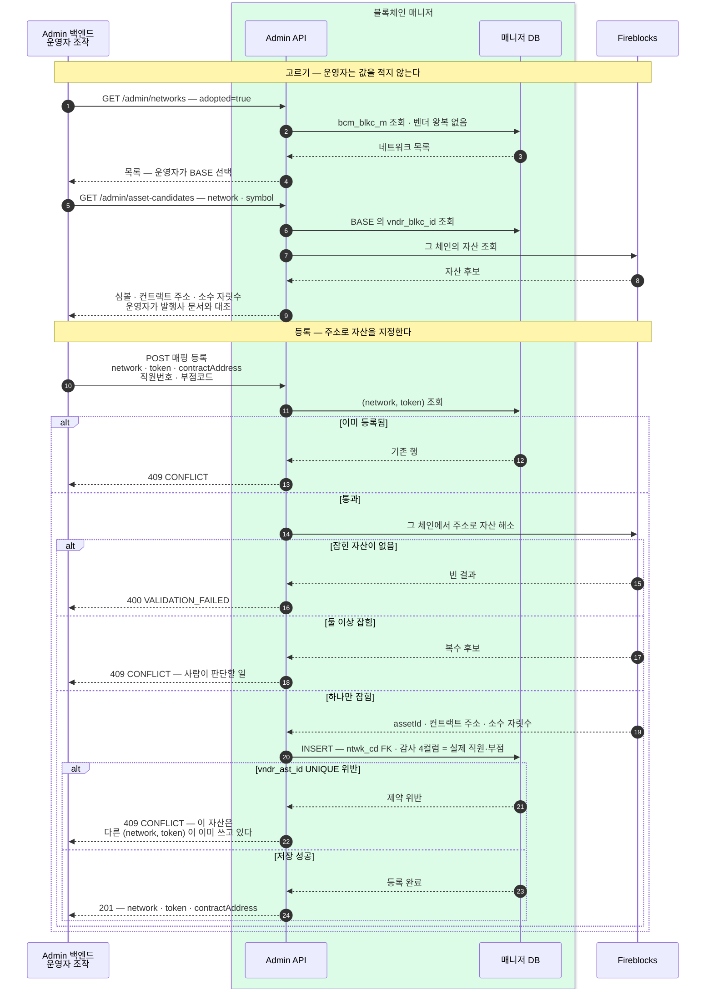

우리 (네트워크, 토큰)이 Fireblocks 에서 무엇으로 불리는지만 담는 표와, 그 표를 채우는 절차를 정한다.
어떤 자산을 지원할지는 여기서 정하지 않는다 — 그건 상품 결정이다.

## 매니저가 갖는 것과 갖지 않는 것

우리 계약은 자산을 **네트워크 + 토큰** 두 값으로 다룬다([흐름](02-bcm-flow.md)). 벤더는 `USDC_POLYGON` · `BASECHAIN_ETH` 처럼 **자체 체계의 assetId 하나**로 다루고, 그 체계는 우리가 정할 수 없다. 둘을 잇는 표가 필요하다.

| | 어디 소관인가 |
|---|---|
| **이 자산이 벤더에서 무엇인가** (`vndr_ast_id`) | **매니저** — 오히려 다른 데 두면 안 된다. 벤더 식별자를 다른 시스템이 알기 시작하면 "호출 쪽은 벤더를 모른다"는 전제가 무너진다 |
| 어떤 자산을 지원하는가 | 상품 결정 — 매니저가 정할 위치가 아니다 |
| 소수 자릿수 | 자산 자체의 속성 — 매니저는 금액을 문자열 decimal 로 넘기고 base unit 환산을 하지 않아 쓸 일이 없다 |
| 컨트랙트 주소 | 자산의 속성이지만 **등록 때 대조한 근거의 사본**으로 보관한다 — 업무에 쓰는 값이 아니라 "이 매핑을 무엇으로 확인했는가" 를 되짚기 위한 것이다 |

그래서 매핑 표는 **매핑만** 담는다. 이름을 "자산 마스터"로 부르지 않는 이유도 같다 — 자산의 정의를 우리가 갖는 것처럼 읽히면 곤란하다.

**자산은 벤더를 따라 동기화하지 않는다.** 벤더가 지원하는 자산은 수천 개지만 우리가 쓰는 것은 몇 개뿐이다. 지원하기로 한 자산만 등록하고, 늘어나면 그때 한 줄 더한다. (블록체인 목록은 고르기 편하자고 하루 한 번 받아 두는데, 그건 지원 결정이 아니라 참조 데이터다 — 아래 "표 둘".)

**범위 (시작 시점)** — 스테이블코인만, 네트워크는 `ETHEREUM` · `BASE` 둘. 벤더에는 스테이블코인이라는 분류가 없어(자산 분류는 NATIVE · FT · FIAT · NFT · SFT · VIRTUAL) 어차피 우리가 고르는 결정이다.

## 네트워크 코드와 토큰 심볼 — 무엇을 기준으로 하나

**이름은 우리가 정하고, 동일성 판단은 표준 값으로 한다.**

읽기 쉬운 이름(`BASE` · `USDC`)을 코드로 쓰되, 그 값이 정말 무엇인지는 이름이 아니라 **chainId 와 컨트랙트 주소**로 가린다. 둘 다 등록할 때 벤더 응답에서 얻어지므로 추가 비용이 없다.

| 우리 값 | 함께 보관하는 표준 값 | 어디서 얻나 |
|---|---|---|
| `ntwk_cd` = `BASE` | **chainId** (EIP-155) | 카탈로그 동기화가 벤더 `GET /v1/blockchains` 의 `onchain.chainId` 로 채운다 |
| `tkn_smbl` = `USDC` | **컨트랙트 주소** | 등록 요청의 주소를 벤더 `GET /v1/assets` 응답에서 해소해 저장 |

**티커 심볼은 표준이 아니다.** `USDC` 라는 심볼은 유일하지 않고 누구나 자기 토큰에 붙일 수 있다. 체인마다 다른 컨트랙트가 같은 심볼을 쓴다. 심볼을 식별자로 삼으면 "USDC 라고 적혀 있으니 USDC 겠지"에 기대는 것이라, 잘못된 컨트랙트를 진짜로 다룰 수 있다. 그래서 심볼은 **표시용**으로 내리고 동일성은 위 두 값으로 판단한다.

관련 표준은 목적이 갈린다.

- **EIP-155 chainId** — EVM 의 사실상 표준(숫자). 우리가 실제로 쓰는 값이다.
- **CAIP-2 / CAIP-19** — 지갑·인프라 생태계의 체인·자산 식별 표준. `eip155:` + chainId 로 언제든 조립할 수 있어, 별도로 저장하지 않아도 필요할 때 만들 수 있다.
- **ISO 24165 (DTI)** — 금융권 ISO 표준(토큰 식별자 DTI + 원장 식별자 DLI). 규제·보고에서 요구받을 수 있다. 지금 도입하지는 않되, chainId 와 컨트랙트 주소를 갖고 있으면 나중에 매핑할 수 있다 — **표준으로 올라탈 여지를 막지 않는 것**이 지금 할 일이다.

**네트워크 코드는 벤더 값을 쓰지 않는다.** 벤더 체계는 일관성이 없고(`BASECHAIN_ETH` 같은 형태) 벤더를 바꾸면 우리 어휘가 흔들린다. 우리 이름을 쓰고 벤더 식별자는 `vndr_blkc_id` 로 따로 들고 대조한다.

**테스트넷은 별도 코드로 둔다** — `BASE` 와 `BASE_SEPOLIA` 는 다른 네트워크다. `ntwk_cd` 하나에 시험망 여부 플래그를 다는 방식은 실수로 섞일 여지를 남긴다.

## 표 둘 — 카탈로그와 매핑

**벤더 블록체인 카탈로그는 동기화하고, 자산 매핑은 손으로 등록한다.** 벤더가 지원하는 체인이 135개라 등록할 때마다 벤더 목록을 훑는 것은 현실적이지 않아 하루 한 번 받아 둔다. 반면 자산은 항상 `(네트워크, 심볼)`로 걸러 조회하므로 결과가 몇 개뿐이라 동기화할 이유가 없다 — 수천 개를 끌어와 몇 줄을 고르는 일이 된다.

```sql
-- 벤더 블록체인 카탈로그 — 일 1회 동기화. 고르기 위한 참조 데이터다
CREATE TABLE bcm_blkc_m (
  vndr_blkc_id  VARCHAR(64)  PRIMARY KEY,  -- 벤더 blockchainId
  ntwk_cd       VARCHAR(20)  NULL,         -- 우리 네트워크 코드 — 채택한 체인만 채운다
  chain_id      BIGINT       NULL,         -- EIP-155 chainId (EVM 만)
  dspl_nm       VARCHAR(64)  NOT NULL,     -- 벤더 표시명
  test_yn       VARCHAR(1)   NOT NULL,     -- 시험망 여부 (벤더 onchain.test)
  deprc_yn      VARCHAR(1)   NOT NULL,     -- 벤더가 폐기 표시 (metadata.deprecated)
  sync_dttm     VARCHAR(16)  NOT NULL,     -- 마지막 동기화 일시
  -- 감사 4컬럼
  UNIQUE (ntwk_cd)
);

-- 자산 매핑 — 손으로 등록한다
CREATE TABLE bcm_vndr_ast_m (
  ntwk_cd       VARCHAR(20)  NOT NULL,   -- 우리 네트워크 코드
  tkn_smbl      VARCHAR(16)  NOT NULL,   -- 토큰 심볼 (표시용)
  vndr_ast_id   VARCHAR(64)  NOT NULL,   -- 벤더 assetId — 벤더 호출에만 쓴다
  cntr_addr     VARCHAR(128) NULL,       -- 등록 때 대조한 컨트랙트 주소 (네이티브는 NULL)
  reg_dttm      VARCHAR(16)  NOT NULL,
  -- 감사 4컬럼
  PRIMARY KEY (ntwk_cd, tkn_smbl),
  UNIQUE (vndr_ast_id),
  FOREIGN KEY (ntwk_cd) REFERENCES bcm_blkc_m (ntwk_cd)
);
```

| 제약 | 무엇을 막나 |
|---|---|
| `PRIMARY KEY (ntwk_cd, tkn_smbl)` | 같은 자산이 두 줄로 갈라지는 것 |
| **`UNIQUE (vndr_ast_id)`** | **엉뚱한 체인에 주소를 발급하는 사고.** "BASE 의 USDC" 를 등록하며 이더리움 USDC 의 id 를 넣으면 여기서 걸린다 — 한 벤더 자산은 한 (네트워크, 토큰)에만 대응한다 |
| **`FOREIGN KEY (ntwk_cd)`** | 채택하지 않은 네트워크로 매핑이 생기는 것. 카탈로그에 이름을 붙인 체인만 쓸 수 있다 — 네트워크와 벤더 체인의 대응이 한 곳에만 있어 어긋날 수가 없다 |
| `UNIQUE (ntwk_cd)` (카탈로그) | 우리 이름 하나가 두 벤더 체인을 가리키는 것 |
| `vndr_ast_id` 는 **set-once** | 이미 주소가 발급된 뒤 이 값을 바꾸면 기존 주소와 새 주소가 서로 다른 체인이 된다. 수정 오퍼레이션을 두지 않는 이유다 |

**네트워크 채택은 카탈로그 행에 `ntwk_cd` 를 붙이는 것**이다. "이 체인을 쓰기로 한다"는 결정이 그 한 줄로 기록된다. `chain_id` 와 `dspl_nm` 은 동기화가 채우므로 사람이 적을 값이 아니다.

행 하나가 곧 "이 자산은 벤더로 보낼 수 있다"는 뜻이다. 별도의 사용 여부 플래그는 두지 않는다 — 상품에서 자산을 내리는 것은 호출 쪽이 요청을 보내지 않는 것으로 끝나고, 장애 때 급히 막는 것은 성격이 달라 아래 "뒤로 미룬 것"에서 따로 다룬다.

## 동기화 — 하루 한 번, 카탈로그만

`GET /v1/blockchains` 를 페이징해 `bcm_blkc_m` 을 갱신한다.

- **새 체인은 행을 추가**한다. `ntwk_cd` 는 비운다 — 채택은 사람이 하는 별도 행위다.
- **기존 체인은 `dspl_nm`·`test_yn`·`deprc_yn`·`sync_dttm` 을 갱신**한다.
- **벤더 목록에서 사라진 체인은 지우지 않는다.** 채택해 쓰고 있던 체인이면 매핑이 FK 로 걸려 있고, 지우면 그 이력이 사라진다. 벤더가 폐기 표시한 것은 `deprc_yn` 으로만 남긴다.
- **`chain_id` 가 바뀌면 갱신하지 않고 경보**한다 — 같은 체인의 chainId 는 바뀌지 않는다. 바뀌었다면 벤더 데이터 문제이거나 우리가 다른 체인을 보고 있다는 뜻이다.

**카탈로그가 하루 낡아도 안전하다.** 등록 시점에 벤더로 자산을 다시 확인하는 관문이 있어서, 카탈로그는 고르기 편하자는 참조 데이터이지 진실의 근거가 아니다. 새로 생긴 체인이 하루 늦게 보이는 것뿐이다.

## 변환은 벤더 경계에서 한 번

우리 어휘는 끝까지 (네트워크, 토큰)으로 가고, **벤더를 부르는 지점에서만** assetId 로 바꾼다. DB·이벤트·API 어디에도 벤더 assetId 가 새어 들어가지 않는다.

호출 지점은 넷 — 주소 발급 · 잔액 조회 · 출금 제출 · sweep.

매핑에 없으면 **`ASSET_NOT_SUPPORTED`** 로 거절한다. 요청 형식 오류(`VALIDATION_FAILED`)와 구분해야 호출 쪽이 "우리가 잘못 보냈다"와 "아직 지원 안 한다"를 가릴 수 있다. 여러 네트워크 발급에서는 이것이 네트워크별 실패로 떨어져 나머지 네트워크는 정상 발급된다.

캐시는 두지 않는다 — 몇 줄짜리 표에 PK 조회 한 번이라 비용이 없고, 캐시를 두면 값이 바뀌었을 때 무효화 문제가 새로 생긴다.

## 등록 — 값을 어디서 얻고 어떻게 거르나

등록은 어쩌다 한 번이지만 여기서 틀리면 자금이 엉뚱한 체인으로 간다.

**Admin 백엔드는 벤더를 몰라야 한다** (2026-08-06 확정). 벤더 assetId·blockchainId 를 Admin 이 들고 다니면 벤더를 바꿀 때 Admin 화면과 그동안 쌓인 값까지 함께 바뀐다. 그래서 자산을 가리키는 값으로 **컨트랙트 주소**를 쓴다 — 벤더 밖에서도 통하고, 발행사 공식 문서에 그대로 적혀 있는 값이다.

그러면 관문이 하나 줄면서 오히려 세진다. 운영자가 보낸 주소를 벤더 응답과 **대조**하던 것이, 주소로 자산을 **찾는 것 자체**가 된다 — 주소가 틀리면 대조에 실패하는 게 아니라 애초에 아무것도 잡히지 않는다.

네트워크도 같다. 채택 전 체인은 벤더 밖에서 통하는 이름이 없으므로 목록에서 받은 값을 그대로 되돌려 보내는 **손잡이**를 쓴다. Admin 은 그 값을 해석하지도 보관하지도 않고, 한 번의 채택 흐름 안에서만 오간다.

**chainId 로 채택하는 방식은 접었다** (2026-08-06). EVM 이라면 chainId 가 벤더 밖에서 통하는 이름이라 목록 왕복 없이 `PUT /admin/networks/BASE {chainId: 8453}` 로 끝난다. 하지만 **비 EVM 에는 chainId 가 없다** — 비트코인·솔라나·트론을 다룰 수 없으므로 채택 수단으로 쓰지 않는다. 손잡이는 체인 종류를 가리지 않는다.



색: **초록 상자 = 매니저 안쪽**. 되돌아오는 점선이 실패 응답이다. 벤더 id 는 초록 상자 밖으로 나가지 않는다.

**앞의 왕복이 값의 출처다.** 운영자가 벤더 콘솔에서 문자열을 찾아 옮겨 적는 구간을 없애는 것이 목적이다. 네트워크 고르기는 **우리 카탈로그를 읽을 뿐이라 벤더 왕복이 없고**, 자산 고르기만 벤더를 부른다.

**등록 요청이 가볍다** — 네트워크와 벤더 체인의 대응은 카탈로그에만 있고 매니저가 `ntwk_cd` 로 찾는다. 클라이언트가 보낸 값과 대조하는 방식은 보낸 쪽이 틀리면 같이 틀리므로, 우리 표를 기준으로 삼는다.

**관문 넷이 각각 다른 실수를 잡는다.**

- **채택한 네트워크만** — 이름을 붙이지 않은 네트워크로는 등록할 수 없다. FK 가 막는다.
- **주소로 자산이 하나만 잡혀야 한다** — 없으면 400(주소가 틀렸거나 벤더가 아직 지원하지 않는다), 둘 이상이면 409. 이 관문만 벤더 밖의 근거를 쓴다 — 나머지는 우리 표와 벤더가 준 값끼리의 대조라, **엉뚱한 자산을 지목했을 때** 잡아내는 건 이 하나뿐이다. 네이티브 자산은 주소가 없으므로 `contractAddress` 를 비우고, 그 체인의 네이티브 자산으로 해석한다.
- **중복 등록 차단** — 이미 등록된 (network, token) 은 덮어쓰지 않는다. PK 가 막는다.
- **한 자산은 한 매핑** — 해소된 assetId 를 이미 쓰는 행이 있으면 DB 가 막는다.

사람의 판단에 기대는 지점은 둘로 좁혀진다 — **네트워크를 채택할 때 올바른 체인에 이름을 붙이는 것**(그 뒤로는 FK 가 막는다), 그리고 **토큰마다 발행사 문서에서 컨트랙트 주소를 제대로 확인하는 것**이다. 나머지는 기계가 막는다.

## Admin API — 같은 서비스의 `/admin/*` (2026-08-06 확정)

매핑을 읽는 코드와 같은 서비스에 두고 경로를 `/admin/*` 로 나눈다. 표가 매니저 DB 에 있으므로 별도 서비스로 빼면 DB 를 둘이 나눠 쓰게 되거나 결국 매니저를 다시 호출해야 한다.

★ **벤더 어휘가 이 API 를 넘어가지 않는다** — 요청·응답 어디에도 벤더 assetId·blockchainId 가 없다. 벤더를 바꿔도 Admin 백엔드는 그대로다. 계약은 [API 스펙](../../bcm-api-docs/openapi.yaml)의 `Admin` 태그가 정의한다.

| 오퍼레이션 | 하는 일 |
|---|---|
| `GET /admin/networks` | 쓸 수 있는 체인 목록. `adopted` 로 채택 전/후를 가른다 |
| `PUT /admin/networks/{code}` | **네트워크 채택** — 목록에서 고른 후보에 우리 이름을 붙인다 |
| `DELETE /admin/networks/{code}` | 채택 해제 — 매핑이 남아 있으면 409 |
| `GET /admin/asset-candidates` | 그 네트워크의 자산 후보 — 심볼 · 컨트랙트 주소 · 소수 자릿수 |
| `GET /admin/asset-mappings` | 등록된 매핑 목록 — 운영 확인용 |
| `POST /admin/asset-mappings` | 등록 — `network` · `token` · `contractAddress` |
| `DELETE /admin/asset-mappings/{network}/{token}` | 잘못 등록한 것 되돌리기 — **그 (네트워크, 토큰)으로 발급된 주소가 하나도 없을 때만** 허용, 있으면 409 |

수정 오퍼레이션은 두지 않는다. `vndr_ast_id` 가 set-once 이므로 고치는 유일한 경로는 "지우고 다시 넣기"이고, 주소가 이미 발급됐다면 그것도 막힌다 — 그 상황은 매핑 수정이 아니라 사고 처리다.

**감사 흔적** — 자동 처리 행은 시스템 센티넬(`SYSTEM`/`9999`)을 쓰지만 **Admin 수동 개입은 실제 직원번호·부점코드**를 남긴다는 규약([DB 명명 규약](03-bcm-db.md))을 그대로 따른다. 상태를 바꾸는 오퍼레이션은 `X-Employee-No` · `X-Branch-Code` 헤더로 받아 감사 4컬럼에 쓴다. 본문이 아니라 헤더인 것은 `DELETE` 에도 똑같이 필요하기 때문이다.

**경로를 나눈 것은 경계가 아니다** — 매니저 API 는 인증 없이 내부망을 신뢰하는 구성이라, `/admin/*` 로 이름만 갈라 두면 같은 망의 누구나 매핑을 등록할 수 있다. **이 경로의 호출 주체를 Admin 백엔드로 한정하는 망 수준 제한이 함께 필요하다.** 그 방식(방화벽 규칙·별도 리스너 등)은 배포 환경에서 정한다.

## 뒤로 미룬 것 — 네트워크 장애 대응

체인 장애 때 출금 제출을 네트워크 단위로 멈추는 스위치가 필요하다. **뒤로 미루되 자리는 생겼다** — 카탈로그(`bcm_blkc_m`)가 네트워크 단위 표이므로 나중에 여기에 붙이면 된다. 미루면서 정리해 둔 것:

- **단위가 다르다** — 장애는 네트워크 단위로 오는데 매핑은 (네트워크, 토큰) 단위다. 자산마다 내리면 하나 빠뜨렸을 때 그 자산만 새어 나간다. 그래서 매핑 표가 아니라 카탈로그 쪽에 붙일 것이다.
- **저절로 막히는 장애와 아닌 장애가 갈린다** — 벤더가 죽으면 호출이 실패하니 스위치가 필요 없다. 문제는 **벤더는 멀쩡한데 체인이 지연되는 경우**로, 호출은 성공하고 tx 만 쌓인다. 스위치가 필요한 건 이쪽이다.
- **오퍼레이션마다 대응이 다르다** — 입금 감지는 **절대 막지 않는다**(돈은 계속 들어오고 못 잡는 것이 사고다). 출금 제출은 막아야 하고(stuck tx 가 쌓인다), sweep 은 미루면 되고, 주소 발급·잔액 조회는 굳이 막을 이유가 없다.
- **주된 통제는 호출 쪽이다** — 이상적으로는 접수 자체를 막아 고객에게 바로 안내되게 한다. 매니저 스위치는 그게 안 됐을 때의 최후 차단이다.
- **차단은 수동, 감지는 자동** — 자동 차단은 오탐 때 멀쩡한 출금을 멈춘다. 신호는 이미 있다 — 막힘 점검이 "확정 지연이 체인별 임계 초과"를 경보한다([흐름](02-bcm-flow.md)).
- **이미 나간 건은 스위치와 무관하다** — 진행 중 tx 는 막힘 점검·boost·경보가 맡고, 스위치는 신규 제출만 막는다.

## 아직 못 정한 것

- **컨트랙트 주소의 정본 출처** — 대조에 쓸 "진짜 USDC 주소" 를 어디서 가져올지. 발행사(Circle) 공식 문서를 근거로 삼는 것이 보통이고, 그 문서를 누가 확인해 등록 요청에 넣을지까지 정해야 한다.

## 확인한 것

확인 결과 Fireblocks `GET /v1/assets` 는 `blockchainId` · `assetClass` · `symbol` 등으로 거를 수 있지만 **컨트랙트 주소 필터는 없다**. 후보 조회는 운영자가 입력한 심볼로 좁히되, 등록 검증은 우리 토큰 심볼과 벤더 표기가 다를 수 있으므로 심볼에 기대지 않는다. 채택한 네트워크의 `blockchainId` 로 자산을 끝까지 페이징하고 응답 `onchain.address` 를 매니저가 대조해 하나로 해소한다. 네이티브 자산은 `assetClass=NATIVE` 로 해소한다.

## 참고 — 벤더 조회 API

| 엔드포인트 | 쓰임 |
|---|---|
| `GET /v1/assets` | 자산 조회. `blockchainId` · `assetClass` · `symbol` 로 거를 수 있다. 응답에 `id` · `legacyId` · `blockchainId` · `decimals` · `assetClass` |
| `GET /v1/blockchains` | 벤더가 지원하는 네트워크 전체. 응답에 `id` · `legacyId` · `displayName` · `nativeAssetId` · `onchain{protocol · chainId · test · signingAlgo}` |
| `GET /v1/supported_assets` | 구 버전 자산 목록 — `id` · `name` · `type` · `contractAddress` · `nativeAsset` · `decimals` |
