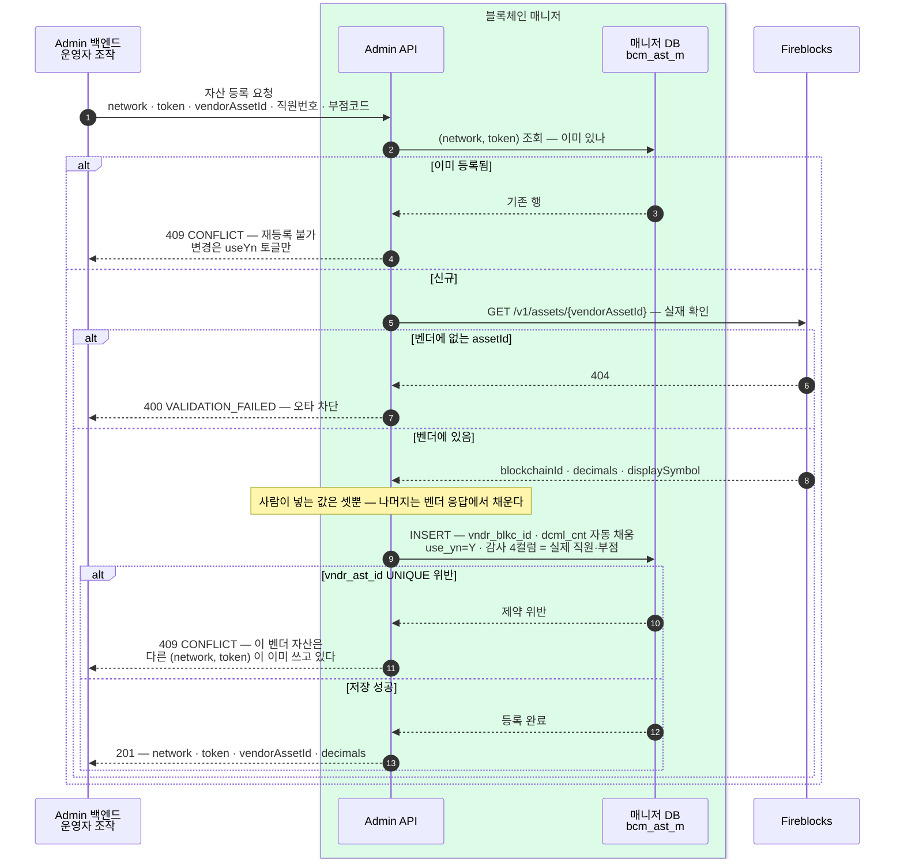

우리가 지원하는 자산을 한 표로 관리하고, 벤더를 부를 때만 벤더 assetId 로 바꾼다.
표를 채우는 등록 절차와 그때 잘못된 assetId 를 걸러내는 관문을 정한다.

## 왜 표가 필요한가

우리 계약은 자산을 **네트워크 + 토큰** 두 값으로 다룬다([흐름](02-bcm-flow.md)). 벤더는 `USDC_POLYGON` · `BASECHAIN_ETH` 처럼 **자체 체계의 assetId 하나**로 다루고, 그 체계는 우리가 정할 수 없다. 둘을 잇는 표가 어딘가에는 있어야 하고, 그 표를 매니저가 갖는다.

**벤더 카탈로그를 따라 동기화하지 않는다.** 벤더가 지원하는 자산은 수천 개지만 우리가 쓰는 것은 몇 개뿐이다. 우리가 지원하기로 한 자산만 등록하고, 늘어나면 그때 한 줄 더한다.

**범위 (시작 시점)** — 스테이블코인만, 네트워크는 `ETHEREUM` · `BASE` 둘. 벤더에는 스테이블코인이라는 분류가 없어(자산 분류는 NATIVE · FT · FIAT · NFT · SFT · VIRTUAL) 어차피 우리가 고르는 결정이다.

## bcm_ast_m — 자산 마스터

```sql
CREATE TABLE bcm_ast_m (
  ntwk_cd       VARCHAR(20)  NOT NULL,   -- 네트워크 코드 (우리 값)
  tkn_smbl      VARCHAR(16)  NOT NULL,   -- 토큰 심볼 (우리 값)
  vndr_ast_id   VARCHAR(64)  NOT NULL,   -- 벤더 assetId — 벤더 호출에만 쓴다
  vndr_blkc_id  VARCHAR(64)  NULL,       -- 벤더 blockchainId — 대조·조회용
  dcml_cnt      INT          NOT NULL,   -- 소수 자릿수
  use_yn        VARCHAR(1)   NOT NULL,   -- 신규 발급·출금 허용 여부
  reg_dttm      VARCHAR(16)  NOT NULL,
  -- 감사 4컬럼
  frst_reg_empno  VARCHAR(6)  NOT NULL,
  frst_reg_brcd   VARCHAR(4)  NOT NULL,
  last_chng_empno VARCHAR(6)  NOT NULL,
  last_chng_brcd  VARCHAR(4)  NOT NULL,
  PRIMARY KEY (ntwk_cd, tkn_smbl),
  UNIQUE (vndr_ast_id)
);
```

| 제약 | 무엇을 막나 |
|---|---|
| `PRIMARY KEY (ntwk_cd, tkn_smbl)` | 같은 자산이 두 줄로 갈라지는 것 |
| **`UNIQUE (vndr_ast_id)`** | **엉뚱한 체인에 주소를 발급하는 사고.** "BASE 의 USDC" 를 등록하며 이더리움 USDC 의 id 를 넣으면 여기서 걸린다 — 한 벤더 자산은 한 (네트워크, 토큰)에만 대응한다 |
| `vndr_ast_id` 는 **set-once** | 이미 주소가 발급된 뒤 이 값을 바꾸면 기존 주소와 새 주소가 서로 다른 체인이 된다. 수정 API 는 이 컬럼을 받지 않는다 |

**`use_yn` 의 뜻** — 신규 발급과 출금 제출만 막고 **입금 감지는 계속한다.** 지원을 내려도 이미 발급된 주소로 돈이 들어올 수 있고, 그걸 못 잡는 것이 사고다.

## 변환은 벤더 경계에서 한 번

우리 어휘는 끝까지 (네트워크, 토큰)으로 가고, **벤더를 부르는 지점에서만** assetId 로 바꾼다. DB·이벤트·API 어디에도 벤더 assetId 가 새어 들어가지 않는다.

호출 지점은 넷 — 주소 발급 · 잔액 조회 · 출금 제출 · sweep.

표에 없거나 `use_yn=N` 이면 **`ASSET_NOT_SUPPORTED`** 로 거절한다. 요청 형식 오류(`VALIDATION_FAILED`)와 구분해야 호출 쪽이 "우리가 잘못 보냈다"와 "아직 지원 안 한다"를 가릴 수 있다. 여러 네트워크 발급에서는 이것이 네트워크별 실패로 떨어져 나머지 네트워크는 정상 발급된다.

캐시는 두지 않는다 — 몇 줄짜리 표에 PK 조회 한 번이라 비용이 없고, 캐시를 두면 값이 바뀌었을 때 무효화 문제가 새로 생긴다.

## 등록 — 잘못된 assetId 를 걸러내는 자리

등록은 어쩌다 한 번이지만, 여기서 틀리면 자금이 엉뚱한 체인으로 간다. 관문을 셋 둔다.



색: **초록 상자 = 매니저 안쪽**. 되돌아오는 점선이 실패 응답이다. 관문 셋이 각각 다른 실수를 잡는다.

- **중복 등록 차단 (②)** — 덮어쓰기를 허용하면 `vendorAssetId` 가 바뀌면서 이미 발급된 주소와 새 주소가 다른 체인이 된다.
- **벤더 실재 확인 (⑥)** — 사람이 손으로 넣는 값을 셋으로 줄이고 나머지는 벤더 응답에서 채운다. 없는 assetId 는 여기서 끝난다.
- **UNIQUE 위반 차단 (⑪)** — 벤더에 존재하는 id 라도 다른 자산의 것일 수 있다. 그 id 를 이미 쓰는 행이 있으면 DB 가 막는다.

**남는 구멍 하나** — 아직 아무도 안 쓰는 assetId 를 잘못 넣으면 세 관문을 다 지난다. 벤더 응답의 `blockchainId` 를 우리 `ntwk_cd` 와 대조해야 잡히는데, 그 대응이 아직 없다. **네트워크 코드를 벤더 `blockchainId` 에 맞추면 이 검증이 공짜로 생긴다** — 네트워크 코드 값을 정할 때 함께 판단한다.

## Admin API — 같은 서비스의 `/admin/*` (2026-08-06 확정)

자산 표를 읽는 코드와 같은 서비스에 두고, 경로를 `/admin/*` 로 나눈다. 표가 매니저 DB 에 있으므로 별도 서비스로 빼면 DB 를 둘이 나눠 쓰게 되거나 결국 매니저를 다시 호출해야 한다.

| 오퍼레이션 | 하는 일 |
|---|---|
| `GET /admin/assets` | 등록된 자산 목록 — 운영 확인용 |
| `POST /admin/assets` | 등록 — `network` · `token` · `vendorAssetId` (나머지는 벤더 응답에서 채운다) |
| `PATCH /admin/assets/{network}/{token}` | `useYn` 토글만 |

**삭제는 두지 않는다** — 발급된 주소가 이 행을 참조하므로 지우면 고아가 된다. 내리는 것은 `useYn=N` 이다.

**감사 흔적** — 자동 처리 행은 시스템 센티넬(`SYSTEM`/`9999`)을 쓰지만 **Admin 수동 개입은 실제 직원번호·부점코드**를 남긴다는 규약([DB 명명 규약](03-bcm-db.md))을 그대로 따른다. 그래서 이 API 는 요청에 직원번호·부점코드를 받아 감사 4컬럼에 쓴다.

**경로를 나눈 것은 경계가 아니다** — 매니저 API 는 인증 없이 내부망을 신뢰하는 구성이라, `/admin/*` 로 이름만 갈라 두면 같은 망의 누구나 자산을 등록할 수 있다. 자산 등록은 잘못되면 자금이 엉뚱한 체인으로 가는 조작이므로, **이 경로의 호출 주체를 Admin 백엔드로 한정하는 망 수준 제한이 함께 필요하다.** 그 방식(방화벽 규칙·별도 리스너 등)은 배포 환경에서 정한다.

## 아직 못 정한 것

- **네트워크 코드 값** — 우리가 정한 이름(`ETHEREUM`·`BASE`)을 쓸지 벤더 `blockchainId` 를 그대로 쓸지. 후자면 위 "남는 구멍"이 닫힌다.
- **실제 assetId 값** — 스펙에는 스키마만 있고 값은 없다. 워크스페이스에서 한 번 조회하거나 담당자에게 확인해야 한다.

## 참고 — 벤더 조회 API

| 엔드포인트 | 쓰임 |
|---|---|
| `GET /v1/assets` | 자산 조회. `blockchainId` · `assetClass` · `symbol` 로 거를 수 있다. 응답에 `id` · `legacyId` · `blockchainId` · `decimals` · `assetClass` |
| `GET /v1/assets/{id}` | 단건 — 등록 시 실재 확인에 쓴다 |
| `GET /v1/blockchains` | 벤더가 지원하는 네트워크 전체. 응답에 `id` · `legacyId` · `displayName` · `nativeAssetId` · `onchain{protocol · chainId · test · signingAlgo}` |
| `GET /v1/supported_assets` | 구 버전 자산 목록 — `id` · `name` · `type` · `contractAddress` · `nativeAsset` · `decimals` |
