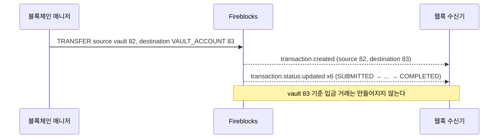
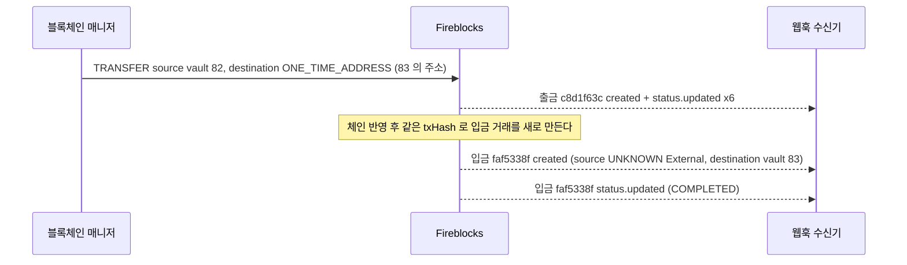

우리 vault 에서 우리 vault 로 보내는 이동이 Fireblocks 에서 어떤 거래·웹훅으로 나타나는지 실물로 확인한 결과다(2026-09-04). [감지·확정](../../블록체인매니저/설계/04-detect-confirm.md)의 방향 판정 규칙이 내부 이동에도 맞는지, 그리고 "입금 감지에 잡히는가"라는 질문에 답하기 위해 돌렸다.

## 환경

- 체인 **이더리움 Sepolia**. 토큰 **kbKRW**(`KBKRW_ETH_TEST5_6KCC`), 금액 10.
- 보낸 vault 82(`approve-pull-owner`, 주소 `0x429C…Dddb`), 받는 vault 83(`approve-pull-owner2`, 주소 `0xB6Df…91D2`). 둘 다 같은 워크스페이스.
- 제출은 `POST /v1/transactions` `operation=TRANSFER`, `externalTxId` 부여. 승인은 API user 자동.
- 관찰 지점 두 곳. ① `GET /v1/transactions?after=` 와 `GET /v1/transactions/{id}` ② `GET /v1/webhooks/{webhookId}/notifications` 와 fbhook 수신기 인박스(`bcm_whk_l`). 인박스 16행과 알림 이력 16건이 일치해 누락은 없었다.
- 원문은 fbhook 저장소 `docs/payload-samples/vault-to-vault/` (거래 객체 3건, 인박스 행).

## 시나리오와 결과

두 방식은 목적지 지정만 다르다.

| | (A) destination = `VAULT_ACCOUNT` 83 | (B) destination = `ONE_TIME_ADDRESS` (83 의 입금 주소) |
|---|---|---|
| Fireblocks 거래 수 | **1건** `7199bafd` | **2건**, 같은 `txHash` `0x3ec4ca76…` |
| source / destination | `VAULT_ACCOUNT:82` / `VAULT_ACCOUNT:83`. 양쪽이 한 거래에 채워진다 | 출금 `c8d1f63c`: `VAULT_ACCOUNT:82` / `ONE_TIME_ADDRESS` 입금 `faf5338f`: `UNKNOWN`(name `External`) / `VAULT_ACCOUNT:83` |
| `externalTxId` | 있음 | 출금에만 있음. 입금 거래는 `null` |
| `sourceAddress` | 82 의 주소 | 두 거래 모두 82 의 주소 |
| 생성 시각 | 제출 즉시 | 출금 04:58:32, 입금은 44초 뒤 04:59:16 (체인에 오른 뒤) |
| 웹훅 | `created` 1 + `status.updated` 6 = 7건 | 출금 7건 + 입금(`created` 1 + `status.updated` 1) 2건 = 9건 |
| 받는 vault 83 기준 별도 입금 거래 | **없음** | **생김** |
| 완료 시점 | `COMPLETED/CONFIRMED`, conf 3 | 두 거래 모두 conf 3 |

잔액은 82: 300 → 280, 83: 150 → 170 으로 두 방식 모두 정상 이동했다.

### 거래 1건 서명 흐름 (A)

### 주소로 보낸 경우 (B)

## 읽을 점

- **destination 을 vault 로 지정하면 입금 감지에 따로 잡히지 않는다.** 거래 1건이 source·destination 을 모두 들고 가고, 웹훅도 그 거래에 대해서만 온다.
- **주소로 보내면 Fireblocks 는 자기 주소를 vault 로 되돌려 인식하지 않는다.** 받는 vault 에 외부 입금과 같은 모양(source `UNKNOWN`/`External`)의 입금 거래가 하나 더 생긴다. `externalTxId` 도 없어 우리 출금과 이어 붙일 값은 `txHash` 와 `sourceAddress` 뿐이다.
- **04장의 방향 규칙은 (A) 에서 그대로 맞는다.** 발신자가 우리 vault 이고 목적지도 우리 vault 라 `INTERNAL` 이다. (B) 의 입금 거래는 source 가 External 이라 규칙대로면 `DEPOSIT` 으로 발행된다. 내부 이동이 고객 입금으로 오발행되는 경로다.
- **vault 간 이동도 conf 3 에서 COMPLETED 됐다.** 공식 문서가 허용하는 "vault-to-vault 0 confirmation" 이 이 워크스페이스에는 적용돼 있지 않다. DCCP 설정값은 따로 확인하지 않았다.

## 설계 반영

- 내부 이동은 **반드시 destination 을 `VAULT_ACCOUNT` 로 지정**해 제출한다. 주소 문자열로 보내지 않는다. [감지·확정 4장](../../블록체인매니저/설계/04-detect-confirm.md), [감지 상세 99](99-detection-detail.md)에 반영.
- 2차 방어로 입금 판정 시 `sourceAddress` 가 우리 vault 주소 목록에 있으면 `DEPOSIT` 을 발행하지 않고 운영 격리 채널로 보낸다. 주소 지정 실수나 외부 시스템이 우리 주소로 보낸 경우를 잡는다.

## 확인하지 않은 것

- DCCP 에서 vault-to-vault 를 0 conf 로 바꿨을 때의 웹훅 형태.
- 다른 워크스페이스의 vault 주소로 보낸 경우(P2P Network 미사용). 이번 실측은 같은 워크스페이스 안에서만 했다.
- Universal Gasless 경로. 이번 실측은 vault 의 Sepolia ETH 로 가스를 냈다.
