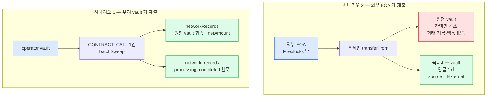
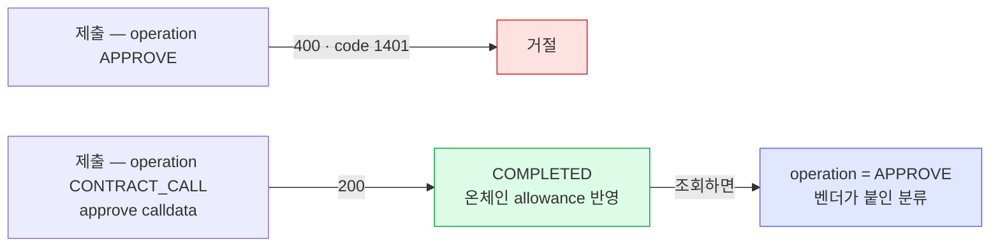
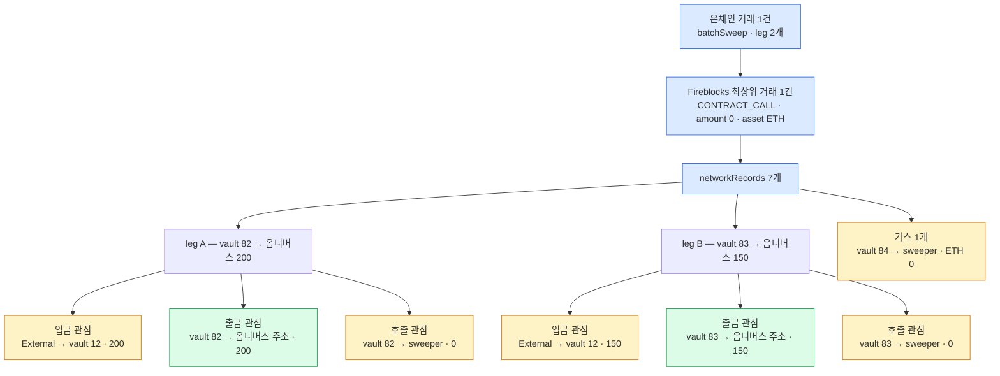

[배치 sweep 메커니즘](98-batch-sweep.md)의 미확인 항목 두 가지를 실물로 확인한 결과다(2026-08-10). ① ERC-20 `approve` 를 Fireblocks 로 어떤 형태로 제출하나 ② vault 가 스스로 제출하지 않은 거래로 잔액이 빠질 때 거래 기록과 웹훅이 어떻게 오나.

## 환경

- 체인 **이더리움 Sepolia**. 토큰은 파블로 발행한 **kbKRW**(`KBKRW_ETH_TEST5_6KCC` · `0xe64B8b9be27a2DcEF434932d4e7065EB3E098f47` · 18 decimals · 업그레이드 가능한 프록시)
- Fireblocks testnet 워크스페이스
- 웹훅 구독은 기존 3종에 **`transaction.network_records.processing_completed` 를 추가**해서 돌렸다
- **Universal Gasless 는 쓰지 않았다** — vault 에 Sepolia ETH 를 직접 넣고 제출했다. 그래서 대납 적용 여부는 이 PoC 로 답이 나오지 않는다

| 역할 | 주체 | 주소 |
|---|---|---|
| owner 1 (받는주소) | vault 82 `approve-pull-owner` | `0x429CdEa1DC75bBDa4e006675Abe5F773E299Dddb` |
| owner 2 (받는주소) | vault 83 `approve-pull-owner2` | `0xB6Df2ad4d9FB89529874636276AF2E367cf091D2` |
| operator (제출자) | vault 84 `approve-pull-operator` | `0xf39864Fe764072cec80feb0DC1E24Db7a00E2B08` |
| 옴니버스 (목적지) | vault 12 `kb-test-stablecoin-issuer` | `0x496E49e0d3F30336079FF0B921F98D77eb00055D` |
| spender EOA — 시나리오 2 전용 | **Fireblocks 밖의 일회용 지갑** · 개인키를 로컬에 생성 | `0x7b2CD2087fF2Ca4aEFC2e9A99Ae2a61560a0255b` |
| 배치 sweeper 컨트랙트 | 직접 배포 | `0xF95AFc896461a3eb7426714267eC6abb1cd6A1c9` |

sweeper 는 98 의 "최소 통제" 를 그대로 반영해 짰다 — 목적지(옴니버스)·토큰·호출 가능한 운영자를 **배포 시 고정**하고 호출자가 임의 주소를 넘길 수 없게 했으며, 한 건이 실패해도 전체를 revert 하지 않고 skip 하며 이벤트를 남긴다. 수신기(fbhook)는 관찰 지점으로만 썼고 실행은 일회성 스크립트로 했다.

## 시나리오 한눈에

| # | 시나리오 | 결과 |
|---|---|---|
| 1 | `approve` 를 두 경로로 제출 | `APPROVE` operation 은 **거절(400)** · `CONTRACT_CALL` 은 성공하고 **기록은 `operation=APPROVE`** |
| 2 | 외부 EOA 가 단건 `transferFrom` 실행 | 빠지는 vault 쪽 **거래 기록·웹훅 없음** · 잔액만 감소 · 받는 vault 입금 1건만 생성 |
| 3 | operator vault 가 배치 2 leg 제출 | `networkRecords` 7개에 **원천 vault·금액 귀속** · `network_records.processing_completed` 수신 |

시나리오 2와 3은 결과가 다르다. 차이는 방식이 아니라 **누가 온체인 거래를 제출했는지**에서 온다.



빨강은 벤더 장부에 남지 않는 것, 초록은 남는 것, 파랑은 거래를 낸 주체다. 같은 `transferFrom` 이라도 제출자가 워크스페이스 밖이면 원천 vault 쪽이 통째로 비고, 우리 vault 가 제출하면 벤더가 영수증을 파싱해 자기 vault 들에 귀속시킨다.

## 1. approve 제출 경로

**한 것** — vault 82 가 spender 를 승인하는 거래를 두 형태로 제출했다.

| 시도 | 요청 | 결과 |
|---|---|---|
| A-1 | `operation: APPROVE` · 토큰 assetId · 목적지 = spender | **400** `{"message":"Cannot perform transaction","code":1401}` |
| A-2 | `operation: APPROVE` · 가스 assetId · 목적지 = 토큰 컨트랙트 · approve calldata | **400** 같은 응답 |
| B | `operation: CONTRACT_CALL` · 가스 assetId · 목적지 = 토큰 컨트랙트 · approve calldata | **200 → COMPLETED** |

**결과** — B 만 통했다. 그런데 성공한 그 거래를 조회하면 `operation` 이 **`APPROVE`** 로 나온다.

```
8a43eab7-…  operation=APPROVE  status=COMPLETED  asset=KBKRW_ETH_TEST5_6KCC  amount=200
txHash 0xb442e5f5…   온체인 allowance 200 반영 확인
```

즉 `APPROVE` 는 제출용 operation 이 아니라 **벤더가 calldata 를 보고 붙이는 분류 라벨**이다. API 스키마에 이름이 있다는 것과 제출 경로로 쓸 수 있다는 것은 다르다 — 이 PoC 전에는 둘을 같은 것으로 봤다.



제출값과 조회값이 다르다. 원장에 operation 을 남길 때 어느 쪽을 적을지 정해 둬야 한다.

정책 쪽에 `APPROVE` transactionType 과 Contract_Call 룰의 `applyForApprove` 플래그가 있으니 이 분류 위에 정책이 서는 구조로 보이지만, 정책이 실제로 걸리는지는 확인하지 않았다.

## 2. 외부 EOA 가 단건 transferFrom 실행

**한 것** — vault 82 가 EOA 를 spender 로 승인한 상태에서, 그 **EOA 가 직접** `transferFrom(vault82, vault12, 100)` 을 호출했다. Fireblocks 를 거치지 않은 제출이다 — 벤더가 모르는 거래로 vault 잔액이 빠지는 상황을 만들려면 제출자가 워크스페이스 밖에 있어야 해서, 이 시나리오에만 쓰는 일회용 지갑을 따로 만들었다. 설계의 운영 계정에 해당하는 것은 시나리오 3 의 vault 84 다.

**결과** — 온체인 성공(`0x52d60271…`), vault 82 잔액 1000 → 900.

| 관찰 대상 | 결과 |
|---|---|
| 빠지는 vault(82) 잔액 | 갱신된다 |
| 빠지는 vault(82) 거래 기록 | **없다** — 이 vault 를 source 로 하는 거래는 앞서 낸 approve 뿐 |
| 빠지는 vault(82) 웹훅 | **없다** |
| 받는 vault(12) 거래 기록 | 입금 1건 — `operation=TRANSFER` · `COMPLETED` · amount 100 |
| 그 기록의 `source` | `{type: "UNKNOWN", name: "External"}` — 같은 워크스페이스 vault 인데도 귀속되지 않는다 |
| 그 기록의 `sourceAddress` | `0x429CdEa1…` — 주소는 채워진다 |
| 받는 vault(12) 웹훅 | `transaction.created` → `transaction.status.updated` 2건 |
| `networkRecords` | 0 (단건이라 비어 있다) |

벤더가 모르는 거래로 잔액이 줄어도 **잔액 자체는 맞춰진다.** 다만 그 인출은 벤더 장부에 "누가 뺐다"로 남지 않는다.

## 3. operator vault 가 배치 2 leg 제출

**한 것** — owner vault 두 곳(82·83)이 `CONTRACT_CALL` 로 sweeper 를 승인(각 300)한 뒤, **operator vault 84 가 `batchSweep([82주소, 83주소], [200, 150])` 을 CONTRACT_CALL 로 한 번** 제출했다.

**결과** — 온체인 1건(`0xbcc3e816…`), Fireblocks 최상위 거래도 1건(`d98a64ba…` · `operation=CONTRACT_CALL` · `amount=0` · asset 은 가스 자산). 그 거래에 `networkRecords` **7개**가 붙었다.

| # | source | 목적지 주소 | assetId | netAmount |
|---|---|---|---|---|
| 0 | UNKNOWN / External | 옴니버스 | kbKRW | 150 |
| 1 | **vault 83** | 옴니버스 | kbKRW | 150 |
| 2 | vault 83 | sweeper | kbKRW | 0 |
| 3 | UNKNOWN / External | 옴니버스 | kbKRW | 200 |
| 4 | **vault 82** | 옴니버스 | kbKRW | 200 |
| 5 | vault 82 | sweeper | kbKRW | 0 |
| 6 | vault 84 | sweeper | ETH | 0 — 호출 자체 |

- **원천 vault 가 귀속된다** — `source` 에 `{id: "82"/"83", type: "VAULT_ACCOUNT"}` 로 나오고 `netAmount` 도 실린다. 시나리오 2에서 안 되던 것이 여기서는 된다.
- **`transaction.network_records.processing_completed` 가 왔다** — 제출 약 37초 뒤.
- 잔액도 맞았다 — 82: 500 → 300 · 83: 400 → 250 · 옴니버스 1139 → **1489**(+350).
- **최상위 거래는 제출 1건뿐이다** — 원천 vault 를 source 로 하는 최상위 거래도, 옴니버스 입금 최상위 거래도 생기지 않았다.
- **leg 당 레코드가 2~3개로 중복 표현된다** — 입금 관점(External → 옴니버스 vault) · 출금 관점(원천 vault → 옴니버스 주소) · `netAmount` 0 인 컨트랙트 호출 관점.



초록이 대사에 쓸 레코드다 — 원천 vault 와 금액이 함께 있는 출금 관점 한 줄. 노랑은 같은 이동을 다른 관점으로 다시 센 것이거나 금액이 0 인 것이라 걸러야 한다. 레코드 수를 그대로 이동 건수로 세면 2건이 7건이 된다.

## 종합 — 설계에 반영한 것

- **배치 sweep 의 감지·대사에 필요한 기록은 나온다.** 조건은 **제출을 우리 vault 로 하는 것**이다. 서명만 넘겨 외부가 제출하는 구성(3009·2612 를 제3자가 실행)은 시나리오 2 처럼 원천 쪽에 기록이 남지 않는다.
- **`network_records.processing_completed` 구독이 검토 대상에서 필수로 바뀐다.** 최상위 거래 1건에는 이동 정보가 없어서, 이 이벤트와 `networkRecords` 없이는 어느 vault 에서 얼마가 빠졌는지 알 수 없다.
- **대사 규칙에 걸러내기가 들어간다** — `netAmount` 0 레코드 제외, 그리고 같은 이동이 입금·출금 관점으로 두 번 오는 것의 중복 제거. 이 규칙 없이 레코드 수를 이동 건수로 세면 틀린다.
- **approve 제출은 `CONTRACT_CALL`** 이고 조회 시 `APPROVE` 로 보인다. 원장에 operation 을 기록할 때 제출값과 조회값이 다를 수 있다는 뜻이다.

배치 채택 여부는 [sweep 설계](06-sweep.md)에서 결정한다. 이 PoC 는 그 판단의 재료이고, 현재 결정은 여전히 건별 일반 전송이다 — 감지가 된다고 확인됐어도 최상위 1건 ↔ 이동 M건을 받는 DB·상태 흐름이 아직 없고, allowance 라는 지속 권한 문제는 그대로 남아 있다.

## 못 한 것

- **TAP 정책 실측** — `APPROVE`·`applyForApprove` 로 spender·token·승인 금액을 어디까지 제한할 수 있는지. 정책 발행이 Owner 콘솔 리뷰와 모바일 승인을 거쳐야 해서 이번에 못 돌렸다.
- **Universal Gasless 적용** — `CONTRACT_CALL` approve 와 배치 호출을 대납으로 낼 수 있는지, relay 처리량은 얼마인지. 도입에 계약이 선행이라 CSM 질의 대상이다.
- **leg 수 확대** — 이번은 2 leg 이다. 수십 leg 에서 레코드 개수·이벤트 지연·가스가 어떻게 되는지는 안 봤다.
- **부분 실패 경로** — sweeper 에 skip + 이벤트를 구현했지만 실패하는 leg 를 실제로 만들어 보지는 않았다.
- 7702 위임 코드의 운영자 pull 지원도 여전히 미확인이다.

## 재현

실행 스크립트는 fbhook 저장소 `scripts/approve-pull/` 에 있다(앱 범위 밖의 일회성 스크립트). 준비 → 승인 → 단건 인출 → 배치 순으로 번호가 붙어 있고, sweeper 소스도 같은 폴더에 있다. 관찰 원본은 fbhook `NEXT.md` 의 관찰 기록에 적었다.

테스트 잔여물은 지우지 않았다 — vault 82·83·84, spender EOA, sweeper 컨트랙트, 그리고 owner 두 곳에 남은 allowance(각각 100·150). 재검토 때 그대로 다시 쓸 수 있다. 치울 때는 `approve(sweeper, 0)` 을 먼저 내고 토큰·가스를 회수한다.
