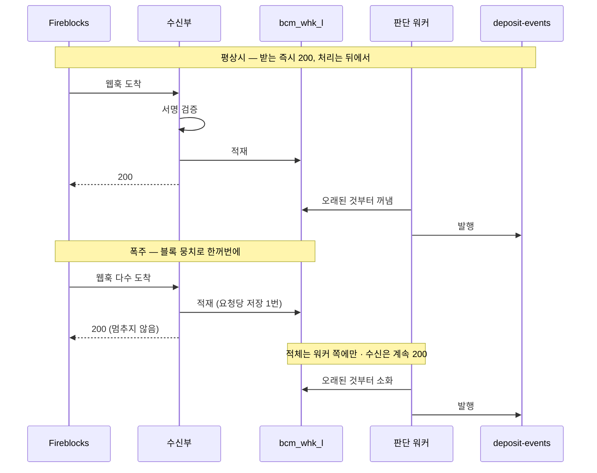
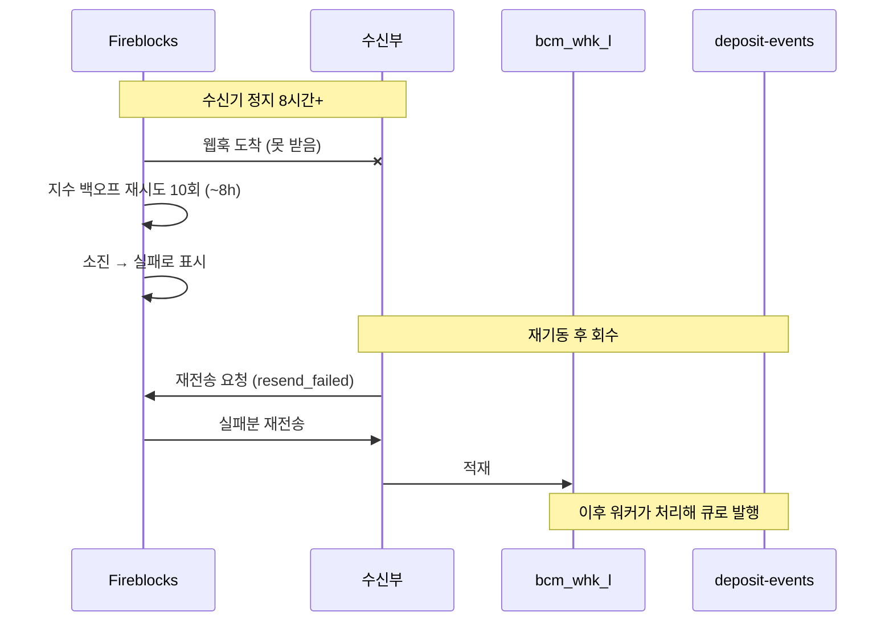
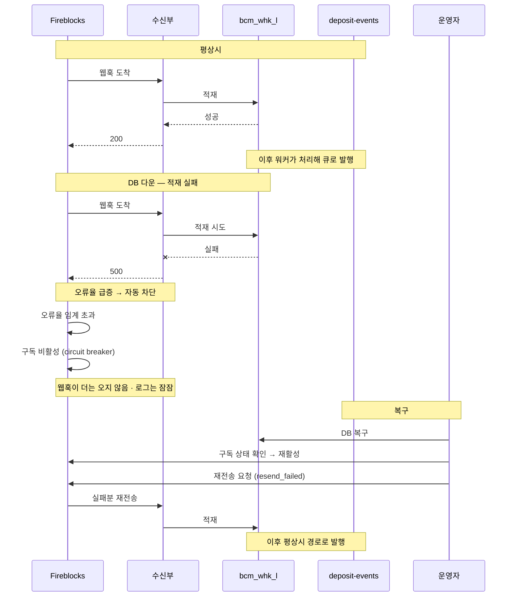
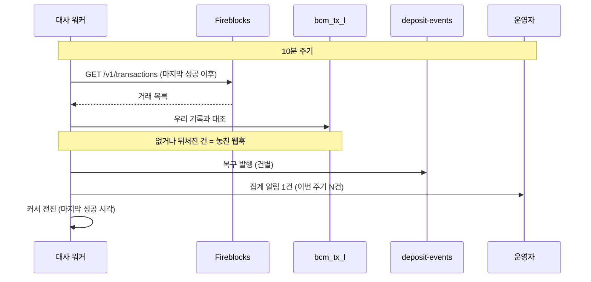

[흐름](02-bcm-flow.md) 감지 절의 심화 참고 문서다 — 웹훅이 **한꺼번에 몰릴 때**와 **놓쳤을 때**를 어떻게 견디는지만 따로 모았다. 본 흐름 이해에 필수는 아니고, 구현·부하 설계 때 본다.

## 입금이 몰릴 때 — 수신은 3단계, 처리는 뒤로

도착 속도는 벤더가 정한다. EVM 입금 통지는 채굴 시점에 생성되므로 **블록 단위로 뭉쳐 온다** — 10분에 1만 건이면 평균은 초당 ~17건이지만, 실제로는 이더 기준 12초마다 블록당 ~200건이 한꺼번에 오고 tx 당 알림이 2~3개라 순간치는 그 2~3배다. 부하 기준은 평균이 아니라 이 뭉치로 잡는다: **"12초마다 알림 500건이 2초 안에 몰리는 파형 지속"**.

버티는 방법은 하나다 — **받는 일과 처리하는 일을 나눈다.** 수신부는 요청당 딱 3단계만 하고, 무거운 판단·발행은 뒤의 워커가 맡는다.

| 단계 | 수신부가 하는 일 |
|---|---|
| 서명 검증 | 진짜 벤더가 보낸 게 맞는지 확인 (공개키는 캐시에서만 읽어 네트워크 왕복 0) |
| 수신 적재 | 알림 원본을 버퍼 테이블(`bcm_whk_l`)에 저장. 같은 알림이 또 오면 키 충돌로 자동 무시 |
| 200 응답 | 저장 성공 즉시 "받았다" 응답 |

요청당 비용이 "저장 한 번(수 ms)"으로 고정이라, 아무리 몰려도 **수신부는 멈추지 않고 계속 즉시 응답**한다. 이게 핵심인 이유 — 벤더는 우리가 응답을 자꾸 못 하면 웹훅을 아예 꺼버리기 때문이다(circuit breaker). 판단 워커는 버퍼에 쌓인 걸 오래된 것부터 집어가고, 필요하면 여러 대로 늘릴 수 있다. **폭주의 대가는 "처리 지연"뿐이고, 유실은 없다.**

받는 즉시 200, 무거운 처리는 뒤 워커로 — 호출 순서로 보면:



색: **보라 = 벤더가 보낸 웹훅 도착 · 청록 = DB 테이블 · 노랑 = 메시지 큐.**

```anim
db
hook: Fireblocks 웹훅 | 도착
table: bcm_whk_l | 알림 | 처리
queue: deposit-events | 발행
step: 평상시 | 벤더가 웹훅을 보내면(도착) 수신부가 저장하고, 워커가 처리해 큐에 발행한다
ins: Fireblocks 웹훅 | 입금 감지
ins: bcm_whk_l | n-01 | 완료
ins: deposit-events | 감지
step: 폭주 — 웹훅이 쏟아진다 | 블록 뭉치로 웹훅이 한꺼번에 도착 — 수신부는 저장만 하고 즉시 200 (멈추지 않음)
ins: Fireblocks 웹훅 | 입금 감지
ins: Fireblocks 웹훅 | 입금 감지
ins: Fireblocks 웹훅 | 입금 감지
ins: bcm_whk_l | n-02 | 대기
ins: bcm_whk_l | n-03 | 대기
ins: bcm_whk_l | n-04 | 대기
step: 적체는 워커 쪽에만 | 수신은 계속 받고, 밀린 건 워커가 오래된 것부터 소화한다
upd: bcm_whk_l | 2 | 처리=완료
upd: bcm_whk_l | 3 | 처리=완료
ins: deposit-events | 감지
ins: deposit-events | 감지
step: 정상 복귀 | 남은 것도 처리 — 대가는 처리 지연뿐, 놓친 건 없다
upd: bcm_whk_l | 4 | 처리=완료
ins: deposit-events | 감지
```

**구독 이벤트**는 4종으로 확정 — `transaction.created` · `transaction.status.updated` · `transaction.approval_status.updated` · `transaction.alert.stuck_confirming`. 부하 검증 항목은 p99 응답(1초 이내 목표) · 오류율(circuit breaker 감안 ~0) · 적체 소화 속도.

## 웹훅을 놓쳤을 때 — 복구 3겹

웹훅은 유실·지연·순서 뒤바뀜이 있을 수 있다. 세 겹으로 메운다 — 앞의 둘은 벤더 기능이고, 마지막은 우리가 벤더 기록을 직접 대조하는 안전망이다.

| 복구 수단 | 무엇인가 | 언제 |
|---|---|---|
| **벤더 재시도** | 우리가 200 을 안 주면 벤더가 **자동으로 다시 보낸다** — 지수 백오프로 총 10회(10초 → … → 4시간, 합산 ~8시간). 우리가 할 일 없음 | 수신기가 잠깐 멈췄을 때 자동으로 메워짐 |
| **재전송 API** ([Fireblocks 문서](https://developers.fireblocks.com/reference/resend-webhook-notifications)) | 재시도로도 실패 처리된 알림을 **우리가 "다시 보내줘"라고 요청**하는 벤더 API (`POST /v1/webhooks/{id}/notifications/resend_failed`). 원 이벤트로부터 **30일 내** 가능 · 같은 이벤트는 5분에 1회. 수신기가 오래 정지했다 재기동하면 그 직후 한 번 호출해 정지 구간을 회수 | 수신기가 ~8시간 넘게 정지했을 때 재기동 후 |
| **tx 대사** | 벤더가 **알림을 만들지도 못한 구간**(벤더 장애 등)은 위 둘로 못 메운다. 그래서 우리가 주기적으로 벤더 거래 목록을 읽어 우리 기록과 대조 — 아래 절 | 최종 안전망 (10분 주기 상시) |

"재전송 API"의 요지는 **"벤더는 이미 만든 알림을 우리 요청으로 다시 보낼 수 있다"**는 것이다 — 벤더가 알림 자체를 안 만든 구간만 tx 대사의 몫으로 남는다.

### 재전송 API — 수신기가 오래 정지했다 재기동한 뒤

수신기가 ~8시간 넘게 멈추면 벤더 재시도가 소진돼 그 알림들은 벤더 쪽에서 "실패"로 표시된다. 재기동 직후 재전송 API 를 한 번 호출하면, 벤더가 실패 처리한 알림을 다시 보내 다운 구간을 메운다. 원 이벤트로부터 30일 안, 같은 이벤트는 5분에 한 번 제한이 있다. 벤더가 알림 자체를 안 만든 구간은 여기서 못 메우고 다음 절의 tx 대사가 맡는다.

벤더 재시도가 소진된 뒤, 재기동 후 우리가 회수를 요청하는 순서:



색: 보라 = 웹훅 도착·재전송 요청 · 청록 = 버퍼(`bcm_whk_l`) · 노랑 = 큐 · **빨강 깜박임 = 못 받아 유실 위험**.

```anim
db
hook: Fireblocks 웹훅 | 도착
source: 재전송 API | 요청
table: bcm_whk_l | 알림 | 처리
queue: deposit-events | 발행
step: ① 평상시 | 웹훅이 오면 버퍼에 적재하고 워커가 처리해 큐에 발행한다
ins: Fireblocks 웹훅 | 입금 감지
ins: bcm_whk_l | n-01 | 완료
ins: deposit-events | 감지
step: ② 수신기 정지 8시간+ — 장애! | 웹훅이 와도 못 받는다 · 벤더 재시도도 소진돼 벤더 쪽에서 "실패"로 표시된다(빨강)
ins: Fireblocks 웹훅 | 입금 감지
ins: Fireblocks 웹훅 | 입금 감지
alert: Fireblocks 웹훅 | 2
alert: Fireblocks 웹훅 | 3
step: ③ 재기동 → 재전송 요청 | 재기동하면 재전송 API 를 한 번 호출해 "실패분을 다시 보내줘"라고 요청한다
ins: 재전송 API | resend_failed
step: ④ 벤더가 실패분 재전송 | 벤더가 그 알림들을 다시 보낸다 → 버퍼에 적재되고 큐로 발행돼 공백이 메워진다
ins: bcm_whk_l | n-02 | 완료
ins: bcm_whk_l | n-03 | 완료
ins: deposit-events | 감지
ins: deposit-events | 감지
clear: Fireblocks 웹훅 | 2
clear: Fireblocks 웹훅 | 3
```

정지·장애가 어떻게 나든 복구는 "재기동 + 재전송 + (경우에 따라) 웹훅 재활성화"로 수렴하고, 어느 경우도 **유실은 없다**:

| 시나리오 | 그동안 | 복구 | 유실 |
|---|---|---|---|
| 판단 워커만 정지 (수신 정상) | 수신은 200 유지, 적체만 증가 | 재기동 → 밀린 것부터 소화 | 없음 — 가장 안전한 고장 |
| 수신기 정지 ≤ ~8시간 (배포·점검 포함) | 벤더 재시도가 대기해 준다 | 재기동만 하면 재시도가 이어짐 (+ 재전송 1회) | 없음 |
| 수신기 정지 > ~8시간 | 벤더 재시도 소진 → 실패 마킹 | **재전송 API 로 30일 내 회수** | 없음 |
| DB 만 다운 (수신이 500 응답) | 오류율 상승 → **웹훅 자동 차단(circuit breaker) 위험** | 복구 절차: 웹훅 활성 상태 확인 → 재활성화 → 재전송 | 없음 — 재활성화를 빠뜨리면 조용한 정지 |
| 벤더 장애·점검 | 알림 자체가 안 옴 (우리 오류는 0) | 벤더 상태 모니터링이 잡음 → **tx 대사가 최종 안전망** | 대사가 메움 |

### DB 만 다운 — 재활성화를 빠뜨리면 조용한 정지

위 표에서 가장 위험한 줄이다. 버퍼 적재가 실패하면 수신부가 200 대신 500 을 준다. 오류율이 오르면 벤더가 웹훅 구독을 스스로 꺼버린다(circuit breaker). 이때부터는 웹훅이 아예 오지 않는데도 우리 쪽 오류 로그는 잠잠해서 알아채기 어렵다 — 재활성화를 빠뜨리면 조용한 정지가 된다. 복구는 DB 를 살린 뒤 **구독 상태를 확인해 다시 켜고**, 꺼져 있던 구간은 재전송 API 와 tx 대사로 회수한다.

500 → 자동 차단 → 재활성화까지, 행위자 사이 호출 순서:



색: 보라 = 웹훅 도착 · 청록 = 버퍼·구독 상태 · 노랑 = 큐 · **빨강 깜박임 = 500 응답·구독 차단**.

```anim
db
hook: Fireblocks 웹훅 | 도착
table: bcm_whk_l | 알림 | 처리
table: 웹훅 구독 | 상태
queue: deposit-events | 발행
step: ① 평상시 | 웹훅이 오면 버퍼에 적재(200)하고 발행한다 · 구독은 활성
ins: 웹훅 구독 | 활성
ins: Fireblocks 웹훅 | 입금 감지
ins: bcm_whk_l | n-01 | 완료
ins: deposit-events | 감지
step: ② DB 다운 — 적재 실패로 500 | 웹훅은 오는데 버퍼에 못 넣는다 → 200 대신 500 을 준다(빨강)
ins: Fireblocks 웹훅 | 입금 감지
alert: Fireblocks 웹훅 | 2
step: ③ 오류율 급증 → 웹훅 자동 차단 | 벤더가 오류율을 보고 구독을 꺼버린다(circuit breaker) · 이제 웹훅이 아예 안 온다 — 로그는 잠잠해 알아채기 어렵다
upd: 웹훅 구독 | 1 | 상태=차단
alert: 웹훅 구독 | 1
step: ④ 복구 — 재활성화 + 구간 회수 | DB 복구 후 구독 상태를 확인해 다시 켜고, 차단 구간은 재전송 API·tx 대사로 메운다
upd: 웹훅 구독 | 1 | 상태=활성
clear: 웹훅 구독 | 1
clear: Fireblocks 웹훅 | 2
ins: bcm_whk_l | n-02 | 완료
ins: deposit-events | 감지
```

## tx 대사 — 놓친 웹훅을 잡는 최종 안전망

10분 주기로 벤더 거래 목록을 읽어 우리 기록(`bcm_tx_l`)과 대조한다. 없거나 뒤처진 건을 **웹훅과 똑같은 처리 경로**로 흘려 복구한다(자금은 건별로 큐에 발행). 동시에 운영 알림도 올리는데, 건별이 아니라 **주기당 1건으로 집계**한다 — 크게 터진 뒤 수백 건이 잡혀도 사람에게 가는 알림은 하나다. 누락이 잡혔다는 것 자체가 웹훅 경로 이상 신호라, 급증할 때만 호출(page)로 올린다.

벤더 목록을 당겨 대조하고, 자금은 건별·운영 알림은 집계로 나누는 순서:



색: 보라 = 웹훅 도착 · 청록 = DB · 노랑 = 큐 · **빨강 깜박임 = 장애·누락**. `bcm_tx_l` 의 "벤더 상태" 칸은 대사가 그 순간 벤더 목록에서 확인한 값이다(저장 컬럼이 아니라 대조용).

```anim
db
hook: Fireblocks 웹훅 | 도착
table: bcm_tx_l | 거래 | 우리 상태 | 벤더 상태
table: bcm_job_m | 대사작업 | 마지막성공
queue: deposit-events | 발행
step: ① 감지 웹훅 도착 | CONFIRMING 웹훅이 와서 우리 기록이 생긴다
ins: Fireblocks 웹훅 | 입금 감지
ins: bcm_tx_l | tx-91c | CONFIRMING | 
ins: bcm_job_m | tx-대사 | 11:50
step: ② 확정 웹훅 유실 — 장애! | COMPLETED 웹훅이 오지 않는다 — 우리 상태가 CONFIRMING 에 멈춰 빨갛게 경보
alert: bcm_tx_l | 1
step: ③ tx 대사 — 벤더 목록 대조 | 대사가 벤더 목록에서 이 거래를 확인 → 벤더는 COMPLETED, 우리는 CONFIRMING (한 줄에서 불일치가 보인다)
upd: bcm_tx_l | 1 | 벤더 상태=COMPLETED
step: ④ 복구 발행 | 웹훅과 같은 경로로 확정을 발행하고 운영 알림도 올린다 → 우리 상태를 맞추고 경보 해제
upd: bcm_tx_l | 1 | 우리 상태=COMPLETED
clear: bcm_tx_l | 1
ins: deposit-events | 입금 확정
step: ⑤ 커서 전진 | 마지막 성공 시각을 앞으로 — 다음 대사는 여기서 이어붙여 공백이 없다
upd: bcm_job_m | 1 | 마지막성공=12:00
```

- **대조 범위** = 최근 1시간과 마지막 성공 대사 시각 중 이른 쪽부터 — 대사가 오래 멈춰도 재기동하면 공백 없이 이어붙는다(마지막 성공 시각은 `bcm_job_m` 이 들고 있다).
- **웹훅과 같은 처리 경로를 쓴다** — 대사가 잡은 건도 중복 방지·전이 비교를 그대로 지나므로 이중 반영이 없다.
- 호출량은 주기당 목록 조회 1~수 회라 벤더 한도에 영향이 없다.
