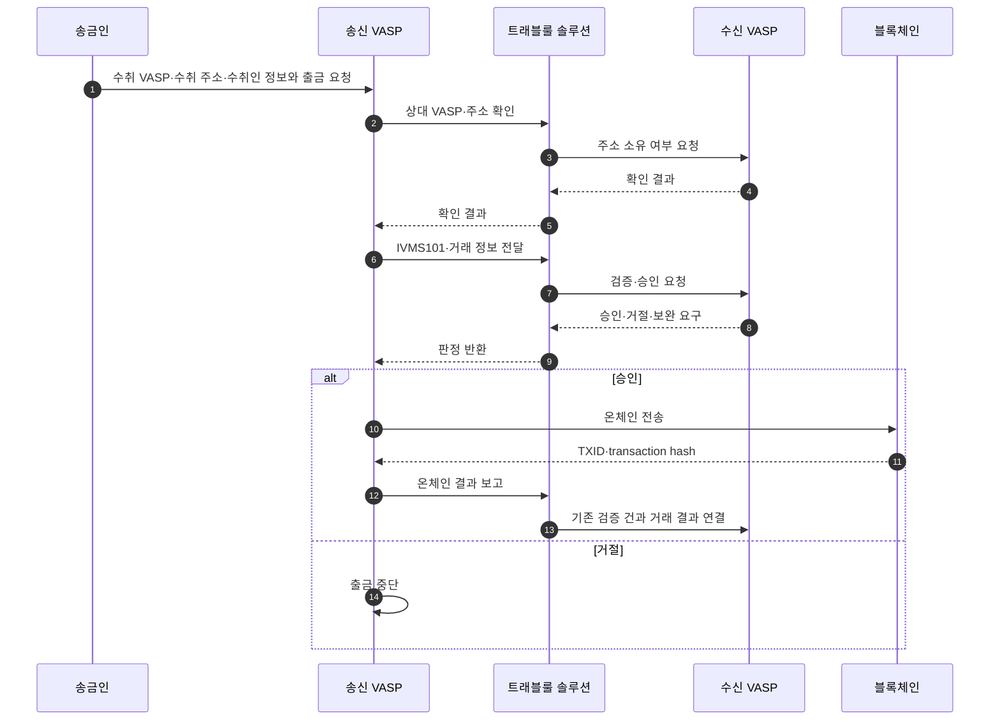

트래블룰 솔루션을 같은 기준으로 조사하고, 기능·배포·개인정보 처리·실제 연결 범위를 원본까지 추적할 수 있게 정리한다.
현재 1차 범위는 공식 기술 문서를 확보한 VerifyVASP·CODE·Notabene 세 솔루션이다.

## 이 문서집의 역할

이 문서집은 제품별 **사실 확인 자료**다. 시장 전체 개념은 [솔루션 지형](../../트래블룰/개념/03-solutions.md), 우리 시스템에 적용한 흐름은 [트래블룰 설계](../../트래블룰/설계/00-screening-order.md)가 담당한다.

여기서는 공식 문서로 확인한 내용만 본문에 둔다. 제품 선택·도입 권고·비용 대비 효과는 별도의 의사결정 문서가 생기기 전까지 다루지 않는다.

## 조사 상태

| 솔루션 | 공식 원문 | 카드 | 현재 범위 |
|---|---|---|---|
| VerifyVASP | 9개 | [보기](01-verifyvasp.md) | 아키텍처·API·{{Enclave::VerifyVASP가 VASP 내부에 설치하는 암복호화·통신 모듈}}·DB·운영·{{IVMS101::InterVASP Messaging Standard 101 — 트래블룰 당사자 정보를 교환하기 위한 데이터 표준}} 제품 구현 |
| IVMS101 | InterVASP 정본 1개 | [보기](04-ivms101-data.md) | IVMS101.2023 표준 필드·다중성·제약과 제품 매핑 |
| CODE | 8개 | [보기](02-code.md) | 통신 시나리오·API·암호화·Cipher·상호운용 |
| Notabene | 9개 | [보기](03-notabene.md) | 전송 흐름·인증·{{Webhook::특정 이벤트가 발생했을 때 상대 서버로 결과를 전달하는 비동기 HTTP 알림}}·{{PII::Personally Identifiable Information — 개인을 식별할 수 있는 정보}}·Fireblocks 연동 |

조사 기준일은 **2026-08-07**이다. 확보한 원문은 `blockchain-manager/sources/travel-rule-solutions/`에 날짜별 스냅샷으로 보존한다. InterVASP PDF는 공식 URL·페이지 수·SHA-256만 기록했으며 PDF 바이너리는 아직 로컬에 보존하지 않았다.

## 같은 기준으로 본 세 솔루션

| 비교 항목 | VerifyVASP | CODE | Notabene |
|---|---|---|---|
| 공식 문서의 제품 성격 | TravelRule 프로토콜 | Travel Rule 프로토콜·얼라이언스 | Notabene Transact |
| 통합 표면 | {{VASP::Virtual Asset Service Provider — 가상자산사업자}} 내부 Enclave + VASP 구현 API | CodeVASP API + 선택 가능한 Cipher 모듈 | API·컴포넌트·웹훅 |
| 개인정보 보호 | VASP 간 {{E2EE::End-to-End Encryption — 송신자와 수신자만 내용을 해독할 수 있는 종단간 암호화}}, 중앙 서버는 복호화·저장하지 않음 | payload E2EE, CodeVASP는 개인정보에 접근·처리 불가 | 고객 관리 E2EE 또는 Notabene 관리 암호화 중 선택 |
| 출금 기본 흐름 | 주소·수취인 사전 검증 → 온체인 전송 → {{TxHash::Transaction Hash — 블록체인 거래를 식별하는 해시 값}} 보고 | 주소·수취인 사전 승인 → 온체인 전송 → 결과 보고 | 전송 객체·PII 구성 → 정책 판정 → 온체인 정산 |
| 사전 정보 없는 입금 | UUID 기반 상태 확인 흐름 | {{TXID::Transaction ID — 블록체인에 기록된 거래를 식별하는 값}}로 송신 VASP 탐색 후 정보 요청 | `txMatch` 후 정보 요청 또는 직접 보완 |
| Fireblocks 직접 연동 | 공식 원문에서 확인하지 못함 | 공식 원문에서 확인하지 못함 | Notabene V1 직접 연동 확인 |

이 표는 제품의 우열을 뜻하지 않는다. 각 셀은 해당 솔루션 카드의 Source 표에서 근거를 다시 확인할 수 있다.

## 데이터 명세와 전달 방식 비교

필드 이름·필수 조건·허용 코드가 하나라도 빠지면 구현 명세로 사용할 수 없다. [IVMS101 전체 교환 데이터 필드](04-ivms101-data.md)는 InterVASP IVMS101.2023을 표준 정본으로 삼고, VerifyVASP의 필드명·확장·`requiredBeneficiaryInfo` 코드를 제품 구현으로 분리해 기재했다.

아래 표는 전체 데이터 목록을 축약한 것이 아니라 **값의 생성 주체와 전달 방식만** 비교한다. 현재 필드 단위 전수 확인이 끝난 범위는 IVMS101과 VerifyVASP User Verification 요청이다. CODE·Notabene의 제품 전용 API 전체 요청·응답 필드는 구현 명세 카드로 제공하지 않으므로, 현재 솔루션 카드의 설명을 구현 스키마로 사용하지 않는다.

### 필드 이름을 읽는 법

영문 필드명은 값의 의미와 생성 주체를 함께 적어야 한다. 예를 들어 InterVASP 정본의 `accountNumber`는 거래 처리에 사용하는 계정 식별자이고, 솔루션 구현에 따라 지갑 주소나 고객을 유일하게 식별하는 내부 값이 들어갈 수 있다.

| API 필드 | 실제로 넣는 값 | 값은 어디서 얻는가 | 처리 방법 |
|---|---|---|---|
| `accountNumber` | InterVASP 정본에서는 거래 처리 계정 식별자. VerifyVASP 출금 목적지는 지갑 주소, 송금인 측은 입금 주소 또는 고객 고유 내부 식별값. CODE의 XRP 예시는 `지갑주소:memo 또는 tag` 형식 | 출금 요청과 우리 지갑·고객 DB | 표준 의미를 고정된 지갑 주소로 단정하지 않고, 연동 솔루션의 공식 기입 규칙에 맞춘다. |
| `entityId` | CODE 네트워크에서 VASP 한 곳을 구분하는 고유 식별자 | `VASP List Search` 또는 TXID 기반 VASP 탐색 결과 | 거래소 이름을 직접 넣지 않고 API가 반환한 값을 저장·전달한다. 사용자에게는 거래소 이름을 보여준다. |
| `beneficiaryVaspId` | VerifyVASP가 수취 VASP에 부여한 식별자 | VerifyVASP VASP 목록 조회 결과 | 사용자가 선택한 거래소와 매핑해 저장하고 검증 요청에 전달한다. |
| VASP {{DID::Decentralized Identifier — 중앙 등록기관에 의존하지 않는 분산 식별자}} | Notabene에서 VASP를 식별하는 DID 문자열 | agent discovery 또는 Notabene 디렉터리 | 표시명과 분리해 원문 값을 그대로 보관한다. |
| `verificationUuid` | VerifyVASP 검증 건의 고유 ID | 검증 요청 응답 | 우리가 만들지 않는다. 이후 결과 조회와 `txHash` 보고에 사용한다. |
| `transferId` | CODE 또는 Notabene transfer 건의 고유 ID | transfer 생성·승인 응답 | 후속 상태 조회, PII와 TXID·hash 연결에 사용한다. |
| `ref` | 우리 시스템의 거래 참조값 | 우리 시스템 | Notabene 요청 전에 UUID 같은 충돌 없는 값을 생성한다. |
| `txid`·`txHash` | 블록체인에 기록된 실제 거래 해시 | 온체인 전송 실행 결과 | 전송 전에 만들지 않는다. 생성된 뒤 기존 검증 ID 또는 transfer ID와 연결한다. |

근거: [CODE Encryption/Decryption](https://docs.codevasp.com/en/docs/travel-rule/guides/02-Development/02-Encryption-Decryption)의 `accountNumber` 예시 · [CODE Communication Scenarios](https://docs.codevasp.com/en/docs/travel-rule/guides/01-General/02-Communication-Scenarios)의 `entityId`·`transferId` 흐름 · [VerifyVASP User Verification API](https://docs.verifyvasp.com/reference/travelrule-encalve-request-user-verification)의 `beneficiaryVaspId`·`verificationUuid` · [Notabene Create Outgoing Transfers](https://devx.notabene.id/docs/create-outgoing-transfers)의 DID·`ref`.

값의 출처를 기준으로 보면 다음과 같다.

| 값의 출처 | 대표 데이터 |
|---|---|
| 사용자가 입력·선택 | 수취 VASP, 수취 지갑 주소, 수취인 성명 |
| 우리 {{KYC::Know Your Customer — 고객 신원확인 절차}}·지갑 DB | 송금인 신원정보, 송금 지갑 주소, 내부 고객번호 |
| 솔루션 조회 결과 | `entityId`, `beneficiaryVaspId`, VASP DID, 공개키 |
| 솔루션 요청 결과 | `verificationUuid`, `transferId`, 승인·거절 상태 |
| 우리 시스템이 생성 | Notabene `ref` 같은 내부 참조값 |
| 블록체인이 생성 | `txid`·`txHash` |

### 핵심 차이

| 비교점 | VerifyVASP | CODE | Notabene |
|---|---|---|---|
| 개인정보 구성 | 검증 요청 안의 `ivms101` | 암호화한 `payload` | transfer와 IVMS101 PII 분리 |
| 요청 추적 | 검증 ID (`verificationUuid`) | 전송 ID (`transferId`) | 내부 참조값 (`ref`) + 전송 ID |
| 온체인 결과 | 거래 해시 (`txHash`) 보고 | 거래 ID (`txid`) 보고 | 정산 처리 시 거래 해시 추가 |
| 상대 식별 | 수취 VASP ID (`beneficiaryVaspId`) | VASP 고유 ID (`entityId`) | VASP DID + 참여 역할 (`agents`) |
| 개인정보 보호 | VASP 간 E2EE | VASP 간 payload E2EE | 고객 관리 E2EE 또는 관리형 암호화 |
| 개인지갑 증빙 | 이번 원문에서 확인하지 못함 | 이번 비교 원문에서 필드 확인 못함 | 서명·자기선언·소액송금·스크린숏 |

`확인하지 못함`은 미지원이라는 뜻이 아니다. 이번에 보존한 공식 원문만으로 해당 데이터 교환을 확정할 수 없다는 뜻이다.

### 필드 전수 확인 상태

| 범위 | 상태 | 구현 명세로 사용 가능 여부 |
|---|---|---|
| IVMS101 전체 타입·필드·조건·코드 | 전수 기재 | [전체 필드 문서](04-ivms101-data.md) 사용 가능 |
| VerifyVASP User Verification 요청·성공 응답 | 전수 기재 | [전체 필드 문서](04-ivms101-data.md) 사용 가능 |
| VerifyVASP 나머지 API 요청·응답 | API별 전수 목록 미작성 | 사용 불가 |
| CODE 제품 전용 API 요청·응답 | 공식 자료 조사 완료, 구현 명세 카드 없음 | 솔루션 카드를 구현 스키마로 사용하지 않음 |
| Notabene 제품 전용 API 요청·응답·webhook | API별 전수 목록 미작성 | 사용 불가 |

### 언제 주고받는가

이 그림은 세 솔루션에서 공통으로 확인되는 단계만 표현한다. API 이름, 식별자, 비동기 처리와 예외 흐름은 각 솔루션 카드의 시퀀스 다이어그램을 따른다.

| 시점 | 교환하는 데이터 |
|---|---|
| 송금 전 | 상대 VASP, 지갑 소유 여부, 송금인·수취인 개인정보, 자산·수량 |
| 승인 단계 | 검증·정책 판정과 승인·거절 사유 |
| 송금 후 | TXID·hash와 기존 요청 식별자의 연결, 최종 상태 |
| 사전 메시지 없는 입금 | 온체인 거래로 송신 VASP 또는 기존 메시지를 찾고 누락 정보 요청 |

실제 필수 개인정보 집합은 관할 규정, 기준 금액, 개인·법인 여부, 거래 방향과 상대 프로토콜에 따라 달라진다.

## 용어를 섞지 않는다

- **솔루션** — VASP가 계약하고 API·운영 기능을 사용하는 제품.
- **프로토콜** — VASP 사이 메시지 형식과 교환 절차.
- **얼라이언스·네트워크** — 실제로 통신할 수 있는 회원 관계.
- **게이트웨이·프레임워크** — 서로 다른 프로토콜이나 제품을 연결하는 계층.

기술적으로 같은 프로토콜을 지원해도 실제 입출금이 자동으로 열리는 것은 아니다. CODE 공식 문서는 기술 연동 후에도 각 회원 VASP의 내부 심사와 정책 연동이 필요할 수 있다고 명시한다. ([CODE-ONB-001](https://docs.codevasp.com/en/docs/travel-rule/guides/01-General/01-Integration-Process), §3)

## 근거 사용 규칙

- 주장 바로 뒤에 `[Source ID]`와 공식 URL 또는 문서 절을 붙인다.
- 원본 파일과 해시는 솔루션별 `manifest.yml`에서 관리한다.
- 공식 마케팅 수치는 `벤더 주장`으로 표시한다.
- 회원 수·지원 국가·상대 VASP 도달성은 확인일을 붙인다.
- 파트너 로고나 목록 등재만으로 실제 트랜잭션 도달성을 확정하지 않는다.
- 공식 자료끼리 충돌하면 하나를 골라 결론 내리지 않고 양쪽 문구와 날짜를 남긴다.
- 가격·{{SLA::Service Level Agreement — 가용성·응답시간 등 서비스 수준에 관한 협약}}·계약 조건처럼 공개되지 않은 내용은 `확인 필요`로 둔다.

주장 상태는 `확정`, `부분확정`, `미확정` 세 가지만 쓴다. `확정`은 공식 원문에 명시된 범위가 확정됐다는 뜻이며, 실제 PoC 결과까지 보장한다는 뜻은 아니다.

## 확인 필요

- 세 솔루션의 현재 계약 가격·과금 단위·SLA
- 회원 디렉터리에서 보이는 연결과 실제 운영 가능한 입출금 연결의 차이
- VerifyVASP·CODE의 Fireblocks 공식 지원 경로
- 장애 시 메시지 보존·재처리·{{RPO::Recovery Point Objective — 장애 후 허용 가능한 데이터 손실 시점}}/{{RTO::Recovery Time Objective — 장애 후 서비스를 복구해야 하는 목표 시간}}의 계약상 보장
- 국내 개인정보 처리위탁·국외 이전에 해당하는 정확한 계약 구조

## Sources

- 원본 보존 규칙: `blockchain-manager/sources/travel-rule-solutions/README.md`
- VerifyVASP 원본 목록: `blockchain-manager/sources/travel-rule-solutions/verifyvasp/manifest.yml`
- CODE 원본 목록: `blockchain-manager/sources/travel-rule-solutions/code/manifest.yml`
- Notabene 원본 목록: `blockchain-manager/sources/travel-rule-solutions/notabene/manifest.yml`

## Related

- [IVMS101 전체 교환 데이터 필드](04-ivms101-data.md)
- [VerifyVASP](01-verifyvasp.md)
- [CODE](02-code.md)
- [Notabene](03-notabene.md)
- [트래블룰 솔루션 지형](../../트래블룰/개념/03-solutions.md)
- [트래블룰 게이트 설계](../../트래블룰/설계/08-gate-port.md)
