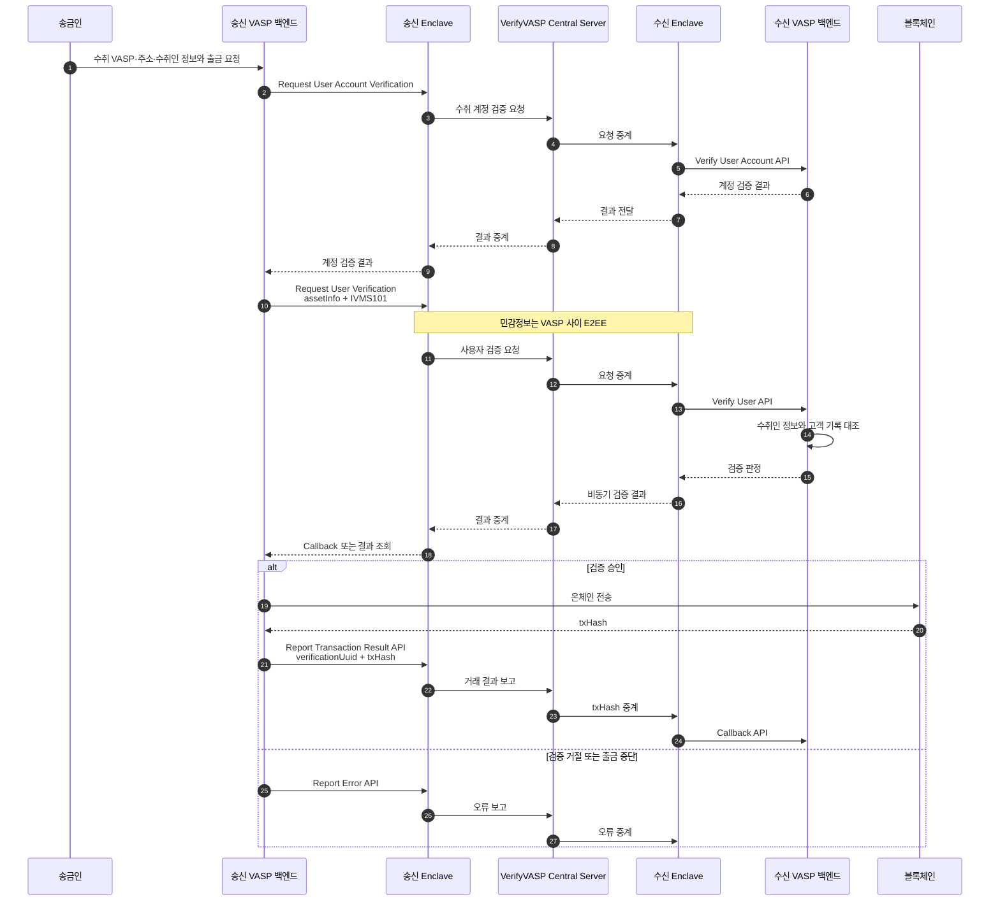
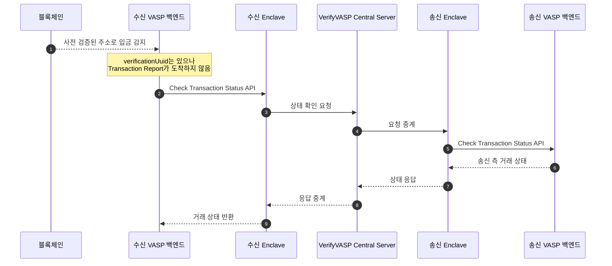

VerifyVASP의 TravelRule은 각 {{VASP::Virtual Asset Service Provider — 가상자산사업자}} 인프라에 {{Enclave::VerifyVASP가 VASP 내부에 설치하는 암복호화·통신 모듈}}와 전용 DB를 설치하고 중앙 서버를 중계자로 사용하는 구조다.
이 문서는 2026-08-07에 확보한 VerifyVASP 공식 개발자 문서만 근거로 작성했다.

## 한눈에 보기

| 항목 | 공식 문서에서 확인한 내용 |
|---|---|
| 제품 | VerifyVASP TravelRule protocol |
| 배포 | VASP 내부 Docker Enclave + 전용 DB |
| 중앙 구성요소 | VerifyVASP Central Server — VASP 간 요청·응답 중계 |
| 개인정보 | VASP 간 {{E2EE::End-to-End Encryption — 송신자와 수신자만 내용을 해독할 수 있는 종단간 암호화}}, 중앙 서버는 복호화하거나 저장하지 않음 |
| 키 | Enclave가 비대칭 키를 생성·저장·교체, private key는 Enclave 밖으로 나가지 않음 |
| 출금 | 수취 계정·사용자 검증 → 온체인 전송 → {{TxHash::Transaction Hash — 블록체인 거래를 식별하는 해시 값}} 보고 |
| 테스트 | Robot VASP를 이용한 입출금 시나리오 테스트 제공 |
| 조사 기준일 | 2026-08-07 |

## 무엇인가

VerifyVASP 공식 문서는 TravelRule 통신의 모든 요청과 응답이 VerifyVASP Central Server를 거쳐 전달된다고 설명한다. 송신 측은 Ordering VASP, 수신 측은 Beneficiary VASP가 되며 거래 방향에 따라 역할이 바뀐다. ([VV-ARCH-001](https://docs.verifyvasp.com/reference/travelrule-overview), §Architecture Overview)

각 VASP는 미리 만들어진 **Enclave 서버 모듈**과 전용 DB를 자기 인프라에 설치한다. VASP 백엔드는 Enclave API를 호출하고 Central Server API를 직접 호출하지 않는다. Enclave는 AWS ECR에서 Docker 이미지로 배포된다. ([VV-ARCH-001](https://docs.verifyvasp.com/reference/travelrule-overview), §Enclave Installation and Integration · [VV-OPS-001](https://docs.verifyvasp.com/reference/travelrule-enclave-setup), Step 1)

## 출금 흐름

공식 Overview의 TravelRule 검증 흐름은 다음 순서다. ([VV-ARCH-001](https://docs.verifyvasp.com/reference/travelrule-overview), §TravelRule Verification Process)

1. 송신 VASP가 송금인과 수취인 정보를 수집한다.
2. 송신 VASP의 Enclave가 수신 VASP로 검증 요청을 보낸다.
3. 수신 VASP가 자기 고객 기록과 수취인 정보를 대조한다.
4. 검증 결과가 비동기로 송신 VASP에 돌아온다.
5. 검증이 유효하면 송신 VASP가 온체인 출금을 실행한다.
6. 송신 VASP가 실행된 거래의 TxHash를 수신 VASP에 보고한다.

주소 소유와 수취인 신원 검증은 자산 전송 전에 수행된다. 출금이 중단되면 `Report Error API`, 실행되면 `Report Transaction Result API`로 상대에게 결과를 전달한다. ([VV-FLOW-001](https://docs.verifyvasp.com/reference/travelrule-scenarios-and-flows), §Best Practice)

## 입금과 사전 보고 누락

수신 VASP는 TxHash 보고를 받아 verification UUID와 거래를 연결한다. 온체인 입금을 발견했지만 해당 거래 보고를 받지 못했다면, Enclave의 `Check Transaction Status API`를 호출해 송신 VASP 쪽 상태를 확인하는 흐름이 공식 시나리오에 포함된다. ([VV-FLOW-001](https://docs.verifyvasp.com/reference/travelrule-scenarios-and-flows), §Exception: Missing Transaction Report)

이 절에서 확인된 탐색 키는 **verification UUID**다. {{TXID::Transaction ID — 블록체인에 기록된 거래를 식별하는 값}}만으로 사전 검증 기록이 없는 송신 VASP를 역탐색하는 기능은 수집한 공식 문서에서 확인하지 못했다.

## VASP가 구현할 표면

VASP 백엔드는 Enclave가 호출할 네 개의 핵심 API와 DB 관리용 보조 API 하나를 구현한다. ([VV-API-001](https://docs.verifyvasp.com/reference/travelrule-api-implementation), §Required VASP APIs)

| API | 역할 |
|---|---|
| Verify User Account API | 주소·계정 소유 관계 확인 |
| Verify User API | 수취인 정보 확인 |
| Check Transaction Status API | 거래 처리 상태 확인 |
| Callback API | 비동기 결과·보고 수신 |
| Database Management API | Enclave DB 복호화 키 관리 보조 |

VASP 백엔드가 호출하는 Enclave 쪽에는 VASP 조회, 계정·사용자 검증, 결과 조회, 거래 결과·오류 보고, 거래 상태 확인 API가 따로 있다. 공식 문서는 Chainalysis Sanction·{{KYT::Know Your Transaction — 거래 흐름과 위험을 분석하는 절차}}와 Refinitiv WCO 위험평가 인터페이스도 목록에 포함한다. ([VV-OPS-001](https://docs.verifyvasp.com/reference/travelrule-enclave-setup), §Step 3)

## 개인정보와 키

{{IVMS101::InterVASP Messaging Standard 101 — 트래블룰 당사자 정보를 교환하기 위한 데이터 표준}} 표준 정본과 VerifyVASP가 실제로 사용하는 필드명·확장·필수 조건의 차이는 [IVMS101 전체 교환 데이터 필드](04-ivms101-data.md)에 별도로 보존했다. 표준 정의는 InterVASP 원문을, 제품 payload는 VerifyVASP API 문서를 기준으로 한다. ([InterVASP](https://www.intervasp.org/), [VV-IVMS-001](https://docs-kr.verifyvasp.com/reference/ivms101/ivms101))

민감정보는 VASP 사이에서 E2EE로 전달된다. 공식 문서에 따르면 Central Server는 이를 복호화하거나 저장하지 않으며, 송신·수신 VASP만 해독할 수 있다. ([VV-ARCH-001](https://docs.verifyvasp.com/reference/travelrule-overview), §Security Considerations)

각 Enclave는 비대칭 키 쌍을 만들고 private key를 전용 DB에 저장한다. private key는 Enclave 밖으로 나가지 않고, 생성·저장·교체는 Enclave 안에서 자동 처리된다. 공개키 운용 단위는 `PerVasp`, `PerAddress`, `PerVerification` 중 선택할 수 있다. ([VV-ARCH-001](https://docs.verifyvasp.com/reference/travelrule-overview), §End-to-End Encryption · §Public Key Types)

전용 DB는 검증 정보와 키·위험평가 결과를 보관한다. 공식 DB 설정 문서는 저장 용량 산정과 백업·복구 정책을 VASP 책임으로 두며, 일부 개인정보 필드와 private key가 암호화 필드임을 명시한다. ([VV-DATA-001](https://docs.verifyvasp.com/reference/travelrule-database-setup), §Database Requirements)

## 배포와 운영

- Enclave의 공개 주소는 Central Server가 접근할 수 있는 HTTPS 주소여야 한다.
- VASP는 Enclave의 public IP를 VerifyVASP에 전달하고, Central Server에서 오는 인바운드 트래픽을 방화벽에서 허용해야 한다.
- 운영·스테이징과 한국·글로벌 환경에 서로 다른 Central API endpoint가 제공된다.
- 계획된 서버 점검은 최소 1주 전에 VerifyVASP 운영팀에 통지하도록 공식 운영 지침이 요구한다.
  ([VV-OPS-001](https://docs.verifyvasp.com/reference/travelrule-enclave-setup), Step 2 · [VV-OPS-002](https://docs.verifyvasp.com/reference/travelrule-maintenance), §Advance Notice)

오래된 검증 데이터 자동 삭제는 **기본 비활성화된 opt-in 기능**이다. `VEGA_VERIFICATION_RETENTION_DAYS`를 설정하면 Enclave가 매시간 오래된 verification과 연관 위험평가 결과를 배치 삭제한다. 삭제 전 법정 보존기간과 백업을 확인해야 하며, 삭제된 데이터는 복구되지 않는다고 문서가 경고한다. ([VV-OPS-002](https://docs.verifyvasp.com/reference/travelrule-maintenance), §Data Retention)

## Fireblocks와의 관계

이번에 수집한 VerifyVASP 공식 원문에는 Fireblocks 직접 통합 방식이 설명되어 있지 않다. 따라서 Fireblocks 안에서 provider로 선택 가능한지, 별도 컴플라이언스 게이트로 병행해야 하는지는 **미확정**으로 둔다.

## 확인된 제약

- Enclave와 전용 DB를 VASP 인프라에서 운영해야 한다.
- Central Server가 접근할 공개 HTTPS endpoint와 방화벽 구성이 필요하다.
- VASP 백엔드가 수신 API 네 개와 DB 관리 API를 구현해야 한다.
- 데이터 삭제 기능은 기본값으로 켜지지 않으므로 보존 정책을 직접 설정해야 한다.
- UUID가 없는 미확인 입금을 TXID만으로 역추적하는 경로는 확보한 원문에서 확인하지 못했다.

## 우리 설계와의 접점

우리 설계에서 필요한 상대 VASP 조회, 수취 계정 확인, 수취인 확인, 비동기 callback, 거래 결과 보고에 대응하는 공식 API 표면이 존재한다. 실제 배치는 [VerifyVASP 병행 게이트](../../트래블룰/설계/06-verifyvasp-parallel-gate.md)와 [국내 연동 준비](../../트래블룰/설계/13-domestic-network-setup.md)에 분리되어 있다.

이 문서는 해당 배치를 채택한다는 결론을 내리지 않는다.

## 확인 필요

- Fireblocks와 VerifyVASP의 현재 공식 직접 연동 여부
- Enclave {{HA::High Availability — 장애에도 서비스를 지속하도록 구성하는 고가용성}}·권장 인스턴스·처리량·rate limit·{{SLA::Service Level Agreement — 가용성·응답시간 등 서비스 수준에 관한 협약}}
- 계약 가격과 과금 기준
- verification UUID가 없는 미확인 입금의 TXID 역추적 방법
- CODE 상호연동 경로에서 주소 확인·원화 임계·미확인 입금 기능이 모두 유지되는지
- VASP DB 백업본의 암호화와 키 분리 운영에 대한 계약상 요구

## Sources

| ID | 공식 원문 | 확인한 내용 | 로컬 스냅샷 |
|---|---|---|---|
| VV-ARCH-001 | [Overview](https://docs.verifyvasp.com/reference/travelrule-overview) | 중앙 중계·Enclave·E2EE·키·전체 흐름 | `verifyvasp/2026-08-07__travelrule-overview.md` |
| VV-ARCH-002 | [To-Be Architecture](https://docs.verifyvasp.com/reference/travelrule-to-be-architecture) | VASP 구현 범위 | `verifyvasp/2026-08-07__to-be-architecture.md` |
| VV-API-001 | [VASP API Implementation](https://docs.verifyvasp.com/reference/travelrule-api-implementation) | 수신 API 4개 + DB 관리 API | `verifyvasp/2026-08-07__api-implementation.md` |
| VV-DATA-001 | [Database Setup](https://docs.verifyvasp.com/reference/travelrule-database-setup) | 전용 DB·암호화 필드·백업 | `verifyvasp/2026-08-07__database-setup.md` |
| VV-OPS-001 | [Enclave Setup](https://docs.verifyvasp.com/reference/travelrule-enclave-setup) | Docker·endpoint·방화벽·API 목록 | `verifyvasp/2026-08-07__enclave-setup.md` |
| VV-FLOW-001 | [Scenarios and Flows](https://docs.verifyvasp.com/reference/travelrule-scenarios-and-flows) | 출금·입금·예외 흐름 | `verifyvasp/2026-08-07__scenarios-and-flows.md` |
| VV-OPS-002 | [Operations](https://docs.verifyvasp.com/reference/travelrule-maintenance) | 점검 통지·데이터 retention | `verifyvasp/2026-08-07__operations.md` |
| VV-IVMS-001 | [IVMS101 포맷 정의](https://docs-kr.verifyvasp.com/reference/ivms101/ivms101) | VerifyVASP 구현 필드명·확장·필수 조건·처리 범위 | `verifyvasp/2026-08-07__ivms101-ko.md` |

전체 URL과 SHA-256: `blockchain-manager/sources/travel-rule-solutions/verifyvasp/manifest.yml`

## Related

- [조사 범위와 비교 기준](00-overview.md)
- [IVMS101 전체 교환 데이터 필드](04-ivms101-data.md)
- [CODE](02-code.md)
- [Notabene](03-notabene.md)
- [VerifyVASP 병행 게이트](../../트래블룰/설계/06-verifyvasp-parallel-gate.md)
