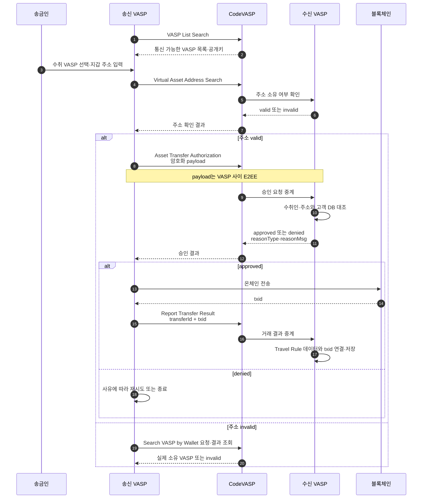
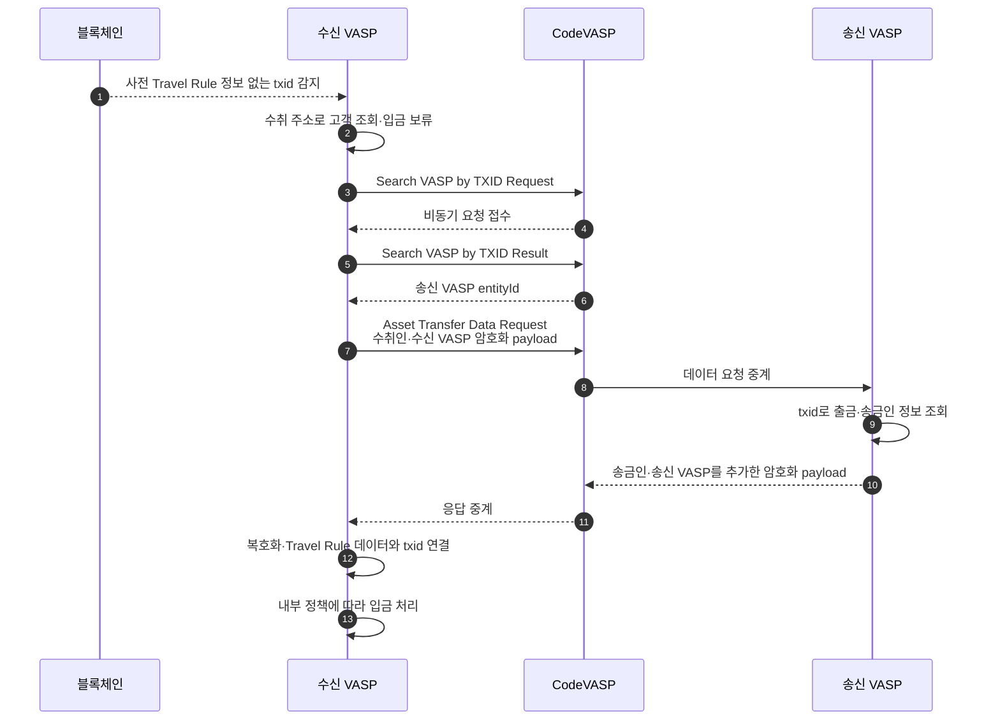

CODE는 {{VASP::Virtual Asset Service Provider — 가상자산사업자}} 간 사전 승인과 전송 결과 보고뿐 아니라, 사전 정보 없이 도착한 거래를 {{TXID::Transaction ID — 블록체인에 기록된 거래를 식별하는 값}}로 역추적하는 API 흐름을 공식 제공한다.
이 문서는 2026-08-07에 확보한 CodeVASP 공식 영문 개발자 문서만 근거로 작성했다.

## 한눈에 보기

| 항목 | 공식 문서에서 확인한 내용 |
|---|---|
| 운영 성격 | 빗썸·코인원·코빗이 만든 Travel Rule protocol·alliance |
| 통합 | CodeVASP Request/Response API |
| 암호화 | VASP 간 payload {{E2EE::End-to-End Encryption — 송신자와 수신자만 내용을 해독할 수 있는 종단간 암호화}}, 모든 요청에 signature 필요 |
| 선택 모듈 | VASP 내부에 설치하는 Docker 기반 CodeVASP-Cipher |
| 출금 | 주소 확인 → 정보 교환·승인 → 온체인 실행 → TXID 보고 |
| 미확인 입금 | TXID로 송신 VASP 탐색 → 송금인 정보 요청 |
| 상호운용 | 공식 문서에 VerifyVASP·GTR·Sygna 연동 표기 |
| 조사 기준일 | 2026-08-07 |

## 무엇인가

CodeVASP 공식 문서는 CODE를 빗썸·코인원·코빗이 만든 트래블룰 프로토콜로 설명한다. 공식 API 소개는 통신을 **사전 검증**과 **사후 검증** 두 흐름으로 나눈다. ([CODE-IDX-001](https://docs.codevasp.com/en), §Introduction · [CODE-API-001](https://docs.codevasp.com/en/docs/travel-rule/api-reference/01-Intro/01-CodeVASP-Introduction), §Workflow)

사전 검증은 온체인 전송 전에 수취인 정보와 주소를 확인하고 자산 전송 승인을 받는다. 사후 검증은 사전 정보 없이 이미 실행된 거래의 TXID로 송신 VASP를 찾고 필요한 정보를 다시 교환한다. ([CODE-API-001](https://docs.codevasp.com/en/docs/travel-rule/api-reference/01-Intro/01-CodeVASP-Introduction), §Flow 1·2)

## 출금 흐름

공식 Standard 시나리오는 다음 순서다. ([CODE-FLOW-001](https://docs.codevasp.com/en/docs/travel-rule/guides/01-General/02-Communication-Scenarios), §Standard)

1. `VASP List Search`로 통신 후보를 조회한다.
2. `Virtual Asset Address Search`로 사용자가 고른 VASP가 해당 주소를 소유하는지 확인한다.
3. `Asset Transfer Authorization`으로 암호화한 송금인·수취인 정보를 보내 승인을 받는다.
4. 승인 후 온체인 거래를 실행한다.
5. `Report Transfer Result`로 TXID를 수신 VASP에 보낸다.
6. 수신 VASP는 travel rule 데이터와 TXID를 `transferId`로 연결해 저장한다.

주소가 선택한 VASP의 것이 아니면 비동기 `Search VASP by Wallet`을 fallback으로 사용할 수 있다. 승인 거절 시 `reasonType`과 `reasonMsg`를 확인하고, 재시도할 수 없는 사유면 흐름을 종료한다. ([CODE-FLOW-001](https://docs.codevasp.com/en/docs/travel-rule/guides/01-General/02-Communication-Scenarios), §Wallet Address Verification · §Authorization Denied)

## 입금과 TXID 역추적

수신 VASP가 온체인 입금을 발견했지만 연결할 travel rule 데이터가 없으면 다음 공식 API 흐름을 사용할 수 있다. ([CODE-API-001](https://docs.codevasp.com/en/docs/travel-rule/api-reference/01-Intro/01-CodeVASP-Introduction), §Flow 2)

1. `Search VASP by TXID Request`로 송신 VASP 탐색을 시작한다.
2. `Search VASP by TXID Result`로 비동기 결과를 조회한다.
3. 송신 VASP를 찾으면 `Asset Transfer Data Request`로 이미 완료된 거래의 사용자 정보를 교환한다.
4. 수신 VASP가 travel rule 데이터와 거래를 연결한 뒤 입금을 처리한다.

TXID 보고가 늦는 정상 흐름에는 `Transaction Status Search`, 거래가 실패하거나 중단된 경우에는 `Finish Transfer`가 따로 있다. ([CODE-FLOW-001](https://docs.codevasp.com/en/docs/travel-rule/guides/01-General/02-Communication-Scenarios), §Asset Transfer Result Report)

## API 표면

공식 소개 문서에 열거된 주요 API는 다음과 같다. ([CODE-API-001](https://docs.codevasp.com/en/docs/travel-rule/api-reference/01-Intro/01-CodeVASP-Introduction), §CodeVASP APIs)

| 기능 | API |
|---|---|
| 상대 목록·키 | VASP List Search · Public Key Search |
| 주소 기반 상대 탐색 | Search VASP by Wallet Request/Result |
| 사전 확인 | Virtual Asset Address Search · Asset Transfer Authorization |
| 결과·상태 | Report Transfer Result · Transaction Status Search · Finish Transfer |
| 미확인 입금 | Search VASP by TXID Request/Result · Asset Transfer Data Request |

## 개인정보와 암호화

CodeVASP 공식 문서는 송신 VASP → CodeVASP → 수신 VASP 구간의 개인정보 payload가 E2EE로 보호되며, CodeVASP가 암호화된 개인정보에 접근하거나 처리할 수 없다고 설명한다. 모든 요청에는 signature가 필요하다. ([CODE-FLOW-001](https://docs.codevasp.com/en/docs/travel-rule/guides/01-General/02-Communication-Scenarios), §Encrypted Communication · [CODE-SEC-001](https://docs.codevasp.com/en/docs/travel-rule/guides/02-Development/02-Encryption-Decryption), §By APIs)

암호화는 두 방식 중 하나를 선택한다.

- CodeVASP가 제공하는 Cipher 모듈 사용
- 공식 샘플을 참고해 VASP가 직접 구현

공식 알고리즘 표기는 key exchange X25519, encryption XSalsa20, authentication Poly1305이며 libsodium을 권장한다. ([CODE-SEC-001](https://docs.codevasp.com/en/docs/travel-rule/guides/02-Development/02-Encryption-Decryption), §Algorithm)

## CodeVASP-Cipher

Cipher는 암복호화·signature 생성·{{IVMS101::InterVASP Messaging Standard 101 — 트래블룰 당사자 정보를 교환하기 위한 데이터 표준}} payload 생성을 수행하는 Docker 모듈이다. VASP 인프라 안에 배포할 수 있고, 공식 문서는 이 모듈이 CodeVASP 서버로 데이터를 보내거나 데이터를 저장하지 않는다고 명시한다. ([CODE-SEC-002](https://docs.codevasp.com/en/docs/travel-rule/guides/02-Development/11-CodeVASP-Cipher-Server-Module-Guide), §Introduction)

문서에 적힌 최소 요구사항은 Linux 64-bit, 1 vCPU, 메모리 2GB, 저장공간 8GB다. Swagger, Prometheus endpoint, build version endpoint도 제공된다. 이는 공식 문서의 최소값이며 운영 용량 산정치가 아니다. ([CODE-SEC-002](https://docs.codevasp.com/en/docs/travel-rule/guides/02-Development/11-CodeVASP-Cipher-Server-Module-Guide), §System Requirements)

## 온보딩과 실제 연결

공식 온보딩은 세 단계로 설명된다. ([CODE-ONB-001](https://docs.codevasp.com/en/docs/travel-rule/guides/01-General/01-Integration-Process))

1. CodeVASP 자체 DD
2. API 연동·개발환경 송수신 테스트·체크리스트·운영 배포
3. 회원 VASP의 내부 심사

기술 연동을 마쳤다고 모든 회원과 실제 거래가 열리는 것은 아니다. 각 회원 VASP가 AML/CFT 위험, 사업 조건, 개발 준비도와 운영 안정성을 별도로 검토할 수 있으며 연결 여부와 시점은 그 결과에 따라 정해진다.

## 다른 프로토콜과의 상호운용

CODE 공식 문서는 VerifyVASP·GTR·Sygna와 연동되어 있다고 표기한다. 다만 대시보드와 `VASP List Search`에 보이는 것은 기술 연동이고 실제 거래 가능 여부는 내부 정책에 따라 다를 수 있다고 같은 문서에서 구분한다. ([CODE-INT-001](https://docs.codevasp.com/en/docs/travel-rule/guides/02-Development/12-Interoperability-with-Other-Protocols), §Check the VASP List · §Integration Process)

또한 VerifyVASP 연동 거래소는 한국 국내 거래만 지원하며 해외 거래는 불가능하다고 CODE 공식 문서가 명시한다. GTR·Sygna 경로는 provider에 따라 필수 필드가 달라진다. ([CODE-INT-001](https://docs.codevasp.com/en/docs/travel-rule/guides/02-Development/12-Interoperability-with-Other-Protocols), §Invocation Method)

## Fireblocks와의 관계

이번에 수집한 CODE 공식 원문에는 Fireblocks 직접 통합 방식이 설명되어 있지 않다. Fireblocks provider로 직접 연결되는지, 별도 CODE API adapter가 필요한지는 **미확정**으로 둔다.

## 확인된 제약

- 프로토콜 기술 연동과 개별 회원의 실제 정책 연동은 별개다.
- 개인정보가 든 API는 payload 암호화뿐 아니라 요청 signature도 구현해야 한다.
- Cipher를 쓰지 않으면 암복호화와 signature 생성을 직접 구현해야 한다.
- 상호운용 상대의 provider에 따라 필수 필드가 달라질 수 있다.
- VerifyVASP 상호운용은 CODE 공식 문서상 한국 국내 거래로 제한된다.

## 우리 설계와의 접점

사전 주소 확인·자산 전송 승인·결과 보고와 함께, 미확인 입금을 TXID로 역추적하는 공식 API가 존재한다. 우리 설계에서 이 흐름을 배치한 위치는 [국내 솔루션 흐름](../../트래블룰/설계/11-appendix-domestic-flows.md)이다.

이 문서는 CODE 직접 adapter를 채택한다는 결론을 내리지 않는다.

## 확인 필요

- Fireblocks와 CODE의 현재 공식 직접 연동 여부
- API rate limit·timeout·재시도·멱등성·{{SLA::Service Level Agreement — 가용성·응답시간 등 서비스 수준에 관한 협약}}
- Cipher 이미지 공급·업데이트·취약점 대응 절차
- 가격·과금 기준과 운영 지원 범위
- VerifyVASP 상호운용에서 원화 임계 필드와 TXID 역추적이 보존되는지
- {{Webhook::특정 이벤트가 발생했을 때 상대 서버로 결과를 전달하는 비동기 HTTP 알림}} 또는 callback 방식의 비동기 이벤트 제공 범위

## Sources

| ID | 공식 원문 | 확인한 내용 | 로컬 스냅샷 |
|---|---|---|---|
| CODE-IDX-001 | [Docs Introduction](https://docs.codevasp.com/en) | 제품 성격·문서 영역 | `code/2026-08-07__docs-index.md` |
| CODE-API-001 | [CodeVASP Introduction](https://docs.codevasp.com/en/docs/travel-rule/api-reference/01-Intro/01-CodeVASP-Introduction) | 사전·사후 흐름·API 목록 | `code/2026-08-07__introduction.md` |
| CODE-ONB-001 | [Integration Process](https://docs.codevasp.com/en/docs/travel-rule/guides/01-General/01-Integration-Process) | DD·개발·회원 심사 | `code/2026-08-07__integration-process.md` |
| CODE-FLOW-001 | [Communication Scenarios](https://docs.codevasp.com/en/docs/travel-rule/guides/01-General/02-Communication-Scenarios) | 출금·입금·E2EE·예외 | `code/2026-08-07__communication-scenarios.md` |
| CODE-FLOW-002 | [Transaction Flow](https://docs.codevasp.com/en/docs/travel-rule/guides/01-General/03-Transaction-Flow) | 상태 흐름 | `code/2026-08-07__transaction-flow.md` |
| CODE-SEC-001 | [Encryption/Decryption](https://docs.codevasp.com/en/docs/travel-rule/guides/02-Development/02-Encryption-Decryption) | 암호화·signature·알고리즘 | `code/2026-08-07__encryption-decryption.md` |
| CODE-SEC-002 | [Cipher Module](https://docs.codevasp.com/en/docs/travel-rule/guides/02-Development/11-CodeVASP-Cipher-Server-Module-Guide) | 설치·기능·요구사항 | `code/2026-08-07__cipher-server-module.md` |
| CODE-INT-001 | [Interoperability](https://docs.codevasp.com/en/docs/travel-rule/guides/02-Development/12-Interoperability-with-Other-Protocols) | VerifyVASP·GTR·Sygna 연결 범위 | `code/2026-08-07__interoperability.md` |

전체 URL과 SHA-256: `blockchain-manager/sources/travel-rule-solutions/code/manifest.yml`

## Related

- [조사 범위와 비교 기준](00-overview.md)
- [VerifyVASP](01-verifyvasp.md)
- [Notabene](03-notabene.md)
- [국내 솔루션 흐름](../../트래블룰/설계/11-appendix-domestic-flows.md)
