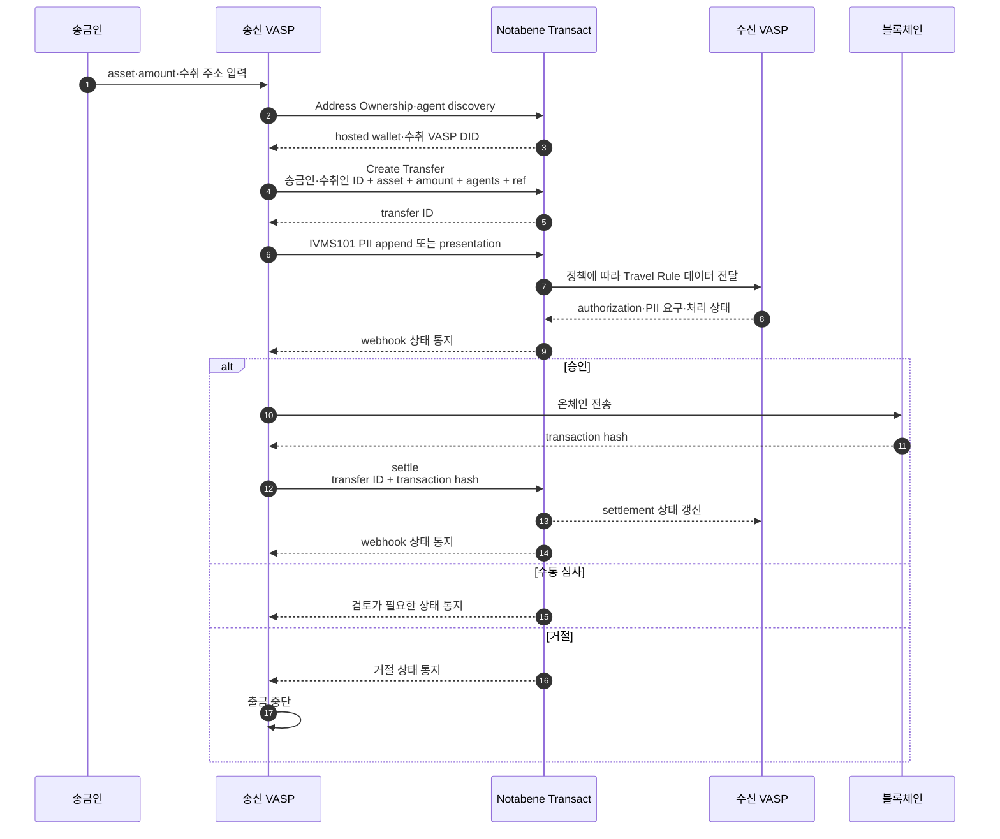
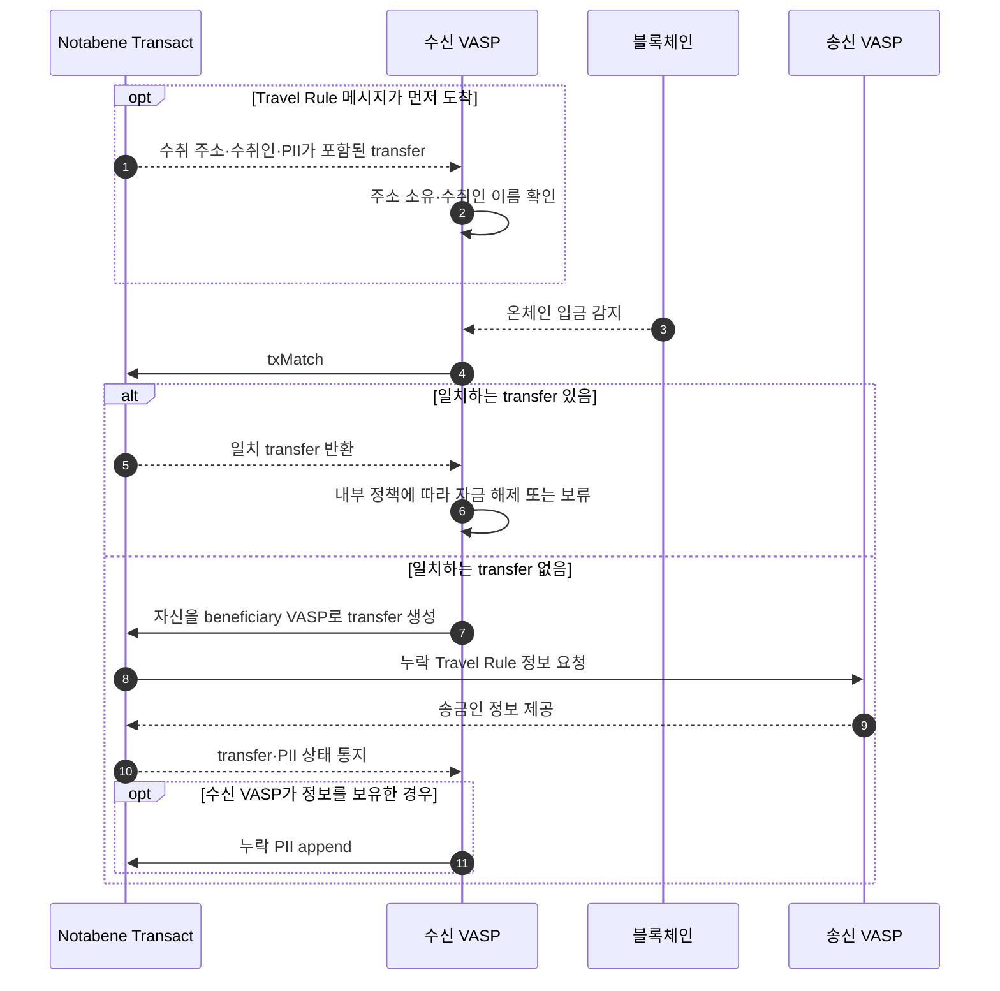

Notabene Transact는 전송 객체와 정책을 중심으로 트래블룰 데이터 수집·상대 탐색·{{PII::Personally Identifiable Information — 개인을 식별할 수 있는 정보}} 교환·상태 통지를 제공한다.
이 문서는 2026-08-07에 확보한 Notabene 공식 개발자 문서만 근거로 작성했다.

## 한눈에 보기

| 항목 | 공식 문서에서 확인한 내용 |
|---|---|
| 제품 | Notabene Transact |
| 통합 | REST API·Embedded Component·{{Webhook::특정 이벤트가 발생했을 때 상대 서버로 결과를 전달하는 비동기 HTTP 알림}} |
| 인증 | OAuth client credentials, EU·US node 구분 |
| 상대 탐색 | network discoverability·address book·blockchain analytics·manual selection |
| 개인정보 | 고객 관리 {{E2EE::End-to-End Encryption — 송신자와 수신자만 내용을 해독할 수 있는 종단간 암호화}} 또는 Notabene 관리 암호화·저장 중 선택 |
| 개인지갑 | hosted/unhosted 분기와 소유 증명 관계 지원 |
| Fireblocks | Notabene V1 직접 연동 공식 문서 존재 |
| 조사 기준일 | 2026-08-07 |

## 무엇인가

Notabene 공식 문서는 제품명을 **Notabene Transact**로 표기하고, 트래블룰에서 송금인과 수취인의 {{KYC::Know Your Customer — 고객 신원확인 절차}} 정보를 {{VASP::Virtual Asset Service Provider — 가상자산사업자}} 사이에 교환하는 과정을 자동화한다고 설명한다. 교환 데이터 모델은 {{IVMS101::InterVASP Messaging Standard 101 — 트래블룰 당사자 정보를 교환하기 위한 데이터 표준}}을 사용한다. ([NB-INTRO-001](https://devx.notabene.id/docs/welcome), §What is Notabene Transact · §IVMS101)

공식 흐름 문서는 자체 UI를 쓰는 API 방식과 Notabene Embedded Component를 사용하는 방식을 모두 제공한다. 고객이 출금 정보를 입력하면 상대 지갑의 유형과 수취인에게 필요한 필드를 수집하고, 내부 KYC 데이터와 합쳐 전송 메시지를 만든다. ([NB-FLOW-001](https://devx.notabene.id/docs/flow-diagrams-v2), §Withdrawals)

## 출금 흐름

공식 문서에서 확인되는 기본 흐름은 다음과 같다. ([NB-FLOW-001](https://devx.notabene.id/docs/flow-diagrams-v2), §Creating a TR transfer)

1. 주소 소유 정보와 관할별 threshold·필수 PII를 확인한다.
2. hosted wallet이면 상대 VASP를 찾고 `vaspDID`({{DID::Decentralized Identifier — 중앙 등록기관에 의존하지 않는 분산 식별자}})를 전송 객체에 넣는다.
3. transfer를 생성하고 PII를 append 또는 present한다.
4. policy engine이 자동 전송·수동 심사·거절 중 하나를 결정한다.
5. webhook으로 authorization·PII·상태 변화를 받는다.
6. 온체인 거래가 실행되면 settle 호출로 transaction hash를 메시지에 연결한다.

hosted wallet 출금의 전송 생성 endpoint는 `POST /entity/:entityDID/tx`다. 상대를 직접 지정하지 않으면 agent discovery가 수행되고, 기본 TAP 정책이 설정돼 있으면 함께 적용된다. ([NB-FLOW-002](https://devx.notabene.id/docs/create-outgoing-transfers), §To hosted wallets)

## 입금과 메시지 대사

입금에는 travel rule 메시지가 먼저 온 경우와 메시지 없이 온 경우가 있다. 메시지가 있으면 주소 소유와 수취인 이름을 확인하고, 온체인 입금을 감지한 뒤 `txMatch`로 해당 메시지를 찾는다. 그 결과를 이용해 자금을 풀거나 추가 검사를 위해 보류한다. ([NB-FLOW-001](https://devx.notabene.id/docs/flow-diagrams-v2), §Deposit with travel rule)

일치하는 메시지가 없으면 자신을 beneficiary VASP로 두고 transfer를 만들어 송신 VASP에 정보를 요청하거나, 누락된 정보를 직접 append하는 흐름이 공식 문서에 제시된다. ([NB-FLOW-001](https://devx.notabene.id/docs/flow-diagrams-v2), §Deposit without travel rule)

## 상대 탐색과 개인지갑

Notabene 공식 문서는 hosted wallet 상대를 찾는 방법으로 다음 네 가지를 열거한다. ([NB-FLOW-002](https://devx.notabene.id/docs/create-outgoing-transfers), §Agent discovery)

- Network Discoverability
- Address book
- Blockchain analytics query
- Manual selection

unhosted wallet은 settlement address의 `for`를 beneficiary에 연결하고 소유 증명을 관계로 관리한다. 문서에 나온 증명 방식은 signature, self-declaration, microtransfer, screenshot이며, 이 중 signature proof만 관계 상태를 `PROVEN`으로 올린다고 명시한다. 다른 방식은 `CONFIRMED`다. ([NB-FLOW-002](https://devx.notabene.id/docs/create-outgoing-transfers), §To unhosted wallets)

## 인증과 webhook

API 인증은 client ID와 client secret으로 access token을 발급받는 OAuth client credentials 방식이다. EU와 US node의 인증 URL과 API audience가 분리되어 있고, 공식 문서의 access token 유효시간은 24시간이다. ([NB-AUTH-001](https://devx.notabene.id/docs/authentication), §Generating your accessToken)

Notabene는 webhook 전송에 Svix를 사용한다. transfer lifecycle과 TAP 관련 이벤트를 push하며, payload에는 message type·payload·version이 들어간다. Svix signature 검증, 지역별 source IP allowlist, 추가 인증, 2xx가 아닌 경우 exponential backoff 재시도가 공식 문서에 설명되어 있다. webhook을 쓸 수 없을 때의 polling endpoint도 제공된다. ([NB-WEBHOOK-001](https://devx.notabene.id/docs/webhook-flow), §Security · §Retry/Failure · §Polling endpoints)

## 개인정보 처리 방식 둘

Notabene 공식 문서는 PII 제출 방식을 둘로 구분한다.

### 고객이 암호화 관리

고객이 직접 암호화한 IVMS101 payload를 상대에게 E2EE로 전달한다. 이 경로의 데이터는 고객 entity나 Notabene platform에 저장되지 않는다고 문서가 명시한다. ([NB-SEC-001](https://devx.notabene.id/docs/self-encryption), §Direct Forwarding)

### Notabene가 암호화 관리

`txAppend`로 PII를 보내면 Notabene가 고객 entity의 key로 암호화해 platform에 저장하고, 조건이 맞으면 요청 상대에게 재암호화해 전달한다. 송신자가 만든 PII는 originator·beneficiary ID를 함께 넣었을 때 재사용할 수 있지만, 수신한 PII는 재사용하지 않는다. ([NB-SEC-002](https://devx.notabene.id/docs/encryption-by-notabene), §PII Re-use Conditions)

두 방식은 데이터 보관 경계가 다르므로 도입 전에 하나로 확정해야 한다. 이 문서는 어느 방식을 선택할지 판단하지 않는다.

## Fireblocks 직접 연동

Notabene 공식 문서는 Fireblocks workspace와 API에 Notabene를 직접 통합한 구성을 설명하며, 현재 연동 버전을 **Notabene V1**으로 표기한다. ([NB-FB-001](https://devx.notabene.id/docs/using-notabene-and-fireblocks), §Integration Overview)

Fireblocks가 구현했다고 문서에 적힌 범위는 다음과 같다.

- 출금 travel rule 데이터를 Notabene로 전달
- 메시지가 자금 전송 가능한 상태에 도달했을 때 감지하는 webhook 구성
- blockchain transaction hash로 메시지 갱신
- 입금 주소 소유 확인
- travel rule 메시지 없는 입금 감지·처리

VASP는 출금 화면의 데이터 수집·검증, Notabene PII SDK를 통한 암호화, Fireblocks SDK/API 거래에 암호화 PII를 append하는 일을 구현한다. 입금에 메시지가 없을 때의 추가 데이터 수집은 관할 요건에 따라 선택 사항으로 설명된다. ([NB-FB-001](https://devx.notabene.id/docs/using-notabene-and-fireblocks), §What has Fireblocks implemented · §What has to be implemented)

Notabene와 Fireblocks를 별도로 호출하는 구성도 가능하다. 이때 Notabene에서 positive status를 받은 뒤 Fireblocks 거래를 시작하며, 직접 통합보다 구현 범위가 늘어난다. ([NB-FB-001](https://devx.notabene.id/docs/using-notabene-and-fireblocks), §Using Separately)

## 확인된 제약

- Fireblocks 직접 연동은 공식 문서상 Notabene V1이다.
- Fireblocks Python SDK는 필요한 기능 일부만 제공하며 빈 부분을 Notabene API로 채워야 한다고 공식 문서가 밝힌다.
- webhook 인프라는 Svix의 보안·전달 체계를 함께 의존한다.
- 고객 관리 E2EE와 Notabene 관리 암호화는 데이터 저장 경계가 다르다.
- agent discovery 결과만으로 상대와 실제 거래가 가능하다고 단정할 수 있는 근거는 수집한 문서에 없다.

## 우리 설계와의 접점

Fireblocks 직접 연동과 별도 연동이 모두 공식 문서에 구분되어 있어, 벤더 안에서 판정하는 흐름과 우리 게이트가 먼저 판정하는 흐름을 각각 검증할 수 있다. 기존 배치는 [Notabene 병행 게이트](../../트래블룰/설계/06-verifyvasp-parallel-gate.md)와 [시나리오](../../트래블룰/설계/07-scenarios.md)에 있다.

이 문서는 어느 연동 방식을 채택할지 결론 내리지 않는다.

## 확인 필요

- Notabene V1 이후 버전과 Fireblocks의 업그레이드 일정
- VerifyVASP·CODE·GTR 각 네트워크에 대한 현재 실운영 도달성
- webhook 보존기간·최대 재시도 기간·재전송 API의 계약 조건
- EU·US node별 데이터 residency와 국내 개인정보 국외 이전 조건
- 고객 관리 E2EE에서 상대별 key discovery·rotation·복구 절차
- 가격·과금 기준·{{SLA::Service Level Agreement — 가용성·응답시간 등 서비스 수준에 관한 협약}}·{{RPO::Recovery Point Objective — 장애 후 허용 가능한 데이터 손실 시점}}·{{RTO::Recovery Time Objective — 장애 후 서비스를 복구해야 하는 목표 시간}}

## Sources

| ID | 공식 원문 | 확인한 내용 | 로컬 스냅샷 |
|---|---|---|---|
| NB-INTRO-001 | [Introduction](https://devx.notabene.id/docs/welcome) | 제품 성격·IVMS101 | `notabene/2026-08-07__welcome.md` |
| NB-FLOW-001 | [Flow Diagrams](https://devx.notabene.id/docs/flow-diagrams-v2) | 출금·입금·대사 흐름 | `notabene/2026-08-07__flow-diagrams-v2.md` |
| NB-FLOW-002 | [Create Outgoing Transfers](https://devx.notabene.id/docs/create-outgoing-transfers) | 상대 탐색·hosted/unhosted | `notabene/2026-08-07__create-outgoing-transfers.md` |
| NB-AUTH-001 | [Authentication](https://devx.notabene.id/docs/authentication) | OAuth·지역 endpoint·token | `notabene/2026-08-07__authentication.md` |
| NB-WEBHOOK-001 | [Webhooks](https://devx.notabene.id/docs/webhook-flow) | Svix·signature·retry·polling | `notabene/2026-08-07__webhook-flow.md` |
| NB-SEC-001 | [Customer-managed Encryption](https://devx.notabene.id/docs/self-encryption) | E2EE direct forwarding | `notabene/2026-08-07__self-encryption.md` |
| NB-SEC-002 | [Notabene-managed Encryption](https://devx.notabene.id/docs/encryption-by-notabene) | 암호화 저장·PII 재사용 | `notabene/2026-08-07__encryption-by-notabene.md` |
| NB-FB-001 | [Fireblocks Integration](https://devx.notabene.id/docs/using-notabene-and-fireblocks) | 직접·별도 연동과 책임 경계 | `notabene/2026-08-07__using-notabene-and-fireblocks.md` |

전체 URL과 SHA-256: `blockchain-manager/sources/travel-rule-solutions/notabene/manifest.yml`

## Related

- [조사 범위와 비교 기준](00-overview.md)
- [VerifyVASP](01-verifyvasp.md)
- [CODE](02-code.md)
- [트래블룰 시나리오](../../트래블룰/설계/07-scenarios.md)
