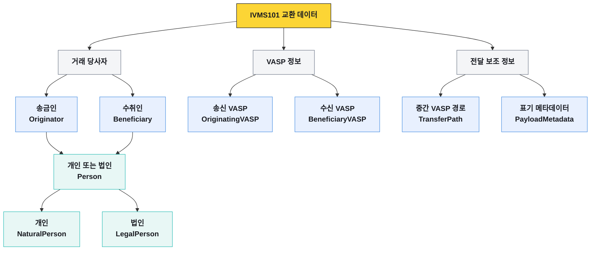
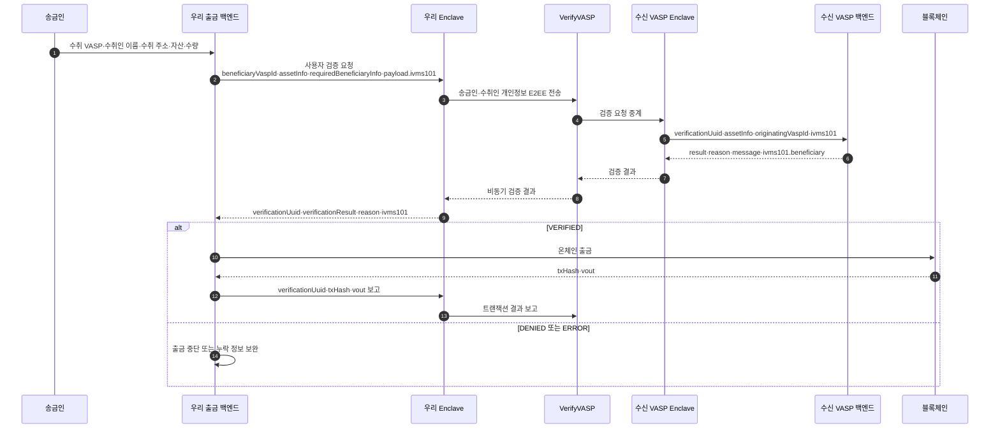
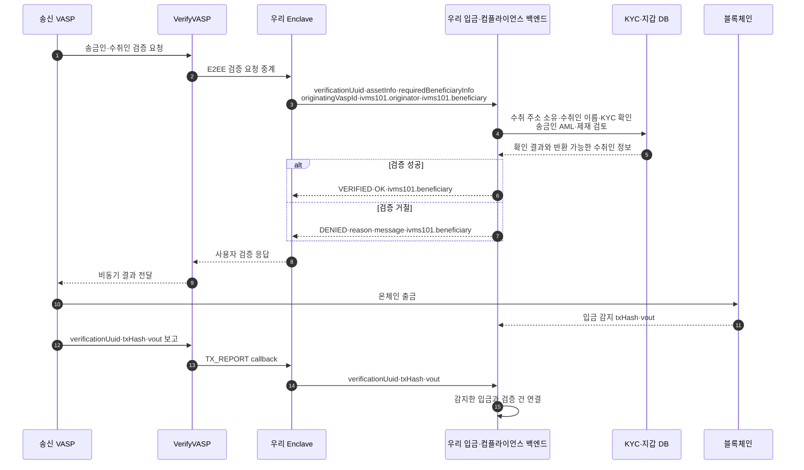

{{IVMS101::InterVASP Messaging Standard 101 — 트래블룰 당사자 정보를 교환하기 위한 데이터 표준}} 표준의 정본은 InterVASP가 배포한 **IVMS101.2023 Issue 1 FINAL**이다. 이 문서는 정본의 필드명·다중성·제약과 VerifyVASP가 실제 API에 적용한 필드명을 분리해서 기록한다.

> **읽을 때 주의:** `originatorPerson`, `Person.accountNumber`, `payloadVersion`은 InterVASP 정본 표기다. `originatorPersons`, `Originator.accountNumber`, `nationality`는 VerifyVASP 구현 표기 또는 확장이다. 둘을 같은 스키마로 보아서는 안 된다.

## 먼저 보는 전체 구조

IVMS101은 필드 이름부터 외우는 문서가 아니다. 먼저 **누구의 어떤 정보가 들어가는지**를 고른 뒤, 해당 객체의 실제 필드로 내려가면 된다.

| 알고 싶은 내용 | 먼저 볼 객체 | 내려가는 순서 |
|---|---|---|
| 송금하는 개인·법인의 정보 | `Originator` | `originatorPerson[]` → `Person` → 개인 또는 법인 |
| 받는 개인·법인의 정보 | `Beneficiary` | `beneficiaryPerson[]` → `Person` → 개인 또는 법인 |
| 송금·수취 계정 식별자 | `Person` | 각 `Person`의 `accountNumber[]` |
| 개인 이름·주소·생년월일·식별번호 | `NaturalPerson` | `Person.naturalPerson` 아래의 해당 필드 |
| 법인명·주소·등록정보·식별번호 | `LegalPerson` | `Person.legalPerson` 아래의 해당 필드 |
| 송신·수신·중간 {{VASP::Virtual Asset Service Provider — 가상자산사업자}} 정보 | VASP 객체 | 각 VASP 객체 → `Person` |
| VerifyVASP API에 실제로 넣는 값 | User Verification 요청 | `payload.ivms101`과 `assetInfo` |

처음 읽는다면 `송금인과 수취인 → 개인 또는 법인 → 필요한 세부 정보` 순서로 보면 된다. 구현 중 특정 필드를 확인할 때는 왼쪽의 고정 목차에서 객체 이름을 선택한다.

## 출처와 버전

| 구분 | 원문 | 이 문서에서의 역할 |
|---|---|---|
| IVMS101 표준 정본 | [InterVASP 공식 사이트](https://www.intervasp.org/)의 [IVMS101.2023 Issue 1 FINAL PDF](https://cdn.prod.website-files.com/648841abc97f28489cc3f2ce/6656e9c60c3029989dcd7431_IVMS101.2023%20interVASP%20data%20model%20standard.pdf) | 표준 필드명·다중성·데이터 타입·제약의 기준 |
| VerifyVASP 구현 문서 | [VerifyVASP IVMS101 포맷 정의](https://docs-kr.verifyvasp.com/reference/ivms101/ivms101)와 API 문서 | VerifyVASP payload의 실제 직렬화 이름·필수값·확장 필드의 기준 |

InterVASP 공식 사이트는 현재 배포본을 `IVMS 101.2023`으로 표시하고, 2024-06-04 업데이트를 안내한다. 확인한 PDF는 57쪽이며 표지 제목은 `IVMS101.2023 interVASP data model standard Issue 1 FINAL`이다. 파일 SHA-256은 `64bb38bdfaf65c46b80bc214f59444b11229cc8d1f7124d74059a02d6cfa5de2`다.

### 표준과 VerifyVASP 구현의 주요 차이

| 의미 | InterVASP IVMS101.2023 정본 | VerifyVASP API·가이드 |
|---|---|---|
| 송금인 배열 | `Originator.originatorPerson[]` | `originator.originatorPersons[]` |
| 수취인 배열 | `Beneficiary.beneficiaryPerson[]` | `beneficiary.beneficiaryPersons[]` |
| 계정 식별자 | `Person.accountNumber[]` | `originator.accountNumber[]`, `beneficiary.accountNumber[]` |
| 국적 | 표준 `NaturalPerson`에 없음 | `NaturalPerson.nationality` 확장 필드 |
| 법인 설립일 | 표준 `LegalPerson`에 없음 | `LegalPerson.dateOfIncorporation` 확장 필드 |
| payload 버전 | `PayloadMetadata.payloadVersion` 필수 `[1..1]` | API envelope의 `payload.version`도 별도로 사용 |

이후 **IVMS101 데이터 모델** 절은 InterVASP 정본 표기를 사용한다. **VerifyVASP API에서 실제로 보내는 값** 절부터는 제품 API 표기를 그대로 사용한다.

## 문서의 범위와 필수 조건

이 문서는 InterVASP IVMS101.2023 정본의 데이터 모델과 VerifyVASP의 구현 payload를 함께 다루되, 어느 쪽의 필드인지 각 절에 표시한다. IVMS101은 당사자·VASP 개인정보 구조이고, `assetInfo`, `verificationUuid`, `transferId`, `txid`처럼 솔루션이 덧붙이는 거래·처리 필드는 IVMS101 자체에 포함되지 않는다.

필수 여부는 두 층으로 나뉜다.

- **스키마 필수** — 객체가 존재할 때 반드시 들어가야 하는 필드
- **업무 필수** — 관할 규정·거래 조건·상대 요청에 따라 실제 전송 시 요구되는 필드

아래 `필수`·`선택` 표기는 InterVASP 정본의 다중성을 따른다. VerifyVASP API 절의 표기는 해당 API 문서의 요청 조건을 따른다. 선택 필드라도 업무 규칙에 따라 필수가 될 수 있다.

## IVMS101 데이터 엔티티

InterVASP 정본은 아래 여섯 데이터 엔티티를 각각 정의한다. 정본에는 여섯 엔티티를 한 객체로 감싸는 `IVMS101` 루트 스키마나 그 루트에서의 필수 여부가 없다. 아래 `VerifyVASP 루트` 열은 VerifyVASP 포맷 문서가 별도로 제시한 조립 규칙이다. 근거는 `IVMS-STD-002` §6과 `VV-IVMS-001`의 Data Model 절이다.

| InterVASP 엔티티 | 엔티티 내부 필드 | 다중성 | 타입 | VerifyVASP 루트·처리 |
|---|---|---|---|---|
| Originator | `originatorPerson` | `[1..n]` | Person | `Originator` 필수, API JSON에서는 `originator` |
| Beneficiary | `beneficiaryPerson` | `[1..n]` | Person | `Beneficiary` 필수, API JSON에서는 `beneficiary` |
| OriginatingVASP | `originatingVASP` | `[0..1]` | Person | 선택. Central Server가 자동 입력 |
| BeneficiaryVASP | `beneficiaryVASP` | `[0..1]` | Person | 선택. Central Server가 자동 입력 |
| TransferPath | `transferPath` | `[0..n]` | IntermediaryVASP | 선택. VerifyVASP는 현재 미지원 |
| PayloadMetadata | `transliterationMethod` | `[0..n]` | TransliterationMethodCode | 선택 엔티티로 설명 |
| PayloadMetadata | `payloadVersion` | `[1..1]` | PayloadVersionCode | VerifyVASP 포맷 예시에 없음 |

InterVASP 정본은 entity·component 이름을 UpperCamelCase로, element 이름을 lowerCamelCase로 정의한다. VerifyVASP User Verification API의 JSON envelope는 `originator`, `beneficiary`처럼 lower camel case를 사용하므로 실제 구현은 호출하는 API 스키마의 이름을 따라야 한다.

## 송금인과 수취인

### 송금인

> 업무 경로: 송금인 → 개인 또는 법인 정보와 송금 계정 정본 모델 경로: `Originator.originatorPerson[]` → `Person.accountNumber[]`

| 필드 | 다중성 | 정본 타입 | 실제 값 | 제약 |
|---|---|---|---|---|
| `originatorPerson` | `[1..n]` | Person | 송금인 개인 또는 법인 정보 | `C1~C11` |

계정 식별자는 `Originator`의 직접 필드가 아니라 각 `Person.accountNumber`에 들어간다.

### 수취인

> 업무 경로: 수취인 → 개인 또는 법인 정보와 수취 계정 정본 모델 경로: `Beneficiary.beneficiaryPerson[]` → `Person.accountNumber[]`

| 필드 | 다중성 | 정본 타입 | 실제 값 | 제약 |
|---|---|---|---|---|
| `beneficiaryPerson` | `[1..n]` | Person | 수취인 개인 또는 법인 정보 | `C1~C11` |

계정 식별자는 `Beneficiary`의 직접 필드가 아니라 각 `Person.accountNumber`에 들어간다.

## 송신·수신 VASP

> 업무 경로: 송신 VASP 또는 수신 VASP → VASP를 나타내는 개인·법인 정보 모델 경로: `OriginatingVASP.originatingVASP` 또는 `BeneficiaryVASP.beneficiaryVASP` → `Person`

| 모델 | 필드 | 다중성 | 정본 타입·실제 값 | 제약 |
|---|---|---|---|---|
| OriginatingVASP | `originatingVASP` | `[0..1]` | 송신 VASP를 나타내는 Person | `C1~C11` |
| BeneficiaryVASP | `beneficiaryVASP` | `[0..1]` | 수신 VASP를 나타내는 Person | `C1~C11` |

VerifyVASP에서는 두 필드를 Central Server가 검증 처리 과정에서 자동으로 채우므로 VASP의 요청 IVMS101 구조체에서 생략할 수 있다.

## 개인과 법인의 데이터 타입

### 개인·법인 선택

> 재사용 위치: `originatorPerson[]`, `beneficiaryPerson[]`, `originatingVASP`, `beneficiaryVASP`, `intermediaryVASP`

| 필드 | 다중성 | 정본 타입 | 규칙 | 제약 |
|---|---|---|---|---|
| `naturalPerson` | `[0..1]` | NaturalPerson | 해당 Person이 개인일 때 사용 | `C1`, `C2`, `C3`, `C6`, `C8` |
| `legalPerson` | `[0..1]` | LegalPerson | 해당 Person이 법인일 때 사용 | `C3`, `C4`, `C5`, `C7`~`C11` |
| `accountNumber` | `[0..n]` | Max512Text | 거래 처리에 사용하는 계정 식별자. 대소문자를 구분함 | 없음 |

`naturalPerson`과 `legalPerson` 중 하나는 반드시 존재해야 한다.

### 개인

> 모델 경로: `Person.naturalPerson` → 이름·주소·식별번호·고객번호·생년월일·거주국

| 필드 | 다중성 | 정본 타입 | 실제 값·규칙 | 제약 |
|---|---|---|---|---|
| `name` | `[1..1]` | NaturalPersonName | 개인 이름 | `C6` |
| `geographicAddress` | `[0..n]` | Address | 개인 주소 | `C1`, `C3`, `C8` |
| `nationalIdentification` | `[0..1]` | NationalIdentification | 개인의 국가 발급 식별정보 | `C1`, `C3` |
| `customerIdentification` | `[0..1]` | Max50Text | VASP 내부 고객번호 | `C1` |
| `dateAndPlaceOfBirth` | `[0..1]` | DateAndPlaceOfBirth | 생년월일과 출생지 | `C1`, `C2` |
| `countryOfResidence` | `[0..1]` | CountryCode | 현재 거주국의 ISO 3166-1 alpha-2 코드 또는 `XX` | `C3` |

`nationality`는 InterVASP IVMS101.2023의 `NaturalPerson` 필드가 아니다. VerifyVASP가 `requiredBeneficiaryInfo`와 구현 스키마에서 제공하는 확장 필드다.

개인은 `name` 외에 다음 중 하나가 반드시 필요하다.

- `GEOG`, `HOME` 또는 `BIZZ` 타입의 `geographicAddress`
- `customerIdentification`
- `nationalIdentification`
- `dateAndPlaceOfBirth`

한국어 공식 문서의 NaturalPerson JSON에는 `dataAndPlaceOfBirth`로 적힌 부분이 있으나 같은 문서의 타입명은 `DateAndPlaceOfBirth`이고, VerifyVASP 영문 가이드의 경로는 `dateAndPlaceOfBirth`다. 이 문서는 불일치를 숨기지 않으며 실제 API 스키마에는 `dateAndPlaceOfBirth`를 사용한다.

### 법인

> 모델 경로: `Person.legalPerson` → 법인명·주소·고객번호·식별번호·등록국

| 필드 | 다중성 | 정본 타입 | 실제 값·규칙 | 제약 |
|---|---|---|---|---|
| `name` | `[1..1]` | LegalPersonName | 법인명 | `C5` |
| `geographicAddress` | `[0..n]` | Address | 법인 주소 | `C3`, `C4`, `C8` |
| `customerIdentification` | `[0..1]` | Max50Text | VASP 내부 법인 고객번호 | `C4` |
| `nationalIdentification` | `[0..1]` | NationalIdentification | 사업자등록번호·법인등록번호·LEI 등 | `C3`, `C4`, `C7`, `C9`~`C11` |
| `countryOfRegistration` | `[0..1]` | CountryCode | 법인 등록국의 ISO 3166-1 alpha-2 코드 또는 `XX` | `C3` |

`dateOfIncorporation`은 InterVASP IVMS101.2023의 `LegalPerson` 필드가 아니다. VerifyVASP가 `requiredBeneficiaryInfo`와 구현 스키마에서 제공하는 확장 필드다.

법인은 `name` 외에 다음 중 하나가 반드시 필요하다.

- `GEOG` 타입의 `geographicAddress`
- `customerIdentification`
- `nationalIdentification`

## 개인·법인의 이름

### 개인 이름

> 모델 경로: `NaturalPerson.name` → 기본 이름·현지어 이름·발음 이름

| 필드 | 다중성 | 정본 타입 | 실제 값 | 제약 |
|---|---|---|---|---|
| `nameIdentifier` | `[1..n]` | NaturalPersonNameID | 라틴 문자로 표현한 기본 이름 | `C6` |
| `localNameIdentifier` | `[0..n]` | LocalNaturalPersonNameID | 해당 국가 문자로 표현한 이름 | 없음 |
| `phoneticNameIdentifier` | `[0..n]` | LocalNaturalPersonNameID | 발음대로 표현한 이름 | 없음 |

#### 기본 개인 이름 한 건 — NaturalPersonNameID

> 모델 경로: `NaturalPersonName.nameIdentifier[]`, `localNameIdentifier[]`, `phoneticNameIdentifier[]`

| 필드 | 다중성 | 정본 타입 | 실제 값 |
|---|---|---|---|
| `primaryIdentifier` | `[1..1]` | Max100Text | 기본적으로 성·family name·last name. 분리할 수 없으면 전체 이름 |
| `secondaryIdentifier` | `[0..1]` | Max100Text | 이름·first name·forename. 필요한 경우 middle name 포함 |
| `naturalPersonNameIdentifierType` | `[1..1]` | NaturalPersonNameTypeCode | `ALIA`, `BIRT`, `MAID`, `LEGL`, `MISC` 중 하나 |

#### 현지어·발음 개인 이름 한 건 — LocalNaturalPersonNameID

| 필드 | 다중성 | 정본 타입 | 실제 값 |
|---|---|---|---|
| `primaryIdentifier` | `[1..1]` | LocalMax100Text | 현지 문자 또는 발음 표기의 기본 식별자 |
| `secondaryIdentifier` | `[0..1]` | LocalMax100Text | 현지 문자 또는 발음 표기의 보조 식별자 |
| `nameIdentifierType` | `[1..1]` | NaturalPersonNameTypeCode | `ALIA`, `BIRT`, `MAID`, `LEGL`, `MISC` 중 하나 |

| 코드 | 의미 |
|---|---|
| `ALIA` | 법적 이름 외에 알려진 별칭 |
| `BIRT` | 출생 이름 |
| `MAID` | 혼인으로 성을 바꾸기 전 이름 |
| `LEGL` | 법적·공식 등록 이름 |
| `MISC` | 다른 코드에 해당하지 않는 이름 |

### 법인명

> 모델 경로: `LegalPerson.name` → 기본 법인명·현지어 법인명·발음 법인명

| 필드 | 다중성 | 정본 타입 | 실제 값 | 제약 |
|---|---|---|---|---|
| `nameIdentifier` | `[1..n]` | LegalPersonNameID | 라틴 문자로 표현한 기본 법인명 | `C5` |
| `localNameIdentifier` | `[0..n]` | LocalLegalPersonNameID | 해당 국가 문자로 표현한 법인명 | 없음 |
| `phoneticNameIdentifier` | `[0..n]` | LocalLegalPersonNameID | 발음대로 표현한 법인명 | 없음 |

#### 기본 법인명 한 건 — LegalPersonNameID

> 모델 경로: `LegalPersonName.nameIdentifier[]`, `localNameIdentifier[]`, `phoneticNameIdentifier[]`

| 필드 | 다중성 | 정본 타입 | 실제 값 |
|---|---|---|---|
| `legalPersonName` | `[1..1]` | Max100Text | 법인 이름 |
| `legalPersonNameIdentifierType` | `[1..1]` | LegalPersonNameTypeCode | `LEGL`, `SHRT`, `TRAD` 중 하나 |

#### 현지어·발음 법인명 한 건 — LocalLegalPersonNameID

| 필드 | 다중성 | 정본 타입 | 실제 값 |
|---|---|---|---|
| `legalPersonName` | `[1..1]` | LocalMax100Text | 현지 문자 또는 발음으로 표현한 법인명 |
| `legalPersonNameIdentifierType` | `[1..1]` | LegalPersonNameTypeCode | `LEGL`, `SHRT`, `TRAD` 중 하나 |

| 코드 | 의미 |
|---|---|
| `LEGL` | 법적·공식 등록 법인명 |
| `SHRT` | 줄여서 사용하는 법인명 |
| `TRAD` | 상업적 목적으로 사용하는 명칭 |

## 주소·생년월일·식별번호

### 주소

> 재사용 위치: `NaturalPerson.geographicAddress[]`, `LegalPerson.geographicAddress[]`

| 필드 | 다중성 | 정본 타입 | 실제 값 | 제약·원문 상태 |
|---|---|---|---|---|
| `addressType` | `[1..1]` | AddressTypeCode | `HOME`, `BIZZ`, `GEOG` 중 하나 | 없음 |
| `department` | `[0..1]` | Max50Text | 조직·건물의 부서 식별자 | 없음 |
| `subDepartment` | `[0..1]` | Max70Text | 하위 부서 식별자 | 없음 |
| `streetName` | `[0..1]` | Max70Text | 거리 이름 | `C8` |
| `buildingNumber` | `[0..1]` | Max16Text | 건물 번호 | `C8` |
| `buildingName` | `[0..1]` | Max35Text | 건물 이름 | `C8` |
| `floor` | `[0..1]` | Max70Text | 층 번호 | 없음 |
| `postBox` | `[0..1]` | Max16Text | 사서함 번호 | 없음 |
| `room` | `[0..1]` | Max70Text | 방 번호 | 없음 |
| `postcode` / `postCode` | `[0..1]` | Max16Text | 우편번호 | 구조표는 `postcode`, 개별 필드 제목은 `postCode` |
| `townName` | `[1..1]` / `[0..1]` | Max35Text | 마을·도시 이름 | 구조표는 필수, 개별 필드 설명은 선택 |
| `townLocationName` | `[0..1]` | Max35Text | 마을·도시 안의 특정 위치 | 없음 |
| `districtName` | `[0..1]` | Max35Text | 구·군 등 지역 이름 | 없음 |
| `countrySubDivision` | `[0..1]` | Max35Text | 주·도 등 상위 행정구역 | 없음 |
| `addressLine` | `[0..7]` | Max70Text | 자유 형식 주소 줄 | `C8` |
| `country` | `[1..1]` | CountryCode | ISO 3166-1 alpha-2 국가 코드 또는 `XX` | `C3` |

`postcode`·`postCode`와 `townName`의 다중성은 같은 InterVASP PDF 안에서 서로 다르게 기재되어 있다. 공식 수정본이나 공식 스키마가 확인되기 전에는 어느 하나로 정규화하지 않는다. VerifyVASP JSON 예시는 `postcode`와 선택 `townName`을 사용한다.

주소에는 다음 조합 중 하나가 반드시 들어가야 한다.

- `addressLine` 1개 이상
- `streetName`과 `buildingName`
- `streetName`과 `buildingNumber`

| `addressType` 코드 | 의미 |
|---|---|
| `HOME` | 집 주소 |
| `BIZZ` | 직장 주소 |
| `GEOG` | 지리적 주소 |

### 생년월일과 출생지

> 모델 경로: `NaturalPerson.dateAndPlaceOfBirth`

| 필드 | 다중성 | 정본 타입 | 실제 값 | 제약 |
|---|---|---|---|---|
| `dateOfBirth` | `[1..1]` | Date | 출생일, `YYYY-MM-DD` | `C2` |
| `placeOfBirth` | `[1..1]` | Max70Text | 마을·도시·주·국가 등 출생지 | 없음 |

### 개인·법인 식별번호

> 재사용 위치: `NaturalPerson.nationalIdentification`, `LegalPerson.nationalIdentification`

| 필드 | 다중성 | 정본 타입 | 실제 값 | 제약 |
|---|---|---|---|---|
| `nationalIdentifier` | `[1..1]` | Max35Text | 개인 또는 법인 식별번호. 법인의 `LEIX` 값이면 LEIText 형식도 충족해야 함 | `C11` |
| `nationalIdentifierType` | `[1..1]` | NationalIdentifierTypeCode | 아래 식별번호 종류 코드 | `C7`, `C9`, `C11` |
| `countryOfIssue` | `[0..1]` | CountryCode | 개인 식별번호 발급국의 ISO 3166-1 alpha-2 코드 또는 `XX` | `C3`, `C9` |
| `registrationAuthority` | `[0..1]` | RegistrationAuthority | GLEIF가 관리하는 발급기관 코드 | `C9`, `C10` |

| 코드 | 사용 대상 | 의미 |
|---|---|---|
| `ARNU` | 개인 | 외국인 식별번호 |
| `CCPT` | 개인 | 여권번호 |
| `RAID` | 법인 | 등록기관이 부여한 법인·사업자 등록번호 |
| `DRLC` | 개인 | 운전면허번호 |
| `FIIN` | 개인 | 외국인 투자자번호 |
| `TXID` | 개인·법인 | 과세당국이 부여한 번호 |
| `SOCS` | 개인 | 사회보장번호·주민등록번호 |
| `IDCD` | 개인 | 국가 발급 신분증 번호 |
| `LEIX` | 법인 | ISO 17442에 따른 LEI 코드 |
| `MISC` | 개인·법인 | 위 코드에 속하지 않는 식별번호 |

법인의 `nationalIdentification`에는 다음 규칙이 모두 적용된다.

- `nationalIdentifierType`은 `RAID`, `LEIX`, `TXID`, `MISC` 중 하나
- `LEIX`가 아니면 `registrationAuthority` 필수
- `LEIX`이면 `registrationAuthority` 금지
- 법인은 `countryOfIssue`를 넣지 않음
- `LEIX`이면 `nationalIdentifier`는 20자리 LEI 코드

## 중간 VASP와 메시지 메타데이터

### 중간 VASP 경로

> 모델 경로: `TransferPath.transferPath[]` → `IntermediaryVASP.intermediaryVASP` → `Person`

| 위치 | 필드 | 다중성 | 정본 타입 | 실제 값·제약 |
|---|---|---|---|---|
| TransferPath | `transferPath` | `[0..n]` | IntermediaryVASP | 중간 VASP 배열, `C1~C12` |
| IntermediaryVASP | `intermediaryVASP` | `[1..1]` | Person | 중간 VASP 정보, `C1~C11` |
| IntermediaryVASP | `sequence` | `[1..1]` | Number | 0부터 시작해 중단 없이 증가, `C12` |

현재 VerifyVASP에서는 `TransferPath` 설정을 지원하지 않는다.

### 문자 표기 메타데이터

> 모델 경로: `PayloadMetadata.transliterationMethod[]`, `PayloadMetadata.payloadVersion`

| 필드 | 다중성 | 정본 타입 | 실제 값 | 제약 |
|---|---|---|---|---|
| `transliterationMethod` | `[0..n]` | TransliterationMethodCode | 비라틴 문자를 라틴 문자로 음역할 때 사용한 방식 | 없음 |
| `payloadVersion` | `[1..1]` | PayloadVersionCode | payload가 준수하는 IVMS101 버전 | 없음 |

VerifyVASP 한국어 페이지는 `transliterationMethod` 허용 코드표를 이미지로 제공한다. 이 문서는 코드값을 추정하지 않으며, 구현 시 InterVASP 정본의 `TransliterationMethodCode`를 기준으로 확인한다.

| `PayloadVersionCode` | 의미 | 표준 발행 시점 |
|---|---|---|
| `101` | IVMS 101 | 2020-05 |
| `101.2023` | IVMS 101.2023 | 2023-08 |

정본 §5.3의 `PayloadVersionCode` 목록은 `101.2023`을 정의하지만 §8의 두 business example은 값으로 `IVMS101.2023`을 사용한다. 공식 정본 안의 불일치이므로 이 문서에서 하나를 실제 wire 값으로 확정하지 않는다.

## 정본 제약조건 C1~C12

아래 표는 `IVMS-STD-002` §5.2와 §6에 반복 기재된 제약을 ID별로 합친 것이다.

| ID | 적용 조건 | 원문 규칙을 구현 가능한 형태로 적은 내용 |
|---|---|---|
| `C1` | 송금인이 NaturalPerson | 이름 외에 `GEOG`·`HOME`·`BIZZ` 주소, `customerIdentification`, `nationalIdentification`, `dateAndPlaceOfBirth` 중 하나 이상 필요 |
| `C2` | `dateOfBirth` 존재 | 현재 날짜보다 과거여야 함 |
| `C3` | CountryCode 사용 | ISO 3166-1 alpha-2 목록의 값 또는 `XX`여야 함 |
| `C4` | 송금인이 LegalPerson | 이름 외에 `GEOG` 주소, `customerIdentification`, `nationalIdentification` 중 하나 이상 필요 |
| `C5` | LegalPersonName | `nameIdentifier[]` 중 하나 이상의 `legalPersonNameIdentifierType`이 `LEGL`이어야 함 |
| `C6` | NaturalPersonName | `nameIdentifier[]` 중 하나 이상의 `naturalPersonNameIdentifierType`이 `LEGL`이어야 함 |
| `C7` | 법인의 NationalIdentification | `nationalIdentifierType`은 `RAID`, `MISC`, `LEIX`, `TXID` 중 하나여야 함 |
| `C8` | Address | `addressLine`이 하나 이상 있거나, `streetName`과 `buildingName` 또는 `streetName`과 `buildingNumber`가 함께 있어야 함 |
| `C9` | 법인의 NationalIdentification | `countryOfIssue` 금지. `LEIX`가 아니면 `registrationAuthority` 필수, `LEIX`이면 금지 |
| `C10` | `registrationAuthority` 존재 | GLEIF Registration Authorities List에 있는 코드여야 함 |
| `C11` | 법인의 `nationalIdentifierType=LEIX` | `nationalIdentifier`가 LEIText 형식이어야 함 |
| `C12` | TransferPath | `sequence`가 0에서 시작하고 마지막 항목까지 중단 없이 증가해야 함 |

`C1`과 `C4`는 정본 문구상 **송금인**에게 적용된다. 같은 Person 컴포넌트가 수취인·VASP에도 재사용된다는 이유만으로 이 추가 식별 조건을 모든 Person에 확대 적용하지 않는다.

## 정본 데이터타입의 길이·형식

아래 값은 `IVMS-STD-002` §5.3의 datatype 정의와 정규식을 옮긴 것이다.

| 데이터타입 | 허용 길이·형식 | 정본 정규식·수치 제약 |
|---|---|---|
| Max100Text | 라틴 문자·숫자 기반 1~100자 | `^[ -~]{1,100}$` |
| LocalMax100Text | 문자 체계 제한 없이 1~100자 | `^.{1,100}$` |
| Max50Text | 라틴 문자·숫자 기반 1~50자 | `^[ -~]{1,50}$` |
| Max70Text | 라틴 문자·숫자 기반 1~70자 | `^[ -~]{1,70}$` |
| Max35Text | 라틴 문자·숫자 기반 1~35자 | `^[ -~]{1,35}$` |
| Max16Text | 라틴 문자·숫자 기반 1~16자 | `^[ -~]{1,16}$` |
| Max512Text | 라틴 문자·숫자 기반 1~512자 | `^[ -~]{1,512}$` |
| LEIText | 대문자·숫자 20자. 마지막 두 자리는 숫자 | `^[0-9A-Z]{18}[0-9]{2}$` |
| Date | ISO 8601 날짜 `YYYY-MM-DD` | `^([0-9]{4})-([0-9]{2})-([0-9]{2})$` |
| CountryCode | 대문자 2자. `C3`에 따라 ISO 목록 또는 `XX` | `^[A-Z]{2}$` |
| RegistrationAuthority | `RA` 뒤 숫자 6자리, 총 8자 | `^RA([0-9]{6})$` |
| Number | 정수 | 전체 자릿수 18, 소수 자릿수 0 |

위 정규식의 `[ -~]`는 ASCII의 공백부터 물결표까지를 뜻한다. 정본 설명의 “라틴 문자와 숫자”보다 정규식이 허용하는 문자가 넓으므로, 설명만 보고 구두점 등을 금지하거나 정규식만 보고 비ASCII 문자를 허용하지 않는다.

## InterVASP → VerifyVASP 전체 필드 매핑

아래 표는 `IVMS-STD-002`와 `VV-IVMS-001`을 필드 단위로 대조한 결과다. VerifyVASP API 경로는 User Verification payload를 기준으로 한다. `<person>`은 해당 배열 안의 Person 객체, `<natural>`과 `<legal>`은 그 아래 개인·법인 객체를 뜻한다. `동일`은 이름과 계층이 같다는 뜻이며 필수 여부까지 같다는 뜻은 아니다.

### 엔티티·Person

| InterVASP IVMS101.2023 경로 | VerifyVASP 구현 경로 | 매핑 상태 |
|---|---|---|
| `Originator.originatorPerson[]` | `payload.ivms101.originator.originatorPersons[]` | 복수형으로 변경 |
| `Originator.originatorPerson[].accountNumber[]` | `payload.ivms101.originator.accountNumber[]` | Person 밖으로 이동 |
| `Beneficiary.beneficiaryPerson[]` | `payload.ivms101.beneficiary.beneficiaryPersons[]` | 복수형으로 변경 |
| `Beneficiary.beneficiaryPerson[].accountNumber[]` | `payload.ivms101.beneficiary.accountNumber[]` | Person 밖으로 이동 |
| `OriginatingVASP.originatingVASP` | 요청에서 생략 | Central Server가 자동 입력 |
| `BeneficiaryVASP.beneficiaryVASP` | 요청에서 생략 | Central Server가 자동 입력 |
| `TransferPath.transferPath[]` | 없음 | VerifyVASP 미지원 |
| `IntermediaryVASP.intermediaryVASP` | 없음 | TransferPath 미지원에 따라 전송하지 않음 |
| `IntermediaryVASP.sequence` | 없음 | TransferPath 미지원에 따라 전송하지 않음 |
| `Person.naturalPerson` | `<person>.naturalPerson` | 동일 |
| `Person.legalPerson` | `<person>.legalPerson` | 동일 |
| `Person.accountNumber[]` | Originator·Beneficiary의 `accountNumber[]` | Person 자체에는 공개된 대응 필드 없음 |

표준은 여러 Person 각각에 `accountNumber[]`를 둘 수 있지만 VerifyVASP 구현은 Originator·Beneficiary 단위 배열 하나로 올린다. Person이 여러 명일 때 어느 계정이 어느 Person에 대응하는지 나타내는 별도 연결 필드는 공개된 VerifyVASP 포맷에서 확인되지 않는다.

### NaturalPerson·LegalPerson

| InterVASP 컴포넌트 필드 | VerifyVASP 컴포넌트 필드 | 매핑 상태 |
|---|---|---|
| `NaturalPerson.name` | `<natural>.name` | 동일 |
| `NaturalPerson.geographicAddress[]` | `<natural>.geographicAddress[]` | 동일 |
| `NaturalPerson.nationalIdentification` | `<natural>.nationalIdentification` | 동일 |
| `NaturalPerson.customerIdentification` | `<natural>.customerIdentification` | 동일 |
| `NaturalPerson.dateAndPlaceOfBirth` | `<natural>.dateAndPlaceOfBirth` | 영문 API 경로는 동일. 한국어 포맷 예시만 `dataAndPlaceOfBirth`로 오기 |
| `NaturalPerson.countryOfResidence` | `<natural>.countryOfResidence` | 동일 |
| 표준에 없음 | `<natural>.nationality` | VerifyVASP 확장 |
| `LegalPerson.name` | `<legal>.name` | 동일 |
| `LegalPerson.geographicAddress[]` | `<legal>.geographicAddress[]` | 동일 |
| `LegalPerson.customerIdentification` | `<legal>.customerIdentification` | 동일 |
| `LegalPerson.nationalIdentification` | `<legal>.nationalIdentification` | 동일 |
| `LegalPerson.countryOfRegistration` | `<legal>.countryOfRegistration` | 동일 |
| 표준에 없음 | `<legal>.dateOfIncorporation` | VerifyVASP 확장 |

InterVASP `C4`는 송금 법인의 추가 식별 주소를 `GEOG`로 제한한다. VerifyVASP 한국어 포맷 문서는 법인에도 `GEOG`, `HOME`, `BIZZ`를 허용한다고 설명한다. 이 차이는 표준 조건과 제품 검증 조건을 별도로 적용해야 한다.

### 개인 이름

| InterVASP 컴포넌트 필드 | VerifyVASP 컴포넌트 필드 | 매핑 상태 |
|---|---|---|
| `NaturalPersonName.nameIdentifier[]` | `name.nameIdentifier[]` | 동일 |
| `NaturalPersonName.localNameIdentifier[]` | `name.localNameIdentifier[]` | 동일 |
| `NaturalPersonName.phoneticNameIdentifier[]` | `name.phoneticNameIdentifier[]` | 동일 |
| `NaturalPersonNameID.primaryIdentifier` | `nameIdentifier[].primaryIdentifier` | 동일 |
| `NaturalPersonNameID.secondaryIdentifier` | `nameIdentifier[].secondaryIdentifier` | 동일 |
| `NaturalPersonNameID.naturalPersonNameIdentifierType` | `nameIdentifier[].nameIdentifierType` | VerifyVASP는 축약형 사용. InterVASP §8 예제도 축약형을 사용해 정본 내부 불일치 존재 |
| `LocalNaturalPersonNameID.primaryIdentifier` | `localNameIdentifier[].primaryIdentifier`, `phoneticNameIdentifier[].primaryIdentifier` | 동일 |
| `LocalNaturalPersonNameID.secondaryIdentifier` | `localNameIdentifier[].secondaryIdentifier`, `phoneticNameIdentifier[].secondaryIdentifier` | 동일 |
| `LocalNaturalPersonNameID.nameIdentifierType` | `localNameIdentifier[].nameIdentifierType`, `phoneticNameIdentifier[].nameIdentifierType` | 동일 |

### 법인 이름

| InterVASP 컴포넌트 필드 | VerifyVASP 컴포넌트 필드 | 매핑 상태 |
|---|---|---|
| `LegalPersonName.nameIdentifier[]` | `name.nameIdentifier[]` | 동일 |
| `LegalPersonName.localNameIdentifier[]` | `name.localNameIdentifier[]` | 동일 |
| `LegalPersonName.phoneticNameIdentifier[]` | `name.phoneticNameIdentifier[]` | 동일 |
| `LegalPersonNameID.legalPersonName` | `nameIdentifier[].legalPersonName` | 동일 |
| `LegalPersonNameID.legalPersonNameIdentifierType` | `nameIdentifier[].legalPersonNameIdentifierType` | 동일 |
| `LocalLegalPersonNameID.legalPersonName` | `localNameIdentifier[].legalPersonName`, `phoneticNameIdentifier[].legalPersonName` | 동일 |
| `LocalLegalPersonNameID.legalPersonNameIdentifierType` | `localNameIdentifier[].legalPersonNameIdentifierType`, `phoneticNameIdentifier[].legalPersonNameIdentifierType` | 동일 |

### Address

| InterVASP 컴포넌트 필드 | VerifyVASP 컴포넌트 필드 | 매핑 상태 |
|---|---|---|
| `Address.addressType` | `geographicAddress[].addressType` | 동일 |
| `Address.department` | `geographicAddress[].department` | 동일 |
| `Address.subDepartment` | `geographicAddress[].subDepartment` | 동일 |
| `Address.streetName` | `geographicAddress[].streetName` | 동일 |
| `Address.buildingNumber` | `geographicAddress[].buildingNumber` | 동일 |
| `Address.buildingName` | `geographicAddress[].buildingName` | 동일 |
| `Address.floor` | `geographicAddress[].floor` | 동일 |
| `Address.postBox` | `geographicAddress[].postBox` | 동일 |
| `Address.room` | `geographicAddress[].room` | 동일 |
| `Address.postcode` / `postCode` | `geographicAddress[].postcode` | VerifyVASP는 `postcode` 사용 |
| `Address.townName` | `geographicAddress[].townName` | 이름 동일. VerifyVASP는 선택 필드로 설명 |
| `Address.townLocationName` | `geographicAddress[].townLocationName` | 동일 |
| `Address.districtName` | `geographicAddress[].districtName` | 동일 |
| `Address.countrySubDivision` | `geographicAddress[].countrySubDivision` | 동일 |
| `Address.addressLine[]` | `geographicAddress[].addressLine[]` | 동일 |
| `Address.country` | `geographicAddress[].country` | 동일 |

### 생년월일·국가 식별번호

| InterVASP 컴포넌트 필드 | VerifyVASP 컴포넌트 필드 | 매핑 상태 |
|---|---|---|
| `DateAndPlaceOfBirth.dateOfBirth` | `dateAndPlaceOfBirth.dateOfBirth` | 동일 |
| `DateAndPlaceOfBirth.placeOfBirth` | `dateAndPlaceOfBirth.placeOfBirth` | 동일 |
| `NationalIdentification.nationalIdentifier` | `nationalIdentification.nationalIdentifier` | 동일 |
| `NationalIdentification.nationalIdentifierType` | `nationalIdentification.nationalIdentifierType` | 동일 |
| `NationalIdentification.countryOfIssue` | `nationalIdentification.countryOfIssue` | 동일 |
| `NationalIdentification.registrationAuthority` | `nationalIdentification.registrationAuthority` | 동일 |

VerifyVASP 한국어 포맷의 JSON 예시는 `registrationAuthority: "RA0000099"`를 제시하지만, 같은 문서의 설명과 InterVASP 정본 정규식은 `RA`와 숫자 6자리인 총 8자를 요구한다. 예시 값은 이 형식과 일치하지 않으므로 구현 예제로 재사용하지 않는다.

### PayloadMetadata와 API envelope

| InterVASP IVMS101.2023 경로 | VerifyVASP 구현 경로 | 매핑 상태 |
|---|---|---|
| `PayloadMetadata.transliterationMethod[]` | `PayloadMetadata.transliterationMethod[]` | VerifyVASP 포맷 문서에 존재 |
| `PayloadMetadata.payloadVersion` | 공개된 VerifyVASP IVMS101 포맷 예시에 없음 | 직접 대응 확인 불가 |
| 표준에 없음 | `payload.version` | VerifyVASP payload envelope의 버전 필드. IVMS101 `payloadVersion`과의 동등성은 공개 문서에서 확인되지 않음 |

## VerifyVASP API에서 실제로 보내는 값

출금과 입금은 같은 payload를 반대 방향으로 보내는 흐름이 아니다. 아래에서 **우리 VASP의 역할**을 기준으로 실제 송수신 값을 구분한다.

### 출금 — 우리 VASP가 송신 VASP

> 역할: `Originating VASP` 처리 순서: 수취인 검증 요청 → 비동기 결과 확인 → 온체인 출금 → 트랜잭션 결과 보고

#### 검증 요청에 넣는 실제 값

| 필드 | 실제로 넣는 값 | 값의 생성·조회 주체 |
|---|---|---|
| `keyType` | 공식 기본값 `PerVasp`. VASP·주소·검증 건 중 어떤 단위의 공개키를 쓸지 현재 API 허용값 안에서 선택 | {{Enclave::VerifyVASP가 VASP 내부에 설치하는 암복호화·통신 모듈}} 개인정보 암호화 키 정책 |
| `beneficiaryVaspId` | 사용자가 선택한 수취 거래소의 VerifyVASP ID | VerifyVASP VASP 목록과 우리 거래소 매핑 |
| `assetInfo.symbol` | 출금 자산 심벌. 예: `BTC`, `ETH` | 출금 요청 |
| `assetInfo.network` | 실제 출금 네트워크. 예: `Bitcoin`, `Ethereum` | 자산·네트워크 매핑. 공식 API에서는 선택 필드 |
| `assetInfo.amount` | 실제 출금할 가상자산 수량 | 출금 요청 |
| `assetInfo.isExceedingThreshold` | 법정 기준금액 이상이면 `true`, 아니면 `false` | 환산 결과와 적용 규정 |
| `assetInfo.tradePrice` | 출금 수량을 법정화폐로 환산한 금액 | 적용 시세로 계산 |
| `assetInfo.tradeCurrency` | 환산 법정화폐 코드. 예: `KRW` | 환산 정책 |
| `assetInfo.tradeISODatetime` | 환산 시세를 적용한 시각 | 시세 조회 결과, ISO 8601 |
| `requiredBeneficiaryInfo` | 수신 VASP가 반환해야 할 코드의 쉼표 구분 문자열 | 우리 규정·검증 정책. 공식 예: `ACCOUNT_NUMBER,NATURAL_PERSON_NAME` |
| `payload.version` | `1.0` | VerifyVASP payload envelope의 공식 예시 값. InterVASP `PayloadMetadata.payloadVersion`과의 동등성은 확인되지 않음 |
| `payload.ivms101.originator.originatorPersons[]` | 우리 고객인 송금인의 개인 또는 법인 정보 | 우리 {{KYC::Know Your Customer — 고객 신원확인 절차}} DB |
| `payload.ivms101.originator.accountNumber[]` | 송금인 입금 주소. 자산이 고객별 입금 주소를 지원하지 않으면 고객을 유일하게 식별하는 내부 식별값 | 우리 지갑·고객 DB |
| `payload.ivms101.beneficiary.beneficiaryPersons[]` | 출금 요청에서 받은 수취인의 개인 이름 또는 법인명 | 사용자 입력값 |
| `payload.ivms101.beneficiary.accountNumber[]` | 실제 출금 목적지 주소 | 출금 요청 |

근거: [사용자 검증 요청 API](https://docs-kr.verifyvasp.com/reference/enclave-api-reference/v1/verification-request-api) · [IVMS101 정보 기입 가이드](https://docs-kr.verifyvasp.com/reference/ivms101/ivms101-1) [VV-API-003, VV-IVMS-003]

검증 요청의 동기 성공 응답은 최종 승인 결과가 아니다. `verificationUuid`와 `createdAt`만 받고, 최종 `VERIFIED`·`DENIED`·`ERROR` 결과는 Callback API 또는 검증 결과 조회 API로 확인한다.

#### 온체인 출금 뒤 보고하는 값

| 필드 | 필수 여부 | 실제로 넣는 값 |
|---|---|---|
| `verificationUuid` | 필수 | 출금 전에 완료한 검증 건의 UUID |
| `txHash` | 필수 | 블록체인 노드가 반환한 실제 transaction hash 또는 transaction ID |
| `vout` | 선택 | Bitcoin 같은 {{UTXO::Unspent Transaction Output — 아직 사용되지 않은 블록체인 거래 출력}} 거래에서 해당 출력을 구분하는 인덱스 |

송신 VASP는 실제 거래의 `txHash`를 확인하는 즉시 보고해야 한다. 그래야 수신 VASP가 감지한 입금을 기존 검증 건과 연결할 수 있다. ([트랜잭션 결과 리포트 API](https://docs-kr.verifyvasp.com/reference/enclave-api-reference/v1/virtual-asset-transaction-hash-report-api), [VV-API-005])

### 입금 — 우리 VASP가 수신 VASP

> 역할: `Beneficiary VASP` 처리 순서: 검증 요청 수신 → 우리 고객·주소 확인 → 판정과 요청받은 수취인 정보 반환 → 온체인 입금 연결

#### 우리 백엔드가 전달받는 값

| 필드 | 실제 값·처리 목적 |
|---|---|
| `verificationUuid` | 입금 검증 건의 고유 ID. 이후 TX_REPORT와 입금 거래를 연결하는 키 |
| `assetInfo.*` | 입금 예정 자산·네트워크·수량·법정화폐 환산 정보 |
| `requiredBeneficiaryInfo` | 송신 VASP가 반환을 요청한 수취인 개인정보 코드 목록 |
| `originatingVaspId` | 송신 VASP의 VerifyVASP ID |
| `version` | VerifyVASP 요청에서 전달된 envelope 버전. InterVASP `PayloadMetadata.payloadVersion`과의 동등성은 확인되지 않음 |
| `ivms101.originator` | 송금인 정보. STR monitoring·sanction screening 등 자체 검증에 사용 |
| `ivms101.beneficiary.beneficiaryPersons[]` | 송신 VASP가 알고 있는 수취인 정보. 우리 고객 정보와 비교 |
| `ivms101.beneficiary.accountNumber[]` | 입금 목적지 주소. 우리 VASP 소유 주소인지 확인 |

#### 검증 응답으로 보내는 실제 값

| 필드 | 필수 여부 | 실제로 보내는 값 |
|---|---|---|
| `result` | 필수 | 성공 `VERIFIED`, 정책·검증 거절 `DENIED`, 기타 오류 `ERROR` |
| `reason` | 필수 | 성공이면 `OK`; 거절이면 아래 공식 reason 코드 |
| `message` | 선택 | reason이 요구할 때 누락 코드 목록·제공 불가 코드 목록·거절 사유·오류 내용 |
| `version` | 선택 | VerifyVASP 응답 envelope 버전. 공식 예: `1.0` |
| `ivms101` | 필수 | 응답할 수취인 정보의 IVMS101 객체 |
| `ivms101.beneficiary` | 필수 | 검증한 수취인 정보 |
| `ivms101.beneficiary.beneficiaryPersons[]` | 필수 | `requiredBeneficiaryInfo`로 요청받은 수취인 개인·법인 정보만 추가해 반환 |
| `ivms101.beneficiary.accountNumber[]` | 필수 | 요청에서 받은 수취 주소를 수정하지 않고 그대로 반환 |

수신 VASP는 `requiredBeneficiaryInfo`에 없는 개인정보를 추가로 보내지 않는다. 요청받은 정보를 제공할 수 없으면 승인하지 않고 `UNAVAILABLE-INFORMATION`으로 응답하며, 수취 주소가 잘못됐으면 주소를 고쳐서 반환하지 않고 거절한다. ([Beneficiary VASP 사용자 검증 API](https://docs-kr.verifyvasp.com/reference/vasp-api-reference/api), [VV-API-004])

확보한 공식 페이지는 `ERROR`를 허용하지만 `ERROR`일 때 사용할 `reason` 허용값은 별도 목록으로 정의하지 않는다. 아래 reason 표는 공식 문서가 `DENIED`에 대해 정의한 값만 옮긴 것이다.

#### `DENIED`일 때 사용하는 reason과 message

| `reason` | `message`에 넣는 값 | 사용하는 조건 |
|---|---|---|
| `UNKNOWN-SYMBOL` | 지원하지 않는 심벌 | 우리 VASP가 취급하지 않는 자산 |
| `UNKNOWN-NETWORK` | 지원하지 않거나 불충분한 네트워크 | 네트워크 불일치·정보 부족 |
| `UNKNOWN-ADDRESS` | 우리 주소가 아니라고 판명된 주소 | 수취 주소가 우리 VASP 소유가 아님 |
| `LACK-OF-INFORMATION` | 부족한 개인정보 코드 목록 | 송금인 검증 정보가 부족함 |
| `UNAVAILABLE-INFORMATION` | 반환할 수 없는 개인정보 코드 목록 | 요청받은 수취인 정보를 보유하지 않거나 제공할 수 없음 |
| `BLACKLISTED` | 생략 가능 | 송금인 등 상대 사용자 제재 검토 결과 문제 발견 |
| `UNVERIFIED-KYC` | 생략 가능 | 우리 수취 고객이 KYC 인증되지 않음 |
| `MISMATCHED-NAME` | 생략 가능 | 전달받은 수취인 이름과 우리 고객 이름이 일치하지 않음 |
| `NOT-ALLOWED` | 구체적인 거부 사유 | 수신 VASP 정책상 요청 거부 |
| `UNDEFINED-ERROR` | 구체적인 오류 내용 | 별도 코드가 없는 오류 |

#### TX_REPORT로 전달받는 값

| 필드 | 실제 값·처리 방법 |
|---|---|
| `callbackType` | `TX_REPORT` |
| `data.verificationUuid` | 앞서 처리한 검증 건과 연결 |
| `data.txHash` | 감지한 온체인 입금 transaction hash와 비교 |
| `data.vout` | UTXO 거래이면 해당 출력과 비교 |

Callback API의 공식 `TX_REPORT` 예시는 위 네 값을 전달한다. ([Callback API](https://docs-kr.verifyvasp.com/reference/vasp-api-reference/callback-api), [VV-API-006])

### 출금 검증 요청 필드 사전

> API 경로: 요청 본문 → `assetInfo`와 `payload.ivms101` IVMS101 경로: `payload.ivms101.originator`, `payload.ivms101.beneficiary`

IVMS101 표준 모델에서 선택인 필드도 실제 VerifyVASP API에서는 필수일 수 있다. [Request User Verification API](https://docs.verifyvasp.com/reference/travelrule-encalve-request-user-verification)의 요청 스키마는 다음과 같다.

| 경로 | 필수 여부 | 타입·허용값 | 실제 값 |
|---|---|---|---|
| `keyType` | 필수 | `PerVasp`, `PerAddress`, `PerVerification` | 개인정보 암호화에 사용할 공개키 운용 단위. 기본값은 `PerVasp` |
| `beneficiaryVaspId` | 필수 | String | 수취 VASP 고유 식별자 |
| `assetInfo` | 필수 | Object | 전송할 자산 정보 |
| `assetInfo.symbol` | 필수 | String | 가상자산 symbol, 예: `ETH` |
| `assetInfo.network` | 조건부 | String | 가상자산 네트워크. 수취 VASP 정책에 따라 필수 또는 생략 가능 |
| `assetInfo.amount` | 필수 | String | 가상자산 전송 수량 |
| `assetInfo.isExceedingThreshold` | 필수 | Boolean | 법정화폐 환산금액의 법적 기준금액 초과 여부 |
| `assetInfo.tradePrice` | 필수 | String | 전송 수량을 법정화폐로 환산한 금액 |
| `assetInfo.tradeCurrency` | 필수 | String | 환산 법정화폐 코드, 예: `KRW` |
| `assetInfo.tradeISODatetime` | 필수 | ISO 8601 DateTime | 법정화폐 환산에 사용한 환율 기준 시각. timezone 필수 |
| `requiredBeneficiaryInfo` | 필수 | 쉼표 구분 String | 수취 VASP가 반환해야 할 개인정보 코드 목록 |
| `payload` | 필수 | Object | 메시지 본문 |
| `payload.version` | 필수 | String | VerifyVASP payload envelope 버전, 공식 예: `1.0` |
| `payload.ivms101` | 필수 | Object | IVMS101 데이터 |
| `payload.ivms101.originator` | 필수 | Originator | 송금인 정보 |
| `payload.ivms101.originator.originatorPersons` | 필수 | Person 배열 | 송금인 개인·법인 정보 |
| `payload.ivms101.originator.accountNumber` | 필수 | String 배열 | 송금 지갑 주소 |
| `payload.ivms101.beneficiary` | 필수 | Beneficiary | 수취인 정보 |
| `payload.ivms101.beneficiary.beneficiaryPersons` | 필수 | Person 배열 | 수취인 개인·법인 정보 |
| `payload.ivms101.beneficiary.accountNumber` | 필수 | String 배열 | 수취 지갑 주소 |

성공 응답은 다음 두 필드를 반환한다.

| 필드 | 필수 여부 | 실제 값 |
|---|---|---|
| `verificationUuid` | 필수 | 검증 요청을 식별하는 UUID v4 |
| `createdAt` | 필수 | 검증 요청 생성 시각, UTC ISO 8601 datetime |

따라서 `accountNumber`는 InterVASP 정본에서는 각 `Person` 안의 선택 배열 `[0..n]`이지만 VerifyVASP User Verification 요청에서는 `originator`·`beneficiary` 바로 아래의 필수 배열이다. 위치와 필수 여부가 모두 다르므로 두 문맥을 섞지 않는다.

### 수취 VASP에 요청하는 개인정보 코드

> API 경로: `requiredBeneficiaryInfo` → 필요한 코드들을 쉼표로 연결한 문자열

`requiredBeneficiaryInfo`는 아래 코드를 쉼표로 연결해 수취 VASP에 반환할 개인정보를 지정한다. `(required 표기)`가 붙은 코드는 VerifyVASP 영문 가이드에서 required로 표시된 항목이다.

| 코드 | 대응 IVMS101 값 |
|---|---|
| `ACCOUNT_NUMBER` (required 표기) | 송금인·수취인 `accountNumber` |
| `NATURAL_PERSON_DATE_AND_PLACE_OF_BIRTH` | 개인 `dateAndPlaceOfBirth` |
| `NATURAL_PERSON_NAME` (required 표기) | 개인 `name.nameIdentifier` |
| `LOCAL_NATURAL_PERSON_NAME` | 개인 `name.localNameIdentifier` |
| `NATURAL_PERSON_NATIONALITY` | 개인 `nationality` |
| `NATURAL_PERSON_GEOGRAPHIC_ADDRESS` | 개인 `geographicAddress` |
| `NATURAL_PERSON_NATIONAL_IDENTIFICATION` | 개인 `nationalIdentification` |
| `NATURAL_PERSON_CUSTOMER_IDENTIFICATION` | 개인 `customerIdentification` |
| `NATURAL_PERSON_COUNTRY_OF_RESIDENCE` | 개인 `countryOfResidence` |
| `LEGAL_PERSON_NAME` (required 표기) | 법인 `name.nameIdentifier` |
| `LOCAL_LEGAL_PERSON_NAME` | 법인 `name.localNameIdentifier` |
| `CORPORATE_REPRESENTATIVE_NAME` (required 표기) | `originatorPersons[1]`·`beneficiaryPersons[1]` 대표자 이름 |
| `LOCAL_CORPORATE_REPRESENTATIVE_NAME` | 대표자 현지어 이름 |
| `CORPORATE_REPRESENTATIVE_DATE_AND_PLACE_OF_BIRTH` | 대표자 생년월일·출생지 |
| `CORPORATE_REPRESENTATIVE_NATIONALITY` | 대표자 국적 |
| `HEAD_OFFICE_GEOGRAPHIC_ADDRESS` | 법인 `geographicAddress[0]`, 본점 주소 |
| `BRANCH_OFFICE_GEOGRAPHIC_ADDRESS` | 법인 `geographicAddress[1]` 이후, 사업장 주소 |
| `LEGAL_PERSON_CUSTOMER_IDENTIFICATION` | 법인 내부 고객번호 |
| `LEGAL_PERSON_NATIONAL_IDENTIFICATION` | 법인 국가 식별정보 |
| `LEGAL_PERSON_COUNTRY_OF_REGISTRATION` | 법인 등록국 |
| `LEGAL_PERSON_DATE_OF_INCORPORATION` | 법인 설립일 |

요청한 수취인 정보를 반환할 수 없으면 수취 VASP는 `DENIED`·`UNAVAILABLE-INFORMATION`과 반환하지 못한 코드 목록을 응답한다. 송금인 정보가 부족하면 `DENIED`·`LACK-OF-INFORMATION`과 필요한 코드 목록을 응답하며, 송신 VASP는 누락 정보를 추가해 새 검증 API를 호출해야 한다.

## 공통 문자·표기 규칙

- entity·component·datatype 이름은 UpperCamelCase
- element 이름은 lowerCamelCase
- UTF-8 사용
- 별도 허용이 없으면 라틴 문자와 숫자로 표현
- 비라틴 문자는 지정 표준에 따라 음역하거나 국제적으로 더 널리 알려진 언어로 번역
- `local`이 붙은 필드는 해당 국가 문자 사용 가능
- 별도 언급이 없으면 값은 대소문자를 구분하지 않지만 `accountNumber`는 대소문자를 구분

| `TransliterationMethodCode` | 문자 체계 | 음역 표준 |
|---|---|---|
| `arab` | Arabic — Arabic language | ISO 233-2:1993 |
| `aran` | Arabic — Persian language | ISO 233-3:1999 |
| `armn` | Armenian | ISO 9985:1996 |
| `cyrl` | Cyrillic | ISO 9:1995 |
| `deva` | Devanagari 및 관련 Indic | ISO 15919:2001 |
| `geor` | Georgian | ISO 9984:1996 |
| `grek` | Greek | ISO 843:1997 |
| `hani` | Han — Hanzi·Kanji·Hanja | ISO 7098:2015 |
| `hebr` | Hebrew | ISO 259-2:1994 |
| `kana` | Kana | ISO 3602:1989 |
| `kore` | Korean | Revised Romanization of Korean |
| `thai` | Thai | ISO 11940-2:2007 |
| `othr` | 위 목록 이외의 문자 체계 | 미지정 |

## 원문에서 확인된 불일치·제한

- InterVASP PDF의 Address 구조표는 `townName [1..1]`, 개별 필드 설명은 `[0..1]`로 기재하며 `postcode`·`postCode` 표기도 서로 다르다.
- InterVASP §5.2.4 구조는 `naturalPersonNameIdentifierType`, §8 예제는 `nameIdentifierType`을 사용한다.
- InterVASP §5.3은 `PayloadVersionCode=101.2023`, §8 예제는 `payloadVersion=IVMS101.2023`을 사용한다.
- InterVASP IVMS101.2023 정본은 `originatorPerson`·`beneficiaryPerson`을 사용하고 `accountNumber`를 `Person` 안에 둔다. VerifyVASP 구현은 `originatorPersons`·`beneficiaryPersons`를 사용하고 `accountNumber`를 당사자 객체 바로 아래에 둔다.
- VerifyVASP 기본 개인 이름 예시도 `nameIdentifierType`을 사용한다.
- InterVASP 정본의 `NaturalPerson`에는 `nationality`가 없고 `LegalPerson`에는 `dateOfIncorporation`이 없다. 두 필드는 VerifyVASP 구현 확장으로만 다룬다.
- 송금 법인의 추가 식별 주소에 대해 InterVASP `C4`는 `GEOG`만 명시하지만 VerifyVASP 한국어 문서는 `GEOG`, `HOME`, `BIZZ`를 제시한다.
- InterVASP 정본의 `PayloadMetadata`에는 필수 `payloadVersion`이 있다. VerifyVASP API의 `payload.version`과 이름·위치가 다르다.
- 한국어 페이지의 NaturalPerson 예시는 `dataAndPlaceOfBirth`, 타입·영문 가이드는 `dateAndPlaceOfBirth`로 표기한다.
- VerifyVASP 한국어 예시의 `registrationAuthority` 값 `RA0000099`는 같은 문서의 `RA` + 숫자 6자리 규칙과 InterVASP 정규식에 맞지 않는다.
- 한국어 페이지의 최상위 모델은 `Originator`처럼 UpperCamelCase, User Verification API payload는 `originator`처럼 lower camel case다.
- VerifyVASP 한국어 페이지의 `PayloadMetadata.transliterationMethod` 코드표는 이미지지만, 허용 코드 전체는 InterVASP §5.3에서 검증했다.
- VerifyVASP는 `OriginatingVASP`·`BeneficiaryVASP`를 Central Server가 자동으로 채우며 `TransferPath`는 현재 지원하지 않는다.

이 차이는 임의로 하나를 정답으로 만들지 않는다. IVMS101 표준 적합성을 판단할 때는 InterVASP 정본을 우선하고, VerifyVASP 실제 요청 payload를 만들 때는 해당 API의 OpenAPI 스키마를 따른다.

## Sources

| ID | 공식 원문 | 확인한 내용 | 로컬 보존·기록 |
|---|---|---|---|
| IVMS-STD-001 | [InterVASP 공식 사이트](https://www.intervasp.org/) | 현재 표준 배포 주체·버전·2024-06-04 업데이트 안내 | `ivms101/2026-08-07__intervasp-official.md` |
| IVMS-STD-002 | [IVMS101.2023 Issue 1 FINAL PDF](https://cdn.prod.website-files.com/648841abc97f28489cc3f2ce/6656e9c60c3029989dcd7431_IVMS101.2023%20interVASP%20data%20model%20standard.pdf) | 표준 타입·필드·다중성·제약·허용 코드 | PDF URL·SHA-256 기록, PDF 로컬 원본은 미보존 |
| VV-IVMS-001 | [IVMS101 포맷 정의](https://docs-kr.verifyvasp.com/reference/ivms101/ivms101) | VerifyVASP 구현의 필드명·확장 필드·처리 범위 | `verifyvasp/2026-08-07__ivms101-ko.md` |
| VV-IVMS-002 | [IVMS101 Guide](https://docs.verifyvasp.com/reference/ivms101-guide) | `requiredBeneficiaryInfo` 전체 코드와 필드 경로 | 확보한 공식 URL, 로컬 스냅샷 추가 필요 |
| VV-API-002 | [Request User Verification API](https://docs.verifyvasp.com/reference/travelrule-encalve-request-user-verification) | 실제 요청·성공 응답 필드와 API 필수 여부 | 확보한 공식 URL, 로컬 스냅샷 추가 필요 |
| VV-API-003 | [사용자 검증 요청 API](https://docs-kr.verifyvasp.com/reference/enclave-api-reference/v1/verification-request-api) | 출금 검증 요청·비동기 응답 필드 | 확보한 공식 URL, 로컬 스냅샷 추가 필요 |
| VV-IVMS-003 | [IVMS101 정보 기입 가이드](https://docs-kr.verifyvasp.com/reference/ivms101/ivms101-1) | 송금인·수취인·지갑 주소의 실제 기입 방법 | 확보한 공식 URL, 로컬 스냅샷 추가 필요 |
| VV-API-004 | [Beneficiary VASP 사용자 검증 API](https://docs-kr.verifyvasp.com/reference/vasp-api-reference/api) | 입금 검증 요청·응답 필드와 reason 코드 | 확보한 공식 URL, 로컬 스냅샷 추가 필요 |
| VV-API-005 | [트랜잭션 결과 리포트 API](https://docs-kr.verifyvasp.com/reference/enclave-api-reference/v1/virtual-asset-transaction-hash-report-api) | 출금 후 `verificationUuid`·`txHash`·`vout` 보고 | 확보한 공식 URL, 로컬 스냅샷 추가 필요 |
| VV-API-006 | [Callback API](https://docs-kr.verifyvasp.com/reference/vasp-api-reference/callback-api) | 입금 측 `TX_REPORT` callback 필드 | 확보한 공식 URL, 로컬 스냅샷 추가 필요 |

## Related

- [조사 범위와 비교 기준](00-overview.md)
- [VerifyVASP](01-verifyvasp.md)
- [CODE](02-code.md)
- [Notabene](03-notabene.md)
