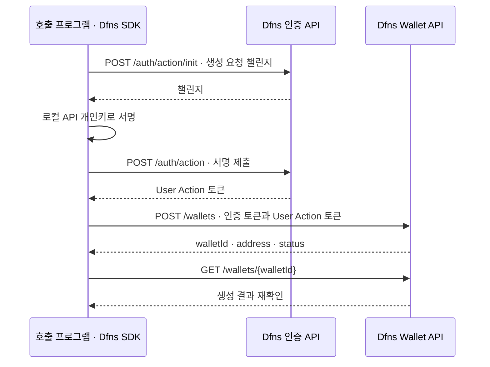

Fireblocks의 Vault·Transaction API와 Dfns의 Wallet·Transfer API를 인증·지갑·잔액·전송·거래 상태·웹훅 관점에서 비교한다. Dfns는 Ethereum Sepolia 지갑 생성, 0.1 ETH 입금 이력, 0.01 ETH 전송과 수수료를 포함한 잔액 대사까지 확인했다. 웹훅은 공식 명세를 비교했으며 실수신 시험은 보류했다.

**잔액 수량은 단위를 맞춰 비교할 수 있지만, 지갑 식별자와 가용 잔액 필드를 그대로 치환할 수는 없다.** 이 차이를 DAWBC 어댑터와 업무 원장 설계에 반영해야 한다.

## 비교 범위와 검증 상태

확인일은 2026-09-14다. Fireblocks는 일반 Vault API의 공식 명세를 비교했으며, 이번 시험에서 Fireblocks API를 호출하지는 않았다. Embedded Wallet API는 비교 대상에서 제외한다.

| 항목 | Dfns 확인 결과 | Fireblocks 비교 기준 |
|---|---|---|
| API 인증 | 서비스 계정 토큰으로 조회 성공 | API Key와 요청별 서명 JWT |
| 요청 서명 | 로컬 개인키와 SDK로 User Action 서명 성공 | 로컬 RSA 개인키로 요청 JWT 서명 |
| 지갑 생성 | Sepolia 지갑 1개 생성, 재조회 시 주소·상태 일치 | Vault Account와 자산별 지갑 생성 명세 |
| 잔액 조회 | 네이티브 자산 0.1 SepoliaETH 확인 | VaultAsset의 잔액 필드 정의 |
| 네이티브 전송·거래 추적 | 0.01 ETH 전송, `Broadcasted → Confirmed`, 입출금 이력·수수료·잔액 대사 확인 | Transaction 생성·조회·상태·수수료 명세 |
| ERC-20 잔액·전송 | 아직 시험하지 않음 | 후속 비교 대상 |
| 웹훅 | 공식 이벤트·상태 명세 비교. 실수신 시험은 보류 | Webhooks V2의 이벤트·거래 상태·알림 전달 상태 |
| 가스 대납 | 후속 검증으로 보류 | 실행·운영 조건을 별도로 비교 |

이번 Dfns 시험은 `https://api.dfns.io`의 제공 환경을 사용했다. **사내 Baseline에 설치한 API 서버를 시험한 결과가 아니다.** 같은 기능을 사내에서 사용할 수 있는지는 지원 릴리스·배포 패키지·고객 지정 RPC 조건으로 다시 확인한다. 사내 배치는 [Baseline 구성도](../Dfns/03-baseline-datacenter-design.md), 전체 업무 경계는 [DAW 통합 설계](../DAW%20구축%20설계/00-integration-plan.md)에서 다룬다.

## 인증과 요청 서명

| 항목 | Fireblocks | Dfns |
|---|---|---|
| 서버용 계정 | API User | Service Account |
| 준비할 정보 | API Key, API 요청 서명용 개인키 | 인증 토큰, Credential ID, API 요청 서명용 개인키 |
| 조회 요청 | 요청마다 서명한 JWT 필요 | 인증 토큰 사용. User Action 서명은 필요 없음 |
| 생성·변경 요청 | 요청 내용을 담은 JWT를 로컬에서 서명 | 챌린지를 받아 서명한 뒤 User Action 토큰 발급 |
| 요청 헤더 | `X-API-Key`, `Authorization` | `Authorization`, 변경 요청의 `X-DFNS-USERACTION` |
| SDK의 역할 | JWT 생성·서명 | 챌린지 요청·서명·User Action 토큰 발급 |

Fireblocks JWT에는 요청 경로 `uri`, 요청별 `nonce`, 발급·만료 시각, API Key인 `sub`, 본문의 SHA-256인 `bodyHash`가 포함된다. RSA 개인키로 RS256 서명을 한다. Dfns는 변경 요청의 HTTP 메서드·경로·본문에 대한 챌린지를 발급하고, 서비스 계정 키의 서명을 검증한다. [Fireblocks 인증](https://developers.fireblocks.com/reference/signing-a-request-jwt-structure) · [Dfns 인증](https://docs.dfns.co/api-reference/auth/index)

두 제품의 **API 요청 서명키는 블록체인 거래를 서명하는 지갑 키와 별개**다. Dfns에서 API 요청 서명이 성공해도 필요한 API 권한이나 거래 승인 정책을 생략할 수 있다는 뜻은 아니다. [Fireblocks API 키 설정](https://developers.fireblocks.com/docs/quickstart) · [Dfns Backend SDK](https://docs.dfns.co/sdks/backend) · [Dfns 정책](https://docs.dfns.co/core-concepts/policies)

이번 Dfns `POST /wallets/{walletId}/transfers`는 **거래 구성·지갑 키 서명·체인 전파를 함께 처리**했다. 별도 `/auth/action` 호출은 API 인증이며 거래 서명·전파를 분리한 것이 아니다. Dfns에는 서명 전용 API도 있지만 이번 시험에서는 사용하지 않았다. [Dfns 전송·서명 API 구분](https://docs.dfns.co/api-reference/broadcast)

### Dfns에서 실제 실행한 흐름



사전 설정 단계에서는 `GET /auth/service-accounts/{serviceAccountId}`로 활성 서비스 계정의 Credential ID를 확인했다. 계정 식별자가 준비된 이후 매번 이 조회를 해야 하는 것은 아니다. SDK는 위 인증 절차를 자동으로 처리하므로 애플리케이션 코드는 지갑 생성 메서드를 호출한다. [Dfns 서비스 계정 조회](https://docs.dfns.co/api-reference/auth/get-service-account) · [TypeScript SDK](https://docs.dfns.co/sdks/backend/typescript)

Fireblocks는 각 요청에 사용할 JWT를 로컬에서 만들기 때문에 이와 같은 요청별 챌린지 발급 왕복이 없다. 다만 **인증 왕복 횟수만으로 지갑 생성 속도나 처리량의 우열을 판단하지 않는다.** 같은 조건에서 지연·동시성·실패·재시도 시험이 필요하다.

## 지갑 생성과 식별 단위

| 항목 | Fireblocks | Dfns |
|---|---|---|
| 기본 구조 | Vault Account 안에 여러 자산 지갑 | 네트워크에 연결된 Wallet과 그 지갑의 자산 목록 |
| 새 계정부터 생성 | `POST /v1/vault/accounts`, 이후 `POST /v1/vault/accounts/{vaultAccountId}/{assetId}` | `POST /wallets`에 `network` 지정 |
| 기존 계정 사용 | 기존 Vault Account에 필요한 자산 지갑 생성 | 기존 Wallet의 자산 조회·전송 API 사용 |
| 잔액 조회 단위 | `vaultAccountId + assetId` | `walletId` 아래 자산별 항목 |
| 내부 매핑 | 업무 계정과 Vault Account, 내부 자산과 벤더 assetId 연결 | 업무 계정과 네트워크별 walletId, 체인별 자산 연결 |

Fireblocks Vault Account는 여러 자산을 담는 관리 단위다. Dfns Wallet은 네트워크에 연결되며, 자산 목록에서 네이티브 자산과 지원 토큰을 조회한다. 따라서 `vaultAccountId`와 `walletId`를 같은 의미로 취급하지 않는다. [Fireblocks Vault Account](https://developers.fireblocks.com/reference/create-vault-account) · [Fireblocks 자산 지갑](https://developers.fireblocks.com/api-reference/vaults/create-a-new-vault-wallet) · [Dfns Wallet](https://docs.dfns.co/api-reference/wallets)

이번 Dfns 생성 요청은 다음과 같다. 사용자 위임이나 기존 지갑 키 재사용을 지정하지 않았다.

```http
POST /wallets
Authorization: Bearer <서비스 계정 인증 토큰>
X-DFNS-USERACTION: <해당 요청의 User Action 토큰>
Content-Type: application/json
```

```json
{
  "network": "EthereumSepolia",
  "name": "dawbc-poc-api-test"
}
```

지갑 생성 후 단건 조회에서 같은 지갑 ID·주소와 `Active` 상태를 확인했다. 생성 API는 기본적으로 새 키도 생성하므로 `Wallets:Create` 외에 `Keys:Create` 권한이 필요하다. 이번 시험은 관리자 권한의 서비스 계정으로 수행했으며, 최소 권한 조합을 별도로 시험한 것은 아니다. [Dfns 지갑 생성](https://docs.dfns.co/api-reference/wallets/create-wallet)

## 잔액 조회 응답 비교

### Dfns 실측 응답

`GET /wallets/{walletId}/assets`가 HTTP 200으로 반환한 **출금 전 응답**이다. 아래에서는 실제 지갑 ID만 일반화했으며, 나머지 필드와 값은 조회 결과 그대로다. 사용자는 생성된 지갑에 Sepolia ETH를 전송했고, API에서 0.1 ETH 잔액을 확인했다. 이후 거래 이력에서 입금 해시·블록 번호·`Confirmed` 상태도 확인했다. 별도 노드의 확인 수·최종성 검증은 수행하지 않았다.

```json
{
  "walletId": "<실제 생성된 walletId>",
  "network": "EthereumSepolia",
  "assets": [
    {
      "kind": "Native",
      "symbol": "SepoliaETH",
      "decimals": 18,
      "verified": false,
      "balance": "100000000000000000"
    }
  ]
}
```

Dfns의 `balance`는 최소 단위의 정수 문자열이다. 이번 값은 `100000000000000000 wei ÷ 10^18 = 0.1 ETH`다. 문자열과 정수·정밀 십진 연산으로 처리하고, JavaScript `Number` 변환으로 정밀도를 잃지 않도록 한다. [Dfns 잔액 표시·단위 변환](https://docs.dfns.co/guides/developers/displaying-balances)

### 대응 필드와 대응할 수 없는 값

Fireblocks 비교 API는 `GET /v1/vault/accounts/{vaultAccountId}/{assetId}`다. 아래 표의 Fireblocks 값은 실측 응답이 아니라 공식 필드 정의와 단위에 따른 비교다.

| Dfns 필드 | Fireblocks 대응 | DAWBC 처리 기준 |
|---|---|---|
| `walletId` | 조회 경로의 `vaultAccountId`와 역할상 대응 | 업무 계정·네트워크별로 별도 매핑 |
| `network` + 자산 항목 | 조회 경로의 `assetId`, 응답의 `id` | 체인과 자산을 함께 식별 |
| `kind: Native` | 네이티브 자산에 해당하는 벤더 assetId | ERC-20 등 토큰과 구분 |
| `symbol` | 자산 메타데이터의 심볼 | 표시용. 심볼만으로 자산을 매핑하지 않음 |
| `decimals` | 자산 메타데이터의 정밀도 | 잔액 단위 변환에 사용 |
| `balance` | `total`에 가장 가까움 | 단위 변환 후 보유 수량 비교. 확정·반영 시점의 일치까지 보장하지 않음 |
| `verified` | VaultAsset 잔액 응답에 직접 대응 없음 | 이번 `false`의 부여 기준은 확인 필요. 입금 미확정·동결 여부로 변환하지 않음 |

동일한 0.1 ETH를 Fireblocks의 자산 단위로 표현하면 `total: "0.1"`에 해당한다. **Dfns `balance`를 Fireblocks의 같은 이름인 `balance`에 연결하지 않는다.** Fireblocks의 `balance`는 deprecated 필드이며 `total`로 대체됐다. [Fireblocks VaultAsset 정의](https://developers.fireblocks.com/reference/vault-objects) · [Fireblocks 자산 잔액 조회](https://developers.fireblocks.com/api-reference/vaults/get-the-asset-balance-for-a-vault-account)

| Fireblocks 필드 | 공식 정의의 의미 | 이번 Dfns 응답 |
|---|---|---|
| `available` | 전송 가능한 잔액. 체인 잔액에서 잠긴 금액을 제외 | 없음 |
| `pending` | 처리 대기 중인 거래의 누적 잔액 | 없음 |
| `lockedAmount` | 아직 네트워크에 전파되지 않은 출금 거래의 금액 | 없음 |
| `frozen` | 동결된 잔액 | 없음 |
| `blockHeight`, `blockHash` | 잔액 기준 블록 정보 | 없음 |

위 항목이 Dfns 응답에 없다는 이유로 `0`을 채우거나, `balance`를 그대로 `available`로 복사하지 않는다. 또한 이 응답만으로 Dfns 전체 제품에 잠금·승인·동결 기능이 없다고 결론 내리지 않는다. 별도 API와 동작 검증이 필요하다. [Dfns 자산 조회](https://docs.dfns.co/api-reference/wallets/get-wallet-assets) · [Fireblocks 잔액 필드](https://developers.fireblocks.com/api-reference/vaults/get-the-asset-balance-for-a-vault-account)

## 전송·거래 조회 실측

### 호출 순서와 전송 요청

사용자가 지정한 목적지와 수량으로 **0.01 Sepolia ETH를 한 번 전송**했다. 대납을 지정하지 않았으며 송신 지갑의 네이티브 잔액에서 수수료를 지불했다.

| 순서 | Dfns API | 이번 확인 내용 |
|---|---|---|
| 1 | `GET /wallets/{walletId}/history` | 0.1 ETH 입금의 `In`·`Confirmed`·거래 해시·블록 번호 |
| 2 | `POST /wallets/{walletId}/transfers` | 0.01 ETH 전송 접수, Transfer ID와 거래 해시 발급 |
| 3 | `GET /wallets/{walletId}/transfers/{transferId}` | 같은 요청을 조회해 `Broadcasted → Confirmed` 확인 |
| 4 | `GET /wallets/{walletId}/history` | 같은 거래 해시의 `Out` 이력·금액·수수료 확인 |
| 5 | `GET /wallets/{walletId}/assets` | 전송액과 수수료 차감 후 잔액 대사 |

전송 API의 요청 본문은 다음과 같다. 공유용 문서에서는 목적지 주소만 일반화했다. `amount`는 wei 문자열이며, `priority`는 수수료 우선순위다. 요청 서명은 앞서 설명한 SDK의 User Action 절차를 사용했다. [Dfns 전송 API](https://docs.dfns.co/api-reference/wallets/transfer-asset)

```json
{
  "kind": "Native",
  "to": "<사용자가 지정한 Sepolia 수신 주소>",
  "amount": "10000000000000000",
  "priority": "Standard"
}
```

### 응답과 잔액 대사

전송 생성 응답은 `Broadcasted`였으며 거래 해시가 포함됐다. 이후 단건 조회에서 `Confirmed`와 실제 `fee`를 확인했다. 아래는 **최종 조회 응답 중 핵심 필드만 발췌**한 것으로, ID와 거래 해시는 일반화했다.

```json
{
  "id": "<발급된 transferId · xfr-...>",
  "network": "EthereumSepolia",
  "status": "Confirmed",
  "txHash": "<해당 전송의 온체인 거래 해시>",
  "fee": "24049820046000"
}
```

| 항목 | 최소 단위 문자열 · wei | ETH |
|---|---|---|
| 전송 전 잔액 | `100000000000000000` | 0.1 |
| 전송 수량 | `10000000000000000` | 0.01 |
| 실제 수수료 | `24049820046000` | 0.000024049820046 |
| 전송 후 조회 잔액 | `89975950179954000` | 0.089975950179954 |

**전송 전 잔액 − 전송 수량 − 실제 수수료 = 전송 후 조회 잔액**이 정수 연산으로 일치했다. 이 결과는 네이티브 자산의 일반 전송 1건에 대한 검증이다. 실패·대체 거래·동시 출금·가스 대납의 차감 규칙까지 검증한 것은 아니다.

전파 대기 중에는 잔액 API가 여전히 0.1 ETH를 반환했고, 이력 API에는 입금 1건만 보였다. `Confirmed` 반영 후에는 출금 이력과 차감 잔액이 조회됐다. **진행 중 출금은 이력이나 잔액만 보고 판단하지 말고 Transfer 조회로 추적해야 한다.** 공식 이력 API도 인덱싱된 확정 거래를 제공하며, 진행 중·실패 요청은 관련 요청 목록 API에서 조회하도록 안내한다. [Dfns 거래 이력](https://docs.dfns.co/api-reference/wallets/get-wallet-history)

출금 이력의 주요 값은 `direction: "Out"`, `kind: "NativeTransfer"`, `status: "Confirmed"`, `value: "10000000000000000"`, `fee: "24049820046000"`, `blockNumber: 11701687`이었다. `txHash`는 Transfer 조회와 일치했고, `metadata.asset.decimals`와 `metadata.fee.decimals`는 각각 18이었다.

입금 이력에도 `fee: "54522540072000"`가 있었다. 이는 앞선 입금 거래의 수수료이며, **수신 지갑 잔액에서 이 금액을 다시 차감하지 않는다.** 이번 수신 지갑에는 입금액 0.1 ETH 전액이 반영됐다. 이력의 `fee` 존재 여부만으로 수수료 지불자를 결정하지 않는다.

### Fireblocks와 대응할 항목

Fireblocks의 일반 전송은 `POST /v1/transactions`, 단건 조회는 `GET /v1/transactions/{txId}`를 사용한다. 아래 대응은 공식 명세 비교이며, 같은 전송을 Fireblocks에서 실행한 결과가 아니다.

| Dfns | Fireblocks | 비교·매핑 기준 |
|---|---|---|
| 경로의 `walletId` | 요청의 `source.id`와 `assetId` | Fireblocks source가 `VAULT_ACCOUNT`인 전송 기준 |
| `kind: Native`, 네트워크 | `operation: TRANSFER`, `assetId` | 네이티브·토큰 및 체인 식별을 함께 매핑 |
| 요청 `to` | 요청 `destination`, 응답 `destinationAddress` | 외부 주소 전달 형식이 다름 |
| 요청 `amount: "10000000000000000"` | 요청 `amount: "0.01"` | Dfns는 최소 단위, Fireblocks는 자산 단위. 둘 다 정밀 문자열로 처리 |
| Transfer `id` | Transaction `id` | 벤더 내부 요청 ID. 온체인 해시와 별개로 저장 |
| `txHash` | `txHash` | 온체인 거래 식별. 네트워크와 함께 저장 |
| 이력 `value` | `amountInfo`의 실제 자산 이동 수량과 대조 | 요청 수량과 실제 이동을 구분. 복수 이동은 별도 항목 확인 |
| Transfer `fee` | `feeInfo.networkFee`와 수수료 자산 | 실제 네트워크 비용을 단위 변환해 비교. deprecated 최상위 `fee`로 연결하지 않음 |
| `status` | `status`, `subStatus` | 문자열 치환만으로 완료 상태를 결정하지 않음 |

Fireblocks는 전송액을 자산 단위로 받으며, `treatAsGrossAmount: true`이면 네이티브 자산 전송에서 요청 수량에 수수료가 포함된다. 이번 Dfns 시험은 **수신액 0.01 ETH와 수수료를 별도로 차감**한 결과이므로, Fireblocks 비교에서도 수수료 포함 여부를 맞춰야 한다. [Fireblocks 거래 생성](https://developers.fireblocks.com/api-reference/transactions/create-a-new-transaction) · [Fireblocks 거래 조회](https://developers.fireblocks.com/api-reference/transactions/get-a-specific-transaction-by-fireblocks-transaction-id)

Dfns의 `Confirmed`는 인덱서가 온체인 거래를 확인했다는 상태다. Fireblocks의 `COMPLETED`는 확인 정책을 포함한 처리 상태이므로 **두 값을 동일한 체인 최종성으로 취급하지 않는다.** Dfns의 `Pending`도 일반적인 모든 대기를 뜻하지 않고 정책 승인 대기를 가리킨다. 체인별 완료 기준과 재조직 대응을 별도로 검증한다. [Dfns Transfer 상태](https://docs.dfns.co/api-reference/wallets/get-transfer) · [Fireblocks 상태](https://developers.fireblocks.com/reference/statuses)

## 트랜잭션 상태와 웹훅 비교

**거래 상태, 이벤트 종류, 웹훅 전달 상태를 구분한다.** 아래 비교는 Fireblocks 일반 거래와 Webhooks V2, Dfns Transfer·온체인 이벤트의 공식 명세 기준이다. 이번에 실측한 Transfer 상태는 `Broadcasted → Confirmed`이며, 웹훅 실수신·승인·실패·취소 시험은 수행하지 않았다.

### 조회 API의 거래 상태

Dfns Transfer의 상태는 `Pending`, `Executing`, `Broadcasted`, `Confirmed`, `Failed`, `Rejected`다. Fireblocks는 처리 단계와 원인을 더 세분화하며 `subStatus`도 제공한다. 아래는 역할상 비교로, 그대로 적용할 상태 변환표가 아니다.

| 처리 단계 | Fireblocks | Dfns Transfer | 해석 |
|---|---|---|---|
| 최초 접수 | `SUBMITTED` | 전용 `Submitted` 없음 | 반환된 상태와 ID를 보존. 생성됐다고 무조건 `Pending`은 아님 |
| AML·외부 심사 | `PENDING_AML_SCREENING` | 직접 대응하는 상태 없음 | 기능 부재가 아니라 Transfer 상태 열거의 차이 |
| 보안 정보 보강 | `PENDING_ENRICHMENT` | 직접 대응하는 상태 없음 | Fireblocks 내부 보안 분석 단계 |
| 정책 승인 대기 | `PENDING_AUTHORIZATION` | `Pending` | Dfns Pending은 정책 승인 대기 |
| 큐·서명·실행 준비 | `QUEUED`, `PENDING_SIGNATURE` | `Executing`이 실행 단계에 가장 가까움 | 내부 하위 단계를 일대일 대응할 수 없음 |
| 외부 서비스 처리 | `PENDING_3RD_PARTY_MANUAL_APPROVAL`, `PENDING_3RD_PARTY` | 직접 대응하는 상태 없음 | 거래소 등 별도 연동 경로의 상태 |
| 전파·체인 확인 대기 | `BROADCASTING`, `CONFIRMING` | `Broadcasted` | Dfns는 mempool 제출 이후 상태. Fireblocks BROADCASTING은 전파 중이므로 동일 의미가 아님 |
| 성공 확인 | `COMPLETED` | `Confirmed` | 업체의 확인 기준이 다르므로 체인 최종성과 구분 |
| 정책 규칙 차단 | `BLOCKED` | 전용 `Blocked` 없음 | 실제 오류·정책 결과를 확인. 임의로 Rejected에 합치지 않음 |
| 거절 | `REJECTED`, 일부 사용자 거절은 `CANCELLED` | `Rejected` | Dfns는 정책 승인 거절. Fireblocks는 더 넓은 사유를 포함 |
| 취소 처리 | `CANCELLING`, `CANCELLED` | 전용 취소 상태 없음 | 아래 abort·대체 거래 결과로 구분 |
| 처리 실패 | `FAILED` | `Failed` | 시스템 실패와 온체인 실패를 구분하고 실제 gas 확인 |

Fireblocks에는 별도 서명 전용 경로의 `SIGNED`도 있다. Dfns Transfer에는 `Signed`가 없으며, 별도 서명 요청 객체와 혼합하지 않는다. 일반 송금에서 보이지 않은 상태를 필수 중간 단계로 가정하지 않는다. [Fireblocks 상태](https://developers.fireblocks.com/reference/statuses) · [Dfns Transfer 상태](https://docs.dfns.co/api-reference/wallets/get-transfer)

**`Confirmed = COMPLETED = 체인 최종 확정`으로 처리하지 않는다.** Fireblocks의 확인 정책과 Dfns의 인덱싱·네트워크 확인 기준을 각각 대조한다. Fireblocks는 같은 거래에 `COMPLETED` 알림을 여러 번 보낼 수 있다. 같은 완료 알림이 다시 와도 입출금 원장을 중복 반영하지 않는다. [Fireblocks 완료 상태](https://developers.fireblocks.com/reference/statuses)

Dfns `Failed`는 시스템 오류나 온체인 실패 외에 **abort 결과**일 수도 있다. `PUT /wallets/{walletId}/transfers/{transferId}/abort`는 아직 서명되지 않은 `Executing` 요청을 `Failed`로 바꾼다. 반면 EVM cancel은 동일 nonce의 대체 거래를 만든다. 취소 요청을 접수했다고 원래 출금이 취소됐다고 판단하지 말고, 원거래와 `replacementId`의 결과를 확인해야 한다. [Dfns Abort](https://docs.dfns.co/api-reference/wallets/abort-transfer) · [Dfns Cancel](https://docs.dfns.co/api-reference/wallets/cancel-transfer)

### 웹훅의 거래 상태 위치

| 구분 | Fireblocks Webhooks V2 | Dfns |
|---|---|---|
| 이벤트 종류 필드 | `eventType` | `kind` |
| 주요 거래 이벤트 | `transaction.created`, `transaction.status.updated` | `wallet.transfer.requested` 등 단계별 이벤트 |
| 거래 상태 필드 | `data.status`, `data.subStatus` | `data.transferRequest.status` |
| 벤더 요청 ID | `data.id` | `data.transferRequest.id` |
| 온체인 입금 상태 | 거래 객체의 상태와 입출금 정보 | `data.blockchainEvent.status`, `direction` |

Fireblocks V1의 `type: TRANSACTION_STATUS_UPDATED`와 V2의 `eventType: transaction.status.updated`를 섞지 않는다. 비교 대상은 V2다. [Fireblocks V2 전환 안내](https://developers.fireblocks.com/reference/webhook-v2-migration-guide) · [Fireblocks 거래 이벤트](https://developers.fireblocks.com/reference/webhooks-structures-eventtypes-transaction)

Dfns의 같은 자산 이동은 Transfer 요청과 온체인 이벤트로 각각 관측할 수 있다. 두 객체의 상태 필드와 식별자를 구분한다. [Dfns 웹훅 객체](https://docs.dfns.co/api-reference/webhook-events)

### 전송·승인 이벤트 대응

| 의미 | Fireblocks V2 | Dfns 이벤트와 확인할 값 |
|---|---|---|
| 요청 생성 | `transaction.created` | `wallet.transfer.requested` — 실제 `transferRequest.status` 확인 |
| 정책 승인 | `transaction.approval_status.updated` 및 거래 상태 갱신 | `policy.approval.pending`, `policy.approval.resolved` — 승인 객체의 결정 확인 |
| 전파 | `transaction.status.updated`의 거래 상태 | `wallet.transfer.broadcasted` — `Broadcasted` |
| 온체인 성공 확인 | `transaction.status.updated`의 `COMPLETED` | `wallet.transfer.confirmed` — `Confirmed` |
| 실패 | `transaction.status.updated`의 `FAILED`·하위 사유 | `wallet.transfer.failed` — `Failed`·`reason` 등 확인 |
| 거절 | `transaction.status.updated`의 거절·취소 사유 | `wallet.transfer.rejected` — `Rejected` |

`requested`는 이벤트 종류이며 `Pending`이라는 상태와 동의어가 아니다. `policy.approval.resolved`도 승인과 거절을 모두 포함하므로 이벤트 이름만으로 전송을 허용하지 않는다. 공식 이벤트 목록에는 `wallet.transfer.executing`이 없으므로 모든 API 상태마다 동일 이름의 웹훅이 온다고 가정하지 않는다. [Dfns 거래 모니터링](https://docs.dfns.co/guides/developers/transaction-monitoring) · [Dfns 정책 이벤트](https://docs.dfns.co/api-reference/webhook-events)

별도 Sign & Broadcast API인 `POST /wallets/{walletId}/transactions`를 쓰면 Dfns 이벤트는 `wallet.transaction.requested/broadcasted/confirmed/failed/rejected`이며 데이터는 `data.transactionRequest`다. 이번 Transfer 경로의 `wallet.transfer.*`와 다른 객체다. 또한 이 경로도 거래 서명과 전파를 함께 처리한다. [Dfns 거래 모니터링](https://docs.dfns.co/guides/developers/transaction-monitoring) · [Sign & Broadcast](https://docs.dfns.co/api-reference/wallets/sign-and-broadcast-transaction)

### 입금 이벤트의 Included와 Confirmed

Dfns는 지원 네트워크에서 초기 입금 감지와 확인 후 이벤트를 구분한다.

| Dfns 이벤트 | `data.blockchainEvent.status` | 의미 |
|---|---|---|
| `wallet.blockchain_event.transfer.included` | `Included` | 입금이 블록에서 관측됐지만 확인 지연을 통과하기 전 |
| `wallet.blockchainevent.detected` | `Confirmed` | Dfns가 확인한 온체인 이벤트. `direction: In` 등으로 입금 구분 |

**`Included`는 Transfer 요청의 상태가 아니라 온체인 이벤트 객체의 상태다.** 외부에서 보낸 입금에는 우리가 생성한 `xfr-...` 요청이 없을 수 있으므로, `wallet.transfer.confirmed`만 구독해서는 입금 감지를 구성할 수 없다. 조기 감지는 지원 네트워크에 한정되며 `detected`와 전송 `confirmed` 이벤트의 Tier-1 조건도 확인한다. 이번 시험은 웹훅 없이 이력 조회로 입금을 확인했다. [Dfns 입금 이벤트·지원 조건](https://docs.dfns.co/api-reference/webhook-events)

### 웹훅 전달 성공과 거래 성공

| 대상 | Fireblocks | Dfns | 업무 처리 |
|---|---|---|---|
| 알림 전달 이력 | Notification `status`: `IN_PROGRESS`, `COMPLETED`, `FAILED`, `ON_HOLD` | Webhook Event `status`: HTTP 응답 코드 문자열, `deliveryFailed` 등 | 수신 서버 전달 결과로 관리 |
| 실제 거래 | `data.status` | `data.transferRequest.status` 또는 `data.blockchainEvent.status` | 거래 객체와 체인 결과로 처리 |

따라서 **Fireblocks 알림 이력의 `COMPLETED`나 Dfns 웹훅 이력의 `status: "200"`는 거래 완료를 뜻하지 않는다.** 반대로 알림 전달 실패가 곧 출금 실패도 아니다. [Fireblocks 알림 이력](https://developers.fireblocks.com/api-reference/webhooks-v2/get-all-notifications-by-webhook-id) · [Dfns 웹훅 전달 이력](https://docs.dfns.co/api-reference/webhook-events)

DAWBC에서는 원본 이벤트와 벤더 상태를 보존하고, 중복·순서 역전·조회 대사에 같은 상태 처리 규칙을 적용한다. Dfns는 전달 순서를 보장하지 않으며 재전송 시 새 Webhook Event ID를 만든다. 전달 ID 중복 검사와 별도로 요청 ID 또는 체인별 자산 이동 식별자에 대한 업무 멱등 처리가 필요하다. 같은 출금의 `wallet.transfer.confirmed`와 `wallet.blockchainevent.detected`를 두 건으로 원장에 반영하지 않는다. [Dfns 순서·재전송 동작](https://docs.dfns.co/api-reference/webhook-events)

## DAWBC에 반영할 설계

다음은 비교 결과에 따른 구현 제안이다. 공개 API나 서비스 구현을 변경한 결과가 아니다.

1. **업무 계정·네트워크 지갑·자산을 분리한다.** 내부 ID를 유지하고 벤더 ID는 어댑터 매핑으로 관리한다. 같은 이름의 Base·Solana 스테이블코인을 하나의 잔액 항목으로 합치지 않는다.
2. **벤더 잔액과 고객 가용 잔액을 구분한다.** 이번 시험에서도 전파 대기 중에는 잔액이 전송 전 값으로 조회됐다. 고객 출금 가능 금액은 DAW-CORE의 원장·출금 예약·보류 상태와 가스 비용을 함께 고려해 결정한다.
3. **미제공 값은 미확인 상태로 보존한다.** 기존 계약에서 필수인 가용·잠금·확정 정보를 Dfns가 같은 의미로 제공하는지 확인하고, 없으면 산출 책임과 조회 경로를 별도로 정한다. 고객 원장을 벤더 잔액으로 덮어쓰지 않는다.
4. **조회 성공과 거래 확정을 분리한다.** 잔액 증가만으로 개별 입금의 최종 확정이나 원장 반영 완료를 판단하지 않는다. 거래 식별·중복·재조직 처리는 별도 계약으로 검증한다.
5. **인증·승인·재시도를 분리한다.** SDK가 요청 서명을 처리하더라도 업무 승인과 멱등 처리는 남는다. 생성 응답이 유실되면 새 요청을 반복하기 전에 기존 생성 결과를 대사한다.

이 제안의 상세 모델과 기존 API 호환 조건은 [DAW 계정·멀티체인·API·이벤트](../DAW%20구축%20설계/01-core-contracts.md)에 연결한다.

## 다음 검증

| 검증 항목 | 확인할 내용 |
|---|---|
| ERC-20 잔액 조회 | contract·decimals·자산 식별 필드와 토큰 잔액 변환 |
| ERC-20 전송·예외 | 네이티브 전송 1건은 완료. ERC-20 수량·실제 이동과 실패·대체 거래의 수수료 확인 |
| 거래 상태·입금 이력 심화 | 입출금 이력·전송 상태·잔액 대사는 완료. 확인 수·최종성·중복·재조직 검증은 남음 |
| 사용 가능 잔액 | 진행 중 출금·예약·수수료가 있는 상태에서의 잔액 의미 |
| `verified` | 테스트넷 네이티브 자산에 `false`를 반환한 기준과 적용 범위 |
| 최소 권한·멱등 | 필요한 권한, 같은 요청 재시도와 응답 유실 시 중복 생성 방지 |

웹훅 수신·재전송과 가스 대납은 현재 보류한 후속 검증 항목이다. 이번 일반 전송은 테스트넷 ETH로 수수료를 지불했으며, 운영 설계의 법정화폐 대납 방향은 유지한다. Dfns 제공 환경의 시험 결과를 사내 Baseline 지원 보장으로 확대하지 않는다.
