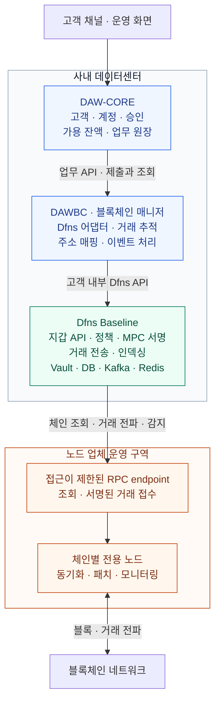

고객 소유 노드의 운영 위탁 + 사내 Dfns Baseline + DAWBC + DAW-CORE를 구축하는 설계안이다. DAWBC는 기존 문서의 블록체인 매니저(BCM)를 가리킨다. 현재는 설계 단계이며 인프라 생성·어댑터 구현·운영 시험을 완료한 상태가 아니다.

이 묶음은 DAW 전체의 책임·연결·계약을 다룬다. Dfns를 현재 검토 대상으로 사용하며, Dfns 제공 자료와 플랫폼 인프라 상세는 별도 Dfns 묶음에 둔다.

| 읽는 순서 | 내용 |
|---|---|
| 이 문서 | 범위·전체 구성·운영 책임·설계 결정·진행 계획 |
| [계정·멀티체인·API·이벤트](01-core-contracts.md) | 업무와 벤더 사이의 데이터·제출·이벤트 계약 |
| [노드 연결 명세](02-node-rpc-spec.md) | 우리가 제안하는 RPC·장애 대응·인수 기준 |
| [법정화폐 가스 대납](03-fiat-gas-sponsorship.md) | 대납 경로·예산·실비·청구 대사 |
| [Dfns 인프라·구성도](../Dfns/03-baseline-datacenter-design.md) | 사내 Baseline의 서버·Vault·저장소·복구 |

## 1. 설계 범위

| 항목 | 설계 기준 |
|---|---|
| 플랫폼 | Dfns 전체 플랫폼을 고객 사내 데이터센터에 배치하는 Baseline. 비AWS 지원 번들과 버전 조합은 벤더 확인 필요 |
| Dfns API | 고객 인프라에 설치된 Dfns API 서버를 DAWBC가 호출. 소프트웨어 제공자와 API 서버 운영 위치를 구분 |
| 노드 | 고객 소유 노드이며 운영은 업체에 위탁. **연결 명세는 우리가 제안**, Dfns 요구사항과 업체 제공 기능을 대조해 확정 |
| 업무 경계 | DAW-CORE가 고객·승인·원장, DAWBC가 외부 실행·매핑·이벤트 처리 |
| 서명 | Dfns MPC를 기본 검토. API 요청 서명 자격증명·지갑 MPC 키·Vault 잠금 해제 자료는 각각 분리 |
| 통합 방식 | 명령·조회는 API, 결과는 Webhook·내부 큐. Dfns 내부 DB·Kafka에 직접 결합하지 않음 |
| 자원 계획 | 기존 36노드 표는 성능 측정 전 예약안. DAW-CORE·DAWBC·위탁 체인 노드·공용 운영 인프라를 포함한 총량이 아님 |

### 1차 검증과 확장

사용자가 선택한 1차 범위는 **EVM 체인 1개 + ERC-20 자산 1개**다. 계정 생성 → 입금 주소 발급 → 입금 → 출금 → 원장 반영 → 대사를 한 흐름으로 검증한다. 가스 잔액이 없는 사용자 지갑과 법정화폐 정산형 대납을 1차 설계·검증에 포함한다. 실제 체인 비용을 지불할 네이티브 자산은 대납 주체가 준비한다. 외부업체 지불과 자체 대납 지갑 중 운영 주체는 별도 결정 대기다. 구체적인 네트워크·테스트넷·체인 ID·토큰 컨트랙트·decimals와 확정 기준은 후속 상세 설계에서 확정한다. EVM 호환성만으로 L1·L2의 확정 기준까지 같다고 가정하지 않는다.

**공통 모델은 처음부터 여러 체인·스테이블코인을 지원하도록 설계하며 Base·Solana를 포함한다.** 다중 체인 동시 출시, 신규 sweep 컨트랙트, 브릿지·스왑·스테이킹, 지갑 이전은 후속 범위로 둔다. 기존 Fireblocks에 실제 운영 자산이 있는지는 아직 확인되지 않았으므로 키·주소·자금 이전 작업을 기본 범위에 넣지 않는다. Fireblocks의 가스 대납·정책·callback·트래블룰 기능은 Dfns 지원 대조 대상으로 기록한다.

## 2. 연결 구조

**Dfns API는 고객 인프라에 설치한 Dfns API 서버의 내부 주소다.** DAWBC는 Dfns가 제공한 소프트웨어를 내부 네트워크로 호출한다. 노드와 서버의 소유권이 고객에게 있어도 소프트웨어가 제공하는 API를 사용하는 구조는 같다.

위 그림은 일반 전송의 요청 경로다. 법정화폐 정산형 외부 대납을 사용하는 경우에는 [대납 구성도](03-fiat-gas-sponsorship.md)의 서명·실행 경로를 추가 검증한다. 결과는 **Dfns Webhook → DAWBC 수신·상태 처리 → 내부 메시지 큐 → DAW-CORE**로 전달한다. 누락은 조회 대사로 복구한다. DAWBC가 노드 RPC를 직접 조회하는 경로를 추가하더라도 관측·대사 용도로 역할을 정하고, 같은 출금을 두 경로에서 독립적으로 전송하지 않는다.

Dfns 제공 개요 p.15에는 활성화한 네트워크별 RPC endpoint와 자격증명 보관이 명시돼 있다. 다만 업체 RPC의 인증·필수 메서드·장애 전환·과거 데이터 제공 조건까지는 확인되지 않았다. 일반 RPC 접속 성공만으로 거래 전송과 전체 입금 감지가 동작한다고 판단하지 않는다.

## 3. 역할과 운영 책임

| 구분 | 개발·제공 범위 | 운영 책임 제안 |
|---|---|---|
| DAW-CORE | 고객 서비스 API, 고객·계정·입출금 업무, 승인·컴플라이언스 순서, 잔액 잠금·원장 반영 | 내부 코어 개발·운영팀 |
| DAWBC | 공통 업무 API, Dfns 어댑터, 자산·주소·지갑 매핑, 멱등 제출, 상태 번역, Webhook·큐·대사, sweep 실행 관리 | 내부 블록체인 개발·운영팀 |
| Dfns Baseline | Dfns가 지갑 API·정책·MPC·인덱싱 소프트웨어와 배포 패키지를 제공 | 내부 플랫폼·키 관리팀이 설치·운영, Dfns가 계약 범위의 기술 지원 |
| 노드 운영업체 | 체인 노드 설치·동기화, RPC 제공, 버전 업그레이드·장애 전환·모니터링 | 노드 운영 계약에 따라 업체 수행 |

**노드 운영 위탁에 Dfns 플랫폼 운영까지 포함되는 것은 아니다.** Kubernetes·Vault·PostgreSQL·Kafka·Redis·Keyshares store의 패치·백업·복구·당직 담당을 별도로 지정한다. 동일 업체에 추가 위탁하더라도 노드 접근 권한과 플랫폼·키 관리 권한을 별도 계약과 계정으로 분리한다.

고객 잔액·원장 정본은 DAW-CORE, 실행 의도·외부 ID 매핑·이벤트 처리 상태는 DAWBC, Dfns 내부 상태와 키 자료는 Dfns 전용 저장소가 관리한다. 서로의 DB를 직접 수정하는 방식으로 연결하지 않는다. Dfns 내부 Kafka와 DAWBC→DAW-CORE 업무 큐도 계약을 분리하고, DAWBC가 Dfns 내부 토픽에 직접 의존하는 구성을 기본으로 삼지 않는다.

MPC 지갑 키 조각과 Vault 관리 권한은 고객의 키 관리 경계에 둔다. 노드 업체에는 RPC·노드 운영 권한을 부여하며, 지갑 서명키·Dfns 정책 변경·DAW-CORE 원장 수정 권한은 부여하지 않는 설계다. **DAWBC의 Dfns API 요청 서명용 자격증명은 지갑 MPC 키와 별개**다. 서버 SDK도 API 인증 토큰과 요청 서명 자격증명을 사용한다. [Dfns Backend SDKs](https://docs.dfns.co/sdks/backend)

위탁 노드는 사내 설치 후 운영을 맡길지 업체 시설에 전용으로 설치할지 계약에서 확정한다. 노드 소유권은 고객에게 둔다. 트래블룰·AML/KYT는 기존 DAW-CORE·컴플라이언스 경계에 연결하며, Fireblocks 전용 정책·callback과 Dfns 기능의 대응은 [핵심 계약](01-core-contracts.md)에서 검증한다.

## 4. 입출금 처리

### 출금

1. DAW-CORE가 고객 요청을 접수하고 잔액을 잠근 뒤 승인·컴플라이언스 조건을 확인한다.
2. DAWBC에 `externalTxId`·자산·수량·목적지를 전달한다. DAWBC는 실행 의도와 고정한 요청 내용을 기록한다.
3. 대납 전송은 견적·승인 예산·대납 예약을 먼저 검증한다. 선택된 경로에 맞춰 Dfns에 전송 또는 서명을 요청하고, Dfns의 정책과 MPC 서명 조건을 적용한다. 외부 대납의 서명 결합·전파는 별도 호환성 검증이 필요하다.
4. 일반 전송은 Dfns의 블록체인 연동 구성요소가 업체 RPC로 서명된 거래를 보내고 전파·확정을 추적한다. 외부 대납은 별도로 검증한 단일 실행 경로와 비용 추적 계약을 적용한다.
5. DAWBC가 Webhook·조회 결과를 내부 상태로 번역해 출금 이벤트를 발행한다.
6. DAW-CORE가 상태·실제 수수료·업무 결과를 대조해 잠금과 원장을 처리한다. RPC 접수나 tx hash 발급만으로 출금을 완료하지 않는다.

API 응답 유실이나 전파 결과가 불명확한 동안에는 새 출금을 만들거나 잠금을 자동 해제하지 않는다. 체인상 실패로 gas가 소비된 경우에는 실패 결과와 실비를 함께 반영할 수 있어야 한다.

### 입금

1. 위탁 노드가 체인 데이터를 동기화한다. Dfns 인덱서가 RPC를 통해 관련 지갑의 입금과 확정을 감지한다.
2. DAWBC가 Dfns 이벤트를 검증하고 주소·자산·입금 항목을 매핑해 입금 이벤트를 발행한다.
3. DAW-CORE가 고객 귀속을 판단하고 확정·컴플라이언스 조건에 맞춰 보류·가용 잔액을 처리한다.
4. Webhook 누락은 지갑 이력 조회와 체크포인트 대사로 복구한다. 필요하면 RPC 과거 조회·재인덱싱을 수행하는 주체와 절차를 정한다.

Dfns 공개 안내도 입금 알림과 지갑 이력 조회, 중복 처리 및 정기 대사를 설명한다. 알림의 체인 확인 기준이 우리 가용 잔액 정책과 일치하는지는 체인별로 검증한다. [Dfns 입금 감지 안내](https://docs.dfns.co/solutions/automate-deposits)

## 5. 설계 결정

| ID | 현재 제안 | 확정 또는 변경에 필요한 근거 |
|---|---|---|
| D01 | DAWBC가 고객 내부 Dfns API를 호출 | 사내 릴리스·API base URL·TLS·인증 설정 계약 |
| D02 | 일반 송금은 Dfns가 구성·서명·전파 | Transfer API와 위탁 RPC 조합 검증. 컨트랙트 호출은 별도 기능 계약 |
| D03 | DAW-CORE의 원장과 DAWBC의 실행 상태 분리 | 현재 OpenAPI·이벤트·원장 반영 계약과 호환성 확인 |
| D04 | 논리 계정과 네트워크별 벤더 지갑 매핑 분리 | Dfns 지갑 생성·주소·토큰·memo/tag 모델과 생성 멱등 확인 |
| D05 | 거래별 실행 경로를 고정하고 같은 송신 주소의 nonce 관리 주체를 통일 | EVM nonce·대체 거래, Solana 메시지 수명·공동 서명·전파 주체 확인 |
| D06 | Webhook 영속 수신과 조회 대사를 함께 사용 | Webhook 검증·재전송·조회 범위·보존·reorg payload 확인 |
| D07 | 승인과 제출 자격 분리, 승인 내용과 실행 내용 대조 | Dfns 정책/승인 강제 방식. 자동 요청 서명이 고객 업무 승인 자체를 증명하지 않음 |
| D08 | 노드 RPC는 목적별 권한, 체인별 이중화 | 우리가 제안한 RPC 명세에 대한 Dfns·운영업체의 기능·SLO 합의 |
| D09 | 지갑 키 운영은 고객 통제, 노드 운영 권한과 분리 | 담당자·백업·잠금 해제·복구·비상 접근 절차 |
| D10 | API·상태 계약을 바꾸기 전 기존 의미부터 대조 | [핵심 계약의 API·이벤트 대조](01-core-contracts.md) |
| D11 | 체인별 자산·지갑 계정 모델·확정·기능 지원을 분리 | Base·Solana와 여러 스테이블코인 조합의 등록·계약 시험 |
| D12 | 대납 실행과 법정화폐 정산 분리. 고객에게 네이티브 가스 잔액 요구하지 않음 | 자금 지불자·통화·업체 호환성·실패 비용·청구·지정 RPC 계약 |

## 6. 설계·구현 순서

| 단계 | 산출물과 수행 내용 | 다음 단계로 넘어갈 기준 | 현재 상태 |
|---|---|---|---|
| S0. 범위·책임 | 이 계획, 시스템 경계, 결정 목록, 계약 기준 문서 지정 | API 운영 위치·데이터 소유자·최초 검증 범위가 명확함 | 초안 작성 |
| S1. 핵심 계약 | 계정·자산·주소 모델, 제출 의도·외부 ID, 내부 상태 전이, API·이벤트·금액·확정 의미 | 중복·응답 유실·reorg 시 동작을 사례로 설명 가능 | [핵심 계약 초안](01-core-contracts.md) 작성 |
| S2. RPC·플랫폼 | 업체 제안 RPC 명세, 망·인증·장애 전환, Dfns 패키지·Vault·키·운영 배치 | 지정 RPC로 Dfns 전송·감지·과거 조회를 수행할 수 있는 지원 계약 확보 | [RPC 제안 초안](02-node-rpc-spec.md) 작성, 벤더 대조 대기 |
| S3. 상세 계약 | 기존 OpenAPI와 변경 대조, Dfns API 대응표, 상태 매핑, 논리/물리 DB, Webhook·큐 스키마 | 정상·실패 샘플 payload와 영속성 제약·호환성 판단 확보 | [멀티체인 모델](01-core-contracts.md#1-계정주소자산-모델)·[대납 계약](03-fiat-gas-sponsorship.md)·[API 대응표](01-core-contracts.md#4-dfns-api-대응) 초안 작성. 물리 DB·릴리스 검증은 진행 전 |
| S4. 구현 | DAWBC Dfns 어댑터·수신기·대사, DAW-CORE 업무 연결, 검증 환경 자동화 | 테스트넷 한 체인·한 자산에서 대납·비용 추적을 포함한 전체 흐름 성공 | 예정 |
| S5. 운영 검증 | 키 회전·복구, RPC/프로세스 장애, 누락·중복·확정 무효화, 성능·당직 절차 | 자산·원장 정합과 합의한 RPO/RTO·처리량 충족 | 예정 |
| S6. 제한 운영 | 거래 한도·경보·비상 정지·증빙·확대 조건 | 승인된 운영 범위에서 실거래 대사 성공 | 예정 |

S1은 업체 답변 전에도 진행한다. S2에서는 우리가 RPC 계약을 먼저 제안하고 Dfns와 업체가 검토한다. S3의 실제 endpoint·payload·멱등 동작·인증·정책은 지원 릴리스 자료가 있어야 확정할 수 있다. 사람 수와 배포 패키지 제공일이 정해지지 않았으므로 달력 기준 완료일을 약속하지 않는다.

## 7. 검증 기준

- 같은 업무 요청과 같은 내용은 한 실행으로 수렴하고, 같은 키에 다른 내용은 거절한다.
- Dfns 접수 후 응답 유실·DAWBC 재시작이 발생해도 새로운 출금으로 중복 제출하지 않는다.
- 한 거래의 여러 입금 항목과 여러 상태 이벤트를 구분한다. 알림 재수신은 원장에 한 번만 반영한다.
- HTTP 성공·서명 성공·RPC 접수·블록 포함·내부 확정·고객 가용 전이를 각각 구분한다.
- 전파 여부 불명·확정 무효화·실비 발생 실패를 원장·잔액 잠금·운영 대사에 반영한다.
- 노드 장애와 플랫폼 장애가 발생해도 키 자료·기존 요청 ID·체크포인트로 복구한다.
- 출금 승인자·거래 제출자·정책 변경자·키 복구자·노드 운영자의 권한이 설계대로 분리된다.
- 사용자 가스 잔액 없이 승인 예산 안에서 전송하고, 원금 결과와 대납 실비·법정화폐 청구를 각각 대사한다.

## 8. 확정할 입력과 다음 작업

| 입력 | 현재 처리 |
|---|---|
| 우선 체인·자산 | EVM 체인 1개 + ERC-20 자산 1개로 사용자 선택 완료. 실제 네트워크·컨트랙트·정밀도·확정 정책은 후속 결정 |
| 고객별 지갑·옴니버스·출금 풀 | 기존 DAWBC 패턴을 출발점으로 사용. Dfns 객체·운영비용과 대조 필요 |
| 실제 운영 자산·이전 여부 | 미확인. 기존 키·주소·자금 이전 실행 없음 |
| 지갑 수·일 거래량·피크·입금 감지 지연 | 용량 산정 입력으로 수집. 임의 TPS를 보장하지 않음 |
| Dfns 패키지·OpenAPI·샘플 이벤트 | [담당자 질문](../Dfns/04-vendor-questions.md)으로 수집. 미확정 endpoint를 구현 사실로 쓰지 않음 |
| 노드 설치 위치·공용망 연결·인증 | 고객 소유/업체 운영 전제로 [RPC 명세](02-node-rpc-spec.md)를 우리가 제안 |

S3의 멀티체인 모델·대납 계약·API 대응표 초안을 작성했다. 다음은 물리 DB·이벤트 스키마·상태 전이의 상세화다. 벤더 자료가 도착하면 실제 필드·샘플·대납 호환성을 대조한다. 설계와 인수 시험 계획을 작성한 단계이며 실제 운영 검증은 아직 수행하지 않았다.

대납 자금의 지불자·계약 통화·업체 선정·고객 재청구 정책은 [대납 설계](03-fiat-gas-sponsorship.md)의 미확정 항목이다. 고객이 [노드 연결 명세](02-node-rpc-spec.md)를 먼저 제안하고 Dfns가 클라이언트 호환성을, 노드 업체가 제공 기능·SLO를 확인한다. [Dfns 질문 목록](../Dfns/04-vendor-questions.md)은 아직 미발송·미답변이다.

## 근거와 연결 문서

- [Dfns Baseline 인프라·구성도](../Dfns/03-baseline-datacenter-design.md)
- [Dfns 온프레미스 개요](../Dfns/00-on-premise-deployment.md) p.6~8·15: API·인덱싱·서명·RPC 연결
- [DAWBC 구조와 책임](../../블록체인매니저/개요/00-overview.md), [API·이벤트 계약](../../블록체인매니저/설계/16-interface.md), [감지·확정 기준](../../블록체인매니저/설계/04-detect-confirm.md)
- Dfns 공식 API 문서는 2026-09-14에 확인했다. 본문의 역할 배분·운영 범위·구축 순서는 설계 제안이며, 사내 릴리스의 지원 확정과 구분한다.
