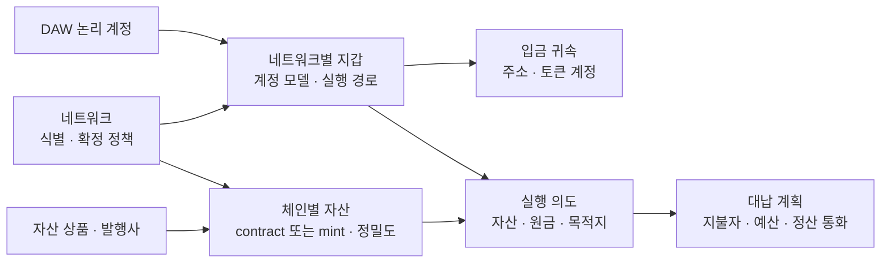
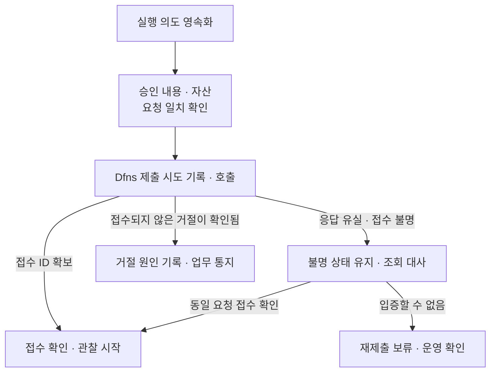

DAW-CORE의 업무 요청을 DAWBC의 실행 의도·지갑·자산·이벤트에 연결하는 상세 계약이다. 첫 검증은 EVM 체인 1개·ERC-20 자산 1개이며, 공통 모델은 Base·Solana와 여러 스테이블코인을 수용한다. 아래 객체·영속 제약·처리 순서는 고객 설계 제안이다. 기존 API나 Dfns 내부 DB를 변경한 결과가 아니다.

업무·원장 정본은 DAW-CORE, 실행·매핑·이벤트 정본은 DAWBC가 관리한다. [통합 구성·계획](00-integration-plan.md)에 책임과 범위를 모았다. Dfns 공개 API는 2026-09-14 확인 기준이며 사내 Baseline 릴리스로 다시 검증한다.

블록체인 결과는 체인이 정본이며 Dfns·노드 조회는 관측 경로다. 고객 가용 잔액을 Dfns 지갑이나 노드 잔액으로 덮어쓰지 않는다.

실제 Dfns 지갑 생성·잔액 조회 응답과 Fireblocks 필드의 차이는 [Fireblocks·Dfns API 비교](../API%20비교/00-fireblocks-dfns-api.md)에 정리했다. 특히 Dfns의 원시 `balance`를 가용 잔액으로 취급하거나, 응답에 없는 잠금·대기 잔액을 0으로 채우지 않는다.

## 1. 계정·주소·자산 모델

| 객체 | 주요 필드 제안 | 식별·변경 규칙 |
|---|---|---|
| 논리 계정 | accountId, accountType, ref | `(accountType, ref)`의 중복 생성 방지. DAW-CORE의 안정적인 업무 참조와 연결 |
| Network | networkId, family, environment, chainIdentity, finalityProfileId | EVM은 chainId, Solana는 genesis hash로 접속 대상을 검증. 이름과 RPC 주소는 식별자 자체가 아님 |
| AssetDefinition | assetDefinitionId, issuerRef, displaySymbol, referenceCurrency | 발행사·상품 설명. 같은 symbol이나 기준 통화만으로 같은 자산으로 묶지 않음 |
| AssetDeployment | assetId, assetDefinitionId, networkId, standard, locator, decimals, version | 특정 네트워크의 실제 자산. ERC-20 contract, Solana mint·token program, native 구분을 보존 |
| WalletBinding | bindingId, accountId, networkId, purpose, vendor, vendorWalletId, accountModel | 논리 계정과 실제 지갑 연결. EOA·7702 위임 계정·4337 계정·Solana 계정의 실행 조건을 구분 |
| DepositRoute | routeId, bindingId, address, tokenAccount, memoTag, validFrom | 고객 귀속 주소와 자산 보유 계정을 구분. 발급된 식별자의 자동 재배정 금지 |
| CapabilityProfile | networkId, assetId, accountModel, vendorRelease, executionRoute, operationKind, version | 지원 조합과 인수 시험 결과를 등록. 체인 하나가 지원된다고 모든 기능을 활성화하지 않음 |

`assetId`는 체인별 자산의 내부 영구 ID다. 예를 들어 Base의 스테이블코인과 Solana의 같은 이름 코인은 서로 다른 `assetId`를 가진다. 화면에서는 같은 상품으로 묶을 수 있지만 잔액·출금·대사는 체인별로 유지한다. 통합 가용 잔액이나 체인 간 유동성 이동은 DAW-CORE의 별도 상품·자금 운영 정책으로 결정한다. 브릿지나 자동 환전을 암묵적으로 실행하지 않는다.



논리 계정 생성과 네트워크 지갑 생성을 분리하는 안을 먼저 검토한다. 이 경우 계정은 DAWBC에 생성하고 최초 네트워크 주소 요청 때 Dfns 지갑을 할당한다. 기존 `createAccount`의 완료 의미·후속 호출과 호환되는지 확인한 뒤 확정한다. 지갑 생성 응답이 유실돼도 기존 지갑을 회수할 수 있는 벤더 식별·조회 계약이 선행되어야 한다.

고객별 주소·집금·출금 풀의 업무 패턴은 기존 설계를 출발점으로 삼는다. EVM의 같은 주소를 여러 토큰에 사용할 수 있더라도 Dfns 지갑 모델·키 재사용·자산 지원을 확인하기 전에는 네트워크나 자산을 넘는 매핑을 자동 생성하지 않는다.

## 2. 체인별 차이와 자산 등록

| 항목 | EVM·Base | Solana |
|---|---|---|
| 주소 | 20-byte 주소 검증·비교 규칙. 표시용 checksum과 저장 식별 분리 | 공개키 bytes와 Base58 표현. EVM처럼 문자열을 소문자로 바꾸지 않음 |
| 토큰 | 네트워크·contract·표준으로 식별 | 네트워크·mint·token program을 검증. owner 지갑과 token account를 구분 |
| 입금 항목 | 거래 해시·log index 등 자산 이동 위치 | transaction signature·instruction/inner instruction의 이동 위치. 수수료·계정 생성에 따른 잔액 변화를 입금으로 오인하지 않음 |
| 거래 수명 | sender nonce, replacement와 receipt 추적 | 최근 blockhash·lastValidBlockHeight 또는 별도 durable nonce 경로. 두 경로를 혼용하지 않음 |
| 확정 | 네트워크별 관측과 업무 정책. Base L2 포함과 상위 체인의 확정 관계를 별도 profile로 정의 | commitment·slot·관측 블록 식별과 업무 정책을 함께 보존 |
| 대납 | 계정 모델·위임 코드·relay 또는 EntryPoint·bundler·paymaster 조합 검증 | 전송 권한자와 fee payer가 최종 메시지에 서명하는 경로 검증 |

이 표는 구현 책임 배분안이다. 실제 Dfns가 제공하는 항목 식별자와 조회 데이터는 [API 대응표](01-core-contracts.md#4-dfns-api-대응)에서 대조한다. Solana의 일반적인 전파 응답은 확정 증거가 아니며, 최근 blockhash 경로의 유효 기간은 블록 높이로 추적한다. [Solana sendTransaction](https://solana.com/docs/rpc/http/sendtransaction), [getLatestBlockhash](https://solana.com/docs/rpc/http/getlatestblockhash)

토큰 등록은 발행사·배포 주소·표준·정밀도를 검증한 뒤 허용 목록에 올리는 절차로 제안한다. 원본 발행·wrapped·bridged 자산을 구분한다. 모든 스테이블코인이 decimals 6이거나 시장 가격이 항상 1 USD라고 가정하지 않는다. Solana Token-2022는 활성 extension마다 전송·수취 의미를 검토한다. 전송 수수료 extension이 있는 자산은 지시 금액과 실제 수취 금액을 별도로 다룬다. [Solana Transfer Fees](https://solana.com/docs/tokens/extensions/transfer-fees)

## 3. 제출 의도와 재시도

| 식별자 | 용도 |
|---|---|
| `externalTxId` | DAW-CORE가 발급하는 업무 요청 키. 같은 내용의 재요청을 같은 실행에 연결 |
| `operationId` | DAWBC 내부 실행 의도 ID 제안. 벤더 응답 전부터 추적 |
| `attemptId` | 벤더 호출 시도 기록. 새 시도를 만든다고 새 출금을 허용하는 것은 아님 |
| 벤더 operation 종류·ID·`externalId` | Dfns Transfer·Transaction 등 실제 리소스 구분과 조회·중복 방지 |
| 유형별 체인 참조 목록 | EVM txHash·userOpHash·bundle txHash·Solana signature를 구분하고 같은 의도와 연결 |
| `eventId` | 업무에 공개한 상태 전이별 이벤트 ID. 소비 중복 제거·처리 완료 확인 |

외부 `txId`는 현재 API에서 벤더 ID로 정의돼 있다. 내부 `operationId`로 바꾸려면 공개 계약 변경을 별도로 결정한다. Dfns 리소스별 ID 충돌 가능성·조회 방식과 API 호환성을 S3에서 결정한다.

같은 요청 키에 대해 네트워크·자산·송신 계정·목적지·금액·memo/tag·승인 참조·실행 옵션을 정규화하고 내용 지문을 저장한다. 동일 키에 다른 내용이면 기존 계약처럼 Conflict로 처리한다. 허용된 수수료 조정은 별도 실행 시도로 기록하되 목적지·원금을 변경하는 새 의도와 혼동하지 않는다.

### 제출 상태와 체인 상태



이 그림은 DAWBC 내부 접수 상태다. **기존 공개 TxStatus를 대체하지 않는다.** 접수 확인 뒤에 서명 대기·전파·블록 포함·확정·실패를 별도로 관찰한다.

1. 의도·요청 내용·사용할 벤더 멱등 키를 먼저 영속화하고, 동일 의도의 동시 호출을 DB claim으로 제어한다.
2. 벤더 호출은 로컬 DB transaction 밖에서 실행한다. 응답이 오면 시도 세대와 현재 상태를 확인해 접수 결과를 반영한다.
3. 타임아웃은 미접수 증거가 아니다. 조회 결과가 없더라도 조회 지연·범위·벤더 멱등 창을 검토하며 새로운 키로 즉시 재제출하지 않는다.
4. 임시로 보류한 상태에서는 원금 잠금을 유지하고 경보·담당자·조회 주기를 둔다. 재시도 허용 조건과 최대 대기 후 운영 절차는 벤더 계약으로 확정한다.
5. 일반 전송의 nonce·수수료 조정·전파는 Dfns 실행 경로로 일원화한다. 외부 대납을 채택하면 검증된 실행 경로 하나만 활성화하고 두 경로에서 같은 의도를 독립 전송하지 않는다. EVM의 동시 제출 제어 경계는 네트워크와 송신 주소로 잡으며, 서로 다른 Dfns wallet ID가 같은 송신 주소를 가리키는 경우도 확인한다. 서로 다른 업무 요청이라도 같은 주소의 체인 nonce를 Dfns와 외부 relay가 독립 배정하지 못하게 한다. 스마트 계정 내부 nonce와 대납 지갑 nonce도 각 실행 경로의 관리 주체를 명시한다. DAWBC나 RPC gateway가 임의로 새 거래를 만들어 보완하지 않는다.

## 4. Dfns API 대응

| DAW-CORE 계약 | DAWBC의 처리와 Dfns 대응 후보 | 검증할 차이 |
|---|---|---|
| createAccount | DAWBC 논리 계정 생성, 필요 시 `POST /wallets`로 네트워크 지갑 할당 | 계정과 지갑 생성 시점, 실패·응답 유실 후 동일 지갑 회수 |
| createDepositAddresses | 논리 계정의 WalletBinding을 조회·생성하고 주소 귀속 등록 | 네트워크별 부분 성공, Solana owner·token account 구분, 자산별 수신 가능 조건 |
| depositAddressesOf | DAWBC의 발급 경로 이력 조회 | 지갑 현재 주소만 조회해 기존 발급 이력을 잃지 않음 |
| balancesOf | `GET /wallets/{walletId}/assets`로 관찰 잔액 수집·정규화 | chain·contract/mint·정밀도 대조. 현재 available/pending/locked 의미를 별도 계산·대조하고 단일 관찰 잔액을 그대로 반환하지 않음 |
| submitTransaction | 일반 전송은 `POST /wallets/{walletId}/transfers`; 대납은 검증된 실행 경로 선택 | 승인·멱등·가스 예산·지원 자산·대납 조합 확인. 외부 paymaster는 별도 계약 필요 |
| transactionOf | 저장한 리소스 종류에 따라 조회. Transfer는 `GET /wallets/{walletId}/transfers/{transferId}` | Transfer·Broadcast·Signature ID를 서로 다른 endpoint에 잘못 전달하지 않음 |
| transactionsOf | DAWBC 실행/관측 이력 조회, Dfns Wallet History로 누락 대사 | 업무 요청 이력과 온체인 이동 이력을 구분. 페이지·기간·입금 항목 추적 |
| requestSweeps | 기존 sweep 계획·작업 추적 후 허용된 전송 경로 실행 | Dfns에 Fireblocks와 같은 sweep API·가스 대납·배치 의미가 있다고 가정하지 않음 |
| completeEvent | DAWBC 이벤트 처리 완료 기록 | Dfns 호출 아님. 소비자 원장 커밋 후 반복 호출에도 같은 결과 |

공개 API 근거: [Create Wallet](https://docs.dfns.co/api-reference/wallets/create-wallet), [Wallet Assets](https://docs.dfns.co/api-reference/wallets/get-wallet-assets), [Transfer Asset](https://docs.dfns.co/api-reference/wallets/transfer-asset), [Get Transfer](https://docs.dfns.co/api-reference/wallets/get-transfer), [Wallet History](https://docs.dfns.co/api-reference/wallets/get-wallet-history).

지갑·전송 생성의 API 인증과 User Action 요청 서명은 고객 자산의 MPC 서명과 별개다. 자동 실행 자격과 정책 변경 자격을 분리하고, 실제 승인 정책이 전송·대납 경로 모두에 적용되는지 검증한다. [Dfns Backend SDK](https://docs.dfns.co/sdks/backend)

### 거래 생성과 노드 호출은 어디에서 하는가

일반 송금은 **Dfns의 전송 API를 통해 거래 구성·서명·전파를 맡기는 경로**로 시작한다. DAWBC는 고객 업무 의도를 전달하고 상태를 추적한다. 노드 운영업체가 별도의 고객 입출금 API나 지갑 서비스를 개발할 필요는 없다.

Dfns 공식 API는 일반 송금을 위한 Transfer, 호출 측이 거래를 구성하는 Sign & Broadcast, 서명만 요청하는 Sign을 구분한다. 컨트랙트 호출 등 필요한 기능에 따라 DAWBC의 거래 구성 범위가 늘어날 수 있다. **노드를 직접 운영한다는 이유만으로 Sign만 사용하고 DAWBC가 모든 전파·인덱싱을 떠맡는 구조를 택할 필요는 없다.** [Dfns 거래 API 구분](https://docs.dfns.co/faq#transactions)

공개 API 문서는 기능 검토 근거다. 해당 기능이 계약한 사내 Baseline 릴리스에서 동일하게 제공되는지는 별도로 확인한다.

### 제출 데이터 변환

아래는 **DAWBC 내부 실행 의도의 예시**다. 기존 공개 API나 Dfns가 그대로 받는 JSON이 아니다. 체인·자산 ID는 설명용이며 실서비스 자산 등록을 뜻하지 않는다.

```json
{
  "operationId": "op-example-001",
  "externalTxId": "core-withdrawal-001",
  "networkId": "evm-poc-testnet",
  "assetId": "stablecoin-poc-instance",
  "assetVersion": 1,
  "walletBindingId": "binding-example-001",
  "amountBaseUnits": "1250000",
  "destinationRef": "validated-address-001",
  "approvalRef": "approval-example-001",
  "feePlan": {
    "mode": "SPONSORED",
    "settlementCurrency": "KRW",
    "maxSettlementAmount": "1000",
    "quoteId": "quote-example-001",
    "executionRouteId": "validated-route-001"
  }
}
```

예시 자산의 decimals가 6이라면 기존 API의 `amount="1.25"`를 `1250000`으로 변환한다. KRW·1,000원은 구조 설명용이며 실제 통화·한도 선택이 아니다. 목적지 참조는 승인된 실제 주소로 해석하고, 그 주소·자산·원금을 포함한 내용 지문을 영속화한다.

Dfns Transfer의 금액은 토큰 최소 단위다. `externalId`와 대납 사용 시 `feeSponsorId`의 지원·제약을 릴리스별로 확인한다. `feeSponsorId`는 대납 리소스 ID이며 지갑 ID와 구분한다. 자산별 `kind`·contract/mint 필드는 실제 OpenAPI의 해당 schema variant로 생성한다. [Transfer API](https://docs.dfns.co/api-reference/wallets/transfer-asset), [Fee Sponsors](https://docs.dfns.co/features/fee-sponsors)

API별 멱등 범위·보존 기간·응답 유실 시 조회 방법은 확인 대기다. DAWBC의 업무 키·내용 지문·시도 이력은 벤더 멱등과 별개로 보존한다. [Dfns Idempotency](https://docs.dfns.co/api-reference/idempotency)

## 5. API·이벤트 호환성

기준은 [기존 OpenAPI](../../../bcm-api-docs/openapi.yaml)와 [인터페이스 문서](../../블록체인매니저/설계/16-interface.md)다. 다음 조건을 어댑터 계약 시험으로 만든다.

| 계약 | 유지하거나 검증할 의미 |
|---|---|
| 계정·주소 | 기존 `accountId`·네트워크별 부분 성공·주소 조회 계약. Dfns 생성 실패의 회수 규칙 추가 |
| 금액 | API의 decimal 문자열을 자산 decimals로 최소 단위 정수에 정확히 변환. 반올림이 필요한 입력은 거절하고 정밀도 변경을 스냅샷으로 추적 |
| 제출 응답 | 현재 벤더 `txId` 기반 응답을 유지할 수 있는지 대조. 응답 불명·미접수에서 가짜 성공 ID를 반환하지 않음 |
| 거래 이벤트 | 필수 `eventId`·`amount`·계정·자산·상태 포함. 출금 요청 대응에는 `externalTxId` 사용 |
| 토픽 | `deposit-events`·`withdrawal-events`·`internal-events`·`sweep-events`를 각각 계약 목록에 유지 |
| 소비 완료 | 원장 반영 커밋 후 `completeEvent(eventId)`, 성공 확인 후 offset 커밋. 반복 호출·소비에도 한 번만 반영 |

중복 제거는 세 단계로 나눈다. 수신 알림의 중복, 같은 자산 이동·상태 전이를 Webhook과 조회 대사에서 다시 발견한 경우, 발행한 업무 이벤트의 재전달을 각각 처리한다. 같은 상태 전이에 대한 `eventId`는 최초 outbox 적재 때 한 번 발급·영속화하고 재발행에도 유지한다. 수신 알림 ID만으로 입금을 식별하거나, 재조회할 때마다 새 `eventId`를 만들어 동일 입금을 다시 발행하지 않는다. 한 거래의 여러 자산 이동은 별도 항목으로 보존한다.

Dfns Webhook은 검증 후 inbox에 영속화한다. inbox 처리와 실행 상태 갱신·outbox 적재를 같은 로컬 transaction에 묶고, outbox relay가 내부 큐로 발행한다. 수신 영속화 이전에 정상 수신으로 응답하지 않는다. 실제 Webhook 서명 규격·응답 제한 시간은 Dfns 릴리스 계약에 맞춘다.

큐 순서만으로 벤더의 역순 알림을 해결하지 않는다. Webhook과 조회 대사를 같은 상태 판단 경로로 보내고, 거래별 전이 버전·체인 관측을 검증한다. 필요한 앞선 이벤트를 먼저 발행하는 기존 계약을 대조한다. 단순 상태 숫자 비교로 과거처럼 보이는 알림을 모두 버리지 않는다.

### 기존 문서와 대조한 차이

설명 문서의 축약 예시보다 현재 OpenAPI의 필수 필드·의미를 우선한다. 인터페이스 문서의 일반 이벤트 예시에는 필수 `eventId`·`amount`가 생략돼 있고, 일부 개요는 `sweep-events`를 제외한 세 토픽만 설명한다. 위 계약 시험에서는 현재 스키마의 필드와 네 토픽을 모두 확인한다.

`txId`를 논리 거래 상관키로 설명한 문구는 현재 OpenAPI의 벤더 ID 정의와 대조해야 한다. TAP·Co-signer callback·트래블룰·가스 대납은 Dfns의 대응 기능·추가 구현·지원 불가를 구분한다. 이름만 치환하지 않는다. 기존 공개 API는 이번 문서 통합으로 변경하지 않았다.

기존 `network`·`symbol`로 새 자산을 유일하게 지정할 수 없다면 등록을 보류하고 `assetId` 확장·버전 정책을 먼저 결정한다. 원금 이벤트와 FeeCharge를 연결하되, 공개 견적·정산 필드나 비용 이벤트의 추가는 기존 소비자와 호환성을 검토한 뒤 적용한다.

## 6. 벤더 상태와 확정·원장

다음은 공개 Transfer 상태에 대한 **어댑터 판단 규칙 제안**이다. 공개 DAW TxStatus를 변경하거나 문자열끼리 일대일 매핑한 결과가 아니다.

| Dfns Transfer 상태 | DAWBC 판단 |
|---|---|
| Pending | Dfns 정책 승인 대기로 기록. CORE 승인 완료와 같은 뜻으로 취급하지 않음 |
| Executing | 실행 중 관찰. 전파·블록 포함을 아직 입증하지 못함 |
| Broadcasted | 접수·전파 관측. 확정·원금 가용·비용 정산 완료로 승격하지 않음 |
| Confirmed | 체인 관측 데이터를 수집하고 내부 확정 정책 평가. DCCP FINALIZED로 자동 치환하지 않음 |
| Failed | 시스템 실패와 온체인 실패를 사유·체인 조회로 구분. 미전파·무비용·재제출 가능을 자동 추론하지 않음 |
| Rejected | 정책 거절 원인 기록. 관련 시도·예약이 있으면 함께 대사 |

상태 목록의 근거는 [Transfer 상태 정의](https://docs.dfns.co/api-reference/wallets/transfer-asset)다. 외부 대납 경로는 Dfns 서명 상태·업체 실행 상태·체인 결과를 합쳐 판단한다. Dfns에서 서명 성공만 확인한 경우 전송 성공 이벤트를 발행하지 않는다.

### 내부 확정과 원장 반영

**거래 포함·실행 성공·자산 이동을 따로 판정한다.** ERC-4337 경로는 bundle 거래의 receipt가 성공해도 개별 UserOperation의 성공을 별도로 검증한다. 계약한 EntryPoint 주소·버전과 `userOpHash`에 대응하는 실행 결과를 확인하고, 등록한 토큰의 실제 이동 항목을 승인된 자산·송신자·목적지·금액과 대조한다. 외부 relay의 묶음 실행도 항목별 결과를 확인한다. 전체 거래의 성공만으로 포함된 모든 송금을 성공 처리하지 않는다. 필요한 증빙을 얻을 수 없는 경로는 운영 활성화를 보류한다.

**내부 `FINALIZED`는 현행 DCCP 정책 통과 상태다.** 네트워크의 finalized block tag, Dfns `Confirmed`, 내부 `FINALIZED`, 고객 가용 잔액은 서로 다른 판단이다. 기존 OpenAPI에는 `FINALIZED → FAILED` 무효화 전이도 명시돼 있다.

- 블록 번호·해시·확인 수·관측 시각·확정 정책 버전을 보존한다. 필요한 체인별 데이터가 Dfns에서 오지 않으면 보완 조회 경로를 설계한다.
- 입금은 체인 판정과 고객 귀속·컴플라이언스를 각각 통과한 뒤 가용으로 전이한다.
- 동일 항목의 재전송은 소비 중복 제거로 막고, 확정 무효화는 새로운 이벤트로 전달한다. 기존 원장 기록을 삭제하는 대신 정정 분개·잔액 재평가·필요한 동결 절차를 둔다.
- 실패 거래도 가스가 소비될 수 있다. 원금 결과와 네트워크 실비, 고객에게 부과하는 업무 수수료를 분리한다.
- 조회 간 데이터 불일치는 대사 항목으로 남긴다. 불일치 차액을 자동으로 고객 잔액에 맞추지 않는다.

## 7. 영속 모델과 금액

물리 DDL 확정 전의 논리 제약이다. Dfns 내부 DB를 변경하는 안이 아니라 DAWBC가 소유할 데이터다.

| 저장 대상 | 제약과 보존 기준 |
|---|---|
| network | family·environment·검증된 chainIdentity 조합 중복 금지. endpoint 교체로 networkId 변경 금지 |
| asset_deployment | networkId·표준·정규화 locator 중복 금지. native는 명시적인 locator 사용. decimals·program 변경은 자동 덮어쓰기 대신 재검토 |
| wallet_binding | accountId·networkId·purpose·vendor·generation 유일. 같은 주소의 별칭 지갑을 파악해 동시 실행 제어에 사용 |
| deposit_route | networkId·주소·필요한 token account·memo/tag의 활성 귀속이 겹치지 않음. 고객에게 이미 발급한 경로 이력 보존 |
| operation | 업무 주체·externalTxId 유일. intentDigest·assetVersion·policyVersion·feePlanVersion 불변 스냅샷 |
| execution_attempt | operationId·attemptSequence 유일. route·vendorOperationType/Id·재시도 사유·전파 주체 기록 |
| chain_reference | networkId·referenceType·value로 체인 참조 식별. attempt와 다대다 연결 가능: 묶음 거래 하나에 여러 의도 포함 가능 |
| chain_observation | 체인 참조·block identity·항목 위치·관측 세대. 재편입 이전 관측도 보존 |
| movement / state_transition / outbox | 자산 이동 항목·상태 전이·발행 이벤트를 연결. 같은 전이는 Webhook과 조회 대사가 경합해도 한 번만 생성하고 eventId를 유지. 재편 무효화·재편입은 새 전이로 기록 |
| fee_authorization / fee_charge | 대납 승인과 발생 비용을 분리. invoiceLine과 chain_reference 연결, 비용 수정은 이력 보존 |

온체인 원금은 최소 단위 정수 문자열로 전달·저장하며 계산은 임의 정밀도 정수로 한다. SQL 고정 정밀도 숫자를 채택할 때에는 최대 자산 단위까지 범위를 검증한다. 기존 공개 API의 decimal 문자열은 유지하고, 내부 최소 단위와 정확히 왕복 변환한다. 법정화폐 금액은 통화·정밀도·반올림 규칙을 별도 정의한다.

자산 이동의 항목 식별 규칙은 체인·실행 경로별로 확정한다. 블록 안의 위치가 달라진 재편입과 원래 거래에 포함된 서로 다른 이동을 구별하는 계약 시험이 필요하다. 벤더 ID나 로그 위치가 이 조건을 만족하는지 검증하기 전에는 `txHash`만으로 입금 항목을 유일하게 식별하지 않는다.

일반 EVM txHash, ERC-4337 userOpHash, 이를 포함하는 bundle txHash, Solana transaction signature를 하나의 `txHash` 의미로 뭉치지 않는다. 참조 유형을 보존하고, 공개 API가 단일 거래 ID만 표현할 수 있으면 호환성 검토 항목으로 남긴다.

## 8. 체인·자산 확장과 계약 검증

1. Network와 AssetDeployment 등록, 지갑 생성·주소 귀속·표준·정밀도 검증.
2. CapabilityProfile에 입금·출금·대납·대사·sweep 지원을 각각 기록. 불가능한 조합은 제출 전에 거절.
3. node RPC·Dfns 릴리스·대납업체 경로의 같은 조합으로 인수 시험.
4. 확정·재편·수수료·정산 증빙이 통과한 조합만 운영 활성화.

1차 EVM 검증에도 서로 다른 네트워크의 같은 symbol, 다른 decimals, Solana 형태의 주소·mint를 넣은 **모델 계약 시험**을 포함한다. 이것이 Solana 실거래 지원 완료를 뜻하지는 않는다. Base·Solana 출시는 각 체인의 실제 입출금과 대납 인수 시험 뒤에 진행한다.

### 구현 전에 닫을 항목

| 검증 항목 | 통과 증거 |
|---|---|
| 생성·조회·전송 | 사내 릴리스 OpenAPI와 정상/실패 응답으로 9개 인터페이스 대응표 검증 |
| 자산 변환 | 소수 정밀도 초과 거절, 여러 체인의 같은 symbol 분리, Solana mint·program 식별 |
| 멱등·복구 | 접수 후 timeout·프로세스 재시작·동시 제출에도 같은 출금과 같은 대납 예약으로 수렴 |
| 이벤트·확정 | 필수 필드·역순·누락을 검증하고 Webhook·조회 동시 발견과 outbox 재전달에도 동일 이동·전이는 한 번만 반영. 여러 이동·재편입·DCCP 무효화는 각각 추적 |
| 대납 실행 결과 | bundle 성공·개별 UserOperation 실패, relay 부분 실패, 토큰 이동 불일치 시 잘못된 출금 완료 없음 |
| 대납 | 가스 잔액 없는 송신 지갑, 실제 payer, 비용 상한·실패 비용·정산 대사 확인 |
| 노드 경로 | Dfns와 대납업체의 조회·시뮬레이션·전파가 합의한 RPC 경로 사용 |

공개 API 대조와 내부 모델 초안은 작성했지만, 물리 DDL·완전한 이벤트 schema·SDK 구현은 아직 확정하지 않았다. 다음은 대상 릴리스 샘플을 대조하면서 필요한 공개 계약 변경을 분리하고, DB 제약·전이 표·복구 시나리오를 구현 명세로 고정하는 작업이다.

## 연결 문서

- [통합 구성·계획](00-integration-plan.md), [노드 연결 명세](02-node-rpc-spec.md), [법정화폐 가스 대납](03-fiat-gas-sponsorship.md)
- [Dfns 담당자 질문](../Dfns/04-vendor-questions.md), [기존 감지·확정 계약](../../블록체인매니저/설계/04-detect-confirm.md)
