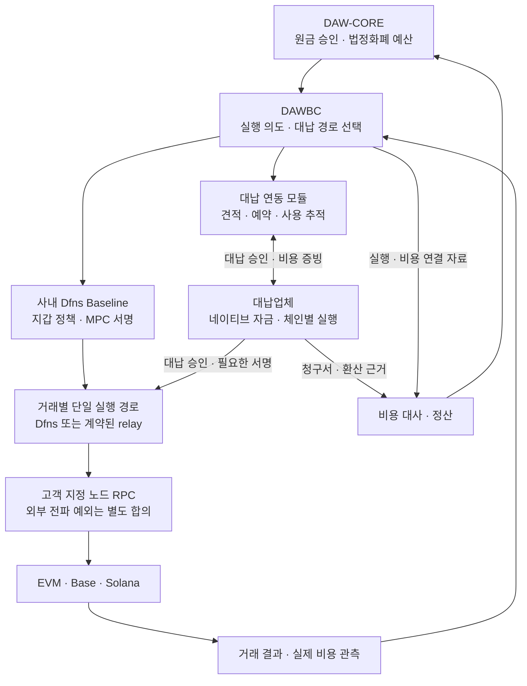

사용자 지갑에 가스용 ETH·SOL을 요구하지 않고, 대납 비용은 법정화폐로 정산하는 구조를 설계한다. 체인에는 실제 네이티브 자산으로 비용을 지불할 주체가 필요하다. 따라서 체인 대납 실행과 법정화폐 견적·정산을 별도 계약으로 둔다. 1차 EVM·ERC-20 검증부터 대납을 포함하고, Base·Solana까지 확장할 수 있게 한다.

운영 주체 선택은 아직 답변 대기다. 아래 주 시나리오는 대납업체가 네이티브 자산을 조달·지불하고 우리 회사가 법정화폐로 정산하는 제안이다. 우리 회사가 대납 지갑을 직접 운영하는 안도 같은 비용 모델에 연결할 수 있지만, 자금 보유·키 관리 책임이 달라지므로 별도 결정으로 남긴다. 고객에게 비용을 재청구할지, 회사가 부담할지도 미정이다.

## 1. 전체 흐름과 책임

대납 연동 모듈은 DAWBC 안의 논리 경계로 시작한다. 처음부터 별도 마이크로서비스가 필요한 것은 아니다. 고객 원금·승인은 DAW-CORE, 지갑 정책·서명은 Dfns, 견적 선택·실행 추적은 DAWBC, 네이티브 자금과 대납 실행은 계약된 지불자가 담당한다. 대납업체에 고객 원금의 포괄적인 이전 권한을 부여하지 않는다.

이 그림은 조합 가능한 설계이며 **Dfns와 임의 외부 대납업체가 이미 연동된다는 뜻이 아니다.** 경로별 서명·전파 호환성을 입증한 뒤 하나를 활성화한다.

## 2. 후보 경로와 제품 지원 경계

Dfns 공개 Fee Sponsors는 대납 지갑에 네이티브 자산을 충전해 사용하는 기능이다. Base·Solana가 지원 목록에 있고, EVM은 EIP-7702 위임을 사용한다. 이 안내만으로 Dfns가 자금을 선지급하고 법정화폐 청구서를 제공한다고 볼 수 없다. **공개 기능과 사내 Baseline 릴리스 지원도 별도로 확인한다.** [Dfns Fee Sponsors](https://docs.dfns.co/features/fee-sponsors)

| 후보 | 기술 경로 | 채택 전 조건 |
|---|---|---|
| Dfns 내장 Fee Sponsor | Dfns 대납 지갑을 등록하고 지원 전송에 연결 | 자금 조달·보유·키 운영 주체 확정. 이 기능만으로 외부업체 법정화폐 정산이 완성되지 않음 |
| 외부 EVM relay | 호환되는 위임 계정·서명 요청을 업체가 실행 | Dfns 계정·위임 코드·서명 형식·정책·nonce·지정 RPC 지원 검증 |
| ERC-4337 Paymaster | smart account의 UserOperation을 bundler가 제출하고 paymaster가 후원 | account 구현·EntryPoint 버전·bundler·서명·예치금·정산 계약. 일반 EOA 송금에 자동 적용되지 않음 |
| Solana 외부 fee payer | 고객 전송 권한자와 업체 fee payer가 같은 최종 메시지에 서명 | 외부 서명 결합·메시지 검증·전파 담당·만료 처리의 Dfns 호환성 확인 |

ERC-4337의 paymaster는 EntryPoint 예치 등을 통해 체인 비용을 후원한다. 법정화폐 계약은 별도다. Dfns의 `UserOperations`라는 이름만으로 임의 ERC-4337 paymaster와 호환된다고 판단하지 않는다. [ERC-4337 Paymasters](https://docs.erc4337.io/paymasters/index.html)

Solana는 전송 권한자와 다른 fee payer를 지정할 수 있고, 양쪽이 거래에 서명한다. fee payer는 SOL을 준비한다. [Solana Fee Abstraction](https://solana.com/docs/payments/send-payments/payment-processing/fee-abstraction)

내장 Fee Sponsors에는 대납 지갑의 정책 제약도 있다. 공개 안내에 따르면 대납 지갑의 `Wallets:Sign`에 차단 또는 승인 대기 정책이 걸려 있으면 대납 전송이 실패할 수 있다. 일반 송신 지갑의 정책과 구분해 사내 릴리스에서 시험한다. 이를 해결하려고 조직 전체의 승인 정책을 해제하지 않고, 대납 전용 지갑의 사용 권한·호출 주체·예산 통제로 요구사항을 충족할 수 있는지 먼저 확인한다.

업체가 고객의 Dfns 대납 지갑을 충전해 주는 방식은 별도 후보다. 법정화폐로 자금을 조달하더라도 고객 통제 지갑이 네이티브 자산을 보유·지불하므로, 업체가 직접 지불하는 운영 모델과 책임이 다르다. 이 차이를 계약서에 명시한다.

## 3. 공통 대납 계약 제안

다음 이름은 **DAWBC 내부 연동 계약 제안**이며 Dfns·대납업체의 실제 API 이름이 아니다.

| 동작 | 입력·결과와 불변 조건 |
|---|---|
| quote | networkId·assetId·송신 계정 모델·목적지·원금·작업 종류로 견적. provider·route·통화·상한·만료·환율 기준·비용 항목 반환 |
| authorize | operationId·intentDigest·quoteId·승인 예산으로 사용 예약. 같은 키는 같은 예약으로 수렴 |
| execute | 확정된 route·대납 권한을 사용. 계정 위임·필요 서명·전파는 선택된 경로의 담당자가 수행 |
| getStatus | 예약 ID·벤더 ID·체인 참조로 사용 여부 회수. timeout 이후 재실행보다 먼저 수행 |
| release | 미사용·실행 불가가 확인된 예약만 해제. timeout만으로 해제하지 않음 |
| reconcile | 실제 비용·업체 청구·환율·조정 내역을 대조. 원금 결과와 별도 정산 상태 관리 |

견적은 네트워크·자산·원금·목적지·송신자·허용 함수·계정 모델·최대 비용에 묶는다. 실행 시에는 최종 서명 대상과 이 조건을 다시 대조한다. Solana는 fee payer·instruction·최근 blockhash를 확정한 메시지를 서명하며, blockhash 교체 등 메시지가 달라지면 필요한 서명을 다시 받는다. 재서명할 때도 기존 거래의 실행 가능성과 결과를 먼저 확인한다.

원금 승인 한도, 법정화폐 최대 비용, 체인 단위 최대 비용, 업체별·고객별·기간별 예산을 함께 적용한다. 예산 예약은 동시 요청에 대해 원자적으로 처리한다. 한 `operationId`의 누적 발생 비용과 미해제 예약 상한, 새 시도의 예약액 합계가 승인 총액을 넘지 않아야 한다. 초기 위임·실패·대체·재시도도 이 총액에 포함하며, 재견적·새 attempt·업체 교체로 한도를 초기화하지 않는다. 이미 발생한 비용으로 전환한 예약액은 이중 합산하지 않고, 결과가 불명인 시도는 예약을 유지한다. 업체가 체인 비용 상한을 강제할 수 없는 경로는 해당 예산 정책을 만족하는 것으로 등록하지 않는다.

법정화폐 상한에는 네트워크 비용뿐 아니라 계약상 서비스비·환산·반올림 항목도 포함한다. 실행 시점의 네이티브 비용 상한만으로 청구 시점의 법정화폐 상한까지 보장하지 않는다. 환율 고정 견적이나 업체의 청구 상한으로 요구를 충족할 수 있는지 확인하고, 확정할 수 없는 경로는 해당 비용 상한을 보장하는 경로로 등록하지 않는다.

예산 초과·업체 장애·지원 불가 시에는 명시적인 보류나 거절을 반환한다. 사용자의 네이티브 잔액을 자동 차감하는 경로로 전환하지 않는다. 업체 교체도 기존 예약과 거래가 더 이상 실행되지 않는다는 증거를 확보한 뒤 수행한다. 같은 송신 주소에서 진행 중인 다른 요청의 nonce 관리와 충돌하지 않는지도 확인한다.

## 4. 거래 상태와 비용 상태는 독립적이다

| 상태 축 | 내부 상태 제안 | 처리 |
|---|---|---|
| 대납 예약 | QUOTED → AUTHORIZED → USED 또는 RELEASED | 만료된 견적은 재견적. 이미 제출된 실행은 견적 만료만으로 취소됐다고 간주하지 않음 |
| 결과 불명 | UNKNOWN | 사용 여부·전파 여부 대사, 예산·원금 잠금 유지와 운영 경보 |
| 비용 정산 | OBSERVED → INVOICED → MATCHED → SETTLED | 차이는 DISPUTED로 분리. 정정 증빙은 원본과 연결 |
| 자산 이전 | 기존 거래 상태 계약 | 전송 성공인데 청구서가 늦게 와도 원금 결과를 되돌리지 않음 |

실패한 거래에도 비용이 발생할 수 있다. 최초 계정 위임, 대체 거래, 승인된 재시도, 실패 실행의 비용을 각각 체인 참조와 연결한다. 여러 시도를 한 업무 요청에 연결하되 같은 체인 비용을 두 번 합산하지 않는다. 한 bundler 거래에 여러 업무가 들어 있으면 전체 거래 비용을 각 업무에 반복 청구하지 않고 개별 사용량·배분 근거를 받는다.

## 5. 비용 원장과 청구 대사

`FeeCharge`는 operationId·attemptId·provider·networkId·chainReference·비용 항목·네이티브 최소 단위·정산 통화·환율 출처/시점·환산 금액·invoiceId/lineId·관측 증빙을 가진다. 견적, 실제 관측 비용, 계약상 청구 금액을 각각 보존한다. 표시용 USD 환산값이나 스테이블코인 symbol을 정산 근거로 쓰지 않는다.

| 비용 항목 | 대사 기준 |
|---|---|
| 네트워크 실행비 | 체인별 실제 fee 데이터와 업체 증빙. L2 부가 비용 등 전체 항목을 확인하고 `gasUsed × gasPrice` 하나로 모든 체인을 계산하지 않음 |
| 업체 서비스비 | 정액·건별·구간·실패/재시도 과금 기준을 계약 버전과 함께 기록 |
| 계정 생성 자금 | Solana token account 생성 등의 rent-exempt 자금을 실행비와 분리. 잔존·회수 가능 금액과 회수 수익 귀속 명시 |
| 법정화폐 환산 | 계약 통화, 기준 환율·시점, 반올림·최소 청구 단위, 조정 내역 |

Solana의 rent-exempt 최소 잔액 조회는 별도 RPC로 제공된다. 이를 전액 소모된 네트워크 수수료로 취급하지 않는 비용 모델을 제안한다. [getMinimumBalanceForRentExemption](https://solana.com/docs/rpc/http/getminimumbalanceforrentexemption)

DAWBC는 비용 증빙과 실행 연결을 제공하고 DAW-CORE·재무 정산 계층이 비용·미지급·지급 내역을 관리한다. 비용 차이가 있어도 고객 원금 원장을 임의로 수정하지 않는다. 지급 주기·통화·고객 재청구·세금 처리는 계약 확정 사항이다.

## 6. 1차 인수 시험과 채택 기준

- 가스 잔액이 없는 사용자 지갑에서 허용된 ERC-20 전송 성공. 지정한 지불자만 실제 가스 지불.
- 같은 요청 동시 제출·업체 응답 유실·Dfns 응답 유실에서도 중복 원금 이전과 중복 예약 없음.
- 견적 만료·가스 급등·환율 변동·예산 경쟁·업체 잔액 부족·업체 장애 시 승인 범위를 벗어난 실행 없음. 반복 실패·재견적에도 operation 전체 비용 한도가 초기화되지 않음.
- 내장 대납 지갑의 서명 정책 때문에 실패하는 경우를 재현하고, 고객 승인·대납 권한을 유지한 지원 구성을 검증.
- bundle은 성공했지만 개별 UserOperation이나 relay 내부 송금이 실패한 경우, 원금 실패와 발생 비용을 분리해 처리.
- 목적지·원금·호출 내용이 바뀐 대납 요청 거절. 계정 위임 코드·대납 권한 변경 통제 검증.
- revert·재시도·대체 거래·초기 위임 비용을 원금과 분리해 대사. 묶음 거래 비용 중복 합산 없음.
- Base 추가 시 확정·전체 수수료 증빙, Solana 추가 시 공동 서명·blockhash 만료·token account 생성·중복 전송 검증.
- 복구된 로컬 DB에 없는 외부 예약·실행을 조회해 회수하고, 기존 요청 키로 연결하기 전에는 새 예약·전송을 하지 않음.
- 업체가 실제 사용하는 조회·시뮬레이션·전파 RPC를 확인. 고객 노드를 벗어나는 경로는 명시적인 연결 계약 없이 활성화하지 않음.

외부 대납의 호환성이 확인되지 않으면 무가스·법정화폐 정산 요구가 충족됐다고 표시하지 않는다. 이때에도 모델·어댑터 계약·실패 시나리오 설계는 진행할 수 있다.

## 연결 문서

- [멀티체인 모델](01-core-contracts.md#1-계정주소자산-모델), [API 대응표](01-core-contracts.md#4-dfns-api-대응), [RPC 연결 명세](02-node-rpc-spec.md)
- [담당자 질문 Q06·Q07](../Dfns/04-vendor-questions.md): 사내 지원·외부 대납·정산·다중 자산 확인
- 공식 자료 확인일: 2026-09-14. 운영 주체·내부 API·비용 모델·인수 기준은 설계 제안.
