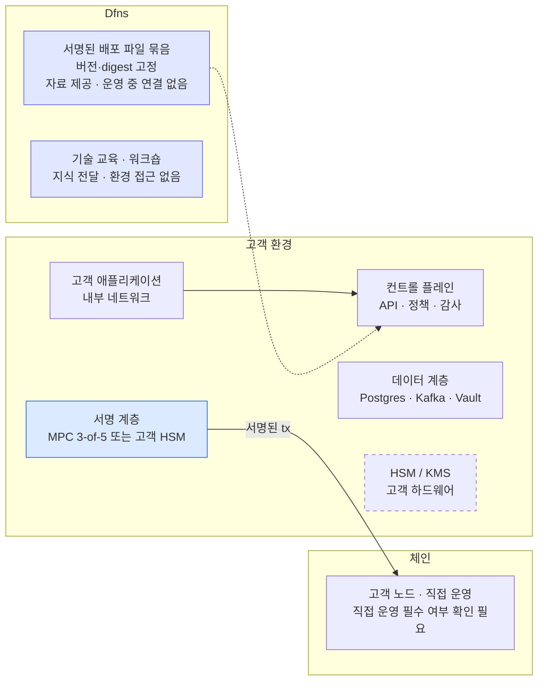
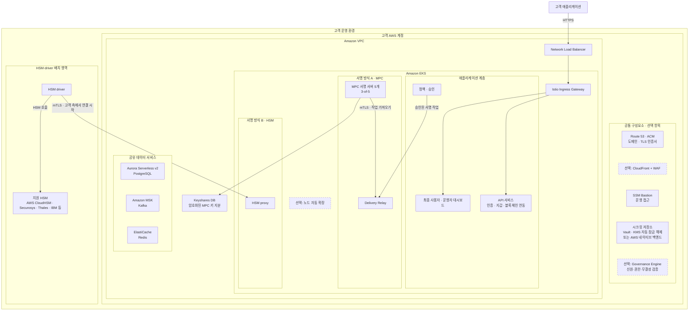
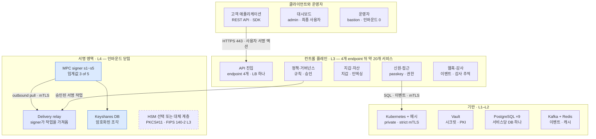
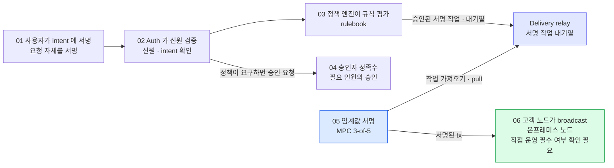

Dfns 플랫폼 전체를 고객 소유 AWS 계정에서 운영하는 완전 온프레미스 모델을 설명한다. 인증·사용자 관리, 멀티체인 지갑, 서명·키 관리, 승인·컴플라이언스, 블록체인 연동·인덱싱, 운영자 대시보드의 배치와 운영 요건을 다룬다.

## 문서 범위

- 인프라·SRE·보안 엔지니어를 위한 구성 설명이다. 세부 설치 절차는 계약한 릴리스의 배포 안내서로 확인한다.
- 기능·보안 보장·로드맵은 Dfns의 설명이며, 우리 환경에서 구현·배포·검증을 완료했다는 뜻은 아니다. 현재 지원 여부와 계약 조건은 별도 확인한다.
- [Governance Engine](01-governance-engine.md)은 선택 구성요소다. 시크릿 전달·서비스 인증·초기화 방식의 차이는 [배포 백엔드 비교](02-deployment-backends.md)에서 다룬다.
- 사내 데이터센터 배치는 [Baseline 인프라·구성도](03-baseline-datacenter-design.md)에 정리한 별도 설계안이다.

## 배치 형태와 운영 주체

Dfns 는 "누가 무엇을 운영하는가" 로 갈리는 여러 배치 형태를 지원한다. 서명 인프라(키를 보관하고 서명을 만드는 계층)와 플랫폼(API·대시보드)이 각각 Dfns 에 있을 수도, 고객에게 있을 수도 있다.

| 형태 | 서명 인프라 | 플랫폼 (API·대시보드) |
|---|---|---|
| Dfns 호스팅 (SaaS) | Dfns | Dfns |
| Hybrid MPC, shared quorum | 분할. 고객이 일부 MPC signer 운영, 나머지는 Dfns | Dfns |
| Hybrid MPC, full quorum | 고객이 모든 MPC signer 운영 | Dfns |
| Client-hosted HSM | 고객 HSM + 고객이 운영하는 driver. proxy 는 Dfns 운영 | Dfns |
| **완전 온프레미스 (이 문서)** | 고객 (클러스터 안 MPC 또는 고객 HSM) | 고객 |

완전 온프레미스에서는 API 서비스, 대시보드, 데이터베이스, 메시지 버스, 시크릿 저장소, 서명 계층이 전부 고객 AWS 계정에서 실행된다. 서명 계층은 MPC 와 HSM 두 선택지가 있고, 둘 다 이 문서 범위다. Hybrid 형태들은 별도 가이드가 있다.

**운영 중 Dfns 연결 불필요.** Dfns는 “After delivery” 이후 환경이 Dfns 인프라에 의존하지 않고 실행된다고 설명한다. Dfns 와 연결 없이 운영되고, 컨테이너 이미지는 오프라인으로 고객 레지스트리에 들여올 수 있다.

## 전체 배치 구성

완전 온프레미스에서는 모든 런타임 구성요소가 고객 환경 안에 있고, Dfns는 서명된 배포 파일 묶음을 제공하고 기술 교육(워크숍)으로 지식을 전달한다. 원문은 교육 내용·일정·진행 방식을 구체적으로 설명하지 않는다. 운영 중 Dfns와 연결할 필요는 없다. 대비용으로 그린 SaaS 와 Hybrid MPC 는 서명 계층과 플랫폼의 실행 위치가 다르다.

그림은 고객이 노드를 직접 운영하는 구성을 보여 준다. 활성화한 체인마다 RPC 엔드포인트가 하나 필요하다. 고객의 노드 직접 운영이 필수인지는 제공된 자료만으로 확정할 수 없다.

파란색은 서명 계층, 점선 상자는 HSM/KMS 선택 항목, 보라색은 Dfns가 제공하는 배포 파일과 기술 교육이다. 연결선은 원문 배치도에 표시된 관계만 옮겼다. Dfns 호스팅 형태는 고객 앱이 HTTPS 443 으로 Dfns 컨트롤 플레인에 서명된 액션을 보내고 MPC signer 5개(3-of-5)가 Dfns 관리하에 실행되는 구성이다. Hybrid MPC 는 고객이 party 1~3 을 자기 keyshare DB 와 함께 운영하고 Dfns 가 party 4~5 를 운영하며 signer 가 outbound mTLS 로만 작업을 가져오는 구성이다.

## 아키텍처의 네 계층

배치는 순서가 정해진 4개 인프라 계층으로 구성된다. 각 계층은 별도의 상태 파일(state)을 관리하는 Terraform root이며, 뒤 계층이 앞 계층의 출력값(output)을 읽기 때문에 순서가 고정되며 도구가 이를 강제한다. 첫 계층 이후의 구성은 표준 Kubernetes를 사용한다. 애플리케이션은 Helm chart와 컨테이너 이미지로 제공돼 첫 계층이 만든 클러스터에 배포된다.

| 계층 | 프로비저닝 대상 |
|---|---|
| L1 · Substrate | VPC 와 네트워킹, EKS 클러스터, 관리형 PostgreSQL(Aurora Serverless v2), 관리형 Kafka(MSK), 관리형 Redis(ElastiCache), Route53 호스팅 존과 ACM TLS 인증서, SSM bastion, 선택으로 CloudFront CDN + WAF |
| L2 · Platform | Istio 서비스 메시(strict mutual TLS)와 ingress gateway, 시크릿 저장소(raft HA + AWS KMS auto-unseal 의 Vault, 또는 AWS 네이티브 시크릿 백엔드), 네임스페이스와 RBAC, storage class, 레지스트리 pull secret, 선택으로 노드 autoscaling |
| L3 · Product | 공유 PostgreSQL 위의 서비스별 데이터베이스, Kafka 토픽과 접근 통제, 시크릿 저장소 초기 데이터 입력, 플랫폼 Helm umbrella release(모든 애플리케이션 서비스, 초기화 job, 대시보드) |
| L4 · Signing | 선택한 서명 계층. 클러스터 안 MPC signer 클러스터, 또는 고객 HSM 앞의 HSM proxy + driver 쌍. 선택으로 governance engine |

계층 순서가 곧 배포 경로다. 도구는 각 계층의 작업을 자동으로 실행하지만, 고객이 직접 처리해야 하는 단계에서 멈춘다. 기반 인프라, 플랫폼 공통 기반, 애플리케이션, 키 순서다.

### AWS 구성도 — 선택 항목과 두 서명 방식

Vault와 MPC를 사용하는 Baseline의 구성요소 관계는 [Baseline 구성도](03-baseline-datacenter-design.md#2-전체-구성)를 참고한다.

아래는 고객 AWS 계정에서 운영하는 전체 플랫폼 구성이다. **API와 대시보드도 고객 AWS 계정에서 실행된다.** 서명 계층은 MPC 또는 HSM 중 하나를 선택하며, Governance Engine은 별도의 선택 구성요소다.

점선 테두리는 선택 항목이다. 연결선은 주요 관계만 표시했다. CloudFront·WAF 적용 시의 상세 경로와 Governance Engine의 구체적인 연결 위치는 표시하지 않았다. HSM·driver의 별도 영역은 구성요소를 구분한 것이며, 고객 AWS 계정 밖에 반드시 배치한다는 뜻은 아니다. 원문은 driver를 클러스터 밖이나 VPC 밖에도 배치할 수 있다고 설명한다.

**대체 서명 방식**은 MPC 대신 HSM으로 서명하는 것을 뜻한다. 두 방식을 함께 사용해야 한다는 의미는 아니다.

| 서명 방식 | 키 보관과 서명 |
|---|---|
| MPC | 키 지분을 여러 서명 서버에 나누고 공동으로 서명한다. 이 문서의 기본 구성은 5개 서버 중 3개가 참여한다. |
| HSM | 키를 HSM 내부에서 생성하고 HSM에서 서명한다. HSM proxy·driver가 연결을 담당하며, 암호화된 키 데이터는 고객이 운영하는 PostgreSQL keystore DB에 보관한다. |

서명 방식별 상세 조건과 지원 HSM은 ‘서명 계층 선택’에서, Governance Engine의 검증 범위는 [별도 문서](01-governance-engine.md)에 정리했다.

## 애플리케이션 서비스와 공유 인프라

### 애플리케이션 서비스

Product 계층은 Helm umbrella release 하나로 약 20개 workload 를 배포한다.

- **핵심 API 서비스 12개** — 인증과 조직·사용자 생애주기(WebAuthn passkey 기반), 지갑(생애주기·이체·broadcast), signer 조정(서명 계층 구동), 정책(승인·컴플라이언스 규칙), 블록체인 연동(멀티체인 트랜잭션 구성·수수료·네트워크 메타데이터), 블록체인 인덱싱(블록 수집과 트랜잭션 확정), admin, webhook, alias, 시세, 메트릭. 여러 서비스가 같은 이미지에서 cron 이나 indexer workload를 함께 실행한다.
- **초기화 job 2개** — 데이터베이스 스키마 마이그레이션, 그리고 issuer key 와 초기 staff 조직을 만드는 1회성 플랫폼 bootstrap.
- **대시보드 2개** — 최종 사용자 대시보드, 운영자용 staff 대시보드.

모든 애플리케이션 이미지는 distroless Node.js 기반이고 non-root 사용자로 실행되며 arm64(Graviton 계열 노드)용으로 배포된다. 릴리스의 모든 서비스가 같은 버전 번호를 갖는 단일 플랫폼 버전이고, 이미지는 digest 로 고정된다.

### 공유 인프라

- **PostgreSQL** — 서비스 도메인별 논리 DB 9개(auth, permissions, wallets, keystores, policies, blockchain integrations, aliases, markets, events).
- **Kafka** — 플랫폼 이벤트 버스. 토픽과 서비스별 자격증명은 Product 계층에서 프로비저닝. indexer 와 cron workload 가 Kafka consumer 다.
- **Redis** — 캐시 계층.
- **시크릿 저장소** — Vault 또는 AWS 네이티브 백엔드. day 0 에 고른다. 서비스 시크릿, 서비스별 transit 또는 KMS 키, Vault 일 때는 서명 계층이 쓰는 PKI mount 를 보관.
- **Istio** — 모든 서비스 사이 클러스터 내 mutual TLS(strict) 와 ingress gateway. 앞에 AWS NLB.

## 서명 계층 선택

서명 계층은 키를 보관하고 서명을 만드는 구성요소다. 온프레미스 모델은 day 0 에 고르는 두 선택지와 선택 구성요소 하나를 제공한다.

**MPC, 클러스터 안.** signer party 5개와 3-of-5 서명 임계값(다른 구성은 협의로 지원). party 사이에 프로토콜 라운드를 전달하는 delivery relay 가 함께 있다. 키 조각은 프로비저닝 시 분산 키 생성으로 signer 안에서 만들어지므로 완전한 개인키가 한곳에 존재하는 순간이 없다. 각 party 의 인증서는 고객 시크릿 저장소의 전용 PKI mount 에서 발급된다.

**HSM.** 클러스터 안 hsm-proxy 와 고객 HSM과 함께 배치하는 hsm-driver. driver 는 보통 별도 amd64 호스트에 두고, 클러스터 밖이나 VPC 밖에도 둘 수 있다. driver가 proxy에 상호 TLS 인증으로 접속하므로 HSM 쪽으로 들어오는 연결은 필요 없다. 지원 HSM 은 Securosys Primus(온프레미스 어플라이언스 또는 CloudsHSM 서비스), Thales Luna, AWS CloudHSM, IBM EP11 또는 HPCS 급 장비다. 지갑 개인키는 HSM 안에서 생성되고, HSM 밖으로 추출할 수 없는 root wrap key로 AES-GCM 암호화한 데이터(blob) 형태로만 고객이 운영하는 PostgreSQL keystore DB 에 저장된다. ECDSA secp256k1 과 Ed25519 서명을 모두 지원한다.

**Governance engine, 선택.** 거버넌스 결정에 자기 키로 서명하는 추가 승인·증명 구성요소. HSM 계층이 있으면 그 키도 HSM 으로 래핑된다.

**이 완전 온프레미스 모델의 키 보관.** 지갑 서명키는 플랫폼 API 서비스가 보관하지 않고 Dfns도 보관하지 않는다. MPC 에서는 signer party 들에 조각으로 나뉘고, HSM 에서는 HSM 안에 있으며 keystore DB 에는 래핑된 blob 만 들어간다.

## 런타임 구성요소와 연결

런타임 구성요소를 영역별로 나누어 표시했다. 네 영역 전부 고객 환경 안에 있고, 서명 영역은 들어오는 연결을 받지 않는다. signer가 delivery relay에 mTLS로 접속해 서명 작업을 가져온다.

파란색은 MPC signer와 키 조각 DB, 보라색 relay는 서명 작업을 전달하는 구성요소다. HSM은 원문과 같이 점선으로 표시한 선택 또는 대체 계층이며, MPC signer와 연결된 구성으로 그리지 않았다.

## 신뢰 도메인과 키 관리

플랫폼의 암호 자료는 서로 독립인 네 신뢰 도메인으로 나뉜다.

| 신뢰 도메인 | 자료 | 있는 곳 |
|---|---|---|
| 지갑 서명키 | ECDSA secp256k1 / Ed25519 | MPC: signer party 들에 조각으로 분산. HSM: 고객 HSM 안, keystore DB 에는 래핑된 blob 만. 플랫폼 API 도 Dfns 도 보관하지 않음 |
| 플랫폼 인증키 | Ed25519 토큰 서명(issuer) 키 | 고객 시크릿 저장소(Vault KV 또는 AWS Secrets Manager), 고객 KMS 로 envelope 암호화. auth 서비스만 읽음 |
| 서명 계층 mutual TLS | 환경별 private CA 와 intermediate, 구성요소별 ECDSA P-256 leaf 인증서 | CA·intermediate 는 시크릿 저장소, leaf 는 서명 계층 pod 에 마운트. leaf 의 common name 이 구성요소 신원을 담고 TLS handshake 에서 강제됨 |
| 서비스 메시 | Istio workload 인증서(단기) | 클러스터 내 CA, 자동 로테이션 |

**키 보관 시 확인할 사항.** 첫째, Vault recovery key 와 root token(초기화 때 받음)을 가진 쪽이 시크릿 저장소를 통제한다. 고객은 배포 과정에서 이 값들을 직접 보관해야 하며 root token 은 day 0 뒤 폐기한다. 둘째, HSM 경로에서는 모든 지갑 키를 복구하려면 root wrap key와 keystore DB가 모두 필요하며, 이 둘이 복구에 필요한 자료의 전부다. 둘 다 백업해야 한다. 키는 HSM 네이티브 파티션 백업이나 복제로, DB 는 표준 PostgreSQL 백업으로. HSM 백업 없이 root wrap key 를 잃으면 래핑된 모든 키가 영구히 복구 불가다.

**고객 보관 암호화 백업 (MPC).** MPC 배치에는 선택 백업 계층이 있다. 모든 키 조각을 고객이 생성해 오프라인에 보관하는 공개키로 추가 암호화해 버전 관리되는 S3 버킷에 쓴다. 이 백업을 사용하면 Dfns에 의존하지 않고 복구할 수 있다.

## 배포 패키지와 이미지 제공

배포에 필요한 파일은 버전이 지정되고 서명된 묶음 하나로 제공된다.

- **배포 안내서와 운영 절차서** — 오프라인으로 읽을 수 있는 deployment handbook 과 주제별 runbook(day-0 walkthrough, 연결성, DNS 위임, Vault 초기화, 서드파티 시크릿, HSM 키 관리 절차, 조직 bootstrap, day-2 운영, 진단, sizing).
- **Terraform root 와 module** — 4개 계층 root 와 의존하는 모든 module이 번들에 포함돼 있고, preflight 검사와 계층 순서를 강제하는 Makefile 이 있다. 서드파티 provider 는 egress 제한 환경용으로 번들에 미러링할 수 있다.
- **Helm chart** — 플랫폼 통합 차트(umbrella)와 서명 계층 chart(signer, HSM, HSM driver, governance, 초기화), 모두 번들에 포함.
- **Values 템플릿** — 주석이 달린 terraform.tfvars.example과 고객 설정용 values 초기 파일. 고객이 편집하는 파일은 이 둘뿐이다.
- **이미지 manifest** — 모든 컨테이너 이미지의 레지스트리 경로, tag, sha256 digest. 릴리스 시점에 기록된다.
- **무결성 자료** — 번들 모든 파일의 서명된 체크섬 목록, 검증용 릴리스 공개키, 각 컨테이너 이미지 서명을 검증할 cosign 공개키.

**이미지 배포.** 환경별로 세 채널 중 하나를 고른다. Dfns 제공 레지스트리 자격증명(pull-through), 고객 아티팩트 저장소로 복제, 완전 오프라인 OCI tarball 을 제공 스크립트로 고객 레지스트리에 import. 자료는 에어갭 운영 환경에 오프라인 채널을 권장한다.

**업그레이드**도 같은 방식이다. 릴리스마다 전체 파일이 담긴 새 번들을 제공한다. 압축을 풀기 전에 검증한 뒤 계층별로 적용한다.

## 배포 절차

배포는 운영자가 단계별로 확인하고 진행하는 절차다. 도구는 각 계층의 작업을 자동으로 실행하고, 고객이 직접 처리해야 하는 단계에서 멈춘다. 사전 요건이 준비돼 있으면 첫 배포는 1~2영업일이 걸린다고 자료는 설명한다.

| 순서 | 단계 | 내용 |
|---|---|---|
| 01 | Preflight | 제공된 검사가 자격증명, 리전 서비스 지원, quota, 레지스트리 접근, 도구 버전, 도메인을 생성 전에 검증 |
| 02 | L1 apply | Substrate 생성. 가장 오래 걸리는 단계로 관리형 Kafka 클러스터가 시간의 대부분. Terraform 이 nameserver 4개를 출력 |
| 03 | DNS 위임 · **PAUSE 1** | 고객이 배치 도메인을 그 nameserver 로 위임. 인증서 검증과 TLS 사용을 위한 필수 단계 |
| 04 | L2 apply | 서비스 메시, ingress, 시크릿 저장소 |
| 05 | 연결성 · **PAUSE 2** | private 클러스터 endpoint 로의 경로 확인. 제공된 SSM bastion 터널이 기본, 고객 VPN 이나 VPC 내 runner 도 가능 |
| 06 | Vault 초기화와 키 보관 · **PAUSE 2B** | 고객이 vault operator init 을 실행하고 recovery key 와 초기 root token 을 즉시 고객의 키 보관 계획에 따라 보관. root token 은 PAUSE 3 에서 한 번 더 쓰고 폐기 |
| 07 | L3 stage 1 | 데이터베이스, 토픽, 시크릿 초기 데이터 입력 |
| 08 | 서드파티 시크릿 · **PAUSE 3** | 고객만 줄 수 있는 자격증명을 시크릿 저장소에 채움. 체인 RPC endpoint, 이메일 provider, OIDC 클라이언트 설정, 선택 연동. 계약별 목록이 번들에 있고, 필수 항목이 없으면 다음 단계가 plan 을 거부 |
| 09 | L3 stage 2 | 애플리케이션 배포. 스키마 마이그레이션, 플랫폼 bootstrap, umbrella release. 검증은 api.<도메인> 응답, 두 대시보드 로드, 첫 staff 관리자의 passkey 등록 |
| 10 | L4 apply | 서명 계층. MPC 는 apply 한 번. HSM 은 **PAUSE 4 · 인증서 발급 절차** 추가. 고객이 제공 스크립트로 CSR 을 만들고(개인키는 고객 보관을 떠나지 않음) Dfns 가 환경별 CA 로 서명하며, 고객이 서명된 인증서를 넣은 뒤 두 번째 apply. HSM 경로에서는 첫 driver 시작 때 root wrap key 생성·백업 절차도 수행. driver 가 HSM 파티션에 root key 를 자동 프로비저닝하고, 지갑이 하나라도 생기기 전에 고객이 백업 |
| 11 | Keystore 등록과 전체 흐름 검증 | staff 대시보드에서 서명 클러스터를 key store 로 등록(WebAuthn 게이트). 조직을 연결하고, 지갑을 만들어 트랜잭션 하나를 끝까지 서명해 배포 상태를 검증 |

**완료 기준.** 고객이 운영하는 환경에서 지갑이 만들어지고 트랜잭션 하나가 끝까지 서명됐을 때만 배포가 끝난 것으로 본다.

## 거래 처리와 여섯 개의 통제 지점

배포 절차 마지막의 전체 흐름 검증에서 확인하는 경로다. 원문은 모든 처리 단계가 고객 환경 안에 있고 적용되는 통제 단계를 건너뛸 수 없다고 설명한다. 승인자 단계는 정책이 요구할 때만 적용된다. 서명 작업은 MPC signer가 relay에 접속해 가져온다.

PDF 는 사용자 서명, 신원 검증, 정책 평가, 정족수 승인, 임계값 서명, 노드 broadcast 를 여섯 통제 지점으로 세고, 그중 서명 단계를 "custody-critical" 로 표시했다. 승인자 단계는 정책이 요구할 때만 들어간다.

signer에서 relay로 향하는 화살표는 작업을 가져오기 위한 접속 방향이다. 승인자의 응답 경로는 원문에 그려져 있지 않아 연결선을 추가하지 않았다. 노드 직접 운영이 필수인지는 별도 확인이 필요하다.

## 고객이 준비할 인프라와 설정

- EKS 와 MSK 를 모두 제공하는 리전의 전용 AWS 계정, quota 여유 포함. 참조 배치는 작은 arm64 노드 그룹에서 on-demand vCPU 약 32개를 쓰고, HSM 경로는 driver 쪽 구성요소용 amd64 용량이 추가된다.
- 상위 DNS 존을 고객이 통제하는 도메인 또는 위임된 서브도메인. 환경이 도메인 자체(apex)와 와일드카드(wildcard)를 제공하므로 전용으로 둔다.
- 계층별 배포용 신원(인증 주체). 계층마다 별도의 배포용 신원 하나와 운영자용 읽기 전용 신원. 초기 배포(day 0)는 넓은 권한으로 실행하고, 최소 권한으로 줄이는 것은 day 0 이후의 문서화된 보안 강화 단계다.
- Terraform state 백엔드. 버전 관리·KMS 암호화된 S3 버킷 하나. 서명 계층의 state 에는 전용 KMS 키가 필요하다.
- 운영자 워크스테이션. macOS 또는 Linux 에 표준 도구(AWS CLI v2, OpenTofu 또는 Terraform, kubectl, Helm, jq, dig, SSM session plugin). bootstrap 스크립트가 설치하고 preflight 가 검증한다.
- 고객이 소유하는 시크릿. Vault 보관 값, 파일이나 state 가 아니라 고객 시크릿 매니저에 두는 DB 마스터 자격증명, pull-through 채널을 쓸 때의 레지스트리 자격증명, 외부 시스템 연동에 필요한 서드파티 자격증명.
- HSM 경로 한정. 프로비저닝된 HSM(파티션, 사용자, PIN), 벤더 PKCS#11 클라이언트 설정, driver 호스트, keystore DB 용 PostgreSQL 인스턴스, 그리고 필수 요건인 root wrap key 백업 방안.

**Day-0 결정 7개.** 서명 프로필(MPC, HSM, governance 포함 여부), 컴퓨트 모델(정적 노드 그룹 또는 autoscaling), 도메인 시나리오, 네트워크 경로, 이미지 레지스트리 채널, 선택인 CloudFront + WAF edge, 선택 기능(메트릭, captcha). 생성 전에 결정 시트에 기록한다.

**되돌릴 수 없는 결정 하나.** 시크릿 백엔드(Vault 대 AWS 네이티브)는 day 0 에 고정되고 백엔드 간 마이그레이션이 없다.

후속 제공 자료인 [배포 백엔드 비교](02-deployment-backends.md)에 따르면 기본 배포 프로필은 Baseline(Vault + SCRAM, 최소 릴리스 1.929)이다. Enterprise AWS-Native는 Vault 없이 Secrets Manager·KMS·IAM 및 cert-manager를 사용하고, 명시적 설정 override와 릴리스 1.935 이상이 필요하다. AWS-Native의 시크릿 bootstrap 흐름은 Vault 구성과 다르며, Vault 초기화 절차를 그대로 적용하는 근거가 아니다. 이 자료도 백엔드 간 마이그레이션 절차는 제공하지 않는다.

## 외부 시스템 연동

이메일과 체인 endpoint 하나 이상은 사실상 사전 요건이고, 나머지는 선택이며 provider 에 묶이지 않는다.

| 연동 | 용도 | 비고 |
|---|---|---|
| 이메일 (SMTP 또는 SendGrid) | 가입·복구·로그인 메일. 온보딩 사전 요건에 해당 | 고객 relay 와 STARTTLS 또는 TLS 로 동작. 별도 온프레미스 이메일 가이드 있음. 이메일 설정 전 온보딩을 위한 비상 절차(break-glass) 문서 제공 |
| OIDC | 고객 IdP 로 위임 로그인 | OIDC 강제 조직은 가입 메일 없이 온보딩. admin 매핑 claim 을 가진 첫 IdP 사용자가 조직 admin |
| 체인 RPC endpoint | 활성화한 블록체인 네트워크당 하나 | 자격증명이 포함된 endpoint 는 설정 파일이 아니라 시크릿 저장소에 |
| 시세·가격 API | 수수료 추정, 가격, 스테이킹 데이터 | 선택. provider 무관 설정 |
| 웹훅 | 고객 시스템으로 이벤트 전달 | 내장 서비스 |
| 관측 | 구조화 JSON 로그, OTLP trace export | 로그는 컨테이너 방식으로 고객 SIEM 에, OTLP exporter 는 고객 collector(Datadog 또는 OpenTelemetry 호환)로. Prometheus·Grafana 는 번들에 없음 |
| Captcha (reCAPTCHA) | 로그인 보호 | 선택 |
| Slack | 운영 알림 | 선택 |
| 컨테이너 레지스트리 | 이미지 공급 | 고객 레지스트리(오프라인 import), 복제 대상, 또는 Dfns 제공 pull 자격증명 |

## 배포 후 운영

PDF는 환경 가동 후의 운영이 소수의 정해진 작업으로 구성되며, 운영팀이 Dfns 인프라에 의존하지 않고 수행하도록 설계됐다고 설명한다.

- **업그레이드** — 릴리스마다 새 서명 번들. 검증 뒤 번들에 포함된 module과 chart 를 통째로 교체하고 계층별로 plan·apply. 애플리케이션만 올리는 버전 변경은 values 변경이다.
- **롤백** — 버전 관리되는 Terraform state 와 digest 고정 이미지. runbook 이 인프라·애플리케이션 롤백을 다루고 스키마 마이그레이션에 롤백 스크립트가 함께 제공된다.
- **인증서 로테이션** — edge 인증서는 DNS 위임이 유지되면 자동 갱신. 서명 계층 CA·leaf 로테이션은 시크릿 저장소 절차 뒤 pod 재시작. 메시 인증서는 자동.
- **Vault 보안 관리** — Vault 구성에서는 day 0 뒤 초기 root token 폐기, 범위 제한 운영자 토큰과 Kubernetes 인증으로 전환, 감사 로깅 활성화.
- **진단** — 흔한 실패 유형(초기화 job 실패, DB TLS 신뢰, 시크릿 저장소 접근, 노드 아키텍처 불일치)을 다루는 runbook. 모든 서비스가 서로 연관 지어 분석할 수 있는 구조화 로그를 낸다.
- **HSM 이중화** — 운영 환경은 벤더 네이티브 복제로 같은 root wrap key 를 가진 HSM 쌍에 driver 2개 이상을 연결해 운영한다. driver 마다 자기 leaf 인증서, keystore DB 는 공유. pull 모델이라 로드밸런서 없이 부하가 나뉜다.

**정기 장애 전환 시험.** driver 하나나 HSM endpoint 하나에 장애가 나도 서명은 계속된다. 이 장애 전환(failover)을 정기적으로 시험하는 것이 이중화 구성을 믿을 수 있게 하는 가장 단순한 방법이라고 PDF 는 권한다.

## 도입 제약과 운영 가이드

### 아키텍처 검토 시 고려할 제약

- Kafka 와 Istio 는 필수다. 플랫폼 메시징은 Kafka 만, ingress 와 클러스터 내 mutual TLS 는 Istio 네이티브. 교체나 유예 불가.
- Terraform 계층이 배포 경로다. 렌더링된 Kubernetes manifest 를 검사·보안 검토용으로 뽑을 수는 있지만, chart 만으로 설치하면 DB·토픽·시크릿·DNS 를 프로비저닝할 수 없고, 직접 만든 클러스터에 배포 패키지를 설치하는 것은 지원 경로가 아니다.
- 구성요소마다 사용하는 CPU 아키텍처가 다르다. 애플리케이션 계층은 arm64 전용, HSM driver 구성요소는 amd64. HSM 경로면 둘 다 노드 용량을 계획해야 한다.
- 시크릿 백엔드는 되돌릴 수 없다.
- edge TLS 는 인증서 검증을 위해 실제 DNS 위임이 필요하다. edge TLS 없는 내부 전용 도메인이 지원되는 대안이다. 이는 클러스터 내부의 strict mTLS를 없앤다는 뜻은 아니다. 내부 API 접속의 TLS 구성은 배포 시나리오별로 확인한다.
- 최소 권한 적용은 초기 배포 후 보안 강화 단계에서 진행한다.
- 이 PDF 버전에서는 HSM 서명 경로의 HD 지갑을 지원하지 않는다고 명시한다.
- 에어갭·오프라인 서명 계층과 HSM root key 로테이션은 셀프서비스 기능이 아니라 계약 범위에서 다루는 절차다. 도입 범위를 협의할 때 Dfns 솔루션 엔지니어에게 요청해야 한다.

### 관련 가이드

| 가이드 | 내용 |
|---|---|
| DFNS Outbound Email On-Premise | 고객 SMTP relay 에 대한 발신 이메일 설정(full·Essentials 에디션) |
| User Onboarding Without Email | 고객이 운영하는 DB 에 가입 코드를 직접 넣는 break-glass 온보딩 |
| Deployment handbook (번들 안) | 초기 배포의 기준이 되는 단계별 절차, 계층별 runbook, 진단 |

필요한 자원 규모(sizing), 비표준 구성, 추가 HSM 벤더, 컴플라이언스 설문 등 이 개요에서 확정하지 않은 사항은 Dfns 솔루션 엔지니어에게 문의하도록 안내한다.

## 사내 데이터센터 적용 설계

AWS를 사용하는 이 원문과 별도로, [Baseline 사내 데이터센터 인프라 설계안](03-baseline-datacenter-design.md)을 작성했다. 비AWS 설치 번들·이미지 아키텍처·외부 Vault·Keyshares 저장소의 지원 여부를 확인한 뒤 적용할 제안이다.

## 내부 검토 항목

- Full on-premise를 선택할 경우, 사용할 국내 AWS 리전의 EKS·MSK 제공 여부와 계정 할당량이 배포 요건을 충족하는가? AWS 공식 자료와 고객 계정에서 내부적으로 확인한다.
- Hybrid MPC, full quorum을 선택할 경우에도 고객 측 EKS·MSK가 필요한가? 이 모델에서는 모든 MPC 서명 서버는 고객이, API·대시보드는 Dfns가 운영한다고 구분한다. Full on-premise의 요건을 그대로 적용하지 않고, 해당 모델의 서명 인프라 요건을 기준으로 검토한다.

## 추가 확인 사항

- “After delivery”가 자료 제공 시점인지 설치 완료 시점인지
- 고객이 블록체인 노드를 직접 운영해야 하는지
- MPC "다른 토폴로지" 의 구체 구성과 조건
- L4에 속하는 Governance Engine의 구체적인 실행 위치와 연결 방식. 동작과 키 관리는 [Dfns Governance Engine](01-governance-engine.md) 에 있다
- 국내 배치 사례 여부
- 가격, 계약 조건, 지원 SLA, 릴리스 주기
- 지원 HSM 의 펌웨어·클라이언트 버전 요건, "FIPS 140-2 L3" 표기의 인증 대상
- Kafka·Istio·Vault·PostgreSQL 의 버전과 sizing 상세 (참조 배치의 vCPU 약 32개 외에는 상세 규모 확인 필요)
- 지원 체인 목록, 인덱싱 범위, webhook 이벤트 스키마
- MPC 경로의 HD 지갑 지원 여부 (HSM 경로 미지원만 명시)
- 정책 엔진의 규칙 표현과 평가 순서
