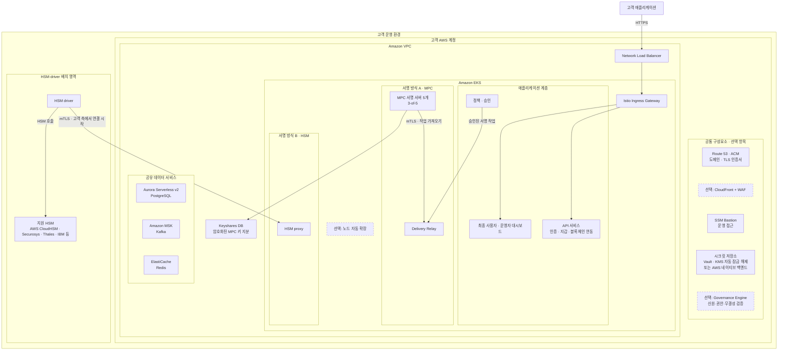
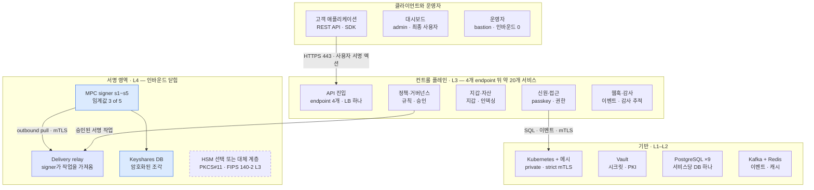
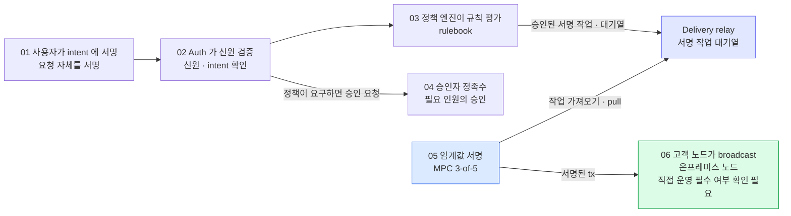

Dfns를 누가 운영할지, 어디에 설치할지, 어떤 시크릿·인증 기반을 사용할지 정리한 문서다. 고객 AWS 계정의 전체 플랫폼 배치 개요와 Baseline·Enterprise AWS-Native 비교를 함께 다룬다. 제품 구성·지원 범위는 제공 자료 기준이며 계약한 릴리스로 다시 확인한다.

| 읽는 순서 | 문서에서 확인할 내용 |
|---|---|
| 이 문서 | 운영 모델·배포 프로필·제품 구성·아키텍처 계층 |
| [배포 준비와 절차](02-deployment-procedure.md) | 사전 준비·배포 번들·설치 절차·배포 후 운영 |
| [Baseline 인프라 설계](03-baseline-datacenter-design.md) | 공통 서비스·키 관리와 고객 AWS 계정 배치안 |
| [Governance Engine](01-governance-engine.md) | 서명 전 신원·권한·무결성 검증 범위와 한계 |
| [담당자 확인 질문](04-vendor-questions.md) | 지원·연동·대납·다중 체인에 관한 전달용 질의 |

## 배치 형태와 운영 주체

Dfns 는 "누가 무엇을 운영하는가" 로 갈리는 여러 배치 형태를 지원한다. 서명 인프라(키를 보관하고 서명을 만드는 계층)와 플랫폼(API·대시보드)이 각각 Dfns 에 있을 수도, 고객에게 있을 수도 있다.

| 형태 | 서명 인프라 | 플랫폼 (API·대시보드) |
|---|---|---|
| Dfns 호스팅 (SaaS) | Dfns | Dfns |
| Hybrid MPC, shared quorum | 분할. 고객이 일부 MPC signer 운영, 나머지는 Dfns | Dfns |
| Hybrid MPC, full quorum | 고객이 모든 MPC signer 운영 | Dfns |
| Client-hosted HSM | 고객 HSM + 고객이 운영하는 driver. proxy 는 Dfns 운영 | Dfns |
| **완전 온프레미스 (이 문서)** | 고객 (클러스터 안 MPC 또는 고객 HSM) | 고객 |

완전 온프레미스에서는 API 서비스, 대시보드, 데이터베이스, 메시지 버스, 시크릿 저장소, 서명 계층이 전부 고객 AWS 계정에서 실행된다. 서명 계층은 MPC 와 HSM 두 선택지가 있고, 둘 다 이 문서 범위다. Hybrid 형태들은 별도 가이드가 있다.

**운영 중 Dfns 연결 불필요.** Dfns는 “After delivery” 이후 환경이 Dfns 인프라에 대한 런타임 의존 없이 실행된다고 설명한다. Dfns 와 연결 없이 운영되고, 컨테이너 이미지는 오프라인으로 고객 레지스트리에 들여올 수 있다.

## Baseline과 AWS-Native 선택

**AWS는 설치 장소이고, Baseline과 Enterprise AWS-Native는 시크릿·인증 기반을 선택하는 방식이다.** 고객 AWS 계정에서도 둘 중 하나를 선택한다. 사내 데이터센터의 Baseline 배포는 별도 지원 확인이 필요한 설계안이다.

- **Baseline — Vault 기반 구성.** 고객이 운영하는 Vault에 서비스 비밀번호를 보관하고 암호화·인증서 기능을 맡긴다.
- **AWS-Native — Vault 없이 AWS 서비스로 구성.** Secrets Manager·KMS·IAM과 인증서 도구가 해당 기능을 맡는다.

예를 들어 DB 연결 시 Baseline은 비밀번호를 사용하고, AWS-Native는 IAM 인증을 사용한다. 애플리케이션 이미지·API·Worker·MPC 서명 모델·데이터 모델은 제공 자료상 동일하다. 지갑 서비스가 Dfns SaaS로 옮겨간다는 뜻이 아니다.

### 기반 서비스 비교

| 항목 | Baseline | Enterprise AWS-Native |
|---|---|---|
| 시크릿 저장소 | HashiCorp Vault KV | AWS Secrets Manager |
| {{데이터 키 암호화::데이터를 암호화하는 키를 별도의 상위 키로 다시 암호화해 보호하는 방식.}}·KMS | Vault Transit | AWS KMS |
| 서비스 신원 | Vault Kubernetes 인증, 서비스마다 역할 1개 | AWS IAM, IRSA 또는 Pod Identity |
| 클러스터에 시크릿 전달 | Vault Agent injector | External Secrets Operator |
| PKI·mTLS | Vault PKI | ACME를 사용하는 cert-manager와 Istio 메시 |
| Kafka 인증 | SCRAM, 비밀번호 방식 | IAM, `aws-msk-iam`, 비밀번호 없음 |
| 데이터베이스 인증 | PostgreSQL 비밀번호 | RDS 또는 Aurora IAM 인증, TLS 검증 실패 시 연결 차단(fail-closed) |
| 캐시 인증 | Redis 비밀번호 | ElastiCache IAM |
| 이벤트 처리 | Kafka | Kafka만 사용, SQS·SNS·DynamoDB 미사용 |
| 호스팅 | {{단일 테넌트::Dfns를 도입하는 한 고객 조직(예: 우리 회사나 은행) 전용으로 플랫폼을 배치·운영하는 구성. 여기서 테넌트는 개인 고객이나 지갑이 아니라 도입 조직을 뜻한다.}} | 고객 소유 AWS 계정의 {{단일 테넌트::Dfns를 도입하는 한 고객 조직(예: 우리 회사나 은행) 전용으로 플랫폼을 배치·운영하는 구성. 여기서 테넌트는 개인 고객이나 지갑이 아니라 도입 조직을 뜻한다.}} |
| 최소 플랫폼 릴리스 | **1.929 이상** | **1.935 이상** |

두 프로필 모두 {{단일 테넌트::Dfns를 도입하는 한 고객 조직(예: 우리 회사나 은행) 전용으로 플랫폼을 배치·운영하는 구성. 여기서 테넌트는 개인 고객이나 지갑이 아니라 도입 조직을 뜻한다.}}이며 같은 플랫폼 이미지를 실행한다. 표의 기반 서비스와 인증 구성이 달라지고, 애플리케이션과 서명 계층은 같다. Baseline의 호스팅 행에는 AWS 이외 환경의 지원 범위나 설치 요건이 명시돼 있지 않다.

{{데이터 키 암호화::데이터를 암호화하는 키를 별도의 상위 키로 다시 암호화해 보호하는 방식.}}는 데이터 보호 기능이며 지갑 거래 서명과 구분한다. External Secrets Operator는 AWS Secrets Manager에서 읽은 시크릿을 Kubernetes Secret으로 전달한다. Keyshares store는 MPC 키 조각 저장소로, 일반 서비스 DB와의 공유 여부·엔진·물리 배치는 확인이 필요하다.

### Vault 가 맡는 세 가지, 그리고 누가 대신 맡나

표가 행별로 갈라 놓은 것을 Dfns 는 한 문장으로 묶어 설명한다. **Vault 하나가 세 가지를 하고 있고, AWS-Native 는 그 셋을 각각 다른 AWS 서비스에 넘긴다.**

> Vault 의 세 역할, 곧 **시크릿 저장·envelope 암호화·PKI** 를 각각 AWS Secrets Manager·AWS KMS·cert-manager 가 맡고, External Secrets Operator 가 시크릿을 클러스터로 전달한다.

배포 백엔드 자료의 「무엇이 달라지나」 절에 있는 서술이다. 같은 자료는 이것이 부분적으로 떼어 바꾸는 게 아니라 **Vault 평면을 통째로 교체**하는 것이라고 밝힌다.

그래서 실제로 무엇이 어디에 들어가는지 보면 이렇다. 시크릿 저장소가 담는 것은 **서비스 시크릿, 서비스별 transit 또는 KMS 키, 그리고 Vault 를 쓸 때는 서명 계층이 사용하는 PKI mount** 다.

| 무엇 | Baseline | AWS-Native |
|---|---|---|
| 플랫폼 인증키 (Ed25519 토큰 서명 issuer 키) | Vault KV 에 두고 **KMS 로 envelope 암호화**. auth 서비스만 읽는다 | Secrets Manager 에 두고 같은 방식으로 보호 |
| 데이터베이스 자격증명 | PostgreSQL 비밀번호 | 비밀번호가 없다. RDS·Aurora **IAM 인증** |
| Kafka 자격증명 | SCRAM 비밀번호 | `aws-msk-iam`, **비밀번호 없음** |
| 서명 계층 인증서 | Vault PKI mount | cert-manager 가 ACME 로 발급 |
| Vault 자체의 잠금 해제 | — | 해당 없음 (Vault 가 없다) |

**AWS 에 배치하면서 Baseline 을 쓰면 Vault 의 잠금 해제에 AWS KMS 를 쓴다.** 자료는 시크릿 저장소를 "raft 고가용성 구성의 Vault + AWS KMS auto-unseal, 또는 AWS 네이티브 시크릿 백엔드" 중 하나로 적는다. 이때 KMS 는 Vault 를 여는 용도이고, 위 표의 envelope 암호화를 대신하는 것이 아니다.

**envelope 암호화의 동작 원리는 Dfns 자료에 설명이 없다.** 아래는 일반적인 방식이라 참고로만 본다 — 데이터를 암호화한 키를 다시 상위 키로 암호화해 함께 저장하고, 상위 키는 KMS 나 Vault Transit 안에만 둔다. 저장되는 것은 암호화된 데이터와 암호화된 데이터 키뿐이고, 읽으려면 매번 상위 키를 가진 쪽에 복호화를 요청한다.

### 공통 부분과 초기 선택의 영향

컨테이너 이미지·Pod 구성, Coordinator·signer·전달 방식, 서비스 의존 순서·DB/플랫폼 bootstrap, 서비스별 DB·Keyshares store·ingress 호스트 모델은 같다. 변경되는 것은 시크릿 저장·전달, 서비스 신원, PKI와 데이터 서비스 인증이다.

**배포 키트 기본값은 Baseline이며, AWS-Native는 명시적 설정 override가 필요하다.** 표의 최소 릴리스는 제공 자료의 기준이다. 현재 지원 버전은 패키지와 계약으로 확정한다. AWS-Native는 Kafka·DB·캐시의 IAM 연결, External Secrets Operator 동기화, 인증서 발급을 점검한다. Kafka만 사용하며 Dfns 호스팅 SaaS의 SQS·SNS·DynamoDB 경로는 사용하지 않는다고 설명한다.

★ **시크릿 백엔드는 초기 배포 시 고정되고, 제공 자료상 백엔드 간 마이그레이션은 없다.** 자료는 이 항목만 **"One-way door"** 라는 제목으로 따로 떼어 "되돌릴 수 없는 결정이니 신중히 정하라" 고 덧붙인다. 프로필 선택은 배포 전에 끝내야 하는 사안이다. AWS-Native에는 Vault가 없으므로 Vault 초기화·recovery key 보관 절차를 그대로 적용하지 않는다. 프로필별 bootstrap은 배포 안내서로 확인한다.

AWS Baseline이 Vault 잠금 해제에 KMS를 쓰거나 MSK SCRAM 등록에 Secrets Manager를 쓰더라도 AWS-Native로 바뀌는 것은 아니다. 이 서비스들의 역할은 [Baseline 인프라 설계](03-baseline-datacenter-design.md)에서 구분한다.

## 전체 배치 구성

완전 온프레미스에서는 모든 런타임 구성요소가 고객 환경 안에 있고, Dfns는 서명된 배포 파일 묶음을 제공하고 기술 교육(워크숍)으로 지식을 전달한다. 원문은 교육 내용·일정·진행 방식을 구체적으로 설명하지 않는다. 운영 중 Dfns와 연결할 필요는 없다. 대비용으로 그린 SaaS 와 Hybrid MPC 는 서명 계층과 플랫폼의 실행 위치가 다르다.

활성화한 체인마다 RPC endpoint 하나가 필요하며, 고객의 노드 직접 운영이 필수인지는 제공 자료만으로 확정할 수 없다. Hybrid MPC에서는 고객과 Dfns가 signer와 keyshare DB의 운영을 나누며 signer가 outbound mTLS로 작업을 가져온다. 고객 AWS 계정의 상세 배치는 아래 구성도에서 다룬다.

## 아키텍처의 네 계층

배치는 순서가 정해진 4개 인프라 계층으로 구성된다. 각 계층은 별도의 상태 파일(state)을 관리하는 Terraform root이며, 뒤 계층이 앞 계층의 출력값(output)을 읽기 때문에 순서가 고정되며 도구가 이를 강제한다. 첫 계층 이후의 구성은 표준 Kubernetes를 사용한다. 애플리케이션은 Helm chart와 컨테이너 이미지로 제공돼 첫 계층이 만든 클러스터에 배포된다.

| 계층 | 프로비저닝 대상 |
|---|---|
| L1 · Substrate | VPC 와 네트워킹, EKS 클러스터, 관리형 PostgreSQL(Aurora Serverless v2), 관리형 Kafka(MSK), 관리형 Redis(ElastiCache), Route53 호스팅 존과 ACM TLS 인증서, SSM bastion, 선택으로 CloudFront CDN + WAF |
| L2 · Platform | Istio 서비스 메시(strict mutual TLS)와 ingress gateway, 시크릿 저장소(raft HA + AWS KMS auto-unseal 의 Vault, 또는 AWS 네이티브 시크릿 백엔드), 네임스페이스와 RBAC, storage class, 레지스트리 pull secret, 선택으로 노드 autoscaling |
| L3 · Product | 공유 PostgreSQL 위의 서비스별 데이터베이스, Kafka 토픽과 접근 통제, 시크릿 저장소 초기 데이터 입력, 플랫폼 Helm umbrella release(모든 애플리케이션 서비스, 초기화 job, 대시보드) |
| L4 · Signing | 선택한 서명 계층. 클러스터 안 MPC signer 클러스터, 또는 고객 HSM 앞의 HSM proxy + driver 쌍. 선택으로 governance engine |

계층 순서가 곧 배포 경로다. 도구는 각 계층의 작업을 자동으로 실행하지만, 고객이 직접 처리해야 하는 단계에서 멈춘다. 기반 인프라, 플랫폼 공통 기반, 애플리케이션, 키 순서다.

### AWS 구성도 — 선택 항목과 두 서명 방식

Vault와 MPC를 사용하는 AWS Baseline의 상세 제안은 [AWS Baseline 구성도](03-baseline-datacenter-design.md#aws-구성안)에서 다룬다.

아래는 고객 AWS 계정에서 운영하는 전체 플랫폼 구성이다. **API와 대시보드도 고객 AWS 계정에서 실행된다.** 서명 계층은 MPC 또는 HSM 중 하나를 선택하며, Governance Engine은 별도의 선택 구성요소다.

점선 테두리는 선택 항목이다. 연결선은 주요 관계만 표시했다. CloudFront·WAF 적용 시의 상세 경로와 Governance Engine의 구체적인 연결 위치는 표시하지 않았다. HSM·driver의 별도 영역은 구성요소를 구분한 것이며, 고객 AWS 계정 밖에 반드시 배치한다는 뜻은 아니다. 원문은 driver를 클러스터 밖이나 VPC 밖에도 배치할 수 있다고 설명한다.

**대체 서명 방식**은 MPC 대신 HSM으로 서명하는 것을 뜻한다. 두 방식을 함께 사용해야 한다는 의미는 아니다.

| 서명 방식 | 키 보관과 서명 |
|---|---|
| MPC | 키 지분을 여러 서명 서버에 나누고 공동으로 서명한다. 이 문서의 기본 구성은 5개 서버 중 3개가 참여한다. |
| HSM | 키를 HSM 내부에서 생성하고 HSM에서 서명한다. HSM proxy·driver가 연결을 담당하며, 암호화된 키 데이터는 고객이 운영하는 PostgreSQL keystore DB에 보관한다. |

서명 방식별 상세 조건과 지원 HSM은 ‘서명 계층 선택’에서, Governance Engine의 검증 범위는 [별도 문서](01-governance-engine.md)에 정리했다.

## 애플리케이션 서비스와 공유 인프라

### 애플리케이션 서비스

Product 계층은 Helm umbrella release 하나로 약 20개 workload 를 배포한다.

- **핵심 API 서비스 12개** — 인증과 조직·사용자 생애주기(WebAuthn passkey 기반), 지갑(생애주기·이체·broadcast), signer 조정(서명 계층 구동), 정책(승인·컴플라이언스 규칙), 블록체인 연동(멀티체인 트랜잭션 구성·수수료·네트워크 메타데이터), 블록체인 인덱싱(블록 수집과 트랜잭션 확정), admin, webhook, alias, 시세, 메트릭. 여러 서비스가 같은 이미지에서 cron 이나 indexer workload를 함께 실행한다.
- **초기화 job 2개** — 데이터베이스 스키마 마이그레이션, 그리고 issuer key 와 초기 staff 조직을 만드는 1회성 플랫폼 bootstrap.
- **대시보드 2개** — 최종 사용자 대시보드, 운영자용 staff 대시보드.

모든 애플리케이션 이미지는 distroless Node.js 기반이고 non-root 사용자로 실행되며 arm64(Graviton 계열 노드)용으로 배포된다. 릴리스의 모든 서비스가 같은 버전 번호를 갖는 단일 플랫폼 버전이고, 이미지는 digest 로 고정된다.

### 공유 인프라

- **PostgreSQL** — 서비스 도메인별 논리 DB 9개(auth, permissions, wallets, keystores, policies, blockchain integrations, aliases, markets, events).
- **Kafka** — 플랫폼 이벤트 버스. 토픽과 서비스별 자격증명은 Product 계층에서 프로비저닝. indexer 와 cron workload 가 Kafka consumer 다.
- **Redis** — 캐시 계층.
- **시크릿 저장소** — Vault 또는 AWS 네이티브 백엔드. day 0 에 고른다. 서비스 시크릿, 서비스별 transit 또는 KMS 키, Vault 일 때는 서명 계층이 쓰는 PKI mount 를 보관.
- **Istio** — 모든 서비스 사이 클러스터 내 mutual TLS(strict) 와 ingress gateway. 앞에 AWS NLB.

## 서명 계층 선택

서명 계층은 키를 보관하고 서명을 만드는 구성요소다. 온프레미스 모델은 day 0 에 고르는 두 선택지와 선택 구성요소 하나를 제공한다.

**MPC, 클러스터 안.** signer party 5개와 3-of-5 서명 임계값(다른 구성은 협의로 지원). party 사이에 프로토콜 라운드를 전달하는 delivery relay 가 함께 있다. 키 조각은 프로비저닝 시 분산 키 생성으로 signer 안에서 만들어지므로 완전한 개인키가 한곳에 존재하는 순간이 없다. 각 party 의 인증서는 고객 시크릿 저장소의 전용 PKI mount 에서 발급된다.

**HSM.** 클러스터 안 hsm-proxy 와 고객 HSM과 함께 배치하는 hsm-driver. driver 는 보통 별도 amd64 호스트에 두고, 클러스터 밖이나 VPC 밖에도 둘 수 있다. driver가 proxy에 상호 TLS 인증으로 접속하므로 HSM 쪽으로 들어오는 연결은 필요 없다. 지원 HSM 은 Securosys Primus(온프레미스 어플라이언스 또는 CloudsHSM 서비스), Thales Luna, AWS CloudHSM, IBM EP11 또는 HPCS 급 장비다. 지갑 개인키는 HSM 안에서 생성되고, HSM 밖으로 추출할 수 없는 root wrap key로 AES-GCM 암호화한 데이터(blob) 형태로만 고객이 운영하는 PostgreSQL keystore DB 에 저장된다. ECDSA secp256k1 과 Ed25519 서명을 모두 지원한다.

**Governance engine, 선택.** 거버넌스 결정에 자기 키로 서명하는 추가 승인·증명 구성요소. HSM 계층이 있으면 그 키도 HSM 으로 래핑된다.

**이 완전 온프레미스 모델의 키 보관.** 지갑 서명키는 플랫폼 API 서비스가 보관하지 않고 Dfns도 보관하지 않는다. MPC 에서는 signer party 들에 조각으로 나뉘고, HSM 에서는 HSM 안에 있으며 keystore DB 에는 래핑된 blob 만 들어간다.

## 런타임 구성요소와 연결

런타임 구성요소를 영역별로 나누어 표시했다. 네 영역 전부 고객 환경 안에 있고, 서명 영역은 들어오는 연결을 받지 않는다. signer가 delivery relay에 mTLS로 접속해 서명 작업을 가져온다.

파란색은 MPC signer와 키 조각 DB, 보라색 relay는 서명 작업을 전달하는 구성요소다. HSM은 원문과 같이 점선으로 표시한 선택 또는 대체 계층이며, MPC signer와 연결된 구성으로 그리지 않았다.

## 신뢰 도메인과 키 관리

플랫폼의 암호 자료는 서로 독립인 네 신뢰 도메인으로 나뉜다.

| 신뢰 도메인 | 자료 | 있는 곳 |
|---|---|---|
| 지갑 서명키 | ECDSA secp256k1 / Ed25519 | MPC: signer party 들에 조각으로 분산. HSM: 고객 HSM 안, keystore DB 에는 래핑된 blob 만. 플랫폼 API 도 Dfns 도 보관하지 않음 |
| 플랫폼 인증키 | Ed25519 토큰 서명(issuer) 키 | 고객 시크릿 저장소(Vault KV 또는 AWS Secrets Manager), 고객 KMS 로 envelope 암호화. auth 서비스만 읽음 |
| 서명 계층 mutual TLS | 환경별 private CA 와 intermediate, 구성요소별 ECDSA P-256 leaf 인증서 | CA·intermediate 는 시크릿 저장소, leaf 는 서명 계층 pod 에 마운트. leaf 의 common name 이 구성요소 신원을 담고 TLS handshake 에서 강제됨 |
| 서비스 메시 | Istio workload 인증서(단기) | 클러스터 내 CA, 자동 로테이션 |

**키 보관 시 확인할 사항.** 첫째, Vault recovery key 와 root token(초기화 때 받음)을 가진 쪽이 시크릿 저장소를 통제한다. 고객은 배포 과정에서 이 값들을 직접 보관해야 하며 root token 은 day 0 뒤 폐기한다. 둘째, HSM 경로에서는 모든 지갑 키를 복구하려면 root wrap key와 keystore DB가 모두 필요하며, 이 둘이 복구에 필요한 자료의 전부다. 둘 다 백업해야 한다. 키는 HSM 네이티브 파티션 백업이나 복제로, DB 는 표준 PostgreSQL 백업으로. HSM 백업 없이 root wrap key 를 잃으면 래핑된 모든 키가 영구히 복구 불가다.

**고객 보관 암호화 백업 (MPC).** MPC 배치에는 선택 백업 계층이 있다. 모든 키 조각을 고객이 생성해 오프라인에 보관하는 공개키로 추가 암호화해 버전 관리되는 S3 버킷에 쓴다. 이 백업을 사용하면 Dfns에 의존하지 않고 복구할 수 있다.

## 거래 처리와 여섯 개의 통제 지점

[배포 절차](02-deployment-procedure.md#단계별-상세) 마지막의 전체 흐름 검증에서 확인하는 경로다. 원문은 모든 처리 단계가 고객 환경 안에 있고 적용되는 통제 단계를 건너뛸 수 없다고 설명한다. 승인자 단계는 정책이 요구할 때만 적용된다. 서명 작업은 MPC signer가 relay에 접속해 가져온다.

PDF 는 사용자 서명, 신원 검증, 정책 평가, 정족수 승인, 임계값 서명, 노드 broadcast 를 여섯 통제 지점으로 세고, 그중 서명 단계를 "custody-critical" 로 표시했다. 승인자 단계는 정책이 요구할 때만 들어간다.

signer에서 relay로 향하는 화살표는 작업을 가져오기 위한 접속 방향이다. 승인자의 응답 경로는 원문에 그려져 있지 않아 연결선을 추가하지 않았다. 노드 직접 운영이 필수인지는 별도 확인이 필요하다.

## 외부 시스템 연동

이메일과 체인 endpoint 하나 이상은 사실상 사전 요건이고, 나머지는 선택이며 provider 에 묶이지 않는다.

| 연동 | 용도 | 비고 |
|---|---|---|
| 이메일 (SMTP 또는 SendGrid) | 가입·복구·로그인 메일. 온보딩 사전 요건에 해당 | 고객 relay 와 STARTTLS 또는 TLS 로 동작. 별도 온프레미스 이메일 가이드 있음. 이메일 설정 전 온보딩을 위한 비상 절차(break-glass) 문서 제공 |
| OIDC | 고객 IdP 로 위임 로그인 | OIDC 강제 조직은 가입 메일 없이 온보딩. admin 매핑 claim 을 가진 첫 IdP 사용자가 조직 admin |
| 체인 RPC endpoint | 활성화한 블록체인 네트워크당 하나 | 자격증명이 포함된 endpoint 는 설정 파일이 아니라 시크릿 저장소에 |
| 시세·가격 API | 수수료 추정, 가격, 스테이킹 데이터 | 선택. provider 무관 설정 |
| 웹훅 | 고객 시스템으로 이벤트 전달 | 내장 서비스 |
| 관측 | 구조화 JSON 로그, OTLP trace export | 로그는 컨테이너 방식으로 고객 SIEM 에, OTLP exporter 는 고객 collector(Datadog 또는 OpenTelemetry 호환)로. Prometheus·Grafana 는 번들에 없음 |
| Captcha (reCAPTCHA) | 로그인 보호 | 선택 |
| Slack | 운영 알림 | 선택 |
| 컨테이너 레지스트리 | 이미지 공급 | 고객 레지스트리(오프라인 import), 복제 대상, 또는 Dfns 제공 pull 자격증명 |

## 아키텍처 검토 시 고려할 제약

- Kafka 와 Istio 는 필수다. 플랫폼 메시징은 Kafka 만, ingress 와 클러스터 내 mutual TLS 는 Istio 네이티브. 교체나 유예 불가.
- Terraform 계층이 배포 경로다. 렌더링된 Kubernetes manifest 를 검사·보안 검토용으로 뽑을 수는 있지만, chart 만으로 설치하면 DB·토픽·시크릿·DNS 를 프로비저닝할 수 없고, 직접 만든 클러스터에 배포 패키지를 설치하는 것은 지원 경로가 아니다.
- 구성요소마다 사용하는 CPU 아키텍처가 다르다. 애플리케이션 계층은 arm64 전용, HSM driver 구성요소는 amd64. HSM 경로면 둘 다 노드 용량을 계획해야 한다.
- 시크릿 백엔드는 되돌릴 수 없다.
- edge TLS 는 인증서 검증을 위해 실제 DNS 위임이 필요하다. edge TLS 없는 내부 전용 도메인이 지원되는 대안이다. 이는 클러스터 내부의 strict mTLS를 없앤다는 뜻은 아니다. 내부 API 접속의 TLS 구성은 배포 시나리오별로 확인한다.
- 최소 권한 적용은 초기 배포 후 보안 강화 단계에서 진행한다.
- 이 PDF 버전에서는 HSM 서명 경로의 HD 지갑을 지원하지 않는다고 명시한다.
- 에어갭·오프라인 서명 계층과 HSM root key 로테이션은 셀프서비스 기능이 아니라 계약 범위에서 다루는 절차다. 도입 범위를 협의할 때 Dfns 솔루션 엔지니어에게 요청해야 한다.

필요한 자원 규모(sizing), 비표준 구성, 추가 HSM 벤더, 컴플라이언스 설문 등 이 개요에서 확정하지 않은 사항은 Dfns 솔루션 엔지니어에게 문의하도록 안내한다. 배포 번들·설치 절차·배포 후 운영 작업은 [배포 준비와 절차](02-deployment-procedure.md)에 있다.

## 인프라 설계와 지원 확인

제품 설명과 별도로, [Baseline 인프라 설계안](03-baseline-datacenter-design.md)에 고객 AWS 계정 배치를 정리했다. 계약 릴리스·AWS 서비스 조합·외부 Vault·Keyshares 저장소의 지원 여부를 확인한 뒤 적용할 제안이다.

## 내부 검토 항목

- Full on-premise를 선택할 경우, 사용할 국내 AWS 리전의 EKS·MSK 제공 여부와 계정 할당량이 배포 요건을 충족하는가? AWS 공식 자료와 고객 계정에서 내부적으로 확인한다.
- Hybrid MPC, full quorum을 선택할 경우에도 고객 측 EKS·MSK가 필요한가? 이 모델에서는 모든 MPC 서명 서버는 고객이, API·대시보드는 Dfns가 운영한다고 구분한다. Full on-premise의 요건을 그대로 적용하지 않고, 해당 모델의 서명 인프라 요건을 기준으로 검토한다.

## 추가 확인 사항

- “After delivery”가 자료 제공 시점인지 설치 완료 시점인지
- 고객이 블록체인 노드를 직접 운영해야 하는지
- MPC "다른 토폴로지" 의 구체 구성과 조건
- L4에 속하는 Governance Engine의 구체적인 실행 위치와 연결 방식. 동작과 키 관리는 [Dfns Governance Engine](01-governance-engine.md) 에 있다
- 국내 배치 사례 여부
- 가격, 계약 조건, 지원 SLA, 릴리스 주기
- 지원 HSM 의 펌웨어·클라이언트 버전 요건, "FIPS 140-2 L3" 표기의 인증 대상
- Kafka·Istio·Vault·PostgreSQL 의 버전과 sizing 상세 (참조 배치의 vCPU 약 32개 외에는 상세 규모 확인 필요)
- 지원 체인 목록, 인덱싱 범위, webhook 이벤트 스키마
- MPC 경로의 HD 지갑 지원 여부 (HSM 경로 미지원만 명시)
- 정책 엔진의 규칙 표현과 평가 순서

- AWS-Native override의 정확한 키·값·IAM 권한과 프로필별 초기화·자체 점검표
- 인증서 발급 대상·CA·수명·회전과 cert-manager·Istio의 역할 분담
- 백엔드 선택이 Hybrid MPC·HSM·Governance Engine에 적용되는 범위와 상세 배치
- 프로필별 자원·성능·비용·고가용성·재해 복구와 서비스 버전 조합

미확정 항목을 기능 부재로 단정하지 않는다. 환경별 지원과 실제 연동 조건은 [담당자 확인 질문](04-vendor-questions.md)으로 확인한다.
