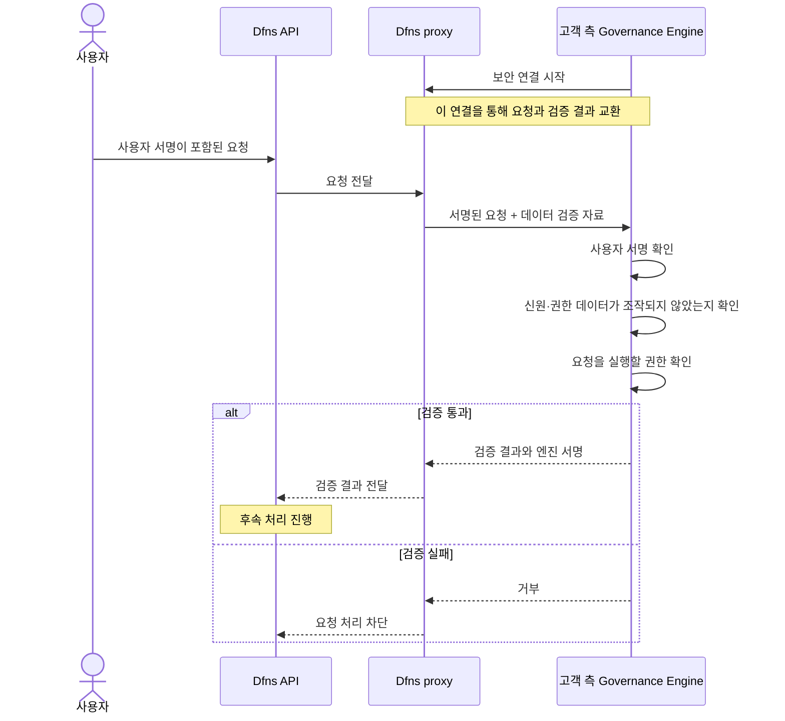
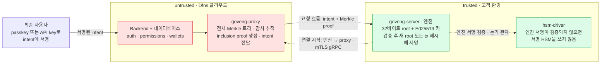
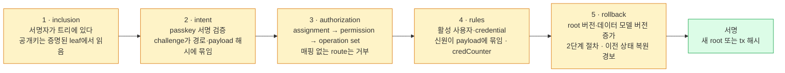

Dfns가 제공한 "The Governance Engine" 아키텍처 슬라이드 22장(v1.0)과 같은 주제의 2쪽 요약본을 슬라이드 순서대로 정리한 문서다. Dfns는 이 구성요소를 Integrity Framework라고도 부른다. 자료는 고객이 통제하는 엔진이 사용자·credential(사용자 인증에 쓰는 정보)·권한 데이터의 무결성과 요청자의 서명·권한을 검증하는 구조라고 설명한다. 검증 대상 필드와 범위는 아래 요약본 r.2에 정리했다.

## 읽는 방법

- 기능 범위와 로드맵은 아래 출처에 기록된 버전의 설명이다. 현재 제품의 구현·배포 상태를 뜻하지 않는다.
- 슬라이드는 이미지 중심이라 pdftoppm으로 22장을 이미지로 뽑아 읽었고, 요약본은 pdftotext로 추출했다. 슬라이드는 s.N, 요약본은 r.1·r.2로 표기한다.
- 제품 우수성과 보안 보증에 관한 표현은 자료가 제시한 주장이다. 별도 근거로 검증된 결론이 아니다.
- 자료에 없는 API 명세, 성능, 가격, 지원 범위는 추가하지 않았다. 저자의 추측·평가는 포함하지 않는다. 확인되지 않은 사항은 확인 질문으로만 남긴다.
- 온프레미스 배치 개요는 이 엔진을 선택 구성요소로 소개하고 결정 서명과 키 보호를 간략히 설명한다([Dfns 온프레미스 배치](00-on-premise-deployment.md) p.5·p.7). 두 자료의 관계는 아래 별도 절에 적었다.

## 전체 흐름 — 요청 전달과 고객 측 검증

Dfns가 사용자의 서명된 요청을 전달하면, 고객 측 Governance Engine이 요청자의 신원·권한과 검증 대상 데이터의 무결성을 확인한다. 아래 그림은 서명된 요청의 전달과 검증 결과 반환을 요약한 흐름이다(s.6–s.8, r.1). 세부 검증 절차는 아래 요약본 절에서 다룬다.

데이터 검증 자료는 Merkle proof로, 고객 측 엔진이 보관한 기준값과 대조하는 데 쓰인다. **엔진 서명은 고객 측 검증을 통과했다는 증거이며, 자산을 이동시키는 블록체인 거래 서명과는 별개다.** 요약본은 엔진이 데이터 변경 시 root에, 트랜잭션 요청 시 해시에 서명한다고 설명한다(r.1).

## s.1–s.2 — 표지와 구성

표지(s.1)는 "DFNS Architecture · v1.0 · Onchain Core Banking · The Governance Engine, also called the Integrity Framework" 다. 키워드는 Security Model, Trust Boundary, Merkle Commitment, Intent Verification, Root Signing.

세 부분으로 구성된다(s.2).

| 부분 | 제목 | 내용 |
|---|---|---|
| Part I | The trust model | 상태 데이터베이스가 왜 중요한지, 검증 기준이 되는 불변식, 신뢰 경계 양쪽의 두 구성요소 |
| Part II | The cryptographic core | Merkle commitment, 위조·롤백이 실패하는 이유, 모든 intent(사용자가 승인하는 요청 내용)가 서명 전에 검증되는 방식 |
| Part III | Keys, recovery & scope | 엔진 키, 상태 저장소와 재해 복구, 운영 중인 조직의 온보딩, 방어 범위 |

## Part I — 신뢰 모델 (s.3–s.8)

### s.4 — 상태 데이터베이스는 서명키만큼 중요하다

자료가 제시하는 위협 모델에서는 수탁 플랫폼이 credential의 소유자와 활성 여부를 데이터베이스 기록에 의존해 판단한다. 공격자가 이 기록을 변조하면 키를 훔치지 않고도 출금 승인을 얻을 수 있다고 설명한다.

- **제거하려는 공격**: credential을 데이터베이스에 직접 넣거나 폐기된 것을 다시 활성화해서, 고객이 승인한 적 없는 서명을 승인받는 것.
- **엔진이 바꾸는 것**: 검증 대상 데이터의 무결성을 데이터베이스 자체에 대한 신뢰에 맡기지 않는다. 위조되거나 롤백된 상태는 서명 시점에 거부되고, 조용히 통과하지 않는다.

### s.5 — 핵심 불변식

검증 기준이 되는 서명된 root(Merkle 트리 전체 상태를 나타내는 최상위 해시)는 고객이 통제하는 엔진이 보관하고, 엔진은 그 root 해시만 유지한다. 신뢰할 수 없는 쪽이 재구성해 롤백할 수 있는 트리는 엔진에 없다. 자료는 보안 논증 전체가 이 불변식 하나로 환원된다고 적었다.

### s.6 — 신뢰 여부에 따라 구분한 두 구성요소

| 항목 | Proxy (untrusted) | Engine (trusted) |
|---|---|---|
| 실행 위치 | Dfns 인프라 | 고객 환경 |
| 하는 일 | 플랫폼 데이터베이스를 폴링해 Merkle proof(해당 기록이 트리에 포함됐다는 증명)를 만들고, 고객이 서명한 intent를 묶어 엔진을 호출하고, 검증된 결과를 돌려 반영 | 각 intent를 검증하고 proof를 자기 root에 대조하고, 트리를 변경하고, 새 root와 트랜잭션 payload에 서명 |
| 거버넌스 서명키 보유 | 없음. 유효한 root를 위조할 수 없음 | 있음. 소프트웨어 seed 또는 HSM |
| 영속 상태 | Governance DB (Postgres). 전체 Merkle 트리와 감사 추적 | 32바이트 root 해시와 래핑된 키만 (SQLite) |

### s.7–s.8 — 신뢰 경계와 연결 방향

빨간색이 Dfns 쪽(untrusted), 초록색이 고객 쪽(trusted)이다. 요청은 항상 proxy에서 엔진 방향으로만 흐르고, 엔진은 아무것도 폴링하지 않으며 자기 비즈니스 로직을 시작하지 않는다(s.7). 요약본(r.1)의 구성요소 이름 goveng-proxy, goveng-server, hsm-driver를 그림에 썼다. 엔진과 hsm-driver 사이 점선은 엔진 서명이 검증돼야 HSM을 사용한다는 조건을 나타낸다. 엔진이 hsm-driver를 직접 호출한다는 뜻은 아니며, 실제 전달 경로는 자료에 명시돼 있지 않다.

연결 방향은 온프레미스 배치를 위해 의도적으로 뒤집혀 있다(s.8). 두 구성요소는 상호 TLS(mTLS)를 적용한 gRPC로 통신하며, 엔진이 TLS 클라이언트로 접속한 뒤 그 인증된 연결 하나로 governance 서비스를 제공한다. 이 통신을 위해 고객 환경에 인바운드 포트를 열 필요가 없으며, Dfns가 고객 엔진으로 접속을 시작하지 않는다. 연결마다 엔진의 영구 저장된 현재 root와 mode가 일치하는지 먼저 확인하므로, 불일치를 접속 시점에 확인한다.

## Part II — 핵심 암호 구조 (s.9–s.15)

### s.10 — 32바이트 root 하나가 검증 대상 상태 전체를 고정한다

- **해시**: SHA-256에 domain separation. leaf(Merkle 트리에서 개별 기록을 나타내는 항목)와 내부 노드가 다른 prefix로 해시되므로 leaf가 노드로 재해석될 수 없다.
- **구조**: breadth-first 인덱스의 이진 트리(root = 0, children 2i+1 / 2i+2). 크기가 커지면 재인덱싱하며 용량이 고정돼 있지 않다.
- **leaf 내용**: 원본 레코드에서 해당 버전의 허용 목록에 있는 필드만 추린 값과 엔진이 추가하는 무결성 필드(credCounter 등).
- **연산**: inclusion check, add-leaf, update-leaf가 governance를 구동한다. 폐기는 soft-delete이고 leaf는 물리적으로 제거되지 않는다.

### s.11–s.12 — root 하나로 충분한 이유

leaf 하나가 바뀌면(L3*) 새 해시가 root까지 전파된다. 엔진은 자기가 서명한 root만 갖고 있으므로, 변조된 트리는 엔진이 서명한 적 없는 root를 낸다. 맞지 않는 proof는 precondition failure로 돌아가고 그 조직의 큐는 멈춘다. 조용히 재시도되지 않는다.

자료의 결론(s.12)은 엔진의 root에 커밋되지 않은 상태를 proxy가 유효한 proof로 제시할 수 없다는 것이다. 자료는 이를 상태 위조·롤백·재사용 방지로 설명한다.

### s.13 — 서명된 intent를 검증하는 네 단계

s.13은 서명된 intent를 검증하는 네 단계를 설명한다. 가입 중 서명된 intent 없이 credential을 추가하는 경로는 s.15에서 별도로 다룬다.

| 순서 | 단계 | 내용 |
|---|---|---|
| 1 | 서명자 증명 | 서명 credential의 leaf가 현재 root에 포함돼 있어야 한다 |
| 2 | 서명 검증 | passkey는 authData ‖ SHA-256(clientData) 위의 서명, key credential은 raw clientData 위의 서명을 검증 |
| 3 | challenge 바인딩 | `challenge.path == actionPath`이고 `payloadHash == SHA-256(payload)`여야 한다 |
| 4 | 데이터 상태·일치 여부 검사 | 서명자와 사용자가 활성 상태이고, email 같은 신원 필드가 서명된 payload와 일치해야 한다 |

### s.14 — 증명된 공개키로 서명 방식을 결정한다

서명 방식(scheme)은 Merkle 증명으로 검증된 credential의 공개키에서 도출하며, 요청에 포함된 알고리즘 문자열로 결정하지 않는다. untrusted 쪽 공격자가 서명 방식을 약화하거나 변경할 수 없다. credential별로 받는 scheme은 RSA, ECDSA P-256, P-384, P-521, secp256k1, Ed25519다.

### s.15 — credCounter, 서명된 leaf에 포함된 카운터

사용자의 첫 credential은 가입 때 서명된 intent 없이 추가된다. 같은 서명 없는 경로로 공격자가 credential을 더 넣는 것을 막기 위해 엔진은 사용자별 카운터를 두고, 카운터가 0이 아니게 되면 서명 없는 등록을 거부한다. 카운터가 서명된 leaf의 일부라서, 엔진이 서명하지 않은 root를 만들지 않고는 바꿀 수 없다.

- intent 없는 add_credential은 credCounter가 0이 아니면 거부
- 활성 Fido2 / Key 추가 → +1, 비활성화 → -1, RecoveryKey → 변화 없음

## Part III — 키, 복구, 범위 (s.16–s.21)

### s.17 — 엔진 키가 고객의 신뢰 기준(root of trust)

- **scheme**: Ed25519, 64바이트 서명. 서명 입력으로 임의 길이의 원본 메시지(raw)를 받을 수 있어야 해서(Solana의 non-prehashed payload 등) ECDSA 대신 골랐다.
- **보호**: 운영 환경에서는 HSM이 모듈 안에서 개인키를 생성하고 키는 모듈을 떠나지 않으며 래핑된 blob으로 저장된다. 소프트웨어 seed 모드는 테스트 전용이라고 명시한다.
- 엔진은 모든 변경 뒤에 root에 서명하고, read-only 흐름에서는 각 트랜잭션 payload에 같은 키로 서명한다.

### s.18 — 고객 엔진은 root 해시와 래핑된 키만 저장한다

- **상태 저장소**(SQLite): 현재 32바이트 root 해시, 래핑된 엔진 키. 그 외에는 없다. 전체 트리는 untrusted 쪽에 있다.
- **재해 복구**: root와 래핑된 키를 백업 서버로 mTLS 복제하는 선택 기능. 복제 스트림의 동작 여부를 모니터링한다.

### s.19 — TOFU로 운영 중인 조직에 governance를 켠다

고객이 시작하는 1회성 bootstrap이 조직의 현재 사용자와 credential을 트리에 스냅샷한다. 새 조직뿐 아니라 기존 조직에도 governance를 켤 수 있다. 자료는 이를 Trust On First Use라 부른다.

- **고객이 활성화 여부 결정**: 고객이 설정하는 플래그로 켜고, untrusted 쪽은 켤 수 없다.
- **안전한 순서**: recovery key를 먼저 넣어 credCounter가 올바르게 설정되도록 한다.
- **사전 자료와 대조 가능**: 감사 로그를 기록하여 고객이 확정 전에 pre-flight manifest와 대조한다.

### s.20–s.21 — 방어 범위와 범위 밖

방어하는 것(s.20):

- Dfns 인프라 침해. 검증 대상(governed) 레코드 위조·변경은 proof 검증에서 거부된다.
- 상태 롤백·재사용. 엔진에 영구 저장된 root만 검증 기준으로 사용한다.
- 비서명 credential 주입. 가입 밖에서는 credCounter가 막는다.
- scheme 다운그레이드. scheme이 Merkle 증명된 키에 묶여 있다.

의도적으로 범위 밖인 것(s.21):

- 지갑 서명키 자체. HSM 서명 계층에 해당하며 별도 문서에서 다룬다.
- Dfns 인프라의 가용성. 이 프레임워크는 무결성을 다루고 가동 시간은 다루지 않는다.
- 고객 엔진 호스트나 키의 침해. 그 호스트가 trust anchor이고 보호는 고객 책임이다.

### s.22 — 결론

각 서명의 근거가 된 신원·권한 데이터가 고객이 승인한 것과 정확히 같다는 것을 수학적으로 검증할 수 있게 한다는 것이 자료의 주장이다. 고객이 운영하는 구성요소와 고객이 가진 키로 강제되고, 변조는 조용히 통과하지 않고 큐를 멈추며, 정책·권한 governance도 같은 서명된 commitment를 따르도록 확장한다고 설명한다. 구체적인 정책 검증 범위는 r.2의 설명을 따른다.

## 요약본 (r.1–r.2) — 슬라이드에 없는 세부

### r.1 — 엔진이 서명 전에 확인하는 것, 순서대로

요약본은 goveng-server가 32바이트 root와 HSM 또는 AWS KMS로 보호한 Ed25519 키를 저장한다고 설명한다. s.17의 운영 환경 설명은 HSM만 다루므로 두 자료의 키 보호 범위를 구분해 읽어야 한다. goveng-proxy는 전체 Merkle 트리와 감사 기록을 보관하고, 새 root를 직접 다시 계산해 불일치가 있으면 해당 조직의 처리를 차단한다.

사용자는 자기 passkey 또는 API key로 intent에 서명한다. 서명 대상은 정확한 엔드포인트 경로와 요청 본문의 SHA-256이다. 서명 하나가 특정 요청 하나에 대응하므로 재사용하거나 다른 요청에 적용할 수 없다. proxy는 서명된 intent와 Merkle proof를 mTLS로 엔진에 전달하고, 엔진은 entity 변경이면 서명된 root를, 트랜잭션이면 서명된 해시를 반환하며 그 서명은 이후 처리 단계에서 검증된다. 온프레미스 signer(hsm-driver)는 엔진의 Ed25519 서명이 검증되지 않으면 서명 HSM을 쓰지 않는다.

노란색 다섯 단계를 순서대로 통과해야 초록색 서명 단계에 이른다. rollback 단계에는 이전 상태로 되돌아가지 않는 백업 복제도 포함된다(r.1). 요약본은 검증 대상 데이터의 위조·변경·롤백이 탐지 없이 통과할 수 없으며, 유효한 사용자 서명 없이는 상태 변경과 트랜잭션 서명을 허용하지 않는다고 설명한다. 다만 s.15에는 가입 중 서명된 intent 없이 credential을 추가하는 경로가 명시돼 있다. 요약본의 일반 설명과 가입 예외의 적용 범위는 구분해야 한다.

### r.2 — 증명되는 것과 아직 신뢰에 맡기는 것

| 영역 | 요약본이 설명하는 검증 범위 |
|---|---|
| 트랜잭션 서명 | 엔진이 서명 경로에서 승인 여부를 결정한다. 온프레미스 signer는 엔진 서명 없이 블록체인 키를 사용하지 않는다. 공동서명 전에 서명자와 credential이 트리에 있고 활성 상태이며 해당 route에 권한이 있는지 증명한다. 비활성 상태이거나 증명되지 않은 신원은 서명을 얻을 수 없다. |
| 인증과 권한 | 아래 5개 데이터셋의 정해진 필드를 Merkle leaf로 검증한다. 요약본은 변경마다 사용자 서명 intent, Merkle proof, 새 엔진 서명 root가 필요하다고 설명한다. 가입 중 예외는 s.15를 참조한다. 엔진은 검증 대상 leaf로 backend의 권한 검사를 다시 실행하며, 삭제와 보관 처리도 검증 대상이다. |
| 정책과 권한 조건(predicate) | Dfns backend가 적용한다. 정책 정의·승인·정족수는 트리 밖에 있으며, 엔진은 이를 평가하지 않는다. 금액 상한·허용 시간 범위 같은 permission predicate는 데이터 모델이 안정될 때까지 보류한다고 설명한다. 조직, 리소스 소유권, SSO 설정, 토큰 해시도 엔진의 검증 대상 밖이다. |

**요약본의 로드맵.** 각 서명 해시가 사용자가 승인한 정확한 트랜잭션과 일치하는지 검증하는 기능을 다음 단계로 소개한다. 정책 governance는 정책 정의, 승인 검증 순서로 확장한다고 설명한다. 구현·배포 완료 시점은 제시하지 않는다.

**삭제 표현의 차이.** r.2는 assignment 폐기를 “proven leaf removal”이라고 표현한다. s.10은 폐기를 soft-delete로 설명하고 leaf를 물리적으로 제거하지 않는다고 명시한다. 두 표현이 같은 동작을 뜻하는지는 확인이 필요하다.

검증 대상 필드는 데이터 모델별로 고정돼 있다.

| 데이터셋 | 고정된 필드 |
|---|---|
| users | id, orgId, kind, email, username, registrationCode, registrationCodeExpirationDate, isActive, isArchived, externalId, isServiceAccount, credCounter는 엔진 주입 |
| credentials | credUuid, kind, credData, userId, isActive, origin, relyingPartyId |
| permissions | id, orgId, name, status, isImmutable, isArchived, operationSetId, kind |
| operation sets | id, orgId, name, operations |
| assignments | id, permissionId, identityId, isImmutable, isArchived |

요약본은 검증 범위를 마지막 문장에 정리한다. 권한은 누가 무엇을 할 수 있는지를 증명하고, predicate와 정책은 어떤 조건에서인지를 정한다. 제공된 요약본(r.2)은 엔진이 앞의 것을 증명하고 뒤의 것은 Dfns를 신뢰한다고 설명한다.

## 온프레미스 배치 개요와의 관계

- 온프레미스 개요는 서명 계층(L4)에 "선택으로 governance engine" 을 두고, 거버넌스 결정에 자기 키로 서명하며 HSM 계층이 있으면 그 키도 HSM으로 래핑된다고 적었다([Dfns 온프레미스 배치](00-on-premise-deployment.md) p.5·p.7). s.17은 HSM 기반 엔진 키 보호를, r.1은 HSM 또는 AWS KMS 보호를 설명한다.
- 슬라이드의 그림은 proxy가 "Dfns 클라우드" 에 있는 배치를 전제한다. 완전 온프레미스에서는 플랫폼 backend도 고객 계정 안에서 실행되는데, 그때 proxy가 어디서 실행되고 신뢰 경계가 어떻게 그려지는지는 두 자료 어디에도 없다. 확인 대상이다.
- 요약본의 hsm-driver는 온프레미스 개요의 HSM 서명 경로 구성요소와 같은 이름이다. MPC 서명 경로에서 엔진 서명이 어떻게 강제되는지는 자료에 없다.

## 자료만으로 확정할 수 없는 내용

- proxy와 엔진 사이 gRPC 인터페이스, Governance DB 스키마, proof 형식
- 엔진이 트랜잭션 payload를 어떤 경로로 받아 서명하는지("read-only 흐름" 의 정의)
- MPC 서명 경로에서 엔진 서명이 강제되는 방식
- 완전 온프레미스 배치에서 proxy의 위치와 신뢰 경계
- 엔진의 고가용성 구성. 상태 저장소가 SQLite인데 복제 외 이중화 언급이 없다
- 처리량과 지연, 큐가 멈췄을 때의 운영 절차와 복구 권한
- 엔진 키 생성·백업·로테이션의 상세 절차와 HSM·AWS KMS 구성별 차이
- 가입 중 서명 없는 credential 등록 경로와 요약본의 “모든 변경에 사용자 서명 필요” 설명의 정확한 적용 범위
- 정책 governance 로드맵의 시점
- assignment 폐기가 leaf의 논리적 제거(soft-delete)인지 실제 삭제인지. s.10과 r.2의 표현이 다르다
- 온프레미스 개요와 이 슬라이드의 버전 관계(둘 다 v1.0이나 발행 시점이 다름)
