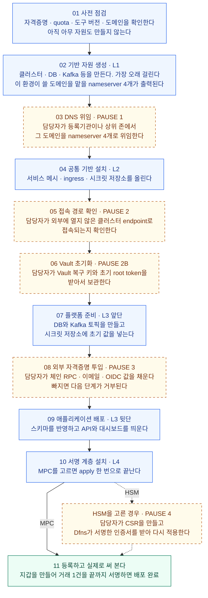
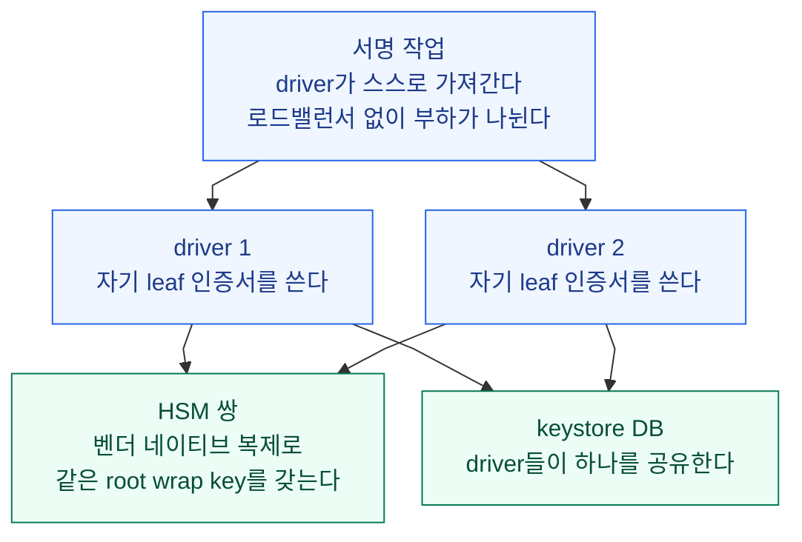

Dfns 제공 자료가 설명하는 **배포 실행 절차**를 모았다. 고객이 먼저 준비할 인프라와 설정, 제공되는 배포 번들, 계층별 설치 순서와 중단 지점, 환경 가동 후의 운영 작업을 다룬다. 실제로 배포를 수행하는 시점에 펴 보는 문서다.

절차는 **고객 AWS 계정 배치를 기준으로 서술된 벤더 자료**다. EKS·MSK·nameserver 위임·SSM bastion처럼 AWS를 전제한 단계가 포함돼 있다. 사내 데이터센터의 지원 경로는 확정되지 않았으므로 아래 절차를 그대로 적용할 수 있다고 가정하지 않는다. 우리가 제안하는 구축 순서와 인수 조건은 [Baseline 인프라 설계](03-baseline-datacenter-design.md)에 따로 있다.

| 읽는 순서 | 문서에서 확인할 내용 |
|---|---|
| [도입 개요](00-on-premise-deployment.md) | 운영 모델·배포 프로필·제품 구성·아키텍처 계층 |
| 이 문서 | 사전 준비·배포 번들·설치 절차·배포 후 운영 |
| [Baseline 인프라 설계](03-baseline-datacenter-design.md) | 사내·AWS 배치안과 우리 구축 순서·인수 조건 |
| [담당자 확인 질문](04-vendor-questions.md) | 비AWS 지원 경로를 포함한 전달용 질의 |

## 배포 절차 한눈에 보기

배포는 운영자가 단계별로 확인하고 진행하는 절차다. 도구는 각 계층의 작업을 자동으로 실행하고, **고객이 직접 처리해야 하는 단계에서 멈춘다.** 자료는 이 멈춤을 PAUSE라고 부르며 MPC 경로에 4곳, HSM 경로에 1곳이 더 있다. 사전 요건이 준비돼 있으면 첫 배포는 1~2영업일이 걸린다고 자료는 설명한다.

아래 그림은 순서와 담당만 보여 준다. 각 단계의 정확한 내용은 [단계별 상세](#단계별-상세) 표에 있다.

**그림 읽는 법.** 파란 상자는 도구가 알아서 실행하는 단계다. 주황 점선 상자는 도구가 멈추고 담당자가 직접 해야 끝나는 단계이며, 자료가 PAUSE라고 부르는 지점이다. 초록 상자는 배포가 끝났는지 판정하는 마지막 확인이다. 10단계에서 MPC를 고르면 바로 11단계로 가고, HSM을 고르면 인증서 발급 때문에 한 번 더 멈춘다.

**도메인은 이 환경에만 쓸 것을 따로 준비한다.** 회사 도메인 하나를 쓰거나, 그 아래 서브도메인 하나를 떼어 쓴다. 조건은 상위 존을 회사가 통제하는 것이다. 3단계의 위임은 등록기관이나 상위 존에서 한다.

전용이어야 하는 이유는 환경이 apex와 와일드카드에 응답하기 때문이다. 도메인 자체와 그 아래 모든 이름을 이 환경이 가져가므로 다른 서비스와 같이 쓸 수 없다. 배포가 끝나면 API는 api.<도메인>으로 응답한다.

L1부터 L4까지는 [아키텍처의 네 계층](00-on-premise-deployment.md#아키텍처의-네-계층)에서 정의한 계층이고, 앞 계층을 끝내야 다음 계층으로 넘어간다. 이 순서는 번들의 Makefile이 강제한다.

**완료 기준.** 고객이 운영하는 환경에서 지갑이 만들어지고 트랜잭션 하나가 끝까지 서명됐을 때만 배포가 끝난 것으로 본다.

## 고객이 준비할 인프라와 설정

| 구분 | 준비 항목 |
|---|---|
| AWS 계정 | EKS 와 MSK 를 모두 제공하는 리전의 전용 AWS 계정, quota 여유 포함. 참조 배치는 작은 arm64 노드 그룹에서 on-demand vCPU 약 32개를 쓰고, HSM 경로는 driver 쪽 구성요소용 amd64 용량이 추가된다. |
| DNS | 도메인 하나, 또는 위임받은 서브도메인 하나. 조건은 그 도메인의 상위 존을 회사가 통제하는 것이다. 환경이 apex와 와일드카드에 응답한다. 즉 도메인 자체와 그 아래 모든 이름을 이 환경이 가져가므로 다른 용도와 겸할 수 없다. |
| 배포용 신원 | 계층별 배포용 신원(인증 주체). 계층마다 별도의 배포용 신원 하나와 운영자용 읽기 전용 신원. 초기 배포(day 0)는 넓은 권한으로 실행하고, 최소 권한으로 줄이는 것은 day 0 이후의 문서화된 보안 강화 단계다. |
| Terraform state 백엔드 | 버전 관리·KMS 암호화된 S3 버킷 하나. 서명 계층의 state 에는 전용 KMS 키를 둘 것을 권한다. |
| 운영자 워크스테이션 | macOS 또는 Linux 에 표준 도구(AWS CLI v2, OpenTofu 또는 Terraform, kubectl, Helm, jq, dig, SSM session plugin). bootstrap 스크립트가 설치하고 preflight 가 검증한다. |
| 고객이 소유하는 시크릿 | Vault 보관 값, 파일이나 state 가 아니라 고객 시크릿 매니저에 두는 DB 마스터 자격증명, pull-through 채널을 쓸 때의 레지스트리 자격증명, 외부 시스템 연동에 필요한 서드파티 자격증명. |
| HSM 경로 한정 | 프로비저닝된 HSM(파티션, 사용자, PIN), 벤더 PKCS#11 클라이언트 설정, driver 호스트, keystore DB 용 PostgreSQL 인스턴스, 그리고 필수 요건인 root wrap key 백업 방안. |

**Day-0 결정 7개.** 자원을 생성하기 전에 결정 시트에 기록한다.

| # | 결정 | 자료가 제시한 선택지 |
|---|---|---|
| 1 | 서명 프로필 | MPC 또는 HSM 중 하나. governance engine은 선택으로 추가 |
| 2 | 컴퓨트 모델 | 정적 노드 그룹 또는 autoscaling |
| 3 | 도메인 시나리오 | 선택지 미기재 |
| 4 | 네트워크 경로 | 선택지 미기재 |
| 5 | 이미지 레지스트리 채널 | 아래 「이미지 배포 채널」의 세 가지 |
| 6 | CloudFront + WAF edge | 선택 |
| 7 | 선택 기능 | 메트릭 · captcha |

시크릿 백엔드의 초기 고정과 프로필별 bootstrap 차이는 [Baseline과 AWS-Native 선택](00-on-premise-deployment.md#baseline과-aws-native-선택)을 따른다.

## 배포 패키지와 이미지 제공

Dfns 에게 받는 것은 두 가지다. **번들**은 배포에 필요한 파일 묶음이고, **컨테이너 이미지**는 실제로 실행되는 것이다. 번들은 버전이 지정되고 서명된 묶음 하나이며, 이미지는 세 채널 중 고른 방법으로 받는다.

| 받는 것 | 무엇이 들어 있나 | 형태 | 전달 방법 |
|---|---|---|---|
| 번들 | 안내서, Terraform, Helm chart, values 템플릿, 이미지 manifest, 무결성 자료 | 서명되고 버전이 지정된 묶음 파일 하나 | **자료에 없다** |
| 컨테이너 이미지 | 플랫폼과 서명 계층이 실행할 이미지 | 레지스트리 경로·tag·digest가 번들의 manifest에 적힌 이미지 | 아래 세 채널 중 하나 |

**두 가지는 번들 안에서 이어진다.** 번들의 이미지 manifest 가 모든 컨테이너 이미지의 레지스트리 경로와 tag, sha256 digest 를 릴리스 시점에 기록한다. 번들 파일 자체는 서명된 체크섬 목록과 릴리스 공개키로 검증하고, 컨테이너 이미지의 서명은 번들에 함께 든 cosign 공개키로 검증한다. 검증에 필요한 값과 열쇠가 모두 번들에 있다.

### 번들에 들어 있는 것

| 번들 구성 | 내용 |
|---|---|
| 배포 안내서와 운영 절차서 | 오프라인으로 읽을 수 있는 deployment handbook 과 주제별 runbook(day-0 walkthrough, 연결성, DNS 위임, Vault 초기화, 서드파티 시크릿, HSM 인증서 발급과 root wrap key 절차, 조직 bootstrap, day-2 운영, 진단, sizing) |
| Terraform root 와 module | 4개 계층 root 와 의존하는 모든 module이 번들에 포함돼 있고, preflight 검사와 계층 순서를 강제하는 Makefile 이 있다. 서드파티 provider 는 egress 제한 환경용으로 번들에 미러링할 수 있다 |
| Helm chart | 플랫폼 통합 차트(umbrella)와 서명 계층 chart(signer, HSM, HSM driver, governance, 초기화), 모두 번들에 포함 |
| Values 템플릿 | 주석이 달린 terraform.tfvars.example과 고객 설정용 values 초기 파일. **고객이 편집하는 파일은 이 둘뿐이다** |
| 이미지 manifest | 모든 컨테이너 이미지의 레지스트리 경로, tag, sha256 digest. 릴리스 시점에 기록된다 |
| 무결성 자료 | 번들 모든 파일의 서명된 체크섬 목록, 검증용 릴리스 공개키, 각 컨테이너 이미지 서명을 검증할 cosign 공개키 |

### 이미지를 받는 세 채널

환경별로 세 채널 중 하나를 고른다. 어느 채널을 쓸지는 [Day-0 결정](#고객이-준비할-인프라와-설정)의 5번 항목이다.

| 채널 | 방식 |
|---|---|
| pull-through | Dfns 제공 레지스트리 자격증명으로 직접 받는다 |
| 복제 | 고객 아티팩트 저장소로 복제한다 |
| 오프라인 | 완전 오프라인 OCI tarball 을 제공 스크립트로 고객 레지스트리에 import 한다 |

자료는 에어갭 운영 환경에 오프라인 채널을 권장한다.

**업그레이드**도 같은 방식이다. 릴리스마다 전체 파일이 담긴 새 번들을 제공하며, 바뀐 부분만 덮어쓰는 방식이 아니다. 압축을 풀기 전에 검증한 뒤 계층별로 적용한다.

## 단계별 상세

위 흐름도의 각 단계에서 실제로 일어나는 일이다. 담당은 도구가 자동 실행하는지, 고객이 직접 처리하는지를 가리킨다.

| 순서 | 단계 | 담당 | 내용 |
|---|---|---|---|
| 01 | Preflight | 도구 | 제공된 검사가 자격증명, 리전 서비스 지원, quota, 레지스트리 접근, 도구 버전, 도메인을 생성 전에 검증 |
| 02 | L1 apply | 도구 | Substrate 생성. 가장 오래 걸리는 단계로 관리형 Kafka 클러스터가 시간의 대부분. Terraform 이 nameserver 4개를 출력 |
| 03 | DNS 위임 · **PAUSE 1** | 고객 | 고객이 등록기관 또는 상위 존에서 이 환경에 쓸 도메인을 그 nameserver 로 위임. 인증서 검증과 TLS 사용을 위한 필수 단계 |
| 04 | L2 apply | 도구 | 서비스 메시, ingress, 시크릿 저장소 |
| 05 | 연결성 · **PAUSE 2** | 고객 | private 클러스터 endpoint 로의 경로 확인. 제공된 SSM bastion 터널이 기본이며, 고객 VPN 이나 VPC 내 runner 도 같은 정도로 동작한다 |
| 06 | Vault 초기화와 키 보관 · **PAUSE 2B** | 고객 | 고객이 vault operator init 을 실행하고 recovery key 와 초기 root token 을 즉시 고객의 키 보관 계획에 따라 보관. root token 은 PAUSE 3 에서 한 번 더 쓰고 폐기 |
| 07 | L3 stage 1 | 도구 | 데이터베이스와 토픽 생성, 시크릿 초기 값 주입 |
| 08 | 서드파티 시크릿 · **PAUSE 3** | 고객 | 고객만 줄 수 있는 자격증명을 시크릿 저장소에 채움. 체인 RPC endpoint, 이메일 provider, OIDC 클라이언트 설정, 선택 연동. 계약별 목록이 번들에 있고, 필수 항목이 없으면 다음 단계가 plan 을 거부 |
| 09 | L3 stage 2 | 도구 | 애플리케이션 배포. 스키마 마이그레이션, 플랫폼 bootstrap, umbrella release. 검증은 api.<도메인> 응답, 두 대시보드 로드, 첫 staff 관리자의 passkey 등록 |
| 10 | L4 apply | 도구 · HSM은 고객 단계 추가 | 서명 계층. MPC 는 apply 한 번. HSM 은 **PAUSE 4 · 인증서 발급 절차**가 추가된다. 아래 상세 참조 |
| 11 | Keystore 등록과 전체 흐름 검증 | 고객 | staff 대시보드에서 서명 클러스터를 key store 로 등록(WebAuthn 게이트). 조직을 연결하고, 지갑을 만들어 트랜잭션 하나를 끝까지 서명해 배포 상태를 검증 |

### 10단계 HSM 경로의 추가 절차

HSM 을 고르면 L4 apply 가 두 번으로 나뉘고 그 사이에 인증서 발급이 들어간다. 첫 driver 시작 때 root wrap key 생성·백업 절차도 함께 수행한다.

| 순서 | 수행 주체 | 내용 |
|---|---|---|
| 1 | 고객 | 제공 스크립트로 CSR 을 만든다. **개인키는 고객 보관을 떠나지 않는다** |
| 2 | Dfns | 환경별 CA 로 서명한다 |
| 3 | 고객 | 서명된 인증서를 넣고 두 번째 apply 를 실행한다 |
| 4 | driver | 첫 driver 시작 때 HSM 파티션에 root key 를 자동 프로비저닝한다 |
| 5 | 고객 | **지갑이 하나라도 생기기 전에** root wrap key 를 백업한다 |

## 배포 후 운영

PDF는 환경 가동 후의 운영이 소수의 정해진 작업으로 구성된다고 설명한다. 아래 항목들은 운영팀이 Dfns 인프라에 대한 런타임 의존 없이 수행하도록 설계됐다.

| 작업 | 방식 |
|---|---|
| 업그레이드 | 릴리스마다 새 서명 번들. 검증 뒤 번들에 포함된 module과 chart 를 통째로 교체하고 계층별로 plan·apply. 애플리케이션만 올리는 버전 변경은 values 변경이다 |
| 롤백 | 버전 관리되는 Terraform state 와 digest 고정 이미지. runbook 이 인프라·애플리케이션 롤백을 다루고 스키마 마이그레이션에 롤백 스크립트가 함께 제공된다 |
| 인증서 로테이션 | edge 인증서는 DNS 위임이 유지되면 자동 갱신. 서명 계층 CA·leaf 로테이션은 시크릿 저장소 절차 뒤 pod 재시작. 메시 인증서는 자동 |
| 시크릿 저장소 관리 | day 0 뒤 초기 root token 폐기, 범위 제한 운영자 토큰과 Kubernetes 인증으로 전환, 감사 로깅 활성화 |
| 진단 | 흔한 실패 유형(초기화 job 실패, DB TLS 신뢰, 시크릿 저장소 접근, 노드 아키텍처 불일치)을 다루는 runbook. 모든 서비스가 서로 연관 지어 분석할 수 있는 구조화 로그를 낸다 |
| HSM 이중화 | 운영 환경은 벤더 네이티브 복제로 같은 root wrap key 를 가진 HSM 쌍에 driver 2개 이상을 연결해 운영한다. driver 마다 자기 leaf 인증서, keystore DB 는 공유. pull 모델이라 로드밸런서 없이 부하가 나뉜다 |

### HSM 이중화 구성

**그림 읽는 법.** 파란 상자는 서명 작업을 가져가 처리하는 쪽, 초록 상자는 키와 상태를 보관하는 쪽이다. 운영 환경은 driver를 최소 2개 두고 HSM은 쌍으로 두며, 인증서는 driver마다 따로 갖고 keystore DB는 하나를 공유한다. 각 driver가 두 HSM 중 어디에 붙는지는 자료에 없어 쌍을 한 상자로 묶었다.

**정기 장애 전환 시험.** driver 하나나 HSM endpoint 하나에 장애가 나도 서명은 계속된다. 이 장애 전환(failover)을 정기적으로 시험하는 것이 이중화 구성을 믿을 수 있게 하는 가장 단순한 방법이라고 PDF 는 권한다.

## 관련 가이드

| 가이드 | 내용 |
|---|---|
| DFNS Outbound Email On-Premise | 고객 SMTP relay 에 대한 발신 이메일 설정(full·Essentials 에디션) |
| User Onboarding Without Email | 고객이 운영하는 DB 에 가입 코드를 직접 넣는 break-glass 온보딩 |
| Deployment handbook (번들 안) | 초기 배포의 기준이 되는 단계별 절차, 계층별 runbook, 진단 |

## 배포에서 확인이 필요한 것

이 문서를 쓰면서 자료에 답이 없던 항목이다.

| 항목 | 자료에 있는 것 | 없는 것 | 질의 |
|---|---|---|---|
| 번들 전달 방법 | 서명되고 버전이 지정된 묶음 파일 하나라는 것. 이미지는 세 채널로 받는다는 것 | 번들 파일을 어디서 어떻게 받는지. 내려받기 경로, 매체, 자격증명, 재발급 절차 | [Q08](04-vendor-questions.md#q08-배포-번들은-어떻게-받나요) |
| 채널별 외부 연결 | 세 채널의 종류와 에어갭에 오프라인 권장 | 채널별로 외부 연결이 언제 얼마나 필요한지 | [Q08](04-vendor-questions.md#q08-배포-번들은-어떻게-받나요) |
| Preflight 실행 범위 | 1단계에서 여섯 항목을 검사한다는 것과 Makefile이 강제한다는 것 | 실행 명령, 검사 실패 시 동작, 계층마다 다시 도는지 여부 | [Q09](04-vendor-questions.md#q09-preflight-검사와-day-0-도메인-결정의-범위를-알려주세요) |
| 도메인 시나리오 | Day-0에 결정할 항목이라는 것 | 어떤 선택지 중에 고르는지 | [Q09](04-vendor-questions.md#q09-preflight-검사와-day-0-도메인-결정의-범위를-알려주세요) |

네 항목은 2026-09-16 담당자 질문에 Q08·Q09로 반영했으며 아직 발송하지 않았다. 자료에서 확정되지 않은 그 밖의 항목은 [도입 개요의 추가 확인 사항](00-on-premise-deployment.md#추가-확인-사항)에 모았고, 지원 경로를 묻는 질의는 [담당자 확인 질문](04-vendor-questions.md)에 있다.
