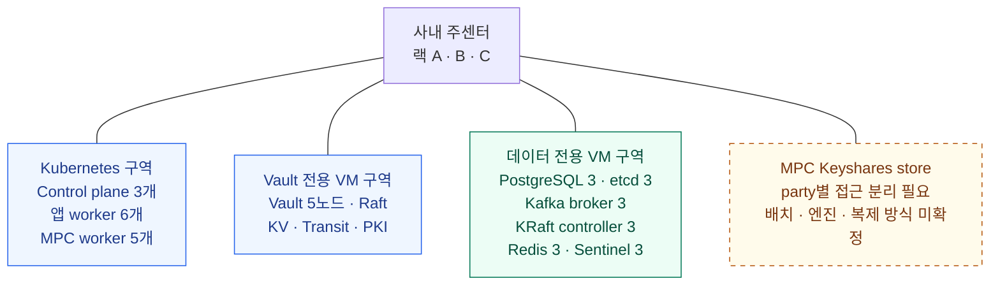
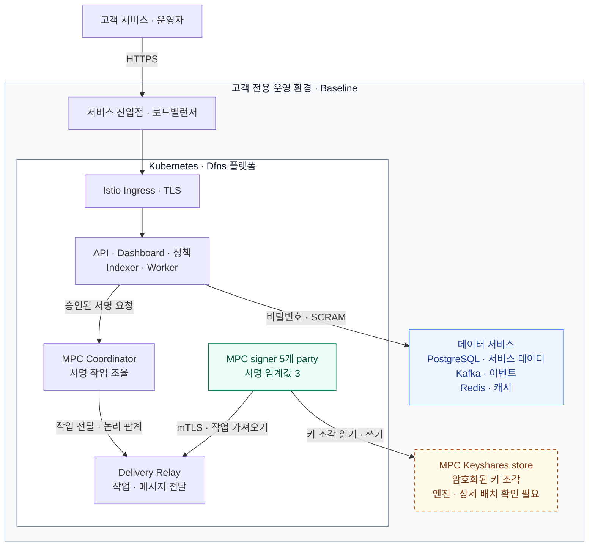
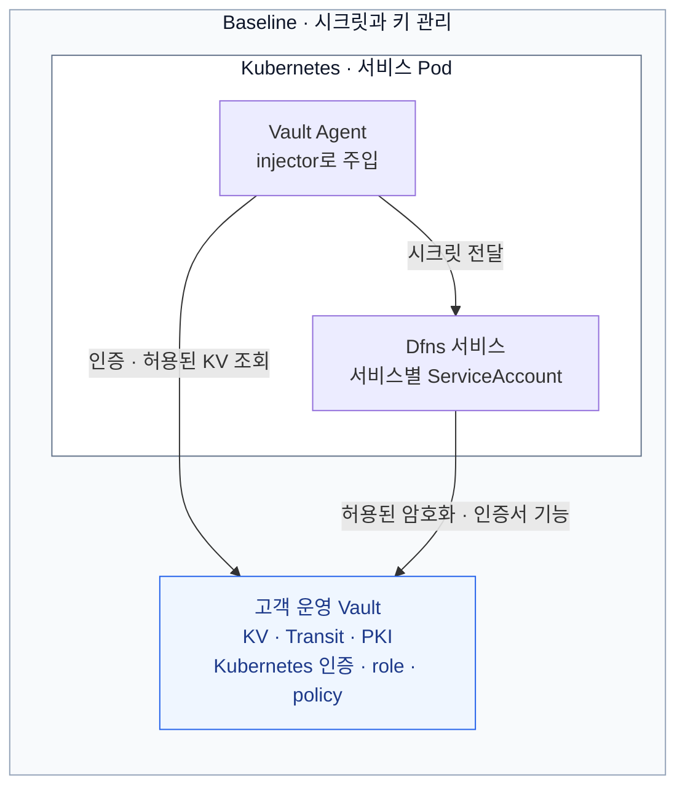

사내 데이터센터에 Dfns 전체 플랫폼을 두고, Kubernetes + Istio + 자체 운영 Vault·PostgreSQL·Kafka·Redis + MPC 5-party / 3-of-5로 구성하는 제안이다. 고객 소유 AWS 계정 배치나 Hybrid MPC가 아니라, 사용자가 선택한 사내 데이터센터 전체 플랫폼 배치를 대상으로 한다.

이 문서는 벤더 원문을 옮긴 문서가 아니라 사용자 요청에 따라 작성한 인프라 설계안이다. 아래 노드 수·용량·망 분리·운영 정책은 제안값이며 Dfns의 확정 지원 사양이나 배포 완료 상태를 뜻하지 않는다. 벤더 근거는 [온프레미스 개요](00-on-premise-deployment.md)와 [배포 백엔드 비교](02-deployment-backends.md), 기반 제품의 동작은 각 절의 공식 문서를 따른다.

## 1. 설계 전제와 구축 전 확인

| 항목 | 이 설계의 선택 |
|---|---|
| 배포 범위 | 사내 데이터센터에 API·대시보드·정책·인덱싱·서명·데이터 저장소 전체 배치 |
| 프로필 | Baseline: Vault KV·Transit·PKI, Vault Kubernetes 인증, 비밀번호 기반 데이터 서비스 인증 |
| 테넌트 | {{단일 테넌트::Dfns를 도입하는 우리 조직 전용 환경. 개인 고객이나 지갑 하나를 뜻하지 않는다.}} |
| 서명 | MPC 5개 party, 서명 임계값 3. HSM 서명과 Governance Engine은 별도 설계 변경으로 다룸 |
| 장애 구역 | 주센터 안의 랙 A·B·C. 전원·상위 스위치·물리 호스트 장애를 분리한다고 가정 |
| 외부 연결 | 기관 내부 서비스에서 API에 접근. 체인 RPC·웹훅 등 필요한 외부 통신은 통제된 출구 사용 |
| 환경 분리 | 개발·검증·운영은 클러스터·Vault·DB·키를 각각 분리. 아래 수량은 운영 1환경 기준 |
| 배포 상태 | 아키텍처·자원 계획 단계. 실장비·VM·클러스터는 생성하지 않음 |

**구축 착수 전에 Dfns가 확인해야 할 두 가지가 있다.**

1. **비AWS 환경의 지원 배포 경로.** 기존 개요의 L1은 EKS·Aurora·MSK·ElastiCache·Route53·ACM·SSM을 생성한다. 직접 만든 Kubernetes에 chart만 설치하는 방식은 지원 경로가 아니라고 적혀 있다. 이번 설계에 맞는 온프레미스 Terraform 모듈·chart·배포 안내서 또는 동등한 지원 경로를 받아야 한다. (온프레미스 개요 5·17쪽)
2. **CPU 아키텍처.** 제공 자료의 애플리케이션 이미지는 arm64 전용이다. 사내 서버가 x86만 지원한다면 Dfns의 지원되는 amd64 이미지가 필요하다. 일반적인 x86 가상화 환경에 arm64 VM을 만든다고 해결되지 않는다. 이 설계는 애플리케이션용 arm64 실행 자원을 확보하는 조건이며, MPC signer와 부가 구성요소의 이미지 아키텍처도 별도 확인한다. (온프레미스 개요 6·17쪽)

Baseline이라는 이름만으로 비AWS 배포 지원이 확정되는 것은 아니다. 아래 구성은 그 지원 경로를 검토할 수 있도록 구체화한 제안이다. 소프트웨어 버전도 최신 버전으로 임의 조합하지 않고 Dfns 릴리스와 호환되는 Kubernetes·Istio·Vault·DB·Kafka·Redis 버전 목록으로 고정한다.

AWS에서도 Baseline을 사용하므로 플랫폼 역할은 유사하지만, 기반 서비스와 Vault 잠금 해제 방식의 대체가 필요하다. **L1 교체만으로 충분한지, L2~L4도 변경해야 하는지**를 [Dfns 담당자 확인 질문](04-vendor-questions.md)에 정리했다. 같은 문서에서 비AWS 지원 경로와 외부 Vault·DB·Keyshares 배치 지원도 확인한다.

## 2. 전체 구성

DAWBC·DAW-CORE와 위탁 운영 노드까지 연결하는 업무 흐름과 운영 책임은 [DAW 통합 설계](../DAW%20구축%20설계/00-integration-plan.md)에 정리했다.

이 절은 사내 배치 구역과 Baseline 서비스 관계를 함께 보여 준다. 2.1절은 물리 배치 제안, 2.2절은 서비스·데이터·MPC의 논리 관계다. Vault 연결은 4절에서 다룬다.

애플리케이션과 MPC는 Kubernetes에 배치하고, Vault와 데이터 서비스는 별도 VM에서 운영하는 제안이다. Kubernetes 장애가 Vault까지 함께 중단시키는 상황을 줄이려는 선택이다. Vault 자체의 TLS 키와 복구 자격증명은 별도로 확보한다. **외부 Vault·DB endpoint 연결을 Dfns 배포 패키지가 지원하는지는 구축 전 확인한다.**

### 2.1 배치 구역

아래 선은 배치 구역의 분류다. 네트워크 연결이나 호출 순서를 뜻하지 않는다. 데이터 운영 구역 안의 PostgreSQL·Kafka·Redis도 각각 별도 VM으로 구성하며, 상세 수량은 3절에 적었다.

잠금 해제 담당자 5명은 서버 배치와 별개인 운영 역할이다. 재시작한 Vault 노드마다 3명이 참여하는 Shamir 절차는 4.1절에서 설명한다. 독립 백업 저장소와 보조센터 복사 경로는 7절에서 별도로 다룬다.

### 2.2 서비스·데이터·MPC 서명

API·대시보드·정책·MPC signer는 Kubernetes에서 실행한다. 데이터 서비스는 PostgreSQL·Kafka·Redis로 구성한다. **PostgreSQL·Redis는 비밀번호, Kafka는 SCRAM으로 인증**한다. Vault의 시크릿 전달·암호화·인증서 기능은 4절에서 설명한다.

Coordinator에서 Relay로 이어지는 선은 작업 전달의 논리 관계다. Signer는 Relay에 mTLS로 연결해 작업을 가져오며, 각자의 키 조각으로 공동 서명한다. 5개 party·3-of-5는 온프레미스 개요 p.7의 기본 구성이다. Keyshares store의 엔진이나 일반 서비스 DB와의 공유 여부는 확정하지 않았으며, 엔진·party별 접근·복제·복구 요건은 [담당자 질문 Q03](04-vendor-questions.md)에 남겼다.

API와 운영 화면은 별도 VIP·호스트로 진입 경로를 나누고, 방화벽·Istio 정책·기관 IdP로 접근을 제한한다. L4만으로 사용자 인증이나 URL별 접근 제어를 수행하는 구성은 아니다. VIP 수와 ingress 배포 방식은 벤더의 호스트 구성과 맞춘다.

| 별도 연결 | 용도와 경계 |
|---|---|
| 허용 서비스·Vault Agent → Vault | 서비스별 시크릿·암호화·인증서 기능. signer마다 필요한 기능과 권한은 벤더 명세로 제한 |
| 애플리케이션 → PostgreSQL·Kafka·Redis | 서비스 데이터·이벤트·캐시. Keyshares store와 저장소를 공유한다고 가정하지 않음 |
| 지정 workload → 통제된 외부 연결 | 체인 RPC·웹훅 등의 허용 목적지만 연결 |
| 저장소 → 독립 백업 저장소 | 저장소별 백업 도구·보존 정책 사용. 백업 자격증명은 복구 대상 Vault와 독립 보관 |

실제 주소·포트·인증서 주체는 6절의 연결표와 벤더 인터페이스 명세로 확정한다. 전체 인프라를 사내에 두어도 공개 체인을 쓰려면 체인 네트워크와 연결되는 경로는 필요하다.

## 3. 서버와 초기 자원 계획

아래는 **성능 측정 전 자원 예약안**이다. Dfns가 제시한 AWS 참조 환경의 약 32 vCPU를 사내 환경의 검증된 최소 사양으로 사용하지 않는다. 애플리케이션 worker는 6개로 시작해, 한 랙의 2개가 없어져도 4개가 남도록 잡았다. 실제 처리량·동시 서명·체인 인덱싱 부하를 측정한 뒤 조정한다. (벤더 참조 수치: 온프레미스 개요 14쪽)

| 역할 | 수량 | 노드당 초기 자원 | 배치와 저장소 |
|---|---:|---|---|
| 내부 L4 / HAProxy | 2 | 2 vCPU / 4 GiB | 기존 이중화 L4 장비가 있으면 대체. 두 랙에 분산 |
| Kubernetes control plane + etcd | 3 | 4 vCPU / 8 GiB | 랙마다 1개, OS 100 GiB + etcd 전용 SSD 100 GiB |
| 애플리케이션 worker | 6 | 8 vCPU / 32 GiB | **arm64**, 랙마다 2개, OS·이미지 캐시 200 GiB |
| MPC 전용 worker | 5 | 4 vCPU / 16 GiB | 이미지 아키텍처 확인 후 발주. party마다 노드 1개, 랙별 2·2·1 |
| Vault | 5 | 4 vCPU / 16 GiB | 전용 VM, 랙별 2·2·1, Raft용 SSD 200 GiB와 감사 로그 디스크 분리 |
| PostgreSQL + Patroni | 3 | 8 vCPU / 32 GiB | 랙마다 1개, 데이터 1 TiB + WAL 200 GiB부터 예약 |
| Patroni용 별도 etcd | 3 | 2 vCPU / 4 GiB | 랙마다 1개. Kubernetes etcd와 공유하지 않음 |
| Kafka broker | 3 | 8 vCPU / 32 GiB | 랙마다 1개, 데이터 SSD 1 TiB부터 예약 |
| Kafka KRaft controller | 3 | 2 vCPU / 4 GiB | 랙마다 1개, broker와 별도 VM |
| Redis + Sentinel | 3 | 4 vCPU / 16 GiB | 랙마다 1개. primary 1 + replica 2, Sentinel은 각 VM에 1개 |

표의 합계는 **36개 VM 또는 노드, 176 vCPU, 648 GiB 메모리**다. 물리 서버 수나 구매 수량을 뜻하지 않는다. **DAW-CORE·DAWBC·위탁 체인 노드, Keyshares store 전용 자원, 레지스트리, 백업, 모니터링, 사내 DNS·PKI·시간 서버, 보조센터는 합계에 포함하지 않았다.** 기존 공용 인프라를 사용할지 별도 증설할지 실사해 더한다.

각 replica를 같은 물리 호스트나 단일 스토리지 장비에 몰아두지 않는다. 특히 MPC worker 5개와 Vault 노드 5개는 각각 서로 다른 물리 호스트에 배치한다. VM 이름만 다르게 만드는 것으로 장애·권한 경계가 분리되지는 않는다.

| 장애 구역 | K8s control plane | 앱 worker | MPC party | Vault | DB / broker / controller / Redis |
|---|---|---|---|---|---|
| 랙 A | cp-1 | app-1, app-2 | signer-1, signer-2 | vault-1, vault-2 | 각 1개 |
| 랙 B | cp-2 | app-3, app-4 | signer-3, signer-4 | vault-3, vault-4 | 각 1개 |
| 랙 C | cp-3 | app-5, app-6 | signer-5 | vault-5 | 각 1개 |

이 배치는 한 랙을 잃어도 Vault Raft와 MPC에 각각 3개 이상이 남도록 한 것이다. **전체 서비스의 무중단을 보장하는 수치는 아니다.** ingress·DB·저장소·네트워크도 함께 살아 있어야 한다. Vault의 5노드·3개 장애 구역 근거는 [HashiCorp Raft 참조 구성](https://docs.hashicorp.com/vault/tutorials/day-one-raft/raft-reference-architecture), Kubernetes control plane 3개 구성은 [Kubernetes HA 가이드](https://kubernetes.io/docs/setup/production-environment/tools/kubeadm/high-availability/)를 참고했다.

## 4. Vault와 키 구성

Baseline은 Vault KV·Transit·PKI를 사용한다. Vault Agent injector는 Pod에 Agent를 주입하고, Agent는 허용된 시크릿을 가져온다. 서비스 신원에는 Vault Kubernetes 인증과 서비스별 role을 사용한다. Vault 서버의 배치와 잠금 해제 방식은 실제 구축 환경에 맞춰 확정한다. ([배포 백엔드 비교](02-deployment-backends.md) 2쪽)

서비스에서 Vault로 향하는 선은 기능 의존을 나타낸다. 각 서비스와 발급 구성요소는 허용된 기능만 사용하며, 실제 호출 주체·주입 방식·권한은 배포 패키지로 확정한다. Vault 상자는 역할을 구분한 것으로, Kubernetes 내부·외부의 물리 배치 위치를 지정하지 않는다.

### 4.1 Vault 자체의 잠금 해제

**초기안은 외부 KMS 없이 Shamir 수동 unseal을 사용한다.** 초기화 때 unseal key를 5개 조각으로 나누고, 서로 다른 담당자 3명이 참여해야 잠금을 해제하도록 제안한다. 각 조각은 담당자별 암호화 매체와 별도 보관 절차로 관리하며 서버·Git·배포 runner·동일 비밀번호 관리자에 함께 넣지 않는다.

Vault 노드가 재시작하면 해당 노드마다 다시 잠금을 해제해야 한다. 따라서 5개 노드를 동시에 자동 재시작하지 않고, 담당자 참여가 가능한 작업 시간에 하나씩 교체한다. 이 운영 부담을 받아들이기 어렵다면 **사내 HSM 기반 auto-unseal**을 별도 검토한다. HSM 호환성·제품 에디션·라이선스 확인 전에는 자동 잠금 해제 기능이 준비됐다고 보지 않는다. [Vault Seal/Unseal](https://developer.hashicorp.com/vault/docs/concepts/seal)

기존 AWS 개요의 KMS auto-unseal에서 생성하는 것은 recovery key이고, 이 설계의 Shamir 초기화에서 생성하는 것은 **unseal key**다. 원문의 recovery key 보관 절차를 이름만 바꿔 적용하지 않는다. 초기 root token은 bootstrap 이후 폐기하고 일상 운영에는 범위를 제한한 인증을 사용한다.

### 4.2 Vault 안의 역할

| 역할 | 제안 구성 | Dfns와 확인할 경계 |
|---|---|---|
| KV | 서비스별 DB·Kafka·Redis 자격증명, SMTP·OIDC·RPC 설정 | 실제 mount 경로·KV 버전·시크릿 스키마 |
| Transit | 서비스별 암호화키. **`aes256-gcm96`을 후보로 제안** | Dfns가 요구하는 키 타입·데이터키 사용 방식·암호문 형식 |
| PKI | 서명 계층용 전용 intermediate CA와 party별 인증서 | CN·SAN·EKU·TTL·갱신 방식, 사내 CA 연결 지원 |
| Kubernetes auth | 서비스마다 ServiceAccount·namespace·Vault role 연결 | TokenReview 접근·토큰 audience·갱신 방식 |
| Audit | 독립 저장·전송 경로, 디스크 사용량·전송 실패 경보 | 로그 보존 정책과 개인정보 처리 |

Transit의 `aes256-gcm96`은 **256비트 AES 키와 96비트 nonce**를 사용하는 Vault 키 타입이다. `exportable=false`, `allow_plaintext_backup=false`, `deletion_allowed=false`를 검토 기준으로 두되, Dfns bootstrap이 생성하는 키 설정을 먼저 확인한다. 키를 회전해도 기존 DB·백업의 암호문을 복호화하는 데 필요한 이전 버전을 즉시 삭제하지 않는다. [Transit 키 타입](https://developer.hashicorp.com/vault/docs/secrets/transit), [키 설정 예제](https://developer.hashicorp.com/vault/tutorials/encryption-as-a-service/eaas-transit)

애플리케이션은 자기 서비스 경로만 읽고, 다른 서비스의 시크릿·키 생성·키 삭제·관리 정책에는 접근하지 못하도록 설계한다. Vault에서 Kubernetes API로 TokenReview를 수행하는 연결도 준비한다. [Vault Kubernetes 인증](https://developer.hashicorp.com/vault/docs/auth/kubernetes)

Vault 서버의 HTTPS 인증서와 초기 배포용 자격증명은 사내 PKI·별도 운영 보관소에서 준비한다. 아직 시작하지 않은 Vault에 접속해야 Vault 자체의 TLS 키나 복구 암호를 얻을 수 있는 순환 의존을 만들지 않는다. TLS 전 구간 적용, 전용 비관리자 계정, swap·core dump 비활성화는 [Vault 운영 강화 지침](https://developer.hashicorp.com/vault/docs/concepts/production-hardening)을 따른다.

### 4.3 지갑키와 다른 키의 분리

| 키 | 이 설계에서의 위치·책임 |
|---|---|
| 지갑 서명키 | Dfns signer에서 분산 생성하는 MPC 키 조각. ECDSA secp256k1 / Ed25519는 벤더 개요에 명시 |
| MPC Keyshares store | 일반 앱 DB와 접근 경계를 분리. party별 자격증명·데이터 접근 범위를 구분하는 구성을 벤더와 확정 |
| Transit 키 | 애플리케이션 데이터 또는 데이터키를 보호하는 키. 지갑 서명키로 대체하지 않음 |
| Vault unseal key 조각 | Vault 잠금 해제를 위한 운영자 보관 자료. MPC 키 조각과 별개 |
| 플랫폼 issuer 키 | Ed25519 인증 토큰 서명키. 벤더 지정 시크릿 경로에 두고 auth 서비스만 접근 |
| mTLS 인증서 키 | 서비스·signer 신원용. 거래 서명키·Transit 키와 분리 |

지갑키·issuer 키·서명 계층 인증서의 벤더 근거는 [온프레미스 개요 7·9쪽](00-on-premise-deployment.md)이다. **Keyshares store의 저장 엔진·복제·백업·party별 분리 지원이 확인되지 않아 일반 PostgreSQL에 임의로 합치지 않는다.** 이 저장소의 주소·자원·복구 절차는 L4 Signing 배포 전 필수 확정 항목이다.

Kubernetes 관리자나 가상화 관리자가 모든 signer·볼륨에 접근할 수 있으면 MPC party를 5개로 나누는 것만으로 관리 권한이 분산되지는 않는다. 전용 노드·ServiceAccount·관리자 역할·변경 승인으로 접근을 제한하고, 독립 운영자나 별도 클러스터가 필요한 보안 요건이면 Dfns의 지원 토폴로지를 다시 확인한다.

## 5. 데이터 서비스와 Kubernetes

### PostgreSQL

PostgreSQL 3노드를 Patroni와 전용 etcd 3노드로 관리하고, primary endpoint는 현재 primary만 바라보는 내부 L4 health check로 제공한다. 서비스별 DB·사용자를 나누며 TLS와 비밀번호 인증을 사용한다. 초기안은 동기 replica 1개와 `synchronous_mode`·`synchronous_mode_strict`를 검토한다. 동기 replica가 없으면 쓰기를 멈추는 선택이며, 애플리케이션의 `synchronous_commit` 설정·타임아웃·강제 failover까지 검증해야 한다. 장애 시 데이터 손실이 언제나 0이라고 약속하지 않는다. [Patroni 복제 모드](https://patroni.readthedocs.io/en/latest/replication_modes.html)

이전 primary를 확실히 격리한 뒤 승격하도록 fencing·watchdog을 검증한다. DB endpoint, 연결 풀, TLS CA, 사용자 회전은 Dfns 클라이언트와 함께 시험한다. [Patroni watchdog](https://patroni.readthedocs.io/en/rel_3_3/watchdog.html)

### Kafka

Broker 3개와 KRaft controller 3개를 분리한다. SCRAM over TLS를 사용하고 토픽별 ACL을 제한한다. 사용자명·비밀번호와 ACL은 벤더가 요구하는 형식으로 생성해 Vault KV에 전달한다. ZooKeeper 대신 KRaft를 사용하는 것은 **Dfns 지원 버전 확인을 전제로 한 제안**이다. [Kafka KRaft 운영](https://kafka.apache.org/41/operations/kraft/)

중요 토픽은 복제 수 3, `min.insync.replicas=2`, producer `acks=all`을 기준으로 검토한다. Broker 설정만으로 producer 동작까지 보장되지 않으므로 Dfns의 실제 producer 설정도 확인한다. 토픽 이름·partition 수·retention·내부 토픽 설정은 임의로 덮어쓰지 않는다. [Kafka 토픽 설정](https://kafka.apache.org/41/generated/topic_config.html)

### Redis

Primary 1개·replica 2개에 Sentinel 3개를 두고, quorum 2를 제안한다. **Dfns 클라이언트의 Sentinel 지원을 확인한 뒤 확정한다.** 지원하지 않으면 Sentinel이 판별한 primary만 연결하는 벤더 승인 endpoint 방식을 정한다. TCP 포트가 열렸다는 이유만으로 primary로 판별하지 않는다. Redis는 비동기 복제이므로 failover 중 일부 쓰기가 손실될 수 있다. 캐시 재구성이 인증·멱등·서명 작업에 미치는 영향을 확인한다. [Redis Sentinel](https://redis.io/docs/latest/operate/oss_and_stack/management/sentinel/)

### Kubernetes와 Istio

Control plane 3개에 stacked etcd를 두고, API endpoint는 관리망에서만 접근한다. 사내 표준 배포판을 우선하되 Dfns가 지원하는 배포판·CNI·CSI를 확인한다. 외부 Vault Agent injector와 Istio sidecar가 함께 주입되는 Pod의 시작 순서·인증서 갱신·종료 처리를 검증한다.

서명 worker는 앱 worker와 분리하고 taint·node affinity·topology spread를 적용한다. Ingress는 앱 worker에 랙별로 분산 배치하고 자원을 예약한다. 전용 ingress 노드를 추가하는 경우 3절의 수량·자원 합계도 함께 늘린다. 무상태 서비스의 replica는 3개를 목표로 하되, cron·bootstrap·migration·coordinator는 벤더의 중복 실행 방지 방식에 맞춘다. 모든 workload를 일괄 3배로 복제하지 않는다. signer identity와 저장소를 보존하는 교체 절차를 사용하고, 단순 수평 확장으로 새 party를 생성하지 않는다.

## 6. 네트워크·접근 경로

IP는 아래 역할별로 IPAM에서 할당한다. 실제 사내 CIDR·도메인을 제공받기 전에는 예시 주소를 운영값으로 확정하지 않는다. Kubernetes Pod·Service CIDR은 관리망·서비스망·기존 사내망과 겹치지 않게 예약한다.

| 출발 → 목적지 | 포트·방식 | 허용 범위 |
|---|---|---|
| 기관 서비스 → API ingress | HTTPS 443 | 등록한 호출 서비스만 |
| 운영자 관리망 → staff dashboard | HTTPS 443 | VPN·관리 단말·기관 IdP 정책 적용 |
| 배포 runner·운영 단말 → K8s API | TCP 6443 | 관리망만 |
| K8s control plane ↔ 자체 etcd | TLS 2379·2380 | control plane 구성원만 |
| Vault·Vault Agent → K8s API | TLS 6443 | Vault의 TokenReview 등 필요한 API만 RBAC로 허용 |
| 앱·signer·운영 도구 → Vault | TLS 8200 | 서비스별 인증·정책 적용 |
| Vault 노드 ↔ Vault 노드 | TCP 8201, Raft·클러스터 통신 | Vault 구성원만 |
| 앱 → PostgreSQL primary endpoint | TLS 5432 | 서비스별 DB 사용자 |
| 앱 → Kafka broker | SASL_SSL 전용 listener | listener 포트는 배포 패키지와 확정, 예산안은 9093 |
| 앱 → Redis / Sentinel | TLS 전용 listener | Redis 6379·Sentinel 26379를 후보로 두고 클라이언트 호환성 확인 |
| signer → Delivery Relay / Keyshares store | mTLS·벤더 전용 프로토콜 | 정확한 포트·대상 목록을 L4 Signing 명세로 확정 |
| 허용 workload → 사내 레지스트리·백업·로그 | HTTPS 등 기관 표준 | 역할별 endpoint만 |
| 지정 앱 → 외부 RPC·웹훅·시세 API | 통제된 egress | 목적지·포트·DNS·인증서 검증, 프록시 호환성 확인 |

위 표는 주요 서비스 경로다. CNI·CoreDNS·kubelet·CSI·Istio 제어 통신, Patroni DCS·복제·health check, Kafka controller·broker 간 복제, Redis 복제·Sentinel 통신, DNS·NTP·백업 경로를 포함한 전체 방화벽 규칙은 설치 버전·실제 endpoint를 기준으로 생성한다. 미확정 포트가 있다는 이유로 서버망 전체를 허용하지 않는다.

공용 인터넷 ingress는 초기안에서 두지 않는다. API·dashboard는 기관 내부 DNS와 신뢰된 TLS 인증서를 사용한다. WebAuthn의 RP ID와 origin이 사내 도메인에서 일치하는지 시험한다. 루트 CA·인증서 발급·초기 관리자 로그인은 Dfns가 지원하는 도메인 bootstrap 방식과 맞춰야 한다.

## 7. 백업·복구·운영

### 저장소별 복구 자료

| 대상 | 제안하는 보존·복구 방법 |
|---|---|
| PostgreSQL | 기본 백업 + 연속 WAL 보관. 별도 저장소로 복사하고 시점 복구 시험 |
| Vault | Raft snapshot, 키 버전·mount·정책 변경 직후와 정기 백업. unseal 조각은 snapshot과 분리 |
| MPC | 벤더의 Keyshares store 백업과 고객 보관 암호화 백업 절차. 알고리즘·복구 도구·스토리지 호환성 확보 |
| Kubernetes | etcd snapshot, 배포 코드·이미지 digest, 별도 보관하는 bootstrap 키·CA·at-rest 암호화 자료 |
| Kafka | 토픽·ACL·consumer 설정 백업과 필요 이벤트 보존. 복제 수 3만으로 오삭제 복구가 되지는 않음 |
| Redis | 실제 데이터 용도를 확인해 persistence·백업 결정. 캐시 재생성만으로 복구되는지 시험 |

PostgreSQL의 기본 백업과 WAL을 결합하는 시점 복구는 [공식 PITR 문서](https://www.postgresql.org/docs/17/continuous-archiving.html)를 따른다. 보조센터는 독립 백업 복구 대상으로 두며, Raft·etcd·MPC quorum을 WAN 너머로 임의 분산하지 않는다.

**복구 목표 제안은 DB RPO 5분, 전체 서비스 RTO 4시간**이다. 보장치가 아니라 모의 복구의 합격 목표다. 키 자료는 시간 단위 RPO만으로 관리하지 않고, 새 지갑·키 회전 결과를 운영에 사용하기 전에 필요한 키 버전과 복구 자료가 확보되는 절차를 검증한다. 그 절차를 Dfns가 제공하지 않으면 잃을 수 있는 지갑·키 범위와 보완책을 별도로 확정한다.

Vault snapshot이 DB의 암호화키 버전보다 오래되면 DB만 복구해도 복호화하지 못할 수 있다. DB·Vault·MPC·인증서·플랫폼 릴리스의 복구 조합을 하나의 백업 목록으로 기록한다. 백업을 여는 비밀번호와 저장소 접근 자격증명이 복구 대상 Vault에만 존재하지 않도록 한다.

### 복구 순서

1. 복구 환경의 서명 작업 수신·거래 전송 경로를 차단하고, 원센터의 서명·전송 경로도 격리한다. 원센터 차단을 확인하지 못하면 복구 환경의 서명을 활성화하지 않는다.
2. 네트워크·DNS·시간 동기화·사내 PKI·관리 접근을 복구하되, 서명·전송 차단은 유지한다.
3. Vault와 데이터 저장소를 복구하고 Vault 노드별 잠금을 해제한다.
4. Kubernetes와 이미지 레지스트리를 복구한다. 재생성된 Pod·대기 작업이 자동으로 서명하거나 전송하지 않도록 차단 상태를 확인한다.
5. API·정책·인덱싱을 복구하고, 격리된 상태에서 MPC party identity·키 조각·인증서·지갑 공개키를 대조한다.
6. 체인 nonce·진행 중 거래·내부 기록을 대사하고 재처리 대상을 확정한다. DAWBC·DAW-CORE를 연결한 환경에서는 업무 요청 키·원금 잠금·이미 반영한 이벤트와 외부 대납업체의 예약·실행·청구도 함께 대사한다. 백업 이후 접수돼 로컬 기록에서 사라진 거래와 예약을 회수하기 전에는 새 전송을 허용하지 않는다.
7. 원센터 격리를 다시 확인한 뒤 복구 환경만 제한적으로 열어 검증 거래를 수행하고 서명을 재개한다. 동일 party나 복구 환경 두 곳을 동시에 활성화하지 않는다. 외부 relay가 이미 받은 서명·UserOperation은 원센터를 차단해도 남아 있을 수 있으므로, 해당 실행의 결과 또는 더 이상 실행될 수 없음을 확인할 때까지 같은 의도의 새 실행을 보류한다.

DB RPO 5분은 최근 5분의 업무 요청·원장·이벤트 중복 제거 기록을 잃어도 된다는 뜻이 아니다. DAWBC 실행 기록과 DAW-CORE 원장·처리 완료 기록의 별도 복구 목표를 정하고, 누락 구간을 복원할 조회·보존 계약을 확보한다. 복구 중에도 조회와 대사는 허용하되, 해소되지 않은 출금은 잠금·보류를 유지한다.

일상 경보에는 Vault sealed 상태·Raft quorum·디스크·감사 기록 실패, DB 복제 지연·WAL 적체, Kafka ISR·consumer lag, Redis failover, signer 가용 수·서명 지연, 인증서 만료·Webhook 실패를 넣는다. 로그·메트릭·OTLP는 기관 관측 시스템으로 보낸다. 벤더 번들에 Prometheus·Grafana가 포함된 것으로 가정하지 않는다. (온프레미스 개요 15쪽)

## 8. 구축 순서와 완료 조건

| 단계 | 실행 내용 | 완료 조건 |
|---|---|---|
| 0. 지원 경로 확정 | 비AWS 번들·CPU·버전·외부 데이터 서비스·Keyshares 사양 확보 | 사내 배포가 지원되는 조합과 설정 계약 확보 |
| 1. 기반 준비 | VLAN·L4·DNS·시간·PKI·레지스트리·독립 백업·배포 runner | TLS·이미지 검증·관리 접근·백업 접근 성공 |
| 2. L1에 해당하는 인프라 | VM·Kubernetes·PG·Kafka·Redis 생성 | 한 노드 장애와 primary 전환 시험 통과 |
| 3. L2에 해당하는 공통 서비스 | Vault 초기화·Shamir 보관·Istio·인증·정책·injector 구성 | 재시작한 Vault 잠금 해제, 서비스별 권한 경계 확인 |
| 4. L3 Product | 벤더 도구로 DB·토픽·시크릿 bootstrap, 앱 배포 | migration 성공, 내부 API·dashboard·관리자 passkey 확인 |
| 5. L4 Signing | 지정 저장소·MPC 5개 party·인증서·keystore 등록 | 지갑 생성과 시험 거래 전체 서명 성공 |
| 6. 운영 검증 | 한 랙 장애·Vault 재시작·DB 전환·복구·키 회전 | 아래 출시 항목 통과 |

실제 구현은 Dfns의 지원 모듈과 사내 가상화·네트워크 자동화를 연결한다. 현재 자료에는 vendor Terraform 변수·Helm values·설치 이미지 경로가 없으므로 이 문서에 실행 가능한 것처럼 임의의 설치 스크립트를 만들지 않는다. 필요한 설정 값은 다음 결정표로 수집한다.

| 구현 입력 | 확정 주체 |
|---|---|
| 가상화 플랫폼·arm64 자원·3개 장애 구역·스토리지 IOPS | 사내 인프라팀 |
| 사내 CIDR·DNS 존·VIP·PKI·관리 접속·egress | 네트워크·보안팀 |
| 지원 릴리스·이미지 아키텍처·chart·Terraform·운영 안내서 | Dfns |
| 외부 Vault·Shamir·Transit 키 스펙·CA 연동 | Dfns + 키 관리 담당 |
| Keyshares store 엔진·party 분리·백업·복구·지원 CPU | Dfns + 서명 운영 담당 |
| DB·Kafka·Redis 버전·TLS·HA endpoint·회전 방식 | Dfns + 데이터 운영팀 |
| 보존 기간·RPO/RTO·복구 승인자·당직·unseal 담당자 | 서비스 운영·보안팀 |

### 출시 전 확인

- [ ] x86/arm64와 Dfns 전체 이미지 조합이 검증됐다.
- [ ] AWS API·AWS KMS·외부 Dfns 런타임 연결이 없어도 필요한 내부 기능이 동작한다.
- [ ] 기관 내부 TLS·WebAuthn·OIDC·이메일·RPC·Webhook 흐름이 정상이다.
- [ ] 서비스 A의 자격증명으로 서비스 B의 Vault 경로·DB·Kafka 토픽에 접근하지 못한다.
- [ ] 한 랙 장애 시 DB·Vault·MPC·ingress가 설계한 범위에서 복구된다.
- [ ] signer가 2개만 남으면 서명하지 못하고, 복구 시 party identity가 유지된다.
- [ ] Vault 노드의 재시작·unseal과 담당자 부재 시 대체 절차를 실제로 수행했다.
- [ ] DB·Vault·Keyshares store를 함께 복구해 기존 지갑의 정상 서명과 거래 대사가 확인됐다.
- [ ] DAW 통합 복구에서 백업 이후의 업무 요청·처리 이벤트·외부 대납 예약을 회수했고, 원센터 격리 뒤 늦게 실행된 거래도 중복 제출·중복 원장 반영 없이 처리했다.
- [ ] DB·Kafka·Redis·인증서·Transit 키 회전 후 기존 데이터와 백업이 정상 처리된다.
- [ ] 성능 실측·원센터 차단·보조센터 복구 시험을 통과해 최종 자원량과 RPO/RTO를 확정했다.

## 9. 확인한 자료

- Dfns 제공 자료: [온프레미스 배치 개요](00-on-premise-deployment.md) 5~9·11~17쪽, [Baseline / AWS-Native 비교](02-deployment-backends.md) 2~3쪽
- Kubernetes: [HA 클러스터](https://kubernetes.io/docs/setup/production-environment/tools/kubeadm/high-availability/)
- HashiCorp: [Raft 참조 구성](https://docs.hashicorp.com/vault/tutorials/day-one-raft/raft-reference-architecture), [Seal/Unseal](https://developer.hashicorp.com/vault/docs/concepts/seal), [Transit](https://developer.hashicorp.com/vault/docs/secrets/transit), [Kubernetes 인증](https://developer.hashicorp.com/vault/docs/auth/kubernetes), [운영 강화](https://developer.hashicorp.com/vault/docs/concepts/production-hardening)
- 데이터 서비스: [Patroni 동기 복제](https://patroni.readthedocs.io/en/latest/replication_modes.html), [PostgreSQL PITR](https://www.postgresql.org/docs/17/continuous-archiving.html), [Kafka KRaft](https://kafka.apache.org/41/operations/kraft/), [Kafka 복제 설정](https://kafka.apache.org/41/generated/topic_config.html), [Redis Sentinel](https://redis.io/docs/latest/operate/oss_and_stack/management/sentinel/)

외부 공식 문서 확인일은 2026-09-14다. 인용 문서의 버전은 해당 동작을 확인한 기준이며 Dfns의 승인 버전 목록을 대신하지 않는다.
