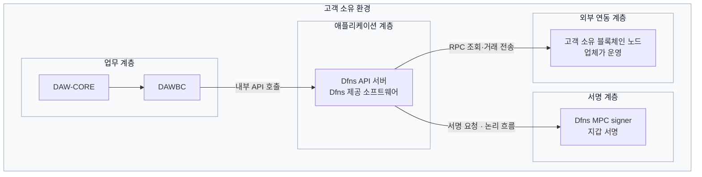
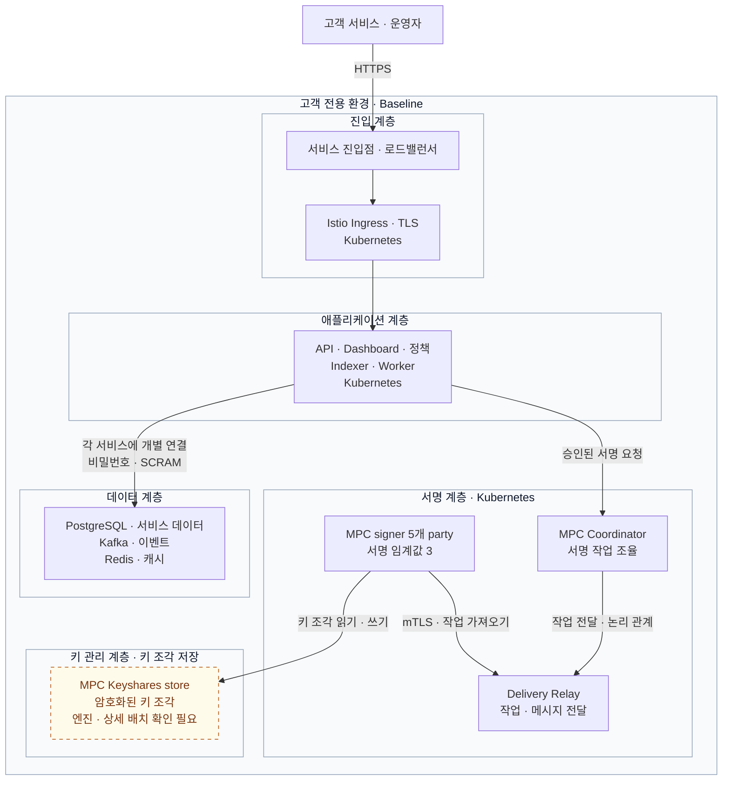
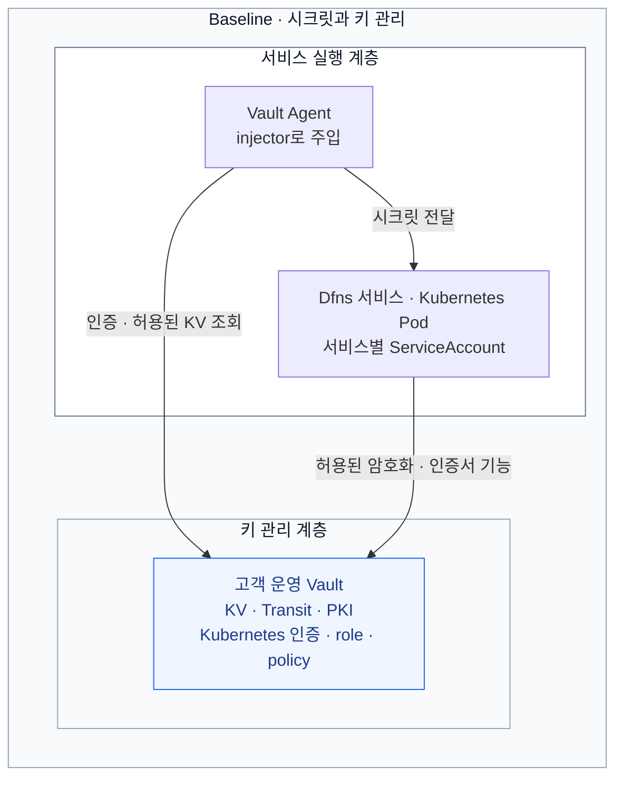
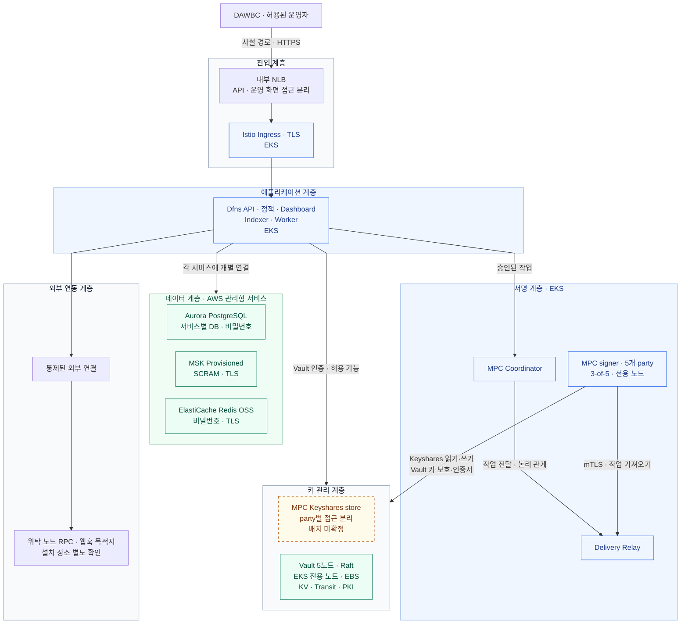
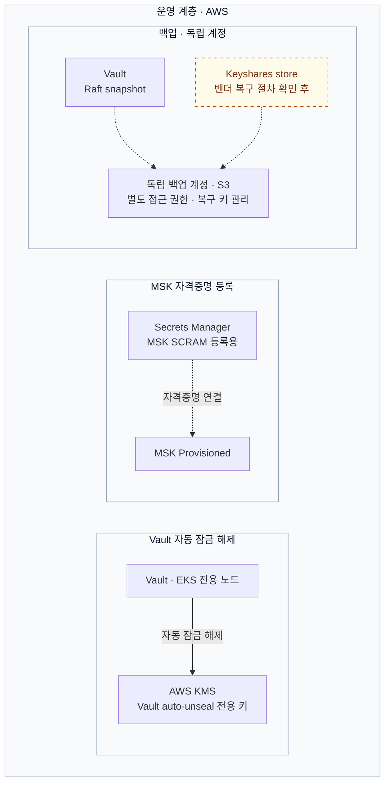

Vault 기반 Dfns Baseline 의 공통 서비스·키 관리와 고객 AWS 계정 배치안을 다룬다. 2026-09-22 에 AWS 배치로 확정했고 사내 데이터센터는 하지 않는다.
아직 프로필은 정해지지 않았다. 이 문서는 Baseline 을 전제로 쓰였고 AWS-Native 가 다른 선택지로 남아 있다.

★ **프로필은 배포 전에 정해야 한다.** Baseline 은 Vault 를 우리가 운영하고 **AWS-Native** 는 Vault 없이 Secrets Manager·KMS·IAM 으로 구성한다. 시크릿 백엔드는 day 0 에 고정되고 마이그레이션이 없다 — 둘의 차이는 [도입 개요](00-on-premise-deployment.md), 확인할 질문은 [담당자 질문 Q01·Q02](04-vendor-questions.md) 다.

검토했던 사내 구성안은 [사내 데이터센터 구성안 (채택하지 않음)](05-datacenter-design-archived.md) 으로 옮겼다.

노드 수·자원·망 분리·복구 목표는 고객 설계 제안이다. 인프라를 생성한 결과가 아니다. Dfns 제품 구성과 릴리스 제약은 [도입 개요](00-on-premise-deployment.md), 벤더가 제시한 배포 번들·설치 절차는 [배포 준비와 절차](02-deployment-procedure.md), 기능 지원의 전달용 질의는 [담당자 질문](04-vendor-questions.md)에서 확인한다. AWS-Native의 의미와 Baseline 비교도 개요 문서에서 다룬다.

## 채택 안과 대조 — 왜 이렇게 생겼나

아래는 채택한 AWS안과, 채택하지 않은 사내안의 대조다. AWS 구성이 어떤 선택의 결과인지 한눈에 보려고 남긴다. 사내안 열의 상세는 [아카이브 문서](05-datacenter-design-archived.md) 에 있다.

| 항목 | AWS안 (채택) | 사내 데이터센터안 (채택 안 함) |
|---|---|---|
| 실행 기반 | EKS·Istio | 자체 Kubernetes·Istio |
| 장애 구역 | 리전 1개·AZ 3개 | 주센터 랙 3개 |
| 데이터 서비스 | Aurora PostgreSQL·MSK·ElastiCache | PostgreSQL·Kafka·Redis 자체 운영 |
| Vault | EKS 전용 worker 5개·Raft PVC | 별도 VM 5개 |
| Vault 잠금 해제 | AWS KMS auto-unseal | Shamir 수동 unseal |
| MPC | 5개 party·3-of-5 | 5개 party·3-of-5 |
| 자원 합계의 범위 | EKS worker만 16 EC2, 88 vCPU·352 GiB. 관리형 데이터 서비스 등 별도 | 표에 적힌 VM·노드 36개, 176 vCPU·648 GiB |
| 선행 확인 | 계약 릴리스·AWS 서비스 조합·배치 설정 | (해당 없음 — 채택 안 함) |

개발·검증·운영의 클러스터·Vault·DB·키를 분리하고, 운영 환경 1개를 기준으로 산정한다. 고객 조직 전용 {{단일 테넌트::도입 조직 전용 환경이며 개인 고객이나 지갑 하나를 뜻하지 않는다.}} 구성이다. 두 열의 합계 범위가 다르므로 위 숫자만으로 비용을 비교하지 않는다.

## 공통 연결과 서비스

이 문서의 계층은 역할별 묶음이다. Dfns의 L1~L4 배포 단계나 물리 네트워크 경계를 뜻하지 않으며, 각 그림에서는 필요한 계층만 표시한다.

먼저 DAW-CORE·DAWBC·Dfns·체인 노드의 관계를 보면 다음과 같다. **Dfns API 서버와 MPC signer는 Dfns가 제공하는 소프트웨어를 고객 환경에 설치하는 설계다.** 노드도 고객 소유이며 운영을 업체에 맡긴다.

고객 소유 환경은 소유 범위를 나타낸다. 노드를 AWS·사내·업체 시설 중 어디에 설치할지는 운영 계약에서 확정한다. API에서 signer와 노드로 향하는 화살표는 Dfns 내부 구성요소를 생략한 **논리 흐름**이다. MPC Coordinator·Delivery Relay·Indexer·Worker 등의 실제 연결은 아래 상세 구성에서 다룬다. 일반 전송을 기준으로 한 그림이며, 외부 가스 대납 경로는 [법정화폐 가스 대납](../DAW%20구축%20설계/03-fiat-gas-sponsorship.md)에서 별도로 다룬다.

고객 지정 RPC 지원은 구축 전에 Dfns의 확인이 필요하다.

DAWBC·DAW-CORE와 위탁 운영 노드까지 연결하는 업무 흐름과 운영 책임은 [DAW 통합 설계](../DAW%20구축%20설계/00-integration-plan.md)에 정리했다.

### 플랫폼 내부 서비스

API·대시보드·정책·MPC signer는 Kubernetes에서 실행한다. 데이터 서비스는 PostgreSQL·Kafka·Redis로 구성한다. **PostgreSQL·Redis는 비밀번호, Kafka는 SCRAM으로 인증**한다. Vault의 시크릿 전달·암호화·인증서 기능은 다음 절에서 설명한다.

Vault의 키 관리 기능은 다음 그림에서 따로 다룬다. 위 키 관리 계층에는 키 조각 저장소만 표시했다.

Coordinator에서 Relay로 이어지는 선은 작업 전달의 논리 관계다. Signer는 Relay에 mTLS로 연결해 작업을 가져오며, 각자의 키 조각으로 공동 서명한다. 5개 party·3-of-5는 온프레미스 개요 p.7의 기본 구성이다. Keyshares store의 엔진이나 일반 서비스 DB와의 공유 여부는 확정하지 않았으며, 엔진·party별 접근·복제·복구 요건은 [담당자 질문 Q03](04-vendor-questions.md)에 남겼다.

API와 운영 화면은 별도 VIP·호스트로 진입 경로를 나누고, 방화벽·Istio 정책·기관 IdP로 접근을 제한한다. L4만으로 사용자 인증이나 URL별 접근 제어를 수행하는 구성은 아니다. VIP 수와 ingress 배포 방식은 벤더의 호스트 구성과 맞춘다.

| 별도 연결 | 용도와 경계 |
|---|---|
| 허용 서비스·Vault Agent → Vault | 서비스별 시크릿·암호화·인증서 기능. signer마다 필요한 기능과 권한은 벤더 명세로 제한 |
| 애플리케이션 → PostgreSQL·Kafka·Redis | 서비스 데이터·이벤트·캐시. Keyshares store와 저장소를 공유한다고 가정하지 않음 |
| 지정 workload → 통제된 외부 연결 | 체인 RPC·웹훅 등의 허용 목적지만 연결 |
| 저장소 → 독립 백업 저장소 | 저장소별 백업 도구·보존 정책 사용. 백업 자격증명은 복구 대상 Vault와 독립 보관 |

실제 주소·포트·인증서 주체는 아래 연결표와 벤더 명세로 확정한다. 공개 체인을 쓰려면 체인 네트워크에 연결되는 경로가 필요하다.

## 공통 Vault·키 관리

Baseline은 Vault KV·Transit·PKI를 사용한다. Vault Agent injector는 Pod에 Agent를 주입하고, Agent는 허용된 시크릿을 가져온다. 서비스 신원에는 Vault Kubernetes 인증과 서비스별 role을 사용한다. Vault 서버의 배치와 잠금 해제 방식은 실제 구축 환경에 맞춰 확정한다. ([배포 프로필 비교](00-on-premise-deployment.md#baseline과-aws-native-선택))

서비스에서 Vault로 향하는 선은 기능 의존을 나타낸다. 각 서비스와 발급 구성요소는 허용된 기능만 사용하며, 실제 호출 주체·주입 방식·권한은 배포 패키지로 확정한다. 서비스 실행 계층은 Vault를 사용하는 Pod의 역할을 묶은 것으로, 애플리케이션·서명 계층 중 허용된 서비스에 해당한다. Vault 상자는 역할을 구분한 것으로, Kubernetes 내부·외부의 물리 배치 위치를 지정하지 않는다.

### Vault 안의 역할

| 역할 | 제안 구성 | Dfns와 확인할 경계 |
|---|---|---|
| KV | 서비스별 DB·Kafka·Redis 자격증명, SMTP·OIDC·RPC 설정 | 실제 mount 경로·KV 버전·시크릿 스키마 |
| Transit | 서비스별 암호화키. **`aes256-gcm96`을 후보로 제안** | Dfns가 요구하는 키 타입·데이터키 사용 방식·암호문 형식 |
| PKI | 서명 계층용 전용 intermediate CA와 party별 인증서 | CN·SAN·EKU·TTL·갱신 방식, 사내 CA 연결 지원 |
| Kubernetes auth | 서비스마다 ServiceAccount·namespace·Vault role 연결 | TokenReview 접근·토큰 audience·갱신 방식 |
| Audit | 독립 저장·전송 경로, 디스크 사용량·전송 실패 경보 | 로그 보존 정책과 개인정보 처리 |

Transit의 `aes256-gcm96`은 **256비트 AES 키와 96비트 nonce**를 사용하는 Vault 키 타입이다. `exportable=false`, `allow_plaintext_backup=false`, `deletion_allowed=false`를 검토 기준으로 두되, Dfns bootstrap이 생성하는 키 설정을 먼저 확인한다. 키를 회전해도 기존 DB·백업의 암호문을 복호화하는 데 필요한 이전 버전을 즉시 삭제하지 않는다. [Transit 키 타입](https://developer.hashicorp.com/vault/docs/secrets/transit), [키 설정 예제](https://developer.hashicorp.com/vault/tutorials/encryption-as-a-service/eaas-transit)

애플리케이션은 자기 서비스 경로만 읽고, 다른 서비스의 시크릿·키 생성·키 삭제·관리 정책에는 접근하지 못하도록 설계한다. Vault에서 Kubernetes API로 TokenReview를 수행하는 연결도 준비한다. [Vault Kubernetes 인증](https://developer.hashicorp.com/vault/docs/auth/kubernetes)

Vault 서버의 HTTPS 인증서와 초기 배포용 자격증명은 환경별 PKI·별도 운영 보관소에서 준비한다. 아직 시작하지 않은 Vault에 접속해야 Vault 자체의 TLS 키나 복구 암호를 얻을 수 있는 순환 의존을 만들지 않는다. TLS 전 구간 적용, 전용 비관리자 계정, swap·core dump 비활성화는 [Vault 운영 강화 지침](https://developer.hashicorp.com/vault/docs/concepts/production-hardening)을 따른다.

### 지갑키와 다른 키의 분리

| 키 | 이 설계에서의 위치·책임 |
|---|---|
| 지갑 서명키 | Dfns signer에서 분산 생성하는 MPC 키 조각. ECDSA secp256k1 / Ed25519는 벤더 개요에 명시 |
| MPC Keyshares store | 일반 앱 DB와 접근 경계를 분리. party별 자격증명·데이터 접근 범위를 구분하는 구성을 벤더와 확정 |
| Transit 키 | 애플리케이션 데이터 또는 데이터키를 보호하는 키. 지갑 서명키로 대체하지 않음 |
| Vault 복구 자료 | AWS KMS auto-unseal 초기화로 발급되는 recovery key. MPC 키 조각과 별개다 |
| 플랫폼 issuer 키 | Ed25519 인증 토큰 서명키. 벤더 지정 시크릿 경로에 두고 auth 서비스만 접근 |
| mTLS 인증서 키 | 서비스·signer 신원용. 거래 서명키·Transit 키와 분리 |

지갑키·issuer 키·서명 계층 인증서의 벤더 근거는 [온프레미스 개요 7·9쪽](00-on-premise-deployment.md)이다. **Keyshares store의 저장 엔진·복제·백업·party별 분리 지원이 확인되지 않아 일반 PostgreSQL에 임의로 합치지 않는다.** 이 저장소의 주소·자원·복구 절차는 L4 Signing 배포 전 필수 확정 항목이다.

Kubernetes 관리자나 가상화 관리자가 모든 signer·볼륨에 접근할 수 있으면 MPC party를 5개로 나누는 것만으로 관리 권한이 분산되지는 않는다. 전용 노드·ServiceAccount·관리자 역할·변경 승인으로 접근을 제한하고, 독립 운영자나 별도 클러스터가 필요한 보안 요건이면 Dfns의 지원 토폴로지를 다시 확인한다.

## AWS 구성안

DAW-CORE·DAWBC가 사내에 있으면 AWS까지 전용 회선 또는 VPN 경로를 준비한다. API는 고객 AWS 계정에 설치하며, 노드의 설치 장소는 운영 계약으로 정한다. 리전·서비스 버전·CPU와 Terraform·Helm의 배치 설정 지원을 계약 릴리스로 확인한다.

### AWS 서비스와 플랫폼의 연결

역할별 계층으로 묶었다. 진입점·EKS·데이터 서비스는 고객 AWS 플랫폼 VPC의 3개 AZ에 배치하는 제안이며, Keyshares store의 엔진·상세 배치는 벤더 확인이 필요하다. EKS worker는 private subnet에 둔다. 계층 상자는 계정·VPC 경계가 아니다. AZ별 수량은 다음 절에서 다룬다.

API는 데이터 계층의 각 서비스에 개별 연결하며 키 관리 계층에서는 Vault에 접근한다. signer는 Keyshares store와 허용된 Vault 기능을 각각 사용한다. KMS·Secrets Manager·S3는 VPC 안에 설치하는 서버가 아니라 AWS 서비스이며, 필요한 VPC endpoint를 통해 접근하도록 설계한다.

**운영 계층**은 아래에 따로 표시했다. 위 연결도와 같은 Vault·MSK·Keyshares store를 운영 관점에서 다시 그린 것이며, 추가 인스턴스를 뜻하지 않는다. 실선은 자동 잠금 해제, 점선은 자격증명 연결 또는 백업 경로다.

백업 계정은 플랫폼 운영 계정과 분리한다. 플랫폼 운영 계정과 독립 백업 계정 모두 고객 소유 AWS 환경에 해당한다. Aurora·Kafka 등 데이터별 백업 경로는 복구 절에서 구분한다. Vault에 연결하는 주체와 권한은 Dfns 패키지의 서비스별 명세로 제한하며, 모든 서비스가 모든 Vault 기능을 호출한다는 뜻이 아니다.

### 초기 자원과 가용 영역 배치

| 구성요소 | 초기 예약안 | 배치·운영 기준 |
|---|---|---|
| EKS | 운영 클러스터 1개 | 제어 영역은 AWS 관리. 고객이 control plane VM 3개를 별도로 만들지 않음 |
| 앱·공통 worker | 6개, 노드당 8 vCPU / 32 GiB | AZ마다 2개. 제공 자료의 앱 이미지에 맞춰 arm64 우선, 전체 이미지 호환성 확인 |
| MPC worker | 5개, 노드당 4 vCPU / 16 GiB | party마다 전용 노드. AZ별 2·2·1, 이미지 CPU 아키텍처 별도 확인 |
| Vault worker | 5개, 노드당 4 vCPU / 16 GiB | Vault Pod당 전용 노드와 Raft PVC. AZ별 2·2·1, EBS 200 GiB부터 예약 |
| Aurora PostgreSQL | Serverless v2 writer 1 + reader 2 제안 | 인스턴스를 AZ별로 분산. ACU 최소·최대는 연결 수·부하와 장애 전환 시험으로 확정 |
| MSK Provisioned | broker 3개 제안 | AZ마다 1개. 인스턴스·디스크·토픽 복제·보존 용량은 처리량 측정 후 확정 |
| ElastiCache Redis OSS | primary 1 + replica 2 제안 | cluster mode disabled, AZ 분산·Multi-AZ 자동 장애 전환. 패키지 호환성 확인 |
| Keyshares store | 별도 산정 | 일반 서비스 DB와 공유한다고 가정하지 않음. 엔진·복제·party별 접근 확인 필요 |

EKS worker 예약안은 **16개 EC2, 88 vCPU, 352 GiB 메모리**다. Aurora·MSK·Redis의 관리형 자원, EBS, NLB, NAT·VPC endpoint, 로그·백업, DAW-CORE·DAWBC·체인 노드는 이 합계에 포함하지 않았다. 채택하지 않은 [사내안](05-datacenter-design-archived.md)의 36개 VM을 AWS EC2 36대로 치환하지 않는다.

앱·MPC·Vault는 node group, taint/toleration, 배치 제약으로 분리하고, party의 복구를 일반 앱 autoscaling처럼 처리하지 않는다. 서명 노드와 Vault는 초기 운영에서 On-Demand 용량을 사용하도록 제안한다. 복제 수와 PodDisruptionBudget만으로 AZ 장애 시 무중단이 보장되지는 않는다.

| AZ | 앱 worker | MPC party | Vault Raft |
|---|---:|---:|---:|
| A | 2 | 2 | 2 |
| B | 2 | 2 | 2 |
| C | 2 | 1 | 1 |

한 AZ가 중단돼도 MPC와 Vault 각각 3개 이상이 남도록 잡은 구성이다. 남은 party가 실제 서명할 수 있는지, DB·Relay·키 조각 저장소도 가용한지는 함께 시험한다. EBS 볼륨은 같은 AZ의 인스턴스에 연결하므로, 장애 AZ의 Vault PVC가 다른 AZ로 즉시 이동한다고 설계하지 않는다. 살아 있는 Raft quorum으로 서비스하고 벤더·Vault 절차에 따라 노드를 교체한다. [AWS EBS 볼륨](https://docs.aws.amazon.com/ebs/latest/userguide/ebs-volumes.html)

Aurora의 reader 장애 전환과 ElastiCache의 replica 승격 후에는 연결 재수립·진행 중 요청 대사를 시험한다. 클라이언트가 쓰기 요청을 무조건 반복하도록 만들지 않는다. [Aurora 고가용성](https://docs.aws.amazon.com/AmazonRDS/latest/AuroraUserGuide/Concepts.AuroraHighAvailability.html) · [ElastiCache Multi-AZ](https://docs.aws.amazon.com/AmazonElastiCache/latest/dg/AutoFailover.html)

### Baseline에서 KMS를 사용하는 이유

**Vault의 KV·Transit·PKI를 유지하면서, Vault 자체의 잠금 해제에 AWS KMS를 사용한다.** 이는 애플리케이션의 암호화 백엔드를 Vault Transit에서 AWS KMS로 바꾸는 것과 다르다.

서비스별 Vault KV·Transit·PKI와 API 요청 서명키의 역할은 앞의 공통 키 관리 절을 따른다. EBS·Aurora·백업의 저장 시 암호화도 지갑 MPC 키와 별개다.

Vault의 KMS 접근용 IAM 역할과 EBS·레지스트리 등 인프라 접근 권한은 Baseline에서도 필요할 수 있다. 이것이 Dfns의 DB·Kafka·Redis 인증을 AWS-Native의 IAM 인증으로 바꿨다는 뜻은 아니다. IRSA 또는 Pod Identity 지원은 패키지와 구성요소 버전별로 확정한다. [Vault AWS KMS seal 설정](https://developer.hashicorp.com/vault/docs/configuration/seal/awskms)

KMS auto-unseal에서 초기화로 발급되는 것은 **recovery key**다. 채택하지 않은 사내안의 수동 unseal key(Shamir)와 구분한다. recovery key 5조각·3명 참여를 초기 운영안으로 두고 별도 보관하며, 초기 root token은 bootstrap 후 폐기한다. **recovery key만으로 KMS 장애나 키 삭제를 대신할 수 없다.** 복구에 필요한 KMS 키·정책·권한·연결도 함께 보호한다. [Vault Seal/Unseal](https://developer.hashicorp.com/vault/docs/concepts/seal)

Vault Pod와 앱을 같은 EKS에 두므로 제어 영역·클러스터 운영 장애를 공유한다. 전용 노드만으로 이 의존성이 사라지지는 않는다. Vault를 별도 EC2에 둘 필요가 있다면 외부 Vault endpoint와 bootstrap을 Dfns 패키지가 지원하는지 [담당자 질문 Q03](04-vendor-questions.md)으로 확인한 뒤 설계를 바꾼다.

### MSK SCRAM 자격증명

MSK의 SCRAM 인증은 **AWS Secrets Manager의 자격증명을 클러스터에 연결**해야 한다. AWS는 시크릿 이름에 `AmazonMSK_` 접두어와 고객 관리 KMS 키를 요구한다. Baseline에서도 이 MSK 측 등록 경로는 필요하며, 애플리케이션의 시크릿 전달 경로는 Vault로 유지한다. [AWS MSK SCRAM 설정](https://docs.aws.amazon.com/msk/latest/developerguide/msk-password-tutorial.html)

같은 자격증명을 MSK 등록용 Secrets Manager와 앱 전달용 Vault에서 어떻게 일치시킬지 확인해야 한다. **최초 생성·회전의 담당 주체, 갱신 순서, 실패 시 복구를 Dfns 배포 패키지에서 확인하기 전에는 자동 동기화가 있다고 가정하지 않는다.** 두 저장소를 운영자가 독립적으로 수정하는 구성은 피한다.

### AWS 네트워크·운영 접근

| 경로 | 설계 기준 |
|---|---|
| DAWBC → Dfns API | 내부 NLB와 사설 DNS. 허용된 경로에서 HTTPS 접근 |
| 운영자 → Dashboard·EKS 관리 | 기관 인증·관리 단말·SSM/VPN 등 승인된 관리 경로. 서비스 API와 접근 권한 분리 |
| EKS worker → EKS API | private endpoint 사용. 운영 도구의 사설 접속 경로도 먼저 확보 |
| 앱 → Aurora·MSK·Redis | private subnet, TLS와 서비스별 자격증명. 필요한 보안 그룹 간 연결만 허용 |
| signer → Relay·Keyshares store | 벤더 포트·mTLS 주체·party별 접근 명세 적용. 공개 인바운드 없음 |
| Vault → KMS | 전용 키 권한과 KMS endpoint 경로. 클러스터 장애 복구 시에도 확보 |
| Dfns → 위탁 RPC·웹훅 | 목적지와 호출 주체 제한. 외부 목적지라면 방화벽·프록시 등으로 통제 |
| 배포·worker → AWS 서비스 | ECR·S3·STS 또는 EKS Auth·KMS·SSM·로그 등 실제 의존 서비스의 endpoint와 DNS 준비 |

NAT Gateway는 주소 변환 경로이며 목적지 허용 목록을 집행하는 방화벽으로 취급하지 않는다. 외부 인터넷 통신이 필요하면 AZ별 출구 장애를 분리하고, 통제 장치와 함께 구성한다. 필요한 endpoint 종류는 선택한 IAM 방식과 AWS 서비스에 따라 달라진다. [EKS private cluster 요건](https://docs.aws.amazon.com/eks/latest/userguide/private-clusters.html) · [EKS subnet 설계](https://docs.aws.amazon.com/eks/latest/best-practices/subnets.html)

내부 NLB의 TLS 종료·Istio까지의 재암호화·호스트별 인증서는 Dfns 번들과 맞춘다. Route 53·ACM이 존재한다고 Vault PKI가 대체되는 것은 아니다. 도메인 소유·인증서 검증·내부 DNS 해석 경로를 각각 확인한다.

### AWS 백업·복구·운영

| 대상 | 준비할 자료와 확인 사항 |
|---|---|
| Vault | Raft snapshot, KMS seal 키와 사용 권한, TLS·CA·복구 운영 자격. 백업 접근이 복구 대상 Vault에만 의존하지 않도록 구성 |
| Aurora | 자동 백업·시점 복구와 보관 정책. 복원한 DB endpoint·서비스 계정·스키마·Vault 자격증명 대사 |
| MSK | 토픽·ACL·설정과 이벤트 보존·재처리 계획. broker 복제만으로 삭제·잘못된 이벤트·리전 장애 복구가 해결되지는 않음 |
| Redis | 데이터 용도별 재생성 가능 여부. 세션·잠금·작업 상태 등 손실 영향과 복원 필요성 확인 |
| MPC Keyshares | 벤더가 지원하는 party별 암호화 백업·복구 자료. 선택 S3 백업을 쓰면 고객 오프라인 복호화 키도 별도 관리 |
| 배포 상태 | 서명 검증된 번들·이미지 digest·계층별 Terraform 상태·고객 설정·버전 기록 |
| 감사 | 인프라 변경·Vault 접근·업무 요청·거래·대납 비용을 연결할 독립 로그 보관 |

보조 리전 복구는 별도 수용 시험으로 둔다. **S3에 복사한 snapshot만으로 Vault·MPC·DB 전체가 복구되는 것은 아니다.** 각 백업의 암호화 키·복호화 권한·리전별 seal 구성과 데이터 일관성을 검증한다. RPO·RTO는 목표를 먼저 정하고 실제 복구 시간을 측정해 확정한다.

복구 순서는 AWS 계정·IAM·DNS·KMS·네트워크 → EKS·스토리지·Vault → 데이터 서비스·Dfns 초기화 상태 → MPC party·키 조각 → API·관측·업무 대사 순으로 검토한다. 실제 의존 순서는 벤더 runbook으로 확정한다. 원센터의 서명·전파를 차단한 뒤 복구 환경을 활성화하고, 백업 이후의 요청·거래를 조회해 중복 제출과 중복 원장 반영을 막는다.

### AWS 구축 순서와 완료 조건

1. **릴리스·패키지 확정.** Baseline 프로필, 전체 이미지 CPU, AWS 리전·서비스 버전, 지정 RPC와 외부 연동 지원을 확인한다. 제공 자료의 최소 릴리스 숫자만으로 현재 지원 조합을 결정하지 않는다.
2. **L1 기반 생성.** 고객 계정·네트워크·EKS·Aurora·MSK·ElastiCache·DNS·TLS·운영 접속을 준비한다.
3. **L2 공통 기반.** Istio·Vault Raft·KMS auto-unseal·서비스 인증·스토리지를 구성하고 복구 자격증명을 분리 보관한다.
4. **L3 플랫폼.** 서비스 DB·토픽·시크릿과 초기화 작업을 적용한다. MSK 등록과 Vault 전달 자격증명의 일치를 검증한다.
5. **L4 MPC.** signer·Keyshares store·party identity를 구성하고 키 보관소와 조직을 연결한다.
6. **업무 검증.** DAWBC에서 고객 환경의 API로 지갑 생성·입금·ERC-20 전송·조회·웹훅·대납·업무 대사를 검증한다.
7. **장애·복구 검증.** AZ 장애, Vault 재시작, DB 승격, 자격증명 회전, 백업 복원, 기존 지갑 서명과 요청 중복 방지를 시험한다.

출시 전에는 다음 결과를 남긴다.

- [ ] 고객 환경의 API endpoint와 지정 RPC로 전체 거래 경로를 검증했다.
- [ ] 앱·MPC·Vault가 설계한 노드·AZ에 분리 배치됐고 장애 시 남은 자원으로 동작한다.
- [ ] 서비스별 Vault·DB·토픽·키 조각 권한과 대납 전용 지갑의 정책 경계를 확인했다.
- [ ] KMS 접근 실패와 Vault 재시작·복구를 시험하고 recovery key의 역할을 구분했다.
- [ ] MSK SCRAM 비밀번호 회전 후 Vault와 서비스 연결이 일치한다.
- [ ] DB·Vault·Keyshares를 복원해 기존 지갑 서명과 온체인·업무 원장 대사가 가능하다.
- [ ] 가스 비용의 지불자·업무 요청·정산 항목이 연결되고 원금을 중복 차감하지 않는다.
- [ ] 월 운영비와 복구 목표를 처리량·보존량·AZ 간 전송·로그·백업·지원 계약까지 포함해 산정했다.

공개 Dfns API에서 확인한 Sepolia 일반·대납 전송은 [API 비교 실측](../API%20비교/00-fireblocks-dfns-api.md)에 있다. 고객 AWS 계정의 Baseline을 검증한 결과는 아니며, 법정화폐 청구·Base·Solana 지원도 별도 확인한다. 업무 설계는 [DAW 통합 설계](../DAW%20구축%20설계/00-integration-plan.md), 전달할 질의는 [Dfns 담당자 질문](04-vendor-questions.md)에 연결한다.

## 확인한 자료

- Dfns 제공 자료: [온프레미스 배치 개요](00-on-premise-deployment.md) 5~9·11~17쪽, [Baseline / AWS-Native 비교](00-on-premise-deployment.md#baseline과-aws-native-선택) 2~3쪽, [배포 준비와 절차](02-deployment-procedure.md)
- Kubernetes: [HA 클러스터](https://kubernetes.io/docs/setup/production-environment/tools/kubeadm/high-availability/)
- HashiCorp: [Raft 참조 구성](https://docs.hashicorp.com/vault/tutorials/day-one-raft/raft-reference-architecture), [Seal/Unseal](https://developer.hashicorp.com/vault/docs/concepts/seal), [Transit](https://developer.hashicorp.com/vault/docs/secrets/transit), [Kubernetes 인증](https://developer.hashicorp.com/vault/docs/auth/kubernetes), [운영 강화](https://developer.hashicorp.com/vault/docs/concepts/production-hardening)
- 데이터 서비스: [Patroni 동기 복제](https://patroni.readthedocs.io/en/latest/replication_modes.html), [PostgreSQL PITR](https://www.postgresql.org/docs/17/continuous-archiving.html), [Kafka KRaft](https://kafka.apache.org/41/operations/kraft/), [Kafka 복제 설정](https://kafka.apache.org/41/generated/topic_config.html), [Redis Sentinel](https://redis.io/docs/latest/operate/oss_and_stack/management/sentinel/)

외부 공식 문서 확인일은 2026-09-14다. 인용 문서의 버전은 해당 동작을 확인한 기준이며 Dfns의 승인 버전 목록을 대신하지 않는다.
