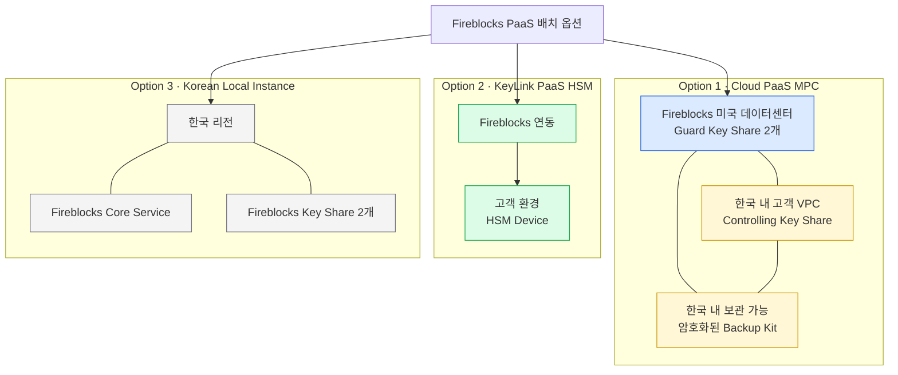
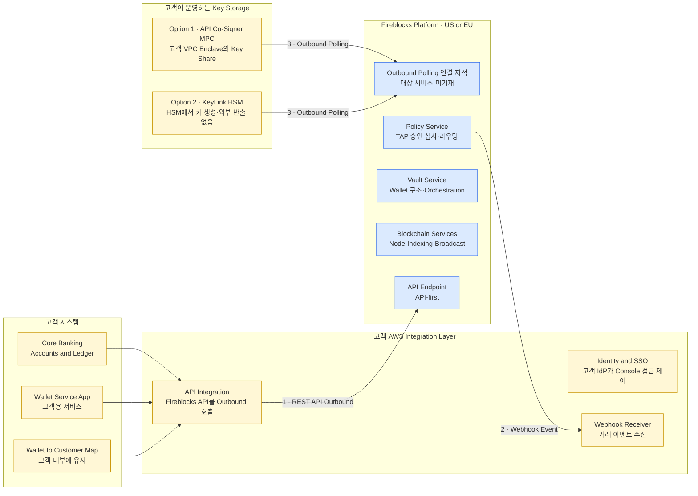
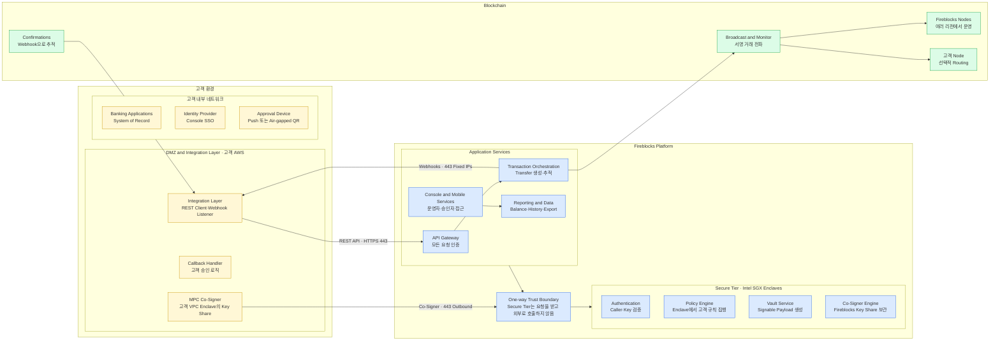
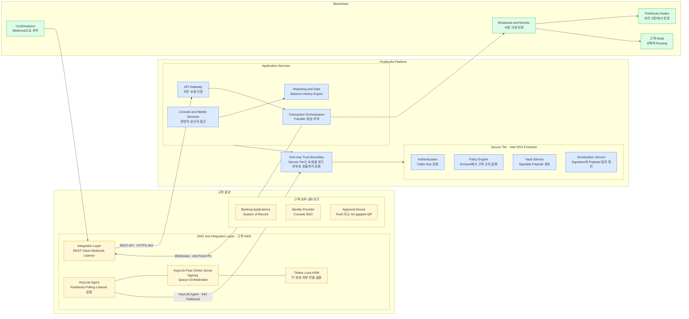
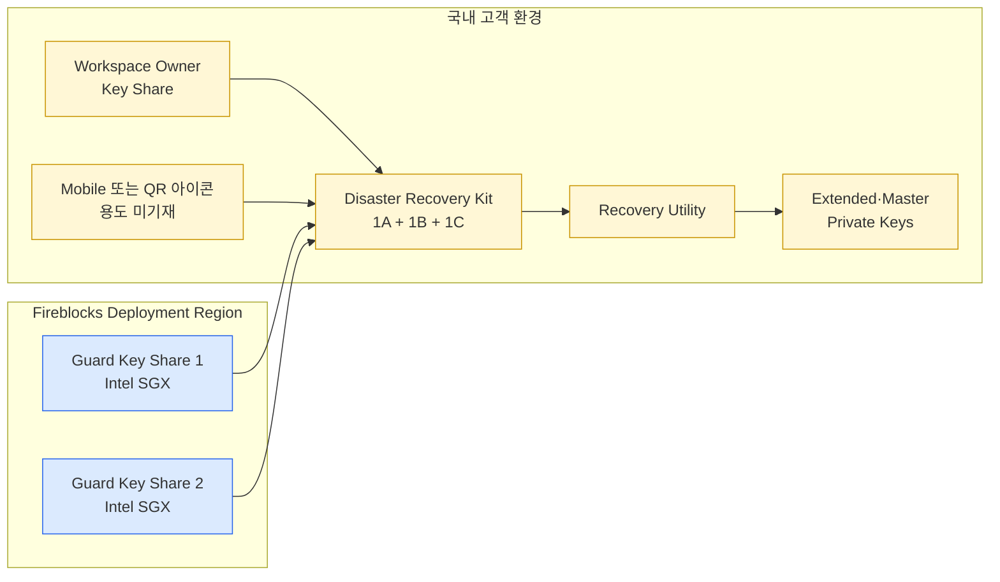
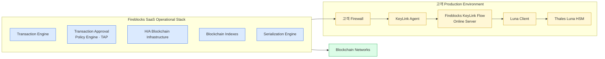

고객 애플리케이션과 Fireblocks 플랫폼을 결합하는 세 가지 PaaS 배치안을 페이지 순서대로 정리한다.
제공받은 17페이지 배치 제안서 v1.0의 내용을 상세하게 보존하되, 고객을 식별하는 명칭만 일반화했다.

## 읽는 방법

- 이 문서는 PDF 1페이지부터 17페이지까지의 흐름을 유지한 상세 전환본이다.
- 표와 Mermaid 다이어그램은 PDF의 표·배치도를 문서 형식에 맞게 다시 그린 것이다.
- 규제 적합성, 제품 우수성, 일정에 관한 표현은 PDF가 제시한 주장이다. 별도 근거로 검증된 결론이 아니다.
- PDF에 없는 제품 상태·계약 조건·구현 방식은 추가하지 않았다.
- 페이지 번호는 PDF 기준이다.

## p.1 — 표지

문서 제목은 `Deployment Options`이며, 특정 금융기관을 대상으로 작성된 배치 제안서다. 이 전환본에서는 대상 고객명을 제거했다.

## p.2 — 목차와 문서 구성

PDF는 내용을 네 부분으로 소개한다.

| 구분 | PDF의 설명 | 실제 관련 페이지 |
|---|---|---|
| 01 Executive Summary | 제안 아키텍처의 배경과 도입 설명 | p.3~4 |
| 02 Deployment Options | Cloud PaaS MPC와 KeyLink HSM의 키 관리 방식·도입 일정 비교 | p.4 |
| 03 Technical Architecture | 고객 인프라와 Fireblocks 기술 스택을 PaaS 모델로 연결하는 방식 | p.5~12 |
| 04 KeyLink PaaS HSM Deeper Dive | 대안 배치안인 HSM 구성의 상세 설명 | p.13~17 |

목차의 네 구분과 실제 슬라이드 제목은 완전히 일치하지 않는다. 예를 들어 Local Instance는 p.4 비교표에 함께 제시되고, KeyLink 상세 내용은 p.14부터 나온다.

## p.3 — 제안 배경과 PaaS 판단 기준

PDF는 모든 배치안이 충족해야 할 요구사항을 세 가지로 제시한다.

1. 키 관리와 서명을 포함하는 중요 업무로 정의될 서비스일 것
2. 고객이 자체 애플리케이션에서 개발·배포·운영·관리할 수 있는 custody platform일 것
3. 고객이 Fireblocks 위에 애플리케이션 계층을 구축하는 PaaS 모델일 것

PDF는 한국 규제 아래에서는 워크로드의 허용 범위가 서비스 분류에 따라 정해지고, 그 분류는 사업자가 붙인 명칭이 아니라 아키텍처의 실제 구성에 따라 판단된다고 설명한다. 이어 고객의 두 번째 요구사항이 법에서 말하는 다음 네 가지 기능과 같다고 주장한다.

| PaaS 판단 요소 | PDF 표기 |
|---|---|
| 개발 | Develop |
| 배포 | Deploy |
| 운영 | Operate |
| 관리 | Manage |

PDF는 이후의 각 배치안을 이 네 요소에 대입한다고 설명하지만, 법령명 외에 조문·해석 자료·외부 근거는 싣지 않았다. 따라서 이 문서는 해당 주장을 기록할 뿐 법률 적합성을 확정하지 않는다.

## p.4 — 세 가지 키 관리 배치안

PDF는 키 관리 방식, 구성요소의 위치, 예상 도입 기간을 기준으로 세 가지 옵션을 비교한다.

| 구분 | Option 1 — Cloud PaaS MPC | Option 2 — KeyLink PaaS HSM | Option 3 — Korean Local Instance |
|---|---|---|---|
| PDF의 예상 기간 | 수일~수주 | 2~3개월 | 4개월 이상 |
| 키 관리 방식 | 서로 다른 3개 key share로 키를 생성·보관 | 고객 HSM에 키 보관 | Cloud PaaS MPC 모델을 한국 리전에 함께 배치 |
| 고객 측 배치 | 한국 내 고객 VPC에 controlling key share | 고객 환경에 HSM | 별도 설명 없음 |
| Fireblocks 측 배치 | 미국 데이터센터에 share 2개 | HSM 연동용 Fireblocks PaaS | Fireblocks share 2개와 core service도 한국 리전 |
| 로컬 복구 자료 | 3개 share가 암호화된 backup kit를 한국에 보관 가능 | 별도 설명 없음 | 별도 설명 없음 |
| PDF의 평가 | 대규모 배치에 사용하며 private key의 단일 침해 지점을 제거한다고 설명 | Fireblocks와 HSM 연결을 위한 연동 개발·충분한 테스트가 필요하며 MPC보다 복잡하다고 설명 | 선택적 로드맵 항목으로 제시 |

기간은 PDF에 적힌 수치다. 산정 범위, 선행 조건, 현재 제공 여부, 계약상 보장은 제시되지 않는다.

## p.5 — 고객 시스템과 Fireblocks 기술 스택

이 페이지는 기존 금융기관 시스템부터 Fireblocks 플랫폼과 외부 연결 대상까지를 층별로 배치한다.

### 고객 내부 채널과 기존 시스템

| 고객 업무 영역 | PDF에 표시된 항목 |
|---|---|
| 시장·거래 | Markets, Trading & Execution |
| 청산·결제 | Clearing, Settlement & Reconciliation |
| 계정계 | Core Banking & Accounts |
| 지급·자금 | Payments, Treasury & Liquidity |
| 원장·재무 | Ledger and Financial Reporting |
| 위험 | Risk Management |
| 사기·컴플라이언스 | Fraud & Compliance Operations |
| 수탁·자산 서비스 | Custody & Asset Servicing |
| 거래 모니터링 | Transaction Monitoring & Surveillance |
| 보고·분석 | Reporting & Analytics |

이 시스템들은 `API Connectivity & Data Layer`를 통해 Fireblocks와 연동하는 구조로 표시된다.

### 접근 지점

- Fireblocks Mobile App
- Fireblocks Console
- Fireblocks REST API & Webhooks
- Single Sign On

### Fireblocks 플랫폼

| 영역 | PDF에 표시된 기능 |
|---|---|
| 지갑 | Wallets — Hot, Warm, Cold |
| 거래 | End-to-end Transaction Management |
| 토큰 | Tokenization Engine & Contract Library |
| 정책 | Encrypted Policy Rules Engine |
| MPC | MPC Key Management |
| 자금 업무 | Treasury Workflow Automation Engine |
| 가스 | Multi Chain Gas Management |
| 연속성 | Business Continuity Management |
| HSM | HSM Key Link |
| 보고 | Reporting & Accounting — TRES |
| 결제 | Payments Engine + On/Off Ramps |
| 보안 운영 | Security Posture Management & SOC |

### 통합 파트너 서비스와 직접 연결

| 구분 | PDF에 표시된 항목 |
|---|---|
| Integrated Partner Services | Staking Validators, Interoperability, Travel Rule, Risk Analytics |
| Direct Connectivity | HSM Key Link Flow, Qualified Custodians, Digital Asset Exchanges, Market Makers & Liquidity Providers, Asset Managers & Trading Firms, Blockchain Node Infrastructure |
| HSM Integrations | IBM, Thales, Securosys |
| Blockchain Node Infrastructure | `Support for 150+`라고 표시되지만 150+의 정확한 대상 단위는 적지 않음 |

이 페이지는 기능 지형을 보여 주는 개요다. 각 기능의 계약 포함 여부, 활성 상태, 제공 리전은 설명하지 않는다.

## p.6 — 기술 아키텍처 안내

PDF는 이어지는 슬라이드가 Fireblocks PaaS 아키텍처를 설명한다고 안내하며 세 가지 관점을 제시한다.

1. `Fireblocks PaaS model` — 고객 애플리케이션 계층과 Fireblocks 플랫폼이 만나는 상위 구조
2. `Deeper dive` — 같은 구조에 네트워크 연결을 더한 상세 구성
3. `Network requirements` — 고객 네트워크 팀이 준비할 endpoint, port, direction

슬라이드 본문에는 “다음 네 장”이라고 쓰여 있지만, 목록에는 세 항목만 표시돼 있다.

## p.7 — Option 1 상위 PaaS 구조

페이지 제목은 Cloud PaaS MPC이지만, 하단의 고객 운영 키 저장 영역에는 Option 1의 MPC Co-Signer와 Option 2의 KeyLink HSM이 함께 비교돼 있다.

PDF가 표시한 세 연결은 다음과 같다.

| 번호 | 연결 | 방향·설명 |
|---|---|---|
| 1 | REST API calls | 고객 Integration Layer에서 Fireblocks로 outbound |
| 2 | Webhooks | Fireblocks의 거래 이벤트가 고객 Webhook Receiver로 반환 |
| 3 | 키 저장 구성요소 | 고객 측에서 outbound polling, inbound port 없음 |

## p.8 — Option 1 Cloud PaaS MPC 상세 구조

PDF는 모든 Fireblocks 연결이 TLS를 사용하며, 고객 네트워크의 유일한 inbound 경로는 Webhook Listener라고 설명한다.

페이지에 표시된 구성요소별 설명은 다음과 같다.

| 영역 | 구성요소 | PDF의 설명 |
|---|---|---|
| 고객 DMZ·Integration | Integration Layer | REST Client와 Webhook Listener |
| 고객 DMZ·Integration | Callback Handler | 고객 자체 승인 로직 |
| 고객 DMZ·Integration | MPC Co-Signer | 고객 VPC의 Enclave 안에 Key Share 보관 |
| 고객 내부망 | Banking Applications | 고객 System of Record |
| 고객 내부망 | Identity Provider | Console SSO |
| 고객 내부망 | Approval Device | Push 또는 Air-gapped QR |
| Fireblocks Application Services | API Gateway | 모든 요청 인증 |
| Fireblocks Application Services | Transaction Orchestration | 각 Transfer 생성·추적 |
| Fireblocks Application Services | Console and Mobile Services | 운영자·승인자 접근 |
| Fireblocks Application Services | Reporting and Data | Balance·History·Export |
| Fireblocks Secure Tier | Authentication | 호출자와 Key 검증 |
| Fireblocks Secure Tier | Policy Engine | Enclave에서 고객 규칙 집행 |
| Fireblocks Secure Tier | Vault Service | Signable Payload 생성 |
| Fireblocks Secure Tier | Co-Signer Engine | Fireblocks Key Share 보관 |
| Blockchain | Fireblocks Nodes | 여러 리전에서 운영 |
| Blockchain | Broadcast and Monitor | 서명된 거래를 네트워크로 전파하고 모니터링 |
| Blockchain | 고객 Node | 선택 사항이며 고객 Node를 통해 Routing 가능 |
| Blockchain | Confirmations | 고객 Webhook으로 추적 |

## p.9 — Option 2 KeyLink PaaS HSM 상세 구조

PDF는 private key가 고객 HSM에서 생성되고 HSM을 떠나지 않으며, Fireblocks에는 public key만 있다고 설명한다.

Option 1과 비교했을 때 바뀌는 부분은 다음과 같다.

| Option 1 MPC | Option 2 KeyLink HSM |
|---|---|
| MPC Co-Signer | KeyLink Agent |
| Co-Signer Engine | Serialization Service |
| 고객 VPC Enclave에 Key Share | 고객 환경의 KeyLink Flow Online Server·Thales Luna HSM |
| Co-Signer가 443 outbound 연결 | KeyLink Agent가 443 outbound 연결 |

그 밖의 고객 Integration Layer, 내부 Banking Application·Identity Provider·Approval Device, Fireblocks Application Services, Blockchain 연결은 같은 형태로 그려져 있다.

## p.10 — 네트워크 요구사항

PDF는 Fireblocks PaaS 배치를 위해 고객 네트워크 팀이 열어야 하는 통신을 다음과 같이 제시한다.

| Flow | Direction | Protocol·Port | Endpoint | Notes |
|---|---|---|---|---|
| REST API | Outbound | HTTPS 443 | `api.fireblocks.io` 또는 EU endpoints | API key header와 RS256으로 서명한 request token |
| Console | Outbound | HTTPS 443 | `console.fireblocks.io` | 운영자 Browser, 고객 Identity Provider로 SSO |
| Webhooks | Inbound | HTTPS 443 | `3.135.57.98`, `63.179.12.78`, `3.77.138.100` | RS512 서명, 공개된 key endpoint로 검증 |
| Co-Signer running | Outbound | HTTPS·WSS 443 | `mobile-api`, `signurl`, `s3signurl` | WebSocket 유지, long polling fallback, inbound port 없음 |
| Co-Signer updates | Outbound | 443, registry 방향 5000 | Fireblocks storage와 package mirrors | Maintenance window에서만 사용 |
| Callback handler | 고객 내부 | 고객이 선택한 HTTPS port | Co-Signer에서 고객 approval service | 30초 안에 응답하지 않으면 요청 실패 |
| Approval device | Outbound | HTTPS 443와 push | Fireblocks와 push provider | Cold wallet 승인은 air-gapped 상태를 유지하며 QR로 전달 |
| Time sync | Outbound | NTP 123 | 고객 integration hosts | Request token 유효시간이 30초이므로 Clock 동기화 필요 |

이 표는 Co-Signer 중심으로 작성됐다. KeyLink Agent, Flow Server, Luna Client, HSM 사이의 전용 port·endpoint는 기재하지 않았다. 또한 PDF에 발행일이 없어 위 IP와 endpoint의 현재 유효성은 이 문서에서 확정하지 않는다.

## p.11 — MPC-CMP Disaster Recovery Kit

PDF는 고객의 유일한 완전한 MPC-CMP key set인 Disaster Recovery Kit가 국내에 보관된다고 설명한다.

PDF의 핵심 설명은 다음과 같다.

- Fireblocks Deployment Region에는 Guard Key Share 1과 2가 있으며 각각 Intel SGX 아이콘으로 표시된다.
- 국내 고객 영역에는 Workspace Owner Key Share, Disaster Recovery Kit, Recovery Utility가 표시된다.
- Disaster Recovery Kit 내부는 `1A`와 `1B+1C`로 나뉘고 서로 다른 자물쇠 아이콘이 붙어 있다.
- 고객만 아는 여러 key로 암호화된 Disaster Recovery Kit가 extended/master private key를 생성할 수 있는 유일한 source라고 설명한다.

이 페이지는 MPC-CMP 복구 구성만 다룬다. KeyLink HSM의 backup·recovery 구성은 설명하지 않는다.

## p.12 — Hardware Isolation Options

PDF는 조직에 맞는 Trusted Execution Environment 기술을 선택할 수 있으며, 고객의 local cloud instance에 배치할 수 있다고 설명한다.

| 기술 분류 | Cloud Hosted | Self Hosted |
|---|---|---|
| SGXd — PDF 표기 | Alibaba Cloud, IBM Cloud, Microsoft Azure | Intel |
| Nitro | AWS | — |
| SEV | Google Cloud | — |
| HSM | — | Thales, Securosys, Entrust |

페이지에는 `SGXd`라고 표기돼 있으므로 이 문서도 해당 표기를 유지한다. 제품 버전, 인증 수준, 지원 조건, 각 옵션과의 조합 방식은 제시되지 않는다.

## p.13 — HSM Deployment 구분

`HSM Deployment`라는 제목만 있는 구분 페이지다. 이후 p.14~17은 KeyLink Flow와 Thales HSM 연동을 설명한다.

## p.14 — KeyLink Flow 제품 설명

PDF는 KeyLink Flow를 “현대 금융기관을 위해 설계된 secure, scalable, compliant digital asset infrastructure”라고 소개하고 다음 다섯 가지 특성을 제시한다.

1. HSM 기반 end-to-end digital asset infrastructure
2. 은행과 금융기관이 기존 KMS를 연동할 수 있도록 함
3. FIPS hardware security 위에 governance와 approval flow를 제공
4. 기존 cold storage가 느리고 non-compliant하다는 문제를 해결
5. 요구 수준이 높은 금융 애플리케이션을 지원할 수 있도록 scalability를 갖춤

이 페이지는 제품 소개 문구이며, FIPS의 구체적인 표준 번호·인증 대상·등급, 성능 수치, 규제 적합성 근거는 제시하지 않는다.

## p.15 — Fireblocks와 Thales 파트너십 설명

PDF는 파트너십이 고객에게 제공한다고 주장하는 가치를 다섯 가지로 설명한다. 아래 내용은 제안서의 제품·파트너십 설명을 충실히 옮긴 것이며 검증 결과가 아니다.

### 1. Full Key Ownership & Regulatory-Grade Control

Custodian이 자체 Thales HSM 안에서 private key의 완전하고 입증 가능한 ownership을 유지하면서 Fireblocks로 digital asset workflow를 orchestration할 수 있다고 설명한다. 이를 규제가 엄격한 지역의 감독 기대에 맞는 control model로 표현한다.

### 2. Best-in-Class HSM Security

Thales의 hardware-anchored security와 Fireblocks의 approval-based operational protection을 결합한다고 설명한다. 또한 내부자 위협, key extraction 공격, 운영 침해에 대한 다층 방어를 제공하며 전통적 custody model을 넘어선다고 주장한다.

### 3. Seamless Integration Into Existing Custody Infrastructure

기존 HSM 기반 key management stack을 다시 설계하거나 기존 hardware system에서 migration하지 않고 digital asset operation으로 확장할 수 있다고 설명한다. 이에 따라 deployment friction을 줄이고 신규 asset service의 time-to-market을 앞당긴다고 주장한다.

### 4. Scalable, Institutional-Grade Transaction Orchestration

성숙한 API, policy-driven workflow, automation tool을 통해 high-throughput settlement, 복잡한 governance control, 기관 운영에 맞춘 multi-entity signing workflow를 지원한다고 설명한다.

### 5. Access to the Broader Fireblocks Network & Ecosystem

Exchange, liquidity venue, payment rail, counterparty로 구성된 Fireblocks network에 접근할 수 있다고 설명한다. 모든 signing을 Thales hardware 안에 유지하면서 더 빠른 transfer, 더 많은 asset support, 통합 금융 서비스 연결을 제공할 수 있다고 주장한다.

페이지 오른쪽의 파트너십 이미지는 보안 방패 앞에서 Fireblocks와 Thales가 악수하는 개념도다. 문서에서는 이를 별도 이미지로 복제하지 않고 위 다섯 항목의 관계로 표현했다.

## p.16 — KeyLink Flow Online HSM Signing

PDF는 이 구성을 `Hot Wallet HSM signing for Payment ready solutions`라고 설명한다.

| 영역 | PDF에 표시된 구성요소 |
|---|---|
| Fireblocks SaaS Operational Stack | Transaction Engine, Transaction Approval Policy Engine — TAP, H/A Blockchain Infrastructure, Blockchain Indexes, Serialization Engine |
| 고객 Production Environment | Firewall, KeyLink Agent, Fireblocks KeyLink Flow Online Server, Luna Client, Thales Luna HSM |
| 외부 연결 | Blockchain Networks |

그림의 서명 경로는 `Fireblocks SaaS → 고객 Firewall → KeyLink Agent → KeyLink Flow Online Server → Luna Client → Thales Luna HSM` 순서로 표시된다. PDF는 각 구간의 protocol·port와 요청·응답 세부 순서를 이 페이지에서 설명하지 않는다.

## p.17 — KeyLink Flow Offline HSM Signing

PDF는 이 구성을 `Cold Wallet HSM signing for Payment ready solutions`라고 설명한다. Production Environment와 Air-gapped Environment를 분리하고, Online Server와 Offline Server를 서로 다른 영역에 둔다.

```mermaid
flowchart LR
    subgraph FB["Fireblocks SaaS Operational Stack"]
      TX["Transaction Engine"]
      TAP["Transaction Approval<br/>Policy Engine · TAP"]
      BC["H/A Blockchain Infrastructure"]
      INDEX["Blockchain Indexes"]
      SERIAL["Serialization Engine"]
    end

    CHAIN["Blockchain Networks"]

    subgraph PROD["Production Environment"]
      FIREWALL["고객 Firewall"]
      AGENT["KeyLink Agent"]
      ONLINE["Fireblocks KeyLink Flow<br/>Online Server"]
      TRANSFER["영역 간 전달 지점<br/>방식 미기재"]
      FIREWALL --> AGENT --> ONLINE --> TRANSFER
    end

    subgraph AIRGAP["Air-gapped Environment"]
      OFFLINE["Fireblocks KeyLink Flow<br/>Offline Server"]
      CLIENT["Luna Client"]
      HSM["Thales Luna HSM"]
      OFFLINE --> CLIENT --> HSM
    end

    FB --> FIREWALL
    FB --> CHAIN
    TRANSFER -.-> OFFLINE

    classDef vendor fill:#dbeafe,stroke:#2563eb
    classDef online fill:#fff7d6,stroke:#c99400
    classDef offline fill:#dcfce7,stroke:#16a34a
    class TX,TAP,BC,INDEX,SERIAL vendor
    class FIREWALL,AGENT,ONLINE,TRANSFER online
    class OFFLINE,CLIENT,HSM offline
    class CHAIN offline
```

| 영역 | PDF에 표시된 구성요소 |
|---|---|
| Fireblocks SaaS Operational Stack | Transaction Engine, Transaction Approval Policy Engine — TAP, H/A Blockchain Infrastructure, Blockchain Indexes, Serialization Engine |
| Production Environment | Firewall, KeyLink Agent, Fireblocks KeyLink Flow Online Server, 영역 간 전달을 나타내는 아이콘 |
| Air-gapped Environment | Fireblocks KeyLink Flow Offline Server, Luna Client, Thales Luna HSM |
| 외부 연결 | Blockchain Networks |

PDF 그림은 Online Server 측과 Offline Server 측의 관계를 점선으로 나타내지만, 전달 매체, protocol, file format, 반입·반출 절차, 승인 절차는 적지 않았다. 따라서 위 다이어그램의 `영역 간 전달 지점`은 그림에 존재하는 관계만 보존한 것이며 구현 방식을 뜻하지 않는다.

## 세 옵션의 위치 차이

17페이지 전체에서 확인되는 배치 차이를 한 표로 모으면 다음과 같다.

| 항목 | Cloud PaaS MPC | KeyLink PaaS HSM | Korean Local Instance |
|---|---|---|---|
| 고객 애플리케이션 | 고객 환경 | 고객 환경 | 별도 상세도 없음 |
| Fireblocks API·Policy·Vault·거래 서비스 | Fireblocks Platform US or EU | Fireblocks Platform | 한국 리전의 Core Service로 제안 |
| 고객 측 키 구성요소 | 고객 VPC Enclave의 MPC Co-Signer·Key Share | KeyLink Agent·Flow Server·Luna Client·Thales Luna HSM | 별도 상세도 없음 |
| Fireblocks 측 키 구성요소 | Fireblocks Key Share 2개 | Public Key, Serialization Service로 표시 | Fireblocks Key Share 2개를 한국 리전에 배치 |
| Private Key 관련 설명 | 3개 Key Share 사용 | 고객 HSM에서 생성되고 외부 반출 없음 | Cloud PaaS MPC의 지역 내 배치로만 설명 |
| 복구 설명 | 국내 보관 Disaster Recovery Kit와 Recovery Utility | 없음 | 없음 |
| 상세 네트워크 | p.8, p.10에 제시 | p.9에 443 outbound만 표시, 상세 HSM 구간은 없음 | 없음 |
| PDF의 예상 기간 | 수일~수주 | 2~3개월 | 4개월 이상 |

## PDF만으로 확정할 수 없는 내용

다음 항목은 PDF에 구체적인 근거 또는 상세값이 없어 확정하지 않는다.

- `Develop · Deploy · Operate · Manage` 기준에 따른 법률상 PaaS 적합성
- 중요 업무 분류와 Cloud Computing Act 해석의 법적 근거
- 각 옵션의 일정 산정 범위, 선행 조건, 계약상 보장
- Korean Local Instance의 현재 제공 여부와 제공 시점
- 각 기능의 계약 포함 여부, 활성 상태, 제공 리전
- KeyLink Flow의 성능, SLA, HA, DR 구성
- KeyLink Agent·Flow Server·Luna Client·HSM 사이의 protocol과 port
- Online Server와 Offline Server 사이의 전달 방식과 운영 절차
- FIPS의 표준 번호, 인증 대상, 등급
- Hardware isolation 제품의 버전, 인증 수준, 지원 조건
- 네트워크 표의 IP와 endpoint가 현재도 유효한지 여부

## 출처와 보존 범위

| ID | 자료 | 사용 범위 |
|---|---|---|
| PAAS-DEPLOY-001 | 제공받은 Fireblocks Deployment Options v1.0 PDF, 17페이지 | 표지·목차·요구사항·3개 배치안·기술 스택·상세 아키텍처·네트워크·MPC DR·Hardware Isolation·KeyLink 제품 설명·Online/Offline HSM Signing |

- SHA-256: `3952bb7417f4f659bbf1092dab635dc70ee3396b1ac6a859eb6da61876b169cb`
- 이 문서에는 위 PDF 외의 공식 문서나 외부 자료를 사용하지 않았다.
- 고객명은 제거했지만 AWS 사용, 국내 배치, 구성요소, 연결 방향, port, endpoint 등 아키텍처 내용은 보존했다.
- 원본 PDF의 페이지 내용은 유지하고, 저장 파일명과 PDF 제목 메타데이터만 중립적인 명칭으로 변경했다.
- 그림은 원본 이미지를 삽입하지 않고 표와 Mermaid로 다시 표현했다.
