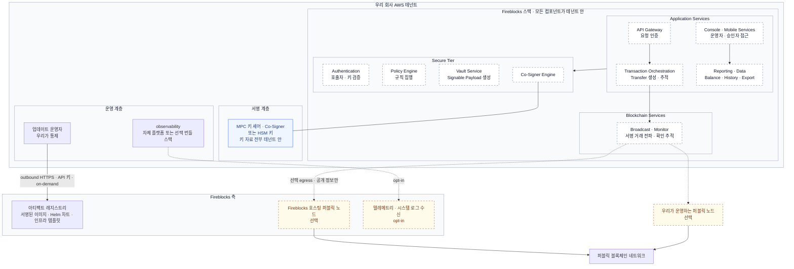

Fireblocks 전체 스택을 **우리 회사 AWS 테넌트 안에 배치하는 Private Cloud 모델**의 구성·책임·외부 연결·키 위치를 한곳에 정리한다. 내용은 Fireblocks Private Cloud 프로젝트 리드가 서면으로 답한 범위로 한정하며, 인프라를 생성하거나 도입을 계약한 결과가 아니다.

담당자가 후속으로 주기로 한 아키텍처·데이터 플로우 다이어그램, shared responsibility matrix, 운영·업데이트 모델 문서는 아직 받지 않았다. 그 문서가 오면 이 문서의 표와 그림을 대조해 갱신한다. Cloud PaaS MPC·KeyLink HSM·Korean Local Instance 세 배치안은 [배치 옵션 문서](00-deployment-options.md)에서 다루며, Private Cloud 와 그 세 옵션의 관계는 이번 확인 범위에 없다.

## 배치 기반

| 기반 | 제공 여부 | 담당자 답변 |
|---|---|---|
| AWS | 제공 중 | 현재 Private Cloud 배포는 AWS 에서만 가능 |
| Azure | 계획 | 2028년 이후로 계획 |
| 물리 IDC (베어메탈·on-prem Kubernetes) | 없음 | 현재 베어메탈·on-prem 옵션 없음 |

우리 측은 한국 금융기관 다수가 물리 IDC 로 제한되어 있어 이 제약이 우리와 Fireblocks 의 한국 파이프라인 모두에 영향을 준다고 전달했다. 설계 대상은 AWS 로 유지한다.

## 전체 구성

역할별 계층으로 묶은 그림이다. 네트워크 구역이나 AWS 계정 경계를 뜻하지 않으며, 담당자가 답한 연결만 표시했다. Fireblocks 로부터 우리 테넌트로 들어오는 inbound 연결은 없다고 답했으므로 그리지 않았다.

Fireblocks 스택 안의 구성요소 이름은 [배치 옵션 문서 8쪽](00-deployment-options.md#p8-option-1-cloud-paas-mpc-상세-구조)의 Fireblocks Platform 구성을 옮긴 것이다. 그 자료는 Cloud PaaS MPC 배치를 설명하므로, **Private Cloud 스택이 같은 구성요소로 이루어지는지는 담당자에게 확인하지 않았다.** 스택 내부 상자는 점선으로 그려 이 상태를 표시했고, 후속 아키텍처 문서로 대조한다.

담당자는 모든 컴포넌트가 테넌트 안에 호스팅된다고 답했다. 우리 측 질문에서 열거한 컴포넌트와 PDF 8쪽 구성요소는 다음과 같이 대응한다. 대응은 이름 기준이며 기능 범위가 같다는 확인은 아니다.

| 질문에서 열거한 컴포넌트 | PDF 8쪽의 구성요소 | PDF 의 설명 |
|---|---|---|
| API | API Gateway | 모든 요청 인증 |
| 정책 엔진 | Policy Engine | 고객 규칙 집행 |
| vault 서비스 | Vault Service | Signable Payload 생성 |
| 블록체인 서비스 | Broadcast and Monitor · Nodes | 서명 거래 전파 · 모니터링. Nodes 는 Private Cloud 에서 선택 호스팅 |
| 콘솔 | Console and Mobile Services | 운영자 · 승인자 접근 |
| 질문에 없음 | Transaction Orchestration · Reporting and Data · Authentication · Co-Signer Engine | Transfer 생성 · 추적, Balance · History · Export, 호출자 · 키 검증, Key Share 보관 |

PDF 8쪽은 Secure Tier 를 Intel SGX Enclave 로 표시하고 Co-Signer Engine 에 Fireblocks Key Share 를 보관한다고 설명한다. Private Cloud 에서는 담당자가 Fireblocks 에 키 자료가 없다고 답했으므로 Co-Signer Engine 이 보관하는 키 자료도 테넌트 안에 있어야 하지만, 실행 기반이 Enclave 인지와 Key Share 배치 방식은 확인하지 않았다. 스택 내부의 실제 연결과 AWS 자원 대응은 후속 아키텍처 문서로 확인한다.

점선 화살표는 선택 연결이다. 노드를 직접 운영하면 호스팅 노드 egress 는 없어지고 우리 노드에서 블록체인 네트워크로 연결한다.

## 환경 구성과 AWS 자원

전체 환경 세트는 dev, staging, production, passive DR 리전으로 구성되며 여러 AWS 계정에 걸친다. 계정 수와 환경별 계정 분리 기준은 답변에 없다.

우리가 프로비저닝하고 운영해야 하는 AWS 자원은 다음과 같다.

| 구분 | 서비스 | 비고 |
|---|---|---|
| 컨테이너 실행 | EKS | |
| 관계형 DB | RDS · Aurora 기반 MySQL/PostgreSQL | 두 엔진 중 어느 것을 어느 서비스가 쓰는지는 답변에 없음 |
| NoSQL · 캐시 | DynamoDB · ElastiCache | |
| 메시징 · 스트림 | managed Kafka(MSK) · Kinesis | |
| 검색 · 로그 | OpenSearch | |
| 기반 | 네트워킹 · KMS 베이스라인 | |
| 보안 도구 | GuardDuty · Security Hub · Config | 담당자는 "표준 AWS 보안 도구"로 열거 |

Fireblocks 는 infrastructure-as-code 템플릿, 사이징 가이드, 공동 아키텍처 워크숍을 제공한다. 자원 수량·인스턴스 유형·비용은 사이징 가이드와 요구 사항 노트 제출 후 산정으로 남긴다. 이 문서에 임의의 수량표를 만들지 않는다.

## 책임 분담

담당자 답변을 그대로 나눈 것이다. 문서화된 shared responsibility matrix 는 후속으로 받기로 했으며, 그 문서가 이 표를 대체한다.

| 영역 | 우리 회사 | Fireblocks |
|---|---|---|
| AWS 자산 | 프로비저닝 · 거버넌스 · 상시 운영 | IaC 템플릿 · 사이징 가이드 · 공동 아키텍처 워크숍 |
| 아키텍처 | 환경 준비 | 아키텍처 검증 |
| 배포 | 환경 제공 | 우리 환경에 Fireblocks 스택 배포 |
| 키 · 인증서 | 키 자료 보관 · 운영 | 우리 구성에 특화된 키/인증서 설계 |
| go-live | 공동 참여 | 구조화된 go-live 프로세스 주도 |
| 업데이트 | 우리 환경 또는 우리가 통제하는 운영자가 pull | 서명된 아티팩트를 레지스트리에 제공 |
| observability | 자체 플랫폼으로 수집하면 전권 보유 | 선택 번들 스택 사용 시 지원 엔지니어 대시보드 접근 가능 |
| 퍼블릭 노드 | 직접 운영 가능 | 선택 시 호스팅 · 관리 |

담당자는 더 크고 고정적인 부담이 우리 쪽에 있다고 했다. 이유는 Private Cloud 가 우리 AWS 테넌트 안에서 전부 실행되기 때문이다. 우리 측은 이 부담을 이해하고 수용한다고 회신했다.

### 표준화된 범위

AWS 리소스 footprint, 배포·프로비저닝 방식, 전체 키 커스터디 모델은 Private Cloud 배포 전반에 일관되게 적용하는 패턴이며 고객마다 새로 만들지 않는다. 우리에게만 신규인 항목이 무엇인지는 답변에 구분되어 있지 않다.

## Fireblocks 와의 런타임 연결

규제 평가는 각 항목이 "없음" 또는 "설정으로 비활성화 가능"인지에 달려 있다고 전달했고, 담당자가 항목별로 답했다.

| 항목 | 연결 | 방향 · 방식 | 비활성화 |
|---|---|---|---|
| 라이선스 검증 | 상시 연결 불필요 | 답변에 없음 | 다른 검증 모델이 필요하면 논의 가능 |
| 소프트웨어 업데이트 · 패치 | 필요. 계획에 반영해야 하는 유일한 의존성 | outbound HTTPS · API 키 인증 · on-demand pull. inbound 없음 | 해당 없음 |
| 시세 데이터 · 자산 메타데이터 | 별도 답변 예정 | 배포 범위의 제품 모듈에 따라 다름 | 미확인 |
| 지원 · break-glass 접근 | 기본적으로 상시 접근 없음 | 선택 번들 observability 스택 사용 시 지원 엔지니어 대시보드 접근 | 자체 observability 플랫폼으로 보내면 Fireblocks 접근 없음 |
| 텔레메트리 · 시스템 로그 | opt-in | 우리 배포 환경의 실시간 경보용 | 필수 아님 |
| 호스팅 퍼블릭 노드 | 선택 | 우리 테넌트에서 Fireblocks 호스팅 노드로 egress | 노드 직접 운영 시 없음 |
| Fireblocks Network | 우리 측이 현 단계 불필요로 전달 | 담당자 답변 없음 | 미확인 |

업데이트 pull 대상은 서명된 컨테이너 이미지, Helm 차트, 인프라 템플릿이다. 레지스트리 도메인, pull 주기, 네트워크 허용 목록은 답변에 없으므로 운영·업데이트 모델 문서로 확인한다.

담당자는 지원 접근 조건을 shared responsibility matrix 에 명시해 구두 표현이 아닌 문서에 근거해 평가할 수 있게 하겠다고 했다.

## 키 자료 위치

MPC 키 셰어와 Co-Signer 는 전부 우리 테넌트 안에 있다. Fireblocks 에는 키 자료가 존재하지 않는다. 이 답은 MPC 키 모델과 HSM 키 모델 모두에 해당한다.

| 항목 | MPC 모델 | HSM 모델 |
|---|---|---|
| 키 자료 위치 | 우리 테넌트 | 우리 테넌트 |
| Fireblocks 보유 셰어 · 서명 역할 | 없음 | 없음 |
| 구성 요소 · 지원 HSM 제품 | 답변에 없음 | 답변에 없음 |

우리 측은 HSM 기반 스택이 이미 보안·인증 레이어에 내장되어 있어 HSM 모델도 검토 중이며, MPC 대 HSM 을 내부에서 검토해 의견을 주기로 했다. Co-Signer 수, 셰어 분포, 복구 절차는 이번 확인 범위에 없다.

## 퍼블릭 노드 운영 방식

| 항목 | 직접 운영 | Fireblocks 호스팅 |
|---|---|---|
| 담당자 설명 | 항상 가능 | 대부분의 은행이 선택. 노드 운영이 은행 쪽에 상당한 부담이라 제공 |
| permissioned · private 네트워크 | 은행이 직접 보유 | 해당 없음 |
| 테넌트 밖으로 나가는 데이터 | 없음 (이 항목에 한정) | 퍼블릭 노드에서 얻는 정보로 한정. 트랜잭션 정보, 지갑 잔액, 지갑 주소 조회, nonce 조회, 트랜잭션 제출, 컨트랙트 호출 제출 등 |
| 데이터 성격 | 해당 없음 | 퍼블릭 네트워크가 제공하거나 소비하는 공개 정보로 한정 |
| 네트워크 경로 · 인증 | 해당 없음 | 답변에 없음 |

우리 측 입장은 다음과 같다.

- 나머지가 전부 우리 테넌트에 있으면 노드도 직접 운영하는 쪽으로 기울어 있다. 스테이블코인 중심이라 필요한 체인 수가 적고, Layer 1(Klaytn)을 수년간 개발·운영한 뒤 이관한 경험이 있다.
- 한국식 의미의 망분리는 달성할 수 없다는 점을 인지한다. 퍼블릭 블록체인에 쓰는 행위 자체가 그 선을 넘는다. 한국의 보수적인 금융 규제를 설득해야 하며, Alchemy 나 Infura 같은 노드 제공자가 한국 금융사에 제한되는 이유와 같다.
- 규제기관과 직접 협의한 뒤 Fireblocks 호스팅 노드가 가능한지 회신한다. 체인 목록은 요구 사항 노트에 적어 두 옵션 모두 산정할 수 있게 한다.

## 구축과 go-live

Fireblocks 측 go-live 프로세스의 구성 요소는 다음과 같다. 담당자가 열거한 순서이며 실제 일정 순서와 기간은 확인하지 않았다.

| 구성 요소 | 내용 |
|---|---|
| 솔루션 아키텍처 세션 | 아키텍처 검증 |
| 클러스터 관리 워크숍 | 답변에 상세 없음 |
| 공동 UAT | 답변에 상세 없음 |
| DR 리허설 | 답변에 상세 없음 |
| hypercare | 출시 후 |

리드타임과 예산은 요구 사항 노트 제출 후 Fireblocks 가 산정한다. 우리 측은 이번 주에 노트를 보내기로 했다.

### 출시 전 확인

후속 문서를 받은 뒤 이 문서와 대조할 항목이다. 답변에서 확정된 사항을 문서로 재확인하는 목적이며, 새 요구 사항을 추가한 것이 아니다.

- [ ] shared responsibility matrix 에 지원 접근 조건이 명시되어 있다.
- [ ] 아키텍처 · 데이터 플로우 다이어그램에서 Fireblocks 로 향하는 연결이 위 런타임 연결 표와 일치한다.
- [ ] 운영 · 업데이트 모델 문서에서 pull 대상 레지스트리 · 인증 · 주기를 확인했다.
- [ ] 시세 데이터 · 자산 메타데이터 의존성의 별도 답변을 받아 표에 반영했다.
- [ ] MPC · HSM 두 모델 모두 키 자료가 테넌트 안에만 있다는 점이 문서에 있다.
- [ ] BNYM 배포의 규제기관 대응 자료 중 NDA 하 공유 가능한 것을 받았다.

## 도입 판단

우리 측이 담당자에게 전달한 판단이다.

- 내부 역량, 자체 스택 통제, 규제 대응 용이성을 고려해 이 모델이 맞다고 본다. 모든 것이 자체 AWS 테넌트에서 실행되므로 한국 리전 SaaS 배포보다 한국 규제 대응에 더 수월하다고 본다.
- 우리 회사는 한국 금융기관 중 최초로 AWS 를 프로덕션에 도입했고 한국 리전 롤아웃을 주도했으며 AWS Tier 1 파트너다. 위 AWS 자산은 감당 가능한 범위다.
- AWS 전용 제약과 한국 기관 다수가 물리 IDC 전용인 점을 고려하면, 우리 회사가 상당 기간 이 모델의 유일한 한국 도입사가 될 수 있다. 이 점은 Fireblocks 쪽 단점으로 전달했다.

참조 고객으로 담당자는 BNYM 을 가장 크고 대표적인 운영 은행으로 들었다.

## 확인 필요 항목

### Fireblocks 가 주기로 한 것

| 항목 | 상태 |
|---|---|
| 시세 데이터 · 자산 메타데이터 의존성의 정확한 답 | 대기 |
| shared responsibility matrix | 대기. 지원 접근 조건 명시 예정 |
| Private Cloud 아키텍처 · 데이터 플로우 다이어그램 | 대기. 내부 팀에 요청됨 |
| 운영 · 업데이트 모델 문서 | 대기 |
| BNYM 배포 규제기관 대응 자료 (NDA) | 대기 |
| 다른 라이선스 검증 모델 | 필요 시 논의 |

### 우리가 주기로 한 것

| 항목 | 상태 |
|---|---|
| 요구 사항 노트 (체인 목록 포함) | 이번 주 발송 예정 |
| Fireblocks 호스팅 노드 수용 가능 여부 | 규제기관 협의 후 |
| MPC 대 HSM 선택 의견 | 내부 검토 후 |

### 이번 확인에서 답이 없는 것

- Private Cloud 와 배치 옵션 문서의 Korean Local Instance 사이의 관계
- Private Cloud 스택의 구성요소가 배치 옵션 문서 8쪽의 Fireblocks Platform 구성과 같은지, Secure Tier 의 실행 기반과 Key Share 배치 방식
- 라이선스 검증에서 "상시 연결 불필요"가 연결이 전혀 없다는 뜻인지, 비상시 연결이 있다는 뜻인지
- 아티팩트 레지스트리의 도메인, pull 주기, 네트워크 허용 목록
- 선택 번들 observability 스택의 구성 요소와 지원 엔지니어 대시보드 접근 범위
- 호스팅 노드 옵션의 네트워크 경로와 인증 방식
- HSM 모델의 구성 요소와 지원 HSM 제품
- AWS 계정 수, 환경별 계정 분리 기준, 자원 수량
- Fireblocks Network 연결 여부에 대한 담당자 답변
- 리드타임과 예산

## 확인한 자료

- Fireblocks Private Cloud 프로젝트 리드와의 서면 질의응답 3회. 정리일 2026-09-16. 담당자가 별도로 주기로 한 문서는 미수령
- [Fireblocks PaaS 배치 옵션](00-deployment-options.md): Cloud PaaS MPC · KeyLink HSM · Korean Local Instance 세 배치안의 PDF 전환본. 스택 구성요소 이름은 8쪽 Option 1 상세 구조에서 가져왔다

답변에 없는 수치·구성·순서는 적지 않았다. 담당자의 표현을 옮긴 곳은 "담당자 답변" 또는 "담당자 설명"으로 표시했다.
