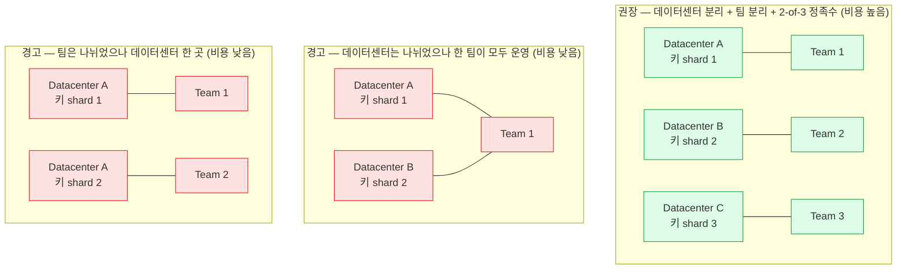

Taurus SA 가 2023년 6월 발행한 17쪽 기술 리포트 `Banking-grade digital asset custody` 를 정리한 문서다. 2020년 10월 판을 갱신한 것이며, 저자는 Taurus 의 CSO 겸 공동창업자 Jean-Philippe Aumasson 이다 (3쪽). 읽는 대상을 은행 경영진·감사인·규제기관으로 밝히고 있다 (4쪽).

리포트는 Taurus 가 자사 업무에도 고객과 같은 제품을 쓴다고 밝히며 Taurus-PROTECT(핫·웜·콜드 커스터디), Taurus-EXPLORER(블록체인 노드), Taurus-CAPITAL(토큰화 자산·증권의 발행과 생애주기 관리) 세 가지를 든다 (4쪽).

제품 명세가 아니라 "은행이 쓸 커스터디 솔루션은 무엇을 갖춰야 하는가" 를 벤더 관점에서 정리한 글이다. 우리는 이 문서를 **벤더 평가와 자체 구축 범위를 대조하는 점검 목록**으로 쓴다. Taurus 제품 도입 검토가 아니다.

읽을 때 구분할 것이 두 가지 있다.

- **일반 원칙과 자사 주장이 섞여 있다.** "우리는 전체 스택을 통제한다", "Taurus-PROTECT 는 HSM 을 사용한다" 같은 서술은 벤더의 주장이다. 아래 정리에서는 주장에 해당하는 대목을 그렇게 밝혔다.
- **2023년 6월 기준이다.** 이후 제품·기술·규제 변화는 반영돼 있지 않다.

원본 17쪽에 명시 허가 없는 전부·일부 복제를 금지하는 문구가 있어, 쪽을 밝힌 요약과 짧은 인용으로만 정리했다. 쪽 번호는 PDF 기준이다.

| 함께 볼 문서 | 연결되는 대목 |
|---|---|
| [Fireblocks PaaS 배치 옵션](../Fireblocks/00-deployment-options.md) | Cloud MPC 와 KeyLink HSM 의 선택이 이 리포트의 HSM·MPC 역할 구분과 이어진다 |
| [Dfns 도입 — 운영 모델과 Baseline·AWS-Native](../Dfns/00-on-premise-deployment.md) | 서명 인프라를 누가 운영하는가, 벤더가 shard 를 갖는가의 문제 |
| [MPC 를 쓰는 이유](../../블록체인/지갑보안/02-why-mpc.md) · [MPC-CMP](../../블록체인/지갑보안/03-mpc-cmp.md) | Taurus 가 MPC-CMP 의 최초 오픈소스 구현을 공개했다고 밝힌다 (14쪽) |

## 커스터디 솔루션의 정의

리포트는 커스터디 솔루션을 대략 세 가지로 정의한다 (5쪽).

- 소유와 통제가 암호 기법으로 실현되고 암호 비밀값(보통 개인 서명키) 접근에 의존하는 자산을 보관한다.
- 스마트컨트랙트 함수와의 안전한 상호작용, 토큰화 증권의 자산 서비싱 같은 부가 기능을 제공한다.
- 수탁자가 법적 책임을 지는 규제 대상 금융기관의 맥락에서 그렇게 한다.

"은행급" 이라는 말은 소비자용 지갑의 기본 기능을 넘어서야 한다는 뜻이다. 초기에 암호자산을 도입한 여러 은행이 일반 소비자가 쓰는 것과 같은 상위 등급 하드웨어 지갑에 의존했고, 기관의 보안·컴플라이언스 기준을 맞추려고 별도 절차와 자체 소프트웨어를 붙여야 했다. 거래량과 토큰·거래 유형이 늘면서 기존 방식이 적절하지 않다는 것이 분명해졌다고 설명한다. 솔루션의 보안 보증 수준은 관련된 위험과 가치에 비례해야 한다는 것이 이 대목의 전제다 (5쪽).

솔루션이 금융기관의 요구를 충족하려면 다뤄야 할 영역으로 네 가지를 든다. 리포트는 이 목록이 전부는 아니라고 밝힌다 (5쪽).

| 영역 | 리포트가 든 항목 |
|---|---|
| 인증 | 비밀번호 정책, 다중 인증 방식, SSO 프로토콜 |
| 컴플라이언스 | 주소 스코어링 제공자, 주소·스마트컨트랙트 화이트리스트, 자산 서비싱 |
| 모니터링 | 로그 구조와 종류, SIEM 연동 |
| 직무 분리 | 역할의 종류와 개수, 정족수 승인, 배치 모델 |

## 공유 책임 모델

AWS 가 퍼뜨린 공유 책임 모델은 PaaS·IaaS 일반을 겨냥한 것이라 커스터디에는 그대로 맞지 않고, 애플리케이션에 특화된 모델이 필요하다는 것이 리포트의 주장이다 (5쪽). 구성 블록을 세 부류로 나눈다 (6쪽).

- 커스터디 솔루션에 온전히 속하고 구현과 신뢰성이 주로 제공자(와 그 하도급자)의 책임인 부분
- 제공자가 통제할 수 없는 외부 구성요소. 고객의 것일 수도, 제3자의 것일 수도 있다
- 배치 모델(전부 온프레미스부터 전부 관리형까지)에 따라 제공자와 고객이 함께 지는 부분

6쪽 Figure 1 은 솔루션 블록과 그에 짝지어지는 항목을 나란히 놓고, 항목마다 위 세 부류 중 어디에 속하는지를 색으로 구분한다. 텍스트로 추출되지 않아 이미지로 확인하고 색 분류까지 표로 옮겼다.

| 솔루션 블록 (모두 솔루션 내부) | 짝지어진 항목 | 짝지어진 항목의 책임 구분 |
|---|---|---|
| 접근 관리 통제 | 인증 — MFA, SSO 등 | 공동 책임 |
| 컴플라이언스 통제 | 규제와 법 — FINMA, GDPR 등 | 외부 |
| 리스크 관리 통제 | 내부 정책 — 스코어링, 한도 등 | 외부 |
| 거래와 서명 메커니즘 | 보안 실행 환경 — HSM, TEE, secure enclave 등 | 솔루션 내부 |
| 블록체인 통신 | 블록체인 노드 — 인덱싱, 익스플로러 | 공동 책임 |
| 자금 관리 메커니즘 | 코어뱅킹 네트워크 — 디지털 자산 연동 | 외부 |

오른쪽 항목이 전부 외부인 것은 아니다. **보안 실행 환경만 솔루션 내부**로 표시돼 있고, 인증과 블록체인 노드는 공동 책임, 규제·내부 정책·코어뱅킹 네트워크가 제공자가 통제할 수 없는 외부다.

이 여섯 줄 전체를 **BCP·재해복구**와 **감사(기술·컴플라이언스)** 두 축이 가로지른다. 그림에서 두 축은 여섯 블록 왼쪽을 세로로 관통하는 띠이고 둘 다 공동 책임 색으로 칠해져 있다.

리포트가 붙인 핵심 메시지는 이렇다 (6쪽).

> 은행용 운영 수준의 커스터디 솔루션은 안전한 서명과 키 보관("서명기") 을 훨씬 넘어선다. 기술·서비스 제공자가 서명 계층 해결에만 머물면, 여러 공급자의 구성요소를 신뢰하기 어렵게 이어 붙이거나 예산을 초과하게 된다.

## 여덟 개 통제 블록

7쪽이 각 블록의 내용을 예시로 든다.

| 블록 | 리포트가 든 항목 |
|---|---|
| 1. 접근 관리 통제 | 감사 추적을 동반한 역할 기반 접근 통제, API·GUI 접근, 거래상대·유동성 공급자 연결, 다중 요소 강인증, SSO 프로토콜 |
| 2. 컴플라이언스 통제 | KYC·AML 확인, KYT 위험 스코어링과 경보·자동 사기 탐지, 트래블룰, 지갑·주소·자금 격리, 암호학적 준비금 증명, 활동 로그와 감사 추적 |
| 3. 리스크 관리 통제 | 주소 화이트리스트·블랙리스트, 거래 규칙(금액·시간대 등), 여러 수준에서 설정하는 속도 제한, 긴급 차단 스위치, 다운그레이드·재전송 공격 방지 |
| 4. 거래와 서명 메커니즘 | 시드·키의 안전한 보관, 블록체인 거래 생성, 계층적 키 파생을 포함한 서명, 여러 타원곡선과 서명 방식 지원, 임계 서명 지원 |
| 5. 블록체인 통신 | 신뢰할 수 있는 거래 전파, 주소 실시간 감시, IP·발신자 정보 프라이버시, 프런트러닝 완화 |
| 6. 자금 관리 메커니즘 | 모든 유형 디지털 자산의 발행·기표·이전과 기업 행위 처리, 노스트로·보스트로를 포함한 자금 관리, 대사와 보고, SWIFT 를 포함한 코어뱅킹 연계, 주문 관리 시스템 연계 |
| 7. 감사 (기술·컴플라이언스) | 업무·감사 추적 생성과 무결성 보호, 로그 관리 시스템·SIEM 연결, 모의침투와 코드 리뷰, 컴플라이언스·인증 감사 |
| 8. BCP·재해복구 | 액티브-액티브 이중화와 백업, 고가용성 네트워크, 벤더 종속 회피, 장애 전환·복원·비상 상황 시험 |

5번 블록에는 "제공자들이 자주 놓치는 부분이며, SLA 가 거의 없는 공개 노드에 의존하기도 한다" 는 지적이 붙어 있다 (7쪽).

## 보안 목표

8쪽이 총론이고 개별 목표 열 가지는 9쪽부터 11쪽에 나온다. 총론은 보안과 신뢰성을 네 측면으로 나눈다. 외부 공격자·내부자·우발적 장애를 막는 것, 자산 통제뿐 아니라 데이터 무결성·키를 복원할 수 있는지·감사 추적까지 보는 것, 순수한 기술 보안과 보안 프로토콜 선택, 신뢰 가정의 수준이다. 높은 보증 수준에는 절차적·기술적 통제와 이중화·다층 방어·다양한 시험이 함께 필요하다고 말한다 (8쪽). 아래는 우리 설계 점검에 바로 쓸 수 있는 대목만 옮긴 것이다.

**시드·키에 직접 접근하지 못하게 한다** (9쪽). 시드는 BIP-32·BIP-44·SLIP-10 같은 사실상 표준으로 키를 파생하는 마스터 비밀값이다. 키를 여러 개 보관하는 것보다 짧은 시드 하나를 지키는 편이 쉽다고 본다. 자산 종류별·체인별로 시드를 나눌지, 하나로 둘지는 선택 사항이다. 핫·웜·콜드 어느 방식이든 시드나 개인키는 변조 방지 시스템의 보안 메모리에 둘 수 있다. 승인된 서명자 집단이라도 값을 꺼내 갈 수 없게 하려는 것이다.

**HSM 과 MPC 를 쓴다** (9쪽). Taurus 는 자사 제품 Taurus-PROTECT 가 대부분의 배치에서 HSM 을 쓰고, 그 HSM 에 자체 펌웨어 확장(HSM 용어로 functional module)을 얹어 신뢰 환경 안에서 업무 수준 통제를 실행한다고 밝힌다. HSM 은 FIPS 140-2 Level 3 인증을 받은 것이라고 한다. MPC 에는 창업 이래 투자해 왔고 오픈소스 라이브러리를 공개했다고 밝힌다. 모두 벤더의 주장이다.

**서명 기능에 무단 접근하지 못하게 한다** (9쪽). 키가 노출되지 않아도, 서명 모듈에 임의 거래를 서명시킬 수 있으면 자금을 잃는다. 우회할 수 없는 방식으로 정족수 승인을 강제해야 하며 HSM 이나 secure enclave 안에서 구현할 수 있다. 체인별 멀티시그는 일부 용도에 맞지만 체인에 무관한 방식이 대체로 더 안정적이고 확장하기 쉽다고 본다. 리포트는 계정을 여러 주체·키의 서명을 요구하도록 설정하는 멀티시그와 MPC 는 서로 다른 것이라고 따로 못박는다 (9쪽).

**무단 거래를 막는다** (10쪽). 4-eyes 원칙으로 서명 권한을 제한해도, 권한자가 업무 규칙에 어긋나는 거래를 요청할 위험이 남는다. HSM 같은 보안 환경이 거래 내용과 승인자 권한에 관한 통제를 강제할 수 있다. 화이트리스트 주소 강제, 이체 금액 한도, 허용할 스마트컨트랙트 연산 종류 지정을 예로 든다.

**키를 안전하게 생성한다** (10쪽). 난수 생성기 선택은 가장 쉬운 부분이고 문서화되고 통제된 키 생성 의식에서 백업 복구값까지 함께 만들고 시험하고 봉인해야 한다.

**백업을 신뢰할 수 있게 만든다** (10쪽). 네 가지를 요구한다. 임계 비밀 분산 같은 방식으로 공동 통제 아래 둘 것, 생성 시점과 정기적으로 시험할 것(최소 연 1회 권장), 변조가 드러나는 용기에 보관하고 자주 점검할 것, 재해복구 계획과 절차에 포함할 것. 백업 절차 자체가 검증 가능해야 하고 키 생성과 백업을 다루는 인력은 배경 조사와 교육을 거쳐야 한다고 덧붙인다.

**로그와 데이터베이스를 보호한다** (10쪽). 개인식별정보 같은 민감 데이터는 암호화하고 내용 무결성도 보장해야 한다. 무단 작업이 기록에서 지워지지 않도록 로그 무결성을 지키고 이중화 시스템으로 로그와 데이터베이스의 가용성을 확보한다. 다중 사이트 분산 구성을 쓸 수도 있다고 하며 장애 전환 절차와 시험을 함께 든다.

**감사할 수 있게 만든다** (11쪽). 커스터디 솔루션이 완전한 블랙박스로 동작해서는 안 되고 사용자에게 소스 코드를 제공하는 식으로 내부 동작을 어느 정도 투명하게 해야 한다고 본다. 제공자가 기술 스택을 많이 통제할수록 불투명함이 줄어든다는 것이 리포트의 시각이다. 신뢰할 만한 제3자의 감사 보고서를 사용자에게 제공해야 한다고도 적는다. Taurus 는 HSM 펌웨어 확장의 소스를 고객과 공유하고 MPC 라이브러리를 오픈소스로 제공한다고 밝힌다.

**공급망과 빌드 무결성을 확보한다** (11쪽). 감사에 제출한 구성요소와 실제로 도는 소프트웨어가 같고 운영 중에 바뀌지 않았음을 보장해야 한다. 감사 가능한 CI·배포 파이프라인, 핵심 구성요소의 감사 가능하거나 재현 가능한 빌드, 의존성 상시 검사와 표준 형식 SBOM 생성을 든다.

**직무를 분리한다** (11쪽). 개발과 운영 사이에서 먼저 나누고, 역할 기반 접근에서는 책임·정보 접근 수준과 충돌하지 않으면서도 부재 시 다른 사람이 같은 역할을 수행할 수 있게 배정한다. 내부 역할 변경과 권한 누적도 다뤄야 한다. 보완 통제로 정기 접근 검토, 역할 변경의 다자 승인, 제3자 감사, 인력 상실 시험 같은 업무 연속성 시험을 든다.

11쪽의 핵심 메시지는 벤더 선정 기준에 관한 것이다. 가치 사슬에서 어느 구성요소를 직접 통제하고 어느 것을 외부에 맡기는지 물어보라고 권하며 암호·임베디드 소프트웨어 같은 핵심 구성요소를 직접 개발·관리하는 쪽에 가장 높은 값을 매기라고 한다. 이 대목은 전체 스택을 통제한다고 밝히는 Taurus 자신의 위치를 뒷받침하는 주장이기도 하다.

## HSM 과 MPC 의 역할 구분

12쪽부터가 우리 판단에 가장 직접 쓰이는 부분이다. 리포트는 MPC 와 HSM 을 서로 배타적인 것으로 놓고 어느 쪽이 본래 우월한지 따지는 시각을 지나친 단순화로 본다. **그 논쟁은 거래 서명 계층 하나에만 해당하며, 앞에서 본 여러 계층 중 하나일 뿐**이라는 것이다 (12쪽).

| 구분 | HSM | MPC |
|---|---|---|
| 목적 | 신뢰 실행 환경을 만든다 | 개인키를 노출하지 않고 여러 참여자가 함께 서명한다 |
| 하는 일 | 암호값(시드·키·인증 토큰·인증서)을 안전하게 보관하고 HSM 안의 로직이 정해진 대로 계산되며 민감 정보를 드러내지 않게 한다 | 임계 서명 방식으로 n 명 중 t 명 정족수를 구성한다 |
| 다루는 범위 | 리스크 관리 계층의 통제 적용, 거래 생성과 서명까지 | 거래 계층 중 서명 부분 |
| 성숙도 | 수십 년간 운영돼 왔고, AWS·GCP 도 KMS 를 보완하는 cloud HSM 서비스를 제공한다 | 커스터디에서는 비교적 최근 기술 |
| 보안 근거 | 변조 감지 시 초기화, 승인된 코드만 실행하는 코드 서명, FIPS 140-3·Common Criteria 같은 인증 체계, 명확한 신뢰 경계 | 프로토콜마다 공격 모델·보안 수준·기능(presigning, reshare, abort)·라운드 수가 다르다 |
| 리포트가 밝힌 자리 | 높은 보증 수준의 커스터디에 하드웨어 신뢰 기점이 필수라고 본다 (14쪽) | 소프트웨어 구성요소만 쓸 수 있을 때. 예를 들어 휴대폰 앱과 서버 앱이 키를 나눠 통제하는 경우. 최신 HSM 이나 보안 하드웨어를 쓸 수 없으면 MPC 가 위험을 낮추는 선택지가 된다 (9쪽) |

리포트가 밝히는 MPC 의 한계는 세 가지다.

- **정족수가 모이면 통제를 우회한다.** "승인된 참여자 정족수는 거래 내용과 유형에 관한 보안 통제를 우회해 어떤 거래든 직접 서명하고 키를 복원할 수 있다. MPC 계층 위에 신뢰 실행 환경을 쓰지 않는 한 그렇다" (10쪽). 같은 쪽에서 리포트는 MPC 가 한 주체의 키 접근을 암호학적으로 막아 승인 문제를 다루지만 우회 대상이 되는 서명 규칙 자체가 먼저 정의되고 신뢰할 수 있게 구현돼 있어야 한다고 덧붙인다.
- **하드닝된 키 파생을 대체로 지원하지 못한다.** 대부분의 임계 서명 프로토콜이 BIP-32·SLIP-10 의 hardened derivation 을 직접 지원하지 못한다 (12쪽).
- **백업과 키 생성 의식은 그대로 필요하다** (12쪽).

원칙적으로 MPC 가 주는 공동 통제는 신뢰 실행 환경으로도 달성할 수 있고, 그 경우 보안 통제를 안전한 환경 안에서 강제할 수 있다는 이점이 따라온다. 다만 MPC 가 더 유연한 경우가 많고 특히 소매 고객 대상에서 그렇다는 것이 리포트의 평가다 (12쪽).

### MPC 를 도입한다면 확인할 다섯 가지

13쪽이 MPC 기반 솔루션을 평가하거나 사용할 때 볼 항목을 든다.

- **시스템과 주체의 분리.** 어떤 단일 주체(시스템·사람·팀·제공자)도 모든 shard 에 접근해서는 안 된다. 노드를 서로 다른 환경·데이터센터에서 돌리고 서로 다른 팀이 관리해, 한 관리자나 하나의 접근 통제 체계가 여러 노드를 동시에 통제하지 못하게 한다.
- **프로토콜 선택.** 프로토콜마다 암호학적 가정과 공격 모델이 다르고, 논문에 완전히 정의되지 않은 내부 구성요소가 있는 경우가 많다. 증명이 있다던 프로토콜에서 약점이 발견된 사례가 있고 아직 충분히 이해되지 않은 기법도 있으니 신중하라고 한다.
- **구현.** 프로토콜이 건전해도 소프트웨어 버그, 잘못된 구현, 부채널 공격 같은 함정이 남는다. 소스는 전부 감사 가능해야 하고 외부 암호 전문가의 정기 평가를 받아야 한다.
- **키 관리와 백업.** MPC 는 키 관리 부담을 없애지 않고 오히려 키우는 쪽이라고 한다. t 와 n 값에 모호함이 없어야 하고 추가 shard 가 만들어지거나 복제되지 않음을 보장해야 한다. 분산 키 생성(DKG)과 키 갱신을 쓰더라도 시스템 보안을 해치지 않아야 한다. **키 생성 의식과 백업을 블랙박스로 제공하는 구성은 피하라**고 명시한다. 고객이 검증조차 할 수 없는 채로 책임을 제공자에게 넘기게 되기 때문이다. 고객이 키 생성 과정을 온전히 통제할 것을 권한다.
- **SaaS 와 온프레미스.** 서비스형 MPC 배치에서 제공자가 키 shard 를 갖는 경우, 제공자 접근이 필요한 작업과 수준으로 엄격히 제한된다는 보증이 있어야 한다. 제공자가 사용자의 금융 활동을 감시할 수 있는 범위가 제한돼야 하고 업무 수준 통제나 규칙을 변조할 수 없어야 한다. 서비스 거부와 벤더 종속 위험을 줄이도록 재해복구 절차를 갖추고 시험해야 한다. 리포트는 "Taurus 의 일부 고객에게는 제공자가 shard 를 갖는 구성이 수용 불가" 라고 적는다.

### 분리 모델 세 가지

13쪽 Figure 3 은 구성요소의 기술적·운영적 분리 모델 세 가지를 비교하고 첫 번째를 권장한다. 텍스트로 추출되지 않아 이미지로 확인하고 다시 그렸다.

초록은 리포트가 권장하는 구성, 빨강은 리포트가 경고 표시를 붙인 구성이다. 가르는 기준은 데이터센터와 운영 팀이 **둘 다** 나뉘는가다. 한쪽만 나뉘면 단일 관리자나 하나의 접근 통제 체계가 여러 shard 를 동시에 통제할 수 있게 되고 그러면 신뢰를 분산한 의미가 사라진다. 리포트는 비용이 더 드는 쪽이 3-데이터센터 모델임을 명시하면서도 그것을 권장한다.

### Taurus 자신의 선택

14쪽은 벤더의 자기 서술이다. HSM 기반 솔루션에 자체 펌웨어 확장을 얹어 운영 중이고 MPC 에는 2019년부터 R&D 를 투자해 자체 MPC 기반 커스터디도 개발했다고 밝힌다. `Attacking Threshold Wallets` 논문을 냈고 MPC-CMP 알고리즘의 세계 최초 오픈소스 구현을 공개했다고 한다.

수십 건의 구축 경험에서 관찰한 것으로 두 가지를 든다.

- 대부분의 은행이 HSM 기반 커스터디를 선호한다. 이미 HSM 에 익숙하고 키 관리와 운영 절차가 더 단순하기 때문이다.
- MPC 를 쓰는 은행은 대체로 코드 전체 접근을 원하고 알고리즘을 이해하고 운영 배치의 책임을 질 내부 암호 전문가가 있으며 모든 MPC shard 를 자기가 통제한다.

리포트가 내놓은 결론 중 하나는 이렇다 (14쪽).

> 높은 보증 수준의 디지털 자산 커스터디에는 MPC 를 쓰든 쓰지 않든 하드웨어 신뢰 기점(HSM 같은)이 필수다.

## 증권의 커스터디와 자산 서비싱

15쪽은 토큰화 증권을 다루는 경우의 요건이다. 자산 서비싱은 수탁 자산을 관리하는 능력을 뜻하며, 배당·이표 지급·주식 분할 같은 기업 행위 처리를 포함한다. 리포트는 커스터디 솔루션이 개인키 보관과 기본 토큰 전송, 하드코딩된 mint·burn 함수를 넘어서야 하고 특정 블록체인·스마트컨트랙트 기술에 무관하게 설계돼야 한다고 본다.

- 증권 발행부터 기업 행위 관리, 상환까지 전 주기에 걸친 토큰화 자산 발행·관리(자산 생애주기 관리, ALM)
- 대체 가능 여부, 증권 여부(주식·채권·펀드·전환사채·구조화 상품), 표준 컨트랙트인지 고객 맞춤 컨트랙트인지 스마트컨트랙트가 아닌 체인 기능인지 제3자 개발 컨트랙트인지와 무관하게 동작하는 ALM 통제
- 여러 규제를 동시에 지켜야 하는 국경 간 ALM
- transfer·mint·burn 을 포함한 모든 함수 수준에서 코드 작성 없이 적용되는 은행급 통제와 검증. 화이트리스트·블랙리스트도 지원

## 참고 문헌

16쪽이 든 자료 중 우리 작업에 직접 닿는 것만 옮긴다.

- CMTA — Digital Asset Custody Standard v2.0 (<https://cmta.ch/standards/digital-assets-custody-standard>). 리포트는 Taurus 가 이 표준의 제정과 최근 갱신을 주도했다고 밝힌다 (4쪽)
- NIST SP 800-57 Part 1 Rev.5 — 키 관리 권고
- NIST Cryptographic Module Validation Program
- NSA — Kubernetes Hardening Guide
- 리포트가 "최신 MPC 프로토콜의 예" 로 든 논문 4편 — Canetti 외, `UC Non-Interactive, Proactive, Threshold ECDSA with Identifiable Aborts` (`eprint.iacr.org/2021/060`) · Connely 외, `Two-Round Threshold Schnorr Signatures with FROST` (IRTF CFRG 초안) · Doerner 외, `Threshold ECDSA in Three Rounds` (`eprint.iacr.org/2023/765`) · Gennaro·Goldfeder, `One Round Threshold ECDSA with Identifiable Abort` (`eprint.iacr.org/2020/540`)

## 우리 검토에서 확인이 필요한 것

이 리포트를 점검 목록으로 쓸 때 우리 쪽에서 답을 만들어야 하는 질문이다. 아래는 질문일 뿐이며, 현재 우리 구성이 어떤지에 관한 판단은 담지 않았다.

- 여덟 개 통제 블록 중 blockchain-manager 와 DAW 가 덮는 범위는 어디까지인가. 벤더가 덮는 범위, 어느 쪽도 덮지 않는 범위는 무엇인가
- 검토 중인 Fireblocks·Dfns 구성이 13쪽의 분리 기준(데이터센터와 운영 팀이 둘 다 나뉘는가)을 어떻게 충족하는가
- 두 벤더의 키 생성 의식과 백업이 블랙박스인가, 우리가 검증할 수 있는가
- 정족수가 모였을 때 거래 내용 통제가 우회되는 문제를 각 벤더가 어떤 방식으로 막는가
- CMTA Digital Asset Custody Standard v2.0 을 우리 점검 기준으로 쓸지 여부

## 출처와 보존 범위

| ID | 자료 | 사용 범위 |
|---|---|---|
| TAURUS-CUSTODY-001 | Taurus SA, `Banking-grade digital asset custody`, Technology report, 2023년 6월, 17쪽 | 3~16쪽. 머리말·정의·공유 책임 모델·8개 통제 블록·보안 목표 10가지·HSM 과 MPC·자산 서비싱·참고 문헌 |

- SHA-256: `769cc3b0aced166d466150c3cbca210e3f043c412e2e58c74eb355eb20529044`
- 원본은 `blockchain-manager/sources/taurus/`. 색인은 [README.md](../../../sources/taurus/README.md)
- 이 문서에는 위 리포트 외의 자료를 사용하지 않았다. 다른 벤더의 근거와 섞지 않았다.
- 원본 17쪽에 명시 허가 없는 복제 금지 문구가 있어 쪽별 전문 전환은 하지 않았고, 쪽을 밝힌 요약과 짧은 인용으로만 작성했다.
- 본문은 pdftotext 로 쪽별 추출했다. 텍스트로 나오지 않는 도형은 6쪽 Figure 1 과 13쪽 Figure 3 만 pdftoppm 렌더로 확인해 표와 도식으로 다시 그렸다. Figure 1 은 범례의 색 세 가지까지 확인해 책임 구분을 옮겼다. 8쪽 Figure 2 (NSA 1998 도해) 는 읽지 않았고 반영하지 않았다. 8쪽 본문은 텍스트 추출본으로 읽었다.
- 리포트가 자사 제품·역량을 설명하는 대목은 벤더의 주장임을 본문에 밝혔다. 별도 근거로 검증하지 않았다.
