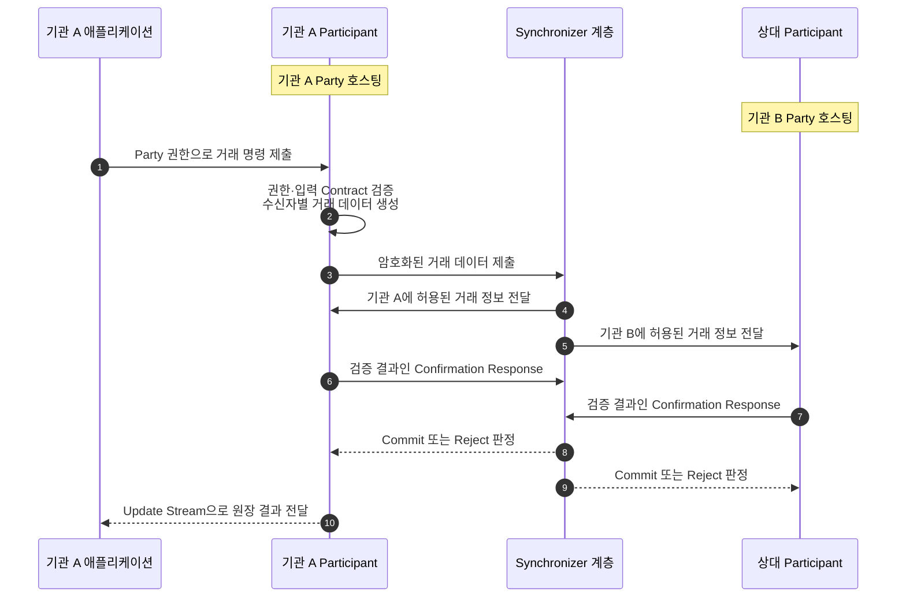
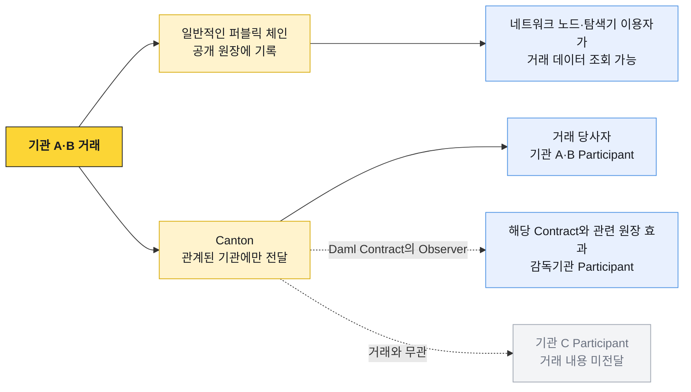

# Canton Network 개요

Canton Network는 Daml로 표현한 자산과 업무 계약을 여러 기관이 하나의 거래로 처리하는 분산 원장 네트워크다. 각 기관의 `Participant`가 원장 신원인 `Party`를 호스팅하고, `Synchronizer` 계층이 관련 Participant 사이의 메시지 순서와 거래 확정을 조정한다.

## 거래 제출과 확정 흐름

Synchronizer 계층의 Sequencer가 암호화된 메시지의 순서를 정하고, Mediator가 관련 Participant의 확인 결과를 모아 Commit 또는 Reject를 판정한다.

## 거래 정보 전달 범위

기관 A가 기관 B에게 자산을 이전하면 A와 B의 Participant에 각 기관이 볼 수 있는 거래 정보가 전달된다. Daml Contract에서 감독기관을 `Observer`로 선언했다면 감독기관의 Participant에도 해당 Contract와 관련 원장 효과가 전달된다. 거래와 관계없는 기관 C의 Participant에는 전달되지 않는다.

Canton은 하나의 트랜잭션을 권한 범위에 따라 여러 부분으로 나눈다. 각 부분을 `Transaction View`라고 한다. Participant는 자신이 호스팅하는 Party에 허용된 View만 받아 권한, 입력 Contract, 원장 효과를 검증한다.

위 그림은 데이터의 공개 범위를 나타낸다. 실제 메시지는 기관 A에서 기관 B로 직접 전달되지 않는다. 제출 Participant가 수신자별로 암호화한 View를 Synchronizer에 보내고, Synchronizer가 관련 Participant에 순서대로 전달한다.

## 거래 참여자

| 주체 | 원장 역할 | 거래에서 하는 일 |
|---|---|---|
| 기관 A Party | 자산 송신자 | 전송을 제출하고 관련 View를 검증한다 |
| 기관 B Party | 자산 수신자 | 관련 View를 검증하고 Token workflow가 수신자 수락을 요구하면 전송을 수락한다 |
| 감독기관 Party | Observer | Observer로 선언된 Contract와 관련 원장 효과를 관찰한다 |
| 기관 C Party | 거래와 무관 | 해당 거래의 View를 받지 않는다 |
## 주요 구성요소

| 구성요소 | 역할 |
|---|---|
| Party | 원장 위에서 권리와 의무를 갖는 업무 신원 |
| Participant | Party의 Contract를 저장하고 명령을 실행·검증하는 노드 |
| Synchronizer | 관련 Participant 사이에서 암호화 메시지의 순서와 판정 결과를 조정한다 |
| Daml Contract | 데이터, 가시성, 허용된 행동을 함께 표현하는 원장 객체 |
| Validator | Participant와 네트워크 연동 서비스를 포함하는 운영 구성 |

## 퍼블릭 체인과의 개념 차이

| 관점 | 일반적인 퍼블릭 체인 | Canton |
|---|---|---|
| 거래 공개 범위 | 공개 원장 데이터가 네트워크 참여자에게 폭넓게 공개 | 관련 Party의 Participant만 허용된 View를 수신 |
| 현재 상태 | 주소·계정의 가변 상태 | 활성 Contract의 집합인 ACS |
| 잔액 | 주소에 연결된 숫자 | Party가 소유한 활성 Holding의 합 |
| 상태 변경 | 계정·스토리지 값 갱신 | 기존 Contract 소비와 새 Contract 생성 |
| 거래 조회 | 공개 RPC·블록 탐색기 | Party 권한이 적용된 ACS·Update Stream |
| 확정 | 블록 포함과 Confirmation·Finality | 관련 Participant 확인과 Mediator 판정 |
| 서명 검증 | 체인별 직렬화 Payload 확인 | Prepared Transaction의 전체 원장 효과 확인 |

## 세부 문서

| 문서 | 범위 |
|---|---|
| [프라이버시와 무결성](./01-privacy-and-ledger-model.md) | Transaction View, Signatory·Observer·Controller, 관련 Participant 검증 |
| [Party와 노드](./02-party-participant-synchronizer.md) | Party 호스팅, Participant·Validator·Synchronizer 책임, External Party |
| [Daml Contract와 원장](./03-daml-contract-and-ledger.md) | Contract 생성·소비, ACS, Update Stream, 동시성 |
| [Holding과 전송·정산](./04-token-and-transfer-flow.md) | Holding 잔액, 전송 상태, DvP, Traffic |
