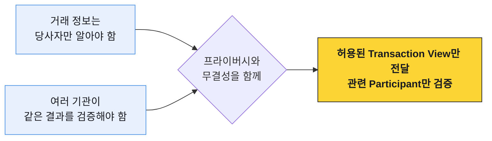
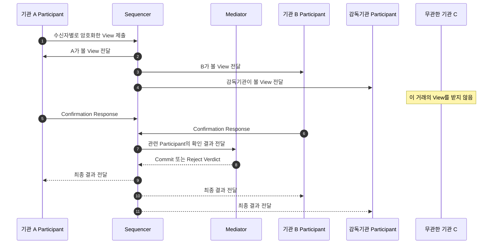
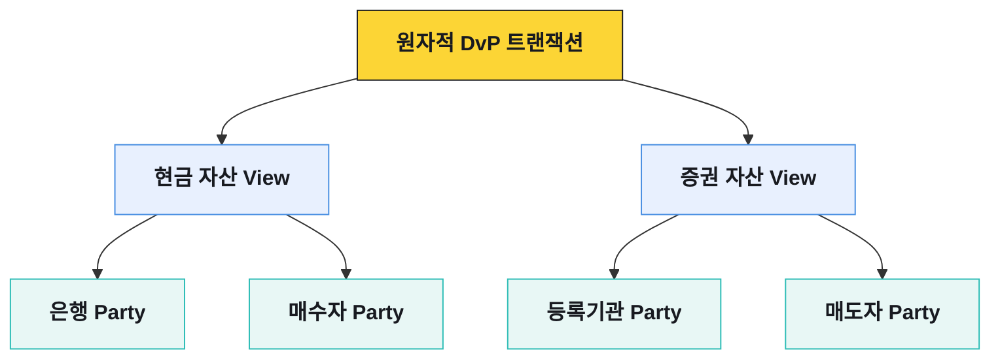

# 거래 공개 범위와 관련 당사자 검증

기관 간 거래에는 서로 충돌하는 요구가 있다. 거래 금액과 상대는 감춰야 하지만, 같은 자산을 두 번 쓰지 않았는지와 계약 조건을 지켰는지는 함께 검증해야 한다.

일반적인 퍼블릭 체인은 공개된 거래와 상태를 여러 노드가 복제·검증하는 방식으로 무결성을 얻는다. 거래 정보 자체가 민감한 기관 금융에는 이 공개 범위를 그대로 적용하기 어렵다.

Canton은 하나의 트랜잭션을 권한과 가시성 범위에 따라 여러 하위 트랜잭션으로 나눈다. 각 하위 트랜잭션을 `Transaction View`라고 하며, 이후에는 `View`로 줄여 쓴다.

## 선택적 공개와 관련 당사자 검증



Canton은 거래 전체를 모든 Participant에 보내지 않는다. 각 View를 볼 권한이 있는 Party의 Participant에만 전달한다.

## 선택적 공개의 세 단계

| 단계 | 하는 일 | 빠지면 생기는 문제 |
|---|---|---|
| View 분리 | 거래를 당사자별로 필요한 부분으로 나눈다 | 모든 당사자가 거래 전체를 보게 된다 |
| 관련 당사자 검증 | 그 View와 이해관계가 있는 Participant만 권한·입력 상태를 확인한다 | 무관한 노드까지 데이터와 검증 부담을 가진다 |
| 가시성 없는 조정 | Synchronizer가 암호화된 메시지의 순서와 확인 결과를 맞춘다 | 중앙 조정자가 거래 원문을 보게 된다 |

세 단계는 하나의 흐름이다. View만 잘게 나눠도 무관한 노드가 검증하면 정보가 새고, 관련 노드만 검증해도 조정 계층이 원문을 읽으면 프라이버시 경계가 무너진다.

## 기관 A의 전송 흐름

기관 A가 기관 B에게 자산을 보내고 감독기관을 관찰자로 둔다고 하자.



Sequencer는 메시지에 순서를 부여해 필요한 Participant로 보낸다. A와 B의 Participant는 자신에게 전달된 View를 검증하고 확인 결과를 Sequencer에 보낸다. Sequencer가 확인 결과를 Mediator에 전달하면 Mediator가 Commit 또는 Reject Verdict를 만들고, Sequencer가 그 결과를 관련 Participant에 전달한다.

이 예에서 기관 C가 거래를 조회하지 못하는 이유는 화면 권한으로 가렸기 때문이 아니다. 기관 C가 호스팅하는 Party가 해당 거래의 이해관계자가 아니므로 그 Participant에 View가 전달되지 않는다.

### Transaction View 전달 단계

전달 대상과 확인 주체는 트랜잭션의 권한 범위와 Party 역할에 따라 단계별로 달라진다.

```anim
canton-view-flow
```

## 누가 보고 누가 행동하는가

Daml Contract는 데이터와 함께 역할을 선언한다.

| 역할 | Contract를 보는가 | 할 수 있는 일 |
|---|---|---|
| Signatory | 본다 | Contract 생성에 동의하고 핵심 책임을 진다 |
| Observer | 본다 | 내용을 관찰하지만 그 이유만으로 Choice를 실행하지는 못한다 |
| Controller | 해당 Choice와 결과를 본다 | 지정된 Choice를 실행한다 |
| Stakeholder | 해당 | Signatory와 Observer를 합쳐 부르는 말이다 |

예를 들어 기관 A와 B를 Signatory로, 감독기관을 Observer로 두면 세 Party는 Contract를 볼 수 있다. 하지만 감독기관은 관찰자라는 이유만으로 자산 이전 Choice를 실행할 수 없다.

```daml
template TransferAgreement
  with
    sender    : Party
    receiver  : Party
    regulator : Party
    amount    : Decimal
  where
    signatory sender, receiver
    observer regulator

    choice Execute : ()
      controller sender
      do pure ()
```

코드는 개념을 보여주기 위한 축약 예시다. 실제 전송 모델은 사용하는 토큰 구현과 패키지에 따라 달라진다.

## View는 화면 한 장이 아니다

View는 UI 화면이나 API 응답 일부를 뜻하지 않는다. 복합 트랜잭션 안에서 같은 권한과 가시성을 갖는 원장 효과의 단위에 가깝다.

DvP 거래에는 현금 토큰 이전과 증권 토큰 이전이 함께 들어갈 수 있다. 두 다리가 한 트랜잭션으로 확정되더라도 모든 당사자가 모든 세부 정보를 보는 것은 아니다.



정확한 공개 범위는 Signatory와 Observer 목록만으로 끝나지 않는다. 하위 Choice 호출, `fetch`한 Contract, 검증에 필요한 데이터 의존관계도 누가 어떤 View를 받는지에 영향을 준다.

## `fetch`와 의도하지 않은 공개

Daml 트랜잭션이 기존 Contract를 `fetch`하면 실행 검증에 필요한 Party에게 그 내용이 알려질 수 있다. 이런 공개를 divulgence라고 부른다.

## Participant가 확인하는 것

관련 Participant는 자신이 받은 View를 바탕으로 다음을 확인한다.

- 제출 Party가 명령을 실행할 권한이 있는가
- 필요한 Signatory와 Controller 권한이 충족됐는가
- 입력 Contract가 아직 활성 상태인가
- 같은 Contract를 다른 거래가 먼저 소비하지 않았는가
- Daml Package, Contract Key, 시간 조건이 유효한가
- 자신이 확인해야 할 원장 효과가 결정적으로 계산되는가

검증에 참여하지 않는 노드는 거래 전체를 받아 다시 실행하지 않는다. 이것이 모든 노드가 같은 거래를 검증하는 퍼블릭 체인과 가장 큰 차이다.
