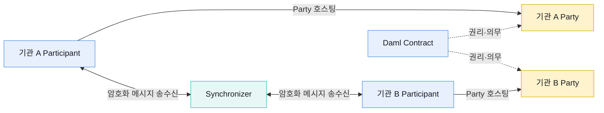
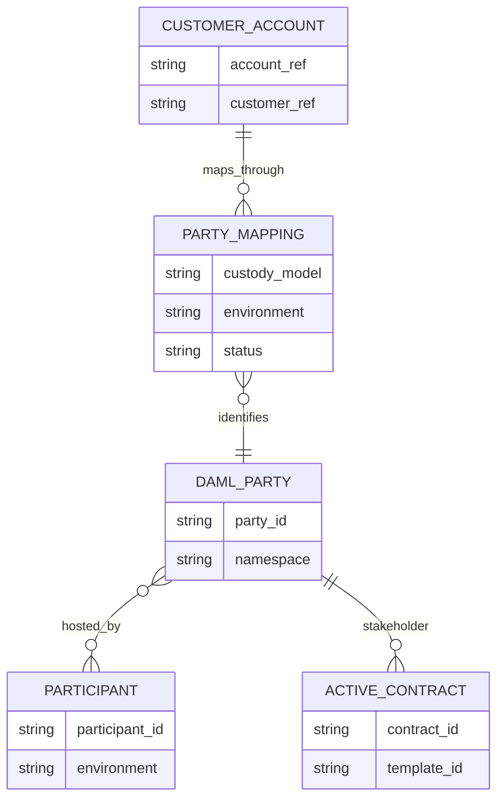
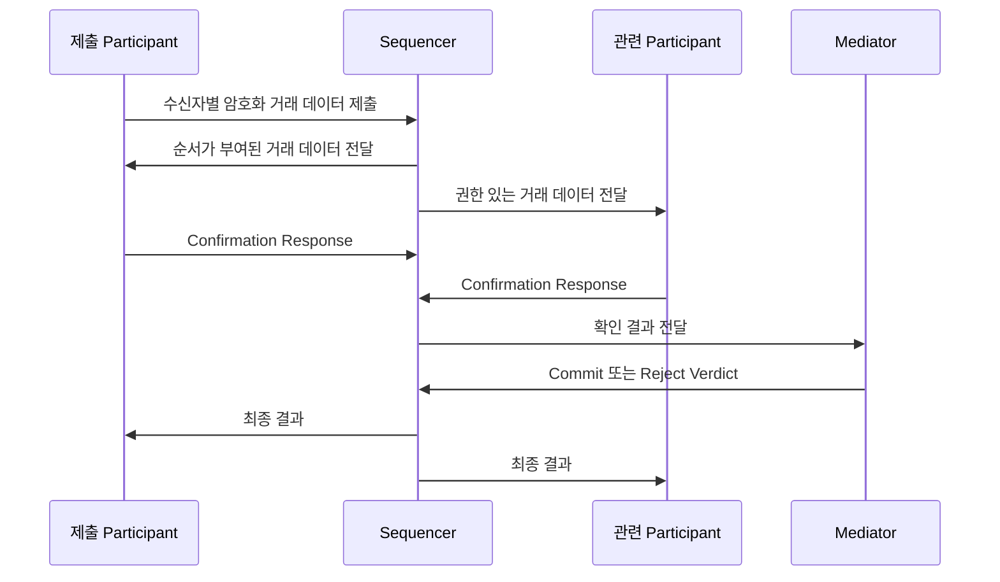
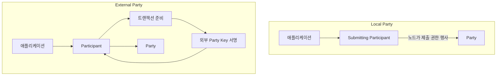

# Party와 노드의 책임

Canton에서 Party는 권리와 의무를 갖는 원장 신원이고, Participant는 Party의 Contract를 저장·검증하는 노드다. Synchronizer는 서로 다른 Participant 사이에서 메시지 순서와 판정 결과를 조정한다.

- **원장 신원:** Party
- **Contract 저장·검증:** Participant
- **메시지 순서·판정 조정:** Synchronizer

이 세 가지를 고객 계정이나 서버 한 대와 일대일로 대응시키면 설계가 금방 꼬인다. Party는 업무 신원이고, Participant는 여러 Party를 호스팅할 수 있으며, 하나의 Party도 필요에 따라 여러 Participant에서 호스팅할 수 있다.

## Party·Participant·Synchronizer의 관계

| 구성요소 | 역할 | 하지 않는 일 |
|---|---|---|
| Party | Contract의 권리·의무·가시성을 갖는 원장 신원 | 고객 로그인이나 지갑 주소 그 자체가 아님 |
| Participant | Party를 호스팅하고 관련 Contract를 저장·실행·검증 | 고객 KYC나 내부 원장을 대신 관리하지 않음 |
| Synchronizer | 암호화된 메시지의 순서와 확인 결과를 조정 | 모든 업무 데이터와 자산을 보관하지 않음 |
| Daml Contract | 데이터와 허용된 행동을 함께 표현 | 필드를 제자리에서 수정하지 않음 |

## Party는 고객 계정이 아니다

기관 A라는 Party가 있다고 해서 내부 고객 계정 하나와 반드시 대응하는 것은 아니다. 상품에 따라 고객별 Party를 둘 수도 있고, 여러 고객이 하나의 omnibus Party를 함께 사용할 수도 있다.

고객 이메일이나 내부 계정 번호를 Party ID로 직접 사용하지 않는다. 고객은 탈퇴·병합·이관될 수 있지만 Party는 과거 Contract와 감사 기록에 계속 남는다. 내부 식별자와 Party ID 사이에 명시적인 매핑과 상태를 둬야 한다.

Party ID는 사람이 구분하기 위한 hint와 암호학적 namespace를 포함한다. 주소처럼 입금마다 새로 만드는 식별자가 아니라 네트워크에서 권한을 행사하는 비교적 안정적인 신원으로 다룬다.

## Participant의 책임

Participant는 자신이 호스팅하는 Party를 대신해 원장과 상호작용한다.

- Daml 명령을 해석하고 Contract 생성·Choice 실행을 처리한다.
- 호스팅 Party에게 공개된 활성 Contract를 저장한다.
- 제출 권한, 입력 Contract의 활성 여부, 원장 효과를 검증한다.
- Synchronizer와 연결해 Party별로 허용된 암호화 거래 데이터를 주고받는다.
- Ledger API로 명령, Contract 조회, Update Stream을 제공한다.

Participant가 가진 것은 전체 네트워크 사본이 아니다. 자신이 호스팅하는 Party와 관련된 private contract state다. 같은 API를 호출해도 어떤 Party 권한으로 조회하느냐에 따라 결과가 달라진다.

반대로 고객 가용 잔액, 출금 한도, KYC 상태, 컴플라이언스 결정은 우리 업무 시스템의 책임이다. Participant의 성공 응답만으로 고객 출금을 승인하지 않는다.

## Validator와 Participant의 범위

운영 문서에서는 `Validator`와 `Participant`가 함께 등장한다. Validator는 Canton Network 참여에 필요한 Participant와 주변 API·앱 서비스를 묶은 배포·운영 구성에 가깝고, Participant는 원장을 실행하고 Party를 호스팅하는 핵심 노드다.

| 관점 | Validator | Participant |
|---|---|---|
| 범위 | 네트워크 참여를 위한 운영 묶음 | 원장 실행·검증 노드 |
| 장애 확인 | 배포 서비스, Wallet·Scan API, ingress, 연결 상태 | Ledger API, DB, ACS, Command·Update 처리 |
| 운영 선택 | 자체 운영 또는 서비스 사업자 이용 | Validator 구성 안에서 호스팅·관리 |

제품이나 배포판에 따라 경계가 달라질 수 있으므로 장애 보고에는 “Validator 장애”라고만 쓰지 않는다. 어떤 API, Participant, DB, Synchronizer 연결에서 문제가 났는지 구체적으로 기록한다.

## Synchronizer 내부 구성

Synchronizer는 Participant가 보낸 업무 명령을 대신 실행하지 않는다. 크게 Sequencer와 Mediator가 메시지 순서와 최종 판정을 조정한다.

Sequencer는 인증된 메시지에 순서와 시각을 부여해 지정된 수신자에게 전달한다. 메시지 내용은 프로토콜 계층에서 암호화된다. Mediator는 필요한 Participant의 확인을 모아 기한 안에 Commit 또는 Reject 판정을 만든다.

Synchronizer를 신뢰할 필요가 전혀 없다는 뜻은 아니다. 순서 일관성, 가용성, 검열 저항, 올바른 판정 전달에는 운영·거버넌스 신뢰가 남는다. 다만 거래 원문을 모두 공개해야만 이 역할을 수행하는 구조는 아니다.

## Party 호스팅 권한

Participant의 호스팅 권한은 한 덩어리가 아니다.

| 권한 | 의미 | 운영상 판단 |
|---|---|---|
| Observing | 관련 상태를 기록하고 조회를 제공 | 감사·조회 복제에 활용 가능 |
| Confirming | 유효한 트랜잭션에 확인 응답 | 다중 호스팅과 Threshold 설계에 영향 |
| Submitting | Party를 대신해 명령 제출 | Party 행동을 시작할 수 있는 강한 권한 |

확인 Participant의 Threshold를 높이면 한 노드의 손상에 강해질 수 있지만 더 많은 노드가 동시에 정상이어야 한다. 보안만 보고 숫자를 정하지 말고 RTO·RPO와 장애 복구 방식까지 함께 정한다.

## Local Party와 External Party

Party의 서명 권한을 누가 보유하는지도 나눠서 본다.

- Local Party는 Participant가 Party를 대신해 명령을 제출한다. 자동화는 단순하지만 호스팅 노드를 강하게 신뢰한다.
- External Party는 독립된 키로 제출 권한을 통제한다. Participant가 트랜잭션을 준비해도 외부 키 소유자의 서명이 필요하다.

Fireblocks 같은 외부 Signer를 쓴다고 잘못된 거래가 자동으로 차단되는 것은 아니다. 키가 Participant 밖에 있어도 서명 전에 Party, 자산, 금액, 상대, 생성·소비될 Contract를 독립적으로 검증해야 한다.

## 환경별 식별자

같은 이름의 Party나 Package라도 DevNet, TestNet, MainNet에서는 다른 대상이다.

- Party·Participant·Synchronizer ID를 환경과 함께 저장한다.
- 환경 사이에 Signing Key와 API Credential을 재사용하지 않는다.
- Daml Package Version과 Node Release의 호환성을 배포 전에 확인한다.
- DevNet 변경을 확인하고 TestNet 회귀를 거친 뒤 MainNet에 반영한다.
- Party 호스팅과 Topology 변경은 승인·감사 대상 작업으로 다룬다.

## 운영 확인 항목

- [ ] 고객 계정과 Party ID의 생성·정지·이관 관계를 조회할 수 있다.
- [ ] Party별 호스팅 Participant와 Observing·Confirming·Submitting 권한을 확인할 수 있다.
- [ ] Participant DB 복구 뒤 활성 Contract와 Update Offset의 정합성을 검사한다.
- [ ] Participant API 장애와 Synchronizer 연결 장애를 별도 경보로 구분한다.
- [ ] Party 추가 호스팅·이관 시 Key와 Topology 승인 절차가 있다.
- [ ] Local·External Party 선택이 상품별 서명 책임과 일치한다.
