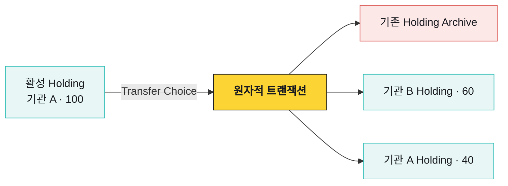
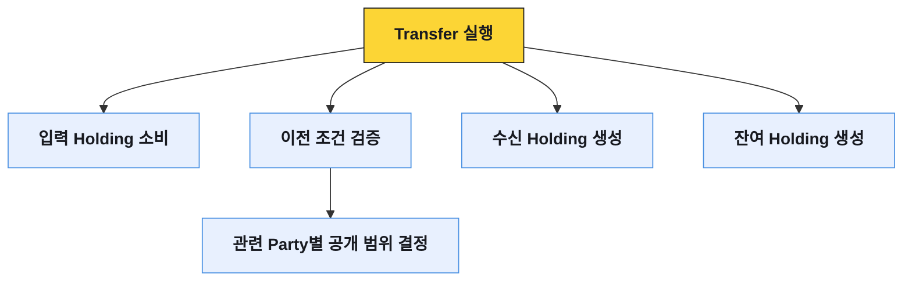

# Daml Contract와 원장 상태

Participant는 자신이 호스팅하는 Party에 공개된 Daml Contract를 저장한다. Canton 원장의 현재 상태는 주소별 잔액 테이블이 아니라 소비되지 않은 활성 Contract의 집합으로 표현된다.

Daml은 업무 데이터를 담는 **Template**과 그 데이터에 허용된 행동인 **Choice**를 함께 정의한다. 누가 Contract를 보고, 누가 Choice를 실행하며, 실행 결과 어떤 Contract가 없어지고 생기는지가 모델에 들어간다.

## Template은 데이터와 규칙을 묶는다

아래 예시는 기관이 보유한 자산을 단순화한 모델이다.

```daml
template Holding
  with
    owner      : Party
    issuer     : Party
    instrument : Text
    amount     : Decimal
  where
    signatory issuer
    observer owner

    choice Transfer : (ContractId Holding, Optional (ContractId Holding))
      with
        newOwner      : Party
        transferAmount : Decimal
      controller owner
      do
        assertMsg "invalid transfer amount"
          (transferAmount > 0.0 && transferAmount <= amount)
        receiverCid <- create this with
          owner = newOwner
          amount = transferAmount
        changeCid <-
          if transferAmount < amount
            then do
              cid <- create this with amount = amount - transferAmount
              pure (Some cid)
            else pure None
        pure (receiverCid, changeCid)
```

`Holding`은 데이터 구조만 정의하지 않는다. `issuer`가 Contract의 Signatory이고 `owner`가 Observer이자 `Transfer`의 Controller라는 점까지 포함한다. 위 예시에서 100 중 60을 이전하면 수신자 Holding 60과 송신자 잔여 Holding 40을 생성한다. 실제 Canton Token Standard의 Template과 Choice는 이 예시보다 복잡하다.

## Contract는 제자리에서 바뀌지 않는다

Daml Contract는 생성된 뒤 필드를 수정하지 않는다. 기본값인 consuming Choice를 실행하면 기존 Contract를 소비해 Archive하고 필요한 새 Contract를 생성한다. `nonconsuming` Choice는 실행 후에도 기존 Contract를 활성 상태로 유지한다.



이 모델에서는 “잔액 100을 40으로 수정했다”가 아니라 다음 원장 효과가 남는다.

1. 기관 A의 기존 Holding 100을 소비했다.
2. 기관 B의 Holding 60을 만들었다.
3. 기관 A의 잔여 Holding 40을 만들었다.

여러 생성과 소비가 하나의 Daml 트랜잭션에 들어가면 전체가 함께 Commit되거나 함께 Reject된다.

### Daml Contract 상태 전이

기존 Holding이 수정되는 것이 아니라 Archive되고 두 개의 새 Holding으로 교체되는 과정을 단계별로 확인할 수 있다.

```anim
canton-contract-transition
```

## ACS가 현재 상태다

ACS(Active Contract Set)는 현재 소비되지 않고 살아 있는 Contract의 집합이다. 과거에 존재했지만 Archive된 Contract는 이력에는 남아도 현재 보유 자산을 구성하지 않는다.

| 데이터 | 무엇을 알려주는가 | 사용할 때 주의할 점 |
|---|---|---|
| ACS Snapshot | 특정 시점에 활성인 Contract | Snapshot 중 발생한 Update와 경계를 맞춰야 함 |
| Update Stream | 생성·Choice 실행·Archive의 순서 | Offset을 저장하고 재연결 시 이어 읽어야 함 |
| Transaction Tree | 한 명령이 만든 하위 원장 효과 | 호출 Party에게 허용된 View만 보임 |
| Contract Lookup | 특정 Contract의 현재 상태 | Archive와 조회 권한 없음은 다른 상황임 |

## 트랜잭션은 행동의 트리다

Daml 트랜잭션은 단순한 전후 상태 차이가 아니라 어떤 Choice가 어떤 하위 Choice를 호출하고, 어떤 Contract를 소비·생성했는지 보여주는 트리다.



Prepared Transaction은 단순한 전송 문구가 아니라 실행할 Choice와 Contract의 생성·소비 효과를 포함한다.

## Contract Key와 동시성

Contract Key는 업무상 고유한 Contract를 찾는 데 사용할 수 있다. 그러나 데이터베이스의 단순 Unique Key처럼만 생각하면 안 된다. Key 조회와 Contract 소비 역시 Party 권한과 원장 동시성 안에서 처리된다.

같은 Holding을 두 거래가 동시에 선택하면 둘 다 준비 단계까지 갈 수 있어도 같은 입력 Contract를 최종적으로 두 번 소비할 수는 없다. 하나가 먼저 Commit되면 다른 하나는 비활성 입력을 사용한 거래로 Reject된다.

## 원장 시간과 업무 시간

Daml은 유효 시간 범위처럼 원장 검증에 필요한 시간 조건을 다룬다. 고객 요청 시각, 승인 만료, 외부 Signer 응답 시간과 운영 SLA는 원장 시간과 별개의 개념이다.
