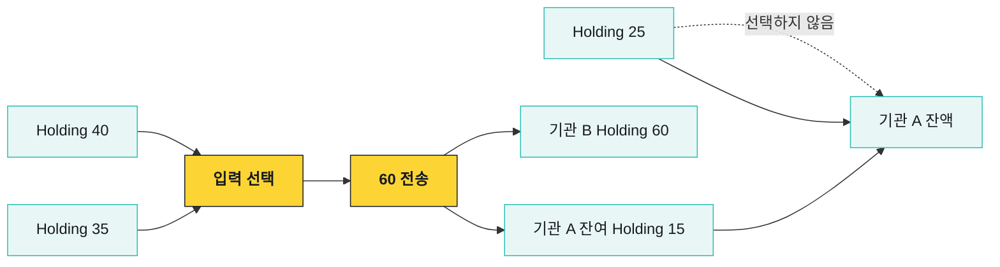
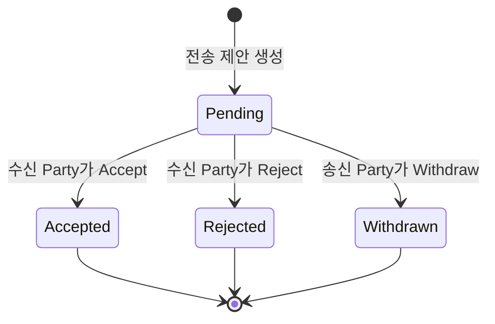
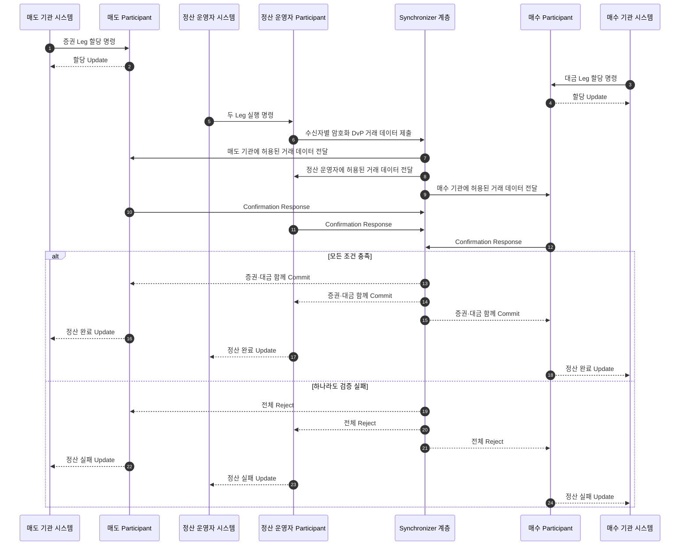

# Holding 기반 자산 이동

Canton Token Standard에서 잔액은 주소에 적힌 숫자 하나가 아니다. Party가 소유한 활성 `Holding` Contract들의 합이다. 자산을 보낼 때는 필요한 Holding을 선택해 소비하고, 수신자와 송신자의 잔여분을 나타내는 새 Holding을 만든다.

## 잔액은 Holding의 합이다

기관 A가 40, 35, 25 단위의 Holding 세 개를 갖고 있고 기관 B에게 60을 보낸다고 하자.



전송 전 기관 A의 잔액은 100이다. 40과 35를 입력으로 선택해 75를 소비하고, 기관 B에게 60을 주는 Holding과 기관 A에게 15를 돌려주는 Holding을 함께 만든다. 선택하지 않은 25까지 합치면 기관 A의 새 잔액은 40이다.

## 전송 상태와 수신자 수락

자산과 수신 관계에 따라 전송은 수신자의 수락을 기다릴 수 있다. 송신 Party가 Transfer Instruction을 만들면 Pending 상태가 되고, 수신 Party가 Accept하거나 Reject할 수 있다. 송신자는 수락 전에 제안을 Withdraw할 수 있다.



Withdraw는 완료된 전송을 되돌리는 기능이 아니다. 이미 완료된 자산을 반환하려면 반대 방향의 새 전송을 만들어야 한다. 사전 승인(Pre-approval)이 있는 경로는 별도 사용자 수락 없이 완료될 수 있지만, 대상 Party·자산·승인 범위·유효기간을 확인해야 한다.

`OFFER`, `ACCEPT`, `REJECT`, `WITHDRAW` 같은 API 표현은 특정 Token Implementation과 Wallet API에 따라 달라질 수 있다.

## DvP 원자적 정산

단순 전송은 한 자산의 소유자를 바꾼다. DvP(Delivery versus Payment)는 증권과 대금처럼 서로 다른 두 자산 다리를 한 트랜잭션으로 교환한다.



정산 운영자 시스템은 자신의 Participant를 통해 실행 명령을 제출한다. Synchronizer가 Settlement를 생성하거나 Daml 명령을 직접 실행하지 않는다. 실행 트랜잭션이 두 다리를 함께 소비·생성하므로 한쪽 자산만 넘어간 중간 결과를 만들지 않는다.

실제 Choice 이름과 제안·할당 단계는 사용하는 정산 Package에 따라 달라진다. 중요한 것은 “6단계 API를 호출했다”가 아니라 마지막 트랜잭션의 원장 효과가 두 자산 다리를 함께 포함하는지 확인하는 것이다.

### DvP 정산 상태 전이

제안과 수락만으로는 자산이 움직이지 않는다. 두 Leg가 모두 잠긴 뒤 마지막 실행에서 함께 이동하는 지점을 단계별로 볼 수 있다.

```anim
canton-dvp
```

## 거래 확정 구간

Canton 거래 지연을 “몇 Confirmation”으로 설명하지 않는다. 서로 다른 대기 구간이 있다.

- Participant가 명령을 준비하고 접수하는 시간
- 외부 정책 승인과 서명 시간
- Sequencer가 View를 전달하는 시간
- 관련 Participant가 검증·확인하는 시간
- Mediator가 Verdict를 내리는 시간
- Token workflow가 수신자 수락을 요구할 때 Accept 대기 시간

## Traffic

Synchronizer 메시지를 보내려면 Participant의 Traffic 잔고가 필요하다. 잔고가 부족하면 Contract와 권한이 정상이어도 새 거래 제출이 멈출 수 있다.
