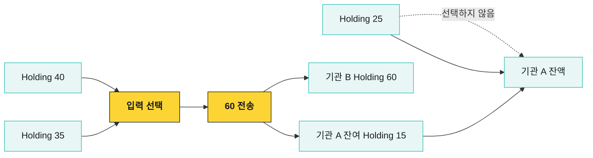
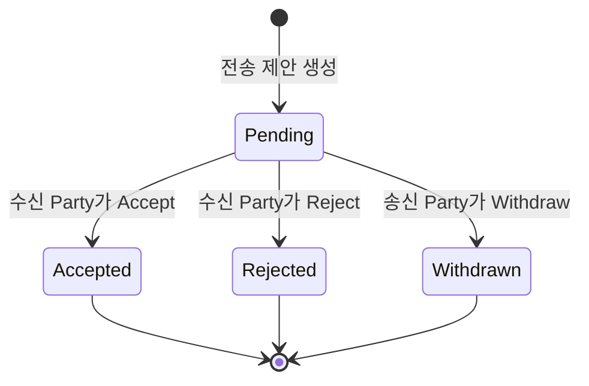
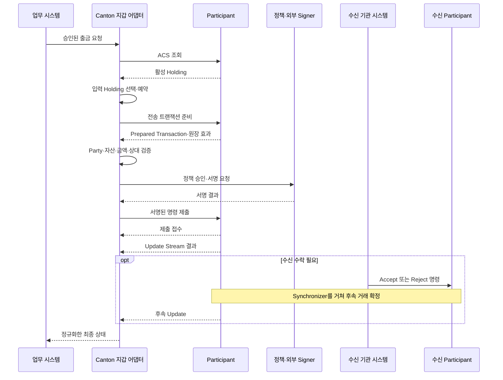
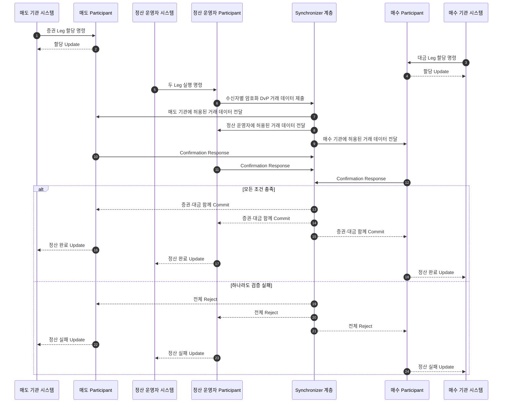

# Holding 기반 자산 이동

Canton Token Standard에서 잔액은 주소에 적힌 숫자 하나가 아니다. Party가 소유한 활성 `Holding` Contract들의 합이다. 자산을 보낼 때는 필요한 Holding을 선택해 소비하고, 수신자와 송신자의 잔여분을 나타내는 새 Holding을 만든다.

## 잔액은 Holding의 합이다

기관 A가 40, 35, 25 단위의 Holding 세 개를 갖고 있고 기관 B에게 60을 보낸다고 하자.



전송 전 기관 A의 잔액은 100이다. 40과 35를 입력으로 선택해 75를 소비하고, 기관 B에게 60을 주는 Holding과 기관 A에게 15를 돌려주는 Holding을 함께 만든다. 선택하지 않은 25까지 합치면 기관 A의 새 잔액은 40이다.

따라서 출금 준비기는 `잔액 ≥ 출금액`만 확인해서는 안 된다.

- 실제로 사용할 Holding Contract ID를 선택한다.
- 다른 출금이 같은 Holding을 고르지 않도록 예약한다.
- 거절·만료 시 예약을 해제하고 최신 ACS를 다시 확인한다.
- 작은 Holding이 지나치게 쌓이면 병합 비용과 기준을 관리한다.

## 전송 상태와 수신자 수락

자산과 수신 관계에 따라 전송은 수신자의 수락을 기다릴 수 있다. 송신 Party가 Transfer Instruction을 만들면 Pending 상태가 되고, 수신 Party가 Accept하거나 Reject할 수 있다. 송신자는 수락 전에 제안을 Withdraw할 수 있다.



Withdraw는 완료된 전송을 되돌리는 기능이 아니다. 이미 완료된 자산을 반환하려면 반대 방향의 새 전송을 만들어야 한다. 사전 승인(Pre-approval)이 있는 경로는 별도 사용자 수락 없이 완료될 수 있지만, 대상 Party·자산·승인 범위·유효기간을 확인해야 한다.

API에 `OFFER`, `ACCEPT`, `REJECT`, `WITHDRAW` 같은 이름이 보이더라도 모든 Canton 토큰이 같은 상태 Enum을 사용한다고 가정하지 않는다. 표준의 개념, 특정 Token Implementation, Wallet API의 표현을 구분해 저장한다.

## 한 건의 전송 흐름



Participant의 동기 응답은 명령을 접수했다는 뜻일 수 있다. 고객 업무를 완료로 바꾸는 시점은 Update Stream에서 의도한 Contract 생성·소비와 필요한 수락 상태를 확인한 뒤다.

## 우리 시스템의 공통 상태

우리 시스템에서는 원장의 원문 상태를 버리지 않으면서 고객 업무에 필요한 공통 상태를 별도로 둔다.

| 공통 상태 | 원장·업무 상황 | 고객 처리 |
|---|---|---|
| `PREPARING` | Holding 선택·트랜잭션 준비 | 출금액 잠금, 제출 전 |
| `SIGNING` | 정책 승인·외부 서명 대기 | 승인 취소·만료 정책 적용 |
| `SUBMITTED` | Participant가 명령 접수 | Update 결과 추적 |
| `PENDING_ACCEPTANCE` | 수신 Party의 결정 대기 | 완료로 보지 않음 |
| `COMPLETED` | 새 Holding과 입력 Archive 확인 | 내부 원장 확정·대사 |
| `REJECTED` | 검증·Mediator·수신자 거절 | 예약·잠금 해제, 사유 기록 |
| `WITHDRAWN` | Pending 제안을 송신자가 철회 | 입력 Holding 복원 확인 |

Timeout과 Reject도 구분한다. API Timeout은 결과를 모른다는 뜻이지 원장에서 실패했다는 증거가 아니다. Command ID와 Update를 조회해 결과를 확인한 뒤 재시도 여부를 결정한다.

## 입금 귀속 정보

고객별 Party를 사용하는 경우 새 Holding의 Owner Party로 귀속 대상을 좁힐 수 있다. 하나의 omnibus Party가 여러 고객의 자산을 받는다면 Transfer metadata에 고객 귀속용 식별자를 함께 전달해야 한다. 우리 시스템에서는 이 값을 `Deposit Reference`로 정규화한다.

| 모델 | 귀속 방법 | 주요 위험 |
|---|---|---|
| 고객별 Party | Owner Party와 고객 매핑 | Party·Key·호스팅 수명주기 증가 |
| Omnibus Party | Party + Deposit Reference + 내부 배분 | metadata 누락·오류와 공동 가시성 |

Canton Network Token Standard 연동에서는 Transfer specification metadata의 `splice.lfdecentralizedtrust.org/reason` 값을 Deposit Reference의 원천으로 사용한다. 특정 Token Implementation이나 Wallet API가 다른 metadata 규칙을 사용한다면 원문 키와 값을 함께 보존한다.

입금 처리에서는 Transfer Instruction Contract ID, Holding Contract ID, Owner Party, Instrument ID, 금액, Deposit Reference를 함께 대조한다. 귀속 식별자가 없거나 고객 매핑이 모호하면 자동으로 가용 잔액에 반영하지 않는다.

## DvP 원자적 정산

단순 전송은 한 자산의 소유자를 바꾼다. DvP(Delivery versus Payment)는 증권과 대금처럼 서로 다른 두 자산 다리를 한 트랜잭션으로 교환한다.



정산 운영자 시스템은 자신의 Participant를 통해 실행 명령을 제출한다. Synchronizer가 Settlement를 생성하거나 Daml 명령을 직접 실행하지 않는다. 실행 트랜잭션이 두 다리를 함께 소비·생성하므로 한쪽 자산만 넘어간 중간 결과를 만들지 않는다.

실제 Choice 이름과 제안·할당 단계는 사용하는 정산 Package에 따라 달라진다. 중요한 것은 “6단계 API를 호출했다”가 아니라 마지막 트랜잭션의 원장 효과가 두 자산 다리를 함께 포함하는지 확인하는 것이다.

### DvP 정산 상태 전이

제안과 수락만으로는 자산이 움직이지 않는다. 두 Leg가 모두 잠긴 뒤 마지막 실행에서 함께 이동하는 지점을 단계별로 볼 수 있다.

```anim
canton-dvp
```

## 거래 확정 구간

Canton 거래 지연을 “몇 Confirmation”으로 설명하지 않는다. 서로 다른 대기 구간이 있다.

- Participant가 명령을 준비하고 접수하는 시간
- 외부 정책 승인과 서명 시간
- Sequencer가 View를 전달하는 시간
- 관련 Participant가 검증·확인하는 시간
- Mediator가 Verdict를 내리는 시간
- Token workflow가 수신자 수락을 요구할 때 Accept 대기 시간

각 단계의 Timestamp와 Timeout을 따로 기록해야 어디서 지연됐는지 설명할 수 있다.

## Traffic 운영

Synchronizer 메시지를 보내려면 Participant의 Traffic 잔고가 필요하다. 잔고가 부족하면 Contract와 권한이 정상이어도 새 거래 제출이 멈출 수 있다.

| 감시 항목 | 확인 이유 |
|---|---|
| Traffic 잔고 | 제출 중단을 사전에 감지 |
| 자동 Top-up 결과 | 결제·설정 오류 확인 |
| 업무별 사용량 | 수신 범위가 넓은 거래와 이상 증가 분석 |
| 구매 상한·간격 | 과도한 자동 구매와 급격한 소진 통제 |

가격, 무료 할당량, 충전 방식은 환경과 네트워크 정책에 따라 바뀔 수 있으므로 애플리케이션 코드에 고정하지 않는다.

## 자산 흐름 점검

- [ ] 활성 Holding만 잔액에 포함한다.
- [ ] 출금별 입력 Contract ID와 예약 상태를 기록한다.
- [ ] 같은 Holding을 동시에 고른 요청을 준비 단계와 원장 단계에서 모두 처리한다.
- [ ] Pending 전송의 Accept·Reject·Withdraw 권한과 만료 정책이 있다.
- [ ] 동기 API 응답과 원장 완료 상태를 구분한다.
- [ ] 완료 후 반환은 원 거래 취소가 아니라 새 전송으로 연결한다.
- [ ] DvP는 모든 Leg가 같은 원장 결과에 포함됐는지 검증한다.
