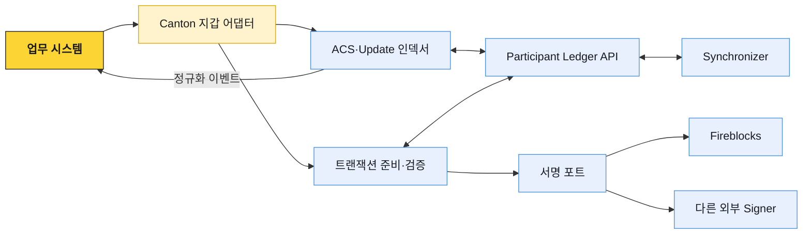
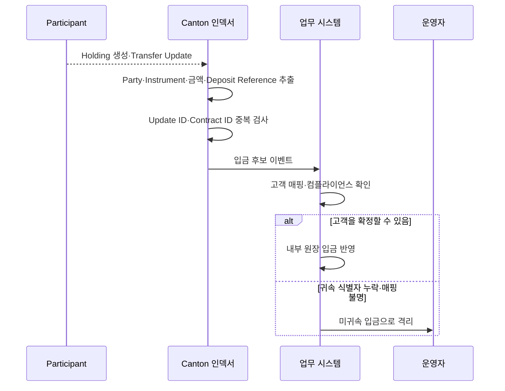
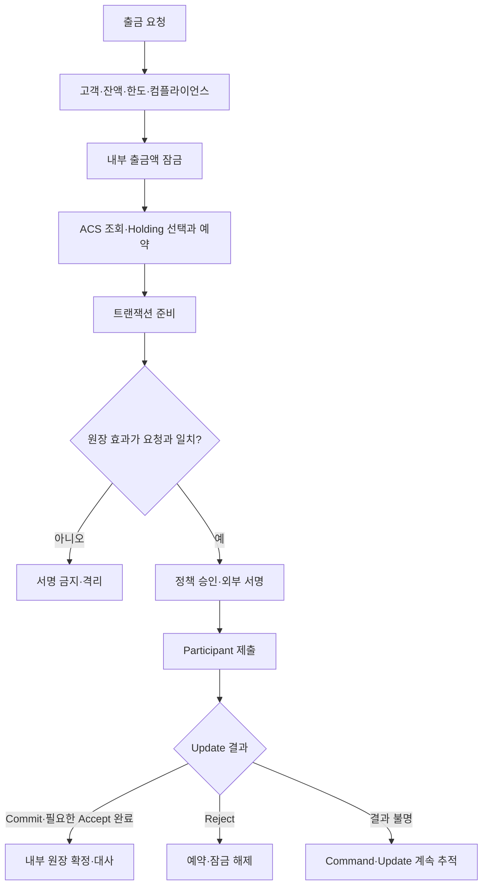

# Canton과 우리 입출금 시스템의 연결

Canton 연동은 코인 전송 API를 하나 추가하는 작업이 아니다. 우리 고객 계정과 Party를 연결하고, 활성 Holding에서 사용할 입력을 고르고, 준비된 Daml 트랜잭션의 원장 효과를 검증해 서명한 뒤, Update 결과를 내부 원장에 반영해야 한다.

이 문서의 지갑 어댑터, 인덱서, 내부 상태와 대사 절차는 우리 시스템의 연동 기준이다. Participant, Synchronizer, Daml Contract의 동작은 Canton 프로토콜 개념과 구분한다.

Canton의 원장 개념과 우리 수탁 시스템의 책임은 다음과 같이 대응한다.

| Canton 개념 | 수탁 시스템에서 맡을 일 |
|---|---|
| Party | 고객·계정·지갑과 안정적으로 매핑 |
| ACS·Holding | 입금 탐지, 잔액 계산, 출금 입력 선택 |
| Prepared Transaction | 승인된 업무 요청과 원장 효과 비교 |
| Update Stream | 입출금 결과를 중복 없이 반영 |
| Participant | 명령·조회·원장 검증 연결점 |
| External Party Key | 정책 승인과 외부 서명 연동 |

## 시스템 경계

업무 시스템은 고객 상태, 내부 잔액, 출금 승인과 컴플라이언스의 정본이다. Participant는 Daml 원장 상태의 정본이다. Signer는 승인된 트랜잭션에 키 권한을 행사한다. 세 시스템의 성공을 하나의 상태로 합치지 않는다.

정책 승인이 끝났어도 원장 검증은 실패할 수 있고, 원장 Commit이 끝났어도 고객 귀속과 내부 대사가 끝나지 않았을 수 있다.

## Party 운영 모델

상품별로 고객과 Party의 관계를 결정한다.

| 모델 | 장점 | 비용과 위험 |
|---|---|---|
| 고객 계정당 Party | 귀속과 프라이버시 경계가 명확 | Party·Key·호스팅 수명주기 증가 |
| 고객 지갑당 Party | 상품·지갑 분리가 쉬움 | 한 고객의 Party가 늘고 통합 조회 필요 |
| Omnibus Party + Deposit Reference | Party 운영 수가 적음 | Transfer metadata 오류, 내부 배분, 공동 가시성 통제가 중요 |

Party는 입금 주소처럼 매번 새로 만들지 않는다. 비교적 안정적인 업무 신원으로 재사용한다. Party를 정지하거나 다른 Participant로 이관해도 과거 Contract와 거래가 어느 고객에게 속했는지 추적할 수 있어야 한다.

최소 매핑 정보는 다음과 같다.

- Customer Ref와 Account Ref
- Party ID와 Participant ID
- Network Environment
- Custody Model과 Signing Model
- 상태, 생성 시각, 정지·이관 이력

## 입금은 Update 탐지에서 시작한다

퍼블릭 체인 입금처럼 새 블록에서 주소를 찾는 방식이 아니다. 우리 Party 권한으로 Update Stream을 읽고 새 Holding과 관련 Transfer Instruction을 해석한다.

입금 후보를 고객 가용 잔액으로 바꾸기 전에 다음 값이 함께 맞아야 한다.

- Owner Party와 고객·계정 매핑
- Instrument ID와 지원 자산 설정
- Holding Amount와 업무 금액 단위
- Transfer Instruction Contract ID와 Holding Contract ID
- Omnibus 모델이라면 Transfer metadata의 Deposit Reference와 예상 입금 정보
- Token workflow가 수신자 수락을 요구한다면 Accept 상태와 컴플라이언스 결과

Canton Network Token Standard의 `splice.lfdecentralizedtrust.org/reason` metadata 값을 Deposit Reference의 원천으로 사용한다. 귀속 식별자가 없거나 잘못된 입금은 자동 반영하지 않는다. 운영자가 귀속을 수정하더라도 원문 metadata와 Update, 수정 사유, 승인자를 감사 기록으로 남긴다.

## 출금은 준비와 확정을 나눈다

출금 처리 순서는 다음과 같다.

1. 업무 시스템이 고객 상태, 가용 잔액, 한도, 수신 Party, 컴플라이언스를 확인한다.
2. 고객 출금액을 내부 원장에서 잠근다.
3. 지갑 어댑터가 최신 ACS에서 필요한 Holding을 선택하고 예약한다.
4. Participant나 Wallet SDK에 트랜잭션 준비를 요청한다.
5. 준비 결과의 Party, Instrument, 금액, 상대, 시간 조건과 원장 효과를 다시 검증한다.
6. 승인된 업무 요청과 Prepared Transaction Hash를 연결해 Signer에 보낸다.
7. 서명된 명령을 Participant에 제출한다.
8. Update Stream에서 Commit·Reject와 수신 Accept 여부를 추적한다.
9. 의도한 Holding 생성·소비를 확인한 뒤 내부 원장을 확정하고 예약을 종료한다.

제출 응답을 받지 못했다고 즉시 새 명령을 만들면 같은 업무 요청이 중복 실행될 수 있다. 기존 Command ID와 Submission ID의 결과를 먼저 조회하고, 재제출이 필요한 경우에도 업무 멱등 키를 유지한다.

## 서명 전에 원장 효과를 검증한다

외부 Signer는 주어진 값에 키 권한을 행사한다. 서명이 암호학적으로 유효하다는 사실은 그 거래가 고객 요청과 일치한다는 뜻이 아니다.

Prepared Transaction을 다음 순서로 검증한다.

- 신뢰하는 SDK와 고정된 Schema로 응답을 해석한다.
- Root Choice와 하위 Exercise를 확인한다.
- 소비될 입력 Contract와 새로 생길 Contract를 계산한다.
- 송신·수신 Party, Instrument ID, 금액과 잔여분이 요청과 일치하는지 비교한다.
- 예상하지 않은 Observer, Controller, 추가 Signer가 포함되지 않았는지 확인한다.
- Synchronizer와 시간 조건이 허용된 범위인지 확인한다.
- 서명 대상 Hash를 독립적으로 다시 계산해 전달값과 비교한다.
- 승인된 업무 요청 ID와 Hash를 변경 불가능한 감사 기록으로 연결한다.

준비 결과가 바뀌거나 유효 시간이 지나면 기존 승인을 재사용하지 않는다. 트랜잭션을 다시 준비하고 정책 승인과 서명을 다시 받는다.

## Fireblocks를 연결하는 두 방식

Fireblocks는 Canton 연결 전체를 제공하는 서비스로 사용할 수도 있고, 우리가 운영하는 Participant의 외부 Signer로 사용할 수도 있다.

| 구성 | 원장과 키의 경계 | 확인할 내용 |
|---|---|---|
| Fireblocks 관리형 Canton | Fireblocks API와 관리형 Canton 연결 사용 | 지원 Network·Token, Party 모델, API 상태, Webhook, 데이터 접근 범위 |
| 자체 Validator + Fireblocks Signer | 원장 데이터는 우리 환경, 키 정책·서명은 Fireblocks | Signing Provider 연결, Hash 검증, 재시도, Key 복구 |

두 방식은 API 모양만 다른 것이 아니라 장애 책임과 데이터 경계가 다르다. 제품·계약을 확인할 때 “Canton을 지원한다”는 문구만 보지 말고 누가 Participant를 운영하고 Party Key를 통제하는지 확인한다.

Fireblocks Policy와 Canton 검증은 서로 다른 방어선이다. Fireblocks Policy가 허용해도 잘못 준비된 Daml 효과에는 서명하지 않아야 한다. 반대로 기술적으로 유효한 Daml 트랜잭션도 고객 승인·한도·컴플라이언스가 없으면 제출하지 않는다.

## 인덱싱과 대사

업무 DB에는 원장 원문을 대체하기 위한 복제본이 아니라 고객 연결, 검색, 멱등 처리, 대사에 필요한 정보를 저장한다.

| 데이터 | 필드 예시 |
|---|---|
| Party 매핑 | Customer Ref, Account Ref, Party ID, Participant ID, Custody Model |
| Contract 인덱스 | Contract ID, Template ID, Stakeholder, Active, Created·Archived Offset |
| Holding | Instrument ID, Amount, Owner Party, Reservation, Transfer Ref |
| 명령 | Command ID, Submission ID, Prepared Hash, Signer Ref, Status |
| Update | Offset, Update ID, Record Time, Processing Status, Payload Ref |
| 대사 | Snapshot Point, Internal Total, Ledger Total, Difference, Resolved At |

대사는 세 단계로 나눈다.

1. **Contract 수준:** 내부 Active 상태와 ACS의 Contract ID가 일치하는가
2. **Party·Instrument 수준:** 활성 Holding 합계와 내부 수탁 잔액이 일치하는가
3. **고객 수준:** Omnibus 내부 배분 합계와 Party 전체 보유분이 일치하는가

차이가 발견됐을 때 자동으로 잔액을 맞춰 쓰지 않는다. 누락 Update, 중복 처리, 잘못된 고객 매핑, 원장 밖 수동 조정 중 어디서 차이가 났는지 원인을 분류하고 승인된 보정 절차를 따른다.

## 장애를 계층별로 나눈다

| 영역 | 감시할 항목 | 고객 업무에 미치는 영향 |
|---|---|---|
| Participant | Ledger API, DB, Command 오류, ACS 처리 | 명령 준비·제출·조회 지연 |
| Synchronizer 연결 | 연결 상태, Sequenced Event 지연, Traffic | 새 거래 전달·확정 지연 |
| Daml Package | 업로드·Vetting·Version 호환성 | 특정 Template 명령 실패 |
| Topology | Party 호스팅, 권한, Key·Namespace 변경 | 조회·제출·확인 권한 이상 |
| 인덱서 | 마지막 Offset, 재연결, 미처리 Update | 입출금 반영 지연·중복 위험 |
| Signer | 준비-서명 지연, 정책 거절, Hash 불일치 | 출금 제출 중단 |

Ledger API가 잠시 끊겨도 이미 처리한 Update와 내부 상태를 삭제하지 않는다. 복구 뒤 저장한 Offset부터 다시 읽고 멱등하게 반영한다. Participant 연결 성공만으로 밀린 업무가 모두 복구됐다고 판단하지 않고 인덱서가 최신 지점까지 따라잡았는지 확인한다.

## 운영 전 실패 시나리오를 검증한다

- 두 자산 DvP가 함께 Commit하거나 함께 Reject하는지 확인한다.
- 무관한 Party의 ACS와 Update에 거래 상세가 나타나지 않는지 확인한다.
- 같은 Holding을 동시에 소비하는 요청 중 하나만 Commit되는지 확인한다.
- Update Stream을 끊고 재연결해도 입출금이 중복 반영되지 않는지 확인한다.
- Deposit Reference 누락 입금이 고객 가용 잔액으로 자동 반영되지 않는지 확인한다.
- Prepared Transaction의 수신 Party·금액을 변조하면 서명 전 검증이 차단하는지 확인한다.
- Signer 장애 중 우회 제출하지 않고 복구 뒤 안전하게 재개하는지 확인한다.
- Traffic 부족, Package 미Vetting, Participant 장애를 서로 다른 원인으로 식별하는지 확인한다.

PoC에서 측정한 지연시간을 운영 SLA로 그대로 사용하지 않는다. 테스트 결과에는 Network Environment, Node·SDK·Daml Package Version, Party 호스팅 구조, Signer 구성을 함께 기록한다.

## 운영 준비 점검

- [ ] 고객·계정·Party 매핑과 Omnibus Deposit Reference 정책이 정해져 있다.
- [ ] Holding 선택·예약·해제·병합의 동시성 규칙이 있다.
- [ ] Prepared Transaction의 원장 효과를 Signer 앞에서 독립 검증한다.
- [ ] Command·Update·Contract 식별자로 재처리 멱등성을 보장한다.
- [ ] Contract·Party·고객 수준 대사와 차이 해소 절차가 있다.
- [ ] Participant, Synchronizer, Indexer, Signer 장애를 구분해 경보한다.
- [ ] DevNet·TestNet·MainNet의 Party·Key·Credential을 분리한다.
