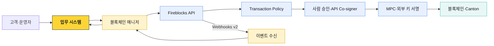

# Fireblocks 업무 구조

Fireblocks는 키 보관 API 하나가 아니라 Workspace 안에서 Vault·자산·거래를 관리하고, 역할·Policy·다중 승인과 MPC 서명을 거쳐 블록체인에 제출하는 운영 플랫폼이다. 우리 시스템은 고객 요청과 내부 원장의 정본을 유지하면서 Fireblocks를 키·정책·체인 실행 계층으로 사용한다.

이 문서 묶음은 별도 표시가 없으면 **Direct Custody**의 Vault·Policy·MPC 모델을 기준으로 한다. Embedded Wallets·Hosted MPC·Key Link처럼 키 구성과 운영 책임이 다른 제품은 해당 문단에서 범위를 구분한다.

## 전체 흐름



Fireblocks transaction이 `COMPLETED`가 되었다고 고객 업무가 자동으로 완료되는 것은 아니다. 블록체인 매니저가 체인과 webhook을 대사하고, 업무 시스템이 고객 잔액·수수료·컴플라이언스·회계 상태를 확정한다.

## 객체 계층

```text
Customer Domain
└─ Workspace
   ├─ 사용자·API 사용자·역할
   ├─ Policy·Admin Quorum·Approval Group
   ├─ MPC 키·Co-signer·감사 로그
   └─ Vault
      └─ Vault Account
         └─ Asset Wallet
            └─ Deposit Address 또는 tag·memo
```

| 객체 | 역할 | 우리 시스템의 매핑 |
|---|---|---|
| Workspace | 사용자·정책·키·감사의 격리 경계 | 법인·환경·운영 모델 |
| Vault Account | 고객·상품·treasury의 자산 운영 단위 | 내부 account ref와 영구 매핑 |
| Asset Wallet | Vault Account 안의 특정 자산 지갑 | vendor asset ID·network·우리 asset ID |
| Deposit Address | 체인 입금 지점 | 고객·계정 귀속과 tag·memo 정책 |
| Transaction | Fireblocks가 추적하는 자산 이동 | 우리 transfer ID와 `externalTxId` 연결 |

## 문서 구성

| 문서 | 다루는 범위 |
|---|---|
| [Workspace·Vault·키](./01-workspace-vault-key-model.md) | 격리 단위, Vault 모델, MPC-CMP, key 배포와 복구 |
| [거래·Policy·승인](./02-transaction-policy-approval.md) | transaction 수명주기, Policy 순서, Quorum과 역할 |
| [API Co-signer](./03-api-cosigner-callback.md) | 자동 서명 구조, Callback Handler, fail-close와 HA |
| [API·Webhooks 운영](./04-api-webhooks-operations.md) | API 인증, 멱등성, webhook 검증·재처리·대사 |
| [Network·컴플라이언스·경계](./05-integrations-and-boundaries.md) | 기관 연결, AML·트래블룰, 책임 분리 |

## 제어 평면을 나눠서 보기

| 제어 평면 | 질문 | 주요 주체 |
|---|---|---|
| 고객 업무 | 이 고객이 이 자산을 보낼 권리와 잔액이 있는가? | 업무 시스템 |
| 컴플라이언스 | 상대·주소·거래가 정책과 규제 요건을 충족하는가? | 컴플라이언스 게이트 |
| 벤더 정책 | 이 initiator·source·destination·amount를 허용할 것인가? | Fireblocks Policy |
| 키 승인 | 지정된 사람·Co-signer가 실제 서명에 참여하는가? | 모바일 signer·API Co-signer·HSM |
| 체인 실행 | nonce·수수료·UTXO·네트워크 상태가 유효한가? | Fireblocks·블록체인 매니저 |
| 회계 확정 | 내부 원장과 체인 결과가 일치하는가? | 업무 시스템·대사 |

각 평면은 다른 평면을 대신하지 않는다. API 인증에 성공했다는 사실은 고객 의사를 증명하지 않고, MPC 서명이 만들어졌다는 사실은 컴플라이언스 통과를 증명하지 않는다.

## 구현 원칙

- Workspace ID, Vault Account ID, asset ID, transaction ID를 내부 식별자와 별도 저장한다.
- API 응답과 webhook을 고객 원장의 단독 정본으로 사용하지 않는다.
- 출금 생성에는 고객 지정 멱등 키와 `externalTxId`를 사용하고 재시도 전에 조회한다.
- Policy 변경과 자동 서명 경로 변경은 코드 배포와 같은 수준으로 검토·승인·감사한다.
- API Co-signer가 있는 운영 경로에는 Callback Handler와 fail-close 정책을 둔다.
- Webhook은 원문 body로 서명을 검증하고 중복·역순·누락을 전제로 처리한다.
- Fireblocks 상태, 체인 상태, 내부 원장을 정기적으로 대사한다.

## 운영 전 질문

- Workspace는 production·test, hot·cold, 법인·상품 경계를 어떻게 나눌 것인가?
- 고객별 Vault와 omnibus Vault 중 어떤 회계·입금 모델을 쓸 것인가?
- 사람 승인과 자동 서명의 대상·한도·시간대를 어떻게 분리할 것인가?
- 누가 Owner이고, 휴가·퇴사·사고 시 어떻게 승계할 것인가?
- API credential, MPC share, backup material을 각각 누가 보관하는가?
- webhook이 끊겨도 체인과 Fireblocks 상태를 어떻게 복구·대사할 것인가?
- Workspace freeze 중에도 들어오는 입금을 누가 감시하고 고객에게 반영할 것인가?
