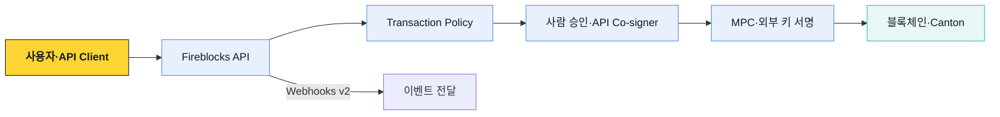

# Fireblocks 업무 구조

Fireblocks는 키 보관 API 하나가 아니라 Workspace 안에서 Vault·자산·거래를 관리하고, 역할·Policy·다중 승인과 MPC 서명을 거쳐 블록체인에 제출하는 운영 플랫폼이다.

이 문서 묶음은 별도 표시가 없으면 **Direct Custody**의 Vault·Policy·MPC 모델을 기준으로 한다. Embedded Wallets·Hosted MPC·Key Link처럼 키 구성과 운영 책임이 다른 제품은 해당 문단에서 범위를 구분한다.

## 전체 흐름



## 객체 계층

```text
Customer Domain
└─ Workspace
   ├─ 사용자·API 사용자·역할
   ├─ Policy·Admin Quorum·Approval Group
   ├─ MPC 키·Co-signer·감사 로그
   └─ Vault
      └─ Vault Account
         └─ Asset Wallet
            └─ Deposit Address 또는 tag·memo
```

| 객체 | 역할 |
|---|---|
| Workspace | 사용자·정책·키·감사의 격리 경계 |
| Vault Account | 고객·상품·treasury의 자산 운영 단위 |
| Asset Wallet | Vault Account 안의 특정 자산 지갑 |
| Deposit Address | 체인 입금 지점 |
| Transaction | Fireblocks가 추적하는 자산 이동 |

## 문서 구성

| 문서 | 다루는 범위 |
|---|---|
| [Workspace·Vault·키](./01-workspace-vault-key-model.md) | 격리 단위, Vault 모델, MPC-CMP와 서명 배포 모델 |
| [거래·Policy·승인](./02-transaction-policy-approval.md) | transaction 수명주기, Policy 순서, Quorum과 역할 |
| [API Co-signer](./03-api-cosigner-callback.md) | 자동 서명 구조와 Callback Handler |
| [API·Webhooks v2](./04-api-webhooks-operations.md) | API 인증과 Webhooks v2 서명 방식 |
| [Network·컴플라이언스·경계](./05-integrations-and-boundaries.md) | 기관 연결과 AML·트래블룰 연동 범위 |
| [Cold Wallet 공개 운영 절차](./06-cold-wallet-operations.md) | 기기 등록, QR 서명, 복구 범위, 규제와 거래소 공개 사례 |
