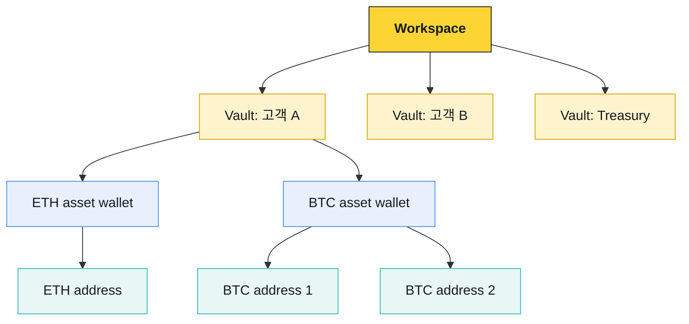
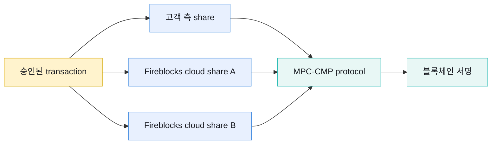

# Workspace와 키 경계

Workspace는 Fireblocks의 사용자·역할·Policy·MPC 키·감사 설정이 묶이는 기본 보안 경계다. Vault Account는 그 안에서 고객·상품·treasury 같은 자산 운영 단위를 표현한다.

## Vault Account 모델

계정 기반 자산은 일반적으로 asset wallet당 하나의 deposit address를 사용하고, UTXO 자산은 여러 주소를 만들 수 있다. 체인·자산별 지원은 다르므로 공통 API가 있다고 해서 주소 모델도 같다고 가정하지 않는다.

## MPC-CMP

MPC는 완전한 개인키 한 개를 평상시에 한 장소에 조립하지 않고 여러 key share가 공동으로 서명을 만든다. Hot 모델에서는 API Co-signer, Warm 모델에서는 온라인 mobile signer, Cold 모델에서는 오프라인 mobile signer가 고객 측 share를 행사한다.

아래 그림은 **Direct Custody의 Fireblocks SaaS MPC** 구성을 나타낸다. Embedded Wallets와 Hosted MPC는 share 수·배치와 고객이 운영하는 구성요소가 다르므로 이 그림을 그대로 적용하지 않는다.

MPC는 키 침해 표면을 분산하지만 거래가 업무상 옳다는 판정은 하지 않는다. Policy, 사람 승인, Callback Handler, 원장 검증이 별도로 필요하다.

## 서명 배포 모델

| 모델 | 서명 키 통제 | 추가 책임 |
|---|---|---|
| Fireblocks SaaS MPC | 고객 측 share와 Fireblocks cloud shares가 공동 서명 | API Co-signer 또는 mobile signer 운영, vendor 의존성 |
| Hosted MPC | 고객 환경의 여러 Co-signer가 key shares를 호스팅 | enclave 배포, HA, patch, backup, 재해복구 |
| Key Link | 고객 HSM key를 Fireblocks 정책·거래 흐름에 연결 | HSM key lifecycle, chain별 지원과 transaction 검증 |

## 네 가지 자격증명

| 자격증명 | 용도 | 같게 취급하면 안 되는 것 |
|---|---|---|
| Console 인증 | 사람이 workspace UI에 접근 | MPC share·API private key |
| API RSA private key | Fireblocks API JWT 요청 서명 | 블록체인 자산 서명 키 |
| MPC key share | 자산 transaction 서명 참여 | API 인증 credential |
| Backup·recovery material | 비상 복구 | 일상 온라인 signer |

API private key가 탈취되면 공격자가 API user 권한으로 요청할 수 있지만 지정 signer와 Policy를 자동으로 우회하는 것은 아니다. 반대로 MPC share가 안전해도 과도한 Policy·자동 승인이 있으면 잘못된 거래가 정상 서명될 수 있다.

## Sandbox 주의

Developer Sandbox의 역할과 자동 승인 동작은 운영 Workspace와 다를 수 있다. Sandbox에서 transaction이 사람 승인 없이 성공했다는 결과는 production Policy·MPC·Co-signer 구조가 검증됐다는 증거가 아니다.
