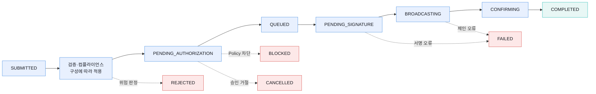
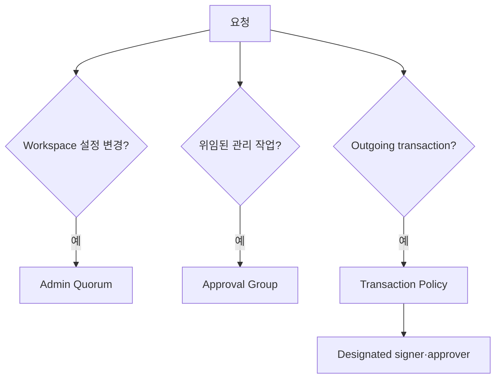

# 거래 수명주기와 승인 통제

Fireblocks transaction은 생성 즉시 블록체인으로 전파되지 않는다. 구성된 기능과 transaction type에 따라 컴플라이언스, Policy, 승인, 서명, broadcast와 confirmation 단계를 거치며 실패 원인도 단계별로 다르다.

## 수명주기

실제 transaction type·자산·네트워크에 따라 건너뛰거나 추가되는 상태가 있다. 상태 문자열만으로 회계를 결정하지 않고 `subStatus`, error, txHash, confirmation과 webhook event를 함께 본다.

| 상태 계열 | 해석 |
|---|---|
| 승인·서명 대기 | 아직 체인에 제출되지 않음 |
| Broadcasting·Confirming | 체인 전파 또는 확정 대기 |
| Completed | Fireblocks의 confirmation 정책 충족 |
| Blocked | Policy rule이 차단 |
| Rejected | 컴플라이언스 또는 외부 판정 거절 가능 |
| Cancelled | 승인·서명·서드파티 단계에서 취소 |
| Failed | 입력·서명·vendor·chain 오류의 넓은 범주 |

## 역할

| 역할 | 관리 | 거래 시작·승인 | MPC 서명 |
|---|---|---|---|
| Owner | 핵심 거버넌스·복구 | 가능 | 가능 |
| Admin | 관리·승인 | 가능 | 가능 |
| Non-Signing Admin | 관리·승인 | 가능 | 불가 |
| Signer | 제한적 | 가능 | 가능 |
| Approver | 제한적 | 시작·승인 | 불가 |
| Editor | 일부 편집 | 조건부 시작 | 불가 |
| Viewer | 조회 | 불가 | 불가 |
| Security Auditor | 보안·정책 감사 조회 | 불가 | 불가 |
| Security Admin | 보안 설정 관리 | 불가 | 불가 |

Workspace 종류, transaction type, Policy designated signer와 Approval Group에 따라 역할별 실제 동작이 달라질 수 있다. API user에도 Owner를 제외한 역할을 부여할 수 있다.

## 세 승인 계층

| 통제 | 보호 대상 | 예시 |
|---|---|---|
| Admin Quorum | Workspace 신뢰 경계·중요 설정 | 사용자·주소·연결·보안 설정 변경 |
| Approval Group | 특정 관리 작업의 승인 주체 | 주소 등록, Policy·사용자 관리 위임 |
| Transaction Policy | 개별 outgoing transaction | source·destination·asset·amount별 허용·승인·차단 |

한 계층을 설정했다고 다른 계층이 자동으로 적용되는 것은 아니다. Policy가 강해도 과도한 Admin 권한이 Policy 자체를 바꿀 수 있고, Admin Quorum이 있어도 transaction의 고액 승인 rule이 없으면 일상 거래 통제는 약하다.

## Policy 평가

[Fireblocks 공식 Policy 안내](https://developers.fireblocks.com/docs/set-transaction-authorization-policy)는 rule을 정의된 순서대로 평가한다고 설명한다. 먼저 일치한 rule이 적용되므로 아래 rule은 평가되지 않는다.
