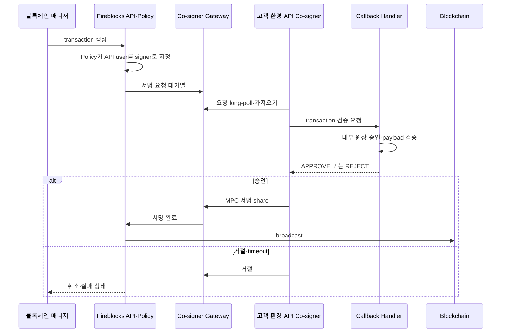
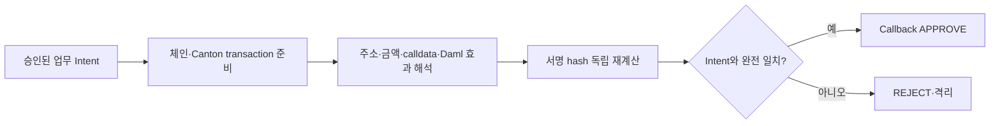

# 자동 서명 경로

API Co-signer는 모바일 사용자의 개입 없이 transaction 서명과 일부 workspace 승인을 자동화하는 고객 호스팅 컴포넌트다. Policy가 Co-signer와 짝지은 API user를 designated signer로 선택하면 서명 요청이 Co-signer로 전달된다.

## 구조

[Fireblocks 공식 Co-signer 구조](https://developers.fireblocks.com/docs/cosigner-architecture-overview)는 Callback Handler가 설정되지 않은 API user의 요청을 Co-signer가 자동 승인·서명한다고 설명한다. 따라서 운영 자동화 경로에서는 Handler 유무 자체가 보안 결정이다.

## Callback Handler의 역할

Handler는 Fireblocks Policy를 복제하는 서버가 아니다. Fireblocks에 없는 우리 업무 맥락과 실제 서명 payload를 마지막으로 검증한다.

| 검증 | 질문 |
|---|---|
| 요청 provenance | transaction ID·`externalTxId`가 우리 시스템이 발행한 활성 요청인가? |
| 업무 상태 | 고객 승인·금액 잠금·컴플라이언스 판정이 아직 유효한가? |
| source | 기대한 Workspace·Vault Account·asset wallet인가? |
| destination | 승인한 주소·tag·network·상대 유형과 일치하는가? |
| value | 자산·금액·수수료 상한이 원 요청과 일치하는가? |
| transaction type | transfer, contract call, raw signing 등 허용한 유형인가? |
| payload meaning | raw message·Canton prepared hash의 원장 효과를 독립 검증했는가? |
| replay | 이미 처리한 callback·transaction을 다시 승인하는가? |

Handler는 조회 API에 의존하더라도 callback body만 보고 승인하지 않는다. 내부 승인 레코드와 비교하고, 그 레코드는 transaction 생성 전에 확정된 불변 요청 해시를 포함해야 한다.

## 인증 채널

[Callback Handler 설정 문서](https://developers.fireblocks.com/docs/create-api-co-signer-callback-handler)는 공개키 기반 signed JWT 방식과 certificate pinning 기반 채널을 설명한다.

| 방식 | 검증 | 운영 주의점 |
|---|---|---|
| Public key | Co-signer 요청 JWT와 Handler 응답 JWT의 서명 검증 | 양측 key rotation, `aud`·`iat`·replay 확인 |
| Certificate pinning | TLS 협상에서 등록 certificate 확인 | 인증서 교체가 장애로 이어지지 않게 사전 등록·runbook 필요 |

Production은 유효한 TLS를 사용하고, network allowlist·private connectivity를 추가하더라도 애플리케이션 계층 인증을 생략하지 않는다. request·response 인증 key를 API JWT key나 업무 DB 암호화 key와 재사용하지 않는다.

## 처리 규칙

1. 원문 요청의 인증·timestamp·replay를 검증한다.
2. transaction ID와 API user를 멱등 키로 inbox에 기록한다.
3. 내부 승인 레코드를 읽고 만료·취소·이미 처리 여부를 확인한다.
4. Fireblocks transaction과 서명 payload를 정규화해 원 요청과 비교한다.
5. 모든 검증을 통과한 경우에만 `APPROVE` 응답을 서명한다.
6. 불일치·미확인·내부 장애는 승인하지 않는다.
7. 결정, 정책 버전, 비교 해시, 지연, 사유를 민감정보 없이 감사 기록으로 남긴다.

Callback 응답 시간에는 상한이 있다. 공식 AML Callback Handler 예시는 30초 안에 응답하지 못하면 transaction이 서명되지 않고 취소된다고 안내한다. 업무 DB나 외부 AML provider의 긴 처리를 Handler 동기 요청 안에 무제한으로 넣지 않는다. 필요한 검사는 transaction 생성 전에 끝내고 Handler는 확정된 결과를 빠르게 재검증한다.

## Fail-close

다음 상황은 승인하지 않는다.

- Callback Handler DB·정책 저장소에 접근할 수 없음
- Fireblocks transaction 조회가 실패해 body를 교차 확인할 수 없음
- 내부 transfer ID가 없거나 중복·취소·만료 상태임
- 주소·자산·금액·transaction type이 조금이라도 다름
- raw signing payload를 해석·재계산할 수 없음
- 인증 서명·certificate·timestamp 검증 실패

`Handler 장애 시 임시 자동 승인`은 자동 서명 통제 전체를 없애는 우회다. 장애 중 필요한 긴급 거래는 별도의 수동 signer·비상 Policy·이중 승인 절차를 사용하고, 정상 경로의 코드를 느슨하게 바꾸지 않는다.

## 고가용성

API Co-signer와 Handler는 함께 가용해야 자동 서명이 된다.

- 지원되는 Co-signer 배포 유형과 버전에서 다중 Co-signer 구성을 검토한다.
- 인스턴스들은 독립 failure domain과 제한된 egress를 사용한다.
- Handler는 stateless 처리와 공용 멱등 inbox를 사용한다.
- Policy의 signer group·API user 구성과 Co-signer pairing 상태를 정기 점검한다.
- 한 Co-signer 장애 때 같은 transaction을 여러 인스턴스가 처리해도 한 결정으로 수렴한다.
- Co-signer software·enclave·callback certificate 업그레이드를 단계적으로 수행한다.

## Raw signing과 Canton

Raw message signing은 Fireblocks가 모든 업무 의미를 이해해 보여준다고 가정할 수 없다. Canton external-party signing도 prepared transaction hash에 서명하지만, signer 앞에서 Daml 원장 효과를 확인해야 한다.

Allowlist에 있는 contract나 Party라는 이유만으로 임의 calldata·choice에 서명하지 않는다. method selector, argument, contract state, Daml template·choice와 예상 결과를 검증한다.

## 관측과 감사

| 지표 | 경보 |
|---|---|
| Callback 요청 수·승인·거절률 | 평소와 다른 승인률·급격한 요청 증가 |
| p50·p95·timeout | 응답 상한 접근, 연속 timeout |
| transaction 불일치 | source·destination·amount·payload mismatch 즉시 경보 |
| 인증 실패 | 잘못된 JWT·certificate·replay 연속 발생 |
| pairing 상태 | API user가 예상 Co-signer와 분리·재연결됨 |
| Policy 매칭 | 자동화 거래가 예상하지 않은 signer rule에 매칭됨 |

Handler 로그에는 전체 주소·payload·JWT·PII를 남기지 않는다. transaction ID, 내부 transfer ID, 해시, 결정 코드로 양방향 추적하고 원문은 권한이 제한된 저장소에서만 조회한다.

## 배포 점검

- [ ] 운영 자동 서명 API user 모두 Callback Handler가 설정돼 있다.
- [ ] Handler 요청·응답 인증과 key·certificate rotation을 시험했다.
- [ ] 내부 장애·조회 실패·payload 미해석 시 fail-close한다.
- [ ] 동일 callback 재전송이 같은 결정으로 수렴한다.
- [ ] Handler 응답 제한 안에 처리하고 장기 검사는 사전에 완료한다.
- [ ] Raw signing·Canton payload를 업무 Intent와 독립 대조한다.
- [ ] Co-signer·Handler 장애 시 수동 비상 절차가 자동 우회와 분리돼 있다.
