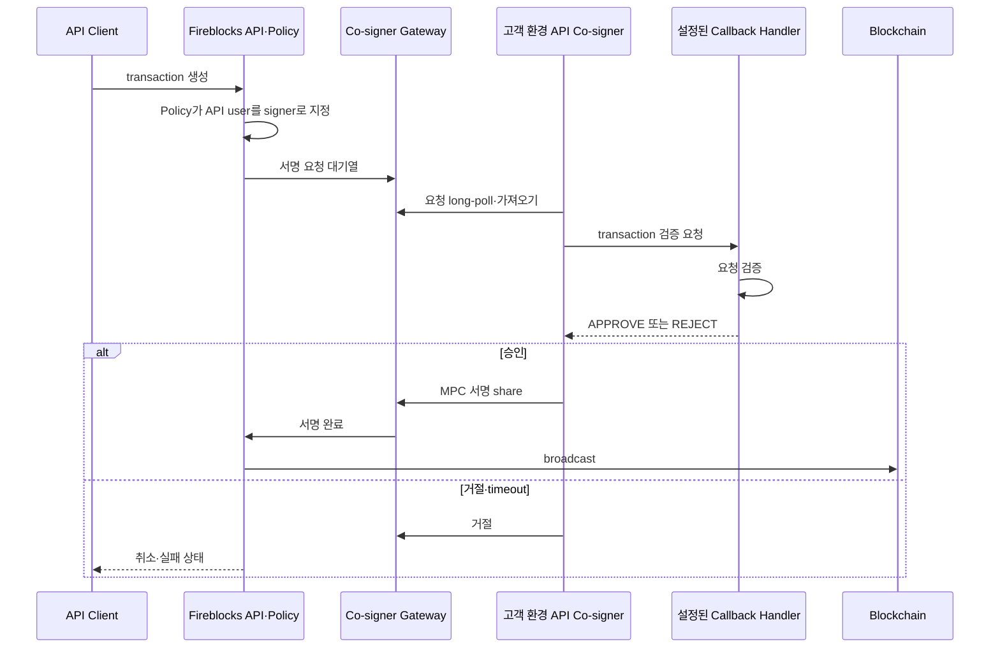

# 자동 서명 경로

API Co-signer는 모바일 사용자의 개입 없이 transaction 서명과 일부 workspace 승인을 자동화하는 고객 호스팅 컴포넌트다. Policy가 Co-signer와 짝지은 API user를 designated signer로 선택하면 서명 요청이 Co-signer로 전달된다.

## 구조

[Fireblocks 공식 Co-signer 구조](https://developers.fireblocks.com/docs/cosigner-architecture-overview)는 Callback Handler가 설정되지 않은 API user의 요청을 Co-signer가 자동 승인·서명한다고 설명한다.

## Callback Handler의 역할

Callback Handler가 설정되면 API Co-signer는 서명 전에 Handler의 `APPROVE` 또는 `REJECT` 결정을 받는다. 설정되지 않은 API user의 요청은 Co-signer가 자동 승인·서명할 수 있다.

## 인증 채널

[Callback Handler 설정 문서](https://developers.fireblocks.com/docs/create-api-co-signer-callback-handler)는 공개키 기반 signed JWT 방식과 certificate pinning 기반 채널을 설명한다.

| 방식 | 검증 |
|---|---|
| Public key | Co-signer 요청 JWT와 Handler 응답 JWT의 서명 검증 |
| Certificate pinning | TLS 협상에서 등록 certificate 확인 |

Callback 응답에는 시간 제한이 있다. 공식 AML Callback Handler 예시는 30초 안에 응답하지 못하면 transaction이 서명되지 않고 취소된다고 안내한다.
