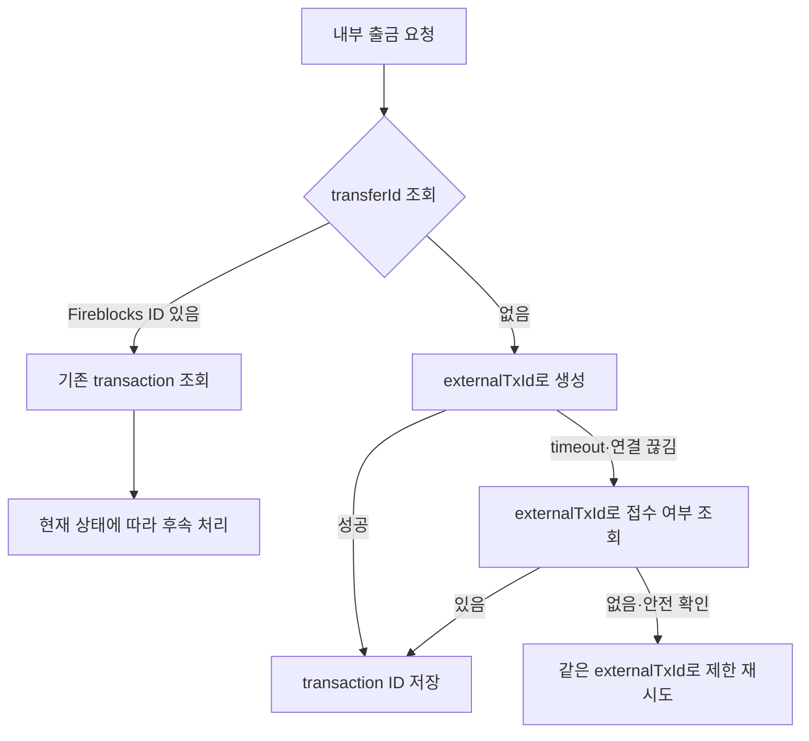
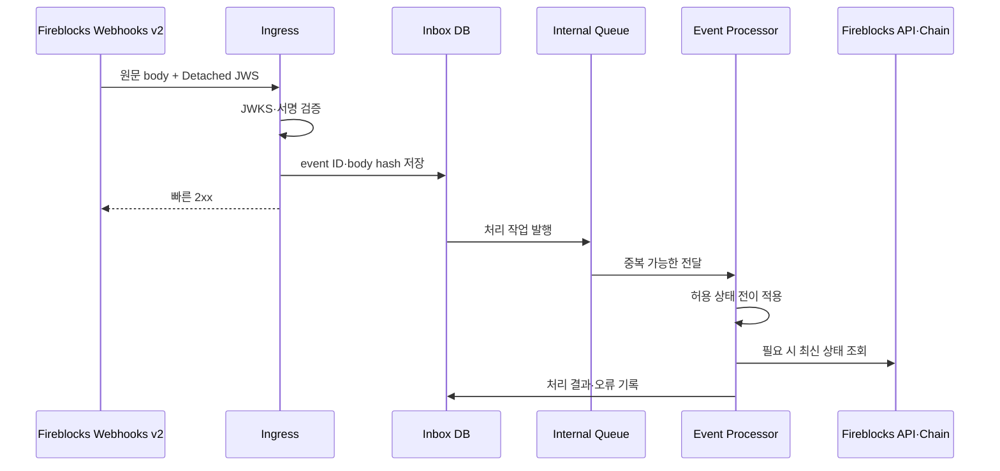

# API와 이벤트 처리

Fireblocks API 호출의 성공, webhook 수신, 체인 확정은 서로 다른 신호다. 블록체인 매니저는 이 신호를 내부 transfer ID로 연결하고, 중복·역순·누락이 있어도 최종 상태로 수렴시켜야 한다.

## API 인증

API user는 API key와 RSA private key로 요청 JWT를 만든다. 이 private key는 자산 transaction에 참여하는 MPC share가 아니다.

| 통제 | 운영 기준 |
|---|---|
| API user 분리 | 제출, 조회, webhook 관리, 컴플라이언스 등 용도별로 분리 |
| 역할 | 필요한 endpoint와 transaction 행동에 맞는 최소 역할 |
| Private key | secret manager·HSM에 저장하고 파일·이미지·CI log에 포함 금지 |
| IP allowlist | production egress·DR 주소만 허용하고 변경 승인 절차 운영 |
| Rotation | 새 key 병행 검증 후 전환, 사용량과 실패율 감시 |
| 환경 | Sandbox·Testnet·Production credential과 endpoint 완전 분리 |

동일 API user를 여러 서비스가 공유하면 어느 서비스가 transaction을 만들었는지 감사하기 어렵고 하나의 key 침해가 넓게 번진다. 서비스별 user와 `externalTxId` namespace를 둔다.

## Transaction 생성

```json
{
  "externalTxId": "wd_20260818_00042",
  "assetId": "USDC_ETH",
  "source": {
    "type": "VAULT_ACCOUNT",
    "id": "101"
  },
  "destination": {
    "type": "ONE_TIME_ADDRESS",
    "oneTimeAddress": {
      "address": "0x...",
      "tag": ""
    }
  },
  "amount": "2500.00",
  "note": "transfer:wd_20260818_00042"
}
```

예시는 계약을 고정하는 payload가 아니다. 지원 필드와 destination type은 API version·workspace·asset에 따라 확인한다. 업무 시스템은 다음 값을 별도 정본으로 보관한다.

- 내부 transfer ID와 Fireblocks transaction ID
- `externalTxId`와 요청 payload hash
- Workspace·Vault Account·vendor asset ID
- 원 주소·tag·network와 정책상 counterparty
- 요청·응답 시각, API user, Policy 결과
- txHash, fee, 최종 chain confirmation

금액은 decimal 문자열로 다루고 asset ID에 network가 포함된다고 하더라도 우리 asset master와 명시적으로 매핑한다. `note`에 고객 PII나 컴플라이언스 원문을 넣지 않는다.

## 멱등 호출



HTTP timeout은 요청이 Fireblocks에 도착하지 않았다는 뜻이 아니다. 새 `externalTxId`로 다시 만들지 않고 기존 접수 여부를 확인한다. DB 저장 전에 응답이 끊기는 상황을 대비해 outbox와 reconciliation job을 둔다.

## Webhooks v2 수신

[Fireblocks 마이그레이션 안내](https://developers.fireblocks.com/reference/webhook-v2-migration-guide)는 Webhooks v1의 지원 종료일을 2026년 6월 15일로 안내했다. 신규 운영 설계와 기존 연동 마이그레이션은 v2를 기준으로 한다. v2는 전달 관측성과 재전송 기능을 제공하지만 수신 애플리케이션의 멱등 처리와 독립 대사를 대신하지 않는다.

[공식 webhook 검증 문서](https://developers.fireblocks.com/reference/validating-webhooks)는 `Fireblocks-Webhook-Signature`의 Detached JWS와 JWKS `kid` 기반 key lookup을 설명한다.



### 서명 검증

1. 프록시·framework가 수정하기 전의 raw request body bytes를 확보한다.
2. JWS header의 `kid`로 Fireblocks JWKS key를 찾는다.
3. detached payload를 원문 body와 결합해 알고리즘·서명을 검증한다.
4. 알려지지 않은 `kid`는 JWKS를 안전하게 새로 읽은 뒤 한 번 더 확인한다.
5. 서명 실패 이벤트는 상태를 바꾸지 않고 보안 경보로 보낸다.
6. signature header와 원문 body를 일반 애플리케이션 로그에 남기지 않는다.

JWKS cache는 정상 만료·rotation을 지원하되, key 조회 실패 때 서명 검증을 생략하지 않는다.

## 중복·역순·누락

| 문제 | 대응 |
|---|---|
| 같은 event 재전송 | notification·event ID와 body hash로 inbox 멱등 저장 |
| 상태 역순 | 허용 상태 전이표와 최신 resource 조회로 수렴 |
| event 누락 | 주기적 transaction 조회와 v2 재전송 기능 사용 |
| 알 수 없는 transaction | 격리 큐, `externalTxId`·Vault·시각으로 조사 |
| 처리기 장애 | 2xx 이전 raw event 영속화, queue 재시도 |
| 장기 지연 | webhook lag·미처리 inbox·Fireblocks delivery metric 경보 |

`COMPLETED` 뒤 늦게 온 `PENDING_SIGNATURE` 이벤트로 상태를 되돌리지 않는다. 다만 체인 reorg·transaction replacement처럼 실제로 후속 조치가 필요한 event는 별도 상태 모델로 반영한다.

## 조회·대사

Webhook은 알림이고 Fireblocks API도 블록체인의 대체 원장은 아니다.

```text
내부 transaction 상태
↕ transferId · externalTxId
Fireblocks transaction 상태
↕ Fireblocks ID · txHash
블록체인 transaction·receipt·confirmation
↕ address · amount · token movement
내부 회계 원장
```

주기적 대사는 다음 차이를 찾는다.

- 내부에는 제출 중인데 Fireblocks transaction이 없는 건
- Fireblocks에는 존재하지만 내부 transfer와 연결되지 않은 건
- Fireblocks는 완료인데 txHash·receipt가 체인 정책과 맞지 않는 건
- 체인 입금은 확정됐지만 webhook·귀속이 누락된 건
- 취소·실패했지만 내부 금액 잠금이 남은 건
- 수수료·실제 전송액과 내부 회계가 다른 건

## Rate limit과 재시도

- endpoint·API user별 제한을 metric으로 관찰한다.
- 429의 `Retry-After`를 우선하고 지수 백오프와 jitter를 적용한다.
- 조회와 생성 호출의 재시도 정책을 분리한다.
- 높은 우선순위 출금이 대량 대사 조회에 막히지 않도록 queue와 예산을 분리한다.
- Circuit breaker가 열려도 미확인 출금을 다른 경로로 중복 제출하지 않는다.
- webhook 복구 조회는 시간 구간과 cursor를 저장해 재시작 가능하게 한다.

## Workspace freeze

Workspace freeze는 outgoing 활동을 제한하지만 incoming transfer는 계속 발생할 수 있다. 사고 대응 중에도 webhook 수신과 입금 감시·대사를 유지한다.

1. freeze 결정 권한과 증거 기준을 정한다.
2. API key·사용자·장치·Policy 변경 이력을 보존한다.
3. 들어오는 입금을 계속 감지하되 고객 가용 정책을 별도로 적용한다.
4. Owner와 Fireblocks Support를 통한 해제 절차를 시작한다.
5. 해제 전에 credential·Policy·Co-signer·Callback Handler를 검증한다.
6. freeze 기간 transaction과 내부 잔액을 전수 대사한다.

## 운영 점검

- [ ] API user·RSA key가 서비스와 환경별로 분리돼 있다.
- [ ] create timeout 뒤 `externalTxId`로 기존 접수를 확인한다.
- [ ] Webhooks v2 raw body의 Detached JWS를 JWKS로 검증한다.
- [ ] inbox 영속화 뒤 2xx하고, 처리기는 중복·역순에 안전하다.
- [ ] webhook 누락을 API·chain 대사와 재전송으로 복구한다.
- [ ] Fireblocks ID·externalTxId·transfer ID·txHash를 양방향 검색할 수 있다.
- [ ] freeze 중 incoming 감시와 사고 후 전수 대사 절차가 있다.
