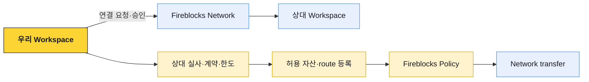

# 외부 연동과 책임

Fireblocks Network, AML·Travel Rule provider, Address Registry 같은 기능은 상대 발견과 거래 통제를 보완한다. 연결돼 있다는 사실만으로 법적 관계, 상대 실사, 고객 원장과 규제 의무가 자동 완결되지는 않는다.

## Fireblocks Network

Fireblocks Network는 기관 고객이 서로 검색·연결하고 자산을 이체하는 P2P 네트워크다. 연결 승인과 자동화된 주소 확인을 통해 수동 주소 전달 위험을 줄일 수 있다.



Network connection은 다음을 대신하지 않는다.

- 상대 법인·VASP·수탁기관의 KYC·KYB와 계약
- 관할·제재·AML 위험평가
- 자산·네트워크·tag·memo별 입금 route 검증
- 트래블룰 정보 교환과 수취인 일치 확인
- 거래 한도·정산 조건·오류 반환 책임

연결 ID, 상대 법인 ID, 허용 자산과 업무 counterparty master를 별도로 매핑한다. 상대가 Network 이름을 바꾸거나 연결을 재설정해도 기존 거래의 법인을 추적할 수 있어야 한다.

## Smart Transfer

Smart Transfer는 연결된 당사자들이 ticket과 여러 자산 이동을 사용해 정산을 조정하는 워크플로다. 일반 transfer와 같은 단일 outgoing transaction으로 축약하지 않는다.

검토할 항목은 다음과 같다.

- ticket의 당사자와 각 funding leg의 법적 의무
- 한쪽 leg만 funding된 상태의 노출과 timeout
- 각 자산 이동의 온체인 finality와 완료 판정
- cancel·expire 뒤 이미 전송된 자산의 처리
- 수수료, partial funding, dispute와 운영자 권한
- 내부 거래·회계 ID와 ticket·transaction ID 매핑

제품의 `완료`가 여러 블록체인 leg의 원자적 커밋을 의미한다고 추정하지 않는다. 사용하는 workflow의 실제 보장과 실패 상태를 계약·테스트로 확인한다.

## AML screening

Fireblocks는 외부 AML provider와 screening 흐름을 연결할 수 있다. 우리 시스템은 provider 결과를 공통 verdict로 정규화하고 실패·unknown·timeout 정책을 명시한다.

| 결과 | 기본 처리 | 확인할 것 |
|---|---|---|
| Clear·Accept | 다른 통제를 통과하면 진행 | 검사 provider·정책 버전·검사 시각 |
| Review·Pending | 출금 제출·입금 가용 보류 | 수동 심사 SLA·필요 자료 |
| Reject·Block | 거래 차단·격리 | 법적 보고·고객 안내·반환 정책 |
| Error·Unavailable | fail-close, 기술 재시도 | provider 장애인지 형식 오류인지 구분 |

API Co-signer Callback Handler에서 third-party AML을 호출하는 구조는 응답 시간 제한을 고려해야 한다. 가능하면 거래 생성 전 screening을 완료하고 Callback에서는 승인 레코드와 transaction을 재검증한다.

## 트래블룰

트래블룰은 온체인 transaction과 별도의 VASP 간 개인정보 교환이다. Fireblocks·Notabene 연동을 사용해도 다음 책임은 우리에게 남는다.

- 국내외 규칙과 임계값·면제 판정
- 상대 VASP의 실제 도달성과 protocol 선택
- 송금인·수취인 IVMS101 데이터의 정합성·최소화
- 개인지갑 소유·통제 증명과 위험 기반 정책
- provider 미응답·불일치·거절 시 출금·입금 처리
- 보존·정정·접근 통제와 감사

세부 구현은 [트래블룰 문서 묶음](../트래블룰/00-overview.md)과 [게이트 운영](../트래블룰/07-gateway-operations.md)을 따른다. Fireblocks transaction에 travel rule message를 실어 보내는 경우에도 컴플라이언스 게이트가 판정의 정본이고 블록체인 매니저는 내용을 해석하지 않는다.

## Address·counterparty 정보

Address Registry나 Network directory의 결과는 상대 발견과 교차 확인 신호로 사용한다. 조회되지 않는다는 사실만으로 개인지갑·불법 주소·미준수 VASP라고 판정하지 않는다. 지원 범위, 상대 opt-in, product entitlement와 데이터 최신성 때문에 결과가 없을 수 있다.

반대로 registry에서 법인이 조회된다고 그 주소의 현재 소유권, 수취 고객, 트래블룰 완료가 모두 증명되는 것도 아니다. 주소, network, 법인, VASP ID, 확인 출처와 시각을 별도 evidence로 저장한다.

## 책임 경계

| 영역 | Fireblocks가 제공하는 것 | 우리가 책임질 것 |
|---|---|---|
| 키·서명 | MPC·외부 HSM 연동, signer·backup 기능 | 배포 선택, 장치·Co-signer·HSM 운영과 복구 훈련 |
| 권한 | 역할, Admin Quorum, Approval Group, Policy | 조직 직무 매핑, 최소권한, 퇴사·부재·승계 |
| 거래 | transaction 생성·상태·broadcast·confirmation 추적 | 고객 의사, 잔액·한도, 멱등성, 수수료와 내부 원장 |
| 자동 서명 | API Co-signer와 Callback 연결 | Handler 검증, fail-close, HA, payload 의미 검증 |
| 체인 | 자산·주소·fee·network 연동 | 상품 지원 범위, chain risk, 입출금·finality 정책 |
| 컴플라이언스 | provider 연결과 vendor 상태 | 법적 적용, 정책·예외·반환, PII와 기록 |
| 관측성 | API, Webhooks v2, Audit Log | inbox·대사·SIEM 보존, 사고 대응 |

## Audit 연결

Fireblocks Audit Log와 webhook만으로 고객 의사와 내부 원장 변경을 설명할 수 없다. 다음 식별자를 하나의 감사 사슬로 연결한다.

```text
고객 요청 ID
→ 내부 transfer ID·승인 기록
→ 컴플라이언스 verification ID
→ Fireblocks externalTxId·transaction ID·Policy 결과
→ signer·Callback 결정
→ txHash·chain receipt
→ 내부 원장 journal·대사 결과
```

Audit Log·Policy export·사용자 변경은 SIEM과 변경 감사 저장소에 보존한다. 주소·PII·서명 payload는 필요한 범위만 별도 접근 통제로 보관한다.

## 도입 점검

- [ ] Network connection과 법적 counterparty master가 명시적으로 매핑돼 있다.
- [ ] Smart Transfer의 partial·timeout·cancel 상태를 회계 시나리오로 검증했다.
- [ ] AML·트래블룰 provider 장애를 통과로 바꾸지 않는다.
- [ ] Registry·directory 결과를 소유권·규제 완료의 단독 증거로 쓰지 않는다.
- [ ] Fireblocks 기능과 우리 책임이 운영 runbook·RACI에 반영돼 있다.
- [ ] 고객 요청부터 txHash·원장 journal까지 감사 ID가 연결된다.
